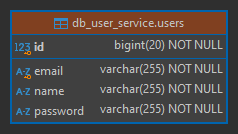

# Sección 02: Microservicio Usuarios

---

## Dependencias iniciales

Se muestran las dependencias agregadas desde `Spring Initializr`, además de la dependencia de `MapStruct` que se agregó
manualmente.

````xml

<!--Spring Boot 3.3.4-->
<!--java.version 21-->
<!--spring-cloud.version 2023.0.3-->
<!--org.mapstruct.version 1.6.0-->
<!--lombok-mapstruct-binding.version 0.2.0-->
<dependencies>
    <dependency>
        <groupId>org.springframework.boot</groupId>
        <artifactId>spring-boot-starter-data-jpa</artifactId>
    </dependency>
    <dependency>
        <groupId>org.springframework.boot</groupId>
        <artifactId>spring-boot-starter-validation</artifactId>
    </dependency>
    <dependency>
        <groupId>org.springframework.boot</groupId>
        <artifactId>spring-boot-starter-web</artifactId>
    </dependency>
    <dependency>
        <groupId>org.springframework.cloud</groupId>
        <artifactId>spring-cloud-starter-openfeign</artifactId>
    </dependency>
    <!--Agregado manualmente-->
    <dependency>
        <groupId>org.mapstruct</groupId>
        <artifactId>mapstruct</artifactId>
        <version>${org.mapstruct.version}</version>
    </dependency>
    <!--/Agregado manualmente-->

    <dependency>
        <groupId>com.mysql</groupId>
        <artifactId>mysql-connector-j</artifactId>
        <scope>runtime</scope>
    </dependency>
    <dependency>
        <groupId>org.projectlombok</groupId>
        <artifactId>lombok</artifactId>
        <optional>true</optional>
    </dependency>
    <dependency>
        <groupId>org.springframework.boot</groupId>
        <artifactId>spring-boot-starter-test</artifactId>
        <scope>test</scope>
    </dependency>
</dependencies>
````

Como vamos a trabajar con `MapStruct`, es necesario agregar en la sección de `plugins` algunas configuraciones para que
habilite la dependencia para la realización de mapeos y además, se permita el trabajo en conjunto con `Lombok`.

````xml

<plugins>
    <!--MapStruct-->
    <plugin>
        <groupId>org.apache.maven.plugins</groupId>
        <artifactId>maven-compiler-plugin</artifactId>
        <version>${maven-compiler-plugin.version}</version>
        <configuration>
            <source>${java.version}</source>
            <target>${java.version}</target>
            <annotationProcessorPaths>
                <path>
                    <groupId>org.mapstruct</groupId>
                    <artifactId>mapstruct-processor</artifactId>
                    <version>${org.mapstruct.version}</version>
                </path>
                <path>
                    <groupId>org.projectlombok</groupId>
                    <artifactId>lombok</artifactId>
                    <version>${lombok.version}</version>
                </path>
                <path>
                    <groupId>org.projectlombok</groupId>
                    <artifactId>lombok-mapstruct-binding</artifactId>
                    <version>${lombok-mapstruct-binding.version}</version>
                </path>
            </annotationProcessorPaths>
        </configuration>
    </plugin>
    <!--/MapStruct-->
</plugins>
````

## Configura el contexto de persistencia JPA/Hibernate

En el `application.yml` del servicio `user-service` configuramos las siguientes propiedades.

````yml
server:
  port: 8001
  error:
    include-message: always

spring:
  application:
    name: user-service
  datasource:
    url: jdbc:mysql://localhost:3306/db_user_service
    username: admin
    password: magadiflo
  jpa:
    hibernate:
      ddl-auto: update
    properties:
      hibernate:
        format_sql: true

logging:
  level:
    dev.magadiflo.user.app: DEBUG
    org.hibernate.SQL: DEBUG
````

Notar que hemos establecido la conexión a la base de datos de `mysql` que actualmente se está ejecutando en mi máquina
física. Más adelante trabajaré con bases de datos contenerizadas, pero lo que quiero dejar en claro es que hasta este
punto, estoy trabajando con `mysql` instalada en mi máquina local.

## Entity User

Creamos nuestra entidad `User` con el que trabajaremos en esta aplicación. Crearemos las tablas de las bases de datos
a partir de esta clase de entidad, así que las anotaciones sobre los campos se aplicarán la primera vez que se crea
la tabla en la base de datos, por ejemplo, para el campo `name` en la base de datos se establecerá que no admite
`nulos`.

````java

@ToString
@AllArgsConstructor
@NoArgsConstructor
@Builder
@Setter
@Getter
@Entity
@Table(name = "users")
public class User {
    @Id
    @GeneratedValue(strategy = GenerationType.IDENTITY)
    private Long id;

    @Column(nullable = false)
    private String name;

    @Column(nullable = false, unique = true)
    private String email;

    @Column(nullable = false)
    private String password;
}
````

## Construye tabla users a partir de entidad User

Si hasta este punto ejecutamos la aplicación, veremos que la tabla se crea correctamente en nuestra base de datos de
`MySQL`.



## Implementa el componente repository de acceso a datos

Creamos un repositorio para la entidad `User` que extienda de `CrudRepository`, donde le definiremos un método
personalizado para consultar por la existencia de un email.

````java
public interface UserRepository extends CrudRepository<User, Long> {
    boolean existsByEmail(String email);
}
````

## Define interfaz de mapeo y dtos

Para recibir información enviada desde el cliente usaremos el siguiente `dto`. Este `dto` define distintas
anotaciones de validación que realizaremos antes de pasar al servicio.

````java

@ToString
@AllArgsConstructor
@NoArgsConstructor
@Builder
@Setter
@Getter
public class UserRequest {
    @NotBlank
    private String name;

    @NotBlank
    @Email
    private String email;

    @NotBlank
    private String password;
}
````

Para devolver información al cliente, usaremos el siguiente `dto`.

````java

@ToString
@AllArgsConstructor
@NoArgsConstructor
@Builder
@Setter
@Getter
public class UserResponse {
    private Long id;
    private String name;
    private String email;
    private String password;
}
````

Como estamos trabajando con `MapStruct`, crearemos una interfaz de mapeo para poder convertir la entidad `User` en dto
y un dto en entidad `User`. Precisamente, para eso creamos los `dtos` anteriores.

````java

@Mapper(componentModel = MappingConstants.ComponentModel.SPRING)
public interface UserMapper {
    User toUserEntity(UserRequest userRequest);

    UserResponse toUserResponse(User user);

    @Mapping(target = "id", ignore = true)
    User updateUser(UserRequest userRequest, @MappingTarget User user);
}
````

## Manejo de excepciones

Antes de crear las distintas excepciones que manejaremos en nuestra aplicación, vamos a crear una clase que nos
permitirá uniformizar las respuestas, de esa manera el cliente siempre obtendrá el mismo formato de mensaje de error.

````java

@NoArgsConstructor
@AllArgsConstructor
@Builder
@Getter
@Setter
public class HttpErrorResponse {
    private HttpStatus httpStatus;

    private String message;

    private LocalDateTime timestamp;

    @JsonInclude(JsonInclude.Include.NON_NULL)
    private String path;

    @JsonInclude(JsonInclude.Include.NON_NULL)
    private Map<String, List<String>> errors;
}
````

Ahora, creamos las distintas excepciones que utilizaremos en nuestra aplicación.

````java
public class NotFoundException extends RuntimeException {
    public NotFoundException(String message) {
        super(message);
    }
}
````

````java
public class UserNotFound extends NotFoundException {
    public UserNotFound(Long userId) {
        super("No se encuentra el usuario con id [%d]".formatted(userId));
    }
}
````

````java
public class EmailAlreadyExistsException extends RuntimeException {
    public EmailAlreadyExistsException(String email) {
        super("El correo [%s] ya está asociado a otro usuario".formatted(email));
    }
}
````

Finalmente, nuestro controlador que manejará las excepciones.

````java

@Slf4j
@RestControllerAdvice
public class GlobalExceptionHandler {

    @ExceptionHandler(UserNotFound.class)
    public ResponseEntity<HttpErrorResponse> handleNotFoundException(NotFoundException exception,
                                                                     HttpServletRequest request) {
        return ResponseEntity.status(HttpStatus.NOT_FOUND)
                .body(HttpErrorResponse.builder()
                        .httpStatus(HttpStatus.NOT_FOUND)
                        .message(exception.getMessage())
                        .timestamp(LocalDateTime.now())
                        .path(request.getRequestURI())
                        .build());
    }

    @ExceptionHandler(EmailAlreadyExistsException.class)
    public ResponseEntity<HttpErrorResponse> handleEmailAlreadyExistsException(EmailAlreadyExistsException exception,
                                                                               HttpServletRequest request) {
        return ResponseEntity.status(HttpStatus.BAD_REQUEST)
                .body(HttpErrorResponse.builder()
                        .httpStatus(HttpStatus.BAD_REQUEST)
                        .message(exception.getMessage())
                        .timestamp(LocalDateTime.now())
                        .path(request.getRequestURI())
                        .build());
    }

    @ExceptionHandler(MethodArgumentNotValidException.class)
    public ResponseEntity<HttpErrorResponse> handleMethodArgumentNotValidException(MethodArgumentNotValidException exception,
                                                                                   HttpServletRequest request) {
        Map<String, List<String>> errors = new HashMap<>();

        exception.getBindingResult().getFieldErrors().forEach(fieldError -> {
            String field = fieldError.getField();
            String defaultMessage = fieldError.getDefaultMessage();
            errors.computeIfAbsent(field, k -> new ArrayList<>()).add(defaultMessage);
        });

        return ResponseEntity.status(HttpStatus.BAD_REQUEST)
                .body(HttpErrorResponse.builder()
                        .httpStatus(HttpStatus.BAD_REQUEST)
                        .message("Falló la validación de los campos")
                        .timestamp(LocalDateTime.now())
                        .path(request.getRequestURI())
                        .errors(errors)
                        .build());
    }

    @ExceptionHandler(Exception.class)
    public ResponseEntity<HttpErrorResponse> handleGenericException(Exception exception, HttpServletRequest request) {
        log.error("Ocurrió un error inesperado", exception);
        return ResponseEntity.status(HttpStatus.INTERNAL_SERVER_ERROR)
                .body(HttpErrorResponse.builder()
                        .httpStatus(HttpStatus.INTERNAL_SERVER_ERROR)
                        .message(exception.getMessage())
                        .timestamp(LocalDateTime.now())
                        .path(request.getRequestURI())
                        .build());
    }

}
````

## Implementa el componente Service

Definimos nuestra interfaz para el usuario.

````java
public interface UserService {
    List<UserResponse> findAllUsers();

    UserResponse findUser(Long userId);

    UserResponse saveUser(UserRequest userRequest);

    UserResponse updateUser(Long userId, UserRequest userRequest);

    void deleteUser(Long userId);
}
````

Finalmente, creamos la implementación de la interfaz anterior.

````java

@Slf4j
@RequiredArgsConstructor
@Service
@Transactional(readOnly = true)
public class UserServiceImpl implements UserService {

    private final UserRepository userRepository;
    private final UserMapper userMapper;

    @Override
    public List<UserResponse> findAllUsers() {
        return ((List<User>) this.userRepository.findAll()).stream()
                .map(this.userMapper::toUserResponse)
                .toList();
    }

    @Override
    public UserResponse findUser(Long userId) {
        return this.userRepository.findById(userId)
                .map(this.userMapper::toUserResponse)
                .orElseThrow(() -> new UserNotFound(userId));
    }

    @Override
    @Transactional
    public UserResponse saveUser(UserRequest userRequest) {
        if (this.userRepository.existsByEmail(userRequest.getEmail())) {
            throw new EmailAlreadyExistsException(userRequest.getEmail());
        }
        User userDB = this.userRepository.save(this.userMapper.toUserEntity(userRequest));
        return this.userMapper.toUserResponse(userDB);
    }

    @Override
    @Transactional
    public UserResponse updateUser(Long userId, UserRequest userRequest) {
        return this.userRepository.findById(userId)
                .map(userDB -> {
                    if (!userRequest.getEmail().equalsIgnoreCase(userDB.getEmail()) &&
                        this.userRepository.existsByEmail(userRequest.getEmail())) {
                        throw new EmailAlreadyExistsException(userRequest.getEmail());
                    }
                    return this.userMapper.updateUser(userRequest, userDB);
                })
                .map(this.userRepository::save)
                .map(this.userMapper::toUserResponse)
                .orElseThrow(() -> new UserNotFound(userId));
    }

    @Override
    @Transactional
    public void deleteUser(Long userId) {
        User userDB = this.userRepository.findById(userId)
                .orElseThrow(() -> new UserNotFound(userId));
        this.userRepository.delete(userDB);
    }
}
````

## Implementa el Controlador RestController y los métodos handler

````java

@RequiredArgsConstructor
@RestController
@RequestMapping(path = "/api/v1/users")
public class UserController {

    private final UserService userService;

    @GetMapping
    public ResponseEntity<List<UserResponse>> findAllUsers() {
        return ResponseEntity.ok(this.userService.findAllUsers());
    }

    @GetMapping(path = "/{userId}")
    public ResponseEntity<UserResponse> findUser(@PathVariable Long userId) {
        return ResponseEntity.ok(this.userService.findUser(userId));
    }

    @PostMapping
    public ResponseEntity<UserResponse> saveUser(@Valid @RequestBody UserRequest userRequest) {
        UserResponse userResponse = this.userService.saveUser(userRequest);
        URI location = ServletUriComponentsBuilder.fromCurrentRequest()
                .path("/{id}").buildAndExpand(userResponse.getId()).toUri();
        return ResponseEntity.created(location).body(userResponse);
    }

    @PutMapping(path = "/{userId}")
    public ResponseEntity<UserResponse> updateUser(@PathVariable Long userId, @Valid @RequestBody UserRequest userRequest) {
        return ResponseEntity.ok(this.userService.updateUser(userId, userRequest));
    }

    @DeleteMapping(path = "/{userId}")
    public ResponseEntity<Void> deleteUser(@PathVariable Long userId) {
        this.userService.deleteUser(userId);
        return ResponseEntity.noContent().build();
    }
}
````
