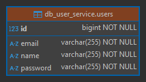

# Sección 02: Microservicio Usuarios

---

## Creando microservicio usuarios con spring boot y cloud

### Dependencias

Iniciamos mostrando las dependencias que serán utilizadas en el `user-service`. La única dependencia que agregamos
manualmente fue `MapStruct`, las demás dependencias las agregamos desde
[Spring Initializr (ver dependencias)](https://start.spring.io/#!type=maven-project&language=java&platformVersion=3.4.5&packaging=jar&jvmVersion=21&groupId=dev.magadiflo&artifactId=user-service&name=user-service&description=Demo%20project%20for%20Spring%20Boot&packageName=dev.magadiflo.user.app&dependencies=web,validation,data-jpa,mysql,lombok,actuator,cloud-starter).

````xml

<!--Spring Boot 3.4.5-->
<!--Spring Cloud 2024.0.1-->
<!--Java 21-->
<!--org.mapstruct.version 1.6.3-->
<!--lombok-mapstruct-binding.version 0.2.0-->
<dependencies>
    <dependency>
        <groupId>org.springframework.boot</groupId>
        <artifactId>spring-boot-starter-actuator</artifactId>
    </dependency>
    <dependency>
        <groupId>org.springframework.boot</groupId>
        <artifactId>spring-boot-starter-data-jpa</artifactId>
    </dependency>
    <dependency>
        <groupId>org.springframework.boot</groupId>
        <artifactId>spring-boot-starter-validation</artifactId>
    </dependency>
    <dependency>
        <groupId>org.springframework.boot</groupId>
        <artifactId>spring-boot-starter-web</artifactId>
    </dependency>
    <dependency>
        <groupId>org.springframework.cloud</groupId>
        <artifactId>spring-cloud-starter</artifactId>
    </dependency>
    <!--Agregado manualmente-->
    <dependency>
        <groupId>org.mapstruct</groupId>
        <artifactId>mapstruct</artifactId>
        <version>${org.mapstruct.version}</version>
    </dependency>
    <!--/Agregado manualmente-->

    <dependency>
        <groupId>com.mysql</groupId>
        <artifactId>mysql-connector-j</artifactId>
        <scope>runtime</scope>
    </dependency>
    <dependency>
        <groupId>org.projectlombok</groupId>
        <artifactId>lombok</artifactId>
        <optional>true</optional>
    </dependency>
    <dependency>
        <groupId>org.springframework.boot</groupId>
        <artifactId>spring-boot-starter-test</artifactId>
        <scope>test</scope>
    </dependency>
</dependencies>
````

### Procesadores de anotaciones

**Referencias**

- [Using MapStruct with Maven and Lombok.](https://bootify.io/spring-data/mapstruct-with-maven-and-lombok.html)
- [Using MapStruct With Lombok](https://www.baeldung.com/java-mapstruct-lombok)

Como vamos a trabajar con `MapStruct` necesitamos ampliar el `maven-compiler-plugin` para activar la generación de
código de `MapStruct`. Observar que nuestro primer procesador de anotaciones es `Lombok`, seguido directamente por
`MapStruct`. Se requiere otra referencia a `lombok-mapstruct-binding` para que estas dos bibliotecas funcionen juntas.
Sin `Lombok`, solo se necesitaría el `mapstruct-processor` en este momento.

````xml

<plugins>
    <!--MapStruct-->
    <plugin>
        <groupId>org.apache.maven.plugins</groupId>
        <artifactId>maven-compiler-plugin</artifactId>
        <version>${maven-compiler-plugin.version}</version>
        <configuration>
            <source>${java.version}</source>
            <target>${java.version}</target>
            <annotationProcessorPaths>
                <path>
                    <groupId>org.projectlombok</groupId>
                    <artifactId>lombok</artifactId>
                    <version>${lombok.version}</version>
                </path>
                <path>
                    <groupId>org.mapstruct</groupId>
                    <artifactId>mapstruct-processor</artifactId>
                    <version>${org.mapstruct.version}</version>
                </path>
                <path>
                    <groupId>org.projectlombok</groupId>
                    <artifactId>lombok-mapstruct-binding</artifactId>
                    <version>${lombok-mapstruct-binding.version}</version>
                </path>
            </annotationProcessorPaths>
        </configuration>
    </plugin>
    <!--/MapStruct-->
</plugins>
````

Es fácil cometer errores aquí, ya que los procesadores de anotaciones son una función avanzada. El principal error es
olvidar que nuestro entorno de ejecución buscará procesadores de anotaciones en el `path` o en el `classpath`, pero no
en ambas.

Debemos tener en cuenta que, para la versión `1.18.16 de Lombok y superiores`, necesitamos agregar tanto la dependencia
`lombok-mapstruct-binding` de `Lombok` como la dependencia `mapstruct-processor` en el elemento
`annotationProcessorPaths`. Si no lo hacemos, podríamos obtener un error de compilación:
`“Propiedad desconocida en el tipo de resultado…”`.

Necesitamos la dependencia `lombok-mapstruct-binding` para que `Lombok` y `MapStruct` funcionen juntos. En esencia, le
indica a `MapStruct` que espere hasta que `Lombok` haya completado todo el procesamiento de anotaciones antes de generar
clases de mapeador para los beans mejorados con `Lombok`.

## Configurando el contexto de persistencia JPA/Hibernate

En el `application.yml` del `user-service` configuramos las siguientes propiedades.

````yml
server:
  port: 8001
  error:
    include-message: always

spring:
  application:
    name: user-service
  datasource:
    url: jdbc:mysql://localhost:3306/db_user_service
    username: admin
    password: magadiflo
  jpa:
    hibernate:
      ddl-auto: update
    properties:
      hibernate:
        format_sql: true

logging:
  level:
    dev.magadiflo.user.app: debug
    org.hibernate.SQL: debug
````

> Notar que hemos establecido la conexión a la base de datos de `mysql` que actualmente se está ejecutando en mi máquina
> física. Más adelante trabajaremos con bases de datos contenerizadas. Por lo tanto, quiero dejar en claro es que por
> por el momento, trabajaremos con `mysql` instalada en mi máquina local.

## Entity User

Creamos nuestra entidad `User` con el que trabajaremos en esta aplicación. Crearemos las tablas de las bases de datos
a partir de esta clase de entidad, así que las anotaciones sobre los campos se aplicarán la primera vez que se cree
la tabla en la base de datos, por ejemplo, para el campo `name` en la base de datos se establecerá que no admite
`nulos`.

````java

@AllArgsConstructor
@NoArgsConstructor
@Builder
@Data
@Entity
@Table(name = "users")
public class User {
    @Id
    @GeneratedValue(strategy = GenerationType.IDENTITY)
    private Long id;

    @Column(nullable = false)
    private String name;

    @Column(nullable = false, unique = true)
    private String email;

    @Column(nullable = false)
    private String password;
}
````

## Construye tabla users a partir de entidad User

Si hasta este punto ejecutamos la aplicación, veremos que la tabla se crea correctamente en nuestra base de datos de
`MySQL`.



## Implementando el componente repository de acceso a datos

Creamos un repositorio para la entidad `User` que extienda de `JpaRepository`, donde le definiremos un método
personalizado para consultar por la existencia de un email.

````java
public interface UserRepository extends JpaRepository<User, Long> {
    boolean existsByEmail(String email);
}
````

## Definiendo dtos e interfaz de mapeo

Para recibir información del cliente crearemos el dto `UserRequest` usando un `record`. Este `dto` define distintas
anotaciones de validación que realizaremos antes de pasar al servicio.

````java
public record UserRequest(@NotBlank
                          String name,
                          @NotBlank
                          @Email
                          String email,
                          @NotBlank
                          String password) {
}
````

Para exponer información hacia el cliente crearemos el siguiente dto.

````java
public record UserResponse(Long id,
                           String name,
                           String email,
                           String password) {
}
````

Como estamos trabajando con `MapStruct` crearemos una interfaz de mapeo para poder convertir la entidad `User` en el
dto `UserResponse` y el dto `UserRequest` en una entidad `User`.

````java

@Mapper(componentModel = MappingConstants.ComponentModel.SPRING)
public interface UserMapper {
    UserResponse toUserResponse(User user);

    User toUser(UserRequest request);

    @Mapping(target = "id", ignore = true)
    User toUpdateUser(@MappingTarget User user, UserRequest request);
}
````

**Dónde**

- `@Mapper(componentModel = MappingConstants.ComponentModel.SPRING)`, indica que esta interfaz es un mapper de
  `MapStruct` y que debe ser registrada como un `componente Spring`, permitiendo la `inyección` con `@Autowired`.
- `@Mapping(target = "id", ignore = true)`, especifica que el campo `id` debe ignorarse durante el mapeo. Útil en
  actualizaciones para no sobrescribir el identificador original.
- `@MappingTarget`, señala que el primer parámetro (`User user`) es el objeto destino que se debe actualizar, en lugar
  de crear uno nuevo.

## Manejo de excepciones

Antes de crear las distintas excepciones que manejaremos en nuestra aplicación, vamos a crear una clase que nos
permitirá uniformizar las respuestas, de esa manera el cliente siempre obtendrá el mismo formato de mensaje de error.
En nuestro caso utilizaremos un `record` al que le llamaremos `ErrorResponse`.

````java

@JsonInclude(JsonInclude.Include.NON_NULL)
public record ErrorResponse(int status,
                            String error,
                            String message,
                            String path,
                            Map<String, List<String>> errors) {

    @JsonProperty
    public LocalDateTime timestamp() {
        return LocalDateTime.now().truncatedTo(ChronoUnit.SECONDS);
    }
}
````

**Dónde**

- `@JsonInclude(JsonInclude.Include.NON_NULL)`, cuando colocamos a nivel de clase (record o clase normal), le indicamos
  a `Jackson` que debe omitir en la serialización cualquier campo cuyo valor sea `null`, para todos los campos de ese
  tipo (no necesitamos anotar uno por uno los campos que posiblemente puedan ser `null`).
- La anotación `@JsonProperty` le dice a `Jackson` que debe incluir este método como una propiedad en el `JSON` de
  salida, aunque no sea parte del constructor del `record`.

Ahora, creamos las distintas excepciones que utilizaremos en nuestra aplicación.

````java
public class NotFoundException extends RuntimeException {
    public NotFoundException(String message) {
        super(message);
    }
}
````

Creamos la excepción `UserNotFound` que extenderá de la clase anterior.

````java
public class UserNotFoundException extends NotFoundException {
    public UserNotFoundException(Long userId) {
        super("No se encuentra el usuario con id [%d]".formatted(userId));
    }
}
````

La siguiente excepción es para cuando se intente asociar un correo a un usuario que ya lo tiene registrado.

````java
public class EmailAlreadyExistsException extends RuntimeException {
    public EmailAlreadyExistsException(String email) {
        super("El correo [%s] ya está asociado a otro usuario".formatted(email));
    }
}
````

A continuación creamos la clase global que manejará las excepciones.

````java

@Slf4j
@RestControllerAdvice
public class GlobalExceptionHandler {

    @ExceptionHandler(UserNotFoundException.class)
    public ResponseEntity<ErrorResponse> handleNotFoundException(UserNotFoundException exception, HttpServletRequest request) {
        log.error("Usuario no encontrado: {}", exception.getMessage());
        ErrorResponse errorResponse = new ErrorResponse(
                HttpStatus.NOT_FOUND.value(),
                HttpStatus.NOT_FOUND.getReasonPhrase(),
                exception.getMessage(),
                request.getRequestURI(),
                null
        );
        return ResponseEntity.status(HttpStatus.NOT_FOUND).body(errorResponse);
    }

    @ExceptionHandler(EmailAlreadyExistsException.class)
    public ResponseEntity<ErrorResponse> handleEmailAlreadyExistsException(EmailAlreadyExistsException exception, HttpServletRequest request) {
        log.error("El email ya existe: {}", exception.getMessage());
        ErrorResponse errorResponse = new ErrorResponse(
                HttpStatus.BAD_REQUEST.value(),
                HttpStatus.BAD_REQUEST.getReasonPhrase(),
                exception.getMessage(),
                request.getRequestURI(),
                null
        );
        return ResponseEntity.status(HttpStatus.BAD_REQUEST).body(errorResponse);
    }

    @ExceptionHandler(MethodArgumentNotValidException.class)
    public ResponseEntity<ErrorResponse> handleMethodArgumentNotValidException(MethodArgumentNotValidException exception, HttpServletRequest request) {
        log.error("Error en argumentos: {}", exception.getMessage());
        Map<String, List<String>> errors = new HashMap<>();
        exception.getBindingResult().getFieldErrors().forEach(fieldError -> {
            String field = fieldError.getField();
            String defaultMessage = fieldError.getDefaultMessage();
            errors.computeIfAbsent(field, k -> new ArrayList<>()).add(defaultMessage);
        });

        ErrorResponse errorResponse = new ErrorResponse(
                HttpStatus.BAD_REQUEST.value(),
                HttpStatus.BAD_REQUEST.getReasonPhrase().concat(": falló la validación de los campos."),
                exception.getMessage(),
                request.getRequestURI(),
                errors
        );
        return ResponseEntity.status(HttpStatus.BAD_REQUEST).body(errorResponse);
    }

    @ExceptionHandler(Exception.class)
    public ResponseEntity<ErrorResponse> handleGenericException(Exception exception, HttpServletRequest request) {
        log.error("Error genérico: {}", exception.getMessage());
        ErrorResponse errorResponse = new ErrorResponse(
                HttpStatus.INTERNAL_SERVER_ERROR.value(),
                HttpStatus.INTERNAL_SERVER_ERROR.getReasonPhrase(),
                exception.getMessage(),
                request.getRequestURI(),
                null
        );
        return ResponseEntity.status(HttpStatus.INTERNAL_SERVER_ERROR).body(errorResponse);
    }
}
````

## Implementando el componente Service

Definimos nuestra interfaz para la lógica que aplicaremos al usuario.

````java
public interface UserService {
    List<UserResponse> findAllUsers();

    UserResponse findUser(Long userId);

    UserResponse saveUser(UserRequest userRequest);

    UserResponse updateUser(Long userId, UserRequest userRequest);

    void deleteUser(Long userId);
}
````

Implementamos la interfaz anterior con el crud para el usuario.

````java

@Slf4j
@RequiredArgsConstructor
@Service
@Transactional(readOnly = true)
public class UserServiceImpl implements UserService {

    private final UserRepository userRepository;
    private final UserMapper userMapper;

    @Override
    public List<UserResponse> findAllUsers() {
        return this.userRepository.findAll().stream()
                .map(this.userMapper::toUserResponse)
                .toList();
    }

    @Override
    public UserResponse findUser(Long userId) {
        return this.userRepository.findById(userId)
                .map(this.userMapper::toUserResponse)
                .orElseThrow(() -> new UserNotFoundException(userId));
    }

    @Override
    @Transactional
    public UserResponse saveUser(UserRequest userRequest) {
        if (this.userRepository.existsByEmail(userRequest.email())) {
            throw new EmailAlreadyExistsException(userRequest.email());
        }
        User userDB = this.userRepository.save(this.userMapper.toUser(userRequest));
        return this.userMapper.toUserResponse(userDB);
    }

    @Override
    @Transactional
    public UserResponse updateUser(Long userId, UserRequest userRequest) {
        return this.userRepository.findById(userId)
                .map(userDB -> {
                    if (!userRequest.email().equalsIgnoreCase(userDB.getEmail()) &&
                            this.userRepository.existsByEmail(userRequest.email())) {
                        throw new EmailAlreadyExistsException(userRequest.email());
                    }
                    return this.userMapper.toUpdateUser(userDB, userRequest);
                })
                .map(this.userRepository::save)
                .map(this.userMapper::toUserResponse)
                .orElseThrow(() -> new UserNotFoundException(userId));
    }

    @Override
    @Transactional
    public void deleteUser(Long userId) {
        User userDB = this.userRepository.findById(userId)
                .orElseThrow(() -> new UserNotFoundException(userId));
        this.userRepository.delete(userDB);
    }
}
````

## Implementando el controlador RestController y los métodos handler

````java

@Slf4j
@RequiredArgsConstructor
@RestController
@RequestMapping(path = "/api/v1/users")
public class UserController {

    private final UserService userService;

    @GetMapping
    public ResponseEntity<List<UserResponse>> findAllUsers() {
        return ResponseEntity.ok(this.userService.findAllUsers());
    }

    @GetMapping(path = "/{userId}")
    public ResponseEntity<UserResponse> findUser(@PathVariable Long userId) {
        return ResponseEntity.ok(this.userService.findUser(userId));
    }

    @PostMapping
    public ResponseEntity<UserResponse> saveUser(@Valid @RequestBody UserRequest userRequest) {
        UserResponse userResponse = this.userService.saveUser(userRequest);
        URI location = ServletUriComponentsBuilder.fromCurrentRequest()
                .path("/{userId}")
                .buildAndExpand(userResponse.id())
                .toUri();
        return ResponseEntity.created(location).body(userResponse);
    }

    @PutMapping(path = "/{userId}")
    public ResponseEntity<UserResponse> updateUser(@PathVariable Long userId, @Valid @RequestBody UserRequest userRequest) {
        return ResponseEntity.ok(this.userService.updateUser(userId, userRequest));
    }

    @DeleteMapping(path = "/{userId}")
    public ResponseEntity<Void> deleteUser(@PathVariable Long userId) {
        this.userService.deleteUser(userId);
        return ResponseEntity.noContent().build();
    }

}
````
