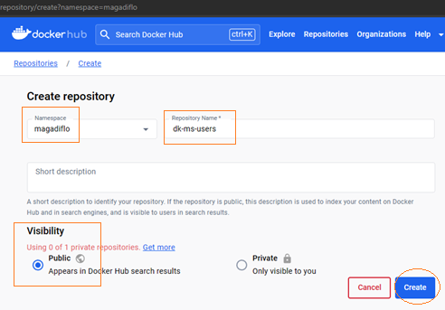
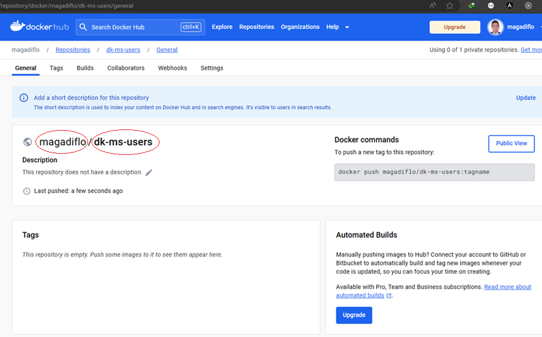
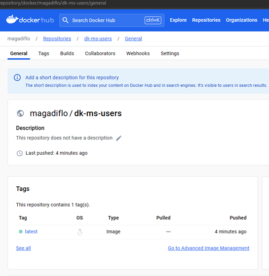

# Sección 12: Docker Hub: Repositorio para compartir imágenes en la nube

---

`Docker Hub` es un repositorio en la nube que permite compartir, almacenar e implementar imágenes Docker.

## Creando nuestro repositorio y enviando imagen a Docker Hub con push

### Creando repositorio en Docker Hub

En esta sección almacenaremos las imágenes de nuestros microservicios en `Docker Hub`. Para eso necesitamos ingresar
a la web de [hub.docker](https://hub.docker.com/) con nuestras credenciales previamente registradas.

Para no repetir los pasos, mostraré cómo haremos la subida de las imágenes a Docker Hub con el
microservicio `dk-ms-users`:

1. Crear un repositorio para la imagen a subir. En este caso, el nombre del repositorio a crear será igual que el nombre
   del microservicio `dk-ms-users`:

   

2. Repositorio recién creado para el microservicio dk-ms-users

   

**NOTA**
> Hay dos cosas importantes que debemos ver luego de la creación del repositorio:
>
> 1. El nombre completo de la imagen a subir debe ser igual al nombre del usuario / nombre del repositorio. Es decir, la
     imagen a pushear desde local debe tener ese nombre `magadiflo/dk-ms-users`.
> 2. Observemos cómo es que, luego de la creación del repositorio nos muestra el comando de ejemplo para poder enviar a
     este repositorio una nueva etiqueta:
>
> `docker push magadiflo/dk-ms-users:tagname`

### Enviando imagen desde local hacia Docker Hub

Verificamos qué imágenes tenemos en local:

````bash
$ docker image ls
REPOSITORY      TAG         IMAGE ID       CREATED       SIZE
dk-ms-users     latest      9750159d18ce   2 days ago    387MB
dk-ms-courses   latest      a66bf68642d1   3 days ago    385MB
mysql           8           a3b6608898d6   12 days ago   596MB
postgres        14-alpine   ed089947c1bd   4 weeks ago   236MB
````

Para este ejemplo, nos interesa la imagen `dk-ms-users` con tag `latest`, pero observemos que `NO tenemos el mismo
nombre que nos solicita Docker Hub`, que como recordaremos es: `magadiflo/dk-ms-users` y en nuestro caso el nombre del
repositorio en local solo dice `dk-ms-users` **¿qué podemos hacer?**

1. **Primera forma**, podemos volver a crear una nueva imagen con el nombre requerido:

    ````bash
    $ docker build -t magadiflo/dk-ms-users . -f .\business-domain\dk-ms-users\Dockerfile
    
    $ docker image ls
    REPOSITORY              TAG         IMAGE ID       CREATED       SIZE
    dk-ms-users             latest      9750159d18ce   2 days ago    387MB
    magadiflo/dk-ms-users   latest      57dbf1de4567   2 days ago    387MB
    dk-ms-courses           latest      a66bf68642d1   3 days ago    385MB
    mysql                   8           a3b6608898d6   12 days ago   596MB
    postgres                14-alpine   ed089947c1bd   4 weeks ago   236MB
    ````

2. **Segunda forma**, a partir de una imagen existente la podemos volver a etiquetar:

    ````bash
    $ docker image ls
    REPOSITORY      TAG         IMAGE ID       CREATED       SIZE
    dk-ms-users     latest      9750159d18ce   2 days ago    387MB
    dk-ms-courses   latest      a66bf68642d1   3 days ago    385MB
    mysql           8           a3b6608898d6   12 days ago   596MB
    postgres        14-alpine   ed089947c1bd   4 weeks ago   236MB
   
    $ docker tag dk-ms-users magadiflo/dk-ms-users
   
    $ docker image ls
    REPOSITORY              TAG         IMAGE ID       CREATED       SIZE
    dk-ms-users             latest      9750159d18ce   2 days ago    387MB
    magadiflo/dk-ms-users   latest      9750159d18ce   2 days ago    387MB
    dk-ms-courses           latest      a66bf68642d1   3 days ago    385MB
    mysql                   8           a3b6608898d6   12 days ago   596MB
    postgres                14-alpine   ed089947c1bd   4 weeks ago   236MB
    ````

   Si observamos el resultado anterior, luego de usar el `docker tag`, veremos que tenemos la imagen base (imagen del
   cual se tomó para generar la nueva imagen) y la nueva imagen. Ambos tienen el mismo `IMAGE ID`:

    ````bash
    dk-ms-users             latest      9750159d18ce   2 days ago    387MB
    magadiflo/dk-ms-users   latest      9750159d18ce   2 days ago    387MB 
    ````

Ahora que ya tenemos en nuestra máquina local la imagen con el nombre correcto que espera recibir el repositorio de
`Docker Hub`, llega el momento de subir esa imagen.

Si nunca nos hemos logueados mediante la terminal, debemos hacerlo:

````bash
$ docker login
Log in with your Docker ID or email address to push and pull images from Docker Hub. If you don't have a Docker ID, head over to https://hub.docker.com/ to create one.
You can log in with your password or a Personal Access Token (PAT). Using a limited-scope PAT grants better security and is required for organizations using SSO. Learn more at https://docs.docker.com/go/access-tokens/

Username: magadiflo@gmail.com
Password:
Login Succeeded
````

Una vez logueados, podemos enviar nuestra imagen a docker hub:

````bash
$ docker push magadiflo/dk-ms-users
Using default tag: latest
The push refers to repository [docker.io/magadiflo/dk-ms-users]
2bd2ae00f00a: Pushed
334322edcbb5: Pushed
8bfd963f363c: Pushed
34f7184834b2: Mounted from library/openjdk
5836ece05bfd: Mounted from library/openjdk
72e830a4dff5: Mounted from library/openjdk
latest: digest: sha256:3119dc0a31622211d8c9e00b9430be86b69cfacc939288665135590cdbaee43f size: 1577
````

**NOTA**
> Por defecto, al no definir un tag específico, se utiliza el tag `latest`.

Si revisamos el repositorio de `docker hub` veremos que nuestra imagen fue subida:



## Bajando imagen desde Docker Hub con pull

Para esta sección empezaremos sin imágenes en nuestra plataforma local de docker:

````bash
$ docker image ls
REPOSITORY   TAG       IMAGE ID   CREATED   SIZE
````

Ahora, bajaremos la imagen `magadiflo/dk-ms-users` desde `Docker Hub`:

````bash
$ docker pull magadiflo/dk-ms-users
Using default tag: latest
latest: Pulling from magadiflo/dk-ms-users
5843afab3874: Already exists
53c9466125e4: Already exists
d8d715783b80: Already exists
70f07e65e868: Already exists
668c6b46a24e: Already exists
d69dada5da05: Already exists
Digest: sha256:3119dc0a31622211d8c9e00b9430be86b69cfacc939288665135590cdbaee43f
Status: Downloaded newer image for magadiflo/dk-ms-users:latest
docker.io/magadiflo/dk-ms-users:latest
````

Lo mismo haremos con la imagen de cursos, al final debemos tener:

````bash
$ docker image ls
REPOSITORY                TAG       IMAGE ID       CREATED      SIZE
magadiflo/dk-ms-users     latest    9750159d18ce   2 days ago   387MB
magadiflo/dk-ms-courses   latest    a66bf68642d1   3 days ago   385MB
````

**NOTA**
> Lo que hacemos para bajar las imágenes es hacer un `docker pull` pero no es necesario, ya que cuando hagamos un
> `docker container run ... some-image:tag` donde al final definamos la imagen a usar, Docker al no encontrar la imagen
> en local `automáticamente` irá a `Docker Hub` a descargarlo. Eso mismo aplica si estamos trabajando con un archivo
> `Dockerfile` o `compose.yml` donde hacemos uso de imágenes.
>
> Si en nuestro local ya tenemos una imagen que bajamos de docker hub, y luego la imagen en el repositorio remoto se
> actualiza, ahí sí debemos bajar con `docker pull` la imagen actualizada, ya que como inicialmente teníamos en local
> la imagen ya bajada, docker no la actualiza por nosotros sino más bien reutiliza la imagen que encuentre en local.

## Modificando compose.yml para obtener imágenes desde repositorio Docker Hub

Actualmente, en nuestro archivo `compose.yml`, para nuestros microservicios usuarios y cursos, estamos construyendo las
imágenes usando el `Dockerfile` de cada microservicio. Veamos un extracto para el servicio dk-ms-users de cómo es que
estamos construyendo la imagen:

````yaml
...
dk-ms-users:
  container_name: dk-ms-users
  build:
    context: .
    dockerfile: ./business-domain/dk-ms-users/Dockerfile
  image: dk-ms-users:latest
...
````

**DONDE**

- En la opción de `build` definimos el contexto y la ubicación del Dockerfile.
- En la opción de `image` definimos el nombre de la imagen que será construida.

En esta sección, en vez de construir la imagen, la obtendremos de forma remota desde `Docker Hub`, similar a cómo
obtenemos las imágenes de `mysql:8` y `postgres:14-alpine`. Para eso, partiremos desde cero imágenes en nuestra
plataforma local de Docker:

````bash
$ docker image ls
REPOSITORY   TAG       IMAGE ID   CREATED   SIZE
````

Realizamos las modificaciones a los servicios `dk-ms-users` y `dk-ms-courses` del archivo `compose.yml` para que traiga
las imágenes desde `Docker Hub`:

````yaml
services:
  #...
  dk-ms-users:
    container_name: dk-ms-users
    #    build:
    #      context: .
    #      dockerfile: ./business-domain/dk-ms-users/Dockerfile
    image: magadiflo/dk-ms-users:latest
  #...
  dk-ms-courses:
    container_name: dk-ms-courses
    #    build:
    #      context: .
    #      dockerfile: ./business-domain/dk-ms-courses/Dockerfile
    image: magadiflo/dk-ms-courses:latest
#...
````

Entonces, como ahora traerémos las imágenes de `Docker Hub` ya no necesitamos usar la opción `build` por eso lo dejamos
comentado solo para tenerlo de referencia, por otro lado, solo dejamos la opción `image` que en combinación con el
`build`, el image permitía darle un nombre a la imagen que se estaba construyendo, pero ahora, en `image` colocamos
el nombre del repositorio y la imagen que vamos a bajar desde `Docker Hub`.

Luego de haber modificado el `compose.yml` ejecutamos el `compose` para levantar contenedores y veremos que en
automático se empezarán a descargar las imágenes:

````bash
$ docker compose up -d
✔ postgres-14 8 layers [⣿⣿⣿⣿⣿⣿⣿⣿]      0B/0B      Pulled
  ✔ 96526aa774ef Pull complete
  ...
  ✔ 1c5e4ba76017 Pull complete
✔ mysql-8 10 layers [⣿⣿⣿⣿⣿⣿⣿⣿⣿⣿]      0B/0B      Pulled
  ✔ 8e0176adc18c Pull complete
  ...
  942bef62a146 Pull complete
✔ dk-ms-courses 2 layers [⣿⣿]      0B/0B      Pulled
  ✔ 9e7c76d7aa5e Already exists
  ✔ a21623b8dfab Already exists
✔ dk-ms-users 6 layers [⣿⣿⣿⣿⣿⣿]      0B/0B      Pulled
  ✔ 5843afab3874 Already exists
  ...
  ✔ d69dada5da05 Already exists
[+] Building 0.0s (0/0)
[+] Running 5/5
✔ Network spring-net       Created
✔ Container postgres-14    Started
✔ Container mysql-8        Started
✔ Container dk-ms-users    Started
✔ Container dk-ms-courses  Started
````
