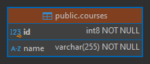

# Sección 03: Microservicio Cursos

---

## Dependencias iniciales

Se muestran las dependencias agregadas desde `Spring Initializr`, además de la dependencia de `MapStruct` que se agregó
manualmente.

````xml
<!--Spring Boot 3.3.4-->
<!--java.version 21-->
<!--spring-cloud.version 2023.0.3-->
<!--org.mapstruct.version 1.6.0-->
<!--lombok-mapstruct-binding.version 0.2.0-->
<dependencies>
    <dependency>
        <groupId>org.springframework.boot</groupId>
        <artifactId>spring-boot-starter-data-jpa</artifactId>
    </dependency>
    <dependency>
        <groupId>org.springframework.boot</groupId>
        <artifactId>spring-boot-starter-validation</artifactId>
    </dependency>
    <dependency>
        <groupId>org.springframework.boot</groupId>
        <artifactId>spring-boot-starter-web</artifactId>
    </dependency>
    <dependency>
        <groupId>org.springframework.cloud</groupId>
        <artifactId>spring-cloud-starter-openfeign</artifactId>
    </dependency>
    <!--Agregado manualmente-->
    <dependency>
        <groupId>org.mapstruct</groupId>
        <artifactId>mapstruct</artifactId>
        <version>${org.mapstruct.version}</version>
    </dependency>
    <!--/Agregado manualmente-->

    <dependency>
        <groupId>org.postgresql</groupId>
        <artifactId>postgresql</artifactId>
        <scope>runtime</scope>
    </dependency>
    <dependency>
        <groupId>org.projectlombok</groupId>
        <artifactId>lombok</artifactId>
        <optional>true</optional>
    </dependency>
    <dependency>
        <groupId>org.springframework.boot</groupId>
        <artifactId>spring-boot-starter-test</artifactId>
        <scope>test</scope>
    </dependency>
</dependencies>
````

Como vamos a trabajar con `MapStruct`, es necesario agregar en la sección de `plugins` algunas configuraciones para que
habilite la dependencia para la realización de mapeos y además, se permita el trabajo en conjunto con `Lombok`.

````xml

<plugins>
    <!--MapStruct-->
    <plugin>
        <groupId>org.apache.maven.plugins</groupId>
        <artifactId>maven-compiler-plugin</artifactId>
        <version>${maven-compiler-plugin.version}</version>
        <configuration>
            <source>${java.version}</source>
            <target>${java.version}</target>
            <annotationProcessorPaths>
                <path>
                    <groupId>org.mapstruct</groupId>
                    <artifactId>mapstruct-processor</artifactId>
                    <version>${org.mapstruct.version}</version>
                </path>
                <path>
                    <groupId>org.projectlombok</groupId>
                    <artifactId>lombok</artifactId>
                    <version>${lombok.version}</version>
                </path>
                <path>
                    <groupId>org.projectlombok</groupId>
                    <artifactId>lombok-mapstruct-binding</artifactId>
                    <version>${lombok-mapstruct-binding.version}</version>
                </path>
            </annotationProcessorPaths>
        </configuration>
    </plugin>
    <!--/MapStruct-->
</plugins>
````

## Configura el contexto de persistencia JPA/Hibernate

En el `application.yml` del servicio `course-service` configuramos las siguientes propiedades.

````yml
server:
  port: 8002
  error:
    include-message: always

spring:
  application:
    name: course-service
  datasource:
    url: jdbc:postgresql://localhost:5432/db_course-service
    username: postgres
    password: magadiflo
  jpa:
    hibernate:
      ddl-auto: update
    properties:
      hibernate:
        format_sql: true

logging:
  level:
    dev.magadiflo.course.app: DEBUG
    org.hibernate.SQL: DEBUG
````

Notar que hemos establecido la conexión a la base de datos de `postgres` que actualmente se está ejecutando en mi
máquina física. Más adelante trabajaré con bases de datos contenerizadas, pero lo que quiero dejar en claro es que
hasta este punto, estoy trabajando con `postgres` instalada en mi máquina local.

## Entity Course

De momento nuestra entidad `Course` lucirá únicamente dos campos: `id` y `name`. Más adelante, cuando establezcamos
la comunicación con el microservicio `user-service` nos veremos en la necesidad de agregar nuevos campos, pero eso
lo veremos más adelante.

````java

@ToString
@AllArgsConstructor
@NoArgsConstructor
@Builder
@Setter
@Getter
@Entity
@Table(name = "courses")
public class Course {
    @Id
    @GeneratedValue(strategy = GenerationType.IDENTITY)
    private Long id;

    @Column(nullable = false)
    private String name;
}
````

## Construye tabla courses a partir de entidad Course

Si hasta este punto ejecutamos la aplicación, veremos que la tabla se crea correctamente en nuestra base de datos de
`PostgreSQL`.



## Implementa el componente repository de acceso a datos

````java
public interface CourseRepository extends CrudRepository<Course, Long> {
}
````

## Define interfaz de mapeo y dtos

Para recibir información enviada desde el cliente usaremos el siguiente dto. Este `dto` define una única anotación de
validación `@NotBlank` que se activará cuando utilicemos la anotación `@Valid` en el controlador `CourseController`.

````java

@ToString
@AllArgsConstructor
@NoArgsConstructor
@Builder
@Setter
@Getter
public class CourseRequest {
    @NotBlank
    private String name;
}
````

Para devolver información al cliente, usaremos el siguiente `dto`.

````java

@ToString
@AllArgsConstructor
@NoArgsConstructor
@Builder
@Setter
@Getter
public class CourseResponse {
    private Long id;
    private String name;
}
````

Como estamos trabajando con `MapStruct`, crearemos una interfaz de mapeo para poder convertir la entidad `Course` en
`dto` y un `dto` en entidad `Course`. Precisamente, para eso creamos los dtos anteriores.

````java

@Mapper(componentModel = MappingConstants.ComponentModel.SPRING)
public interface CourseMapper {
    Course toCourseEntity(CourseRequest courseRequest);

    CourseResponse toCourseResponse(Course course);

    @Mapping(target = "id", ignore = true)
    Course updateCourse(CourseRequest courseRequest, @MappingTarget Course course);
}
````

## Manejo de excepciones

Antes de crear las distintas excepciones que manejaremos en nuestra aplicación, vamos a crear una clase que nos
permitirá uniformizar las respuestas, de esa manera el cliente siempre obtendrá el mismo formato de mensaje de error.

````java

@NoArgsConstructor
@AllArgsConstructor
@Builder
@Getter
@Setter
public class HttpErrorResponse {
    private HttpStatus httpStatus;

    private String message;

    private LocalDateTime timestamp;

    @JsonInclude(JsonInclude.Include.NON_NULL)
    private String path;

    @JsonInclude(JsonInclude.Include.NON_NULL)
    private Map<String, List<String>> errors;
}
````

Observar que en el código anterior estamos usando la anotación `@JsonInclude(JsonInclude.Include.NON_NULL)`, esta
anotación nos permite `ignorar los campos nulos al serializar` la clase java. Esto significa que si un atributo
de nuestra clase `HttpErrorResponse` tiene un valor nulo, no se incluirá en la respuesta JSON.

Ahora, creamos las distintas excepciones que utilizaremos en nuestra aplicación.

````java
public class NotFoundException extends RuntimeException {
    public NotFoundException(String message) {
        super(message);
    }
}
````

````java
public class CourseNotFoundException extends NotFoundException {
    public CourseNotFoundException(Long courseId) {
        super("No se encuentra el curso con id [%d]".formatted(courseId));
    }
}
````

Finalmente, nuestro controlador que manejará las excepciones.

````java

@Slf4j
@RestControllerAdvice
public class GlobalExceptionHandler {

    @ExceptionHandler(CourseNotFoundException.class)
    public ResponseEntity<HttpErrorResponse> handleNotFoundException(NotFoundException exception,
                                                                     HttpServletRequest request) {
        return ResponseEntity.status(HttpStatus.NOT_FOUND)
                .body(HttpErrorResponse.builder()
                        .httpStatus(HttpStatus.NOT_FOUND)
                        .message(exception.getMessage())
                        .timestamp(LocalDateTime.now())
                        .path(request.getRequestURI())
                        .build());
    }

    @ExceptionHandler(MethodArgumentNotValidException.class)
    public ResponseEntity<HttpErrorResponse> handleMethodArgumentNotValidException(MethodArgumentNotValidException exception,
                                                                                   HttpServletRequest request) {
        Map<String, List<String>> errors = new HashMap<>();

        exception.getBindingResult().getFieldErrors().forEach(fieldError -> {
            String field = fieldError.getField();
            String defaultMessage = fieldError.getDefaultMessage();
            errors.computeIfAbsent(field, k -> new ArrayList<>()).add(defaultMessage);
        });

        return ResponseEntity.status(HttpStatus.BAD_REQUEST)
                .body(HttpErrorResponse.builder()
                        .httpStatus(HttpStatus.BAD_REQUEST)
                        .message("Falló la validación de los campos")
                        .timestamp(LocalDateTime.now())
                        .path(request.getRequestURI())
                        .errors(errors)
                        .build());
    }

    @ExceptionHandler(Exception.class)
    public ResponseEntity<HttpErrorResponse> handleGenericException(Exception exception, HttpServletRequest request) {
        log.error("Ocurrió un error inesperado", exception);
        return ResponseEntity.status(HttpStatus.INTERNAL_SERVER_ERROR)
                .body(HttpErrorResponse.builder()
                        .httpStatus(HttpStatus.INTERNAL_SERVER_ERROR)
                        .message(exception.getMessage())
                        .timestamp(LocalDateTime.now())
                        .path(request.getRequestURI())
                        .build());
    }

}
````

## Implementa el componente Service

Definimos nuestra interfaz para el curso.

````java
public interface CourseService {
    List<CourseResponse> findAllCourses();

    CourseResponse findCourse(Long courseId);

    CourseResponse saveCourse(CourseRequest courseRequest);

    CourseResponse updateCourse(Long courseId, CourseRequest courseRequest);

    void deleteCourse(Long courseId);
}
````

Finalmente, creamos la implementación de la interfaz anterior.

````java

@Slf4j
@RequiredArgsConstructor
@Service
@Transactional(readOnly = true)
public class CourseServiceImpl implements CourseService {

    private final CourseRepository courseRepository;
    private final CourseMapper courseMapper;


    @Override
    public List<CourseResponse> findAllCourses() {
        return ((List<Course>) this.courseRepository.findAll()).stream()
                .map(this.courseMapper::toCourseResponse)
                .toList();
    }

    @Override
    public CourseResponse findCourse(Long courseId) {
        return this.courseRepository.findById(courseId)
                .map(this.courseMapper::toCourseResponse)
                .orElseThrow(() -> new CourseNotFoundException(courseId));
    }

    @Override
    @Transactional
    public CourseResponse saveCourse(CourseRequest courseRequest) {
        Course courseDB = this.courseRepository.save(this.courseMapper.toCourseEntity(courseRequest));
        return this.courseMapper.toCourseResponse(courseDB);
    }

    @Override
    @Transactional
    public CourseResponse updateCourse(Long courseId, CourseRequest courseRequest) {
        return this.courseRepository.findById(courseId)
                .map(courseDB -> this.courseMapper.updateCourse(courseRequest, courseDB))
                .map(this.courseRepository::save)
                .map(this.courseMapper::toCourseResponse)
                .orElseThrow(() -> new CourseNotFoundException(courseId));
    }

    @Override
    @Transactional
    public void deleteCourse(Long courseId) {
        Course courseDB = this.courseRepository.findById(courseId)
                .orElseThrow(() -> new CourseNotFoundException(courseId));
        this.courseRepository.delete(courseDB);
    }
}
````

## Implementa el Controlador RestController para cursos

Implementamos los endpoints para nuestro microservicio `course-service`.

````java

@RequiredArgsConstructor
@RestController
@RequestMapping(path = "/api/v1/courses")
public class CourseController {

    private final CourseService courseService;

    @GetMapping
    public ResponseEntity<List<CourseResponse>> findAllCourses() {
        return ResponseEntity.ok(this.courseService.findAllCourses());
    }

    @GetMapping(path = "/{courseId}")
    public ResponseEntity<CourseResponse> findCourse(@PathVariable Long courseId) {
        return ResponseEntity.ok(this.courseService.findCourse(courseId));
    }

    @PostMapping
    public ResponseEntity<CourseResponse> saveCourse(@Valid @RequestBody CourseRequest courseRequest) {
        CourseResponse courseResponse = this.courseService.saveCourse(courseRequest);
        URI location = ServletUriComponentsBuilder.fromCurrentRequest()
                .path("/{courseId}").buildAndExpand(courseResponse.getId()).toUri();
        return ResponseEntity.created(location).body(courseResponse);
    }

    @PutMapping(path = "/{courseId}")
    public ResponseEntity<CourseResponse> updateCourse(@PathVariable Long courseId, @Valid @RequestBody CourseRequest courseRequest) {
        return ResponseEntity.ok(this.courseService.updateCourse(courseId, courseRequest));
    }

    @DeleteMapping(path = "/{courseId}")
    public ResponseEntity<Void> deleteCourse(@PathVariable Long courseId) {
        this.courseService.deleteCourse(courseId);
        return ResponseEntity.noContent().build();
    }
}
````

En el controlador anterior vemos la parte de la validación mediante la anotación `@Valid` dentro de los parámetros del
método `saveCourse()` y `updateCourse()`. Esta anotación se encargará de activar la validación del objeto que llega,
validando los argumentos. Específicamente, indica a `Spring` que debe validar un objeto antes de procesarlo.
La validación es del estándar [JSR380](https://beanvalidation.org/2.0-jsr380/). Cuando la validación falla se lanzará
un `MethodArgumentNotValidException` de Spring.
[Fuente: Refactorizando](https://refactorizando.com/validadores-spring-boot/)

Ahora, necesitamos capturar de alguna manera los errores cuando se produzca la excepción
`MethodArgumentNotValidException`, para eso nos apoyaremos del `@RestControllerAdvice` de Spring que no solo se
encargará de manejar la excepción anterior, sino todas aquellas que le definamos.

## Prueba API Rest de cursos

- Listar todos los cursos

````bash
$ curl -v http://localhost:8002/api/v1/courses | jq
>
< HTTP/1.1 200
< Content-Type: application/json
<
[
  {
    "id": 1,
    "name": "Angular"
  },
  {
    "id": 2,
    "name": "Java 21"
  },
  {
    "id": 3,
    "name": "Docker"
  }
]
````

- Encontrar un curso por su id

````bash
$ curl -v http://localhost:8002/api/v1/courses/2 | jq
>
< HTTP/1.1 200
<
{
  "id": 2,
  "name": "Java 21"
}
````

- Registrar un curso

````bash
$ curl -v -X POST -H "Content-Type: application/json" -d "{\"name\": \"Spring Boot 3\"}" http://localhost:8002/api/v1/courses | jq
>
< HTTP/1.1 201
< Location: http://localhost:8002/api/v1/courses/4
< Content-Type: application/json
<
{
  "id": 4,
  "name": "Spring Boot 3"
}
````

- Actualizar un curso

````bash
$ curl -v -X PUT -H "Content-Type: application/json" -d "{\"name\": \"Angular 17\"}" http://localhost:8002/api/v1/courses/1 | jq
>
< HTTP/1.1 200
< Content-Type: application/json
<
{
  "id": 1,
  "name": "Angular 17"
}
````

- Eliminar un curso

````bash
$ curl -v -X DELETE http://localhost:8002/api/v1/courses/1 | jq
>
< HTTP/1.1 204
````

- Valida registro de curso al registrarlo

````bash
$ curl -v -X POST -H "Content-Type: application/json" -d "{}" http://localhost:8002/api/v1/courses | jq
>
< HTTP/1.1 400
< Content-Type: application/json
<
{
  "httpStatus": "BAD_REQUEST",
  "message": "Falló la validación de los campos",
  "timestamp": "2024-09-27T22:26:16.2727967",
  "path": "/api/v1/courses",
  "errors": {
    "name": [
      "must not be blank"
    ]
  }
}
````

- Busca un usuario por id no existente

````bash
$ curl -v http://localhost:8002/api/v1/courses/20 | jq
>
< HTTP/1.1 404
< Content-Type: application/json
<
{
  "httpStatus": "NOT_FOUND",
  "message": "No se encuentra el curso con id [20]",
  "timestamp": "2024-09-27T22:26:50.964065",
  "path": "/api/v1/courses/20"
}
````
