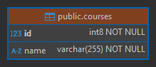

# Sección 03: Microservicio Cursos

---

## Creando microservicio cursos con spring boot y cloud

### Dependencias

Iniciamos mostrando las dependencias que serán utilizadas en el `course-service`. La única dependencia que agregamos
manualmente fue `MapStruct`, las demás dependencias las agregamos desde
[Spring Initializr (ver dependencias)](https://start.spring.io/#!type=maven-project&language=java&platformVersion=3.4.5&packaging=jar&jvmVersion=21&groupId=dev.magadiflo&artifactId=course-service&name=course-service&description=Demo%20project%20for%20Spring%20Boot&packageName=dev.magadiflo.course.app&dependencies=actuator,web,validation,data-jpa,lombok,postgresql,cloud-starter).

````xml
<!--Spring Boot 3.4.5-->
<!--Spring Cloud 2024.0.1-->
<!--Java 21-->
<!--org.mapstruct.version 1.6.3-->
<!--lombok-mapstruct-binding.version 0.2.0-->

<dependencies>
    <dependency>
        <groupId>org.springframework.boot</groupId>
        <artifactId>spring-boot-starter-actuator</artifactId>
    </dependency>
    <dependency>
        <groupId>org.springframework.boot</groupId>
        <artifactId>spring-boot-starter-data-jpa</artifactId>
    </dependency>
    <dependency>
        <groupId>org.springframework.boot</groupId>
        <artifactId>spring-boot-starter-validation</artifactId>
    </dependency>
    <dependency>
        <groupId>org.springframework.boot</groupId>
        <artifactId>spring-boot-starter-web</artifactId>
    </dependency>
    <dependency>
        <groupId>org.springframework.cloud</groupId>
        <artifactId>spring-cloud-starter</artifactId>
    </dependency>
    <!--Agregado manualmente-->
    <dependency>
        <groupId>org.mapstruct</groupId>
        <artifactId>mapstruct</artifactId>
        <version>${org.mapstruct.version}</version>
    </dependency>
    <!--/Agregado manualmente-->

    <dependency>
        <groupId>org.postgresql</groupId>
        <artifactId>postgresql</artifactId>
        <scope>runtime</scope>
    </dependency>
    <dependency>
        <groupId>org.projectlombok</groupId>
        <artifactId>lombok</artifactId>
        <optional>true</optional>
    </dependency>
    <dependency>
        <groupId>org.springframework.boot</groupId>
        <artifactId>spring-boot-starter-test</artifactId>
        <scope>test</scope>
    </dependency>
</dependencies>
````

Tal como vimos en el `user-service`, aquí también agregaremos el plugin de `mapstruct` para que haya compatibilidad con
`lombok`.

````xml

<plugins>
    <!--MapStruct-->
    <plugin>
        <groupId>org.apache.maven.plugins</groupId>
        <artifactId>maven-compiler-plugin</artifactId>
        <version>${maven-compiler-plugin.version}</version>
        <configuration>
            <source>${java.version}</source>
            <target>${java.version}</target>
            <annotationProcessorPaths>
                <path>
                    <groupId>org.projectlombok</groupId>
                    <artifactId>lombok</artifactId>
                    <version>${lombok.version}</version>
                </path>
                <path>
                    <groupId>org.mapstruct</groupId>
                    <artifactId>mapstruct-processor</artifactId>
                    <version>${org.mapstruct.version}</version>
                </path>
                <path>
                    <groupId>org.projectlombok</groupId>
                    <artifactId>lombok-mapstruct-binding</artifactId>
                    <version>${lombok-mapstruct-binding.version}</version>
                </path>
            </annotationProcessorPaths>
        </configuration>
    </plugin>
    <!--/MapStruct-->
</plugins>
````

## Configura el contexto de persistencia JPA/Hibernate

En el `application.yml` del `course-service` configuramos las siguientes propiedades.

````yml
server:
  port: 8002
  error:
    include-message: always

spring:
  application:
    name: course-service
  datasource:
    url: jdbc:postgresql://localhost:5432/db_course_service
    username: postgres
    password: magadiflo
  jpa:
    hibernate:
      ddl-auto: update
    properties:
      hibernate:
        format_sql: true

logging:
  level:
    dev.magadiflo.course.app: debug
    org.hibernate.SQL: debug
````

> Notar que hemos establecido la conexión a la base de datos de `postgres` que actualmente se está ejecutando en mi
> máquina física. Más adelante trabajaré con bases de datos contenerizadas, pero lo que quiero dejar en claro es que
> hasta este punto, estoy trabajando con `postgres` instalada en mi máquina local.

## Entity Course

De momento nuestra entidad `Course` lucirá únicamente dos campos: `id` y `name`. Más adelante, cuando establezcamos
la comunicación con el microservicio `user-service` nos veremos en la necesidad de agregar nuevos campos, pero eso
lo veremos más adelante.

````java

@AllArgsConstructor
@NoArgsConstructor
@Builder
@Data
@Entity
@Table(name = "courses")
public class Course {
    @Id
    @GeneratedValue(strategy = GenerationType.IDENTITY)
    private Long id;

    @Column(nullable = false, unique = true)
    private String name;
}
````

## Construye tabla courses a partir de entidad Course

Si hasta este punto ejecutamos la aplicación, veremos que la tabla se crea correctamente en nuestra base de datos de
`PostgreSQL`.



## Implementa el componente repository de acceso a datos

````java
public interface CourseRepository extends JpaRepository<Course, Long> {
}
````

## Definiendo dtos e interfaz de mapeo

Para recibir información del cliente crearemos el dto `CourseRequest` usando un `record`. Este `dto` define una única
anotación de validación `@NotBlank` que se activará cuando utilicemos la anotación `@Valid` en el controlador
`CourseController`.

````java
public record CourseRequest(@NotBlank
                            String name) {
}
````

Para exponer información hacia el cliente crearemos el siguiente `dto`.

````java
public record CourseResponse(Long id,
                             String name) {
}
````

Como estamos trabajando con `MapStruct` crearemos una interfaz de mapeo para poder convertir la entidad `Course` en el
dto `CourseResponse` y el dto `CourseRequest` en una entidad `Course`.

````java

@Mapper(componentModel = MappingConstants.ComponentModel.SPRING)
public interface CourseMapper {
    CourseResponse toCourseResponse(Course course);

    Course toCourse(CourseRequest request);

    @Mapping(target = "id", ignore = true)
    Course toUpdateCourse(@MappingTarget Course course, CourseRequest request);
}
````

> Para saber un poco más sobre las anotaciones usadas ir al `user-service` donde ya se ha colocado la documentación.

## Manejo de excepciones

Antes de crear las distintas excepciones que manejaremos en nuestra aplicación, vamos a crear una clase que nos
permitirá uniformizar las respuestas, de esa manera el cliente siempre obtendrá el mismo formato de mensaje de error.

````java

@JsonInclude(JsonInclude.Include.NON_NULL)
public record ErrorResponse(int status,
                            String error,
                            String message,
                            String path,
                            Map<String, List<String>> errors) {

    @JsonProperty
    public LocalDateTime timestamp() {
        return LocalDateTime.now().truncatedTo(ChronoUnit.SECONDS);
    }
}
````

Ahora, creamos las distintas excepciones que utilizaremos en nuestra aplicación.

````java
public class NotFoundException extends RuntimeException {
    public NotFoundException(String message) {
        super(message);
    }
}
````

Creamos la excepción `CourseNotFoundException` que extenderá de la clase anterior.

````java
public class CourseNotFoundException extends NotFoundException {
    public CourseNotFoundException(Long courseId) {
        super("No se encuentra el curso con id [%d]".formatted(courseId));
    }
}
````

A continuación creamos la clase global que manejará las excepciones.

````java

@Slf4j
@RestControllerAdvice
public class GlobalExceptionHandler {

    @ExceptionHandler(CourseNotFoundException.class)
    public ResponseEntity<ErrorResponse> handleNotFoundException(CourseNotFoundException exception, HttpServletRequest request) {
        log.error("Curso no encontrado: {}", exception.getMessage());
        ErrorResponse errorResponse = new ErrorResponse(
                HttpStatus.NOT_FOUND.value(),
                HttpStatus.NOT_FOUND.getReasonPhrase(),
                exception.getMessage(),
                request.getRequestURI(),
                null
        );
        return ResponseEntity.status(HttpStatus.NOT_FOUND).body(errorResponse);
    }

    @ExceptionHandler(MethodArgumentNotValidException.class)
    public ResponseEntity<ErrorResponse> handleMethodArgumentNotValidException(MethodArgumentNotValidException exception, HttpServletRequest request) {
        log.error("Error en argumentos: {}", exception.getMessage());
        Map<String, List<String>> errors = new HashMap<>();
        exception.getBindingResult().getFieldErrors().forEach(fieldError -> {
            String field = fieldError.getField();
            String defaultMessage = fieldError.getDefaultMessage();
            errors.computeIfAbsent(field, k -> new ArrayList<>()).add(defaultMessage);
        });

        ErrorResponse errorResponse = new ErrorResponse(
                HttpStatus.BAD_REQUEST.value(),
                HttpStatus.BAD_REQUEST.getReasonPhrase(),
                "Falló la validación de los campos",
                request.getRequestURI(),
                errors
        );
        return ResponseEntity.status(HttpStatus.BAD_REQUEST).body(errorResponse);
    }

    @ExceptionHandler(Exception.class)
    public ResponseEntity<ErrorResponse> handleGenericException(Exception exception, HttpServletRequest request) {
        log.error("Error genérico: {}", exception.getMessage());
        ErrorResponse errorResponse = new ErrorResponse(
                HttpStatus.INTERNAL_SERVER_ERROR.value(),
                HttpStatus.INTERNAL_SERVER_ERROR.getReasonPhrase(),
                exception.getMessage(),
                request.getRequestURI(),
                null
        );
        return ResponseEntity.status(HttpStatus.INTERNAL_SERVER_ERROR).body(errorResponse);
    }
}
````

## Implementando el componente Service

Definimos nuestra interfaz para la lógica que aplicaremos al curso.

````java
public interface CourseService {
    List<CourseResponse> findAllCourses();

    CourseResponse findCourse(Long courseId);

    CourseResponse saveCourse(CourseRequest courseRequest);

    CourseResponse updateCourse(Long courseId, CourseRequest courseRequest);

    void deleteCourse(Long courseId);
}
````

Implementamos la interfaz anterior con el crud para el curso.

````java

@Slf4j
@RequiredArgsConstructor
@Service
@Transactional(readOnly = true)
public class CourseServiceImpl implements CourseService {

    private final CourseRepository courseRepository;
    private final CourseMapper courseMapper;

    @Override
    public List<CourseResponse> findAllCourses() {
        return this.courseRepository.findAll().stream()
                .map(this.courseMapper::toCourseResponse)
                .toList();
    }

    @Override
    public CourseResponse findCourse(Long courseId) {
        return this.courseRepository.findById(courseId)
                .map(this.courseMapper::toCourseResponse)
                .orElseThrow(() -> new CourseNotFoundException(courseId));
    }

    @Override
    @Transactional
    public CourseResponse saveCourse(CourseRequest courseRequest) {
        Course courseDB = this.courseRepository.save(this.courseMapper.toCourse(courseRequest));
        return this.courseMapper.toCourseResponse(courseDB);
    }

    @Override
    @Transactional
    public CourseResponse updateCourse(Long courseId, CourseRequest courseRequest) {
        return this.courseRepository.findById(courseId)
                .map(courseDB -> this.courseMapper.toUpdateCourse(courseDB, courseRequest))
                .map(this.courseRepository::save)
                .map(this.courseMapper::toCourseResponse)
                .orElseThrow(() -> new CourseNotFoundException(courseId));
    }

    @Override
    @Transactional
    public void deleteCourse(Long courseId) {
        Course courseDB = this.courseRepository.findById(courseId)
                .orElseThrow(() -> new CourseNotFoundException(courseId));
        this.courseRepository.delete(courseDB);
    }
}
````
