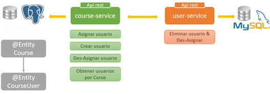
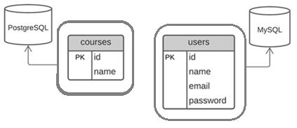
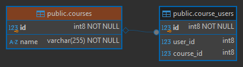
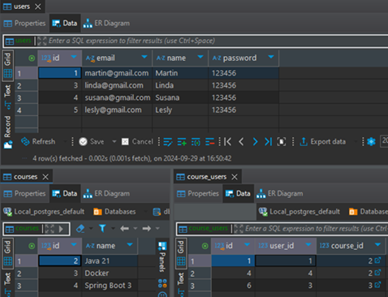

# Sección 05: Cliente HTTP Feign: Comunicación entre microservicios

---

## Introducción: Conectando microservicios

En esta sección veremos cómo relacionar nuestros dos microservicios `user-service` y `course-service`. Luego,
agregaremos funcionalidades en ambos microservicios que nos ayudarán a establecer la comunicación.

En la siguiente imagen vemos un panorama general de lo que realizaremos en esta sección:



## Creando JPA Entity CourseUser

Hasta este punto tenemos creado nuestros dos microservicios `course-service` y `user-service`, cada uno manejando su
propia base de datos.



Ahora, dejemos a un lado solo por este momento el tema de microservicios y enfoquémonos en la regla de negocio que
trabajaremos en este proyecto:

> Un `usuario` o `alumno` podrá estar en un único `curso` y en un `curso` podrán estar muchos `usuarios` o
> `alumnos`. Imaginemos que `cursos` son por ejemplo cursos de deporte donde tú como alumno puedes elegir estar solo
> en uno de ellos, puedes elegir fútbol o voley o basket o natación, etc., pero solo uno de ellos.
>
> Lo que se quiere lograr es una relación de `One-To-Many`, podríamos haber tomado cualquier otro ejemplo como
> Categoría y Productos y haber realizado todo el proyecto en base a esas entidades, pero bueno, el tutor eligió
> cursos y usuarios para trabajar en todo este proyecto.

Por lo tanto, teniendo nuestra regla de negocio definida, nuestro diagrama `ER de Base de Datos` quedaría de esta
manera:


Ahora, la pregunta es **¿cómo llevamos esa relación a los microservicios, si cada microservicio tiene propia base de
datos independiente?**

Lo que podemos hacer es crear una tabla, en una de las bases de datos, que tenga la función de ser un `espejo` de la
tabla de la otra base de datos y donde solo almacene los identificadores, ya que la información completa la tiene la
otra base de datos.

Y ahora, la siguiente pregunta sería **¿en qué base de datos creamos la nueva tabla que hará de "espejo" de la otra
tabla?**.

Analizando la pregunta anterior, llegamos a la conclusión de que la nueva tabla, a la que llamaremos por cierto
`course_users`, debería estar en el microservicio de `course-service` ya que de por sí, un curso necesariamente
requiere usuarios que estén registrados en él para que tenga sentido su razón de existencia, por lo tanto, llevaremos
ese control en dicho microservicio.


Para finalizar la idea anterior, la tabla `course_users` sería como si colocáramos la tabla `users` dentro del
microservicio `course-service` en su reemplazo, pero aquí únicamente contendrá la `id` de la tabla `users` a través del
atributo `user_id`, es decir, el `user_id` sería como la `id` de la tabla `users`. Ahora, con respecto al atributo
`course_id`, como estamos en el microservicio `course-service` aquí sí se convierte en un `FK` explícito que apunta a
la tabla `courses`. Finalmente, con respecto al `id` de la tabla `course_users`, solo nos sirve como clave primaria de
la tabla, para nada más. Aquí los dos atributos importantes son `course_id` y el `user_id`.

Listo, una vez habiendo explicado el funcionamiento de la tabla `course_users`, llega el momento de crear la entidad
correspondiente y establecer la relación.

A continuación creamos la entidad `CourseUser` correspondiente a la tabla `course_users` donde debemos observar varios
aspectos importantes:

1. Definimos la propiedad `userId` correspondiente al campo `user_id` que representa conceptualmente la `Primary Key`
   de la tabla `users` en la tabla `course_users`, es decir, es como si `course_users` fuera la tabla `users`. ¡Ojo!
   estoy diciendo que **representa conceptualmente**, es decir, estamos diciendo a qué hace referencia ese atributo.
   Además, estamos diciendo que dicha propiedad es única para evitar que un usuario pueda estar en varios cursos.


2. Sobreescribimos el método `equals()` para decirle a hibernate que cuando se compare una entidad del
   tipo `CourseUser` lo haga a través de la propiedad `userId`. También sobreescribiremos el método `hashCode()` para
   evitar comportamientos inesperados.

**Relación entre equals() y hashCode():**

La regla general es que si sobrescribes `equals()`, también debes sobrescribir `hashCode()`, y ambos deben mantener la
siguiente relación:

- Si dos objetos son iguales según el método `equals()`, deben tener el mismo valor de `hashCode()`.
- Si dos objetos tienen el mismo valor de `hashCode()`, no necesariamente son iguales según `equals()`.

Esto garantiza que las colecciones que utilizan hash funcionen de manera correcta. Si no sobrescribes ambos métodos de
manera coherente, podrías tener comportamientos inesperados cuando usas objetos en colecciones como `HashMap` o
`HashSet`.

Si solo sobrescribes el método `equals()` y no sobrescribes el método `hashCode()`, puedes encontrarte con
comportamientos inesperados, especialmente cuando uses tu objeto en colecciones basadas en hash, como `HashMap`,
`HashSet` o `HashTable`. Esto sucede porque estas colecciones dependen tanto de `equals()` como de `hashCode()` para
gestionar la inserción y búsqueda de objetos de manera eficiente.

A continuación se muestra cómo quedaría la entidad `CourseUser`.

````java

@ToString
@AllArgsConstructor
@NoArgsConstructor
@Builder
@Setter
@Getter
@Entity
@Table(name = "course_users")
public class CourseUser {
    @Id
    @GeneratedValue(strategy = GenerationType.IDENTITY)
    private Long id;

    @Column(unique = true)
    private Long userId;

    @Override
    public boolean equals(Object o) {
        if (this == o) return true;
        if (o == null || getClass() != o.getClass()) return false;
        CourseUser that = (CourseUser) o;
        return Objects.equals(userId, that.userId);
    }

    @Override
    public int hashCode() {
        return Objects.hashCode(userId);
    }
}
````

## Crea relación unidireccional entre Course y CourseUser

En la entidad `Course` establecemos la `relación unidireccional @OneToMany` con la entidad `CourseUser`.

````java

@ToString
@AllArgsConstructor
@NoArgsConstructor
@Builder
@Setter
@Getter
@Entity
@Table(name = "courses")
public class Course {
    @Id
    @GeneratedValue(strategy = GenerationType.IDENTITY)
    private Long id;

    @Column(nullable = false)
    private String name;

    @JoinColumn(name = "course_id")
    @OneToMany(cascade = CascadeType.ALL, orphanRemoval = true)
    private List<CourseUser> courseUsers = new ArrayList<>();
}
````

Si ejecutamos la aplicación, veremos que la tabla y la relación se crean sin ningún problema.



## Crea DTOs de usuario: UserRequest y UserResponse

Recordemos que en la base de datos del microservicio `course-service` solo tenemos dos tablas relacionadas
`courses` y `course_users`. Cuando recuperemos información de la tabla `course_users` podremos recuperar la
información de la entidad `Course` ya que está en el mismo microservicio, mientras que por el lado del usuario,
solo nos retornará su `identificador`.

Para obtener la información del usuario a partir de su identificador necesitamos hacer una llamada
http al microservicio `user-service` usando el `Http Feign Client`. En ese sentido, necesitamos crear una clase `DTO`
con la misma estructura de la información de usuario que nos retornará el `user-service`. De esta manera,
por ejemplo, cuando se solicite todos los usuarios que están registrados en un curso, esta clase de dto `UserResponse`
nos va a servir para representar dicha información en el objeto JSON.

````java

@ToString
@AllArgsConstructor
@NoArgsConstructor
@Builder
@Setter
@Getter
public class UserResponse {
    private Long id;
    private String name;
    private String email;
    private String password;
}
````

Ahora, cuando mostremos información de un curso, también mostraremos información de los usuarios que están registrados
en dicho curso.

````java

@ToString
@AllArgsConstructor
@NoArgsConstructor
@Builder
@Setter
@Getter
public class CourseResponse {
    private Long id;
    private String name;
    @JsonInclude(JsonInclude.Include.NON_NULL)
    private List<UserResponse> users;
}
````

Nuestro `course-service` tendrá la opción de poder registrar usuarios, esto por debajo se comunicará con el
`user-service` para realizar esa funcionalidad. En ese sentido, necesitamos crear un dto que nos permita obtener
información del usuario a registrar y enviarla hacia el `user-service`. Este dto lo usaremos más adelante.

````java

@ToString
@AllArgsConstructor
@NoArgsConstructor
@Builder
@Setter
@Getter
public class UserRequest {
    @NotBlank
    private String name;

    @NotBlank
    @Email
    private String email;

    @NotBlank
    private String password;
}
````

Notar que en el dto anterior estamos agregando anotaciones de validación, aunque el `user-service` ya tiene
implementado las validaciones, podría ser una opción válida el que el `course-service` realice validaciones antes de
enviar los datos al `user-service`, de esta manera se puede detectar errores antes de enviar los datos a
`user-service`. Esto evita peticiones innecesarias y mejora el rendimiento al prevenir llamadas HTTP que de todas
formas fallarían por errores de validación. La otra opción sería dejar que el `user-service` haga las validaciones, en
ese sentido, el `course-service` solo actuaría como un pasador de datos sin validar. La ventaja de esta última opción
es que estaríamos centralizando la lógica de validación en el `user-service`, lo que haría que sea más fácil de
mantener. Solo tendrías que gestionar las validaciones en un solo lugar.

En resumen, validar en ambos servicios puede ser útil para mejorar la eficiencia, pero en algunos casos podría ser
suficiente realizar una validación básica en el `course-service` y dejar la validación principal al `user-service`.

## Cliente Http con Spring Cloud Feign

Antes de implementar métodos adicionales para la comunicación entre nuestros dos microservicios vamos a configurar
nuestro cliente `HTTP`. Para este proyecto se seleccionó  `Feign Client`, pero también hay otros clientes http que
`Spring Framework` nos ofrece y que podríamos haber usado como el `WebClient`, `RestClient` o `RestTemplate`.

Como ya tenemos la dependencia de `spring-cloud-starter-openfeign` en nuestro proyecto, podemos usarlo para crear
nuestro cliente rest del tipo Feign. Esto es una alternativa al uso de `RestTemplate` que nos permite realizar llamadas
http para consumir servicios rest.

Lo primero que haremos será agregar la anotación `@EnableFeignClients` en la clase principal del proyecto. Esta
anotación **busca interfaces que declaren ser clientes feign (mediante la anotación `@FeignClient`).** Además, con
esta anotación **habilitamos en la aplicación el contexto de feign para poder implementar nuestras api rest de forma
declarativa**.

````java

@EnableFeignClients
@SpringBootApplication
public class CourseServiceApplication {

    public static void main(String[] args) {
        SpringApplication.run(CourseServiceApplication.class, args);
    }

}
````

Ahora, necesitamos crear una interface que hará las peticiones al microservicio de usuarios, esta interfaz estará
anotada con `@FeignClient`. Esta anotación es para interfaces que declara que debe crearse un cliente REST con esa
interfaz (Por ejemplo, **para hacer una inyección en otro componente**). Si `Spring Cloud LoadBalancer` está disponible,
se utilizará para equilibrar la carga de las solicitudes del backend, y el equilibrador de carga puede configurarse
utilizando el mismo nombre (es decir, valor) que el cliente feign.

Como se mencionó anteriormente, de forma automática la interfaz anotada con `@FeignClient` se convierte en un componente
de `Spring` para poder ser inyectado en otro componente. Es como cuando usamos el `CrudRepository<T, ID>`, es decir,
por debajo se implementa la funcionalidad.

````java

@FeignClient(name = "user-service", url = "http://localhost:8001", path = "/api/v1/users")
public interface UserFeignClient {
    @GetMapping(path = "/{userId}")
    UserResponse findUser(@PathVariable Long userId);

    @PostMapping
    UserResponse saveUser(@RequestBody UserRequest userRequest);
}
````

**DONDE**

- `name`, corresponde al nombre del microservicio que vamos a consumir. En este caso, el nombre lo definimos en
  la propiedad  `spring.application.name` del `application.yml` del microservicio `user-service`.
- `url`, una URL absoluta o un nombre de host resoluble (el protocolo es opcional).
- `path`, prefijo de ruta que deben utilizar todas las asignaciones a nivel de método.

En el `UserFeignClient` hemos definido dos métodos que corresponden a los endpoints que consumiremos. Si vamos al
microservicio `user-service` veremos dentro del código, los dos endpoints que estamos consumiendo:

````java
//microservicio: user-service
@RequiredArgsConstructor
@RestController
@RequestMapping(path = "/api/v1/users")
public class UserController {
    @GetMapping(path = "/{userId}")
    public ResponseEntity<UserResponse> findUser(@PathVariable Long userId) {
        /* code */
    }

    @PostMapping
    public ResponseEntity<UserResponse> saveUser(@Valid @RequestBody UserRequest userRequest) {
        /* code */
    }
}
````

`¿Qué podemos concluir?` el método definido en la interfaz `UserFeignClient` es similar al que está definido en
el controlador que consumiremos. En realidad lo que nos interesa es la firma del endpoint, lo que recibe y lo que
retorna, el nombre del método que definamos en la interfaz da lo mismo. Ahora, otro punto a observar es que en el
endpoint del microservicio `user-service` está retornando un `ResponseEntity<UserResponse>` y nosotros hemos colocado
en la interfaz solo `UserResponse`, eso está bien, por debajo cuando se construya la implementación, spring lo
resolverá y nos retornará el `UserResponse`. Por último en el método `saveUser(@Valid...)` del `user-service` está la
anotación `@Valid` que permite validar los campos cuando se envíe a ese endpoint un objeto de usuario, pero en nuestra
interfaz `UserFeignClient` no lo definimos, eso es porque en esta interfaz lo que hacemos es `consumir` el endpoint,
mas no validar los datos.

## Crea repositorio para CourseUser

Recordemos que en este microservicio `course-service` hemos creado la entidad `CourseUser` que nos está permitiendo
manejar la relación con los usuarios. Más adelante, veremos que es necesario tener un repositorio que nos permita
interactuar con esta entidad. Por ejemplo, necesitaremos crear el siguiente método `deleteByUserId(Long userId)` para
poder eliminar la relación del usuario con el curso.

````java
public interface CourseUserRepository extends CrudRepository<CourseUser, Long> {
    void deleteByUserId(Long userId);
}
````

## Agrega métodos de comunicación http

En la interfaz de servicio `CourseService` agregamos nuevos métodos que nos permitirá interactuar `user-service`.

````java
public interface CourseService {
    /* crud methods here */

    UserResponse assignExistingUserToCourse(Long userId, Long courseId);

    UserResponse createUserAndAssignItToCourse(UserRequest userRequest, Long courseId);

    UserResponse unassignUserFromACourse(Long userId, Long courseId);
}
````

Procedemos a implementar estos métodos.

````java

@Slf4j
@RequiredArgsConstructor
@Service
@Transactional(readOnly = true)
public class CourseServiceImpl implements CourseService {

    private final CourseRepository courseRepository;
    private final CourseMapper courseMapper;
    private final CourseUserMapper courseUserMapper;
    private final UserFeignClient userFeignClient;

    /* other methods */

    @Override
    @Transactional
    public UserResponse assignExistingUserToCourse(Long userId, Long courseId) {
        return this.courseRepository.findById(courseId)
                .map(courseDB -> {
                    UserResponse userResponse = this.userFeignClient.findUser(userId); //<-- Puede ocurrir un FeignException
                    CourseUser courseUser = this.courseUserMapper.toCourseUser(userResponse);
                    this.courseMapper.addCourseUserToCourse(courseUser, courseDB);
                    this.courseRepository.save(courseDB);
                    return userResponse;
                })
                .orElseThrow(() -> new CourseNotFoundException(courseId));
    }

    @Override
    @Transactional
    public UserResponse createUserAndAssignItToCourse(UserRequest userRequest, Long courseId) {
        return this.courseRepository.findById(courseId)
                .map(courseDB -> {
                    UserResponse userResponse = this.userFeignClient.saveUser(userRequest); //<-- Puede ocurrir un FeignException
                    CourseUser courseUser = this.courseUserMapper.toCourseUser(userResponse);
                    this.courseMapper.addCourseUserToCourse(courseUser, courseDB);
                    this.courseRepository.save(courseDB);
                    return userResponse;
                })
                .orElseThrow(() -> new CourseNotFoundException(courseId));
    }

    @Override
    @Transactional
    public UserResponse unassignUserFromACourse(Long userId, Long courseId) {
        return this.courseRepository.findById(courseId)
                .map(courseDB -> {
                    UserResponse userResponse = this.userFeignClient.findUser(userId); //<-- Puede ocurrir un FeignException
                    CourseUser courseUser = this.courseUserMapper.toCourseUser(userResponse);
                    this.courseMapper.deleteCourseUserFromCourse(courseUser, courseDB);
                    this.courseRepository.save(courseDB);
                    return userResponse;
                })
                .orElseThrow(() -> new CourseNotFoundException(courseId));
    }
}
````

Notar que en el código anterior estamos haciendo uso de los mappers. Para ser exactos, hemos agregado métodos
adicionales al `CourseMapper` y creado un mapper para nuestra entidad `CourseUser` llamada `CourseUserMapper`.

````java

@Mapper(componentModel = MappingConstants.ComponentModel.SPRING)
public interface CourseMapper {
    Course toCourseEntity(CourseRequest courseRequest);

    CourseResponse toCourseResponse(Course course);

    @Mapping(target = "id", ignore = true)
    Course updateCourse(CourseRequest courseRequest, @MappingTarget Course course);

    default void addCourseUserToCourse(CourseUser courseUser, Course course) {
        course.getCourseUsers().add(courseUser);
    }

    default void deleteCourseUserFromCourse(CourseUser courseUser, Course course) {
        course.getCourseUsers().remove(courseUser); // Aquí comparará por el userId que definimos en el método equals
    }
}
````

A continuación se muestra el mapper creado para el `CourseUser`.

````java

@Mapper(componentModel = MappingConstants.ComponentModel.SPRING)
public interface CourseUserMapper {
    @Mapping(target = "id", ignore = true)
    @Mapping(source = "id", target = "userId")
    CourseUser toCourseUser(UserResponse userResponse);
}
````

Otro punto importante a destacar es que en la comunicación que realizamos con `FeignClient` podemos obtener errores, ya
que nos comunicamos con otro microservicio, por ejemplo, se puede ir la red, el servidor del otro microservicio puede
caerse, existe latencia, el usuario que se busca no existe, etc. por lo que de alguna manera debemos manejar el error
que se produzca para enviarle al cliente.

````java

@Slf4j
@RestControllerAdvice
public class GlobalExceptionHandler {
    @ExceptionHandler(FeignException.class)
    public ResponseEntity<HttpErrorResponse> handleFeignException(FeignException exception, HttpServletRequest request) {
        return ResponseEntity.status(HttpStatus.BAD_GATEWAY)
                .body(HttpErrorResponse.builder()
                        .httpStatus(HttpStatus.BAD_GATEWAY)
                        .message(exception.getMessage())
                        .timestamp(LocalDateTime.now())
                        .path(request.getRequestURI())
                        .build());
    }
}
````

> Un `error 502 Bad Gateway` es un código de estado HTTP que muestra un problema de comunicación entre
> los dos servidores de Internet, en el que el servidor proxy o el servidor de puerta de enlace recibe una respuesta no
> válida del servidor ascendente. En nuestro caso indica que el `course-service` actuó como un gateway o proxy y
> recibió una respuesta inválida del `user-service`. Es adecuado si el `user-service` está caído o no puede procesar la
> solicitud.

Por otro lado, necesitamos definir un servicio y su implementación para la entidad `CourseUser`.

````java
public interface CourseUserService {
    void deleteCourseUserByUserId(Long userId);
}
````

Procedemos a implementar su método.

````java

@Slf4j
@RequiredArgsConstructor
@Service
@Transactional(readOnly = true)
public class CourseUserServiceImpl implements CourseUserService {

    private final CourseUserRepository courseUserRepository;

    @Override
    @Transactional
    public void deleteCourseUserByUserId(Long userId) {
        this.courseUserRepository.deleteByUserId(userId);
    }
}
````

Notar que en el código anterior, no hicimos ninguna validación de si el identificador del usuario existe o no en la
tabla `course_users`, simplemente le dijimos que elimine todos los `CourseUser` utilizando el `userId`. Esto lo hicimos
así porque cuando un usuario sea eliminado en el `user-service`, simplemente llamamos a `course-service` para que
elimine al usuario si está relacionado con algún curso.

## Añadiendo métodos de comunicación en el controlador Rest

Agregamos los endpoints correspondientes a los servicios implementados en el `CourseServiceImpl`.

````java

@RequiredArgsConstructor
@RestController
@RequestMapping(path = "/api/v1/courses")
public class CourseController {

    private final CourseService courseService;

    /* other endpoints */

    @PostMapping(path = "/{courseId}/users/{userId}")
    public ResponseEntity<UserResponse> assignExistingUserToCourse(@PathVariable Long courseId,
                                                                   @PathVariable Long userId) {
        return ResponseEntity.ok(this.courseService.assignExistingUserToCourse(userId, courseId));
    }

    @PostMapping(path = "/{courseId}/users")
    public ResponseEntity<UserResponse> createUserAndAssignItToCourse(@Valid @RequestBody UserRequest userRequest,
                                                                      @PathVariable Long courseId) {
        return new ResponseEntity<>(this.courseService.createUserAndAssignItToCourse(userRequest, courseId), HttpStatus.CREATED);
    }

    @DeleteMapping(path = "/{courseId}/users/{userId}")
    public ResponseEntity<UserResponse> unassignUserFromACourse(@PathVariable Long courseId, @PathVariable Long userId) {
        return ResponseEntity.ok(this.courseService.unassignUserFromACourse(userId, courseId));
    }
}
````

## Prueba comunicación http entre microservicios

- Asigna usuario existente a un curso.

````bash
$ curl -v -X POST http://localhost:8002/api/v1/courses/2/users/4 | jq
>
< HTTP/1.1 200
<
{
  "id": 4,
  "name": "Susana",
  "email": "susana@gmail.com",
  "password": "123456"
}
````

- Crea un usuario y asígnalo a un curso.

````bash
$ curl -v -X POST -H "Content-Type: application/json" -d "{\"name\": \"Lesly\", \"email\": \"lesly@gmail.com\", \"password\": \"123456\"}" http://localhost:8002/api/v1/courses/2/users | jq
>
< HTTP/1.1 201
<
{
  "id": 5,
  "name": "Lesly",
  "email": "lesly@gmail.com",
  "password": "123456"
}
````

- Des-asigna un usuario de un curso.

````bash
$ curl -v -X DELETE http://localhost:8002/api/v1/courses/2/users/5 | jq
>
< HTTP/1.1 200
<
{
  "id": 5,
  "name": "Lesly",
  "email": "lesly@gmail.com",
  "password": "123456"
}
````

- Probando el manejo de error cuando ocurre una excepción del `Feign Client`.

````bash
$ curl -v -X POST http://localhost:8002/api/v1/courses/2/users/50 | jq
>
< HTTP/1.1 502
<
{
  "httpStatus": "BAD_GATEWAY",
  "message": "[404] during [GET] to [http://localhost:8001/api/v1/users/50] [UserFeignClient#findUser(Long)]: [{\"httpStatus\":\"NOT_FOUND\",\"message\":\"No se encuentra el usuario con id [50]\",\"timestamp\":\"2024-09-29T17:00:58.4586496\",\"path\":\"/api/v1/users/50\"}]",
  "timestamp": "2024-09-29T17:00:58.617289",
  "path": "/api/v1/courses/2/users/50"
}
````

## Verifica el listado de los cursos y de un curso

- Listando todos los cursos

````bash
$ curl -v http://localhost:8002/api/v1/courses | jq
>
< HTTP/1.1 200
<
[
  {
    "id": 2,
    "name": "Java 21",
    "users": []
  },
  {
    "id": 3,
    "name": "Docker",
    "users": []
  },
  {
    "id": 4,
    "name": "Spring Boot 3",
    "users": []
  }
]
````

- Obtener un curso por su id

````bash
$ curl -v http://localhost:8002/api/v1/courses/2 | jq
>
< HTTP/1.1 200
<
{
  "id": 2,
  "name": "Java 21",
  "users": []
}
````

En las dos respuestas anteriores vemos que no nos está mostrando los usuarios relacionados a los cursos, pese a que
sí tenemos usuarios relacionados, al menos eso observamos en la tabla `course_users`.



Entonces, para poder obtener la información de los usuarios relacionados a los cursos, debemos realizar una petición
al microservicio `user-service` enviándole el conjunto de identificadores de usuarios para que nos retorne los objetos
correspondientes.

## Crea endpoint en user-service para retornar detalle de los usuarios

En el `user-service` vamos a crear el endpoint que nos retornará el conjunto de usuarios en función de los
identificadores que le mandemos.

````java
public interface UserService {
    /* other methods */
    List<UserResponse> findUsersByIds(List<Long> userIds);
}
````

````java

@Slf4j
@RequiredArgsConstructor
@Service
@Transactional(readOnly = true)
public class UserServiceImpl implements UserService {

    private final UserRepository userRepository;
    private final UserMapper userMapper;

    /* other methods */

    @Override
    public List<UserResponse> findUsersByIds(List<Long> userIds) {
        return ((List<User>) this.userRepository.findAllById(userIds)).stream()
                .map(this.userMapper::toUserResponse)
                .toList();
    }
}
````

````java

@RequiredArgsConstructor
@RestController
@RequestMapping(path = "/api/v1/users")
public class UserController {

    private final UserService userService;

    /* other endpoints */

    @GetMapping(path = "/by-ids")
    public ResponseEntity<List<UserResponse>> findUsersByIds(@RequestParam List<Long> userIds) {
        return ResponseEntity.ok(this.userService.findUsersByIds(userIds));
    }

}
````

Probamos el funcionamiento de este endpoint.

````bash
$ curl -v -G --data "userIds=1,4,3" http://localhost:8001/api/v1/users/by-ids | jq
>
< HTTP/1.1 200
<
[
  {
    "id": 1,
    "name": "Martin",
    "email": "martin@gmail.com",
    "password": "123456"
  },
  {
    "id": 3,
    "name": "Linda",
    "email": "linda@gmail.com",
    "password": "123456"
  },
  {
    "id": 4,
    "name": "Susana",
    "email": "susana@gmail.com",
    "password": "123456"
  }
]
````

## Agrega nuevo método al cliente Http con Spring Cloud Feign

En nuestro microservicio `course-service` agregamos un nuevo endpoint en el cliente http feign para poder listar todos
los usuarios por la lista de id que le pasemos por parámetro.

````java

@FeignClient(name = "user-service", url = "http://localhost:8001", path = "/api/v1/users")
public interface UserFeignClient {
    @GetMapping(path = "/{userId}")
    UserResponse findUser(@PathVariable Long userId);

    @PostMapping
    UserResponse saveUser(@RequestBody UserRequest userRequest);

    @GetMapping(path = "/by-ids")
    List<UserResponse> findUsersByIds(@RequestParam List<Long> userIds);
}
````

## Agrega método por default al CourseMapper

En la interfaz `CourseMapper` vamos a agregar un método por defecto que nos permitirá extraer el id de los usuarios
a partir de un curso. Este método nos servirá para tener el conjunto de identificadores de usuarios listos para poder
enviárselo al `user-service`.

````java

@Mapper(componentModel = MappingConstants.ComponentModel.SPRING)
public interface CourseMapper {
    /* other code */

    default Collection<Long> extractUserIdsFromCourse(Course course) {
        return course.getCourseUsers().stream().map(CourseUser::getUserId).toList();
    }
}
````

## Implementa la recuperación de cursos con la opción de recuperar los usuarios registrados en él

Si recordamos unos apartados anteriores cuando listábamos los cursos o buscábamos un curso en específico en el
`course-service`, la aplicación nos retornaba la información del curso, pero en la información de los usuarios siempre
nos venía un arreglo vacío. En este apartado, recuperaremos todos los usuarios que estén asociados a un determinado
curso.

Vamos a modificar la interfaz `CourseService` para agregarle la opción de recuperar el curso y sus usuarios asociados.

````java
public interface CourseService {
    List<CourseResponse> findAllCourses(boolean loadRelations);

    CourseResponse findCourse(Long courseId, boolean loadRelations);

    /* other methods */
}
````

Continuamos con su implementación. En este caso, vamos a modificar los dos métodos anteriores que hasta este momento
ya los teníamos implementado.

````java

@Slf4j
@RequiredArgsConstructor
@Service
@Transactional(readOnly = true)
public class CourseServiceImpl implements CourseService {

    private final CourseRepository courseRepository;
    private final CourseMapper courseMapper;
    private final CourseUserMapper courseUserMapper;
    private final UserFeignClient userFeignClient;

    @Override
    public List<CourseResponse> findAllCourses(boolean loadRelations) {
        List<Course> courses = (List<Course>) this.courseRepository.findAll();
        return loadRelations ?
                courses.stream().map(this::loadRelations).toList() :
                courses.stream().map(this.courseMapper::toCourseResponse).toList();
    }

    @Override
    public CourseResponse findCourse(Long courseId, boolean loadRelations) {
        Course courseDB = this.courseRepository.findById(courseId)
                .orElseThrow(() -> new CourseNotFoundException(courseId));

        return loadRelations ?
                this.loadRelations(courseDB) :
                this.courseMapper.toCourseResponse(courseDB);
    }

    /* other methods */

    private CourseResponse loadRelations(Course course) {
        Collection<Long> userIds = this.courseMapper.extractUserIdsFromCourse(course);
        CourseResponse courseResponse = this.courseMapper.toCourseResponse(course);
        List<UserResponse> usersResponseByIds = new ArrayList<>();

        if (!userIds.isEmpty()) {
            usersResponseByIds = this.userFeignClient.findUsersByIds((List<Long>) userIds);
        }
        courseResponse.setUsers(usersResponseByIds);

        return courseResponse;
    }
}
````

En el código anterior debemos notar que estamos usando un parámetro booleano para determinar si el cliente quiere
recuperar los cursos con sus usuarios asociados o simplemente recuperar información de los cursos.

Finalmente, en la clase de controlador `CourseController` modificamos los dos métodos para agregarle el parámetro que
el cliente opcionalmente enviaría en la petición.

````java

@RequiredArgsConstructor
@RestController
@RequestMapping(path = "/api/v1/courses")
public class CourseController {

    private final CourseService courseService;

    @GetMapping
    public ResponseEntity<List<CourseResponse>> findAllCourses(@RequestParam(required = false, defaultValue = "false") boolean loadRelations) {
        return ResponseEntity.ok(this.courseService.findAllCourses(loadRelations));
    }

    @GetMapping(path = "/{courseId}")
    public ResponseEntity<CourseResponse> findCourse(@PathVariable Long courseId,
                                                     @RequestParam(required = false, defaultValue = "false") boolean loadRelations) {
        return ResponseEntity.ok(this.courseService.findCourse(courseId, loadRelations));
    }

    /* other endpoints */
}
````

## Prueba recuperar cursos con sus usuarios asociados

Primero recuperamos todos los cursos, para esta petición no nos interesa saber qué usuarios están en dichos cursos.

````bash
$ curl -v http://localhost:8002/api/v1/courses | jq
>
< HTTP/1.1 200
<
[
  {
    "id": 2,
    "name": "Java 21"
  },
  {
    "id": 3,
    "name": "Docker"
  },
  {
    "id": 4,
    "name": "Spring Boot 3"
  },
  {
    "id": 5,
    "name": "Spring Security"
  }
]
````

Lo mismo hacemos cuando solicitamos la información de un curso, solo queremos obtener el curso sin sus usuarios.

````bash
$ curl -v http://localhost:8002/api/v1/courses/2 | jq
>
< HTTP/1.1 200
<
{
  "id": 2,
  "name": "Java 21"
}
````

A partir de ahora, sí solicitaremos los cursos y todos los usuarios que tenga asociado.

````bash
$ curl -v -G --data "loadRelations=true" http://localhost:8002/api/v1/courses | jq
>
< HTTP/1.1 200
[
  {
    "id": 2,
    "name": "Java 21",
    "users": [
      {
        "id": 1,
        "name": "Martin",
        "email": "martin@gmail.com",
        "password": "123456"
      },
      {
        "id": 4,
        "name": "Susana",
        "email": "susana@gmail.com",
        "password": "123456"
      }
    ]
  },
  {
    "id": 3,
    "name": "Docker",
    "users": [
      {
        "id": 3,
        "name": "Linda",
        "email": "linda@gmail.com",
        "password": "123456"
      }
    ]
  },
  {
    "id": 4,
    "name": "Spring Boot 3",
    "users": []
  },
  {
    "id": 5,
    "name": "Spring Security",
    "users": []
  }
]
````

Lo mismo pasará si solicitamos información de un curso y sus usuarios asociados.

````bash
$ curl -v -G --data "loadRelations=true" http://localhost:8002/api/v1/courses/2 | jq
>
< HTTP/1.1 200
{
  "id": 2,
  "name": "Java 21",
  "users": [
    {
      "id": 1,
      "name": "Martin",
      "email": "martin@gmail.com",
      "password": "123456"
    },
    {
      "id": 4,
      "name": "Susana",
      "email": "susana@gmail.com",
      "password": "123456"
    }
  ]
}
````

## Endpoint para des-asignar un usuario de un curso asociado

En el controlador tenemos un endpoint que nos permite des-asignar un usuario de un curso pero pasándole tanto el
identificador del usuario con del curso `unassignUserFromACourse()`.

En este apartado implementaremos otro endpoint `unassignUserFromAssociatedCourse()` que únicamente requerirá que se le
pase el identificador del usuario para que en automático realice la des-asignación si es que ese usuario está asociado
a algún curso.

Este endpoint será usado por el `user-service` cuando un usuario sea eliminado en ese microservicio se realizará una
petición al `course-service` para eliminar el usuario asociado con algún curso, de esa manera mantendremos la
consistencia de los datos.

````java

@RequiredArgsConstructor
@RestController
@RequestMapping(path = "/api/v1/courses")
public class CourseController {

    private final CourseService courseService;
    private final CourseUserService courseUserService;

    /* other endpoints */

    @DeleteMapping(path = "/users/{userId}")
    public ResponseEntity<Void> unassignUserFromAssociatedCourse(@PathVariable Long userId) {
        this.courseUserService.deleteCourseUserByUserId(userId);
        return ResponseEntity.noContent().build();
    }
}
````