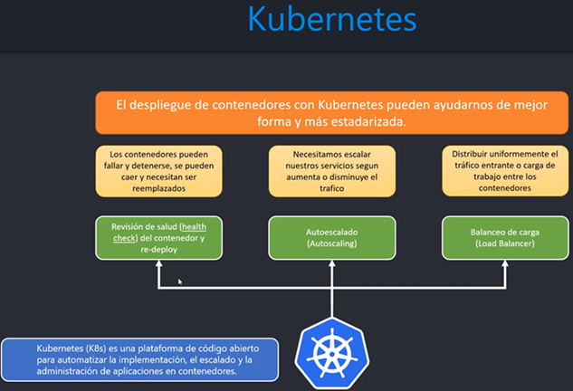
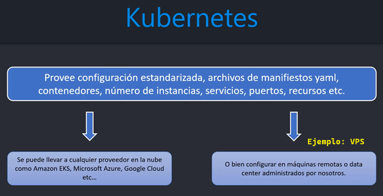
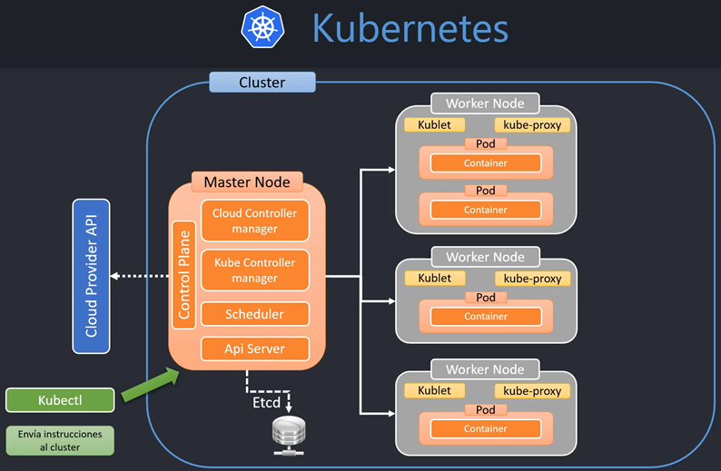
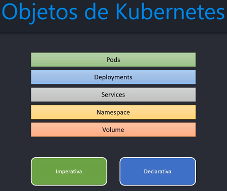
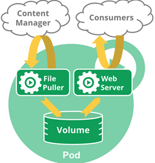
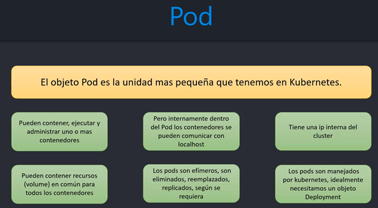
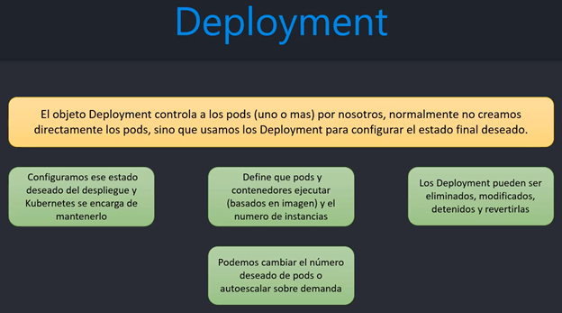

# Sección 14: Kubernetes

---

## Introducción

### [Kubernetes vs Docker Compose](https://www.theserverside.com/blog/Coffee-Talk-Java-News-Stories-and-Opinions/What-is-Kubernetes-vs-Docker-Compose-How-these-DevOps-tools-compare)

`Kubernetes y Docker Compose` **son marcos de orquestación de contenedores.** `Kubernetes` ejecuta contenedores en
varios ordenadores, virtuales o reales. `Docker Compose` ejecuta contenedores en un único equipo anfitrión.

- `Entendiendo Docker Compose`, como se mencionó anteriormente, Docker Compose es una tecnología de orquestación de
  contenedores que está destinada a ejecutar una serie de contenedores en una sola máquina host. Los desarrolladores
  crean un archivo Docker Compose que describe las imágenes de contenedor y la configuración con la que se compone el
  Docker Compose. El nombre de este archivo es `compose.yml` o para versiones anteriores `docker-compose.yml`.
- `Entender Kubernetes`, como se ha mencionado anteriormente, Kubernetes es una tecnología de orquestación de
  contenedores. Bajo Kubernetes, la lógica de una aplicación web se segmenta en contenedores. Los contenedores se
  organizan en una abstracción llamada pod. Un pod puede tener uno o varios contenedores. La lógica de un pod se expone
  a la red a través de otra abstracción de Kubernetes denominada servicio. En resumen, la red conoce los servicios de
  Kubernetes y un servicio conoce el pod o los pods que tienen su lógica. Dentro de cada pod hay uno o varios
  contenedores que realizan la lógica del pod en cuestión.

### [¿Qué es Kubernetes?](https://kubernetes.io/es/docs/concepts/overview/what-is-kubernetes/)

`Kubernetes (K8s)` es una plataforma de código abierto para automatizar la implementación, el escalado y la
administración de aplicaciones en contenedores.





**IMPORTANTE**

> `Kubernetes` no es un servicio en la nube, sino más bien, es un software que podemos instalar y configurar en la nube
> ya sea en una máquina remota que administraremos nosotros (Ejm. EC2, algún otro VPS, etc), es decir, al igual que
> hicimos con `Docker` cuando usamos `EC2` de Amazon, también podemos hacer lo mismo con `Kubernetes`, instalar y
> configurarlo, de forma que sea auto-administrada por nosotros.
>
> Por lo tanto, `Kubernetes` no es un proveedor de servicio, es un `framework` que nos ayuda en el despliegue de
> contenedores de forma automatizada con **revisión de salud, re-deploy, auto-escalamiento, balanceo de carga.**
>
> Podemos usar `Kubernetes` en `Amazon`, `Azure`, `Google Cloud`, etc.

## Arquitectura de Kubernetes

A continuación se muestra la arquitectura general de Kubernetes:



**NOTA**
> - `Minikube`, será nuestro cluster ficticio para desarrollar con Kubernetes con el que trabajaremos en nuestra máquina
    local.
> - `Kubectl`, o `Kube control` es la herramienta cliente para manejar nuestro cluster, en nuestro caso para manejar
    al `minikube`. El `Kubectl` se comunica con el cluster, independientemente si es `minikube` en local o si es un
    cluster de producción en Amazon o cualquier proveedor en la nube.

## Introducción a los objetos de Kubernetes



Existen dos formas de crear objetos: `Imperativa` y `Declarativa`.

- `Declarativa`, basada en archivos de configuración `yaml` o manifiesto.
- `Imperativa`, mediante la línea de comando.

## Los objetos Pods

Los `Pods` son las unidades de computación desplegables más pequeñas que se pueden crear y gestionar en Kubernetes.

Un `Pod` es un grupo de uno o más contenedores (como contenedores Docker), con almacenamiento/red compartidos, y unas
especificaciones de cómo ejecutar los contenedores. Los contenidos de un Pod son siempre coubicados, coprogramados y
ejecutados en un contexto compartido. Un Pod modela un "host lógico" específico de la aplicación: contiene uno o más
contenedores de aplicaciones relativamente entrelazados.

Los contenedores dentro de un Pod comparten dirección IP y puerto, y pueden encontrarse a través de localhost. También
pueden comunicarse entre sí mediante comunicaciones estándar entre procesos, como semáforos de SystemV o la memoria
compartida POSIX. **Los contenedores en diferentes Pods tienen direcciones IP distintas** y no pueden comunicarse por
IPC sin configuración especial. **Estos contenedores normalmente se comunican entre sí a través de las direcciones
IP del Pod.**

A continuación se muestra el diagrama de un `pod`. Un Pod de múltiples contenedores que contiene un extractor de
archivos y un servidor web que utiliza un volumen persistente para el almacenamiento compartido entre los contenedores



> Lo ideal es que un `Pod maneje un solo contenedor`.



## Los objetos Deployments

Un deployment de Kubernetes indica a Kubernetes cómo crear o modificar instancias de los pods que contienen una
aplicación en contenedores. Los despliegues pueden ayudar a escalar eficientemente el número de réplicas de pods,
permitir el despliegue de código actualizado de una manera controlada, o volver a una versión de despliegue anterior si
es necesario. Los despliegues de Kubernetes se completan mediante kubectl, la herramienta de línea de comandos que puede
instalarse en varias plataformas, como Linux, macOS y Windows.

La herramienta Deployment se define como un controlador de la plataforma que tiene la labor de ofrecer actualizaciones
declarativas enfocados en los ReplicaSets y pods disponibles.

De manera que, cuando se establece un estado deseado en un objeto de esta opción, Deployment se encarga de llevar a
cabo, de una manera controlada, la transición entre el estado actual en el que se encuentre el objeto hacia el estado
deseado indicado por el usuario. Esto implica que los pods que estén a cargo de este controlador deban alcanzar dicho
estado.



## Creando deployment MySQL

Antes de crear el deployment con MySQL debemos asegurarnos de levantar `minikube`, así que ejecutamos el siguiente
comando:

````bash
$ minikube start
* minikube v1.29.0 on Microsoft Windows 11 Pro 10.0.22621.2428 Build 22621.2428
* Using the docker driver based on existing profile
* Starting control plane node minikube in cluster minikube
* Pulling base image ...
* Restarting existing docker container for "minikube" ...
* Preparing Kubernetes v1.26.1 on Docker 20.10.23 ...
* Configuring bridge CNI (Container Networking Interface) ...
* Verifying Kubernetes components...
  - Using image gcr.io/k8s-minikube/storage-provisioner:v5
* Enabled addons: storage-provisioner, default-storageclass
* Done! kubectl is now configured to use "minikube" cluster and "default" namespace by default
````

**NOTA**
> Si al ejecutar el `minikube start` nos sale el siguiente mensaje:  `Unable to resolve the current
> Docker CLI context "default": context "default" does not exist`, podemos detener el servicio con `minikube stop`
> y luego ejecutar el siguiente comando: `docker context use default`. Ahora sí volvemos a iniciar minikube y ya no
> deberíamos ver ese mensaje.

Verificamos que se estén ejecutando todos los servicios:

````bash
$ minikube status
minikube
type: Control Plane
host: Running
kubelet: Running
apiserver: Running
kubeconfig: Configured
````

Ahora sí, iniciamos con la creación del `deployment` para MySQL. Recordemos que un deployment tendrá un pod y un pod
tendrá uno o muchos contenedores (en nuestro caso idealmente uno solo). El contenedor que crearemos requerirá una
imagen.

La imagen en kubernetes siempre se descarga de `docker hub`. Ahora, con la forma imperativa no podemos mandar variables
de entorno (ambiente), que es lo que en este caso está esperando la imagen de MySQL para asignar un nombre a la base de
datos y password, por lo que al crear el deployment de manera imperativa esperaremos obtener errorres:

````bash
$ kubectl create deployment mysql-8 --image=mysql:8 --port=3306
deployment.apps/mysql-8 created
````

**DONDE**

- `mysql-8`, nombre del deployment.
- `--image=mysql:8`, imagen de MySQL que será bajada de Docker Hub.
- `--port=3306`, puerto que expone el contenedor de MySQL.

**NOTA**
> Esta forma imperativa de crear deployments, o sea por medio de la línea de comandos, no nos permite asignar variables
> de ambiente con alguna bandera tal como lo hacíamos con `docker run`. Para pasar variables de ambiente si o sí
> necesitamos hacerlo mediante la forma Declarativa, es decir usando un archivo `yaml`. Por esa razón es que
> observaremos algunos errores de inicialización.

Si listamos los deployments veremos que tenemos READY `0/1`, no está listo el deployment. Eso ocurre porque el
contenedor de MySQL espera recibir variables de ambiente y no le hemos pasado, por eso no está READY.

````bash
$ kubectl get deployments
NAME      READY   UP-TO-DATE   AVAILABLE   AGE
mysql-8   0/1     1            0           2m32s
````

Listamos los pods y vemos que estamos obteniendo lo mismo, es decir el status del pod está en `CrashLoopBackOff`, como
que ocurrió un error y es precisamente por lo de las variables de ambiente:

````bash
$ kubectl get pods
NAME                      READY   STATUS             RESTARTS      AGE
mysql-8-f56f8fd89-6xgq2   0/1     CrashLoopBackOff   4 (49s ago)   3m23s
````

Podemos describir el pod para ver qué ocurrió:

````bash
$ kubectl describe pods mysql-8-f56f8fd89-6xgq2
Name:             mysql-8-f56f8fd89-6xgq2
Namespace:        default
Priority:         0
Service Account:  default
Node:             minikube/192.168.49.2
Start Time:       Wed, 08 Nov 2023 10:51:13 -0500
Labels:           app=mysql-8
                  pod-template-hash=f56f8fd89
Annotations:      <none>
Status:           Running
IP:               10.244.0.13
IPs:
  IP:           10.244.0.13
Controlled By:  ReplicaSet/mysql-8-f56f8fd89
Containers:
  mysql:
    Container ID:   docker://1fe1eb3bef87731ed76bf1af955688386d64711b79a37acbc639b3000ebd4e33
    Image:          mysql:8
    Image ID:       docker-pullable://mysql@sha256:1773f3c7aa9522f0014d0ad2bbdaf597ea3b1643c64c8ccc2123c64afd8b82b1
    Port:           3306/TCP
    Host Port:      0/TCP
    State:          Waiting
      Reason:       CrashLoopBackOff
    Last State:     Terminated
      Reason:       Error
      Exit Code:    1
      Started:      Wed, 08 Nov 2023 10:57:55 -0500
      Finished:     Wed, 08 Nov 2023 10:57:55 -0500
    Ready:          False
    Restart Count:  6
    Environment:    <none>
    Mounts:
      /var/run/secrets/kubernetes.io/serviceaccount from kube-api-access-pfm6x (ro)
Conditions:
  Type              Status
  Initialized       True
  Ready             False
  ContainersReady   False
  PodScheduled      True
Volumes:
  kube-api-access-pfm6x:
    Type:                    Projected (a volume that contains injected data from multiple sources)
    TokenExpirationSeconds:  3607
    ConfigMapName:           kube-root-ca.crt
    ConfigMapOptional:       <nil>
    DownwardAPI:             true
QoS Class:                   BestEffort
Node-Selectors:              <none>
Tolerations:                 node.kubernetes.io/not-ready:NoExecute op=Exists for 300s
                             node.kubernetes.io/unreachable:NoExecute op=Exists for 300s
Events:
  Type     Reason     Age                    From               Message
  ----     ------     ----                   ----               -------
  Normal   Scheduled  11m                    default-scheduler  Successfully assigned default/mysql-8-f56f8fd89-6xgq2 to minikube
  Normal   Pulling    11m                    kubelet            Pulling image "mysql:8"
  Normal   Pulled     9m57s                  kubelet            Successfully pulled image "mysql:8" in 1m4.389817249s (1m4.38985075s including waiting)
  Normal   Pulled     8m30s (x4 over 9m55s)  kubelet            Container image "mysql:8" already present on machine
  Normal   Created    8m29s (x5 over 9m57s)  kubelet            Created container mysql
  Normal   Started    8m29s (x5 over 9m56s)  kubelet            Started container mysql
  Warning  BackOff    58s (x44 over 9m54s)   kubelet            Back-off restarting failed container mysql in pod mysql-8-f56f8fd89-6xgq2_default(60be9cec-9a00-4d28-b5a7-d53ed5da850b)
````

Otra forma de ver en detalle el error que ocurrió es con el comando `kubectl logs`:

````bash
$ kubectl logs mysql-8-f56f8fd89-6xgq2
2023-11-08 15:57:55+00:00 [Note] [Entrypoint]: Entrypoint script for MySQL Server 8.2.0-1.el8 started.
2023-11-08 15:57:55+00:00 [Note] [Entrypoint]: Switching to dedicated user 'mysql'
2023-11-08 15:57:55+00:00 [Note] [Entrypoint]: Entrypoint script for MySQL Server 8.2.0-1.el8 started.
2023-11-08 15:57:55+00:00 [ERROR] [Entrypoint]: Database is uninitialized and password option is not specified
    You need to specify one of the following as an environment variable:
    - MYSQL_ROOT_PASSWORD
    - MYSQL_ALLOW_EMPTY_PASSWORD
    - MYSQL_RANDOM_ROOT_PASSWORD
````

## Deployment MySQL con las variables de ambiente

La idea en esta sección es que a partir de la forma `imperativa` de creación del deployment la podamos crear de
forma  `declarativa`, pero antes es necesario eliminar el `deployment` creado en la sección anterior:

````bash
$ kubectl delete deployment mysql-8
deployment.apps "mysql-8" deleted
````

Ahora, volvemos a crear el deployment pero esta vez generando la configuración en un archivo `yml`:

````bash
$ kubectl create deployment mysql-8 --image=mysql:8 --port=3306 --dry-run=client -o yaml > deployment-mysql.yml
````

**DONDE**

- `kubectl create deployment mysql-8 --image=mysql:8 --port=3306`, es el comando que usamos en la sección anterior para
  la creación del deployment de forma `imperativa`. Aquí se usa el mismo, pero además se agregan otros comandos.
- `--dry-run=client`, imprime la configuración que se enviaría al cluster, pero no lo envía. Lo podemos guardar en un
  archivo yml.
- `-o yaml`, la salida de la configuración será en un formato yaml.
- `deployment-mysql.yml`, le damos un nombre al archivo de configuración del deployment de mysql.
- `o yaml > deployment-mysql.yml`, significa que la configuración se va a escribir en el archivo yml.

Como salida podemos observar en la raíz de nuestro proyecto `docker-kubernetes` el archivo `deployment-mysql.yml`
con la siguiente configuración por defecto (algunas configuraciones no lo vamos a necesitar):

````yaml
apiVersion: apps/v1
kind: Deployment
metadata:
  creationTimestamp: null
  labels:
    app: mysql-8
  name: mysql-8
spec:
  replicas: 1
  selector:
    matchLabels:
      app: mysql-8
  strategy: { }
  template:
    metadata:
      creationTimestamp: null
      labels:
        app: mysql-8
    spec:
      containers:
        - image: mysql:8
          name: mysql
          ports:
            - containerPort: 3306
          resources: { }
status: { }
````

Limpiamos el archivo yml anterior y dejamos solo las configuraciones importantes agregando, por supuesto, las variables
de entorno, que fueron el motivo por le cual creamos este archivo:

````yaml
apiVersion: apps/v1
kind: Deployment
metadata:
  name: mysql-8
spec:
  replicas: 1
  selector:
    matchLabels:
      app: mysql-8
  template:
    metadata:
      labels:
        app: mysql-8
    spec:
      containers:
        - image: mysql:8
          name: mysql-8
          ports:
            - containerPort: 3306
          env:
            - name: MYSQL_ROOT_PASSWORD
              value: magadiflo
            - name: MYSQL_DATABASE
              value: db_dk_ms_users
````

**NOTA**
> En mi caso, le cambié al nombre del contenedor. Cuando generamos el archivo desde la línea de comandos, nos creó el
> nombre del contendor `mysql`, pero en mi caso lo renombré a `mysql-8` para tenerlo similar a cómo lo venimos
> trabajando en el docker compose.

Ahora que ya tenemos el archivo del `deployment` con las variables de entorno agregadas, creamos el deployment pero
esta vez usando el comando `apply`, ya que usaremos un archivo `yml`. Es decir, cuando usemos un archivo `yml` la
instrucción será `apply` y no `create`:

````bash
$ kubectl apply -f .\deployment-mysql.yml
deployment.apps/mysql-8 created
````

Ahora, debemos verificar que se ha creado el `deployment` y está en `READY 1/1`:

````bash
$  kubectl get deployments
NAME      READY   UP-TO-DATE   AVAILABLE   AGE
mysql-8   1/1     1            1           2m30s
````

Lo mismo debe ocurrir si listamos los pods:

````bsah
$ kubectl get pods
NAME                       READY   STATUS    RESTARTS   AGE
mysql-8-5b6b68fd77-dvpng   1/1     Running   0          3m46s
````

Describimos el pod y vemos que todo está ok:

````bash
$ kubectl describe pod mysql-8-5b6b68fd77-dvpng
Name:             mysql-8-5b6b68fd77-dvpng
Namespace:        default
Priority:         0
Service Account:  default
Node:             minikube/192.168.49.2
Start Time:       Wed, 08 Nov 2023 12:05:46 -0500
Labels:           app=mysql-8
                  pod-template-hash=5b6b68fd77
Annotations:      <none>
Status:           Running
IP:               10.244.0.20
IPs:
  IP:           10.244.0.20
Controlled By:  ReplicaSet/mysql-8-5b6b68fd77
Containers:
  mysql-8:
    Container ID:   docker://ccd44d6f5704709d5486deb79690a79220d858e6a8b9be4900ca5eda267f1f6b
    Image:          mysql:8
    Image ID:       docker-pullable://mysql@sha256:1773f3c7aa9522f0014d0ad2bbdaf597ea3b1643c64c8ccc2123c64afd8b82b1
    Port:           3306/TCP
    Host Port:      0/TCP
    State:          Running
      Started:      Wed, 08 Nov 2023 12:05:47 -0500
    Ready:          True
    Restart Count:  0
    Environment:
      MYSQL_ROOT_PASSWORD:  magadiflo
      MYSQL_DATABASE:       db_dk_ms_users
    Mounts:
      /var/run/secrets/kubernetes.io/serviceaccount from kube-api-access-xf54g (ro)
Conditions:
  Type              Status
  Initialized       True
  Ready             True
  ContainersReady   True
  PodScheduled      True
Volumes:
  kube-api-access-xf54g:
    Type:                    Projected (a volume that contains injected data from multiple sources)
    TokenExpirationSeconds:  3607
    ConfigMapName:           kube-root-ca.crt
    ConfigMapOptional:       <nil>
    DownwardAPI:             true
QoS Class:                   BestEffort
Node-Selectors:              <none>
Tolerations:                 node.kubernetes.io/not-ready:NoExecute op=Exists for 300s
                             node.kubernetes.io/unreachable:NoExecute op=Exists for 300s
Events:
  Type    Reason     Age    From               Message
  ----    ------     ----   ----               -------
  Normal  Scheduled  4m21s  default-scheduler  Successfully assigned default/mysql-8-5b6b68fd77-dvpng to minikube
  Normal  Pulled     4m21s  kubelet            Container image "mysql:8" already present on machine
  Normal  Created    4m21s  kubelet            Created container mysql
  Normal  Started    4m20s  kubelet            Started container mysql
````

Lo mismo pasará si hacemos verificamos el log:

````bash
$ kubectl logs mysql-8-5b6b68fd77-dvpng
2023-11-08 17:05:47+00:00 [Note] [Entrypoint]: Entrypoint script for MySQL Server 8.2.0-1.el8 started.
2023-11-08 17:05:48+00:00 [Note] [Entrypoint]: Switching to dedicated user 'mysql'
2023-11-08 17:05:48+00:00 [Note] [Entrypoint]: Entrypoint script for MySQL Server 8.2.0-1.el8 started.
...
2023-11-08 17:06:08+00:00 [Note] [Entrypoint]: Creating database db_dk_ms_users
...

2023-11-08 17:06:12+00:00 [Note] [Entrypoint]: MySQL init process done. Ready for start up.

2023-11-08T17:06:12.190446Z 0 [System] [MY-015015] [Server] MySQL Server - start.
...
2023-11-08T17:06:12.491702Z 1 [System] [MY-013576] [InnoDB] InnoDB initialization has started.
2023-11-08T17:06:12.799211Z 1 [System] [MY-013577] [InnoDB] InnoDB initialization has ended.
...
2023-11-08T17:06:13.319966Z 0 [System] [MY-010931] [Server] /usr/sbin/mysqld: ready for connections. Version: '8.2.0'  socket: '/var/run/mysqld/mysqld.sock'  port: 3306  MySQL Community Server - GPL.
````

## Creando el servicio MySQL para la comunicación interna con hostname

Crearemos el servicio que nos permitirá exponer el deployment de MySQL que creamos en la sección anterior, de tal forma
que cuando creemos el pod del microservicio usuarios, este se pueda conectar a MySQL.

> Un `service` nos permite poder acceder a los `pods` que están configurados en un `deployment`, en otras palabras,
> manejan el tráfico hacia esos pods mediante una `ip fija` que no cambia o `nombre de dominio o hostname`.

Antes de ejecutar el comando para crear el servicio, veamos los tipos de comunicación que pude haber en el servicio:

- `--type=ClusterIP`, permite solo la comunicación interna entre pods del cluster de kubernetes.
- `--type=NodePort`, comunicación externa, que los usuarios se puedan conectar a nuestra aplicación mediante este
  servicio. Es la IP del worked node.
- `--type=LoadBalancer`, balancea la carga entre distintos pods distribuidos en distintas máquinas o workerNode. Solo
  podemos usar este tipo siempre y cuando el cluster de kubernetes y el proveedor de servicio lo soporten. Permite la
  comunicación externa y también es para la comunicación interna.

Listo, ahora sí crearemos nuestro servicio usando el tipo `--type=ClusterIP`:

````bash
$ kubectl expose deployment mysql-8 --port=3306 --type=ClusterIP
service/mysql-8 exposed
````

**NOTA**

- `mysql-8`, es el nombre del deployment que vamos a exponer y que será al mismo tiempo el nombre del servicio o el
  nombre del host. Si revisamos el `.env` del `dk-ms-users` veremos la siguiente variable de
  entorno `DATA_BASE_HOST=mysql-8`, ese mysql-8 es el nombre del servicio que se está creando a partir del deployment.
  Es importante que el nombre del servicio sea ese valor ya que como se observa, el microservicio `dk-ms-users` lo usa
  para conectarse a MySQL.

Listamos los servicios para ver el que acabamos de crear:

````bash
$ kubectl get services
NAME         TYPE        CLUSTER-IP     EXTERNAL-IP   PORT(S)    AGE
kubernetes   ClusterIP   10.96.0.1      <none>        443/TCP    18h
mysql-8      ClusterIP   10.103.46.28   <none>        3306/TCP   24s
````

Podemos hacer un describe del servicio de mysql-8:

````bash
$ kubectl describe service mysql-8
Name:              mysql-8
Namespace:         default
Labels:            <none>
Annotations:       <none>
Selector:          app=mysql-8
Type:              ClusterIP
IP Family Policy:  SingleStack
IP Families:       IPv4
IP:                10.103.46.28
IPs:               10.103.46.28
Port:              <unset>  3306/TCP
TargetPort:        3306/TCP
Endpoints:         10.244.0.20:3306
Session Affinity:  None
Events:            <none>
````

Podemos ejecutar el `kubectl get all` para ver todo el escenario completo:

````bash
$ kubectl get all
NAME                           READY   STATUS    RESTARTS   AGE
pod/mysql-8-5b6b68fd77-dvpng   1/1     Running   0          103m

NAME                 TYPE        CLUSTER-IP     EXTERNAL-IP   PORT(S)    AGE
service/kubernetes   ClusterIP   10.96.0.1      <none>        443/TCP    19h
service/mysql-8      ClusterIP   10.103.46.28   <none>        3306/TCP   5m4s

NAME                      READY   UP-TO-DATE   AVAILABLE   AGE
deployment.apps/mysql-8   1/1     1            1           103m

NAME                                 DESIRED   CURRENT   READY   AGE
replicaset.apps/mysql-8-5b6b68fd77   1         1         1       103m
````

## Creando deployment de usuarios

Como nuestro microservicio de usuarios está esperando variables de ambiente y al crear un deployment por línea de
comando no podemos mandar las variables, entonces lo que haremos será similar a lo que hicimos con MySQL, a partir de
una instrucción de línea de comando `imperativa` pasaremos a una `declarativa` mediante un archivo `yml`. Otra opción
podría haber sido si es que a las variables de ambiente del microservicio de usuarios le hubierámos definido valores por
defecto, pero en mi caso no lo hice.

Ejecutamos el siguiente comando para crear nuestro archivo de deployment:

````bash
$ kubectl create deployment dk-ms-users --image=magadiflo/dk-ms-users:latest --port=8001 --dry-run=client -o yaml > deployment-users.yml
````

Se nos creará el archivo `deployment-users.yml` a quien limpiaremos y dejaremos las opciones necesarias y agregaremos al
final las variables de entorno que espera recibir el microservicio `dk-ms-users`.

````yaml
apiVersion: apps/v1
kind: Deployment
metadata:
  name: dk-ms-users
spec:
  replicas: 1
  selector:
    matchLabels:
      app: dk-ms-users
  template:
    metadata:
      labels:
        app: dk-ms-users
    spec:
      containers:
        - image: magadiflo/dk-ms-users:latest
          name: dk-ms-users
          ports:
            - containerPort: 8001
          env:
            - name: CONTAINER_PORT
              value: '8001'
            - name: DATA_BASE_HOST
              value: mysql-8
            - name: DATA_BASE_PORT
              value: '3306'
            - name: DATA_BASE_NAME
              value: db_dk_ms_users
            - name: DATA_BASE_USERNAME
              value: root
            - name: DATA_BASE_PASSWORD
              value: magadiflo
            - name: CLIENT_COURSES_HOST
              value: dk-ms-courses
            - name: CLIENT_COURSES_PORT
              value: '8002'
````

Ahora que ya tenemos el archivo del `deployment` con las variables de entorno agregadas, creamos el deployment pero
esta vez usando el comando `apply`, ya que usaremos un archivo `yml`. Es decir, cuando usemos un archivo `yml` la
instrucción será `apply` y no `create`:

````bash
$ kubectl apply -f .\deployment-users.yml
deployment.apps/dk-ms-users created
````

Listamos los deployments para ver si nuestro deployment de dk-ms-users está READY:

````bash
$ kubectl get deployments
NAME          READY   UP-TO-DATE   AVAILABLE   AGE
dk-ms-users   1/1     1            1           2m14s
mysql-8       1/1     1            1           5h2m
````

Lo mismo debe pasar si listamos los pods:

````bash
$ kubectl get pods
NAME                           READY   STATUS    RESTARTS      AGE
dk-ms-users-6dcd5d485d-q6fxh   1/1     Running   0             3m3s
mysql-8-5b6b68fd77-dvpng       1/1     Running   1 (27m ago)   5h3m
````

Podemos ver todo el escenario completo:

````bash
$ kubectl get all
NAME                               READY   STATUS    RESTARTS      AGE
pod/dk-ms-users-6dcd5d485d-q6fxh   1/1     Running   0             3m57s
pod/mysql-8-5b6b68fd77-dvpng       1/1     Running   1 (28m ago)   5h4m

NAME                 TYPE        CLUSTER-IP     EXTERNAL-IP   PORT(S)    AGE
service/kubernetes   ClusterIP   10.96.0.1      <none>        443/TCP    22h
service/mysql-8      ClusterIP   10.103.46.28   <none>        3306/TCP   3h25m

NAME                          READY   UP-TO-DATE   AVAILABLE   AGE
deployment.apps/dk-ms-users   1/1     1            1           3m57s
deployment.apps/mysql-8       1/1     1            1           5h4m

NAME                                     DESIRED   CURRENT   READY   AGE
replicaset.apps/dk-ms-users-6dcd5d485d   1         1         1       3m57s
replicaset.apps/mysql-8-5b6b68fd77       1         1         1       5h4m
````

También podemos ver el logs del pod del dk-ms-users:

````bash
$ kubectl logs dk-ms-users-6dcd5d485d-q6fxh

  .   ____          _            __ _ _
 /\\ / ___'_ __ _ _(_)_ __  __ _ \ \ \ \
( ( )\___ | '_ | '_| | '_ \/ _` | \ \ \ \
 \\/  ___)| |_)| | | | | || (_| |  ) ) ) )
  '  |____| .__|_| |_|_| |_\__, | / / / /
 =========|_|==============|___/=/_/_/_/
 :: Spring Boot ::                (v3.1.4)

2023-11-08T22:06:17.371Z  INFO 1 --- [           main] c.m.d.b.d.u.app.DkMsUsersApplication     : Starting DkMsUsersApplication v0.0.1-SNAPSHOT using Java 17-ea with PID 1 (/app/app.jar started by root in /app)
2023-11-08T22:06:17.377Z  INFO 1 --- [           main] c.m.d.b.d.u.app.DkMsUsersApplication     : No active profile set, falling back to 1 default profile: "default"
...
2023-11-08T22:06:20.840Z  INFO 1 --- [           main] trationDelegate$BeanPostProcessorChecker : Bean 'com.magadiflo.dk.business.domain.users.app.clients.ICourseFeignClient' of type [org.springframework.cloud.openfeign.FeignClientFactoryBean] is not eligible for getting processed by all BeanPostProcessors (for example: not eligible for auto-proxying)
2023-11-08T22:06:22.068Z  INFO 1 --- [           main] o.s.b.w.embedded.tomcat.TomcatWebServer  : Tomcat initialized with port(s): 8001 (http)
...
2023-11-08T22:06:28.583Z  INFO 1 --- [           main] o.h.e.t.j.p.i.JtaPlatformInitiator       : HHH000490: Using JtaPlatform implementation: [org.hibernate.engine.transaction.jta.platform.internal.NoJtaPlatform]
2023-11-08T22:06:28.726Z DEBUG 1 --- [           main] org.hibernate.SQL                        :
    create table users (
        id bigint not null auto_increment,
        email varchar(255),
        name varchar(255),
        password varchar(255),
        primary key (id)
    ) engine=InnoDB
2023-11-08T22:06:29.027Z DEBUG 1 --- [           main] org.hibernate.SQL                        :
    alter table users
       drop index UK_6dotkott2kjsp8vw4d0m25fb7
2023-11-08T22:06:29.064Z DEBUG 1 --- [           main] org.hibernate.SQL                        :
    alter table users
       add constraint UK_6dotkott2kjsp8vw4d0m25fb7 unique (email)
...
2023-11-08T22:06:32.105Z  INFO 1 --- [           main] o.s.b.w.embedded.tomcat.TomcatWebServer  : Tomcat started on port(s): 8001 (http) with context path ''
2023-11-08T22:06:32.151Z  INFO 1 --- [           main] c.m.d.b.d.u.app.DkMsUsersApplication     : Started DkMsUsersApplication in 16.494 seconds (process running for 17.873)
````

## Creando el servicio de usuarios para la comunicación, tráfico y LoadBalancer

En esta sección crearemos el servicio para el deployment que creamos en el apartado anterior del microservicio
dk-ms-users.

````bash
$ kubectl expose deployment dk-ms-users --port=8001 --type=LoadBalancer
service/dk-ms-users exposed
````

**DONDE**

- `--port=8001`, el puerto del servicio para poder manejar el tráfico hacia el pod y del pod hacia el contenedor del
  microservicio dk-ms-users.
- `LoadBalancer`, porque **necesitamos exponer el servicio de forma externa**, aunque también es para la comunicación
  interna.

Verificamos el servicio creado para el deployment de `dk-ms-users` que curiosamente también tiene el mismo nombre:

````bash
$ kubectl get services
NAME          TYPE           CLUSTER-IP      EXTERNAL-IP   PORT(S)          AGE
dk-ms-users   LoadBalancer   10.111.35.107   <pending>     8001:30767/TCP   76s
kubernetes    ClusterIP      10.96.0.1       <none>        443/TCP          22h
mysql-8       ClusterIP      10.103.46.28    <none>        3306/TCP         3h44m
````

### Run service tunnel

Ejecutamos el siguiente comando, que es propio de `minikube`, podremos obtener la ip y el puerto del cluster de minikube
para poder acceder a nuestros microservicios de manera externa:

````bash
$ minikube service dk-ms-users --url
http://127.0.0.1:57550
! Because you are using a Docker driver on windows, the terminal needs to be open to run it.
````

**DONDE**  
`minikube service dk-ms-users --url`, se ejecuta como un proceso, creando un túnel hacia el cluster. El comando expone
el servicio directamente a cualquier programa que se ejecute en el sistema operativo anfitrión.

Abrimos otra terminal y probamos acceder al microservicio de usuarios con la url proporcionada:

````bash
$ curl -v http://127.0.0.1:57550/api/v1/users | jq

>
< HTTP/1.1 200
< Content-Type: application/json
<
[]
````

Vemos que inicialmente no tenemos ningún usuario, así que aprovechamos y creamos algunos de ellos:

````bash
$ curl -v -X POST -H "Content-Type: application/json" -d "{\"name\": \"martin\", \"email\":\"martin@gmail.com\", \"password\": \"12345\"}" http://localhost:57550/api/v1/users | jq

>
< HTTP/1.1 201
< Location: http://localhost:57550/api/v1/users/1
< Content-Type: application/json
<
{
  "id": 1,
  "name": "martin",
  "email": "martin@gmail.com",
  "password": "12345"
}
````

Volvemos a listar los usuarios y vemos todos los que acabamos de registrar:

````bash
$ curl -v http://127.0.0.1:57550/api/v1/users | jq

>
< HTTP/1.1 200
< Content-Type: application/json
<
[
  {
    "id": 1,
    "name": "martin",
    "email": "martin@gmail.com",
    "password": "12345"
  },
  {
    "id": 2,
    "name": "Karen",
    "email": "karen@gmail.com",
    "password": "12345"
  },
  {
    "id": 3,
    "name": "Maria",
    "email": "maria@gmail.com",
    "password": "12345"
  },
  {
    "id": 4,
    "name": "Tinkler",
    "email": "tinkler@gmail.com",
    "password": "12345"
  }
]
````

## Actualizando imagen de un deployment

Podemos modificar de forma `imperativa` (línea de comandos) una imagen de un deployment. Vamos a tener un deployment,
también está el pod y el contenedor. La idea es actualizar la imagen luego de la modificación de nuestro código fuente
en un despliegue.

Veamos el siguiente ejemplo. Realizaremos una modificación al código fuente del endpoint del listar de usuarios para que
nos retorne una información diferente `users` y `message`:

````java

@RestController
@RequestMapping(path = "/api/v1/users")
public class UserController {
    /* other code */

    private final ApplicationContext context;

    public UserController(IUserService userService, ApplicationContext context) {
        this.userService = userService;
        this.context = context;
    }

    @GetMapping(path = "/cause-error")
    public void causeError() {
        ((ConfigurableApplicationContext) this.context).close();
    }

    @GetMapping
    public ResponseEntity<Map<String, Object>> getAllUsers() {
        Map<String, Object> body = new HashMap<>();
        body.put("users", this.userService.findAllUsers());
        body.put("message", "Lista de todos los usuarios");
        return ResponseEntity.ok(body);
    }
    /* other code */
}
````

Notar que además he agregado un nuevo endpoint `/cause-error`, este endpoint será usado más adelante, pero usamos esta
modificación del código para definirlo. La idea es que cuando invoquemos el endpoint `/api/v1/users/cause-error`
provocaremos deliberadamente un error para que nuestra aplicación se caiga. Es ahí que Kubernetes va a manejar esa
situación tratando de reiniciar el pod a fin de mantener el escenario ideal. Pero eso lo veremos más adelante, por ahora
centrémonos en la modificación que hicimos en el código y cómo es que se verá reflejado en el deployment.

Entonces, luego de haber realizado la modificación del código fuente necesitamos generar la imagen utilizando el
Dockerfile:

````bash
$ docker build -t dk-ms-users . -f .\business-domain\dk-ms-users\Dockerfile
[+] Building 29.5s (20/20) FINISHED

$ docker image ls
REPOSITORY                    TAG         IMAGE ID       CREATED              SIZE
dk-ms-users                   latest      9b977fb5c82d   About a minute ago   387MB
magadiflo/dk-ms-users         latest      9750159d18ce   4 days ago           387MB
magadiflo/dk-ms-courses       latest      a66bf68642d1   6 days ago           385MB
mysql                         8           a3b6608898d6   2 weeks ago          596MB
postgres                      14-alpine   ed089947c1bd   5 weeks ago          236MB
gcr.io/k8s-minikube/kicbase   v0.0.37     01c0ce65fff7   9 months ago         1.15GB
````

Tenemos nuestra imagen `dk-ms-users` en nuestra plataforma local de docker. Ahora, como vamos a requerir subir esa
imagen a `Docker Hub` necesitamos renombrarlo, pero debemos `IMPORTANTE: asignarle un tag diferente` para que cuando
actualicemos la
imagen dentro del pod, sea uno distinto al que ya existe y haga la actualización:

````bash
$ docker tag dk-ms-users magadiflo/dk-ms-users:v2

$ docker image ls
REPOSITORY                    TAG         IMAGE ID       CREATED          SIZE
dk-ms-users                   latest      9b977fb5c82d   16 minutes ago   387MB
magadiflo/dk-ms-users         latest      9b977fb5c82d   16 minutes ago   387MB
magadiflo/dk-ms-users         v2          9b977fb5c82d   16 minutes ago   387MB
magadiflo/dk-ms-users         <none>      9750159d18ce   4 days ago       387MB
magadiflo/dk-ms-courses       latest      a66bf68642d1   6 days ago       385MB
mysql                         8           a3b6608898d6   2 weeks ago      596MB
postgres                      14-alpine   ed089947c1bd   5 weeks ago      236MB
gcr.io/k8s-minikube/kicbase   v0.0.37     01c0ce65fff7   9 months ago     1.15GB
````

Procedemos a subir nuestra imagen actualizada a `Docker Hub`:

````bash
$ docker push magadiflo/dk-ms-users:v2
````

Averiguamos el nombre del contenedor que vamos a actualizar:

````bash
$ kubectl get pods
NAME                           READY   STATUS    RESTARTS       AGE
dk-ms-users-6dcd5d485d-q6fxh   1/1     Running   0              136m
mysql-8-5b6b68fd77-dvpng       1/1     Running   1 (160m ago)   7h17m

$ kubectl describe pod dk-ms-users-6dcd5d485d-q6fxh
Name:             dk-ms-users-6dcd5d485d-q6fxh
Namespace:        default
Priority:         0
Service Account:  default
Node:             minikube/192.168.49.2
Start Time:       Wed, 08 Nov 2023 17:06:11 -0500
Labels:           app=dk-ms-users
                  pod-template-hash=6dcd5d485d
Annotations:      <none>
Status:           Running
IP:               10.244.0.24
IPs:
  IP:           10.244.0.24
Controlled By:  ReplicaSet/dk-ms-users-6dcd5d485d
Containers:
  dk-ms-users:
    Container ID:   docker://7aebfd1e9ccdaf13df6026db6fe454d8b958a7596d1b6e10c7131ce1965de466
    Image:          magadiflo/dk-ms-users:latest
    Image ID:       docker-pullable://magadiflo/dk-ms-users@sha256:3119dc0a31622211d8c9e00b9430be86b69cfacc939288665135590cdbaee43f
    Port:           8001/TCP
....
````

Entonces, vemos que el nombre del contenedor es `dk-ms-users` y está usando la imagen `magadiflo/dk-ms-users:latest`,
por lo que ahora toca actualizarlo:

````bash
$ kubectl set image deployment dk-ms-users dk-ms-users=magadiflo/dk-ms-users:v2
deployment.apps/dk-ms-users image updated
````

**DONDE**

- `set image`, vamos a setear una imagen.
- `deployment dk-ms-users`, el `dk-ms-users` nombre del deployment.
- `dk-ms-users=magadiflo/dk-ms-users:v2`, el `dk-ms-users` es el nombre del contenedor y el `magadiflo/dk-ms-users:v2`
  es la nueva imagen con los cambios actualizados que subimos a `Docker Hub`.

Ahora verificaremos si los cambios han surtido efecto. Para eso debemos obtener la url externa para poder acceder al
microservicio `dk-ms-userse`:

````bash
$ minikube service dk-ms-users --url
http://127.0.0.1:59625
! Because you are using a Docker driver on windows, the terminal needs to be open to run it.
````

Ahora, realizamos una petición al microservicio de usuarios y obtenemos los cambios modificados `message` y el `users`:

````bash
$ curl -v http://127.0.0.1:59625/api/v1/users | jq

>
< HTTP/1.1 200
< Content-Type: application/json
<
{
  "message": "Lista de todos los usuarios",
  "users": [
    {
      "id": 1,
      "name": "martin",
      "email": "martin@gmail.com",
      "password": "12345"
    },
    {
      "id": 2,
      "name": "Karen",
      "email": "karen@gmail.com",
      "password": "12345"
    },
    {
      "id": 3,
      "name": "Maria",
      "email": "maria@gmail.com",
      "password": "12345"
    },
    {
      "id": 4,
      "name": "Tinkler",
      "email": "tinkler@gmail.com",
      "password": "12345"
    }
  ]
}
````

Aunque ya estamos seguros de que los cambios han surtido efecto, podemos ver la imagen que está usando el contenedor,
que en este caso debe ser `magadiflo/dk-ms-users:v2`. **Otro punto importante es que cuando actualizamos la imagen en
el deployment se crea una nueva instancia del pod y la instancia anterior se elimina, por eso es que vemos que el nombre
del pod actual es diferente al que teníamos antes de actualizar la imagen.**

````bash
$ kubectl get pods
NAME                           READY   STATUS    RESTARTS       AGE
dk-ms-users-79f6bc75f9-4fvsb   1/1     Running   0              6m49s
mysql-8-5b6b68fd77-dvpng       1/1     Running   1 (179m ago)   7h35m

$ kubectl describe pod dk-ms-users-79f6bc75f9-4fvsb
Name:             dk-ms-users-79f6bc75f9-4fvsb
Namespace:        default
Priority:         0
Service Account:  default
Node:             minikube/192.168.49.2
Start Time:       Wed, 08 Nov 2023 19:34:17 -0500
Labels:           app=dk-ms-users
                  pod-template-hash=79f6bc75f9
Annotations:      <none>
Status:           Running
IP:               10.244.0.25
IPs:
  IP:           10.244.0.25
Controlled By:  ReplicaSet/dk-ms-users-79f6bc75f9
Containers:
  dk-ms-users:
    Container ID:   docker://db172c63b59541a66d75c048408eed66fde3ff59c3b73aeb056f30b85a3253ef
    Image:          magadiflo/dk-ms-users:v2
    Image ID:       docker-pullable://magadiflo/dk-ms-users@sha256:b3b3b47bcdcbae1981792b2b19809ca8a48fdfb03c0b7ba3eb25dada0eb8f07d
    Port:           8001/TCP
...
````

### Provocando error

Ahora usaremos el método que creamos cuando modificamos el código fuente para observar cómo es que kubernetes vuelve a
reiniciar el pod:

Provocamos el error:

````bash
$ curl -v http://127.0.0.1:59625/api/v1/users/cause-error | jq
  % Total    % Received % Xferd  Average Speed   Time    Time     Time  Current
                                 Dload  Upload   Total   Spent    Left  Speed
  0     0    0     0    0     0      0      0 --:--:-- --:--:-- --:--:--     0*   Trying 127.0.0.1:59625...
* Connected to 127.0.0.1 (127.0.0.1) port 59625 (#0)
> GET /api/v1/users/cause-error HTTP/1.1
> Host: 127.0.0.1:59625
> User-Agent: curl/8.0.1
> Accept: */*
>
  0     0    0     0    0     0      0      0 --:--:--  0:00:02 --:--:--     0* Empty reply from server
  0     0    0     0    0     0      0      0 --:--:--  0:00:02 --:--:--     0
* Closing connection 0
curl: (52) Empty reply from server
````

Verificamos cómo es que el pod se está reiniciando:

````bash
$ kubectl get pods
NAME                           READY   STATUS    RESTARTS        AGE
dk-ms-users-79f6bc75f9-4fvsb   1/1     Running   2 (4m54s ago)   16m
mysql-8-5b6b68fd77-dvpng       1/1     Running   1 (3h8m ago)    7h45m
````

Observamos que el `STATUS` dice `Running` y en `RESTARTS` hay dos reinicios. De esa manera comprobamos cómo es
que kubernetes maneja las caídas, reinicia el pod.

## Réplicas, escalando instancias de pods en Deployment

En este apartado abordaremos las réplicas para poder aumentar o escalar la cantidad de instancias de los pods de un
deployment.

**NOTA**
> Hasta este punto, el endpoint que modifiqué en el apartado anterior del listar usuarios, lo he reestablecido a su
> código original, luego generado una nueva imagen y subido a docker hub, para posteriormente actualizar el deployment
> seteándole la nueva imagen, de tal forma que ahora el pod que contiene el contenedor se ha actualizado a la nueva
> versión de la imagen v3

Veamos parte de la actualización que se hizo al deployment, al final observamos que cuando llamamos al endpoint la
respuesta es una lista ya no con los atributos `message` ni `users`:

````bash
$ kubectl set image deployment dk-ms-users dk-ms-users=magadiflo/dk-ms-users:v3
deployment.apps/dk-ms-users image updated

$ kubectl describe pod dk-ms-users-657885bbb-fdqcb
Name:             dk-ms-users-657885bbb-fdqcb
Namespace:        default
...
Status:           Running
IP:               10.244.0.29
IPs:
  IP:           10.244.0.29
Controlled By:  ReplicaSet/dk-ms-users-657885bbb
Containers:
  dk-ms-users:
    Container ID:   docker://ac6a34d0e0d7a7ca1e039ab6cb16f3e01b0338ea13211ccfd3e18cb50b44c1c8
    Image:          magadiflo/dk-ms-users:v3
    Image ID:       docker-pullable://magadiflo/dk-ms-users@sha256:d7dc06387fc67581294318c66064728e47ecc7b4642b27b73b3b0a7dcd99ee3e
    Port:           8001/TCP
...

$ minikube service dk-ms-users --url
http://127.0.0.1:56205
! Because you are using a Docker driver on windows, the terminal needs to be open to run it.

$ curl -v http://127.0.0.1:56205/api/v1/users | jq

>
< HTTP/1.1 200
< Content-Type: application/json
<
[
  {
    "id": 1,
    "name": "Tinkler",
    "email": "tinkler@gmail.com",
    "password": "12345"
  }
]
````

Ahora nos toca escalar los números de pods a 3 réplicas, siempre realizándolo de manera `imperativa` (línea de comando):

````bash
$  kubectl scale deployment dk-ms-users --replicas=3
deployment.apps/dk-ms-users scaled
````

Si ahora listamos el número de pods, podremos ver las tres réplicas generadas:

````bash
$ kubectl get pods
NAME                          READY   STATUS    RESTARTS      AGE
dk-ms-users-657885bbb-82b2d   1/1     Running   0             85s
dk-ms-users-657885bbb-f6k9s   1/1     Running   0             85s
dk-ms-users-657885bbb-fdqcb   1/1     Running   0             22m
mysql-8-5b6b68fd77-dvpng      1/1     Running   2 (29m ago)   22h
````

Ahora, cuando hagamos peticiones a nuestro microservicio de usuarios, el service va a balancear la carga entre los 3
pods existentes de forma equitativa.

Qué pasa si ahora mismo ejecutamos el endpoint de `/cause-error` teniendo las tres réplicas levantadas:

````bash
$  curl -v http://127.0.0.1:56339/api/v1/users/cause-error | jq

>
  0     0    0     0    0     0      0      0 --:--:--  0:00:02 --:--:--     0* Empty reply from server
  0     0    0     0    0     0      0      0 --:--:--  0:00:02 --:--:--     0
* Closing connection 0
curl: (52) Empty reply from server
````

Bueno, automáticamente el pod que falla se va a reiniciar, pero estaremos seguros de que mientras ocurre el reinicio
del pod que falló nuestra aplicación va a seguir funcionando pues tenemos dos réplicas más:

````bash
$ kubectl get pods
NAME                          READY   STATUS    RESTARTS      AGE
dk-ms-users-657885bbb-82b2d   1/1     Running   0             8m2s
dk-ms-users-657885bbb-f6k9s   1/1     Running   1 (8s ago)    8m2s
dk-ms-users-657885bbb-fdqcb   1/1     Running   0             29m
mysql-8-5b6b68fd77-dvpng      1/1     Running   2 (35m ago)   22h
````

Listo, ahora que ya comprobamos el funcionamiento del escalado vamos a dejar el pod en 1 réplica:

````bash
$ kubectl scale deployment dk-ms-users --replicas=1
deployment.apps/dk-ms-users scaled

$ kubectl get pods
NAME                          READY   STATUS    RESTARTS      AGE
dk-ms-users-657885bbb-fdqcb   1/1     Running   0             35m
mysql-8-5b6b68fd77-dvpng      1/1     Running   2 (42m ago)   22h
````

## Pasando del método Imperativo al Declarativo con archivos de configuraciones yml

Actualmente, tenemos creado los servicios de `mysql-8` y `dk-ms-users`, observemos:

````bash
$ kubectl get services
NAME          TYPE           CLUSTER-IP      EXTERNAL-IP   PORT(S)          AGE
dk-ms-users   LoadBalancer   10.111.35.107   <pending>     8001:30767/TCP   17h
kubernetes    ClusterIP      10.96.0.1       <none>        443/TCP          40h
mysql-8       ClusterIP      10.103.46.28    <none>        3306/TCP         21h
````

Ahora, qué pasa si mediante la línea de comandos imprimimos en la salida los detalles del servicio `mysql-8` en un
formato `yaml`:

````bash
$ kubectl get service mysql-8 -o yaml
apiVersion: v1
kind: Service
metadata:
  creationTimestamp: "2023-11-08T18:44:35Z"
  name: mysql-8
  namespace: default
  resourceVersion: "12279"
  uid: 6ea4555b-c04f-4f6a-998f-60cf6f00e385
spec:
  clusterIP: 10.103.46.28
  clusterIPs:
  - 10.103.46.28
  internalTrafficPolicy: Cluster
  ipFamilies:
  - IPv4
  ipFamilyPolicy: SingleStack
  ports:
  - port: 3306
    protocol: TCP
    targetPort: 3306
  selector:
    app: mysql-8
  sessionAffinity: None
  type: ClusterIP
status:
  loadBalancer: {}
````

La salida anterior la podemos imprimir en un archivo con formato `yml`. Para eso nos debemos posicionar en la
raíz de nuestro proyecto `docker-kubernetes` y ejecutar el siguiente comando:

````bash
$ kubectl get service mysql-8 -o yaml > service-mysql.yml
````

Debemos observar en la raíz de nuestro proyecto la creación del archivo `service-mysql.yml` y dentro de él la
configuración anterior, aunque le realizaremos limpieza para dejar solo las opciones principales:

````yaml
apiVersion: v1
kind: Service
metadata:
  name: mysql-8
spec:
  ports:
    - port: 3306
      protocol: TCP
      targetPort: 3306
  selector:
    app: mysql-8
  type: ClusterIP
````

**DONDE**

- `port`, puerto del servicio que se va a exponer.
- `targetPort`, puerto interno que tendrá el contendedor, es decir, puerto del mysql que está dentro del contenedor.
- `selector`, selecciona un conjunto de pods que contengan los `labels` o etiquetas: `app: mysql-8`. En otras palabras,
  seleccionará todos los pods (incluyendo todas sus instancias o réplicas) que están en cualquier `deployment` que
  tengan la etiqueta `app: mysql-8`. Si vamos al archivo `deployment-mysql.yml` veremos en el apartado
  de `template: metadata: labels: app: mysql-8` al que precisamente se está haciendo referencia en este servicio.
- `type: ClusterIP`, para la comunicación interna.

Lo mismo haremos para el servicio de `dk-ms-users` que fue creado a partir del deployment `deployment-users.yml`:

````bash
$ kubectl get service dk-ms-users -o yaml > service-dk-ms-users.yml
````

Una vez creada el archivo `service-dk-ms-users.yml` dejamos solo las opciones importantes:

````yaml
apiVersion: v1
kind: Service
metadata:
  name: dk-ms-users
spec:
  ports:
    - port: 8001
      protocol: TCP
      targetPort: 8001
  selector:
    app: dk-ms-users
  type: LoadBalancer
````

## Trabajando de forma declarativa yaml

Antes de continuar en esta sección veamos que tenemos dos deployments: `dk-ms-users` y el `mysql-8`:

````bash
$ kubectl get deployments
NAME          READY   UP-TO-DATE   AVAILABLE   AGE
dk-ms-users   1/1     1            1           19h
mysql-8       1/1     1            1           24h
````

Ahora, volveremos a empezar desde cero, así que necesitamos eliminar el deployment `dk-ms-users`. Solo para mostrar
cómo es que de manera `imperativa` (usando línea de comando) podríamos eliminar ese deployment es que a continuación
se muestra el comando:

````bash
$ kubectl delete deployment dk-ms-users
````

Bien, pero en este apartado lo haremos de manera `declarativa` (archivo de configuración yaml) usando el siguiente
comando y el archivo `deployment-users.yml`:

````bash
$ kubectl delete -f .\deployment-users.yml
deployment.apps "dk-ms-users" deleted
````

El comando anterior no es que vaya a eliminar el archivo de configuración `deployment-users.yml`, sino más bien,
eliminaremos el deployment que está configurado en ese archivo. Ahora, volvemos a listar los deployments y vemos
que efectivamente se ha eliminado el de usuarios, incluso si listamos los pods veremos que no hay algún pod de usuarios:

````bash
$ kubectl get deployments
NAME      READY   UP-TO-DATE   AVAILABLE   AGE
mysql-8   1/1     1            1           24h

$ kubectl get pods
NAME                       READY   STATUS    RESTARTS       AGE
mysql-8-5b6b68fd77-dvpng   1/1     Running   2 (173m ago)   25h
````

Ahora, volveremos a crear el `deployment` a partir del archivo `deployment-users.yml`. Recordemos que en apartados
superiores ya habíamos creado el deployment con este archivo de configuración, así que lo volveremos a hacer:

````bash
$ kubectl apply -f .\deployment-users.yml
deployment.apps/dk-ms-users created
````

Si listamos los `deployments` veremos que tenemos de nuevo al `dk-ms-users` incluso si listamos los pods volveremos
a tener el de usuarios:

````bash
$ kubectl get deployments
NAME          READY   UP-TO-DATE   AVAILABLE   AGE
dk-ms-users   1/1     1            1           43s
mysql-8       1/1     1            1           2

$ kubectl get pods
NAME                           READY   STATUS    RESTARTS       AGE
dk-ms-users-6dcd5d485d-ft7hq   1/1     Running   0              19s
mysql-8-5b6b68fd77-dvpng       1/1     Running   2 (175m ago)   25h
````

Listo, ahora qué pasa si modificamos el archivo `deployment-users.yarml` e incrementamos a 5 réplicas:

````yaml
apiVersion: apps/v1
kind: Deployment
metadata:
  name: dk-ms-users
spec:
  replicas: 5
  selector:
...
````

Con el nuevo cambio, es fácil volver a actualizar los cambios:

````bash
$  kubectl apply -f .\deployment-users.yml
deployment.apps/dk-ms-users configured
````

Observemos que ahora no dice `created` porque ya teníamos creado el archivo, sino más bien dice `configured` porque
actualizamos el deployment. Si ahora verificamos los pods, veremos las 5 instancias creadas:

````bash
$ kubectl get pods
NAME                           READY   STATUS    RESTARTS       AGE
dk-ms-users-6dcd5d485d-ft7hq   1/1     Running   0              10m
dk-ms-users-6dcd5d485d-pt84g   1/1     Running   0              31s
dk-ms-users-6dcd5d485d-vg5xf   1/1     Running   0              4m16s
dk-ms-users-6dcd5d485d-vqmgv   1/1     Running   0              4m16s
dk-ms-users-6dcd5d485d-wnl6s   1/1     Running   0              31s
mysql-8-5b6b68fd77-dvpng       1/1     Running   2 (3h5m ago)   25h
````

Ahora, si vemos el servicio `dk-ms-users` debemos observar que detectó las ip de las 5 instancias de los pods, eso lo
podemos ver en el `Endpoints` al mostrar las ipd de cada pod. El servicio las usará con balanceo de carga, por eso
es que vemos este atributo: `Type: LoadBalancer`

````bash
$ kubectl describe service dk-ms-users
Name:                     dk-ms-users
Namespace:                default
Labels:                   <none>
Annotations:              <none>
Selector:                 app=dk-ms-users
Type:                     LoadBalancer
IP Family Policy:         SingleStack
IP Families:              IPv4
IP:                       10.111.35.107
IPs:                      10.111.35.107
Port:                     <unset>  8001/TCP
TargetPort:               8001/TCP
NodePort:                 <unset>  30767/TCP
Endpoints:                10.244.0.33:8001,10.244.0.34:8001,10.244.0.35:8001 + 2 more...
...
````

## Escribiendo Deployment declarativo de postgres

Al igual que generé el archivo `deployment` para mysql, lo mismo haremos para postgres, pero esta vez lo haremos de
manera manual, ya que si recordamos para crear el archivo `deployment-mysql.yml` usamos el comando siguiente:

````bash
$ kubectl create deployment mysql-8 --image=mysql:8 --port=3306 --dry-run=client -o yaml > deployment-mysql.yml
````

Cuando ejecutamos el comando anterior nos creó automáticamente el archivo `deployment-mysql.yml` con ciertas
configuraciones previas que le definimos precisamente en esa línea de comando más otras configuraciones adicionales
propias de la creación del deployment.

Ahora, en esta oportunidad crearemos el archivo `deployment-postgres.yml` manualmente e iremos agregando las
configuraciones uno a uno. Por lo tanto, empezamos creando el archivo `deployment-postgres.yml` en la raíz del proyecto
`docker-kubernetes`.

**NOTA**
> Siempre es bueno revisar la documentación oficial, ya que allí encontraremos la configuraciones que debemos utilizar.
> Para nuestro caso, como estamos configurando el deployment, podemos visitar la siguiente página
> [kubernetes/deployment](https://kubernetes.io/es/docs/concepts/workloads/controllers/deployment/)

Finalmente, el archivo `deployment-postgres.yml` quedaría de esta manera:

````yaml
apiVersion: apps/v1
kind: Deployment
metadata:
  name: postgres-14
spec:
  replicas: 1
  selector:
    matchLabels:
      app: postgres-14
  template:
    metadata:
      labels:
        app: postgres-14
    spec:
      containers:
        - image: postgres:14-alpine
          name: postgres-14
          ports:
            - containerPort: 5432
          env:
            - name: POSTGRES_PASSWORD
              value: magadiflo
            - name: POSTGRES_DB
              value: db_dk_ms_courses
````

## Escribiendo service declarativo de postgres

Continuamos con el `service`, ya que ahora necesitamos exponer el `deployment` creado en el apartado anterior, es decir
exponer el contenedor que está dentro del deployment creado anteriormente, con la finalidad de que los pods internos
puedan comunicarse entre sí, por ejemplo. cuando creemos el `pod` para el contenedor del microservicio de cursos,
este se deberá comunicar con la base de datos de postgres que estará dentro de un contenedor y este a su vez,
estará en el pod que se generará a partir del deployment anterior.

Nuestra configuración del servicio de postgres será el siguiente:

````yaml
apiVersion: v1
kind: Service
metadata:
  name: postgres-14
spec:
  ports:
    - port: 5432
      protocol: TCP
      targetPort: 5432
  selector:
    app: postgres-14
  type: ClusterIP
````

Veamos el siguiente fragmento de configuración para entender a qué corresponde cada puerto:

````yaml
...
spec:
  ports:
    - port: 5432
      protocol: TCP
      targetPort: 5432
...
````

- `port`: Corresponde al puerto del service. Este puerto es para manejar el tráfico del servicio hacia el pod.
- `targetPort`: Puerto que se abrirá en el contenedor interno, el de la base de datos de postgres.

Ahora, en la siguiente configuración indicamos qué tipo de `pod` vamos a seleccionar. Este pod tiene que tener esta
etiqueta `app: postgres-14`:

````yaml
...
selector:
  app: postgres-14
...
````

Para comprobar si el pod tiene esa etiqueta vamos al archivo `deployment-postgres.yml` y vemos que efectivamente en
la sección de template (que corresponde a los pods) tenemos dicha etiqueta:

````yaml
...
template:
  metadata:
    labels:
      app: postgres-14
...
````

## Aplicando deployment y service de Postgres

Una vez que tenemos los dos archivos en la raíz de nuestro proyecto, llega el momento de aplicarlos. Empezaremos con el
`deployment-postgres.yml`:

````bash
$ kubectl apply -f .\deployment-postgres.yml
deployment.apps/postgres-14 created

$ kubectl get deployments
NAME          READY   UP-TO-DATE   AVAILABLE   AGE
dk-ms-users   1/1     1            1           6h20m
mysql-8       1/1     1            1           85m
postgres-14   1/1     1            1           84s

$ kubectl get pods
NAME                           READY   STATUS    RESTARTS      AGE
dk-ms-users-6dcd5d485d-ft7hq   1/1     Running   2 (87m ago)   6h21m
mysql-8-54cdfbcd48-lq8g6       1/1     Running   0             85m
postgres-14-8454947444-j4pwq   1/1     Running   0             91s
````

Ahora continuamos con el archivo `service-postgres.yml`:

````bash
$  kubectl apply -f .\service-postgres.yml
service/postgres-14 created

$ kubectl get services
NAME          TYPE           CLUSTER-IP      EXTERNAL-IP   PORT(S)          AGE
dk-ms-users   LoadBalancer   10.111.35.107   <pending>     8001:30767/TCP   26h
kubernetes    ClusterIP      10.96.0.1       <none>        443/TCP          2d
mysql-8       ClusterIP      10.103.46.28    <none>        3306/TCP         29h
postgres-14   ClusterIP      10.111.140.17   <none>        5432/TCP         46s
````

**NOTA**
> Podríamos haber ejecutado los dos archivos al mismo tiempo:
>
> `kubectl apply -f .\deployment-postgres.yml -f .\service-postgres.yml `

Podemos ver todos los objetos que tenemos hasta ahora:

````bash
$ kubectl get all
NAME                               READY   STATUS    RESTARTS      AGE
pod/dk-ms-users-6dcd5d485d-ft7hq   1/1     Running   2 (91m ago)   6h25m
pod/mysql-8-54cdfbcd48-lq8g6       1/1     Running   0             89m
pod/postgres-14-8454947444-j4pwq   1/1     Running   0             5m35s

NAME                  TYPE           CLUSTER-IP      EXTERNAL-IP   PORT(S)          AGE
service/dk-ms-users   LoadBalancer   10.111.35.107   <pending>     8001:30767/TCP   26h
service/kubernetes    ClusterIP      10.96.0.1       <none>        443/TCP          2d
service/mysql-8       ClusterIP      10.103.46.28    <none>        3306/TCP         29h
service/postgres-14   ClusterIP      10.111.140.17   <none>        5432/TCP         3m1s

NAME                          READY   UP-TO-DATE   AVAILABLE   AGE
deployment.apps/dk-ms-users   1/1     1            1           6h25m
deployment.apps/mysql-8       1/1     1            1           89m
deployment.apps/postgres-14   1/1     1            1           5m36s

NAME                                     DESIRED   CURRENT   READY   AGE
replicaset.apps/dk-ms-users-6dcd5d485d   1         1         1       6h25m
replicaset.apps/mysql-8-54cdfbcd48       1         1         1       89m
replicaset.apps/postgres-14-8454947444   1         1         1       5m36s
````