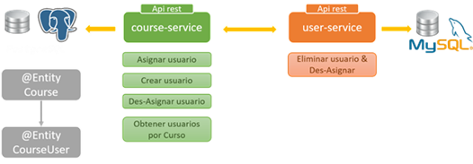
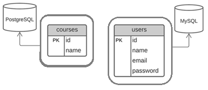
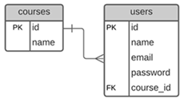
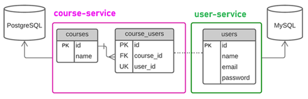
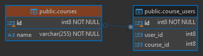
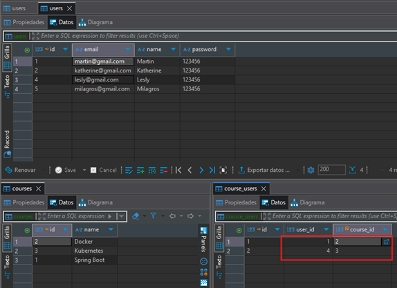

# Sección 05: RestClient: Comunicación entre microservicios

> En esta sección el autor trabaja con `HTTP Feign Client`, pero en mi caso optaré por trabajar con el nuevo cliente
> rest proporcionado por `Spring Boot 3.2`, el `RestClient`.
---

## Introducción: Conectando microservicios

En esta sección veremos cómo relacionar nuestros dos microservicios `user-service` y `course-service`. Luego,
agregaremos funcionalidades en ambos microservicios que nos ayudarán a establecer la comunicación.

En la siguiente imagen vemos un panorama general de lo que realizaremos en esta sección:



## Creando JPA Entity CourseUser

Hasta este punto tenemos creado nuestros dos microservicios `course-service` y `user-service`, cada uno manejando su
propia base de datos.



Ahora, dejemos a un lado solo por este momento el tema de microservicios y enfoquémonos en la regla de negocio que
trabajaremos en este proyecto:

> Un `usuario` o `alumno` podrá estar en un único `curso` y en un `curso` podrán estar muchos `usuarios` o
> `alumnos`. Imaginemos que `cursos` son por ejemplo cursos de deporte donde tú como alumno puedes elegir estar solo
> en uno de ellos, puedes elegir fútbol o voley o basket o natación, etc., pero solo uno de ellos.
>
> Lo que se quiere lograr es una relación de `One-To-Many`, podríamos haber tomado cualquier otro ejemplo como
> Categoría y Productos y haber realizado todo el proyecto en base a esas entidades, pero bueno, el tutor eligió
> cursos y usuarios para trabajar en todo este proyecto.

Por lo tanto, teniendo nuestra regla de negocio definida, nuestro diagrama `ER de Base de Datos` quedaría de esta
manera:



Ahora, la pregunta es **¿cómo llevamos esa relación a los microservicios, si cada microservicio tiene propia base de
datos independiente?**

Lo que podemos hacer es crear una tabla, en una de las bases de datos, que tenga la función de ser un `espejo` de la
tabla de la otra base de datos y donde solo almacene los identificadores, ya que la información completa la tiene la
otra base de datos.

Y ahora, la siguiente pregunta sería **¿en qué base de datos creamos la nueva tabla que hará de "espejo" de la otra
tabla?**.

Analizando la pregunta anterior, llegamos a la conclusión de que la nueva tabla, a la que llamaremos por cierto
`course_users`, debería estar en el microservicio de `course-service` ya que de por sí, un curso necesariamente
requiere usuarios que estén registrados en él para que tenga sentido su razón de existencia, por lo tanto, llevaremos
ese control en dicho microservicio.



Para finalizar la idea anterior, la tabla `course_users` sería como si colocáramos la tabla `users` dentro del
microservicio `course-service` en su reemplazo, pero aquí únicamente contendrá la `id` de la tabla `users` a través del
atributo `user_id`, es decir, el `user_id` sería como la `id` de la tabla `users`. Ahora, con respecto al atributo
`course_id`, como estamos en el microservicio `course-service` aquí sí se convierte en un `FK` explícito que apunta a
la tabla `courses`. Finalmente, con respecto al `id` de la tabla `course_users`, solo nos sirve como clave primaria de
la tabla, para nada más. Aquí los dos atributos importantes son `course_id` y el `user_id`.

Listo, una vez habiendo explicado el funcionamiento de la tabla `course_users`, llega el momento de crear la entidad
correspondiente y establecer la relación.

A continuación creamos la entidad `CourseUser` correspondiente a la tabla `course_users` donde debemos observar varios
aspectos importantes:

1. Definimos la propiedad `userId` correspondiente al campo `user_id` que representa conceptualmente la `Primary Key`
   de la tabla `users` en la tabla `course_users`, es decir, es como si `course_users` fuera la tabla `users`. ¡Ojo!
   estoy diciendo que **representa conceptualmente**, es decir, estamos diciendo a qué hace referencia ese atributo.
   Además, estamos diciendo que dicha propiedad es única para evitar que un usuario pueda estar en varios cursos.

2. Sobreescribimos el método `equals()` para decirle a hibernate que cuando se compare una entidad del
   tipo `CourseUser` lo haga a través de la propiedad `userId`. También sobreescribiremos el método `hashCode()` para
   evitar comportamientos inesperados.

### Relación entre equals() y hashCode()

La regla general es que si sobrescribes `equals()`, también debes sobrescribir `hashCode()`, y ambos deben mantener la
siguiente relación:

- Si dos objetos son iguales según el método `equals()`, deben tener el mismo valor de `hashCode()`.
- Si dos objetos tienen el mismo valor de `hashCode()`, no necesariamente son iguales según `equals()`.

Esto garantiza que las colecciones que utilizan hash funcionen de manera correcta. Si no sobrescribes ambos métodos de
manera coherente, podrías tener comportamientos inesperados cuando usas objetos en colecciones como `HashMap` o
`HashSet`.

Si solo sobrescribes el método `equals()` y no sobrescribes el método `hashCode()`, puedes encontrarte con
comportamientos inesperados, especialmente cuando uses tu objeto en colecciones basadas en hash, como `HashMap`,
`HashSet` o `HashTable`. Esto sucede porque estas colecciones dependen tanto de `equals()` como de `hashCode()` para
gestionar la inserción y búsqueda de objetos de manera eficiente.

A continuación se muestra cómo quedaría la entidad `CourseUser`.

````java

@AllArgsConstructor
@NoArgsConstructor
@Builder
@Data
@Entity
@Table(name = "course_users")
public class CourseUser {
    @Id
    @GeneratedValue(strategy = GenerationType.IDENTITY)
    private Long id;

    @Column(unique = true)
    private Long userId;

    @Override
    public boolean equals(Object o) {
        if (o == null || getClass() != o.getClass()) return false;
        CourseUser that = (CourseUser) o;
        return Objects.equals(userId, that.userId);
    }

    @Override
    public int hashCode() {
        return Objects.hashCode(userId);
    }
}
````

## Crea relación unidireccional entre Course y CourseUser

En la entidad `Course` establecemos la `relación unidireccional` `@OneToMany` con la entidad `CourseUser`.

````java

@AllArgsConstructor
@NoArgsConstructor
@Builder
@Data
@Entity
@Table(name = "courses")
public class Course {
    @Id
    @GeneratedValue(strategy = GenerationType.IDENTITY)
    private Long id;

    @Column(nullable = false, unique = true)
    private String name;

    @JoinColumn(name = "course_id")
    @OneToMany(cascade = CascadeType.ALL, orphanRemoval = true)
    private List<CourseUser> courseUsers = new ArrayList<>();
}
````

Si ejecutamos la aplicación, veremos que la tabla y la relación se crean sin ningún problema.



## Crea DTOs de usuario: UserRequest y UserResponse

Hasta este punto, en la base de datos del microservicio `course-service` tenemos dos tablas relacionadas: `courses` y
`course_users`. Desde la entidad `Course`, podemos acceder a los registros asociados en `course_users`, ya que la
relación está definida en esa dirección. Sin embargo, en cada registro de `CourseUser` solo se almacena el
identificador del usuario (`user_id`), sin información adicional.

Para obtener los datos completos del usuario a partir de su identificador, es necesario realizar una llamada `HTTP` al
microservicio `user-service` utilizando `RestClient`. En este contexto, necesitamos crear una clase `DTO` llamada
`UserResponse`, que representará la estructura de datos retornados por el `user-service`.

De esta manera, por ejemplo, cuando se solicite la lista de usuarios registrados en un curso, el DTO `UserResponse` nos
permitirá mapear correctamente la información devuelta por el `user-service`, y así incluirla como parte de la
respuesta en algún endpoint del `course-service`.

````java
public record UserResponse(Long id,
                           String name,
                           String email,
                           String password) {
}
````

Ahora, cuando mostremos información de un curso, también mostraremos información de los usuarios que están registrados
en dicho curso. En ese sentido, vamos a modificar el `CourseResponse` que habíamos creado en la `sección 03` para
incluir en la respuesta la lista de usuarios registrados al curso.

````java
public record CourseResponse(Long id,
                             String name,
                             @JsonInclude(JsonInclude.Include.NON_NULL)
                             List<UserResponse> users) {
}
````

Nuestro `course-service` tendrá la opción de poder registrar usuarios; esto por debajo se comunicará con el
`user-service` para realizar esa funcionalidad. En ese sentido, necesitamos crear un dto para mapear la
información del usuario enviado por el cliente. Este dto lo usaremos más adelante.

````java
public record UserRequest(@NotBlank
                          String name,
                          @NotBlank
                          @Email
                          String email,
                          @NotBlank
                          String password) {
}
````

Notar que en el dto anterior estamos agregando anotaciones de validación, aunque el `user-service` ya tiene
implementado las validaciones, podría ser una opción válida que el `course-service` realice validaciones antes de
enviar los datos al `user-service`, de esta manera se puede detectar errores antes de enviar los datos a
`user-service`. Esto evita peticiones innecesarias y mejora el rendimiento al prevenir llamadas HTTP que de todas
formas fallarían por errores de validación. La otra opción sería dejar que el `user-service` haga las validaciones, en
ese sentido, el `course-service` solo actuaría como un pasador de datos sin validar. La ventaja de esta última opción
es que estaríamos centralizando la lógica de validación en el `user-service`, lo que haría que sea más fácil de
mantener. Solo tendrías que gestionar las validaciones en un solo lugar.

En resumen, validar en ambos servicios puede ser útil para mejorar la eficiencia, pero en algunos casos podría ser
suficiente realizar una validación básica en el `course-service` y dejar la validación principal al `user-service`.

## RestClient en course-service

Antes de implementar endpoints adicionales para la comunicación entre nuestros dos microservicios vamos a configurar
nuestro cliente `HTTP`. Para este proyecto se seleccionó  `RestClient`, pero también hay otros clientes http que
podríamos haber utilizado en nuestro proyecto de `Spring Boot`, tales como: `WebClient`, `Feign Client` o
`RestTemplate`.

Como primer paso, crearemos una clase de configuración que define un `RestClient` preconfigurado con una URL
parametrizada obtenida desde el archivo `application.yml`.

Este cliente HTTP estará disponible como un bean y podrá ser inyectado directamente en cualquier componente que lo
necesite.

````java

@Configuration
public class RestClientConfig {

    @Value("${custom.user-service.base-url}")
    private String userServiceBaseUrl;

    @Bean
    public RestClient userServiceRestClient() {
        return RestClient.builder()
                .baseUrl(this.userServiceBaseUrl)
                .build();
    }
}
````

A continuación se muestra la configuración agregada al `application.yml` del `course-service`; esta configuración la
estamos inyectando en la clase de configuración anterior.

````yml
custom:
  user-service:
    base-url: http://localhost:8001/api/v1/users
````

## Crea repositorio para CourseUser

Recordemos que en este microservicio `course-service` hemos creado la entidad `CourseUser` que nos está permitiendo
manejar la relación con los usuarios. Más adelante, veremos que es necesario tener un repositorio que nos permita
interactuar con esta entidad. Por ejemplo, necesitaremos crear el siguiente método `deleteByUserId(Long userId)` para
poder eliminar la relación del usuario con el curso.

````java
public interface CourseUserRepository extends JpaRepository<CourseUser, Long> {
    void deleteByUserId(Long userId);
}
````

## Agrega clases adicionales para la implementación del servicio

Antes de crear los métodos de comunicación en nuestros servicios, vamos a crear la interfaz de mapeo entre la entidad
`CourseUser` y el dto `UserResponse`.

````java

@Mapper(componentModel = MappingConstants.ComponentModel.SPRING)
public interface CourseUserMapper {
    @Mapping(target = "id", ignore = true)
    @Mapping(source = "id", target = "userId")
    CourseUser toCourseUser(UserResponse userResponse);
}
````

Además, necesitamos crear una clase personalizada que nos permita particularizar el mensaje de error cuando se busca
un usuario en el `user-service` y el servicio nos retorne un `404` o cuando nos retorne un `status` distinto.

````java
public class RemoteUserNotFoundException extends RuntimeException {
    public RemoteUserNotFoundException(Long userId) {
        super("El usuario con id %d no fue encontrado en el user-service.".formatted(userId));
    }
}
````

Si la excepción lanzada no es el `404` entonces lanzamos esta excepción.

````java
public class CommunicationException extends RuntimeException {
    public CommunicationException(String message) {
        super("Se produjo un error en el user-service: %s".formatted(message));
    }
}
````

Manejamos las excepciones anteriores en la clase `GlobalExceptionHandler`.

````java

@Slf4j
@RestControllerAdvice
public class GlobalExceptionHandler {
    /* other code */
    @ExceptionHandler(RemoteUserNotFoundException.class)
    public ResponseEntity<ErrorResponse> handleRemoteUserNotFoundException(RemoteUserNotFoundException exception, HttpServletRequest request) {
        log.error("Usuario no encontrado en el user-service: {}", exception.getMessage());
        ErrorResponse errorResponse = new ErrorResponse(
                HttpStatus.NOT_FOUND.value(),
                HttpStatus.NOT_FOUND.getReasonPhrase(),
                exception.getMessage(),
                request.getRequestURI(),
                null
        );
        return ResponseEntity.status(HttpStatus.NOT_FOUND).body(errorResponse);
    }

    @ExceptionHandler(CommunicationException.class)
    public ResponseEntity<ErrorResponse> handleCommunicationException(CommunicationException exception, HttpServletRequest request) {
        log.error("Error en la comunicación con el user-service: {}", exception.getMessage());
        ErrorResponse errorResponse = new ErrorResponse(
                HttpStatus.INTERNAL_SERVER_ERROR.value(),
                HttpStatus.INTERNAL_SERVER_ERROR.getReasonPhrase(),
                exception.getMessage(),
                request.getRequestURI(),
                null
        );
        return ResponseEntity.status(HttpStatus.INTERNAL_SERVER_ERROR).body(errorResponse);
    }
    /* other code */
}
````

## Crea clase cliente para RestClient

Creamos la clase `UserServiceClient` para poder usar el `RestClient` y tener un lugar propio donde definamos los
métodos necesarios para realizar las peticiones al microservicio `user-service`.

````java

@Slf4j
@RequiredArgsConstructor
@Component
public class UserServiceClient {

    private final RestClient restClient;

    public UserResponse getUserFromUserService(Long userId) {
        log.info("Consultando al servicio user-service por el usuario con id {}", userId);
        UserResponse userResponse = this.restClient
                .get()
                .uri("/{userId}", userId)
                .exchange((clientRequest, clientResponse) -> {
                    HttpStatusCode statusCode = clientResponse.getStatusCode();
                    if (statusCode == HttpStatus.OK) {
                        return clientResponse.bodyTo(UserResponse.class);
                    }

                    if (statusCode == HttpStatus.NOT_FOUND) {
                        throw new RemoteUserNotFoundException(userId);
                    }

                    ErrorResponse errorResponse = clientResponse.bodyTo(ErrorResponse.class);
                    String message = Optional.ofNullable(errorResponse)
                            .map(ErrorResponse::error)
                            .orElseGet(() -> "Error desconocido al consultar el user-service");

                    log.info("Mensaje de error desde el user-service: {}", message);
                    throw new CommunicationException(message);
                });
        log.info("El servicio user-service encontró al usuario buscado: {}", userResponse);
        return userResponse;
    }

    public UserResponse createUserInUserService(UserRequest userRequest) {
        log.info("Registrando usuario en el user-service: {}", userRequest);
        UserResponse userResponse = this.restClient
                .post()
                .body(userRequest)
                .retrieve()
                .body(UserResponse.class);
        log.info("Usuario registrado con éxito en el user-service: {}", userResponse);
        return userResponse;
    }
}
````

## Agrega métodos de comunicación http (course-service --> user-service)

En la interfaz de servicio `CourseService` agregamos nuevos métodos que nos permitirá interactuar `user-service`.

````java
public interface CourseService {
    /* other methods */

    UserResponse assignExistingUserToCourse(Long userId, Long courseId);

    UserResponse createUserAndAssignItToCourse(UserRequest userRequest, Long courseId);

    UserResponse unassignUserFromACourse(Long userId, Long courseId);
}
````

Procedemos a implementar los tres métodos anteriores; utilizaremos en cada uno de estos métodos el objeto de la clase
`UserServiceClient` donde definimos métodos para realizar peticiones http a través del `RestClient`.

````java

@Slf4j
@RequiredArgsConstructor
@Service
@Transactional(readOnly = true)
public class CourseServiceImpl implements CourseService {

    private final CourseRepository courseRepository;
    private final CourseMapper courseMapper;
    private final CourseUserMapper courseUserMapper;
    private final UserServiceClient userServiceClient;

    /* other code */

    @Override
    @Transactional
    public UserResponse assignExistingUserToCourse(Long userId, Long courseId) {
        return this.courseRepository.findById(courseId)
                .map(courseDB -> {
                    UserResponse userResponse = this.userServiceClient.getUserFromUserService(userId);
                    CourseUser courseUser = this.courseUserMapper.toCourseUser(userResponse);
                    this.addCourseUserToCourse(courseUser, courseDB);
                    this.courseRepository.save(courseDB);
                    return userResponse;
                })
                .orElseThrow(() -> new CourseNotFoundException(courseId));
    }

    @Override
    @Transactional
    public UserResponse createUserAndAssignItToCourse(UserRequest userRequest, Long courseId) {
        return this.courseRepository.findById(courseId)
                .map(courseDB -> {
                    UserResponse userResponse = this.userServiceClient.createUserInUserService(userRequest);
                    CourseUser courseUser = this.courseUserMapper.toCourseUser(userResponse);
                    this.addCourseUserToCourse(courseUser, courseDB);
                    this.courseRepository.save(courseDB);
                    return userResponse;
                })
                .orElseThrow(() -> new CourseNotFoundException(courseId));
    }

    @Override
    @Transactional
    public UserResponse unassignUserFromACourse(Long userId, Long courseId) {
        return this.courseRepository.findById(courseId)
                .map(courseDB -> {
                    UserResponse userResponse = this.userServiceClient.getUserFromUserService(userId);
                    CourseUser courseUser = this.courseUserMapper.toCourseUser(userResponse);
                    this.deleteCourseUserFromCourse(courseUser, courseDB);
                    this.courseRepository.save(courseDB);
                    return userResponse;
                })
                .orElseThrow(() -> new CourseNotFoundException(courseId));
    }

    private void addCourseUserToCourse(CourseUser courseUser, Course course) {
        log.info("Agregando courseUser con userId {} al curso {}", courseUser.getUserId(), course.getName());
        course.getCourseUsers().add(courseUser);
    }

    private void deleteCourseUserFromCourse(CourseUser courseUser, Course course) {
        log.info("Eliminando el courseUser con userId {} del curso {}", courseUser.getUserId(), course.getName());
        course.getCourseUsers().remove(courseUser);
    }
}
````

> `Nota`: en el método privado `deleteCourseUserFromCourse()`, la eliminación del objeto `courseUser` de la lista
> se realiza mediante el método `remove()`, el cual utiliza el `userId` como criterio de comparación gracias a la
> implementación del método `equals()` en la clase `CourseUser`.

## Agrega métodos de comunicación http (course-service <-- user-service)

Vamos a crear el servicio `CourseUserService` para definir en él un método que luego será usado por el controlador de
este microservicio (`course-user`). Este endpoint será usado por el `user-service` cuando elimine un usuario, primero
accederá a este endpoint para des-asignar al usuario de algún curso y luego proceder a su eliminación.

````java
public interface CourseUserService {
    void deleteCourseUserByUserId(Long userId);
}
````

Implementamos la interfaz anterior.

````java

@Slf4j
@RequiredArgsConstructor
@Service
@Transactional(readOnly = true)
public class CourseUserServiceImpl implements CourseUserService {

    private final CourseUserRepository courseUserRepository;

    @Override
    @Transactional
    public void deleteCourseUserByUserId(Long userId) {
        this.courseUserRepository.deleteByUserId(userId);
    }
}
````

Notar que en el código anterior, no hicimos ninguna validación de si el identificador del usuario existe o no en la
tabla `course_users`, simplemente le dijimos que elimine todos los `CourseUser` utilizando el `userId`. Esto lo hicimos
así porque cuando un usuario sea eliminado en el `user-service`, simplemente llamamos a `course-service` para que
elimine al usuario si está relacionado con algún curso.

## Añadiendo métodos de comunicación en el controlador Rest

Agregamos los endpoints correspondientes en el `CourseController` de los métodos implementados en el servicio
`CourseServiceImpl`.

````java

@Slf4j
@RequiredArgsConstructor
@RestController
@RequestMapping(path = "/api/v1/courses")
public class CourseController {

    private final CourseService courseService;
    private final CourseUserService courseUserService;

    /* other code */

    @PostMapping(path = "/{courseId}/users/{userId}")
    public ResponseEntity<UserResponse> assignExistingUserToCourse(@PathVariable Long courseId,
                                                                   @PathVariable Long userId) {
        return ResponseEntity.ok(this.courseService.assignExistingUserToCourse(userId, courseId));
    }

    @PostMapping(path = "/{courseId}/users")
    public ResponseEntity<UserResponse> createUserAndAssignItToCourse(@Valid @RequestBody UserRequest userRequest,
                                                                      @PathVariable Long courseId) {
        return new ResponseEntity<>(this.courseService.createUserAndAssignItToCourse(userRequest, courseId), HttpStatus.CREATED);
    }

    @DeleteMapping(path = "/{courseId}/users/{userId}")
    public ResponseEntity<UserResponse> unassignUserFromACourse(@PathVariable Long courseId, @PathVariable Long userId) {
        return ResponseEntity.ok(this.courseService.unassignUserFromACourse(userId, courseId));
    }

    @DeleteMapping(path = "/users/{userId}")
    public ResponseEntity<Void> unassignUserFromAssociatedCourse(@PathVariable Long userId) {
        this.courseUserService.deleteCourseUserByUserId(userId);
        return ResponseEntity.noContent().build();
    }
}
````

## Prueba comunicación http entre microservicios

- Asigna usuario existente a un curso.

````bash
$ curl -v -X POST http://localhost:8002/api/v1/courses/2/users/1 | jq
>
< HTTP/1.1 200
< Content-Type: application/json
< Transfer-Encoding: chunked
< Date: Wed, 14 May 2025 04:56:05 GMT
<
{
  "id": 1,
  "name": "Martin",
  "email": "martin@gmail.com",
  "password": "123456"
}
````

- Crea un usuario y asígnalo a un curso.

````bash
$ curl -v -X POST -H "Content-Type: application/json" -d "{\"name\": \"Milagros\", \"email\": \"milagros@gmail.com\", \"password\": \"123456\"}" http://localhost:8002/api/v1/courses/1/users | jq
>
< HTTP/1.1 201
< Content-Type: application/json
< Transfer-Encoding: chunked
< Date: Wed, 14 May 2025 05:03:07 GMT
<
{
  "id": 5,
  "name": "Milagros",
  "email": "milagros@gmail.com",
  "password": "123456"
}
````

- Des-asigna un usuario de un curso.

````bash
$ curl -v -X DELETE http://localhost:8002/api/v1/courses/1/users/5 | jq
>
< HTTP/1.1 200
< Content-Type: application/json
< Transfer-Encoding: chunked
< Date: Wed, 14 May 2025 05:05:00 GMT
<
{
  "id": 5,
  "name": "Milagros",
  "email": "milagros@gmail.com",
  "password": "123456"
}
````

- Probando el manejo de error cuando ocurre una excepción con el `Rest Client`.

````bash
$ curl -v -X POST http://localhost:8002/api/v1/courses/2/users/50 | jq
>
< HTTP/1.1 404
< Content-Type: application/json
< Transfer-Encoding: chunked
< Date: Wed, 14 May 2025 05:06:20 GMT
<
{
  "status": 404,
  "error": "Not Found",
  "message": "El usuario con id 50 no fue encontrado en el user-service.",
  "path": "/api/v1/courses/2/users/50",
  "timestamp": "2025-05-14T00:06:20"
}
````

## Verifica el listado de los cursos y de un curso

- Listando todos los cursos

````bash
$ curl -v http://localhost:8002/api/v1/courses | jq
>
< HTTP/1.1 200
< Content-Type: application/json
< Transfer-Encoding: chunked
< Date: Wed, 14 May 2025 05:10:48 GMT
<
[
  {
    "id": 2,
    "name": "Docker"
  },
  {
    "id": 3,
    "name": "Kubernetes"
  },
  {
    "id": 1,
    "name": "Spring Boot"
  }
]
````

- Obtener un curso por su id

````bash
$ curl -v http://localhost:8002/api/v1/courses/2 | jq
>
< HTTP/1.1 200
< Content-Type: application/json
< Transfer-Encoding: chunked
< Date: Wed, 14 May 2025 05:11:15 GMT
<
{
  "id": 2,
  "name": "Docker"
}
````

En las dos respuestas anteriores vemos que no nos está mostrando los usuarios relacionados con los cursos, pese a que
sí tenemos usuarios relacionados, al menos eso observamos en la tabla `course_users`.



Probablemente, eso sería lo mejor, es decir, mostrar únicamente los cursos y luego definir algún otro endpoint donde
consultemos por un curso y sus usuarios relacionados. Por otro lado, podríamos tener un caso de uso donde necesitemos
que la consulta nos retorne los cursos y sus usuarios asociados.

Entonces, para poder obtener la información de los usuarios relacionados a los cursos, debemos realizar una petición
al microservicio `user-service` enviándole el conjunto de identificadores de usuarios para que nos retorne los objetos
correspondientes.

## Microservicio user-service: retorna usuarios por ids

En el `user-service` vamos a crear el endpoint que nos retornará el conjunto de usuarios en función de los
identificadores que le mandemos.

Así que en la interfaz `UserService` del microservicio `user-service` agregamos el método `findUsersByIds(...)`.

````java
public interface UserService {
    /* other code */
    List<UserResponse> findUsersByIds(List<Long> userIds);
}
````

Implementamos el método anterior en la clase concreta.

````java

@Slf4j
@RequiredArgsConstructor
@Service
@Transactional(readOnly = true)
public class UserServiceImpl implements UserService {

    private final UserRepository userRepository;
    private final UserMapper userMapper;

    /* code */

    @Override
    public List<UserResponse> findUsersByIds(List<Long> userIds) {
        return this.userRepository.findAllById(userIds).stream()
                .map(this.userMapper::toUserResponse)
                .toList();
    }
}
````

Finalmente, en el controlador del `UserController` del `user-service` definimos en endpoint para encontrar todos los
usuarios por los ids.

````java

@Slf4j
@RequiredArgsConstructor
@RestController
@RequestMapping(path = "/api/v1/users")
public class UserController {

    private final UserService userService;

    /* other code */

    @GetMapping(path = "/by-ids")
    public ResponseEntity<List<UserResponse>> findUsersByIds(@RequestParam List<Long> userIds) {
        return ResponseEntity.ok(this.userService.findUsersByIds(userIds));
    }
}
````

Una vez implementado el endpoint, realizamos las pruebas para verificar su funcionamiento.

````bash
$ curl -v -G --data "userIds=1,4,5" http://localhost:8001/api/v1/users/by-ids | jq
>
< HTTP/1.1 200
< Content-Type: application/json
< Transfer-Encoding: chunked
< Date: Thu, 15 May 2025 04:23:28 GMT
<
[
  {
    "id": 1,
    "name": "Martin",
    "email": "martin@gmail.com",
    "password": "123456"
  },
  {
    "id": 4,
    "name": "Lesly",
    "email": "lesly@gmail.com",
    "password": "123456"
  },
  {
    "id": 5,
    "name": "Milagros",
    "email": "milagros@gmail.com",
    "password": "123456"
  }
]
````

## Agrega nuevo método al UserServiceClient del course-service

Agregamos el método `getUsersByIdsFromUserService(...)` en la clase `UserServiceClient` del `course-service` que está
trabajando con `RestClient`.

````java

@Slf4j
@RequiredArgsConstructor
@Component
public class UserServiceClient {

    private final RestClient restClient;

    /* other code */

    public List<UserResponse> getUsersByIdsFromUserService(List<Long> userIds) {
        log.info("Consultando al servicio user-service por los usuarios con id: {}", userIds);
        List<UserResponse> userResponseList = this.restClient
                .get()
                .uri(uriBuilder -> uriBuilder
                        .path("/by-ids")
                        .queryParam("userIds", userIds)
                        .build())
                .retrieve()
                .body(new ParameterizedTypeReference<>() {
                });
        log.info("El servicio user-service encontró a los usuarios: {}", userResponseList);
        return userResponseList;
    }
}
````

## Agrega método en el CourseServiceImpl

En la clase `CourseServiceImpl` vamos a agregar el método `extractUserIdsFromCourse(...)` que nos permitirá extraer el
`id de los usuarios` a partir de un curso. Este método nos servirá para tener el conjunto de identificadores de
usuarios listos para poder enviárselo al `user-service`.

````java

@Slf4j
@RequiredArgsConstructor
@Service
@Transactional(readOnly = true)
public class CourseServiceImpl implements CourseService {
    /* code */
    private Collection<Long> extractUserIdsFromCourse(Course course) {
        return course.getCourseUsers().stream().map(CourseUser::getUserId).toList();
    }
}
````

## Implementa la recuperación de cursos con la opción de recuperar sus usuarios asociados

Si recordamos unos apartados anteriores cuando listábamos los cursos o buscábamos un curso en específico en el
`course-service`, la aplicación nos retornaba la información del curso, y no incluía la información de los usuarios.

En este apartado, recuperaremos todos los usuarios que estén asociados a un determinado curso. Así que modificamos
los métodos `findAllCourses(...)` y `findCourse(...)` de la interfaz `CourseService` para agregarle la opción de
recuperar el curso y sus usuarios asociados.

````java
public interface CourseService {
    List<CourseResponse> findAllCourses(boolean loadRelations);

    CourseResponse findCourse(Long courseId, boolean loadRelations);

    /* other methods */
}
````

Ahora modificamos la implementación de los métodos anteriores.

````java

@Slf4j
@RequiredArgsConstructor
@Service
@Transactional(readOnly = true)
public class CourseServiceImpl implements CourseService {

    private final CourseRepository courseRepository;
    private final CourseMapper courseMapper;
    private final CourseUserMapper courseUserMapper;
    private final UserServiceClient userServiceClient;

    @Override
    public List<CourseResponse> findAllCourses(boolean loadRelations) {
        return loadRelations ?
                this.courseRepository.findAll().stream().map(this::loadRelations).toList() :
                this.courseRepository.findAll().stream().map(this.courseMapper::toCourseResponse).toList();
    }

    @Override
    public CourseResponse findCourse(Long courseId, boolean loadRelations) {
        Course courseDB = this.courseRepository.findById(courseId)
                .orElseThrow(() -> new CourseNotFoundException(courseId));

        return loadRelations ?
                this.loadRelations(courseDB) :
                this.courseMapper.toCourseResponse(courseDB);
    }

    /* other code */

    private CourseResponse loadRelations(Course course) {
        Collection<Long> userIds = this.extractUserIdsFromCourse(course);
        List<UserResponse> userResponseList = new ArrayList<>();

        if (!userIds.isEmpty()) {
            userResponseList = this.userServiceClient.getUsersByIdsFromUserService((List<Long>) userIds);
        }

        return new CourseResponse(course.getId(), course.getName(), userResponseList);
    }

    private Collection<Long> extractUserIdsFromCourse(Course course) {
        return course.getCourseUsers().stream().map(CourseUser::getUserId).toList();
    }
}
````

> Notar que en el código anterior estamos usando un parámetro booleano para determinar si el cliente quiere
> recuperar los cursos con sus usuarios asociados o simplemente recuperar información de los cursos.

Finalmente, en la clase de controlador `CourseController` modificamos los dos métodos para agregarle el parámetro que
el cliente opcionalmente enviaría en la petición.

````java

@Slf4j
@RequiredArgsConstructor
@RestController
@RequestMapping(path = "/api/v1/courses")
public class CourseController {

    private final CourseService courseService;
    private final CourseUserService courseUserService;

    @GetMapping
    public ResponseEntity<List<CourseResponse>> findAllCourses(@RequestParam(required = false, defaultValue = "false") boolean loadRelations) {
        return ResponseEntity.ok(this.courseService.findAllCourses(loadRelations));
    }

    @GetMapping(path = "/{courseId}")
    public ResponseEntity<CourseResponse> findCourse(@PathVariable Long courseId,
                                                     @RequestParam(required = false, defaultValue = "false") boolean loadRelations) {
        return ResponseEntity.ok(this.courseService.findCourse(courseId, loadRelations));
    }

    /* other code */
}
````

## Prueba recuperar cursos con sus usuarios asociados

Primero recuperamos todos los cursos, para esta petición no nos interesa saber qué usuarios están en dichos cursos.

````bash
$ curl -v http://localhost:8002/api/v1/courses | jq
>
< HTTP/1.1 200
< Content-Type: application/json
< Transfer-Encoding: chunked
< Date: Thu, 15 May 2025 05:26:52 GMT
<
[
  {
    "id": 2,
    "name": "Docker"
  },
  {
    "id": 3,
    "name": "Kubernetes"
  },
  {
    "id": 1,
    "name": "Spring Boot"
  }
]
````

Lo mismo hacemos cuando solicitamos la información de un curso, solo queremos obtener el curso sin sus usuarios.

````bash
$ curl -v http://localhost:8002/api/v1/courses/1 | jq
>
< HTTP/1.1 200
< Content-Type: application/json
< Transfer-Encoding: chunked
< Date: Thu, 15 May 2025 05:27:41 GMT
<
{
  "id": 1,
  "name": "Spring Boot"
}
````

A partir de ahora, sí solicitaremos los cursos y todos los usuarios que tenga asociado.

````bash
$ curl -v -G --data "loadRelations=true" http://localhost:8002/api/v1/courses | jq
>
< HTTP/1.1 200
< Content-Type: application/json
< Transfer-Encoding: chunked
< Date: Thu, 15 May 2025 05:30:32 GMT
<
[
  {
    "id": 2,
    "name": "Docker",
    "users": [
      {
        "id": 1,
        "name": "Martin",
        "email": "martin@gmail.com",
        "password": "123456"
      }
    ]
  },
  {
    "id": 3,
    "name": "Kubernetes",
    "users": [
      {
        "id": 4,
        "name": "Lesly",
        "email": "lesly@gmail.com",
        "password": "123456"
      },
      {
        "id": 5,
        "name": "Milagros",
        "email": "milagros@gmail.com",
        "password": "123456"
      }
    ]
  },
  {
    "id": 1,
    "name": "Spring Boot",
    "users": []
  }
]
````

Lo mismo pasará si solicitamos información de un curso y sus usuarios asociados.

````bash
$ curl -v -G --data "loadRelations=true" http://localhost:8002/api/v1/courses/3 | jq
>
< HTTP/1.1 200
< Content-Type: application/json
< Transfer-Encoding: chunked
< Date: Thu, 15 May 2025 05:31:46 GMT
<
{
  "id": 3,
  "name": "Kubernetes",
  "users": [
    {
      "id": 4,
      "name": "Lesly",
      "email": "lesly@gmail.com",
      "password": "123456"
    },
    {
      "id": 5,
      "name": "Milagros",
      "email": "milagros@gmail.com",
      "password": "123456"
    }
  ]
}
````
