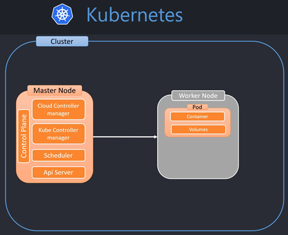
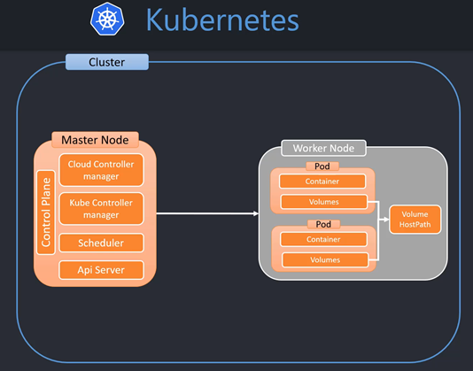
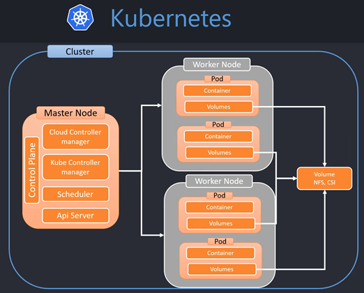

# Sección 15: Kubernetes: Volumes

---

## [Introducción a los volúmenes de Kubernetes](https://kubernetes.io/docs/concepts/storage/volumes/)

Los archivos en disco en un contenedor son efímeros, lo que presenta algunos problemas para las aplicaciones no
triviales cuando se ejecutan en contenedores. **Uno de los problemas se produce cuando un contenedor se bloquea o se
detiene. El estado del contenedor no se guarda, por lo que se pierden todos los archivos creados o modificados durante
la vida del contenedor.** Durante una caída, kubelet reinicia el contenedor con un estado limpio. Otro problema se
produce cuando varios contenedores se ejecutan en un Pod y necesitan compartir archivos. Puede ser difícil configurar y
acceder a un sistema de archivos compartido entre todos los contenedores.
`La abstracción de volumen de Kubernetes resuelve ambos problemas`. Se recomienda estar familiarizado con los Pods.

Kubernetes soporta muchos tipos de volúmenes. Un Pod puede utilizar cualquier número de tipos de volumen
simultáneamente. **Los tipos de volúmenes efímeros tienen un tiempo de vida de un pod**, pero **los volúmenes
persistentes existen más allá del tiempo de vida de un pod.** Cuando un pod deja de existir, Kubernetes destruye los
volúmenes efímeros; sin embargo, **Kubernetes no destruye los volúmenes persistentes. Para cualquier tipo de volumen
en un pod dado, los datos se conservan a través de reinicios del contenedor.**

En su esencia, **un volumen es un directorio, posiblemente con algunos datos en él, que es accesible a los contenedores
en un pod. La forma en que se crea ese directorio, el medio que lo respalda y su contenido vienen determinados por el
tipo de volumen utilizado.**

## [Resumen sobre los tipos de volúmenes](https://kubernetes.io/docs/concepts/storage/volumes/#volume-types)

En Kubernetes existen varios tipos de volúmenes, en este apartado explicaremos 3 de ellos:

### [emptyDir](https://kubernetes.io/docs/concepts/storage/volumes/#emptydir)

El volumen se monta dentro del pod. Su ciclo de vida lo maneja el pod, eso significa que si el pod se destruye en
automático también se destruirá este tipo de volumen. Útil para datos temporales.

Para un Pod que define un volumen emptyDir, el volumen se crea cuando el Pod se asigna a un nodo. Como su nombre indica,
el volumen emptyDir está inicialmente vacío. Todos los contenedores del Pod pueden leer y escribir los mismos ficheros
en el volumen emptyDir, aunque ese volumen puede montarse en la misma ruta o en rutas diferentes en cada contenedor.
**Cuando un Pod es eliminado de un nodo por cualquier razón, los datos en emptyDir son borrados permanentemente.**

**NOTA**
> La caída de un contenedor no elimina un Pod de un nodo. Los datos en un volumen emptyDir están seguros en caso de
> fallo del contenedor.



### [hostPath](https://kubernetes.io/docs/concepts/storage/volumes/#hostpath)

Es útil cuando solo tenemos un `Worker Node`. El volumen es externo a los pods pero está internamente en el
`Worker Node`.

Un volumen `hostPath` monta un fichero o directorio desde el sistema de ficheros del nodo anfitrión a su Pod. Esto no es
algo que la mayoría de los Pods necesiten, pero ofrece una poderosa vía de escape para algunas aplicaciones.



### nsf, csi

Estos tipos de volumen permite el acceso a varios `Worker Node`, son para cluster multi-nodo. Veamos la definición de
cada uno:

#### [nfs](https://kubernetes.io/docs/concepts/storage/volumes/#nfs)

Un volumen nfs permite montar un recurso compartido NFS (Network File System) existente en un Pod. A diferencia de
emptyDir, que se borra cuando se elimina un Pod, el contenido de un volumen nfs se conserva y el volumen simplemente se
desmonta. Esto significa que un volumen NFS puede ser pre-poblado con datos, y que los datos pueden ser compartidos
entre pods. NFS puede ser montado por múltiples escritores simultáneamente.

#### [csi](https://kubernetes.io/docs/concepts/storage/volumes/#csi)

Container Storage Interface (CSI) define una interfaz estándar para que los sistemas de orquestación de contenedores
(como Kubernetes) expongan sistemas de almacenamiento arbitrarios a sus cargas de trabajo de contenedores.



## Tipo de volumen hostPath para el curso

En este curso de Kubernetes trabajaremos con el tipo de volumen `HostPath` donde almacenaremos los datos de las bases de
datos de MySQL y PostgreSQL.

Los volúmenes se configuran en la especificación del pod pero se montan en el contenedor y en el pod especificamos qué
tipo de volumen se va a utilizar. En nuestro caso utilizaremos el `HostPath` que va a ser un directorio dentro del
`Worker Node`, ya que estamos trabajando con `Minikube` (un solo cluster).

## Configurando volume hostPath para MySQL

En el archivo `deployment-mysql.yml` agregamos la configuraciones para el volumen a usar:

````yaml
#...
spec:
  containers:
    - image: mysql:8
      name: mysql-8
      #...
      ## 2. Configuración del contenedor para apuntar al volumen configurado      
      volumeMounts:
        - name: data-mysql
          mountPath: /var/lib/mysql

  ## 1. Configuración del Volumen          
  volumes:
    - name: data-mysql
      hostPath:
        path: /var/lib/mysql
        type: DirectoryOrCreate
````

De la sección anterior, podemos extraer dos partes:

1. Configuración del Volumen

````yaml
volumes:
  - name: data-mysql
    hostPath:
      path: /var/lib/mysql
      type: DirectoryOrCreate
````

**DONDE**

- `name: data-mysql`, nombre que le daremos al volumen a crear.
- `path: /var/lib/mysql`, ruta del volumen donde se van a guardar los datos.
- `type: DirectoryOrCreate`, si el directorio `/var/lib/mysql` existe ya no volverá a crearlo, simplemente lo utiliza.
  En caso de que no exista, ahí recién lo creará.

2. Configuración del contenedor para apuntar al volumen configurado

````yaml
volumeMounts:
  - name: data-mysql
    mountPath: /var/lib/mysql
````

**DONDE**

- `volumeMounts: - name: data-mysql`, el volumen que vamos a utilizar y el que creamos en la primera parte.
- `mountPath: /var/lib/mysql`, directorio dentro del contenedor donde vamos a montar los datos en el volumen. Es decir,
  esta ruta corresponde al directorio interno dentro del contenedor donde mysql guardará los datos y esos datos luego
  serán montando en el volumen `data-mysql` en su directorio `/var/lib/mysql`. Es importante señalar que el directorio
  del `mountPath` debe ser exactamente el directorio donde mysql guarda internamente los datos en el contenedor,
  mientras que el de la primera parte, el `volumes:-hostPath:path:` ese path podría ser cualquier otro valor para el
  volumen, pero para mantener la misma ruta usaremos el mismo en ambos.

### Aplicando configuración de volumen hostPath para MySQL

Una vez que hemos agregado la configuración del volumen `hostPath` para MySQL, llega el momento de aplicar los cambios:

````bash
$ kubectl apply -f .\deployment-mysql.yml
deployment.apps/mysql-8 configured
````

Verificamos el pod que nos creó el deployment de mysql:

````bash
$ kubectl get pods
NAME                            READY   STATUS    RESTARTS       AGE
dk-ms-courses-6499fff68-z4tvf   1/1     Running   1 (17h ago)    17h
dk-ms-users-6dcd5d485d-ft7hq    1/1     Running   4 (3h2m ago)   24h
mysql-8-577f5dcb-b5xgh          1/1     Running   0              71s
postgres-14-8454947444-p2nrb    1/1     Running   0              30m
````

Como vemos en el resultado anterior ya tenemos creado nuestro pod de mysql, pero aún no tenemos ninguna tabla creada
para nuestro microservicio de usuarios y si volvemos a observar el resultado, tenemos levantado un pod para usuarios,
por lo que si hacemos una consulta a la api de usuarios nos mostrará un error. Entonces para crear las tablas, tendremos
que eliminar el pod y volver a levantar uno nuevo para que en ese proceso se creen las tablas automáticamente, ya que
si recordaremos en nuestra aplicación de `Spring Boot` de usuarios tenemos la configuración:
`spring.jpa.generate-ddl:true`.

````bash
$ kubectl delete -f .\deployment-users.yml
deployment.apps "dk-ms-users" deleted
````

Una vez eliminado el pod de usuarios, volvemos a levantar uno nuevo para que se nos creen las tablas:

````bash
$ kubectl apply -f .\deployment-users.yml
deployment.apps/dk-ms-users created

$ kubectl get pods
NAME                            READY   STATUS    RESTARTS      AGE
dk-ms-courses-6499fff68-z4tvf   1/1     Running   1 (17h ago)   17h
dk-ms-users-6dcd5d485d-ctcpt    1/1     Running   0             44s
mysql-8-577f5dcb-b5xgh          1/1     Running   0             8m54s
postgres-14-8454947444-p2nrb    1/1     Running   0             37m
````

Ahora que tenemos un nuevo pod de usuarios, verificamos su logs para ver si se crearon las tablas:

````bash
$ kubectl logs dk-ms-users-6dcd5d485d-ctcpt

  .   ____          _            __ _ _
 /\\ / ___'_ __ _ _(_)_ __  __ _ \ \ \ \
( ( )\___ | '_ | '_| | '_ \/ _` | \ \ \ \
 \\/  ___)| |_)| | | | | || (_| |  ) ) ) )
  '  |____| .__|_| |_|_| |_\__, | / / / /
 =========|_|==============|___/=/_/_/_/
 :: Spring Boot ::                (v3.1.4)

...
2023-11-10T18:41:11.011Z  INFO 1 --- [           main] o.s.b.w.embedded.tomcat.TomcatWebServer  : Tomcat initialized with port(s): 8001 (http)
...
2023-11-10T18:41:16.557Z  INFO 1 --- [           main] o.h.b.i.BytecodeProviderInitiator        : HHH000021: Bytecode provider name : bytebuddy
2023-11-10T18:41:19.004Z  INFO 1 --- [           main] o.h.e.t.j.p.i.JtaPlatformInitiator       : HHH000490: Using JtaPlatform implementation: [org.hibernate.engine.transaction.jta.platform.internal.NoJtaPlatform]
2023-11-10T18:41:19.146Z DEBUG 1 --- [           main] org.hibernate.SQL                        :
    create table users (
        id bigint not null auto_increment,
        email varchar(255),
        name varchar(255),
        password varchar(255),
        primary key (id)
    ) engine=InnoDB
2023-11-10T18:41:19.194Z DEBUG 1 --- [           main] org.hibernate.SQL                        :
    alter table users
       drop index UK_6dotkott2kjsp8vw4d0m25fb7
2023-11-10T18:41:19.222Z DEBUG 1 --- [           main] org.hibernate.SQL                        :
    alter table users
       add constraint UK_6dotkott2kjsp8vw4d0m25fb7 unique (email)
...
2023-11-10T18:41:22.391Z  INFO 1 --- [           main] o.s.b.w.embedded.tomcat.TomcatWebServer  : Tomcat started on port(s): 8001 (http) with context path ''
2023-11-10T18:41:22.444Z  INFO 1 --- [           main] c.m.d.b.d.u.app.DkMsUsersApplication     : Started DkMsUsersApplication in 18.826 seconds (process running for 20.875)
````

### Verificando almacenamiento en volumen

Obtenemos la url del servicio por donde realizaremos las peticiones al microservicio de usuarios:

````bash
$ minikube service dk-ms-users --url
http://127.0.0.1:51541
! Because you are using a Docker driver on windows, the terminal needs to be open to run it.
````

Realizamos un registro de un usuario:

````bash
$ curl -v -X POST -H "Content-Type: application/json" -d "{\"name\": \"Martin\", \"email\":\"martin@gmail.com\", \"password\": \"12345\"}" http://localhost:51541/api/v1/users | jq

>
< HTTP/1.1 201
< Location: http://localhost:51541/api/v1/users/1
< Content-Type: application/json
<
{
  "id": 1,
  "name": "Martin",
  "email": "martin@gmail.com",
  "password": "12345"
}
````

Listamos el usuario registrado:

````bash
$ curl -v http://127.0.0.1:51541/api/v1/users | jq

>
< HTTP/1.1 200
< Content-Type: application/json
<
[
  {
    "id": 1,
    "name": "Martin",
    "email": "martin@gmail.com",
    "password": "12345"
  }
]
````

### Verificando persistencia de datos luego de eliminar pod de mysql y usuarios

Como confiuramos el volumen en `hostPath`, eso singifica que los datos estarán persistidos fuera de los pods, por lo
tanto, si eliminamos los pods de `mysql` y de `usuarios` y luego los volemos a crear, el dato registrado en el apartado
anterior debería seguir existiendo:

````bash
$ kubectl delete -f .\deployment-users.yml -f .\deployment-mysql.yml
deployment.apps "dk-ms-users" deleted
deployment.apps "mysql-8" deleted

$ kubectl get pods
NAME                            READY   STATUS    RESTARTS      AGE
dk-ms-courses-6499fff68-z4tvf   1/1     Running   1 (17h ago)   17h
postgres-14-8454947444-p2nrb    1/1     Running   0             48m
````

Volvemos a crear los dos pods:

````bash
$ kubectl apply -f .\deployment-users.yml -f .\deployment-mysql.yml
deployment.apps/dk-ms-users created
deployment.apps/mysql-8 created

$ kubectl get pods
NAME                            READY   STATUS    RESTARTS      AGE
dk-ms-courses-6499fff68-z4tvf   1/1     Running   1 (17h ago)   17h
dk-ms-users-6dcd5d485d-2jx9s    1/1     Running   0             17s
mysql-8-577f5dcb-6nlj9          1/1     Running   0             17s
postgres-14-8454947444-p2nrb    1/1     Running   0             51m
````

Ahora que volvimos a crear los pods para `mysql` y para `usuarios` volveremos a hacer las pruebas al endpoint. El
resultado deberá devolvernos el registro realizado en el apartado anterior:

````bash
$ curl -v http://127.0.0.1:51541/api/v1/users | jq

>
< HTTP/1.1 200
< Content-Type: application/json
<
[
  {
    "id": 1,
    "name": "Martin",
    "email": "martin@gmail.com",
    "password": "12345"
  }
]
````

## Configurando volume hostPath para PostgreSQL

Al igual que hicimos con el volumen de MySQL lo mismo haremos con el de PostgreSQL. A continuación se muestra la
configuración realizada en el archivo `deployment-postregs.yml`:

````yaml
#...
containers:
  - image: postgres:14-alpine
    #...
    volumeMounts:
      - name: data-postgres
        mountPath: /var/lib/postgresql/data
volumes:
  - name: data-postgres
    hostPath:
      path: /var/lib/postgresql/data
      type: DirectoryOrCreate
````

Antes de aplicar los cambios veamos que tenemos el pod de postgres ejecutándose:

````bash
$ kubectl get pods
NAME                            READY   STATUS    RESTARTS      AGE
dk-ms-courses-6499fff68-z4tvf   1/1     Running   2 (31m ago)   21h
dk-ms-users-6dcd5d485d-2jx9s    1/1     Running   1 (31m ago)   3h16m
mysql-8-577f5dcb-6nlj9          1/1     Running   1 (31m ago)   3h16m
postgres-14-8454947444-p2nrb    1/1     Running   1 (31m ago)   4h7m
````

Entonces, como ya tenemos el pod de postgres ejecutándose, al aplicar el `deployment` configurado nos saldrá el mensaje
de `configured`:

````bash
$ kubectl apply -f .\deployment-postgres.yml
deployment.apps/postgres-14 configured
````

Listo, ahora volvemos a listar los pods y observamos que el pod de postgres es uno nuevo:

````bash
$ kubectl get pods
NAME                            READY   STATUS    RESTARTS      AGE
dk-ms-courses-6499fff68-z4tvf   1/1     Running   2 (33m ago)   21h
dk-ms-users-6dcd5d485d-2jx9s    1/1     Running   1 (33m ago)   3h18m
mysql-8-577f5dcb-6nlj9          1/1     Running   1 (33m ago)   3h18m
postgres-14-cdcfbd594-r8n76     1/1     Running   0             87s
````

Ahora, para poder hacer funcionar el microservicio de cursos con la base de datos de postgres, necesitamos eliminar el
pod de cursos y volver a levantar uno nuevo así podremos crear las tablas de la base de datos:

````bash
$ kubectl delete -f .\deployment-courses.yml
deployment.apps "dk-ms-courses" deleted
````

Ahora volvemos a aplicar el deployment para crear un nuevo pod:

````bash
$ kubectl apply -f .\deployment-courses.yml
deployment.apps/dk-ms-courses created
````

Observamos el log del pod de cursos:

````bash
$ kubectl logs dk-ms-courses-6499fff68-wmnwl

  .   ____          _            __ _ _
 /\\ / ___'_ __ _ _(_)_ __  __ _ \ \ \ \
( ( )\___ | '_ | '_| | '_ \/ _` | \ \ \ \
 \\/  ___)| |_)| | | | | || (_| |  ) ) ) )
  '  |____| .__|_| |_|_| |_\__, | / / / /
 =========|_|==============|___/=/_/_/_/
 :: Spring Boot ::                (v3.1.4)

...
2023-11-10T22:32:24.532Z  INFO 1 --- [           main] o.s.b.w.embedded.tomcat.TomcatWebServer  : Tomcat initialized with port(s): 8002 (http)
...
2023-11-10T22:32:31.025Z  INFO 1 --- [           main] o.h.e.t.j.p.i.JtaPlatformInitiator       : HHH000490: Using JtaPlatform implementation: [org.hibernate.engine.transaction.jta.platform.internal.NoJtaPlatform]
2023-11-10T22:32:31.132Z DEBUG 1 --- [           main] org.hibernate.SQL                        :
    create table course_users (
        id bigserial not null,
        user_id bigint,
        course_id bigint,
        primary key (id)
    )
2023-11-10T22:32:31.579Z DEBUG 1 --- [           main] org.hibernate.SQL                        :
    create table courses (
        id bigserial not null,
        name varchar(255),
        primary key (id)
    )
2023-11-10T22:32:31.604Z DEBUG 1 --- [           main] org.hibernate.SQL                        :
    alter table if exists course_users
       drop constraint if exists UK_kdhhgtn4xoxgggdkh5fooi5i7
2023-11-10T22:32:31.614Z  WARN 1 --- [           main] o.h.engine.jdbc.spi.SqlExceptionHelper   : SQL Warning Code: 0, SQLState: 00000
2023-11-10T22:32:31.615Z  WARN 1 --- [           main] o.h.engine.jdbc.spi.SqlExceptionHelper   : constraint "uk_kdhhgtn4xoxgggdkh5fooi5i7" of relation "course_users" does not exist, skipping
2023-11-10T22:32:31.616Z DEBUG 1 --- [           main] org.hibernate.SQL                        :
    alter table if exists course_users
       add constraint UK_kdhhgtn4xoxgggdkh5fooi5i7 unique (user_id)
2023-11-10T22:32:31.632Z DEBUG 1 --- [           main] org.hibernate.SQL                        :
    alter table if exists course_users
       add constraint FKcax8xujvganv6xl9ra0sgouem
       foreign key (course_id)
       references courses
...
2023-11-10T22:32:35.718Z  INFO 1 --- [           main] o.s.b.w.embedded.tomcat.TomcatWebServer  : Tomcat started on port(s): 8002 (http) with context path ''
2023-11-10T22:32:35.754Z  INFO 1 --- [           main] c.m.d.b.d.c.app.DkMsCoursesApplication   : Started DkMsCoursesApplication in 19.446 seconds (process running for 21.265)
````

### Verificando almacenamiento en volumen

Una vez que ya tenemos montado el volumen `hostPath` para PostgreSQL, probamos registrar algunos cursos en el
microservicios. Para eso necesitamos previamente obtener la url del servicio por donde haremos la petición:

````bash
$ minikube service dk-ms-courses --url
http://127.0.0.1:55063
! Because you are using a Docker driver on windows, the terminal needs to be open to run it.
````

Ahora registramos algunos cursos y a continuación mostraré solo el listado:

````bash
$ curl -v http://localhost:55063/api/v1/courses | jq

>
< HTTP/1.1 200
< Content-Type: application/json
<
[
  {
    "id": 1,
    "name": "Docker",
    "courseUsers": [],
    "users": []
  },
  {
    "id": 2,
    "name": "Kubernetes",
    "courseUsers": [],
    "users": []
  },
  {
    "id": 3,
    "name": "Angular 17",
    "courseUsers": [],
    "users": []
  }
]
````

## Verificando persistencia de datos luego de eliminar pod de postgres y cursos

Ahora eliminaremos el pod de postgres y de cursos y lo volveremos a crear para verificar que los datos aún existen:

````bash
$ kubectl delete -f .\deployment-courses.yml -f .\deployment-postgres.yml
deployment.apps "dk-ms-courses" deleted
deployment.apps "postgres-14" deleted
````

Procedemos a crear nuevamente los pods:

````bash
$ kubectl apply -f .\deployment-courses.yml -f .\deployment-postgres.yml
deployment.apps/dk-ms-courses created
deployment.apps/postgres-14 created
````

Realizamos una petición al microservicios para obtener el listado de cursos. **¿Qué debería pasar?** Pues obtener el
listado de cursos registrados.

````bash
$ curl -v http://localhost:55063/api/v1/courses | jq

>
< HTTP/1.1 200
< Content-Type: application/json
<
[
  {
    "id": 1,
    "name": "Docker",
    "courseUsers": [],
    "users": []
  },
  {
    "id": 2,
    "name": "Kubernetes",
    "courseUsers": [],
    "users": []
  },
  {
    "id": 3,
    "name": "Angular 17",
    "courseUsers": [],
    "users": []
  }
]
````

Perfecto, los datos continúan existiendo eso significa que la configuración del volumen del tipo `hostPath` ha sido
exitoso.

---

## Persistent Volume

La gestión del almacenamiento es un problema distinto de la gestión de instancias de computación. El subsistema
`PersistentVolume` **proporciona una API para usuarios y administradores que abstrae los detalles de cómo se proporciona
el almacenamiento de cómo se consume.** Para ello, introducimos dos nuevos recursos API: PersistentVolume y
PersistentVolumeClaim.

- `Un PersistentVolume (PV)` es una pieza de almacenamiento en el cluster que ha sido aprovisionada por un administrador
  o aprovisionada dinámicamente usando Clases de Almacenamiento. Es un recurso del cluster al igual que un nodo es un
  recurso del cluster. Los PVs son plugins de volumen como los Volumes, pero tienen un ciclo de vida independiente de
  cualquier Pod individual que utilice el PV. Este objeto API captura los detalles de la implementación del
  almacenamiento, ya sea NFS, iSCSI, o un sistema de almacenamiento específico del proveedor de la nube.

- `El PersistentVolume (PV)` es una forma de implementar los volumes, pero es más robusto, es más reutilizable, es
  decir, que no está acoplado al `pod`, es 100% independiente. No se configura en el archivo `deployment` sino más bien
  tiene su propio archivo de configuración, es otro objeto completamente separado. El volume se desconecta del pod y
  pasa a ser un objeto que es manejado por el cluster de Kubernetes y puede ser compartido, reutilizado por múltiples
  pods. El `persistentVolume` se configura una sola vez en su archivo de configuración, luego se puede utilizar cuantas
  veces queramos en los diferentes pods, nodos. Se basa en la idea de la independencia total del pod, es decir, en vez
  de usar un volumen directamente en el pod utilizamos un `claim`, una solicitud para acceder a un persistentVolume que
  contiene el volumen.


- `Una PersistentVolumeClaim (PVC)` es una solicitud de almacenamiento por parte de un usuario. Es similar a un Pod. Los
  Pods consumen recursos de nodos y los PVCs consumen recursos de PV. Los Pods pueden solicitar niveles específicos de
  recursos (CPU y Memoria). Los Claims pueden solicitar tamaños y modos de acceso específicos (por ejemplo, pueden ser
  montados ReadWriteOnce, ReadOnlyMany o ReadWriteMany, ver AccessModes).

- `Una PersistentVolumeClaim (PVC)`, este claims sí se configura en el pod. Estos claims pueden darnos acceso al
  `PersistentVolume`.

Mientras que los PersistentVolumeClaims permiten a un usuario consumir recursos de almacenamiento abstractos, es común
que los usuarios necesiten PersistentVolumes con diferentes propiedades, como el rendimiento, para diferentes problemas.
Los administradores de cluster necesitan ser capaces de ofrecer una variedad de PersistentVolumes que difieran en algo
más que tamaño y modos de acceso, sin exponer a los usuarios a los detalles de cómo esos volúmenes son implementados.
Para estas necesidades, existe el recurso StorageClass.

## Configurando PersistentVolume para MySQL

Para crear el `persistentVolume` para mysql necesitamos crear en la raíz del proyecto el archivo
`persistent-volume-mysql.yml` donde agregaremos las configuraciones que usará el persistentVolume:

````yaml
apiVersion: v1
kind: PersistentVolume
metadata:
  name: persistent-volume-mysql
spec:
  capacity:
    storage: 2Gi
  volumeMode: Filesystem
  storageClassName: standard
  accessModes:
    - ReadWriteOnce
  hostPath:
    path: /var/lib/mysql
    type: DirectoryOrCreate
````

## Configurando PersistentVolumeClaim para MySQL

En este apartado continuamos con una nueva configuración, el `PersistentVolumeClaim`, es una configuración para poder
reclamar el `PersistentVolume` que definimos como volumen en el cluster.

Comenzamos creando un nuevo archivo de configuración en la raíz del proyecto llamado
`persistent-volume-claim-mysql.yml` y agregamos la siguiente configuración:

````yaml
apiVersion: v1
kind: PersistentVolumeClaim
metadata:
  name: persistent-volume-claim-mysql
spec:
  volumeName: persistent-volume-mysql
  accessModes:
    - ReadWriteOnce
  storageClassName: standard
  resources:
    requests:
      storage: 2Gi
````

A continuación utilizaremos el `PersistentVolumeClaim` creado anteriormente en el archivo `deployment-mysql.yml`:

````yaml
#...
volumes:
  - name: data-mysql
    persistentVolumeClaim:
      claimName: persistent-volume-claim-mysql
````

## Creando los nuevos objetos

Empezaremos creando el `persistent volume`, luego el `persistent volume claim` para mysql:

````bash
$ kubectl apply -f .\persistent-volume-mysql.yml
persistentvolume/persistent-volume-mysql create

$ kubectl apply -f .\persistent-volume-claim-mysql.yml
persistentvolumeclaim/persistent-volume-claim-mysql created
````

Podemos listar el persistent los dos objetos creados anteriormente:

````bash
$  kubectl get pv
NAME                      CAPACITY   ACCESS MODES   RECLAIM POLICY   STATUS   CLAIM                                   STORAGECLASS   REASON   AGE
persistent-volume-mysql   2Gi        RWO            Retain           Bound    default/persistent-volume-claim-mysql   standard                106s

$ kubectl get pvc
NAME                            STATUS   VOLUME                    CAPACITY   ACCESS MODES   STORAGECLASS   AGE
persistent-volume-claim-mysql   Bound    persistent-volume-mysql   2Gi        RWO            standard       103s
````

Aplicamos los cambios al deployment de mysql:

````bash
$ kubectl apply -f .\deployment-mysql.yml
deployment.apps/mysql-8 configured
````

Luego de haber realizado las modificaciones y aplicado los cambios verificamos que al hacer la petición al microservicio
de usuarios, que es el que usa la base de datos de MySQL, veremos que aún sigue funcionando:

````bash
$ minikube service dk-ms-users --url
http://127.0.0.1:57969
! Because you are using a Docker driver on windows, the terminal needs to be open to run it.

$ curl -v http://localhost:57969/api/v1/users | jq
>
< HTTP/1.1 200
< Content-Type: application/json

<
[
  {
    "id": 1,
    "name": "Martin",
    "email": "martin@gmail.com",
    "password": "12345"
  }
]
````