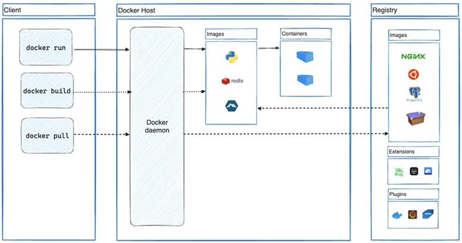

# Sección 06: Docker - Introducción

---

## [¿Qué es docker?](https://docs.docker.com/get-started/docker-overview/)

`Docker` es una plataforma abierta para desarrollar, enviar y ejecutar aplicaciones. `Docker` le permite separar sus
aplicaciones de su infraestructura para que pueda entregar software rápidamente. Con `Docker`, puede administrar su
infraestructura de la misma manera que administra sus aplicaciones. Al aprovechar las metodologías de `Docker` para
enviar, probar e implementar código, puede reducir significativamente la demora entre la escritura del código y su
ejecución en producción.

## La Plataforma Docker

`Docker` ofrece la posibilidad de empaquetar y ejecutar una aplicación en un entorno ligeramente aislado llamado
`contenedor`. El aislamiento y la seguridad le permiten ejecutar muchos contenedores simultáneamente en un host
determinado. `Los contenedores son livianos y contienen todo lo necesario para ejecutar la aplicación`, por lo que no
necesita depender de lo que esté instalado en el host. Puede compartir contenedores mientras trabaja y estar seguro de
que todos con quienes comparte obtienen el mismo contenedor que funciona de la misma manera.

`Docker` ofrece herramientas y una plataforma para administrar el ciclo de vida de sus contenedores:

- Desarrolle su aplicación y sus componentes de soporte utilizando contenedores.
- El `contenedor` se convierte en la unidad para distribuir y probar su aplicación.
- Cuando esté listo, implemente su aplicación en su entorno de producción, como un contenedor o un servicio orquestado.
  Esto funciona de la misma manera independientemente de si su entorno de producción es un centro de datos local, un
  proveedor de nube o un híbrido de los dos.

## Arquitectura de Docker

`Docker` utiliza una arquitectura `cliente-servidor`. El `cliente de Docker` se comunica con el `demonio de Docker`,
que se encarga de la tarea pesada de crear, ejecutar y distribuir los contenedores de Docker. El `cliente` y el
`demonio de Docker` pueden ejecutarse en el mismo sistema, o puedes conectar un `cliente de Docker` a un
`demonio de Docker remoto`. El `cliente` y el `demonio de Docker` se comunican mediante una `API REST`, a través de
sockets UNIX o una interfaz de red. Otro cliente de Docker es `Docker Compose`, que te permite trabajar con
aplicaciones que constan de un `conjunto de contenedores`.



## El Demonio de Docker

El `demonio de Docker` `(dockerd)` escucha las solicitudes de la `API de Docker` y administra `objetos de Docker`, como
`imágenes`, `contenedores`, `redes` y `volúmenes`. Un demonio también puede comunicarse con otros demonios para
administrar los servicios de Docker.

## El Cliente Docker

El `cliente Docker` `(docker)` es la forma principal en la que muchos usuarios de Docker interactúan con Docker. Cuando
se utilizan comandos como `docker container run`, el cliente envía estos comandos a `dockerd`, que los ejecuta. El
comando docker utiliza la API de Docker. El cliente Docker puede comunicarse con más de un demonio.

## Registros de Docker (Docker registries)

Un registro de Docker `almacena imágenes de Docker`. `Docker Hub` es un registro público que cualquiera puede usar y
`Docker` busca imágenes en `Docker Hub de forma predeterminada`. Incluso puedes ejecutar tu propio registro privado.

Cuando usas los comandos `docker pull` o `docker run`, `Docker` extrae las imágenes necesarias de tu registro
configurado. Cuando usas el comando `docker push`, `Docker` envía tu imagen a tu registro configurado.

## Imágenes

Una `imagen` es una plantilla de solo lectura con instrucciones para crear un `contenedor Docker`. A menudo, una
`imagen` se basa en otra `imagen`, con alguna personalización adicional. Por ejemplo, puede crear una imagen que
se base en la imagen de Ubuntu, pero que instale el servidor web Apache y su aplicación, así como los detalles
de configuración necesarios para que su aplicación se ejecute.

Puede crear sus propias imágenes o puede utilizar únicamente las creadas por otros y publicadas en un registro.
`Para crear su propia imagen`, debe crear un `Dockerfile` con una sintaxis simple para definir los pasos necesarios
para crear la imagen y ejecutarla. `Cada instrucción en un Dockerfile crea una capa en la imagen`. Cuando cambia el
`Dockerfile` y reconstruye la imagen, solo se reconstruyen las capas que han cambiado. Esto es parte de lo que hace
que las imágenes sean tan livianas, pequeñas y rápidas, en comparación con otras tecnologías de virtualización.

## Contenedores

`Un contenedor es una instancia ejecutable de una imagen`. Puede crear, iniciar, detener, mover o eliminar un
contenedor mediante la API o la CLI de Docker. Puede conectar un contenedor a una o más redes, adjuntarle
almacenamiento o incluso crear una nueva imagen en función de su estado actual.

De manera predeterminada, `un contenedor está relativamente bien aislado de otros contenedores y de su máquina host`.
Puede controlar el grado de aislamiento de la red, el almacenamiento u otros subsistemas subyacentes de un
contenedor respecto de otros contenedores o de la máquina host.

`Un contenedor se define por su imagen`, así como por las opciones de configuración que le proporcione al crearlo
o iniciarlo. Cuando se elimina un contenedor, desaparecen todos los cambios en su estado que no se almacenan en el
almacenamiento persistente.

## Genera archivo jar para dockerizar

Para dockerizar nuestra aplicación de `Spring Boot` necesitamos generar el empaquetado `jar`. Este empaquetado lo
referenciaremos luego en el archivo `Dockerfile` para generar la imagen de nuestra aplicación.

### Genera archivo jar de user-service

Iniciamos generando el `jar` del `user-service` de manera manual. Posteriormente, para ver que el `jar` funciona, lo
ejecutaremos mediante la línea de comando. Así que, para este primer ejemplo, nos posicionamos en la raíz del
microservicio `user-service` y ejecutamos el siguiente comando.

````bash
D:\programming\spring\01.udemy\02.andres_guzman\08.docker_kubernetes\docker-kubernetes\business-domain\user-service (feature/section-6)
$ mvnw clean package
````

### Importante

> Debemos tener levantado la base de datos que está usando ese microservicio, ya que cuando se construya
> el `jar` requerirá realizar los test y al realizar los test ejecutará la aplicación y como tenemos la dependencia
> de `Spring Data JPA`, tratará de establecer una conexión a la base de datos. Si no tenemos levantado la base de datos
> nos mostrará un error y no podremos empaquetar la aplicación.
>
> Si queremos saltarnos los test podemos ejecutar:
>
> `mvnw clean package -DskipTests`
>
> En mi caso sí tengo levantado la base de datos así que ejecutaré el comando sin el `-DskipTests`.

### Donde

- `clean`, borra todos los archivos temporales y compilados que se encuentran en el directorio `/target`, incluidos
  archivos `.class`, `JARs` generados previamente, y otros artefactos generados por una compilación anterior. Es como
  un `reseteo` del proyecto para asegurar que la próxima compilación se realice desde cero, sin interferencia de
  artefactos antiguos. En otras palabras, borra el directorio `/target` que contiene todo lo descrito.


- `package`, compila el código y empaqueta el proyecto en un archivo `jar` dentro del directorio `/target`.

Una vez finalizado el comando anterior, veremos en la raíz del microservicio `user-service` el directorio `/target`
y dentro él, el archivo `jar` compilado `user-service-0.0.1-SNAPSHOT.jar`.

````bash
D:\programming\spring\01.udemy\02.andres_guzman\08.docker_kubernetes\docker-kubernetes\business-domain\user-service\target (feature/section-6)
$ ls -l
total 64528
drwxr-xr-x 1 magadiflo 197121        0 May 19 23:26 classes/
drwxr-xr-x 1 magadiflo 197121        0 May 19 23:26 generated-sources/
drwxr-xr-x 1 magadiflo 197121        0 May 19 23:26 generated-test-sources/
drwxr-xr-x 1 magadiflo 197121        0 May 19 23:26 maven-archiver/
drwxr-xr-x 1 magadiflo 197121        0 May 19 23:26 maven-status/
drwxr-xr-x 1 magadiflo 197121        0 May 19 23:26 surefire-reports/
drwxr-xr-x 1 magadiflo 197121        0 May 19 23:26 test-classes/
-rw-r--r-- 1 magadiflo 197121 66044541 May 19 23:26 user-service-0.0.1-SNAPSHOT.jar
-rw-r--r-- 1 magadiflo 197121    24941 May 19 23:26 user-service-0.0.1-SNAPSHOT.jar.original
````

### Ejecuta archivo jar de user-service desde línea de comandos

Supongamos que el `jar` generado anteriormente lo hemos llevado a una máquina remota y lo queremos levantar. Para eso
nos posicionaremos mediante el `cmd` en el directorio donde hayamos puesto el `jar` y ejecutaremos el comando:

````bash
$ java -jar user-service-0.0.1-SNAPSHOT.jar
````

A continuación vemos que nuestra aplicación se levanta sin problemas.

````bash
D:\programming\spring\01.udemy\02.andres_guzman\08.docker_kubernetes\docker-kubernetes (feature/section-6)
λ java -jar .\business-domain\user-service\target\user-service-0.0.1-SNAPSHOT.jar

  .   ____          _            __ _ _
 /\\ / ___'_ __ _ _(_)_ __  __ _ \ \ \ \
( ( )\___ | '_ | '_| | '_ \/ _` | \ \ \ \
 \\/  ___)| |_)| | | | | || (_| |  ) ) ) )
  '  |____| .__|_| |_|_| |_\__, | / / / /
 =========|_|==============|___/=/_/_/_/

 :: Spring Boot ::                (v3.4.5)

2025-05-19T23:36:51.792-05:00  INFO 9440 --- [user-service] [           main] d.m.user.app.UserServiceApplication      : Starting UserServiceApplication v0.0.1-SNAPSHOT using Java 21.0.6 with PID 9440 (D:\programming\spring\01.udemy\02.andres_guzman\08.docker_kubernetes\docker-kubernetes\business-domain\user-service\target\user-service-0.0.1-SNAPSHOT.jar started by magadiflo in D:\programming\spring\01.udemy\02.andres_guzman\08.docker_kubernetes\docker-kubernetes)
2025-05-19T23:36:51.795-05:00 DEBUG 9440 --- [user-service] [           main] d.m.user.app.UserServiceApplication      : Running with Spring Boot v3.4.5, Spring v6.2.6
2025-05-19T23:36:51.796-05:00  INFO 9440 --- [user-service] [           main] d.m.user.app.UserServiceApplication      : No active profile set, falling back to 1 default profile: "default"
2025-05-19T23:36:53.100-05:00  INFO 9440 --- [user-service] [           main] .s.d.r.c.RepositoryConfigurationDelegate : Bootstrapping Spring Data JPA repositories in DEFAULT mode.
2025-05-19T23:36:53.159-05:00  INFO 9440 --- [user-service] [           main] .s.d.r.c.RepositoryConfigurationDelegate : Finished Spring Data repository scanning in 47 ms. Found 1 JPA repository interface.
2025-05-19T23:36:53.356-05:00  INFO 9440 --- [user-service] [           main] o.s.cloud.context.scope.GenericScope     : BeanFactory id=91540a6b-3294-3658-b380-dfb1c22ae3d2
2025-05-19T23:36:54.126-05:00  INFO 9440 --- [user-service] [           main] o.s.b.w.embedded.tomcat.TomcatWebServer  : Tomcat initialized with port 8001 (http)
2025-05-19T23:36:54.164-05:00  INFO 9440 --- [user-service] [           main] o.apache.catalina.core.StandardService   : Starting service [Tomcat]
2025-05-19T23:36:54.165-05:00  INFO 9440 --- [user-service] [           main] o.apache.catalina.core.StandardEngine    : Starting Servlet engine: [Apache Tomcat/10.1.40]
2025-05-19T23:36:54.205-05:00  INFO 9440 --- [user-service] [           main] o.a.c.c.C.[Tomcat].[localhost].[/]       : Initializing Spring embedded WebApplicationContext
2025-05-19T23:36:54.206-05:00  INFO 9440 --- [user-service] [           main] w.s.c.ServletWebServerApplicationContext : Root WebApplicationContext: initialization completed in 2344 ms
2025-05-19T23:36:54.599-05:00  INFO 9440 --- [user-service] [           main] o.hibernate.jpa.internal.util.LogHelper  : HHH000204: Processing PersistenceUnitInfo [name: default]
2025-05-19T23:36:54.671-05:00  INFO 9440 --- [user-service] [           main] org.hibernate.Version                    : HHH000412: Hibernate ORM core version 6.6.13.Final
2025-05-19T23:36:54.714-05:00  INFO 9440 --- [user-service] [           main] o.h.c.internal.RegionFactoryInitiator    : HHH000026: Second-level cache disabled
2025-05-19T23:36:55.003-05:00  INFO 9440 --- [user-service] [           main] o.s.o.j.p.SpringPersistenceUnitInfo      : No LoadTimeWeaver setup: ignoring JPA class transformer
2025-05-19T23:36:55.038-05:00  INFO 9440 --- [user-service] [           main] com.zaxxer.hikari.HikariDataSource       : HikariPool-1 - Starting...
2025-05-19T23:36:55.411-05:00  INFO 9440 --- [user-service] [           main] com.zaxxer.hikari.pool.HikariPool        : HikariPool-1 - Added connection com.mysql.cj.jdbc.ConnectionImpl@1acc768
2025-05-19T23:36:55.413-05:00  INFO 9440 --- [user-service] [           main] com.zaxxer.hikari.HikariDataSource       : HikariPool-1 - Start completed.
2025-05-19T23:36:55.512-05:00  INFO 9440 --- [user-service] [           main] org.hibernate.orm.connections.pooling    : HHH10001005: Database info:
        Database JDBC URL [Connecting through datasource 'HikariDataSource (HikariPool-1)']
        Database driver: undefined/unknown
        Database version: 8.0.41
        Autocommit mode: undefined/unknown
        Isolation level: undefined/unknown
        Minimum pool size: undefined/unknown
        Maximum pool size: undefined/unknown
2025-05-19T23:36:56.363-05:00  INFO 9440 --- [user-service] [           main] o.h.e.t.j.p.i.JtaPlatformInitiator       : HHH000489: No JTA platform available (set 'hibernate.transaction.jta.platform' to enable JTA platform integration)
2025-05-19T23:36:56.403-05:00  INFO 9440 --- [user-service] [           main] j.LocalContainerEntityManagerFactoryBean : Initialized JPA EntityManagerFactory for persistence unit 'default'
2025-05-19T23:36:57.029-05:00  WARN 9440 --- [user-service] [           main] JpaBaseConfiguration$JpaWebConfiguration : spring.jpa.open-in-view is enabled by default. Therefore, database queries may be performed during view rendering. Explicitly configure spring.jpa.open-in-view to disable this warning
2025-05-19T23:36:57.951-05:00  INFO 9440 --- [user-service] [           main] o.s.b.a.e.web.EndpointLinksResolver      : Exposing 1 endpoint beneath base path '/actuator'
2025-05-19T23:36:58.041-05:00  INFO 9440 --- [user-service] [           main] o.s.b.w.embedded.tomcat.TomcatWebServer  : Tomcat started on port 8001 (http) with context path '/'
2025-05-19T23:36:58.061-05:00  INFO 9440 --- [user-service] [           main] d.m.user.app.UserServiceApplication      : Started UserServiceApplication in 6.965 seconds (process running for 7.571)
````

Realizamos una petición a un endpoint del `user-service` para ver que la aplicación está funcionando.

````bash
$ curl -v http://localhost:8001/api/v1/users/1 | jq
>
< HTTP/1.1 200
< Content-Type: application/json
< Transfer-Encoding: chunked
< Date: Tue, 20 May 2025 04:38:06 GMT
<
{
  "id": 1,
  "name": "Martin",
  "email": "martin@gmail.com",
  "password": "123456"
}
````

Como observamos, no necesitamos el IDE para ejecutar nuestra aplicación, tan solo generamos el `jar`, lo levantamos
y ya nuestra aplicación estará lista para recibir peticiones. Obviamente, si el `jar` lo llevamos a otra máquina, habrá
que tener instalada las dependencias que requiere nuestra aplicación como, la versión de java, las bases de datos, etc.

La idea ahora es realizar todos los pasos anteriores, pero usando `Docker`, es decir `dockerizar` la aplicación,
configurar una imagen, crear el contenedor, etc.

## Creando el archivo Dockerfile para el user-service

En la raíz del microservicio `user-service` creamos el archivo `Dockerfile` y agregamos las siguientes instrucciones:

````dockerfile
FROM eclipse-temurin:21-jdk-alpine
WORKDIR /app
COPY ./target/*.jar ./app.jar
EXPOSE 8001
CMD ["java", "-jar", "app.jar"]
````

**Donde**

- `FROM eclipse-temurin:21-jdk-alpine`, usaremos como imagen base para nuestra versión `21 de java` la imagen de
  `eclipse-temurin` cuyo `tag` es `21-jdk-alpine`.


- `WORKDIR /app`, crearemos un directorio de trabajo donde colocaremos nuestra aplicación y desde donde trabajaremos,
  no es obligatorio, pero teniendo un directorio de trabajo nos aseguramos de saber exactamente dónde está nuestra
  aplicación y dónde se está ejecutando para que cuando se acceda al contenedor sepamos exactamente dónde buscar.


- `COPY ./target/*.jar ./app.jar`, copiamos el archivo `*.jar` que está en la ruta de nuestra máquina
  local `(./target/*.jar)` hacia la ruta en la imagen `(./app.jar)`.
    - Podría haber colocado en vez de `*.jar` de nuestra ruta de la máquina local, el nombre completo que generamos al
      compilar el proyecto `user-service-0.0.1-SNAPSHOT.jar`, pero como siempre habrá un único archivo que termine con
      extensión `.jar` es que coloco el comodín `*.jar`, de esa manera evito escribir todo el nombre.
    - En el directorio de destino, el archivo `*.jar` que estamos copiando lo vamos a renombrar a `app.jar`.
    - La copia se realizará hacia el `WORKDIR /app` que creamos al inicio, es decir, del `./app.jar` el `.` hace
      referencia al directorio que creamos al inicio `/app`, lo que significa que la copia final quedaría
      en la ruta `/app/app.jar`.


- `EXPOSE 8001`, es a modo de documentación `(opcional)`. La instrucción `EXPOSE` informa a `Docker` que el `contenedor`
  escucha en los puertos de red especificados en tiempo de ejecución. La instrucción `EXPOSE` no publica realmente el
  puerto. **Funciona como un tipo de documentación entre la persona que construye la imagen y la persona que ejecuta el
  contenedor**, sobre qué puertos están destinados a ser publicados.
  `El puerto indicado se refiere al puerto interno del contenedor, no al del host`.


- `CMD ["java", "-jar", "app.jar"]`, se ejecuta por defecto en la raíz del `WORKDIR`, o sea en nuestro caso en
  el directorio `/app`. **Es una instrucción para cuando se construyan los contenedores, no para las imágenes.**
  El propósito principal de un CMD es proporcionar valores por defecto para un contenedor en ejecución.

## Construyendo nuestra primera imagen con Dockerfile y corriendo contenedor

Antes de crear nuestro contenedor realizaremos un cambio en el código fuente de nuestra aplicación de Spring Boot,
ya que, **si corremos un contenedor, nuestra aplicación de Spring Boot se va a levantar dentro de él y al momento de
iniciarse tratará de conectarse a la base de datos de MySQL**, pues en el archivo `application.yml` está especificado
la url de conexión como `localhost` y como nuestra aplicación de Spring Boot está dentro del contenedor, ahora ese
`localhost` sería la parte interna del contenedor. Entonces, lo que se quiere es que nuestra aplicación de Spring
Boot que está dentro del contenedor se comunique con `MySQL` que está en el lado externo, es decir, en nuestra pc local.

Para solucionar ese problema, utilizaremos un **nombre de dominio especial de docker:**

````bash
host.docker.internal
````

`host.docker.internal` es un nombre `DNS` especial que `Docker` proporciona para permitir que los contenedores accedan
a la máquina host (es decir, la máquina que ejecuta Docker) desde dentro de un contenedor. En nuestro caso, la
aplicación de `Spring Boot` que estará dentro del contenedor se podrá comunicar con `MySQL` que está en nuestra
`máquina host local`.

Entonces, nos vamos al `application.yml` de nuestro microservicio `user-service` y modificamos la url de conexión a
`MySQL`.

````yml
spring:
  application:
    name: user-service
  datasource:
    url: jdbc:mysql://host.docker.internal:3306/db_user_service
````

Listo, como hicimos un cambio en el código fuente es necesario volver a generar el `jar` para tener la versión
actualizada de la aplicación. Así que, ubicados en la raíz del `user-service` ejecutamos:

````bash
$ mvnw clean package -DskipTests
````

**Importante**

> Como modificamos la dirección de la base de datos a `host.docker.internal`, al momento de generar el `jar` va a
> fallar porque no reconocerá esa dirección. Recordemos que esa dirección solo funciona dentro del contenedor y
> nosotros estamos generando el `jar` en nuestra máquina local.
>
> Para evitar ese fallo, o para ser más exactos, para saltarnos el test, agregaremos la bandera `-DskipTests` al
> momento de generar el `jar`.

### Crea imagen de user-service

Luego de haber vuelto a generar el `jar` ejecutamos el comando `docker image build .` para crear nuestra imagen de
docker desde la misma raíz del microservicio `user-service`.

````bash
D:\programming\spring\01.udemy\02.andres_guzman\08.docker_kubernetes\docker-kubernetes\business-domain\user-service (feature/section-6)
$ docker image build .                                                                                                                 
[+] Building 22.2s (9/9) FINISHED                                                                                                      
 => [internal] load build definition from Dockerfile                                                                                   
 => => transferring dockerfile: 164B                                                                                                   
 => [internal] load metadata for docker.io/library/eclipse-temurin:21-jdk-alpine                                                       
 => [auth] library/eclipse-temurin:pull token for registry-1.docker.io                                                                 
 => [internal] load .dockerignore                                                                                                      
 => => transferring context: 2B                                                                                                        
 => [1/3] FROM docker.io/library/eclipse-temurin:21-jdk-alpine@sha256:2f2f553ce09d25e2d2f0f521ab94cd73f70c9b21327a29149c23a2b63b8e29a0 
 => => resolve docker.io/library/eclipse-temurin:21-jdk-alpine@sha256:2f2f553ce09d25e2d2f0f521ab94cd73f70c9b21327a29149c23a2b63b8e29a0 
 => => sha256:aa49a465cc24db7df330480bc605cd2f13f785972d1645eeff0397c467e58380 2.28kB / 2.28kB                                         
 => => sha256:5bb1def311668c63d0555cfb562a2dc952ee1c071f75d5f1805f7e6383c36365 130B / 130B                                             
 => => sha256:370873e386b22025c28fa9279cae3a1cd222ac243a221679834774d0620fa7f3 157.86MB / 157.86MB                                     
 => => sha256:d29b21f5b2c17ebc06e9a99b3cfcd3cfc8e8a3fed872fff81641100e99586c42 20.95MB / 20.95MB                                       
 => => sha256:f18232174bc91741fdf3da96d85011092101a032a93a388b79e99e69c2d5c870 3.64MB / 3.64MB                                         
 => => extracting sha256:f18232174bc91741fdf3da96d85011092101a032a93a388b79e99e69c2d5c870                                              
 => => extracting sha256:d29b21f5b2c17ebc06e9a99b3cfcd3cfc8e8a3fed872fff81641100e99586c42                                              
 => => extracting sha256:370873e386b22025c28fa9279cae3a1cd222ac243a221679834774d0620fa7f3                                              
 => => extracting sha256:5bb1def311668c63d0555cfb562a2dc952ee1c071f75d5f1805f7e6383c36365                                              
 => => extracting sha256:aa49a465cc24db7df330480bc605cd2f13f785972d1645eeff0397c467e58380                                              
 => [internal] load build context                                                                                                      
 => => transferring context: 66.06MB                                                                                                   
 => [2/3] WORKDIR /app                                                                                                                 
 => [3/3] COPY ./target/*.jar ./app.jar                                                                                                
 => exporting to image                                                                                                                 
 => => exporting layers                                                                                                                
 => => exporting manifest sha256:7f7a9f789fb273aae8f64734cbe044abc7f0c6d3b76e424e49e1fd52ed69615a                                      
 => => exporting config sha256:22a0aa142fc41dfd8f8324f9dfba14615a1b6dce47e6bf02c5feb8f373ce6d27                                        
 => => exporting attestation manifest sha256:df75f4434de1fe6a95eb67dc48aa51697baaca4e53971bfb268a6091501c344b                          
 => => exporting manifest list sha256:546c1ada1f692d61075f79c361241e5cd6d4142476f9f0e589d9c8ad6f47e50c                                 
 => => naming to moby-dangling@sha256:546c1ada1f692d61075f79c361241e5cd6d4142476f9f0e589d9c8ad6f47e50c                                 
 => => unpacking to moby-dangling@sha256:546c1ada1f692d61075f79c361241e5cd6d4142476f9f0e589d9c8ad6f47e50c                              
                                                                                                                                       
View build details: docker-desktop://dashboard/build/desktop-linux/desktop-linux/dskeokgmp2pal9j22spume3ds                             
````

**Dónde**

- `.` (punto) Representa el directorio actual como el contexto de construcción. Este es el lugar donde `Docker` buscará
  el `Dockerfile` y todos los archivos necesarios para la construcción de la `imagen`.

Finalizada la construcción de la imagen, podemos listarlo.

````bash
$ docker image ls
REPOSITORY   TAG       IMAGE ID       CREATED              SIZE
<none>       <none>    546c1ada1f69   About a minute ago   673MB
````

Nótese que no tenemos nombre en el repository ni en el tag, más adelante veremos cómo colocarle un nombre a nuestra
imagen, así que lo que usaremos para identificar a la imager será el `IMAGE ID`.

A continuación creamos un contenedor para nuestra imagen utilizando su `IMAGE ID`.

````bash
$ docker container run -d -p 8001:8001 546c1ada1f69
9c725c06c041d2744721d865652e880f7914413e078f97ad74a0ee994a42a13a
````

**Dónde**

- `-d`, ejecuta el comando en modo `dettached`, es decir, en segundo plano.
- `-p 8001:8001`, especificamos el puerto `EXTERNO:INTERNO`. El puerto externo es para comunicarnos desde la máquina
  local hacia el contenedor, mientras que el puerto interno, es el puerto en el que nuestra aplicación de Spring Boot
  se ejecuta al interior del contenedor.

Listamos los contenedores para ver el que acabamos de levantar.

````bash
$ docker container ls -a
CONTAINER ID   IMAGE          COMMAND                  CREATED         STATUS         PORTS                    NAMES
9c725c06c041   546c1ada1f69   "/__cacert_entrypoin…"   2 minutes ago   Up 2 minutes   0.0.0.0:8001->8001/tcp   upbeat_cerf
````

Podemos realizar una petición http a nuestra aplicación para verificar que está funcionando correctamente.

````bash
$ curl -v http://localhost:8001/api/v1/users/1 | jq
>
< HTTP/1.1 200
< Content-Type: application/json
< Transfer-Encoding: chunked
< Date: Wed, 21 May 2025 04:26:37 GMT
<
{
  "id": 1,
  "name": "Martin",
  "email": "martin@gmail.com",
  "password": "123456"
}
````
