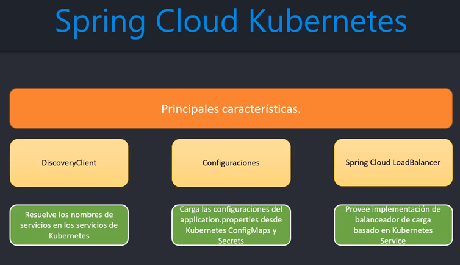
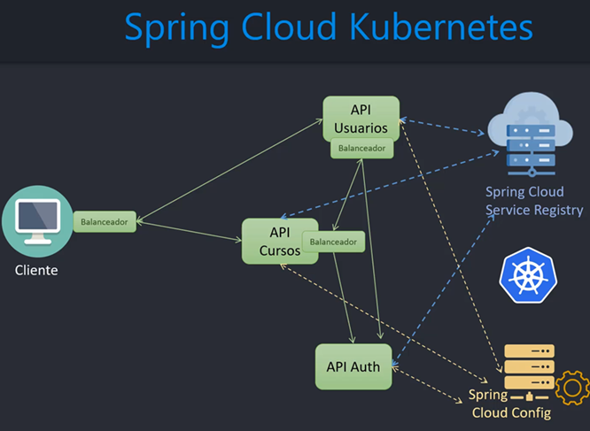

# Sección 17: Kubernetes: Spring Cloud Kubernetes

---

## Introducción Spring Cloud Kubernetes

### Spring Cloud Kubernetes

`Spring Cloud Kubernetes` provee una integración de Spring Cloud que permiten a los desarrolladores crear y ejecutar
aplicaciones de Spring Cloud en Kubernetes.

Veamos los distintos componentes de `Spring Cloud` dentro de `Kubernetes`:

- `Cliente`, se comunica con los distintos `servicios` y estos a su vez con los distintos `pods`, cada uno de las cuales
  podría tener muchas instancias.
- `Spring Cloud Service Registry`, es el discovery client. Va a registrar cada servicio de kubernetes con la lista
  completa de sus pods. La ip y el puerto lo asocia a un nombre, luego ese nombre lo usamos en cada microservicios para
  que nos podamos comunicar unos con otros. Cada microservicio obtendrá esa lista.
- `Balanceador`, cada microservicio se comunicará con otro usando Spring Cloud Load Balancer.
- `Spring Cloud Config`, maneja las configuraciones, integra los `configMap` los `secrets` para que puedan ser usados
  en cada microservicio.

