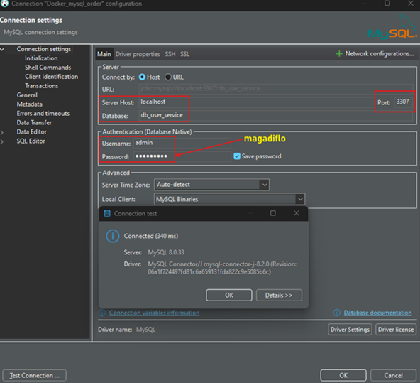
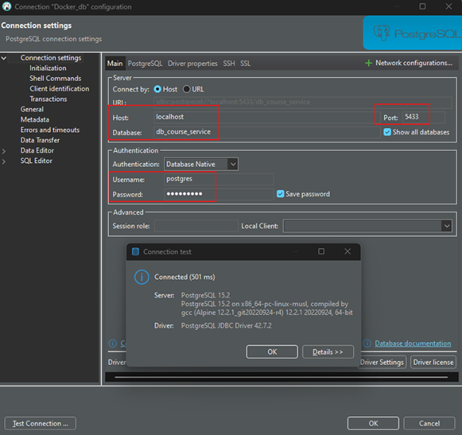

# Sección 09: Docker Networks - Comunicación entre contenedores

---

## Dockerizando course-service

### En el course-service

Hasta ahora el microservicio `course-service` lo hemos estado trabajando sin dockerizar, así que en este apartado
lo dockerizaremos. El primer cambio que haremos será modificar la `url` de conexión de la base de datos. Como el
`course-service` estará dockerizada, necesitamos que apunte a la base de datos de nuestra máquina local, eso lo
logramos reemplazando el `localhost` con el dominio especial de docker `host.docker.internal`.

````yml
spring:
  application:
    name: course-service
  datasource:
    url: jdbc:postgresql://host.docker.internal:5432/db_course-service
````

Más adelante, veremos cómo dockerizar las bases de datos de `PostgreSQL` y `MySQL` para que tengamos toda la aplicación
100% dockerizada.

Recordemos que para que este `course-service` se comunique con el microservicio `user-service`, creamos la interfaz
`UserFeignClient`. Esta interfaz define la url que apunta al microservicio `user-service` por lo que también debemos
hacer la modificación correspondiente.

````java

@FeignClient(name = "user-service", url = "http://user-service:8001", path = "/api/v1/users")
public interface UserFeignClient {
    /* methods */
}
````

**Donde**

- `name = "user-service"`, corresponde al nombre del microservicio con el que nos vamos a comunicar. El valor lo
  obtenemos de la propiedad `spring.application.name=user-service` de dicho microservicio.
- `url = "http://user-service:8001"`, de esta url el `user-service` corresponde al nombre que le daremos al contenedor
  con la bandera `--name`. El puerto seguirá siendo el mismo.

Ahora, crearemos el `Dockerfile` para este microservicio `course-service`. Notar que tiene los mismos comandos que
usamos en el `Dockerfile` del microservicio `user-service`, con la única diferencia que aquí estamos exponiendo el
puerto `8002` correspondiente al `courser-service`.

````dockerfile
FROM eclipse-temurin:21-jdk-alpine AS dependencies
WORKDIR /app
COPY ./mvnw ./
COPY ./.mvn ./.mvn
COPY ./pom.xml ./

RUN sed -i -e 's/\r$//' ./mvnw  \
    && ./mvnw dependency:go-offline

COPY ./src ./src
RUN ./mvnw clean package -DskipTests

FROM eclipse-temurin:21-jre-alpine AS builder
WORKDIR /app
COPY --from=dependencies /app/target/*.jar ./app.jar
RUN java -Djarmode=layertools -jar app.jar extract

FROM eclipse-temurin:21-jre-alpine AS runner
WORKDIR /app
COPY --from=builder /app/dependencies ./
COPY --from=builder /app/spring-boot-loader ./
COPY --from=builder /app/snapshot-dependencies ./
COPY --from=builder /app/application ./

EXPOSE 8002
CMD ["java", "org.springframework.boot.loader.launch.JarLauncher"]
````

Ahora que ya tenemos lo necesario, crearemos la imagen del microservicio `course-service`.

````bash
M:\PROGRAMACION\DESARROLLO_JAVA_SPRING\01.udemy\02.udemy_andres_guzman\docker-kubernetes (main -> origin)
$ docker image build -t course-service .\projects\course-service -f .\projects\course-service\Dockerfile

[+] Building 59.2s (22/22) FINISHED                                                                       
 => [internal] load build definition from Dockerfile                                                      
 => => transferring dockerfile: 786B                                                                      
 => [internal] load metadata for docker.io/library/eclipse-temurin:21-jre-alpine                          
 => [internal] load metadata for docker.io/library/eclipse-temurin:21-jdk-alpine                          
 => [internal] load .dockerignore                                                                         
 => => transferring context: 2B                                                                           
 => [builder 1/4] FROM docker.io/library/eclipse-temurin:21-jre-alpine                                    
 => [dependencies 1/8] FROM docker.io/library/eclipse-temurin:21-jdk-alpine                               
 => [internal] load build context                                                                         
 => => transferring context: 43.41kB                                                                      
 => CACHED [dependencies 2/8] WORKDIR /app                                                                
 => CACHED [dependencies 3/8] COPY ./mvnw ./                                                              
 => CACHED [dependencies 4/8] COPY ./.mvn ./.mvn                                                          
 => [dependencies 5/8] COPY ./pom.xml ./                                                                  
 => [dependencies 6/8] RUN sed -i -e 's/\r$//' ./mvnw      && ./mvnw dependency:go-offline                
 => [dependencies 7/8] COPY ./src ./src                                                                   
 => [dependencies 8/8] RUN ./mvnw clean package -DskipTests                                               
 => CACHED [builder 2/4] WORKDIR /app                                                                     
 => [builder 3/4] COPY --from=dependencies /app/target/*.jar ./app.jar                                    
 => [builder 4/4] RUN java -Djarmode=layertools -jar app.jar extract                                      
 => [runner 3/6] COPY --from=builder /app/dependencies ./                                                 
 => [runner 4/6] COPY --from=builder /app/spring-boot-loader ./                                           
 => [runner 5/6] COPY --from=builder /app/snapshot-dependencies ./                                        
 => [runner 6/6] COPY --from=builder /app/application ./                                                  
 => exporting to image                                                                                    
 => => exporting layers                                                                                   
 => => writing image sha256:3960d887aa9adcfcbbceed91d7b235e86802a94eabece4133e50145df5d3e9ac              
 => => naming to docker.io/library/course-service                                                         
                                                                                                          
View build details: docker-desktop://dashboard/build/desktop-linux/desktop-linux/dld8np724e7k8vbaljevbs63l
                                                                                                          
What's next:                                                                                              
    View a summary of image vulnerabilities and recommendations → docker scout quickview
````

Luego listamos las imágenes y vemos que el nuestro ya se encuentra en la lista.

````bash
$ docker image ls
REPOSITORY                               TAG             IMAGE ID       CREATED          SIZE
course-service                           latest          3960d887aa9a   58 seconds ago   247MB
````

### En el user-service

En el microservicio `user-service` tenemos definido el `CourseFeignClient` que se comunica con el microservicio
`courser-service`. Asi que también lo modificaremos para que apunte al contenedor del microservicio `courser-service`.

````java

@FeignClient(name = "course-service", url = "http://course-service:8002", path = "/api/v1/courses")
public interface CourseFeignClient {
    @DeleteMapping(path = "/users/{userId}")
    void unassignUserFromAssociatedCourse(@PathVariable Long userId);
}
````

Luego de realizar las modificaciones, construimos la imagen para el microservicio `course-service`.

````bash
M:\PROGRAMACION\DESARROLLO_JAVA_SPRING\01.udemy\02.udemy_andres_guzman\docker-kubernetes (main -> origin)
$ docker image build -t user-service .\projects\user-service -f .\projects\user-service\Dockerfile

[+] Building 27.2s (23/23) FINISHED                                                                       
 => [internal] load build definition from Dockerfile                                                      
 => => transferring dockerfile: 804B                                                                      
 => [internal] load metadata for docker.io/library/eclipse-temurin:21-jdk-alpine                          
 => [internal] load metadata for docker.io/library/eclipse-temurin:21-jre-alpine                          
 => [internal] load .dockerignore                                                                         
 => => transferring context: 212B                                                                         
 => [dependencies 1/8] FROM docker.io/library/eclipse-temurin:21-jdk-alpine                               
 => [builder 1/4] FROM docker.io/library/eclipse-temurin:21-jre-alpine                                    
 => [internal] load build context                                                                         
 => => transferring context: 4.01kB                                                                       
 => CACHED [dependencies 2/8] WORKDIR /app                                                                
 => CACHED [dependencies 3/8] COPY ./mvnw ./                                                              
 => CACHED [dependencies 4/8] COPY ./.mvn ./.mvn                                                          
 => CACHED [dependencies 5/8] COPY ./pom.xml ./                                                           
 => CACHED [dependencies 6/8] RUN sed -i -e 's/\r$//' ./mvnw      && ./mvnw dependency:go-offline         
 => [dependencies 7/8] COPY ./src ./src                                                                   
 => [dependencies 8/8] RUN ./mvnw clean package -DskipTests                                               
 => CACHED [builder 2/4] WORKDIR /app                                                                     
 => [builder 3/4] COPY --from=dependencies /app/target/*.jar ./app.jar                                    
 => [builder 4/4] RUN java -Djarmode=layertools -jar app.jar extract                                      
 => CACHED [runner 3/7] RUN mkdir ./logs                                                                  
 => CACHED [runner 4/7] COPY --from=builder /app/dependencies ./                                          
 => CACHED [runner 5/7] COPY --from=builder /app/spring-boot-loader ./                                    
 => CACHED [runner 6/7] COPY --from=builder /app/snapshot-dependencies ./                                 
 => [runner 7/7] COPY --from=builder /app/application ./                                                  
 => exporting to image                                                                                    
 => => exporting layers                                                                                   
 => => writing image sha256:a434d5447f5f319f35ee89989acd39b83873e77378f3eb71666198c8a330e371              
 => => naming to docker.io/library/user-service                                                           
                                                                                                          
View build details: docker-desktop://dashboard/build/desktop-linux/desktop-linux/ym6uosgl0tv1802qmqxgamrme
                                                                                                          
What's next:                                                                                              
    View a summary of image vulnerabilities and recommendations → docker scout quickview                  
````

Hasta este punto listamos las dos imágenes que acabamos de construir. La del `user-service` construído en este apartado
y la del `course-service` construído en el apartado anterior.

````bash
$ docker image ls
REPOSITORY                               TAG             IMAGE ID       CREATED         SIZE
user-service                             latest          a434d5447f5f   4 minutes ago   248MB
course-service                           latest          3960d887aa9a   8 minutes ago   247MB
````

## Configura la red o network

Listamos las redes para ver cuáles se encuentran creadas por defecto en Docker.

````bash
$ docker network ls

NETWORK ID     NAME          DRIVER    SCOPE
3909a0c11dff   bridge        bridge    local
6dac92048c81   host          host      local
4eea7e69fe4f   none          null      local
````

Ahora, para comunicar nuestros microservicios crearemos la red `docker-network`.

````bash
$ docker network create docker-network
1c97cc801f3e64f5c7f436caab3a52a1966da5fafcfed3ace1285f1df872f1b2
````

Listamos nuevamente las redes. Vemos que la red `docker-network` está creada correctamente.

````bash
$ docker network ls
NETWORK ID     NAME             DRIVER    SCOPE
3909a0c11dff   bridge           bridge    local
1c97cc801f3e   docker-network   bridge    local
6dac92048c81   host             host      local
4eea7e69fe4f   none             null      local
````

**Nota**
> Si no creas explícitamente una red en Docker, los contenedores se ejecutan en una red por defecto llamada `bridge`.
> Esta red es la configuración estándar para contenedores que no se asocian a una red personalizada. Sin embargo,
> en la red `bridge` por defecto, los contenedores no pueden resolverse por nombre entre ellos, lo que significa
> que no puedes usar el nombre del contenedor para que se comuniquen entre sí, deben comunicarse usando direcciones IP
> asignadas por Docker.

## Comunicación entre contenedores

Creamos los contenedores de nuestros dos microservicios. Observar que estamos agregando la red creada anteriormente
`docker-network`. Además, cada contenedor tiene como `--name` el `user-service` y `course-service`. Estos nombres los
estamos usando dentro del código fuente de nuestros microservicios para que puedan comunicarse entre sí.

````bash
$ docker container run -d -p 8001:8001 --rm --name user-service --network docker-network user-service
c9d3f19ab6e1bbfa583b2f8105c7469fddfc0e0d8deab7b02f89724b2d6bde47

$ docker container run -d -p 8002:8002 --rm --name course-service --network docker-network course-service
acb313a9279b6e0406b77190f3f1e9200abea5c253cb2f8df3d9456ca035e57a
````

Podemos inspeccionar la red `docker-network` para ver que los dos contenedores creados anteriormente ya están asociados
a él.

````bash
$ docker network inspect docker-network
[
    {
        "Name": "docker-network",
        "Id": "1c97cc801f3e64f5c7f436caab3a52a1966da5fafcfed3ace1285f1df872f1b2",
        "Created": "2024-10-08T00:19:47.559058206Z",
        "Scope": "local",
        "Driver": "bridge",
        "EnableIPv6": false,
        "IPAM": {
            "Driver": "default",
            "Options": {},
            "Config": [
                {
                    "Subnet": "172.19.0.0/16",
                    "Gateway": "172.19.0.1"
                }
            ]
        },
        "Internal": false,
        "Attachable": false,
        "Ingress": false,
        "ConfigFrom": {
            "Network": ""
        },
        "ConfigOnly": false,
        "Containers": {
            "acb313a9279b6e0406b77190f3f1e9200abea5c253cb2f8df3d9456ca035e57a": {
                "Name": "course-service",
                "EndpointID": "d1410d2e62f96af5e9d720104aab7213ce6e663366a33d2165ae764e5e1b804f",
                "MacAddress": "02:42:ac:13:00:03",
                "IPv4Address": "172.19.0.3/16",
                "IPv6Address": ""
            },
            "c9d3f19ab6e1bbfa583b2f8105c7469fddfc0e0d8deab7b02f89724b2d6bde47": {
                "Name": "user-service",
                "EndpointID": "3c584a6a910eeb508b30e0370501837939e6e1d77a16a93764d0a9ec9f4937ef",
                "MacAddress": "02:42:ac:13:00:02",
                "IPv4Address": "172.19.0.2/16",
                "IPv6Address": ""
            }
        },
        "Options": {},
        "Labels": {}
    }
]
````

Después de crear los contenedores, los podemos listar para ver que están levantados correctamente `Up`.

````bash
$ docker container ls -a
CONTAINER ID   IMAGE            COMMAND                  CREATED          STATUS                    PORTS                    NAMES
acb313a9279b   course-service   "/__cacert_entrypoin…"   22 seconds ago   Up 21 seconds             0.0.0.0:8002->8002/tcp   course-service
c9d3f19ab6e1   user-service     "/__cacert_entrypoin…"   53 seconds ago   Up 52 seconds             0.0.0.0:8001->8001/tcp   user-service
````

Probamos la comunicación entre nuestros dos contenedores simplemente haciendo una petión http hacia el microservicio
de cursos. Este endpoint traerá la información de un curso y los usuarios asociados a dicho curso.

````bash
$ curl -v -G --data "loadRelations=true" http://localhost:8002/api/v1/courses/1 | jq
>
< HTTP/1.1 200
<
{
  "id": 1,
  "name": "Spring Boot 3",
  "users": [
    {
      "id": 1,
      "name": "Milagros",
      "email": "milagros@gmail.com",
      "password": "123456"
    },
    {
      "id": 3,
      "name": "Ana Lucia",
      "email": "analucia@gmail.com",
      "password": "123456"
    },
    {
      "id": 6,
      "name": "Lesly",
      "email": "lesly@gmail.com",
      "password": "123456"
    }
  ]
}
````

## Dockerizando MySQL

Hasta este momento el `user-service` está apuntando hacía `MySQL` que está instalado en mi máquina local. Pero ahora,
vamos a contenerizar `MySQL` para tenerlo dentro de nuestra plataforma de `Docker`. Para eso, necesitamos bajar la
imagen de `MySQL`, así que en nuestra terminal ejecutamos el siguiente comando.

````bash
$ docker pull mysql:8.0.33
````

Donde, `mysql` es el nombre de la imagen y `8.0.33` es el tag o la versión de la imagen.

Si listamos las imágenes, veremos que entre ellas está la imagen bajada de `MySQL`. Esta imagen por cierto, la bajamos
de la plataforma [Docker Hub](https://hub.docker.com/)

````bash 
$ docker image ls
REPOSITORY                               TAG             IMAGE ID       CREATED         SIZE
user-service                             latest          a434d5447f5f   2 hours ago     248MB
course-service                           latest          3960d887aa9a   2 hours ago     247MB
mysql                                    8.0.33          f6360852d654   14 months ago   565MB
````

Como ya tenemos la imagen de `MySQL` en nuestra plataforma de `Docker`, a continuación procedemos a crear un contenedor.

````bash
$ docker container run -d -p 3307:3306 --name c-mysql --network docker-network -e MYSQL_ROOT_PASSWORD=magadiflo -e MYSQL_DATABASE=db_user_service -e MYSQL_USER=admin -e MYSQL_PASSWORD=magadiflo mysql:8.0.33
3f46896309769ed368de955a441aea4239dcf2c1b763de56698d8add439a6c67
````

**Donde**

- `-p 3307:3306`, el puerto externo estamos colocando en `3307`, ya que actualmente tenemos `MySQL` instalada en nuestra
  pc local y está corriendo en el puerto `3306`. El puerto interno lo dejamos tal cual `3306`, ya que eso trabaja al
  interno del contenedor, mientras que el externo hace referencia a nuestra máquina local.
- `--name c-mysql`, le damos un nombre al contenedor.
- `--network docker-network`, lo agregamos a la red donde están los microservicios de cursos y usuarios.
- `-e (--env)`, nos permite establecer variables de entorno. Cada variable de entorno a definir, debe estar precedido
  por la bandera `-e` o `--env`.

Listamos los contenedores.

````bash
$ docker container ls -a
CONTAINER ID   IMAGE            COMMAND                  CREATED          STATUS                    PORTS                               NAMES
3f4689630976   mysql:8.0.33     "docker-entrypoint.s…"   3 minutes ago    Up 3 minutes              33060/tcp, 0.0.0.0:3307->3306/tcp   c-mysql
acb313a9279b   course-service   "/__cacert_entrypoin…"   42 minutes ago   Up 42 minutes             0.0.0.0:8002->8002/tcp              course-service
c9d3f19ab6e1   user-service     "/__cacert_entrypoin…"   42 minutes ago   Up 42 minutes             0.0.0.0:8001->8001/tcp              user-service
````

Verificamos si podemos conectarnos desde `DBeaver` hacia nuestro `MySql` contenerizado que se está ejecutando en
el puerto externo `3307`. El resultado debe ser una conexión exitosa.



**IMPORTANTE**
> Si al conectarnos con `DBeaver` al contenedor de `MySQL` nos sale el siguiente error:
>
> `MySQL : Public Key Retrieval is not allowed` lo que debemos hacer es una configuración en el `DBeaver`.
> Vamos a `Ajustes de conexión/Driver properties/allowPublicKeyRetrieval = true`.
>
> [StackOverflow](https://stackoverflow.com/questions/50379839/connection-java-mysql-public-key-retrieval-is-not-allowed)

## Dockerizando PostgreSQL

Al igual que hicimos con `MySQL`, en este apartado nos toca dockerizar `PostgreSQL`.

Cuando contenerizamos la base de datos de `MySQL`, lo primero que hicimos fue descargar la imagen con el
comando `docker pull`, pero en esta ocasión, con `PostgreSQL` crearemos directamente el contenedor. `Docker` al ver que
no lo tenemos descargado, nos mostrará el mensaje `Unable to find image 'postgres:15.2-alpine' locally` y lo empezará
a descargar por nosotros. Posteriormente, creará nuestro contenedor.

````bash
$ docker container run -d -p 5433:5432 --name c-postgres --network docker-network -e POSTGRES_USER=postgres -e POSTGRES_PASSWORD=magadiflo -e POSTGRES_DB=db_course_service postgres:15.2-alpine
Unable to find image 'postgres:15.2-alpine' locally
15.2-alpine: Pulling from library/postgres
96526aa774ef: Pull complete
....
....
fdb0f3814a2eed35b02cc4bb91e69dfb2dea119adceaf27213ec27e6f4a3c883
````

**Donde**

- `-p 5433:5432`, el puerto externo estamos colocando en `5433`, ya que actualmente tenemos `PostgreSQL` en nuestra pc
  local que está corriendo en el puerto `5432`. El puerto interno lo dejamos tal cual `5432`, ya que eso trabaja al
  interno del contenedor, mientras que el externo hace referencia a nuestra máquina local.
- `--name c-postgres`, le damos un nombre al contenedor.
- `--network docker-network`, lo agregamos a la red donde están los otros dos microservicios.
- `-e (--env)`, nos permite establecer variables de entorno. Cada variable de entorno a definir, debe estar precedido
  por la bandera `-e` o `--env`.

Listando los contenedores.

````bash
$ docker container ls -a
CONTAINER ID   IMAGE                  COMMAND                  CREATED             STATUS                    PORTS                               NAMES
d49e00278ac6   postgres:15.2-alpine   "docker-entrypoint.s…"   3 minutes ago       Up 3 minutes              0.0.0.0:5433->5432/tcp              c-postgres
3f4689630976   mysql:8.0.33           "docker-entrypoint.s…"   29 minutes ago      Up 29 minutes             33060/tcp, 0.0.0.0:3307->3306/tcp   c-mysql
acb313a9279b   course-service         "/__cacert_entrypoin…"   About an hour ago   Up About an hour          0.0.0.0:8002->8002/tcp              course-service
c9d3f19ab6e1   user-service           "/__cacert_entrypoin…"   About an hour ago   Up About an hour          0.0.0.0:8001->8001/tcp              user-service
````

Aquí también verificamos que podemos conectarnos desde `DBeaver` hacia nuestro `PostgreSQL` contenerizado quien ahora
mismo se está ejecutando en el puerto externo `5433`. El resultado debe ser una conexión exitosa.



## Comunicación entre contenedores con bases de datos dockerizadas (MySQL y PostgreSQL)

En este apartado veremos cómo podemos configurar las aplicaciones a fin de que trabajemos netamente con contenedores.

### En el course-service

Modificamos el `application.yml` del microservicio `course-service` para poder comunicarnos con la base de datos
conteneirzada de `PostgreSQL`. En los datos de conexión debemos colocar los mismos datos con los que construimos
el contenedor de postgres.

````yml
spring:
  application:
    name: course-service
  datasource:
    url: jdbc:postgresql://c-postgres:5432/db_course_service
    username: postgres
    password: magadiflo
````

En la url, cambiaremos el dns de docker `host.docker.internal` por el nombre del contenedor de postgres `c-postgres`.
De esta manera, cuando creemos el contenedor `user-service` podrá comunicarse con el contenedor de la base de datos
de `postgreSQL`, siempre y cuando, ambos contenedores estén en la misma red. En nuestro cas, haremos que todos los
contenedores estén en la red `docker-network`.

Luego de haber realizado las modificaciones al código fuente, volvemos a generar la imagen para el `course-service`.

````bash
M:\PROGRAMACION\DESARROLLO_JAVA_SPRING\01.udemy\02.udemy_andres_guzman\docker-kubernetes (main -> origin) 
$ docker image build -t course-service .\projects\course-service -f .\projects\course-service\Dockerfile  
[+] Building 22.4s (22/22) FINISHED                                                                       
 => [internal] load build definition from Dockerfile                                                      
 => => transferring dockerfile: 786B                                                                      
 => [internal] load metadata for docker.io/library/eclipse-temurin:21-jre-alpine                          
 => [internal] load metadata for docker.io/library/eclipse-temurin:21-jdk-alpine                          
 => [internal] load .dockerignore                                                                         
 => => transferring context: 2B                                                                           
 => [dependencies 1/8] FROM docker.io/library/eclipse-temurin:21-jdk-alpine                               
 => [builder 1/4] FROM docker.io/library/eclipse-temurin:21-jre-alpine                                    
 => [internal] load build context                                                                         
 => => transferring context: 4.08kB                                                                       
 => CACHED [dependencies 2/8] WORKDIR /app                                                                
 => CACHED [dependencies 3/8] COPY ./mvnw ./                                                              
 => CACHED [dependencies 4/8] COPY ./.mvn ./.mvn                                                          
 => CACHED [dependencies 5/8] COPY ./pom.xml ./                                                           
 => CACHED [dependencies 6/8] RUN sed -i -e 's/\r$//' ./mvnw      && ./mvnw dependency:go-offline         
 => [dependencies 7/8] COPY ./src ./src                                                                   
 => [dependencies 8/8] RUN ./mvnw clean package -DskipTests                                               
 => CACHED [builder 2/4] WORKDIR /app                                                                     
 => [builder 3/4] COPY --from=dependencies /app/target/*.jar ./app.jar                                    
 => [builder 4/4] RUN java -Djarmode=layertools -jar app.jar extract                                      
 => CACHED [runner 3/6] COPY --from=builder /app/dependencies ./                                          
 => CACHED [runner 4/6] COPY --from=builder /app/spring-boot-loader ./                                    
 => CACHED [runner 5/6] COPY --from=builder /app/snapshot-dependencies ./                                 
 => [runner 6/6] COPY --from=builder /app/application ./                                                  
 => exporting to image                                                                                    
 => => exporting layers                                                                                   
 => => writing image sha256:872ca9137d60f97d062acb5347ccaa34b95cbad64a4b9761040bbe63a5ef07c9              
 => => naming to docker.io/library/course-service                                                         
                                                                                                          
View build details: docker-desktop://dashboard/build/desktop-linux/desktop-linux/lvi04qlih8ml11kmzq6sb25b3
                                                                                                          
What's next:                                                                                              
    View a summary of image vulnerabilities and recommendations → docker scout quickview                  
````

Ahora, a partir de la imagen anterior creamos el contenedor para nuestro microservicio.

````bash
$ docker container run -d -p 8002:8002 --rm --name course-service --network docker-network course-service
ad2c83683bcb60f982ff9f7c5b75a8039aa6f0ac60450db057135f3f2d753ef8
````

Inspeccionamos la red `spring-network` para ver, hasta este punto que tenemos 3 contenedores asociados a dicha red.

````bash
$ docker network inspect docker-network
[
    {
        "Name": "docker-network",
        "Id": "1c97cc801f3e64f5c7f436caab3a52a1966da5fafcfed3ace1285f1df872f1b2",
        "Created": "2024-10-08T00:19:47.559058206Z",
        "Scope": "local",
        "Driver": "bridge",
        "EnableIPv6": false,
        "IPAM": {
            "Driver": "default",
            "Options": {},
            "Config": [
                {
                    "Subnet": "172.19.0.0/16",
                    "Gateway": "172.19.0.1"
                }
            ]
        },
        "Internal": false,
        "Attachable": false,
        "Ingress": false,
        "ConfigFrom": {
            "Network": ""
        },
        "ConfigOnly": false,
        "Containers": {
            "ad2c83683bcb60f982ff9f7c5b75a8039aa6f0ac60450db057135f3f2d753ef8": {
                "Name": "course-service",
                "EndpointID": "9139b911d9f4c33b7161ca44924c90a09045bbb628c9da60acd3545d796f3c89",
                "MacAddress": "02:42:ac:13:00:04",
                "IPv4Address": "172.19.0.4/16",
                "IPv6Address": ""
            },
            "d6bd5a3eb47ae3fbe728d1ecc69b2c74353b77880bd678189484979722e16cea": {
                "Name": "c-mysql",
                "EndpointID": "8219a4e75f18d559cca13512b60c44f214442e37ce826345df67acc1ecbde541",
                "MacAddress": "02:42:ac:13:00:02",
                "IPv4Address": "172.19.0.2/16",
                "IPv6Address": ""
            },
            "fdb0f3814a2eed35b02cc4bb91e69dfb2dea119adceaf27213ec27e6f4a3c883": {
                "Name": "c-postgres",
                "EndpointID": "81a1cd6daf436d27bd37ddb753647fe1f51a389a56abd75d8b548fec58c79617",
                "MacAddress": "02:42:ac:13:00:03",
                "IPv4Address": "172.19.0.3/16",
                "IPv6Address": ""
            }
        },
        "Options": {},
        "Labels": {}
    }
]
````

Para comprobar que nuestro contenedor `course-service` se ha comunicado correctamente con `c-postgres` vamos a darle
un vistazo al log.

````bash
$ docker container logs course-service

  .   ____          _            __ _ _
 /\\ / ___'_ __ _ _(_)_ __  __ _ \ \ \ \
( ( )\___ | '_ | '_| | '_ \/ _` | \ \ \ \
 \\/  ___)| |_)| | | | | || (_| |  ) ) ) )
  '  |____| .__|_| |_|_| |_\__, | / / / /
 =========|_|==============|___/=/_/_/_/

 :: Spring Boot ::                (v3.3.4)

2024-10-08T04:37:13.897Z  INFO 1 --- [course-service] [           main] d.m.course.app.CourseServiceApplication  : Starting CourseServiceApplication v0.0.1-SNAPSHOT using Java 21.0.3 with PID 1 (/app/BOOT-INF/classes started by root in /app)
2024-10-08T04:37:13.902Z DEBUG 1 --- [course-service] [           main] d.m.course.app.CourseServiceApplication  : Running with Spring Boot v3.3.4, Spring v6.1.13
2024-10-08T04:37:13.905Z  INFO 1 --- [course-service] [           main] d.m.course.app.CourseServiceApplication  : No active profile set, falling back to 1 default profile: "default"
...
2024-10-08T04:37:17.756Z  INFO 1 --- [course-service] [           main] o.s.b.w.embedded.tomcat.TomcatWebServer  : Tomcat initialized with port 8002 (http)
...
2024-10-08T04:37:19.464Z  INFO 1 --- [course-service] [           main] o.s.o.j.p.SpringPersistenceUnitInfo      : No LoadTimeWeaver setup: ignoring JPA class transformer
2024-10-08T04:37:19.561Z  INFO 1 --- [course-service] [           main] com.zaxxer.hikari.HikariDataSource       : HikariPool-1 - Starting...
2024-10-08T04:37:20.165Z  INFO 1 --- [course-service] [           main] com.zaxxer.hikari.pool.HikariPool        : HikariPool-1 - Added connection org.postgresql.jdbc.PgConnection@15d88c10
2024-10-08T04:37:20.169Z  INFO 1 --- [course-service] [           main] com.zaxxer.hikari.HikariDataSource       : HikariPool-1 - Start completed.
2024-10-08T04:37:22.614Z  INFO 1 --- [course-service] [           main] o.h.e.t.j.p.i.JtaPlatformInitiator       : HHH000489: No JTA platform available (set 'hibernate.transaction.jta.platform' to enable JTA platform integration)
2024-10-08T04:37:22.765Z DEBUG 1 --- [course-service] [           main] org.hibernate.SQL                        :
    create table course_users (
        id bigint generated by default as identity,
        user_id bigint,
        course_id bigint,
        primary key (id)
    )
2024-10-08T04:37:22.804Z DEBUG 1 --- [course-service] [           main] org.hibernate.SQL                        :
    create table courses (
        id bigint generated by default as identity,
        name varchar(255) not null,
        primary key (id)
    )
2024-10-08T04:37:22.824Z DEBUG 1 --- [course-service] [           main] org.hibernate.SQL                        :
    alter table if exists course_users
       drop constraint if exists UKkdhhgtn4xoxgggdkh5fooi5i7
2024-10-08T04:37:22.830Z  WARN 1 --- [course-service] [           main] o.h.engine.jdbc.spi.SqlExceptionHelper   : SQL Warning Code: 0, SQLState: 00000
2024-10-08T04:37:22.831Z  WARN 1 --- [course-service] [           main] o.h.engine.jdbc.spi.SqlExceptionHelper   : constraint "ukkdhhgtn4xoxgggdkh5fooi5i7" of relation "course_users" does not exist, skipping
2024-10-08T04:37:22.832Z DEBUG 1 --- [course-service] [           main] org.hibernate.SQL                        :
    alter table if exists course_users
       add constraint UKkdhhgtn4xoxgggdkh5fooi5i7 unique (user_id)
2024-10-08T04:37:22.847Z DEBUG 1 --- [course-service] [           main] org.hibernate.SQL                        :
    alter table if exists course_users
       add constraint FKcax8xujvganv6xl9ra0sgouem
       foreign key (course_id)
       references courses
2024-10-08T04:37:22.861Z  INFO 1 --- [course-service] [           main] j.LocalContainerEntityManagerFactoryBean : Initialized JPA EntityManagerFactory for persistence unit 'default'
2024-10-08T04:37:23.835Z  WARN 1 --- [course-service] [           main] JpaBaseConfiguration$JpaWebConfiguration : spring.jpa.open-in-view is enabled by default. Therefore, database queries may be performed during view rendering. Explicitly configure spring.jpa.open-in-view to disable this warning
2024-10-08T04:37:25.536Z  INFO 1 --- [course-service] [           main] o.s.b.w.embedded.tomcat.TomcatWebServer  : Tomcat started on port 8002 (http) with context path '/'
2024-10-08T04:37:25.557Z  INFO 1 --- [course-service] [           main] d.m.course.app.CourseServiceApplication  : Started CourseServiceApplication in 12.717 seconds (process running for 13.472)
````

Como vemos en el resultado anterior, se ha creado las tablas en la base de datos contenerizada de postgres.

### En el user-service

Aquí también realizamos las modificaciones en el `application.yml`. Colocamos los mismos parámetros que usamos al
construir el contenedor de `c-mysql` y por supuesto, cambiamos el `host.docker.internal` por el nombre del contenedor
de la base de datos `c-mysql`.

````yml
spring:
  application:
    name: user-service
  datasource:
    url: jdbc:mysql://c-mysql:3306/db_user_service
    username: admin
    password: magadiflo
````

Habiendo realizado las modificaciones al código fuente del `user-service`, volvemos a crear la imagen.

````bash
M:\PROGRAMACION\DESARROLLO_JAVA_SPRING\01.udemy\02.udemy_andres_guzman\docker-kubernetes (main -> origin) 
$ docker image build -t user-service .\projects\user-service -f .\projects\user-service\Dockerfile        
[+] Building 27.2s (23/23) FINISHED                                                                       
 => [internal] load build definition from Dockerfile                                                      
 => => transferring dockerfile: 804B                                                                      
 => [internal] load metadata for docker.io/library/eclipse-temurin:21-jre-alpine                          
 => [internal] load metadata for docker.io/library/eclipse-temurin:21-jdk-alpine                          
 => [internal] load .dockerignore                                                                         
 => => transferring context: 212B                                                                         
 => [dependencies 1/8] FROM docker.io/library/eclipse-temurin:21-jdk-alpine                               
 => [internal] load build context                                                                         
 => => transferring context: 3.51kB                                                                       
 => [builder 1/4] FROM docker.io/library/eclipse-temurin:21-jre-alpine                                    
 => CACHED [dependencies 2/8] WORKDIR /app                                                                
 => CACHED [dependencies 3/8] COPY ./mvnw ./                                                              
 => CACHED [dependencies 4/8] COPY ./.mvn ./.mvn                                                          
 => CACHED [dependencies 5/8] COPY ./pom.xml ./                                                           
 => CACHED [dependencies 6/8] RUN sed -i -e 's/\r$//' ./mvnw      && ./mvnw dependency:go-offline         
 => [dependencies 7/8] COPY ./src ./src                                                                   
 => [dependencies 8/8] RUN ./mvnw clean package -DskipTests                                               
 => CACHED [builder 2/4] WORKDIR /app                                                                     
 => [builder 3/4] COPY --from=dependencies /app/target/*.jar ./app.jar                                    
 => [builder 4/4] RUN java -Djarmode=layertools -jar app.jar extract                                      
 => CACHED [runner 3/7] RUN mkdir ./logs                                                                  
 => CACHED [runner 4/7] COPY --from=builder /app/dependencies ./                                          
 => CACHED [runner 5/7] COPY --from=builder /app/spring-boot-loader ./                                    
 => CACHED [runner 6/7] COPY --from=builder /app/snapshot-dependencies ./                                 
 => [runner 7/7] COPY --from=builder /app/application ./                                                  
 => exporting to image                                                                                    
 => => exporting layers                                                                                   
 => => writing image sha256:611a78c7713c55a4745d9838fa2e317fa1226b5adf12c1aedd75f759f0b99eb9              
 => => naming to docker.io/library/user-service                                                           
                                                                                                          
View build details: docker-desktop://dashboard/build/desktop-linux/desktop-linux/7wmyui1ptm0anr8t39yyvjniz
                                                                                                          
What's next:                                                                                              
    View a summary of image vulnerabilities and recommendations → docker scout quickview                                                                                                                 
````

A partir de la imagen anterior, creamos el contenedor enlazado a la red `docker-network`.

````bash
$ docker container run -d -p 8001:8001 --rm --name user-service --network docker-network user-service
02b3cb677923d8e9b75f62b876f20057558bc85e46923a3a52a7d67b67309033
````

Hasta este punto, si inspeccionamos la red `docker-network` debemos observar que ya hay 4 contenedores asociados.

````bash
$ docker network inspect docker-network
[
    {
        "Name": "docker-network",
        "Id": "1c97cc801f3e64f5c7f436caab3a52a1966da5fafcfed3ace1285f1df872f1b2",
        "Created": "2024-10-08T00:19:47.559058206Z",
        "Scope": "local",
        "Driver": "bridge",
        "EnableIPv6": false,
        "IPAM": {
            "Driver": "default",
            "Options": {},
            "Config": [
                {
                    "Subnet": "172.19.0.0/16",
                    "Gateway": "172.19.0.1"
                }
            ]
        },
        "Internal": false,
        "Attachable": false,
        "Ingress": false,
        "ConfigFrom": {
            "Network": ""
        },
        "ConfigOnly": false,
        "Containers": {
            "02b3cb677923d8e9b75f62b876f20057558bc85e46923a3a52a7d67b67309033": {
                "Name": "user-service",
                "EndpointID": "5ffc1cfcf7477557aeee02c1253e61d2d60928931c001ac18968bf79dce47f64",
                "MacAddress": "02:42:ac:13:00:05",
                "IPv4Address": "172.19.0.5/16",
                "IPv6Address": ""
            },
            "ad2c83683bcb60f982ff9f7c5b75a8039aa6f0ac60450db057135f3f2d753ef8": {
                "Name": "course-service",
                "EndpointID": "9139b911d9f4c33b7161ca44924c90a09045bbb628c9da60acd3545d796f3c89",
                "MacAddress": "02:42:ac:13:00:04",
                "IPv4Address": "172.19.0.4/16",
                "IPv6Address": ""
            },
            "d6bd5a3eb47ae3fbe728d1ecc69b2c74353b77880bd678189484979722e16cea": {
                "Name": "c-mysql",
                "EndpointID": "8219a4e75f18d559cca13512b60c44f214442e37ce826345df67acc1ecbde541",
                "MacAddress": "02:42:ac:13:00:02",
                "IPv4Address": "172.19.0.2/16",
                "IPv6Address": ""
            },
            "fdb0f3814a2eed35b02cc4bb91e69dfb2dea119adceaf27213ec27e6f4a3c883": {
                "Name": "c-postgres",
                "EndpointID": "81a1cd6daf436d27bd37ddb753647fe1f51a389a56abd75d8b548fec58c79617",
                "MacAddress": "02:42:ac:13:00:03",
                "IPv4Address": "172.19.0.3/16",
                "IPv6Address": ""
            }
        },
        "Options": {},
        "Labels": {}
    }
]
````

Para comprobar que nuestro contenedor `user-service` se ha comunicado correctamente con `c-mysql` vamos a darle
un vistazo al log.

````bash
$ docker container logs user-service

  .   ____          _            __ _ _
 /\\ / ___'_ __ _ _(_)_ __  __ _ \ \ \ \
( ( )\___ | '_ | '_| | '_ \/ _` | \ \ \ \
 \\/  ___)| |_)| | | | | || (_| |  ) ) ) )
  '  |____| .__|_| |_|_| |_\__, | / / / /
 =========|_|==============|___/=/_/_/_/

 :: Spring Boot ::                (v3.3.4)

2024-10-08T04:53:45.863Z  INFO 1 --- [user-service] [           main] d.m.user.app.UserServiceApplication      : Starting UserServiceApplication v0.0.1-SNAPSHOT using Java 21.0.3 with PID 1 (/app/BOOT-INF/classes started by root in /app) 2024-10-08T04:53:45.867Z DEBUG 1 --- [user-service] [           main] d.m.user.app.UserServiceApplication      : Running with Spring Boot v3.3.4, Spring v6.1.13
2024-10-08T04:53:45.869Z  INFO 1 --- [user-service] [           main] d.m.user.app.UserServiceApplication      : No active profile set, falling back to 1 default profile: "default"
...
2024-10-08T04:53:49.490Z  INFO 1 --- [user-service] [           main] o.s.b.w.embedded.tomcat.TomcatWebServer  : Tomcat initialized with port 8001 (http)
...
2024-10-08T04:53:52.184Z  INFO 1 --- [user-service] [           main] com.zaxxer.hikari.pool.HikariPool        : HikariPool-1 - Added connection com.mysql.cj.jdbc.ConnectionImpl@1008df1e
2024-10-08T04:53:52.189Z  INFO 1 --- [user-service] [           main] com.zaxxer.hikari.HikariDataSource       : HikariPool-1 - Start completed.
2024-10-08T04:53:54.158Z  INFO 1 --- [user-service] [           main] o.h.e.t.j.p.i.JtaPlatformInitiator       : HHH000489: No JTA platform available (set 'hibernate.transaction.jta.platform' to enable JTA platform integration)
2024-10-08T04:53:54.305Z DEBUG 1 --- [user-service] [           main] org.hibernate.SQL                        :
    create table users (
        id bigint not null auto_increment,
        email varchar(255) not null,
        name varchar(255) not null,
        password varchar(255) not null,
        primary key (id)
    ) engine=InnoDB
2024-10-08T04:53:54.444Z DEBUG 1 --- [user-service] [           main] org.hibernate.SQL                        :
    alter table users
       drop index UK6dotkott2kjsp8vw4d0m25fb7
2024-10-08T04:53:54.493Z DEBUG 1 --- [user-service] [           main] org.hibernate.SQL                        :
    alter table users
       add constraint UK6dotkott2kjsp8vw4d0m25fb7 unique (email)
2024-10-08T04:53:54.585Z  INFO 1 --- [user-service] [           main] j.LocalContainerEntityManagerFactoryBean : Initialized JPA EntityManagerFactory for persistence unit 'default'
2024-10-08T04:53:55.621Z  WARN 1 --- [user-service] [           main] JpaBaseConfiguration$JpaWebConfiguration : spring.jpa.open-in-view is enabled by default. Therefore, database queries may be performed during view rendering. Explicitly configure spring.jpa.open-in-view to disable this warning
2024-10-08T04:53:57.151Z  INFO 1 --- [user-service] [           main] o.s.b.w.embedded.tomcat.TomcatWebServer  : Tomcat started on port 8001 (http) with context path '/'
2024-10-08T04:53:57.205Z  INFO 1 --- [user-service] [           main] d.m.user.app.UserServiceApplication      : Started UserServiceApplication in 12.455 seconds (process running for 13.271)
````

Como vemos en el resultado anterior, se ha creado las tablas en la base de datos contenerizada de mysql.

## Revisando microservicios dockerizados

Creamos un curso en el microservicio `course-service` que corre dentro del contenedor `course-service`.

````bash
$ curl -v -X POST -H "Content-Type: application/json" -d "{\"name\": \"Spring Boot 3\"}" http://localhost:8002/api/v1/courses | jq
>
< HTTP/1.1 201
< Location: http://localhost:8002/api/v1/courses/1
< Content-Type: application/json
< Transfer-Encoding: chunked
< Date: Tue, 08 Oct 2024 05:03:14 GMT
<
{
  "id": 1,
  "name": "Spring Boot 3"
}
````

A partir del curso anterior, vamos a crear un usuario. Este proceso de creación hará que el microservicio
`course-service` se comunique con el microservicio `user-service`, de esa manera comprobaremos que la comunicación
entre contenedores está funcionando correctamente.

````bash
$ curl -v -X POST -H "Content-Type: application/json" -d "{\"name\": \"Lesly\", \"email\": \"lesly@gmail.com\", \"password\": \"123456\"}" http://localhost:8002/api/v1/courses/1/users | jq
>
< HTTP/1.1 201
<
{
  "id": 1,
  "name": "Lesly",
  "email": "lesly@gmail.com",
  "password": "123456"
}
````

Listamos los usuarios.

````bash
$ curl -v http://localhost:8001/api/v1/users | jq
>
< HTTP/1.1 200
<
[
  {
    "id": 1,
    "name": "Lesly",
    "email": "lesly@gmail.com",
    "password": "123456"
  }
]
````

Incluso si listamos los cursos con sus detalles de usuarios, veremos que la comunicación es más explícita aún.

````bash
$ curl -v -G --data "loadRelations=true" http://localhost:8002/api/v1/courses | jq
>
< HTTP/1.1 200
<
[
  {
    "id": 1,
    "name": "Spring Boot 3",
    "users": [
      {
        "id": 1,
        "name": "Lesly",
        "email": "lesly@gmail.com",
        "password": "123456"
      }
    ]
  }
]
````

## Problema con persistencia de datos en MySQL/Postgres al eliminar el contenedor

En el apartado anterior realizamos las pruebas a los endpoints de nuestros microservicios que están dockerizados, estos
microservicios se comunican con bases de datos también dockerizados.
Ahora, `¿qué pasa si eliminamos los contenedores de las bases de datos y los volvemos a crear?`.

Veamos que actualmente los cuatro contenedores se están ejecutando.

````bash
$ docker container ls -a
CONTAINER ID   IMAGE                  COMMAND                  CREATED          STATUS                    PORTS                               NAMES
2ecca8dfa381   course-service         "/__cacert_entrypoin…"   11 minutes ago   Up 11 minutes             0.0.0.0:8002->8002/tcp              course-service
66edf6d4efa8   user-service           "/__cacert_entrypoin…"   11 minutes ago   Up 11 minutes             0.0.0.0:8001->8001/tcp              user-service
d6bd5a3eb47a   mysql:8.0.33           "docker-entrypoint.s…"   23 hours ago     Up 14 minutes             33060/tcp, 0.0.0.0:3307->3306/tcp   c-mysql
fdb0f3814a2e   postgres:15.2-alpine   "docker-entrypoint.s…"   26 hours ago     Up 14 minutes             0.0.0.0:5433->5432/tcp              c-postgres
````

Eliminaremos todos los contenedores.

````bash
$ docker container rm -f c-postgres c-mysql courser-service user-service
c-postgres
c-mysql
course-service
user-service

$ docker container ls -a
CONTAINER ID   IMAGE            COMMAND                  CREATED      STATUS                    PORTS     NAMES
````

Ahora procedemos a crear nuevamente los cuatro contenedores.

````bash
$ docker container run -d -p 3307:3306 --name c-mysql --network docker-network -e MYSQL_ROOT_PASSWORD=magadiflo -e MYSQL_DATABASE=db_user_service -e MYSQL_USER=admin -e MYSQL_PASSWORD=magadiflo mysql:8.0.33
$ docker container run -d -p 5433:5432 --name c-postgres --network docker-network -e POSTGRES_USER=postgres -e POSTGRES_PASSWORD=magadiflo -e POSTGRES_DB=db_course_service postgres:15.2-alpine
$ docker container run -d -p 8002:8002 --name course-service --network docker-network course-service
$ docker container run -d -p 8001:8001 --name user-service --network docker-network user-service
````

Si listamos todos los contenedores, veremos que los 4 están levantados.

````bash
$ docker container ls -a
CONTAINER ID   IMAGE                  COMMAND                  CREATED          STATUS                    PORTS                               NAMES
25b66ca696a1   user-service           "/__cacert_entrypoin…"   45 seconds ago   Up 45 seconds             0.0.0.0:8001->8001/tcp              user-service
821c79fe9c3e   course-service         "/__cacert_entrypoin…"   50 seconds ago   Up 50 seconds             0.0.0.0:8002->8002/tcp              course-service
eb1b2fb45ca8   mysql:8.0.33           "docker-entrypoint.s…"   2 minutes ago    Up 2 minutes              33060/tcp, 0.0.0.0:3307->3306/tcp   c-mysql
3a8d9f5b6979   postgres:15.2-alpine   "docker-entrypoint.s…"   3 minutes ago    Up 3 minutes              0.0.0.0:5433->5432/tcp              c-postgres
````

Veamos qué pasa si realizamos peticiones a nuestros endpoints de nuestros microservicios contenerizados.

````bash
$ curl -v -G --data "loadRelations=true" http://localhost:8002/api/v1/courses | jq
>
< HTTP/1.1 200
< Content-Type: application/json
< Transfer-Encoding: chunked
< Date: Wed, 09 Oct 2024 04:05:11 GMT
<
[]
````

````bash
$ curl -v http://localhost:8001/api/v1/users | jq
>
* Request completely sent off
< HTTP/1.1 200
< Content-Type: application/json
< Transfer-Encoding: chunked
< Date: Wed, 09 Oct 2024 04:05:32 GMT
<
[]
````

**¡Los datos que registramos en el apartado anterior ya no están en nuestras bases de datos!**

> Nos acabamos de encontrar con un `problema` y es que `al eliminar los contenedores de las bases de datos`,
> `se eliminarán` con ellos `los datos que tengan almacenados`.

## Docker Volumes: Solución al problema de persistencia de datos

Para iniciar este apartado eliminaremos los 4 contenedores que tenemos.

````bash
$ docker container rm -f c-postgres c-mysql course-service user-service
c-postgres
c-mysql
course-service
user-service
````

### [Volumes (-v o --volume)](https://docs.docker.com/engine/storage/volumes/)

Los `volúmenes` son el mecanismo preferido para conservar los datos generados y utilizados por los contenedores de
`Docker`. Si bien los `bind mounts` (montajes de enlace) dependen de la estructura de directorios y del sistema
operativo de la máquina host, `los volúmenes son completamente administrados por Docker`. Los `volúmenes` tienen
varias ventajas sobre los `bind mounts`:

- Es más fácil hacer copias de seguridad o migrar los volúmenes que los bind mounts.
- Puede administrar volúmenes mediante comandos de la CLI de Docker o la API de Docker.
- Los volúmenes funcionan tanto en contenedores de Linux como de Windows.
- Los volúmenes se pueden compartir de forma más segura entre varios contenedores.
- Los drivers de volumen le permiten almacenar volúmenes en hosts remotos o proveedores de la nube, cifrar el
  contenido de los volúmenes o agregar otras funciones.
- Los nuevos volúmenes pueden tener su contenido precargado por un contenedor.
- Los `volúmenes` en Docker Desktop tienen un rendimiento mucho mayor que los `bind mounts` de los hosts de Mac y
  Windows.

Además, los volúmenes suelen ser una mejor opción que conservar los datos en la capa de escritura de un contenedor,
porque un volumen no aumenta el tamaño de los contenedores que lo usan y
`el contenido del volumen existe fuera del ciclo de vida de un contenedor` determinado.

En ese sentido, si nuestros contenedores de bases de datos trabajan con volúmenes, cuando eliminemos el contenedor de
las bases de datos, la información aún persistirá cuando lo volvamos a crear.


`-v o --volume`: **Consta de tres campos**, separados por dos puntos `(:)`. Los campos deben estar en el orden correcto,
y el significado de cada campo no es inmediatamente obvio.

- En el caso de `volúmenes con nombre`, **el primer campo es el nombre del volumen**, y es único en una determinada
  máquina. Para `volúmenes anónimos`, **el primer campo se omite.**
- **El segundo campo** es la **ruta donde el archivo o directorio están montados en el contenedor.**
- **El tercer campo es opcional**, y es una lista de opciones separadas por comas, como `ro`.

### Crea contenedor de MySQL con volumen

Para crear el contenedor de `MySQL` usaremos el mismo comando que en apartados anteriores, con la diferencia de que
aquí le agregaremos un `volúmen` y la opción de `restart`.

````bash
$ docker container run -d -p 3307:3306 --name c-mysql --network docker-network -e MYSQL_ROOT_PASSWORD=magadiflo -e MYSQL_DATABASE=db_user_service -e MYSQL_USER=admin -e MYSQL_PASSWORD=magadiflo -v data_mysql:/var/lib/mysql --restart=unless-stopped mysql:8.0.33
7f7db608513c47255f4b716c6bc5ed2b79fb544a289aa215138b0a88ae82c577
````

**Donde**

- `-v`, la bandera `-v` o `--volume` indica que se configurará un volumen. También se puede usar para configurar un
  `bind mount`, pero por la forma como lo tenemos configurado indica un volumen.
- `data_mysql` es el nombre que le daremos al volumen que estamos creando.
- `/var/lib/mysql`, este es el directorio dentro del contenedor de `MySQL` donde se almacenan los datos de la base de
  datos. Al usar esta opción de montaje de volumen, estás diciendo que deseas que los datos de `MySQL` se almacenen
  fuera del contenedor en un volumen llamado `data_mysql`.
- `--restart=unless-stopped` lo colocamos de manera opcional. Si el contenedor se detiene debido a un error o si el
  sistema en el que se está ejecutando Docker se reinicia, el contenedor se reiniciará automáticamente. Por otro lado,
  si el contenedor se detiene manualmente usando un comando como `docker container stop`, no se reiniciará
  automáticamente a menos que se inicie de nuevo manualmente. Como dije, es opcional, la ventaja es que nos ayuda a
  iniciar el contenedor automáticamente sin tener que levantarlo manualmente con
  `docker container start <container_name>`.

La razón por la que se hace esto es para que los datos de `MySQL` sean persistentes, lo que significa que incluso si el
contenedor se detiene o se elimina, los datos de la base de datos no se perderán. En lugar de almacenar los datos dentro
del contenedor, se almacenan en un volumen externo que puede ser respaldado, copiado y restaurado fácilmente. Esto es
útil en entornos de producción donde la pérdida de datos de la base de datos sería un problema importante.

La configuración de montaje de volumen simplemente redirige la ubicación donde `MySQL` almacena sus datos, no duplica
los datos.

Aquí está el flujo básico:

1. Cuando utilizas el contenedor de `MySQL`, los datos se almacenan inicialmente en el directorio `/var/lib/mysql`
   dentro del contenedor.
2. Sin embargo, debido al montaje de volumen `-v data_mysql:/var/lib/mysql`, esos datos no se almacenan en el sistema de
   archivos del contenedor en sí, sino que se almacenan en el volumen `data_mysql`.
3. La información se guarda una sola vez en el volumen. No hay duplicación de datos entre el contenedor y el volumen.
4. El volumen `data_mysql` es persistente, lo que significa que los datos en él se mantendrán incluso si el contenedor
   se detiene o se elimina.

El volumen `data_mysql` se crea en el sistema de archivos del host en el que se ejecuta Docker, no dentro del contenedor
en sí. Docker administra estos volúmenes en una ubicación específica en el sistema de archivos del host, que puede
variar según tu sistema operativo y configuración. En sistemas `Linux`, por ejemplo, los volúmenes suelen estar en el
directorio `/var/lib/docker/volumes`. En otros sistemas operativos,
como `Windows o macOS`, `Docker Desktop gestiona la ubicación de los volúmenes` de manera diferente.

Luego de haber creado el contenedor de `MySQL` con el volumen `data_mysql` podemos listar los volúmenes y ver que
efectivamente el volumen está creado.

````bash
$ docker volume ls
DRIVER    VOLUME NAME
local     data_mysql
````

### Crea contenedor de PostgreSQL con volumen

Creamos el contenedor para `PostgresSQL` con su volumen `data_postgres` y el `restart` en `unless-stopped`.

````bash
$ docker container run -d -p 5433:5432 --name c-postgres --network docker-network -e POSTGRES_USER=postgres -e POSTGRES_PASSWORD=magadiflo -e POSTGRES_DB=db_course_service -v data_postgres:/var/lib/postgresql/data --restart=unless-stopped postgres:15.2-alpine
b86b921b8490c43f0b2d64dbf9aa852d921326895712a02016552a20febe053e
````

Verificamos el volumen creado.

````bash
$ docker volume ls
DRIVER    VOLUME NAME
local     data_mysql
local     data_postgres
````

Listamos los dos contenedores de bases de datos.

````bash
$ docker container ls -a
CONTAINER ID   IMAGE                  COMMAND                  CREATED              STATUS                    PORTS                               NAMES
b86b921b8490   postgres:15.2-alpine   "docker-entrypoint.s…"   About a minute ago   Up About a minute         0.0.0.0:5433->5432/tcp              c-postgres
7f7db608513c   mysql:8.0.33           "docker-entrypoint.s…"   23 minutes ago       Up 23 minutes             33060/tcp, 0.0.0.0:3307->3306/tcp   c-mysql
````

### Crea contenedores de los microservicios user-service y course-service

````bash
$ docker container run -d -p 8001:8001 --name user-service --network docker-network user-service
1838ae89cf652bf5526878f66d6d26e364d0dab8410e5e7343a2ae5a43de2488

$ docker container run -d -p 8002:8002 --name course-service --network docker-network course-service
3e0760845176153aaaa14b98369be7756064980019816b13df494ed8f64eb8fa
````

Verificamos que los 4 contenedores estén ejecutándose.

````bash
$ docker container ls -a
CONTAINER ID   IMAGE                  COMMAND                  CREATED              STATUS                    PORTS                               NAMES
3e0760845176   course-service         "/__cacert_entrypoin…"   About a minute ago   Up About a minute         0.0.0.0:8002->8002/tcp              course-service
1838ae89cf65   user-service           "/__cacert_entrypoin…"   About a minute ago   Up About a minute         0.0.0.0:8001->8001/tcp              user-service
b86b921b8490   postgres:15.2-alpine   "docker-entrypoint.s…"   5 minutes ago        Up 5 minutes              0.0.0.0:5433->5432/tcp              c-postgres
7f7db608513c   mysql:8.0.33           "docker-entrypoint.s…"   27 minutes ago       Up 26 minutes             33060/tcp, 0.0.0.0:3307->3306/tcp   c-mysql
````