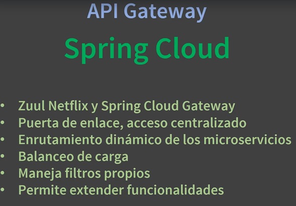

# Sección 18: Kubernetes: Spring Cloud Gateway

---

## Introducción a Spring Cloud Gateway

`Gateway` es un servidor de enrutamiento dinámico. Veamos cuáles son sus principales características:



## Creando nuevo módulo infrastructure

Crearemos un nuevo módulo de maven llamado `infrastructure` donde colocaremos el microservicio de Spring Cloud Gateway.

A partir de la raíz del proyecto `docker-kubernetes` creamos el módulo `infrastructure` en cuyo interior configuraremos
el `pom.xml`:

````xml

<project>
    <modelVersion>4.0.0</modelVersion>

    <parent>
        <groupId>com.magadiflo.dk</groupId>
        <artifactId>docker-kubernetes</artifactId>
        <version>1.0-SNAPSHOT</version>
    </parent>

    <artifactId>infrastructure</artifactId>

    <packaging>pom</packaging>

</project>
````

Como hemos agregado un nuevo módulo, es importante que el módulo padre (docker-kubernetes) tenga definido este nuevo
módulo:

````xml

<modules>
    <module>business-domain</module>
    <module>infrastructure</module>
</modules>
````

## Creando microservicio Spring Cloud Gateway

Como ya creamos un módulo para albergar nuestro microservicio de Gateway, utilizaremos spring initializr para crearlo y
luego lo agregaremos a él.

Es importante realizar algunas modificaciones al pom de microservicio `dk-ms-spring-cloud-gateway` para que se acople a
la estructura de módulos con el que venimos trabajando.

````xml

<project>

    <parent>
        <groupId>com.magadiflo.dk</groupId>
        <artifactId>infrastructure</artifactId>
        <version>1.0-SNAPSHOT</version>
    </parent>

    <groupId>com.magadiflo.dk.infrastructure</groupId>
    <artifactId>dk-ms-spring-cloud-gateway</artifactId>
    <version>0.0.1-SNAPSHOT</version>
    <name>dk-ms-spring-cloud-gateway</name>
    <description>Demo project for Spring Boot</description>

    <dependencies>
        <dependency>
            <groupId>org.springframework.cloud</groupId>
            <artifactId>spring-cloud-starter-gateway</artifactId>
        </dependency>
    </dependencies>

    <build>
        <plugins>
            <plugin>
                <groupId>org.springframework.boot</groupId>
                <artifactId>spring-boot-maven-plugin</artifactId>
                <configuration>
                    <image>
                        <builder>paketobuildpacks/builder-jammy-base:latest</builder>
                    </image>
                </configuration>
            </plugin>
        </plugins>
    </build>

</project>
````

Un último cambio se realizará en el pom padre de este microservicio, es decir en el `pom.xml (infrastructure)`:

````xml

<modules>
    <module>dk-ms-spring-cloud-gateway</module>
</modules>
````

## Configurando microservicio Spring Cloud Gateway

En el `pom.xml` del microservicio de `Gateway` agregaremos las dos dependencias de Spring Cloud Kubernetes:

````xml

<dependencies>
    <!--Another dependency-->
    <dependency>
        <groupId>org.springframework.cloud</groupId>
        <artifactId>spring-cloud-starter-kubernetes-client</artifactId>
    </dependency>
    <dependency>
        <groupId>org.springframework.cloud</groupId>
        <artifactId>spring-cloud-starter-kubernetes-client-loadbalancer</artifactId>
    </dependency>
</dependencies>
````

Luego, en la clase principal agregamos la anotación `@EnableDiscoveryClient` para que sea un cliente de `kubernetes`:

````java

@EnableDiscoveryClient
@SpringBootApplication
public class DkMsGatewayMain {
    /* code */
}
````

Finalmente, en el `application.yml` (que por cierto era `.properties` pero lo cambié a `.yml`) le agregamos las
siguientes configuraciones:

````yaml
server:
  port: ${CONTAINER_PORT:8090}

spring:
  application:
    name: dk-ms-spring-cloud-gateway
````

## Configurando rutas de microservicios en Gateway y Dockerizando

En el `application.yml` del microservicio `dk-ms-spring-cloud-gateway` agregamos las configuraciones a las rutas
de los microservicios usando `load balancer (lb)`:

````yaml
# another configuration
spring:
  # another configuration
  cloud:
    gateway:
      routes:
        - id: dk-ms-courses
          uri: lb://dk-ms-courses
          predicates:
            - Path=/base-courses/**
          filters:
            - StripPrefix=1
        - id: dk-ms-users
          uri: lb://dk-ms-users
          predicates:
            - Path=/base-users/**
          filters:
            - StripPrefix=1
````

**DONDE**

- `id: dk-ms-courses`, corresponde al nombre que le dimos al microservicio en el `spring.application.name`. En este
  caso, esta configuración corresponde al microservicio de cursos.
- `uri: lb://dk-ms-courses`, le decimos que enrute las llamadas usando `load balancer (lb)` al microservicio, en este
  caso, `dk-ms-courses`.
- `Path=/base-courses/**`, definimos una ruta base hacia nuestro microservicio cursos.
- `StripPrefix=1`, corresponde a la cantidad de segmentos definidos en el `Path`. Es decir, en nuestro caso el `Path`
  solo está compuesto por un segmento `base-courses` por eso le corresponde el `1`; pero si por ejemplo, el `Path`
  fuera así `/base-courses/base-api/**`, vemos que este path está compuesto por dos segmentos `base-courses` y
  `base-api` por lo que el `StripPrefix` tendría ser igual a `2`.

Ahora creamos el `Dockerfile` en la raíz del microservicio de Gateway y agregamos su respectiva configuración:

````Dockerfile
FROM openjdk:17-jdk-alpine AS builder
WORKDIR /app/infrastructure/dk-ms-spring-cloud-gateway
COPY ./pom.xml /app
COPY ./infrastructure/pom.xml /app/infrastructure
COPY ./infrastructure/dk-ms-spring-cloud-gateway/pom.xml ./
COPY ./infrastructure/dk-ms-spring-cloud-gateway/mvnw ./
COPY ./infrastructure/dk-ms-spring-cloud-gateway/.mvn ./.mvn
RUN sed -i -e 's/\r$//' ./mvnw
RUN ./mvnw dependency:go-offline
COPY ./infrastructure/dk-ms-spring-cloud-gateway/src ./src
RUN ./mvnw clean package -DskipTests

FROM openjdk:17-jdk-alpine
WORKDIR /app
RUN mkdir ./logs
COPY --from=builder /app/infrastructure/dk-ms-spring-cloud-gateway/target/*.jar ./app.jar
EXPOSE 8002
CMD ["java", "-jar", "app.jar"]
````

Antes de proceder a construir la imagen a partir del Dockerfile anterior, vamos a la web de `Docker Hub` y creamos el
repositorio de imagen al que le llamaremos `dk-ms-spring-cloud-gateway`.

Ahora sí, procedemos a ejecutar el comando para crear la imagen de Gateway y luego subirlo al repositorio de docker hub:

````bash
$ docker build -t dk-ms-spring-cloud-gateway . -f .\infrastructure\dk-ms-spring-cloud-gateway\Dockerfile
$ docker tag dk-ms-spring-cloud-gateway magadiflo/dk-ms-spring-cloud-gateway
$ docker push magadiflo/dk-ms-spring-cloud-gateway
````

## Escribiendo Deployment y Service de Gateway y probando en curl

Creamos el archivo `deployment-gateway.yml` para el microservicio `dk-ms-spring-cloud-gateway` en la raíz de todo el
proyecto de `docker-kubernets`:

````yaml
apiVersion: apps/v1
kind: Deployment
metadata:
  name: dk-ms-spring-cloud-gateway
spec:
  replicas: 1
  selector:
    matchLabels:
      app: dk-ms-spring-cloud-gateway
  template:
    metadata:
      labels:
        app: dk-ms-spring-cloud-gateway
    spec:
      containers:
        - image: magadiflo/dk-ms-spring-cloud-gateway:latest
          name: dk-ms-spring-cloud-gateway
          ports:
            - containerPort: 8090
          env:
            - name: CONTAINER_PORT
              value: '8090'
````

Del mismo modo creamos el archivo `service-dk-ms-spring-cloud-gateway.yml` para configurar el servicio:

````yaml
apiVersion: v1
kind: Service
metadata:
  name: dk-ms-spring-cloud-gateway
spec:
  ports:
    - port: 8090
      protocol: TCP
      targetPort: 8090
  selector:
    app: dk-ms-spring-cloud-gateway
  type: LoadBalancer
````

Ahora aplicamos a los dos archivos:

````bash
$ kubectl apply -f .\deployment-gateway.yml -f .\service-dk-ms-spring-cloud-gateway.yml
deployment.apps/dk-ms-spring-cloud-gateway created
service/dk-ms-spring-cloud-gateway created
````

Ahora iniciamos el servicio para obtener la url de gateway:

````bash
$ minikube service dk-ms-spring-cloud-gateway --url
http://127.0.0.1:61935
! Because you are using a Docker driver on windows, the terminal needs to be open to run it.
````

**¡Importante!** Recordar que la url que nos proporcione servirá para poder acceder tanto al microservicio de cursos
como al microservicio de usuarios.

Probamos el acceso al microservicio de usuarios usando la url proporcionada y el path configurado en el microservicio
de Spring Cloud Load Balancer:

````bash
$ curl -v http://localhost:61935/base-users/api/v1/users | jq

>
< HTTP/1.1 200 OK
< transfer-encoding: chunked
< Content-Type: application/json
<
[
  {
    "id": 1,
    "name": "Martin",
    "email": "martin@gmail.com",
    "password": "12345"
  },
  {
    "id": 2,
    "name": "Martin",
    "email": "martin@outlook.com",
    "password": "12345"
  }
]
````

**DONDE**

- `61935`, puerto proporcionado al levantar el servicio de gateway.
- `base-users`, path configurado en el microservicio de spring cloud load balancer.
- `/api/v1/users`, uri del microservicio de usuarios.

Ahora accederemos al microservicio de cursos usando la misma url proporcionada por el servicio:

````bash
$ curl -v http://localhost:61935/base-courses/api/v1/courses/1 | jq

>
< HTTP/1.1 200 OK
< transfer-encoding: chunked
< Content-Type: application/json
{
  "id": 1,
  "name": "Docker",
  "courseUsers": [
    {
      "id": 1,
      "userId": 2
    }
  ],
  "users": [
    {
      "id": 2,
      "name": "Martin",
      "email": "martin@outlook.com",
      "password": "12345"
    }
  ]
}
````
