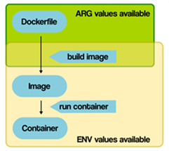
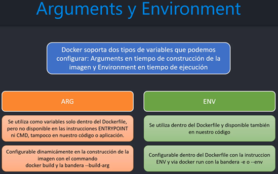

# Sección 10: Docker - Arguments y Environments Variables

---

## [Introducción](https://vsupalov.com/docker-arg-env-variable-guide/)

Al utilizar Docker, distinguimos entre dos tipos diferentes de variables (`ARG y ENV`). Se diferencian en el momento del
ciclo de vida de un `contenedor-imagen `en el que los valores están disponibles.

He aquí un resumen simplificado de las disponibilidades de `ARG` y `ENV`. Comenzando con la construcción de una imagen
`Docker` desde un `Dockerfile`, hasta que un contenedor se ejecuta. Los valores `ARG` no son utilizables desde dentro
de los contenedores en ejecución.



### ARG (Build-time Arguments)

Las variables definidas a través de `ARG` también se conocen como variables en tiempo de compilación. **Solo están
disponibles desde el momento en que son 'anunciadas' en el `Dockerfile` con una instrucción `ARG` en el `Dockerfile`.**

**Los contenedores** en ejecución **no pueden acceder a los valores de las variables `ARG`.**  Así que cualquier cosa
que ejecute a través de instrucciones `CMD y ENTRYPOINT` no verá esos valores por defecto.

**El beneficio de `ARG` es, que `Docker` esperará obtener valores para esas variables.** Al menos, si usted no
especifica un valor por defecto. **Si esos valores no se proporcionan al ejecutar el comando de compilación, habrá un
mensaje de error.** Aquí hay un ejemplo donde Docker se queja durante la construcción:

````bash
# no default value is specified!
ARG some_value
````

### ENV (Build-time and run-time Environment Variables)

Las variables `ENV` están disponibles tanto durante la construcción como para el futuro contenedor en ejecución.
**En el `Dockerfile`, son utilizables tan pronto como se introducen con una instrucción `ENV`.**

A diferencia de `ARG`, **los valores `ENV` son accesibles por los contenedores iniciados desde la imagen final.** Los
valores `ENV` pueden ser anulados al iniciar un contenedor.

A continuación se muestra el resumen entre `ARG` y `ENV`.



## Trabajando con variables de entorno (ENV) - user-service

Veremos un primer acercamiento al uso de las variables de entorno en este microservicio. El ejemplo será, cambiar
dinámicamente el puerto en la que correrá la aplicación al interior del contendor, de tal forma que, cuando creemos un
nuevo contenedor, podremos asignárle dinámicamente un puerto distinto.

### Definiendo variable de entorno en el Dockerfile

Lo primero que haremos será modificar el `application.yml` del `user-service` para utilizar por el momento dos variables
de entorno: `CONTAINER_PORT` y el `SPRING_PROFILES_ACTIVE`.

````yml
server:
  port: ${CONTAINER_PORT:8001}
````

**Donde**

- `CONTAINER_PORT`, variable de entorno definida para el `server.port`.
- `8001`, valor por defecto si la variable de entorno `CONTAINER_PORT` no fue definida.

Luego, en el `Dockerfile` podemos definir la variable de entorno utilizando la instrucción `ENV`.

````Dockerfile
# otras instrucciones
#
ENV CONTAINER_PORT=8000
EXPOSE ${CONTAINER_PORT}
CMD ["java", "org.springframework.boot.loader.launch.JarLauncher"]
````

**Donde**

- `ENV`, esta instrucción establece la variable de entorno `CONTAINER_PORT` con valor de puerto `8000`. Este valor
  estará en el entorno para todas las instrucciones posteriores en la etapa de construcción y puede ser reemplazado en
  línea.
- Al definir una variable de entorno con `ENV` sí o sí debemos asignarle un valor, en nuestro caso tiene el puerto
  `8000`.
- Es importante recordar que, en esta situación, aunque `ENV` puede ser utilizado tanto en la construcción como en la
  ejecución del contenedor, cuando se usa en `EXPOSE`, su efecto es únicamente durante la fase de construcción de la
  imagen. Así que sí, en este caso, el `ENV` está funcionando solo para la configuración del puerto en la imagen
  construida.

**Nota**
> Recordemos que en el `application.yml` del `user-service` hemos definido como valor por defecto el `8001` si es que
> la variable de entorno `CONTAINER_PORT` no viene definida.
>
> Ahora, como en el `Dockerfile` estamos estableciendo explícitamente el `ENV CONTAINER_PORT=8000`, significa que
> esa variable siempre estará definida y con valor `8000`, por lo que el puerto por defecto (`8001`) del
> `application.yml` jamás se usará.

````bash
M:\PROGRAMACION\DESARROLLO_JAVA_SPRING\01.udemy\02.udemy_andres_guzman\docker-kubernetes (main -> origin)
$ docker image build -t user-service .\projects\user-service -f .\projects\user-service\Dockerfile
````

Procedemos a crear el contenedor a partir de la imagen anterior.

````bash
$ docker container run -d -p 8001:8000 --rm --name user-service --network docker-network user-service
1563bc22db14a528b2dd2d7bfd9a6d7ff4f286e0e3fa75d902b2f35a413cad42
````

**Donde**

- `-p 8001:8000`, el puerto externo sigue siendo `8001`, recordemos que usamos ese valor para poder acceder desde
  nuestra máquina local al contendor. Por otro lado, el cambio que hemos realizado fue en el puerto interno `8000`.
  Esto significa que al interior del contenedor nuestra aplicación de Spring Boot usará dicho puerto. Para que eso
  suceda, el valor del puerto interno definido en el parámetro `-p 8001:8000` debe ser coherente con el valor que le
  definimos a la variable `ENV CONTAINER_PORT=8000` dentro del `Dockerfile`.

Vemos los contenedores que tenemos creados.

````bash
$ docker container ls -a

CONTAINER ID   IMAGE                  COMMAND                  CREATED         STATUS                     PORTS                               NAMES
1563bc22db14   user-service           "/__cacert_entrypoin…"   4 minutes ago   Up 4 minutes               0.0.0.0:8001->8000/tcp              user-service
630e958cae5b   mysql:8.0.33           "docker-entrypoint.s…"   4 days ago      Up About an hour           33060/tcp, 0.0.0.0:3307->3306/tcp   c-mysql
23ebfb070dfd   postgres:15.2-alpine   "docker-entrypoint.s…"   4 days ago      Up About an hour           0.0.0.0:5433->5432/tcp              c-postgres
````

Comprobamos que nuestra aplicación de Spring Boot está ejecutándose al interior del contenedor en el puerto `8000` tal
como lo definimos en la variable `ENV CONTAINER_PORT=8000`.

````bash
$ docker container logs user-service

  .   ____          _            __ _ _
 /\\ / ___'_ __ _ _(_)_ __  __ _ \ \ \ \
( ( )\___ | '_ | '_| | '_ \/ _` | \ \ \ \
 \\/  ___)| |_)| | | | | || (_| |  ) ) ) )
  '  |____| .__|_| |_|_| |_\__, | / / / /
 =========|_|==============|___/=/_/_/_/

 :: Spring Boot ::                (v3.3.4)

2024-10-13T17:36:21.220Z  INFO 1 --- [user-service] [           main] d.m.user.app.UserServiceApplication      : Starting UserServiceApplication v0.0.1-SNAPSHOT using Java 21.0.3 with PID 1 (/app/BOOT-INF/classes started by root in /app) 2024-10-13T17:36:21.222Z DEBUG 1 --- [user-service] [           main] d.m.user.app.UserServiceApplication      : Running with Spring Boot v3.3.4, Spring v6.1.13
2024-10-13T17:36:21.223Z  INFO 1 --- [user-service] [           main] d.m.user.app.UserServiceApplication      : No active profile set, falling back to 1 default profile: "default"
2024-10-13T17:36:22.189Z  INFO 1 --- [user-service] [           main] .s.d.r.c.RepositoryConfigurationDelegate : Bootstrapping Spring Data JPA repositories in DEFAULT mode.
2024-10-13T17:36:22.267Z  INFO 1 --- [user-service] [           main] .s.d.r.c.RepositoryConfigurationDelegate : Finished Spring Data repository scanning in 65 ms. Found 1 JPA repository interface.
2024-10-13T17:36:22.511Z  INFO 1 --- [user-service] [           main] o.s.cloud.context.scope.GenericScope     : BeanFactory id=51e13f18-6b4d-3be4-9143-31e457cd9ea8
2024-10-13T17:36:22.984Z  INFO 1 --- [user-service] [           main] o.s.b.w.embedded.tomcat.TomcatWebServer  : Tomcat initialized with port 8000 (http)
2024-10-13T17:36:23.000Z  INFO 1 --- [user-service] [           main] o.apache.catalina.core.StandardService   : Starting service [Tomcat]
2024-10-13T17:36:23.000Z  INFO 1 --- [user-service] [           main] o.apache.catalina.core.StandardEngine    : Starting Servlet engine: [Apache Tomcat/10.1.30]
...
2024-10-13T17:36:26.004Z  WARN 1 --- [user-service] [           main] JpaBaseConfiguration$JpaWebConfiguration : spring.jpa.open-in-view is enabled by default. Therefore, database queries may be performed during view rendering. Explicitly configure spring.jpa.open-in-view to disable this warning
2024-10-13T17:36:26.713Z  INFO 1 --- [user-service] [           main] o.s.b.w.embedded.tomcat.TomcatWebServer  : Tomcat started on port 8000 (http) with context path '/'
2024-10-13T17:36:26.757Z  INFO 1 --- [user-service] [           main] d.m.user.app.UserServiceApplication      : Started UserServiceApplication in 6.058 seconds (process running for 6.81)
````

Comprobamos que la aplicación sigue funcionando con el puerto externo `8001`pero que esta vez está vinculado al puerto
interno `8000`.

````bash
$ curl -v http://localhost:8001/api/v1/users | jq
>
< HTTP/1.1 200
< Content-Type: application/json
[
  {
    "id": 1,
    "name": "Lesly",
    "email": "lesly@gmail.com",
    "password": "123456"
  }
]
````

### Sobreescribiendo variable de entorno (ENV) a través de línea de comandos

En el `application.yml` vamos a crear una nueva variable de entorno `SPRING_PROFILES_ACTIVE` cuyo valor por defecto
será `default`. Es decir, que tome las configuraciones por defecto si es que no se le define un perfil.

````yml
server:
  port: ${CONTAINER_PORT:8001}
  error:
    include-message: always

spring:
  profiles:
    active: ${SPRING_PROFILES_ACTIVE:default}
````

Esta vez en el `Dockerfile` no definiremos la variable `SPRING_PROFILES_ACTIVE` con el `ENV` tal como lo hicimos con el
`CONTAINER_PORT`.

Volvemos a construir la imagen para tener el cambio realizado en el `application.yml`.

````bash
M:\PROGRAMACION\DESARROLLO_JAVA_SPRING\01.udemy\02.udemy_andres_guzman\docker-kubernetes (main -> origin)
$ docker image build -t user-service .\projects\user-service -f .\projects\user-service\Dockerfile
````

Creamos un contenedor de la imagen anterior con el valor por defecto para la variable de entorno
`SPRING_PROFILES_ACTIVE`.

````bash
$ docker container run -d -p 8001:8000 --rm --name user-service --network docker-network user-service
f703095e560a2ae85087169ccdf1bda39f9774d480b82f1986f8bd2d3d0cfa7f
````

Por lo que si revisamos el log, el perfil se estará ejecutando como `default` y el puerto el valor de `8000`.

````bash
$ docker container logs user-service

  .   ____          _            __ _ _
 /\\ / ___'_ __ _ _(_)_ __  __ _ \ \ \ \
( ( )\___ | '_ | '_| | '_ \/ _` | \ \ \ \
 \\/  ___)| |_)| | | | | || (_| |  ) ) ) )
  '  |____| .__|_| |_|_| |_\__, | / / / /
 =========|_|==============|___/=/_/_/_/

 :: Spring Boot ::                (v3.3.4)

2024-10-13T18:15:20.708Z  INFO 1 --- [user-service] [           main] d.m.user.app.UserServiceApplication      : Starting UserServiceApplication v0.0.1-SNAPSHOT using Java 21.0.3 with PID 1 (/app/BOOT-INF/classes started by root in /app) 2024-10-13T18:15:20.712Z DEBUG 1 --- [user-service] [           main] d.m.user.app.UserServiceApplication      : Running with Spring Boot v3.3.4, Spring v6.1.13
2024-10-13T18:15:20.715Z  INFO 1 --- [user-service] [           main] d.m.user.app.UserServiceApplication      : The following 1 profile is active: "default"
2024-10-13T18:15:22.720Z  INFO 1 --- [user-service] [           main] .s.d.r.c.RepositoryConfigurationDelegate : Bootstrapping Spring Data JPA repositories in DEFAULT mode.
2024-10-13T18:15:22.904Z  INFO 1 --- [user-service] [           main] .s.d.r.c.RepositoryConfigurationDelegate : Finished Spring Data repository scanning in 158 ms. Found 1 JPA repository interface.
2024-10-13T18:15:23.421Z  INFO 1 --- [user-service] [           main] o.s.cloud.context.scope.GenericScope     : BeanFactory id=51e13f18-6b4d-3be4-9143-31e457cd9ea8
2024-10-13T18:15:24.471Z  INFO 1 --- [user-service] [           main] o.s.b.w.embedded.tomcat.TomcatWebServer  : Tomcat initialized with port 8000 (http)
2024-10-13T18:15:24.512Z  INFO 1 --- [user-service] [           main] o.apache.catalina.core.StandardService   : Starting service [Tomcat]
2024-10-13T18:15:24.513Z  INFO 1 --- [user-service] [           main] o.apache.catalina.core.StandardEngine    : Starting Servlet engine: [Apache Tomcat/10.1.30]
...
2024-10-13T18:15:31.694Z  INFO 1 --- [user-service] [           main] o.s.b.w.embedded.tomcat.TomcatWebServer  : Tomcat started on port 8000 (http) with context path '/'
2024-10-13T18:15:31.730Z  INFO 1 --- [user-service] [           main] d.m.user.app.UserServiceApplication      : Started UserServiceApplication in 12.31 seconds (process running for 13.089)
````

La variable `SPRING_PROFILES_ACTIVE` usa el valor por defecto que definimos en el `application.yml`. Mientras que la
variable `CONTAINER_PORT` usa el valor por defecto definido en el `Dockerfile`.

Ahora sí, crearemos un contenedor asignando a través de la línea de comandos variables de entorno que tenemos definido
en el `Dockerfile` y en nuestra aplicación. De esta manera, sobreescribiremos los valores por defecto que tienen
definidos.

````bash
$ docker container run -d -p 8001:8090 -e SPRING_PROFILES_ACTIVE=dev -e CONTAINER_PORT=8090 --rm --name user-service --network docker-network user-service
c4169ee1c7302b73e14fea48cc9d40754620f6ae55604d8947b7eff338c85544
````

**Donde**

- `-p 8001:8090`, el valor que le definimos al puerto interno de este nuevo contenedor es `8090`.
- `-e` o `--env`, nos permite definir una variable de entorno.
- `CONTAINER_PORT=8090`, variable de entorno definida en la línea de comandos. Esta variable sobreescribe a la variable
  que definimos en el `Dockerfile`, si es que en ese archivo existe dicha variable. Caso contrario, simplemente estamos
  creando la variable para que sea usada por quien la defina al interior del contenedor. En nuestro caso,
  el `application.yml` en la configuración `server.port`.
- `SPRING_PROFILES_ACTIVE=dev`, variable de entorno que no ha sido definido en el `Dockerfile`, pero que sí está
  definido en el `application.yml` de nuestro `user-service`.

**Nota**
> Las variables de entorno que definamos a través de la línea de comandos, no necesariamente tiene que estar definida
> en el `Dockerfile`, es decir, a través de la línea de comandos podemos definir variables de entorno, y si existen
> en el `Dockerfile`, obviamente se sobreescribirán, en caso de que no existan, simplemente estarán disponibles en el
> entorno de ejecución de dicho contenedor, por lo que, podrán ser accedidos por ejemplo, desde el `application.yml`.

Listamos los contenedores.

````bash
$ docker container ls -a

CONTAINER ID   IMAGE                  COMMAND                  CREATED         STATUS                     PORTS                               NAMES
c4169ee1c730   user-service           "/__cacert_entrypoin…"   3 minutes ago   Up 3 minutes               8000/tcp, 0.0.0.0:8001->8090/tcp    user-service
630e958cae5b   mysql:8.0.33           "docker-entrypoint.s…"   4 days ago      Up 2 hours                 33060/tcp, 0.0.0.0:3307->3306/tcp   c-mysql
23ebfb070dfd   postgres:15.2-alpine   "docker-entrypoint.s…"   4 days ago      Up 2 hours                 0.0.0.0:5433->5432/tcp              c-postgres
````

Ahora comprobamos que nuestra aplicación de Spring Boot está corriendo en el puerto `8090` y con el perfil `dev`.

````bash
docker container logs user-service

  .   ____          _            __ _ _
 /\\ / ___'_ __ _ _(_)_ __  __ _ \ \ \ \
( ( )\___ | '_ | '_| | '_ \/ _` | \ \ \ \
 \\/  ___)| |_)| | | | | || (_| |  ) ) ) )
  '  |____| .__|_| |_|_| |_\__, | / / / /
 =========|_|==============|___/=/_/_/_/

 :: Spring Boot ::                (v3.3.4)

2024-10-13T18:26:23.772Z  INFO 1 --- [user-service] [           main] d.m.user.app.UserServiceApplication      : Starting UserServiceApplication v0.0.1-SNAPSHOT using Java 21.0.3 with PID 1 (/app/BOOT-INF/classes started by root in /app) 2024-10-13T18:26:23.782Z DEBUG 1 --- [user-service] [           main] d.m.user.app.UserServiceApplication      : Running with Spring Boot v3.3.4, Spring v6.1.13
2024-10-13T18:26:23.785Z  INFO 1 --- [user-service] [           main] d.m.user.app.UserServiceApplication      : The following 1 profile is active: "dev"
2024-10-13T18:26:25.713Z  INFO 1 --- [user-service] [           main] .s.d.r.c.RepositoryConfigurationDelegate : Bootstrapping Spring Data JPA repositories in DEFAULT mode.
2024-10-13T18:26:25.872Z  INFO 1 --- [user-service] [           main] .s.d.r.c.RepositoryConfigurationDelegate : Finished Spring Data repository scanning in 140 ms. Found 1 JPA repository interface.
2024-10-13T18:26:26.488Z  INFO 1 --- [user-service] [           main] o.s.cloud.context.scope.GenericScope     : BeanFactory id=51e13f18-6b4d-3be4-9143-31e457cd9ea8
2024-10-13T18:26:27.585Z  INFO 1 --- [user-service] [           main] o.s.b.w.embedded.tomcat.TomcatWebServer  : Tomcat initialized with port 8090 (http)
...
2024-10-13T18:26:33.619Z  WARN 1 --- [user-service] [           main] JpaBaseConfiguration$JpaWebConfiguration : spring.jpa.open-in-view is enabled by default. Therefore, database queries may be performed during view rendering. Explicitly configure spring.jpa.open-in-view to disable this warning
2024-10-13T18:26:35.111Z  INFO 1 --- [user-service] [           main] o.s.b.w.embedded.tomcat.TomcatWebServer  : Tomcat started on port 8090 (http) with context path '/'
2024-10-13T18:26:35.150Z  INFO 1 --- [user-service] [           main] d.m.user.app.UserServiceApplication      : Started UserServiceApplication in 12.595 seconds (process running for 13.366)
````

Verificamos que la aplicación sigue funcionando con el puerto externo de siempre:

````bash
$ curl -v http://localhost:8001/api/v1/users | jq
>
< HTTP/1.1 200
< Content-Type: application/json
<
[
  {
    "id": 1,
    "name": "Lesly",
    "email": "lesly@gmail.com",
    "password": "123456"
  }
]
````

### Define variable de entorno (ENV) en archivos de configuración .env

Supongamos que tenemos muchas variables de entorno y queremos utilizar la línea de comandos para definirlas.
Realizarlas como en el apartado anterior resultaría muy improductivo. En vez de eso, podríamos usar
un archivo `.env` donde definiríamos todas las variables de entorno y simplemente en la línea de comando llamar
a ese archivo.

Creamos el archivo `.env` en la raíz del microservicio `user-service` y le definimos nuestras variables de entorno. A
modo de ejemplo, definimos los siguientes valores para las dos variables con las que hemos trabajado hasta ahora.

**Nota**
> Como usamos el archivo de configuración `.env`, se supone que dicho archivo contendrá información sensible, así que
> debemos evitar subir dicho archivo al repositorio. En mi caso lo subiré, simplemente porque es un curso que estoy
> llevando y quiero tener toda la infromación, pero si fuera en un caso real, deberíamos evitar subirlo al repositorio
> y en su defecto ignorarlo en el archivo `.gitignore`.

````bash
# Container
CONTAINER_PORT=8888

SPRING_PROFILES_ACTIVE=test
````

Ahora, al momento de correr un nuevo contenedor debemos llamar a este archivo con la instrucción `--env-file`.

````bash
$ docker container run -d -p 8001:8888 --env-file .\projects\user-service\.env --rm --name user-service --network docker-network user-service
d47a35a9355d4631552ace2b1b68b0a06145e99eb352977bedaa8b62633f4052
````

**Donde**

- `--env-file`, instrucción que nos permite leer un archivo de variables de entorno.
- `.\projects\user-service\.env`, ruta donde está ubicada el archivo `.env`.
- `-p 8001:8888`, definimos para este ejemplo el valor del puerto interno a `8888`. Recordar que ese valor también
  deberá ser definido en el `CONTAINER_PORT` del archivo `.env`.

Verificamos que el contenedor esté en la lista de contenedores.

````bash
$ docker container ls -a
CONTAINER ID   IMAGE                  COMMAND                  CREATED              STATUS                     PORTS                               NAMES
d47a35a9355d   user-service           "/__cacert_entrypoin…"   About a minute ago   Up About a minute          8000/tcp, 0.0.0.0:8001->8888/tcp    user-service
630e958cae5b   mysql:8.0.33           "docker-entrypoint.s…"   4 days ago           Up 3 hours                 33060/tcp, 0.0.0.0:3307->3306/tcp   c-mysql
23ebfb070dfd   postgres:15.2-alpine   "docker-entrypoint.s…"   4 days ago           Up 3 hours                 0.0.0.0:5433->5432/tcp              c-postgres
````

Ahora verificamos que nuestra aplicación de Spring Boot esté corriento al interior del contenedor en el puerto `8888`
con el perfil `test`, valores que fueron definidos en el archivo `.env`.

````bash
$ docker container logs user-service

  .   ____          _            __ _ _
 /\\ / ___'_ __ _ _(_)_ __  __ _ \ \ \ \
( ( )\___ | '_ | '_| | '_ \/ _` | \ \ \ \
 \\/  ___)| |_)| | | | | || (_| |  ) ) ) )
  '  |____| .__|_| |_|_| |_\__, | / / / /
 =========|_|==============|___/=/_/_/_/

 :: Spring Boot ::                (v3.3.4)

2024-10-13T18:50:45.758Z  INFO 1 --- [user-service] [           main] d.m.user.app.UserServiceApplication      : Starting UserServiceApplication v0.0.1-SNAPSHOT using Java 21.0.3 with PID 1 (/app/BOOT-INF/classes started by root in /app) 2024-10-13T18:50:45.763Z DEBUG 1 --- [user-service] [           main] d.m.user.app.UserServiceApplication      : Running with Spring Boot v3.3.4, Spring v6.1.13
2024-10-13T18:50:45.765Z  INFO 1 --- [user-service] [           main] d.m.user.app.UserServiceApplication      : The following 1 profile is active: "test"
2024-10-13T18:50:47.967Z  INFO 1 --- [user-service] [           main] .s.d.r.c.RepositoryConfigurationDelegate : Bootstrapping Spring Data JPA repositories in DEFAULT mode.
2024-10-13T18:50:48.163Z  INFO 1 --- [user-service] [           main] .s.d.r.c.RepositoryConfigurationDelegate : Finished Spring Data repository scanning in 165 ms. Found 1 JPA repository interface.
2024-10-13T18:50:48.778Z  INFO 1 --- [user-service] [           main] o.s.cloud.context.scope.GenericScope     : BeanFactory id=51e13f18-6b4d-3be4-9143-31e457cd9ea8
2024-10-13T18:50:49.945Z  INFO 1 --- [user-service] [           main] o.s.b.w.embedded.tomcat.TomcatWebServer  : Tomcat initialized with port 8888 (http)
2024-10-13T18:50:49.976Z  INFO 1 --- [user-service] [           main] o.apache.catalina.core.StandardService   : Starting service [Tomcat]
...
2024-10-13T18:50:56.468Z  WARN 1 --- [user-service] [           main] JpaBaseConfiguration$JpaWebConfiguration : spring.jpa.open-in-view is enabled by default. Therefore, database queries may be performed during view rendering. Explicitly configure spring.jpa.open-in-view to disable this warning
2024-10-13T18:50:57.921Z  INFO 1 --- [user-service] [           main] o.s.b.w.embedded.tomcat.TomcatWebServer  : Tomcat started on port 8888 (http) with context path '/'
2024-10-13T18:50:57.994Z  INFO 1 --- [user-service] [           main] d.m.user.app.UserServiceApplication      : Started UserServiceApplication in 13.683 seconds (process running for 14.926)
````

Nuestra aplicación sigue funcionando perfectamente con el puerto externo `8001` quien ahora está enlazado al puerto
interno `8888`.

````bash
$ curl -v http://localhost:8001/api/v1/users | jq
>
< HTTP/1.1 200
< Content-Type: application/json
<
[
  {
    "id": 1,
    "name": "Lesly",
    "email": "lesly@gmail.com",
    "password": "123456"
  }
]
````

### Dejando valores por defecto en las variables de entorno

Solo para continuar con valores que hemos venido trabajando desde un inicio, dejaré los valores por defecto en las
variables de entorno.

Primero dejaré por defecto el puerto `8001` en el `CONTAINER_PORT` del `Dockerfile` del `user-service`.

````dockerfile
ENV CONTAINER_PORT=8001
EXPOSE ${CONTAINER_PORT}
CMD ["java", "org.springframework.boot.loader.launch.JarLauncher"]
````

Volvemos a construir la imagen, luego de la modificación del `Dockerfile`.

````bash
M:\PROGRAMACION\DESARROLLO_JAVA_SPRING\01.udemy\02.udemy_andres_guzman\docker-kubernetes (main -> origin)
$ docker image build -t user-service .\projects\user-service -f .\projects\user-service\Dockerfile
````

Dejaré el valor de `8001` al `CONTAINER_PORT` del archivo `.env`.

````bash
# Container
CONTAINER_PORT=8001

SPRING_PROFILES_ACTIVE=default
````

Así que volvemos a crear un contenedor con el puerto interno `8001` y el perfil por `default`.

````bash
$ docker container run -d -p 8001:8001 --env-file .\projects\user-service\.env --rm --name user-service --network docker-network user-service
6f4992f9abe0b85d3da0ffe186785c01d6692124f7687895539e13eaa5fa107f
````

Listamos todos los contenedores y vemos que nuestro contenedor `user-service` está ejecutándose en los puertos que hemos
venido trabajando desde un inicio, pero que ahora están siendo parametrizados.

````bash
$ docker container ls -a

CONTAINER ID   IMAGE                  COMMAND                  CREATED          STATUS                     PORTS                               NAMES
6f4992f9abe0   user-service           "/__cacert_entrypoin…"   12 seconds ago   Up 12 seconds              0.0.0.0:8001->8001/tcp              user-service
630e958cae5b   mysql:8.0.33           "docker-entrypoint.s…"   4 days ago       Up 3 hours                 33060/tcp, 0.0.0.0:3307->3306/tcp   c-mysql
23ebfb070dfd   postgres:15.2-alpine   "docker-entrypoint.s…"   4 days ago       Up 3 hours                 0.0.0.0:5433->5432/tcp              c-postgres
````

## Trabajando con argumentos en el Dockerfile (ARG)

Antes de empezar a trabajar con argumentos (`ARG`), considero importante revisar la siguiente teoría:

### [Entendiendo cómo interactúan ARG y FROM](https://docs.docker.com/engine/reference/builder/#understand-how-arg-and-from-interact)

Las instrucciones `FROM` soportan variables que son declaradas por cualquier instrucción `ARG` que ocurra antes del
primer `FROM`. Es decir, podemos declarar al inicio de todas las etapas variables del tipo `ARG` y la instrucción
`FROM` de cada etapa las podrá usar sin problema. **Veamos el siguiente ejemplo (no es parte del proyecto):**

````dockerfile
ARG  CODE_VERSION=latest

FROM base:${CODE_VERSION}
CMD  /code/run-app

FROM extras:${CODE_VERSION}
CMD  /code/run-extras
````

Ahora, qué pasa si queremos usar el `ARG` definido al inicio del `Dockerfile` dentro de las etapas, es decir, a
continuación del `FROM` de cada etapa. Bueno, un `ARG` declarado antes de un `FROM` está fuera de una etapa de
construcción, por lo que no se puede utilizar en ninguna instrucción después de un `FROM`. **Para utilizar el valor
predeterminado de un ARG declarado antes del primer FROM**, `utilice una instrucción ARG sin valor` dentro de una
etapa de construcción:

````dockerfile
ARG VERSION=latest

FROM busybox:${VERSION}
# Aquí se está volviendo a definir el ARG VERSION pero sin valor para poder usar
# dentro de esta etapa la variable declarada al inicio del archivo
ARG VERSION
RUN echo ${VERSION} > image_version
````
