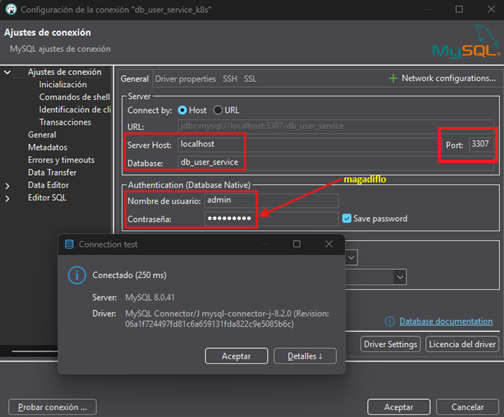
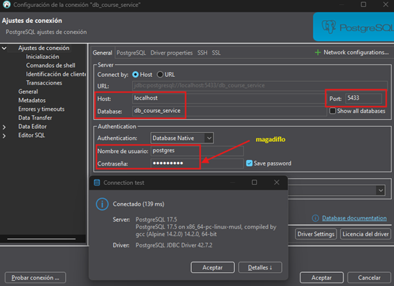
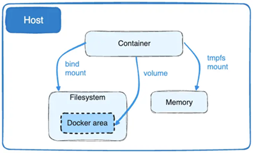

# Sección 09: Docker Networks - Comunicación entre contenedores - Volúmenes

---

## Dockerizando course-service

### En el course-service

Hasta ahora el microservicio `course-service` lo hemos estado trabajando sin dockerizar, así que en este apartado
lo dockerizaremos. El primer cambio que haremos será modificar la `url` de conexión de la base de datos. Como el
`course-service` estará dockerizada, necesitamos que apunte a la base de datos de nuestra máquina local, eso lo
logramos reemplazando el `localhost` con el dominio especial de docker `host.docker.internal`.

````yml
spring:
  application:
    name: course-service
  datasource:
    url: jdbc:postgresql://host.docker.internal:5432/db_course_service
````

> Más adelante, veremos cómo dockerizar las bases de datos de `PostgreSQL` y `MySQL` para que tengamos toda la
> aplicación 100% dockerizada.

Recordemos que nuestro `course-service` se comunica con el microservicio `user-service` usando el `RestClient`.

Como ahora trabajaremos con contenedores Docker ejecutados manualmente, necesitamos modificar la URL del microservicio
`user-service` para que la comunicación desde `course-service` funcione correctamente dentro de la red de `Docker`.

Esta modificación se realiza en el archivo `application.yml` del `course-service`:

````yml
custom:
  user-service:
    base-url: http://c-user-service:8001/api/v1/users
````

Donde:

- `c-user-service` es el nombre del contenedor que le asignaremos al microservicio `user-service` al momento de
  ejecutarlo con la opción `--name` en el comando `docker container run`.
- El puerto `8001` corresponde al puerto expuesto dentro del contenedor, es decir, el puerto en el que la aplicación
  `user-service` `está escuchando internamente`.
- Para que este nombre (`c-user-service`) sea accesible desde otros contenedores, ambos contenedores (`user-service` y
  `course-service`) deben estar conectados a la misma red personalizada de `Docker`, la cual se puede crear con el
  comando `docker network create`.

Ahora, crearemos el `Dockerfile` para el microservicio `course-service`. Notar que tiene los mismos comandos que
usamos en el `Dockerfile` del microservicio `user-service`, con la única diferencia que aquí estamos exponiendo el
puerto `8002` correspondiente al `courser-service`.

````dockerfile
FROM eclipse-temurin:21-jdk-alpine AS dependencies
WORKDIR /app
COPY ./mvnw ./
COPY ./.mvn ./.mvn
COPY ./pom.xml ./
RUN sed -i -e 's/\r$//' ./mvnw
RUN ./mvnw dependency:go-offline
COPY ./src ./src
RUN ./mvnw clean package -DskipTests

FROM eclipse-temurin:21-jre-alpine AS builder
WORKDIR /app
COPY --from=dependencies /app/target/*.jar ./app.jar
RUN java -Djarmode=layertools -jar app.jar extract

FROM eclipse-temurin:21-jre-alpine AS runner
WORKDIR /app
RUN mkdir ./logs
COPY --from=builder /app/dependencies ./
COPY --from=builder /app/spring-boot-loader ./
COPY --from=builder /app/snapshot-dependencies ./
COPY --from=builder /app/application ./
EXPOSE 8002
CMD ["java", "org.springframework.boot.loader.launch.JarLauncher"]
````

Ahora que ya tenemos lo necesario, crearemos la imagen del microservicio `course-service`.

````bash
D:\programming\spring\01.udemy\02.andres_guzman\08.docker_kubernetes\docker-kubernetes (feature/section-9)                                          
$ docker image build -t course-service .\business-domain\course-service -f .\business-domain\course-service\Dockerfile                              
[+] Building 90.0s (25/25) FINISHED                                                                                                                 
 => [internal] load build definition from Dockerfile                                                                                                
 => => transferring dockerfile: 794B                                                                                                                
 => [internal] load metadata for docker.io/library/eclipse-temurin:21-jre-alpine                                                                    
 => [internal] load metadata for docker.io/library/eclipse-temurin:21-jdk-alpine                                                                    
 => [auth] library/eclipse-temurin:pull token for registry-1.docker.io                                                                              
 => [internal] load .dockerignore                                                                                                                   
 => => transferring context: 2B                                                                                                                     
 => [dependencies 1/9] FROM docker.io/library/eclipse-temurin:21-jdk-alpine@sha256:2f2f553ce09d25e2d2f0f521ab94cd73f70c9b21327a29149c23a2b63b8e29a0 
 => => resolve docker.io/library/eclipse-temurin:21-jdk-alpine@sha256:2f2f553ce09d25e2d2f0f521ab94cd73f70c9b21327a29149c23a2b63b8e29a0              
 => [internal] load build context                                                                                                                   
 => => transferring context: 50.45kB                                                                                                                
 => [builder 1/4] FROM docker.io/library/eclipse-temurin:21-jre-alpine@sha256:8728e354e012e18310faa7f364d00185277dec741f4f6d593af6c61fc0eb15fd      
 => => resolve docker.io/library/eclipse-temurin:21-jre-alpine@sha256:8728e354e012e18310faa7f364d00185277dec741f4f6d593af6c61fc0eb15fd              
 => CACHED [dependencies 2/9] WORKDIR /app                                                                                                          
 => CACHED [dependencies 3/9] COPY ./mvnw ./                                                                                                        
 => CACHED [dependencies 4/9] COPY ./.mvn ./.mvn                                                                                                    
 => [dependencies 5/9] COPY ./pom.xml ./                                                                                                            
 => [dependencies 6/9] RUN sed -i -e 's/\r$//' ./mvnw                                                                                               
 => [dependencies 7/9] RUN ./mvnw dependency:go-offline                                                                                             
 => [dependencies 8/9] COPY ./src ./src                                                                                                             
 => [dependencies 9/9] RUN ./mvnw clean package -DskipTests                                                                                         
 => CACHED [builder 2/4] WORKDIR /app                                                                                                               
 => [builder 3/4] COPY --from=dependencies /app/target/*.jar ./app.jar                                                                              
 => [builder 4/4] RUN java -Djarmode=layertools -jar app.jar extract                                                                                
 => CACHED [runner 3/7] RUN mkdir ./logs                                                                                                            
 => [runner 4/7] COPY --from=builder /app/dependencies ./                                                                                           
 => [runner 5/7] COPY --from=builder /app/spring-boot-loader ./                                                                                     
 => [runner 6/7] COPY --from=builder /app/snapshot-dependencies ./                                                                                  
 => [runner 7/7] COPY --from=builder /app/application ./                                                                                            
 => exporting to image                                                                                                                              
 => => exporting layers                                                                                                                             
 => => exporting manifest sha256:cb3f19bc9b28486a6576dd01e8560550c9f9341971b525b0a378baa7334732e5                                                   
 => => exporting config sha256:375f85e39ad28992a73271a6170ae1ecfdb86f841e2852cdab3b9b68cdedfafe                                                     
 => => exporting attestation manifest sha256:12d1d2e11a2a087e134518c1edf016c31b736ccbe0068f33b02b592b38f4b071                                       
 => => exporting manifest list sha256:5b3c98ddaeb94291f7a9b5d7bda88420097a0c0c2aa1fb2445bb6ec3700b3dbb                                              
 => => naming to docker.io/library/course-service:latest                                                                                            
 => => unpacking to docker.io/library/course-service:latest                                                                                         
                                                                                                                                                    
View build details: docker-desktop://dashboard/build/desktop-linux/desktop-linux/s1n4dqm8li3l10wy6gm3cqc9l                                          
````

Luego listamos las imágenes y vemos que el nuestro ya se encuentra en la lista.

````bash
$ docker image ls
REPOSITORY       TAG       IMAGE ID       CREATED          SIZE
course-service   latest    5b3c98ddaeb9   58 seconds ago   405MB
````

### En el user-service

Recordemos que nuestro `user-service` se comunica con el microservicio `course-service` usando el `RestClient`.

Como ahora trabajaremos con contenedores Docker ejecutados manualmente, necesitamos modificar la URL del microservicio
`course-service` para que la comunicación desde `user-service` funcione correctamente dentro de la red de `Docker`.

Esta modificación se realiza en el archivo `application.yml` del `user-service`:

````yml
custom:
  course-service:
    base-url: http://c-course-service:8002/api/v1/courses
````

Donde:

- `c-course-service` es el nombre del contenedor que le asignaremos al microservicio `course-service` al momento de
  ejecutarlo con la opción `--name` en el comando `docker container run`.

Luego de realizar la modificación, construimos la imagen para el microservicio `user-service`.

````bash
D:\programming\spring\01.udemy\02.andres_guzman\08.docker_kubernetes\docker-kubernetes (feature/section-9)                                         
$ docker image build -t user-service .\business-domain\user-service -f .\business-domain\user-service\Dockerfile                                   
[+] Building 19.4s (25/25) FINISHED                                                                                                                
 => [internal] load build definition from Dockerfile                                                                                               
 => => transferring dockerfile: 794B                                                                                                               
 => [internal] load metadata for docker.io/library/eclipse-temurin:21-jre-alpine                                                                   
 => [internal] load metadata for docker.io/library/eclipse-temurin:21-jdk-alpine                                                                   
 => [auth] library/eclipse-temurin:pull token for registry-1.docker.io                                                                             
 => [internal] load .dockerignore                                                                                                                  
 => => transferring context: 214B                                                                                                                  
 => [builder 1/4] FROM docker.io/library/eclipse-temurin:21-jre-alpine@sha256:8728e354e012e18310faa7f364d00185277dec741f4f6d593af6c61fc0eb15fd     
 => => resolve docker.io/library/eclipse-temurin:21-jre-alpine@sha256:8728e354e012e18310faa7f364d00185277dec741f4f6d593af6c61fc0eb15fd             
 => [dependencies 1/9] FROM docker.io/library/eclipse-temurin:21-jdk-alpine@sha256:2f2f553ce09d25e2d2f0f521ab94cd73f70c9b21327a29149c23a2b63b8e29a0
 => => resolve docker.io/library/eclipse-temurin:21-jdk-alpine@sha256:2f2f553ce09d25e2d2f0f521ab94cd73f70c9b21327a29149c23a2b63b8e29a0             
 => [internal] load build context                                                                                                                  
 => => transferring context: 3.58kB                                                                                                                
 => CACHED [dependencies 2/9] WORKDIR /app                                                                                                         
 => CACHED [dependencies 3/9] COPY ./mvnw ./                                                                                                       
 => CACHED [dependencies 4/9] COPY ./.mvn ./.mvn                                                                                                   
 => CACHED [dependencies 5/9] COPY ./pom.xml ./                                                                                                    
 => CACHED [dependencies 6/9] RUN sed -i -e 's/\r$//' ./mvnw                                                                                       
 => CACHED [dependencies 7/9] RUN ./mvnw dependency:go-offline                                                                                     
 => [dependencies 8/9] COPY ./src ./src                                                                                                            
 => [dependencies 9/9] RUN ./mvnw clean package -DskipTests                                                                                        
 => CACHED [builder 2/4] WORKDIR /app                                                                                                              
 => [builder 3/4] COPY --from=dependencies /app/target/*.jar ./app.jar                                                                             
 => [builder 4/4] RUN java -Djarmode=layertools -jar app.jar extract                                                                               
 => CACHED [runner 3/7] RUN mkdir ./logs                                                                                                           
 => CACHED [runner 4/7] COPY --from=builder /app/dependencies ./                                                                                   
 => CACHED [runner 5/7] COPY --from=builder /app/spring-boot-loader ./                                                                             
 => CACHED [runner 6/7] COPY --from=builder /app/snapshot-dependencies ./                                                                          
 => [runner 7/7] COPY --from=builder /app/application ./                                                                                           
 => exporting to image                                                                                                                             
 => => exporting layers                                                                                                                            
 => => exporting manifest sha256:59200bc008340ce77f4a35b2ff6f063ef9595388c6637be889fa465cfd872b39                                                  
 => => exporting config sha256:00c9435f86d16eb95ff7c0fed865dafb43475c7c6aa999670a776f63a9572d4a                                                    
 => => exporting attestation manifest sha256:2ec9d86ea4fd37586e925abe71d9b5ebafc35df5c5ac06ab113ef668006e4443                                      
 => => exporting manifest list sha256:bb8dcd87e6b2d4ee6390a80a3978b4e78c4748b870b10ad21d237405e7258e82                                             
 => => naming to docker.io/library/user-service:latest                                                                                             
 => => unpacking to docker.io/library/user-service:latest                                                                                          
                                                                                                                                                   
View build details: docker-desktop://dashboard/build/desktop-linux/desktop-linux/w72ang74tnibnb0u2ama73sjm                                         
````

Hasta este punto, si listamos las imágenes, veremos las dos que acabamos de construir `user-service` y `course-service`.

````bash
$ docker image ls
REPOSITORY       TAG       IMAGE ID       CREATED              SIZE
user-service     latest    bb8dcd87e6b2   About a minute ago   407MB
course-service   latest    5b3c98ddaeb9   6 minutes ago        405MB
````

## Configura la red o network

Listamos las redes para ver cuáles se encuentran creadas por defecto en Docker.

````bash
$ docker network ls
NETWORK ID     NAME      DRIVER    SCOPE
a2b662e2a591   bridge    bridge    local
8c77b18a87f1   host      host      local
fe251eccddcc   none      null      local
````

Dónde

- `bridge`: Red por defecto para contenedores; permite acceso a internet y comunicación entre contenedores conectados,
  pero `no resuelve nombres de contenedores automáticamente`.
- `host`: El contenedor comparte la red del host, sin aislamiento de red; útil para aplicaciones que necesitan el mismo
  stack de red del sistema anfitrión.
- `none`: El contenedor no tiene acceso a ninguna red; se usa cuando necesitas un contenedor completamente aislado a
  nivel de red.

Ahora, para comunicar nuestros microservicios, crearemos una red personalizada llamada `docker-kubernetes-net`.

````bash
$ docker network create docker-kubernetes-net
6946c0fdc9f2f7d5b5f5a9d7a2dd8764b0768866af9565cba9c99659dd9c211d
````

Listamos nuevamente las redes. Vemos que la red `docker-kubernetes-net` está creada correctamente.

````bash
$ docker network ls
NETWORK ID     NAME                    DRIVER    SCOPE
a2b662e2a591   bridge                  bridge    local
6946c0fdc9f2   docker-kubernetes-net   bridge    local
8c77b18a87f1   host                    host      local
fe251eccddcc   none                    null      local
````

💡 Nota:
> Si no creas explícitamente una red en `Docker`, los contenedores se ejecutan en una red por defecto llamada `bridge`.
> Esta red es la configuración estándar para contenedores que no se asocian a una red personalizada. Esta red permite
> acceso a internet, pero `no permite la resolución de nombres entre contenedores`.
>
> Por lo tanto, si deseamos que nuestros contenedores se comuniquen usando sus nombres
> (como `http://c-user-service:8001`), es recomendable usar una red personalizada. En nuestro caso, la red
> personalizada que creamos es `docker-kubernetes-net`.
>
> ✅ Ambas redes son tipo `bridge`, pero se comportan distinto por diseño.
>
> - La red por defecto llamado `bridge` no habilita un sistema de resolución de nombres entre contenedores. Es una red
    "mínima" pensada para contenedores simples o pruebas rápidas. Los contenedores conectados a esta red no pueden
    resolverse por su nombre (`--name`), `solo se ven por IP`. Por eso, para que dos contenedores se comuniquen en esta
    red, tendrías que pasarles la IP del otro (lo cual es frágil y no recomendable).
>
>
> - La red `bridge personalizada` (como `docker-kubernetes-net`), es creada por nosotros mismos con el comando
    `docker network create`. Docker configura automáticamente `un DNS interno` para esta red. Este DNS
    `resuelve los nombres de los contenedores` en esa red. Los contenedores `sí pueden comunicarse usando sus nombres`
    (los que defines con `--name`), como si fuera un mini sistema de nombres interno.

## Comunicación entre contenedores

Creamos los contenedores de nuestros dos microservicios. Observar que estamos agregando la red creada anteriormente
`docker-kubernetes-net`. Además, cada contenedor tiene como `--name` el `c-user-service` y `c-course-service`.
Estos nombres los estamos usando dentro de las configuraciones de nuestros microservicios para que puedan comunicarse
entre sí.

Creamos el contenedor para el `user-service`.

````bash
$ docker container run -d -p 8001:8001 --rm --name c-user-service --network docker-kubernetes-net user-service
f0c5b9399714c7b56cc49326651165ab02b5f8f8d5b1345c18f17d4b07774c37
````

Creamos el contenedor para el `course-serivce`.

````bash
$ docker container run -d -p 8002:8002 --rm --name c-course-service --network docker-kubernetes-net course-service
f7fa93ac69de8d20e6c05a1a4363c36e782136759dbcf0d8b40df59b8c117a7d
````

Podemos inspeccionar la red `docker-kubernetes-net` para ver que los dos contenedores creados anteriormente ya están
asociados a él.

````bash
$ docker network inspect docker-kubernetes-net
[
    {
        "Name": "docker-kubernetes-net",
        "Id": "6946c0fdc9f2f7d5b5f5a9d7a2dd8764b0768866af9565cba9c99659dd9c211d",
        "Created": "2025-05-28T05:07:20.686757576Z",
        "Scope": "local",
        "Driver": "bridge",
        "EnableIPv4": true,
        "EnableIPv6": false,
        "IPAM": {
            "Driver": "default",
            "Options": {},
            "Config": [
                {
                    "Subnet": "172.18.0.0/16",
                    "Gateway": "172.18.0.1"
                }
            ]
        },
        "Internal": false,
        "Attachable": false,
        "Ingress": false,
        "ConfigFrom": {
            "Network": ""
        },
        "ConfigOnly": false,
        "Containers": {
            "f0c5b9399714c7b56cc49326651165ab02b5f8f8d5b1345c18f17d4b07774c37": {
                "Name": "c-user-service",
                "EndpointID": "638c6704eb9e2979cbf6a93731c1e9375479fb993fb868d5a5920f7e82a7fe0b",
                "MacAddress": "76:1c:8c:f6:4b:ea",
                "IPv4Address": "172.18.0.2/16",
                "IPv6Address": ""
            },
            "f7fa93ac69de8d20e6c05a1a4363c36e782136759dbcf0d8b40df59b8c117a7d": {
                "Name": "c-course-service",
                "EndpointID": "7948cc25a598080182884149b2d05819392419f993d1fdde72b1e72985484d8a",
                "MacAddress": "26:4d:76:be:52:fd",
                "IPv4Address": "172.18.0.3/16",
                "IPv6Address": ""
            }
        },
        "Options": {
            "com.docker.network.enable_ipv4": "true",
            "com.docker.network.enable_ipv6": "false"
        },
        "Labels": {}
    }
]
````

Después de crear los contenedores, los podemos listar para ver que están levantados correctamente con status `Up`.

````bash
$ docker container ls -a
CONTAINER ID   IMAGE            COMMAND                  CREATED              STATUS              PORTS                    NAMES
f7fa93ac69de   course-service   "/__cacert_entrypoin…"   About a minute ago   Up About a minute   0.0.0.0:8002->8002/tcp   c-course-service
f0c5b9399714   user-service     "/__cacert_entrypoin…"   2 minutes ago        Up 2 minutes        0.0.0.0:8001->8001/tcp   c-user-service
````

Probamos la comunicación entre nuestros dos contenedores simplemente haciendo una petión http hacia el microservicio
de cursos. Este endpoint traerá la información de un curso y los usuarios asociados a dicho curso.

````bash
$ curl -v -G --data "loadRelations=true" http://localhost:8002/api/v1/courses/1 | jq
>
< HTTP/1.1 200
< Content-Type: application/json
< Transfer-Encoding: chunked
< Date: Thu, 29 May 2025 04:24:31 GMT
<
{
  "id": 1,
  "name": "Spring Boot",
  "users": [
    {
      "id": 6,
      "name": "Lesly",
      "email": "lesly@gmail.com",
      "password": "123456"
    }
  ]
}
````

## Dockerizando MySQL

Hasta este punto el `c-user-service` está apuntando hacía `MySQL` que está instalado en mi máquina local. Pero ahora,
vamos a contenerizar `MySQL` para tenerlo dentro de nuestra plataforma de `Docker`. Para eso, necesitamos bajar la
imagen de `MySQL`, así que en nuestra terminal ejecutamos el siguiente comando.

````bash
$ docker pull mysql:8.0.41-debian
````

Donde, `mysql` es el nombre de la imagen y `8.0.41-debian` es el tag o la versión de la imagen.

Si listamos las imágenes, veremos que entre ellas está la imagen bajada de `MySQL`. Por defecto la imagen se baja
desde la plataforma de [Docker Hub.](https://hub.docker.com/)

````bash 
$ docker image ls
REPOSITORY       TAG             IMAGE ID       CREATED        SIZE
user-service     latest          bb8dcd87e6b2   24 hours ago   407MB
course-service   latest          5b3c98ddaeb9   24 hours ago   405MB
mysql            8.0.41-debian   b2252987e0ec   4 months ago   812MB
````

Como ya tenemos la imagen de `MySQL` en nuestra plataforma de `Docker` procedemos a crearle un contenedor.

````bash
$ docker container run -d -p 3307:3306 --name c-mysql -e MYSQL_DATABASE=db_user_service -e MYSQL_ROOT_PASSWORD=magadiflo -e MYSQL_USER=admin -e MYSQL_PASSWORD=magadiflo --network docker-kubernetes-net mysql:8.0.41-debian
566e80c6cdcc26af044e191379190083e38c133ce12f83d7e225d7437a665e93
````

**Donde**

- `-p 3307:3306`, el puerto externo estamos colocando en `3307`, ya que actualmente tenemos `MySQL` instalada en nuestra
  pc local y está corriendo en el puerto `3306`. El puerto interno lo dejamos tal cual `3306`, ya que eso trabaja al
  interno del contenedor, mientras que el externo hace referencia a nuestra máquina local.
- `--name c-mysql`, le damos un nombre al contenedor.
- `--network docker-kubernetes-net`, se conecta el contenedor a la red `Docker` personalizada `docker-kubernetes-net`.
- `-e (--env)`, nos permite establecer variables de entorno. Cada variable de entorno a definir, debe estar precedido
  por la bandera `-e` o `--env`.

**Importante**

- Usuario y contraseña personalizados
    - La imagen oficial de `MySQL` permite crear un usuario adicional (en este caso `admin`) mediante las variables
      `MYSQL_USER` y `MYSQL_PASSWORD`.
    - Este usuario tiene acceso a la base de datos indicada en `MYSQL_DATABASE` (`db_user_service`).
    - La configuración de `MYSQL_ROOT_PASSWORD` es obligatoria aunque usemos un usuario personalizado, porque la imagen
      necesita definir siempre la contraseña del usuario `root` al iniciarse.
- Si no se especifica un volumen, los datos almacenados en la base de datos se perderán al eliminar el contenedor, ya
  que `MySQL` guarda sus datos en el sistema de archivos interno del contenedor, el cual se destruye al eliminarlo.

Listamos los contenedores.

````bash
$ docker container ls -a
CONTAINER ID   IMAGE                 COMMAND                  CREATED          STATUS          PORTS                               NAMES
566e80c6cdcc   mysql:8.0.41-debian   "docker-entrypoint.s…"   6 minutes ago    Up 6 minutes    33060/tcp, 0.0.0.0:3307->3306/tcp   c-mysql
f7fa93ac69de   course-service        "/__cacert_entrypoin…"   25 minutes ago   Up 25 minutes   0.0.0.0:8002->8002/tcp              c-course-service
f0c5b9399714   user-service          "/__cacert_entrypoin…"   26 minutes ago   Up 26 minutes   0.0.0.0:8001->8001/tcp              c-user-service
````

Verificamos si podemos conectarnos desde `DBeaver` hacia nuestro `MySql` contenerizado que se está ejecutando en
el puerto externo `3307`. El resultado debe ser una conexión exitosa.



**Importante**
> Si nos sale el siguiente error cuando nos conectamos con `DBeaver` al contenedor de `MySQL`:
>
> `MySQL : Public Key Retrieval is not allowed` lo que debemos hacer es una configuración en el `DBeaver`.
> Vamos a `Ajustes de conexión/Driver properties/allowPublicKeyRetrieval = true`.
>
> [StackOverflow](https://stackoverflow.com/questions/50379839/connection-java-mysql-public-key-retrieval-is-not-allowed)

## Dockerizando PostgreSQL

Al igual que hicimos con `MySQL`, en este apartado nos toca dockerizar `PostgreSQL`.

Cuando contenerizamos la base de datos de `MySQL`, lo primero que hicimos fue descargar la imagen con el
comando `docker pull`, pero en esta ocasión, con `PostgreSQL` crearemos directamente el contenedor. `Docker` al ver que
no lo tenemos descargado, nos mostrará el mensaje `Unable to find image 'postgres:17-alpine' locally` y lo empezará
a descargar por nosotros. Posteriormente, creará nuestro contenedor.

````bash
$ docker container run -d -p 5433:5432 --name c-postgres -e POSTGRES_DB=db_course_service -e POSTGRES_USER=postgres -e POSTGRES_PASSWORD=magadiflo --network docker-kubernetes-net postgres:17-alpine
Unable to find image 'postgres:17-alpine' locally
17-alpine: Pulling from library/postgres
24be9e72e249: Pull complete
7f9d770706d0: Pull complete
baaf78190562: Pull complete
65108980cce7: Pull complete
ec9e131e4f9b: Pull complete
2b8a38291491: Pull complete
0b06af809646: Pull complete
3dac3732ccfc: Pull complete
49e1487501ce: Pull complete
Digest: sha256:f325a29ec9deb7039c5f07761d77d79d537dac836ecd99f982f6ca5476724604
Status: Downloaded newer image for postgres:17-alpine
38f2885e65b1946056e52e10afd8be90d725d8f249d0e61b405bdbc2b501d52e
````

**Donde**

- `-p 5433:5432`.
    - `5433`, puerto expuesto en el host (`pc local`).
    - `5432`, puerto interno del contenedor (puerto por defecto de `PostgreSQL`).
- `--name c-postgres`, le damos un nombre al contenedor.
- `--network docker-kubernetes-net`, lo agregamos a la red donde están los otros dos microservicios.
- `-e (--env)`, nos permite establecer variables de entorno. Cada variable de entorno a definir, debe estar precedido
  por la bandera `-e` o `--env`.

Listando los contenedores.

````bash
$ docker container ls -a
CONTAINER ID   IMAGE                 COMMAND                  CREATED          STATUS          PORTS                               NAMES
38f2885e65b1   postgres:17-alpine    "docker-entrypoint.s…"   6 minutes ago    Up 6 minutes    0.0.0.0:5433->5432/tcp              c-postgres
566e80c6cdcc   mysql:8.0.41-debian   "docker-entrypoint.s…"   29 minutes ago   Up 29 minutes   33060/tcp, 0.0.0.0:3307->3306/tcp   c-mysql
f7fa93ac69de   course-service        "/__cacert_entrypoin…"   49 minutes ago   Up 49 minutes   0.0.0.0:8002->8002/tcp              c-course-service
f0c5b9399714   user-service          "/__cacert_entrypoin…"   50 minutes ago   Up 50 minutes   0.0.0.0:8001->8001/tcp              c-user-service
````

Aquí también verificamos que podemos conectarnos desde `DBeaver` hacia nuestro `PostgreSQL` contenerizado quien ahora
mismo se está ejecutando en el puerto externo `5433`. El resultado debe ser una conexión exitosa.



## Comunicación entre contenedores con bases de datos dockerizadas (MySQL y PostgreSQL)

En este apartado veremos cómo podemos configurar las aplicaciones a fin de que trabajemos netamente con contenedores.

### En el course-service

Modificamos el `application.yml` del microservicio `course-service` para poder comunicarnos con la base de datos
conteneirzada de `PostgreSQL`. En los datos de conexión debemos colocar los mismos datos con los que construimos
el contenedor de postgres.

````yml
spring:
  application:
    name: course-service
  datasource:
    url: jdbc:postgresql://c-postgres:5432/db_course_service
    username: postgres
    password: magadiflo
````

Anteriormente, estábamos trabajando con el dns de docker `host.docker.internal` para que nuestra aplicación
contenerizada de `course-service` se pueda comunicar con `postgres` de nuestra máquina local. Sin embargo, ahora nuestra
base de datos de `postgres` está contenerizada, por lo que debemos cambiar el valor del dns de docker por el nombre del
contenedor de nuestra base de datos de postgres `c-postgres`. De esta manera, cuando creemos el contenedor
`course-service` podrá comunicarse con el contenedor de la base de datos de `postgreSQL`, siempre y cuando, ambos
contenedores estén en la misma red. En nuestro caso, haremos que todos los contenedores estén en la red
`docker-kubernetes-net`.

Luego de haber realizado las modificaciones al código fuente, volvemos a generar la imagen para el `course-service`.

````bash
D:\programming\spring\01.udemy\02.andres_guzman\08.docker_kubernetes\docker-kubernetes (feature/section-9)                                         
$ docker image build -t course-service .\business-domain\course-service -f .\business-domain\course-service\Dockerfile                             
[+] Building 17.1s (25/25) FINISHED                                                                                                                
 => [internal] load build definition from Dockerfile                                                                                               
 => => transferring dockerfile: 794B                                                                                                               
 => [internal] load metadata for docker.io/library/eclipse-temurin:21-jre-alpine                                                                   
 => [internal] load metadata for docker.io/library/eclipse-temurin:21-jdk-alpine                                                                   
 => [auth] library/eclipse-temurin:pull token for registry-1.docker.io                                                                             
 => [internal] load .dockerignore                                                                                                                  
 => => transferring context: 2B                                                                                                                    
 => [dependencies 1/9] FROM docker.io/library/eclipse-temurin:21-jdk-alpine@sha256:2f2f553ce09d25e2d2f0f521ab94cd73f70c9b21327a29149c23a2b63b8e29a0
 => => resolve docker.io/library/eclipse-temurin:21-jdk-alpine@sha256:2f2f553ce09d25e2d2f0f521ab94cd73f70c9b21327a29149c23a2b63b8e29a0             
 => [internal] load build context                                                                                                                  
 => => transferring context: 4.30kB                                                                                                                
 => [builder 1/4] FROM docker.io/library/eclipse-temurin:21-jre-alpine@sha256:8728e354e012e18310faa7f364d00185277dec741f4f6d593af6c61fc0eb15fd     
 => => resolve docker.io/library/eclipse-temurin:21-jre-alpine@sha256:8728e354e012e18310faa7f364d00185277dec741f4f6d593af6c61fc0eb15fd             
 => CACHED [dependencies 2/9] WORKDIR /app                                                                                                         
 => CACHED [dependencies 3/9] COPY ./mvnw ./                                                                                                       
 => CACHED [dependencies 4/9] COPY ./.mvn ./.mvn                                                                                                   
 => CACHED [dependencies 5/9] COPY ./pom.xml ./                                                                                                    
 => CACHED [dependencies 6/9] RUN sed -i -e 's/\r$//' ./mvnw                                                                                       
 => CACHED [dependencies 7/9] RUN ./mvnw dependency:go-offline                                                                                     
 => [dependencies 8/9] COPY ./src ./src                                                                                                            
 => [dependencies 9/9] RUN ./mvnw clean package -DskipTests                                                                                        
 => CACHED [builder 2/4] WORKDIR /app                                                                                                              
 => [builder 3/4] COPY --from=dependencies /app/target/*.jar ./app.jar                                                                             
 => [builder 4/4] RUN java -Djarmode=layertools -jar app.jar extract                                                                               
 => CACHED [runner 3/7] RUN mkdir ./logs                                                                                                           
 => CACHED [runner 4/7] COPY --from=builder /app/dependencies ./                                                                                   
 => CACHED [runner 5/7] COPY --from=builder /app/spring-boot-loader ./                                                                             
 => CACHED [runner 6/7] COPY --from=builder /app/snapshot-dependencies ./                                                                          
 => [runner 7/7] COPY --from=builder /app/application ./                                                                                           
 => exporting to image                                                                                                                             
 => => exporting layers                                                                                                                            
 => => exporting manifest sha256:9bde6884b5170f8ed2098fe3b83e3574d4a3816a85509276574a79bc07f280cd                                                  
 => => exporting config sha256:576132c18d72f18b08c3a7035e97fe424f0d8caede14542dc74bd79586833dea                                                    
 => => exporting attestation manifest sha256:977bc3597384de87f7eab8dd7733f22ba8ab18b6a586663238a406ae08e2f3d8                                      
 => => exporting manifest list sha256:1f01cf470e01342470a228d02cd68c2fb010634babc1192ae82269477791d1b7                                             
 => => naming to docker.io/library/course-service:latest                                                                                           
 => => unpacking to docker.io/library/course-service:latest                                                                                        
                                                                                                                                                   
View build details: docker-desktop://dashboard/build/desktop-linux/desktop-linux/p6n98c0x5cscx10r3w0bt08fu                                                      
````

Ahora, a partir de la imagen anterior creamos el contenedor para nuestro microservicio.

````bash
$ docker container run -d -p 8002:8002 --rm --name c-course-service --network docker-kubernetes-net course-service
a6c9bc0908d5bc855c5381ff057a78f8dd7ac156395066f5a743a9b877c0c3bf
````

Inspeccionamos la red `docker-kubernetes-net` para ver que tenemos 3 contenedores asociados a dicha red hasta este
momento.

````bash
$ docker network inspect docker-kubernetes-net
[
    {
        "Name": "docker-kubernetes-net",
        "Id": "6946c0fdc9f2f7d5b5f5a9d7a2dd8764b0768866af9565cba9c99659dd9c211d",
        "Created": "2025-05-28T05:07:20.686757576Z",
        "Scope": "local",
        "Driver": "bridge",
        "EnableIPv4": true,
        "EnableIPv6": false,
        "IPAM": {
            "Driver": "default",
            "Options": {},
            "Config": [
                {
                    "Subnet": "172.18.0.0/16",
                    "Gateway": "172.18.0.1"
                }
            ]
        },
        "Internal": false,
        "Attachable": false,
        "Ingress": false,
        "ConfigFrom": {
            "Network": ""
        },
        "ConfigOnly": false,
        "Containers": {
            "38f2885e65b1946056e52e10afd8be90d725d8f249d0e61b405bdbc2b501d52e": {
                "Name": "c-postgres",
                "EndpointID": "4967ef5e205489fe83c45900fe37c1b1c178831ee73f45d119a7267e1ddeb321",
                "MacAddress": "ee:44:22:63:f3:82",
                "IPv4Address": "172.18.0.2/16",
                "IPv6Address": ""
            },
            "566e80c6cdcc26af044e191379190083e38c133ce12f83d7e225d7437a665e93": {
                "Name": "c-mysql",
                "EndpointID": "6af41f41a196f7f49062522ef696935875413850ab70db2636f89004aee8b478",
                "MacAddress": "2a:ec:5b:4b:6a:8e",
                "IPv4Address": "172.18.0.3/16",
                "IPv6Address": ""
            },
            "a6c9bc0908d5bc855c5381ff057a78f8dd7ac156395066f5a743a9b877c0c3bf": {
                "Name": "c-course-service",
                "EndpointID": "a057ad78bffd67fd8369d1c75b57d83af3560ab62f482606f68aade18e551034",
                "MacAddress": "c6:e3:b6:fa:40:e8",
                "IPv4Address": "172.18.0.4/16",
                "IPv6Address": ""
            }
        },
        "Options": {
            "com.docker.network.enable_ipv4": "true",
            "com.docker.network.enable_ipv6": "false"
        },
        "Labels": {}
    }
]
````

Para comprobar que nuestro contenedor `c-course-service` se ha comunicado correctamente con `c-postgres` vamos a darle
un vistazo al log.

````bash
$ docker container logs c-course-service

  .   ____          _            __ _ _
 /\\ / ___'_ __ _ _(_)_ __  __ _ \ \ \ \
( ( )\___ | '_ | '_| | '_ \/ _` | \ \ \ \
 \\/  ___)| |_)| | | | | || (_| |  ) ) ) )
  '  |____| .__|_| |_|_| |_\__, | / / / /
 =========|_|==============|___/=/_/_/_/

 :: Spring Boot ::                (v3.4.5)

2025-06-01T00:13:45.771Z  INFO 1 --- [course-service] [           main] d.m.course.app.CourseServiceApplication  : Starting CourseServiceApplication v0.0.1-SNAPSHOT using Java 21.0.7 with PID 1 (/app/BOOT-INF/classes started by root in /app)
2025-06-01T00:13:45.773Z DEBUG 1 --- [course-service] [           main] d.m.course.app.CourseServiceApplication  : Running with Spring Boot v3.4.5, Spring v6.2.6
2025-06-01T00:13:45.775Z  INFO 1 --- [course-service] [           main] d.m.course.app.CourseServiceApplication  : No active profile set, falling back to 1 default profile: "default"
2025-06-01T00:13:47.190Z  INFO 1 --- [course-service] [           main] .s.d.r.c.RepositoryConfigurationDelegate : Bootstrapping Spring Data JPA repositories in DEFAULT mode.
2025-06-01T00:13:47.267Z  INFO 1 --- [course-service] [           main] .s.d.r.c.RepositoryConfigurationDelegate : Finished Spring Data repository scanning in 63 ms. Found 2 JPA repository interfaces.
2025-06-01T00:13:47.479Z  INFO 1 --- [course-service] [           main] o.s.cloud.context.scope.GenericScope     : BeanFactory id=10465005-5ebd-34d4-a163-230a4ad794f5
2025-06-01T00:13:48.364Z  INFO 1 --- [course-service] [           main] o.s.b.w.embedded.tomcat.TomcatWebServer  : Tomcat initialized with port 8002 (http)
2025-06-01T00:13:48.386Z  INFO 1 --- [course-service] [           main] o.apache.catalina.core.StandardService   : Starting service [Tomcat]
2025-06-01T00:13:48.387Z  INFO 1 --- [course-service] [           main] o.apache.catalina.core.StandardEngine    : Starting Servlet engine: [Apache Tomcat/10.1.40]
2025-06-01T00:13:48.440Z  INFO 1 --- [course-service] [           main] o.a.c.c.C.[Tomcat].[localhost].[/]       : Initializing Spring embedded WebApplicationContext
2025-06-01T00:13:48.441Z  INFO 1 --- [course-service] [           main] w.s.c.ServletWebServerApplicationContext : Root WebApplicationContext: initialization completed in 2592 ms
2025-06-01T00:13:48.901Z  INFO 1 --- [course-service] [           main] o.hibernate.jpa.internal.util.LogHelper  : HHH000204: Processing PersistenceUnitInfo [name: default]
2025-06-01T00:13:49.000Z  INFO 1 --- [course-service] [           main] org.hibernate.Version                    : HHH000412: Hibernate ORM core version 6.6.13.Final
2025-06-01T00:13:49.080Z  INFO 1 --- [course-service] [           main] o.h.c.internal.RegionFactoryInitiator    : HHH000026: Second-level cache disabled
2025-06-01T00:13:49.577Z  INFO 1 --- [course-service] [           main] o.s.o.j.p.SpringPersistenceUnitInfo      : No LoadTimeWeaver setup: ignoring JPA class transformer
2025-06-01T00:13:49.620Z  INFO 1 --- [course-service] [           main] com.zaxxer.hikari.HikariDataSource       : HikariPool-1 - Starting...
2025-06-01T00:13:49.901Z  INFO 1 --- [course-service] [           main] com.zaxxer.hikari.pool.HikariPool        : HikariPool-1 - Added connection org.postgresql.jdbc.PgConnection@6bf54260
2025-06-01T00:13:49.902Z  INFO 1 --- [course-service] [           main] com.zaxxer.hikari.HikariDataSource       : HikariPool-1 - Start completed.
2025-06-01T00:13:50.005Z  INFO 1 --- [course-service] [           main] org.hibernate.orm.connections.pooling    : HHH10001005: Database info:
        Database JDBC URL [Connecting through datasource 'HikariDataSource (HikariPool-1)']
        Database driver: undefined/unknown
        Database version: 17.5
        Autocommit mode: undefined/unknown
        Isolation level: undefined/unknown
        Minimum pool size: undefined/unknown
        Maximum pool size: undefined/unknown
2025-06-01T00:13:51.177Z  INFO 1 --- [course-service] [           main] o.h.e.t.j.p.i.JtaPlatformInitiator       : HHH000489: No JTA platform available (set 'hibernate.transaction.jta.platform' to enable JTA platform integration)
2025-06-01T00:13:51.264Z DEBUG 1 --- [course-service] [           main] org.hibernate.SQL                        :
    create table course_users (
        id bigint generated by default as identity,
        user_id bigint,
        course_id bigint,
        primary key (id)
    )
2025-06-01T00:13:51.288Z DEBUG 1 --- [course-service] [           main] org.hibernate.SQL                        :
    create table courses (
        id bigint generated by default as identity,
        name varchar(255) not null,
        primary key (id)
    )
2025-06-01T00:13:51.293Z DEBUG 1 --- [course-service] [           main] org.hibernate.SQL                        :
    alter table if exists course_users
       drop constraint if exists UKkdhhgtn4xoxgggdkh5fooi5i7
2025-06-01T00:13:51.296Z  WARN 1 --- [course-service] [           main] o.h.engine.jdbc.spi.SqlExceptionHelper   : SQL Warning Code: 0, SQLState: 00000
2025-06-01T00:13:51.297Z  WARN 1 --- [course-service] [           main] o.h.engine.jdbc.spi.SqlExceptionHelper   : constraint "ukkdhhgtn4xoxgggdkh5fooi5i7" of relation "course_users" does not exist, skipping
2025-06-01T00:13:51.297Z DEBUG 1 --- [course-service] [           main] org.hibernate.SQL                        :
    alter table if exists course_users
       add constraint UKkdhhgtn4xoxgggdkh5fooi5i7 unique (user_id)
2025-06-01T00:13:51.301Z DEBUG 1 --- [course-service] [           main] org.hibernate.SQL                        :
    alter table if exists courses
       drop constraint if exists UK5o6x4fpafbywj4v2g0owhh11r
2025-06-01T00:13:51.303Z  WARN 1 --- [course-service] [           main] o.h.engine.jdbc.spi.SqlExceptionHelper   : SQL Warning Code: 0, SQLState: 00000
2025-06-01T00:13:51.303Z  WARN 1 --- [course-service] [           main] o.h.engine.jdbc.spi.SqlExceptionHelper   : constraint "uk5o6x4fpafbywj4v2g0owhh11r" of relation "courses" does not exist, skipping
2025-06-01T00:13:51.304Z DEBUG 1 --- [course-service] [           main] org.hibernate.SQL                        :
    alter table if exists courses
       add constraint UK5o6x4fpafbywj4v2g0owhh11r unique (name)
2025-06-01T00:13:51.306Z DEBUG 1 --- [course-service] [           main] org.hibernate.SQL                        :
    alter table if exists course_users
       add constraint FKcax8xujvganv6xl9ra0sgouem
       foreign key (course_id)
       references courses
2025-06-01T00:13:51.315Z  INFO 1 --- [course-service] [           main] j.LocalContainerEntityManagerFactoryBean : Initialized JPA EntityManagerFactory for persistence unit 'default'
2025-06-01T00:13:52.441Z  WARN 1 --- [course-service] [           main] JpaBaseConfiguration$JpaWebConfiguration : spring.jpa.open-in-view is enabled by default. Therefore, database queries may be performed during view rendering. Explicitly configure spring.jpa.open-in-view to disable this warning
2025-06-01T00:13:51.740Z  INFO 1 --- [course-service] [           main] o.s.b.a.e.web.EndpointLinksResolver      : Exposing 1 endpoint beneath base path '/actuator'
2025-06-01T00:13:51.844Z  INFO 1 --- [course-service] [           main] o.s.b.w.embedded.tomcat.TomcatWebServer  : Tomcat started on port 8002 (http) with context path '/'
2025-06-01T00:13:51.864Z  INFO 1 --- [course-service] [           main] d.m.course.app.CourseServiceApplication  : Started CourseServiceApplication in 6.718 seconds (process running for 9.313)
````

Como vemos en el resultado anterior, se ha creado las tablas en la base de datos contenerizada de `postgres`. Pero si
queremos estar más seguros aún, podemos ingresar al contenedor de la base de datos `c-postgres` y ver que efectivamente
estén las tablas creadas.

````bash
$ docker container exec -it c-postgres /bin/sh
/ # psql -U postgres -d db_course_service
psql (17.5)
Type "help" for help.

db_course_service=# \d
                 List of relations
 Schema |        Name         |   Type   |  Owner
--------+---------------------+----------+----------
 public | course_users        | table    | postgres
 public | course_users_id_seq | sequence | postgres
 public | courses             | table    | postgres
 public | courses_id_seq      | sequence | postgres
(4 rows)

db_course_service=#
````

### En el user-service

Aquí también realizamos las modificaciones en el `application.yml`. Colocamos los mismos parámetros que usamos al
construir el contenedor de `c-mysql` y por supuesto, cambiamos el `host.docker.internal` por el nombre del contenedor
de la base de datos `c-mysql`.

````yml
spring:
  application:
    name: user-service
  datasource:
    url: jdbc:mysql://c-mysql:3306/db_user_service
    username: admin
    password: magadiflo
````

Habiendo realizado las modificaciones al código fuente del `user-service`, volvemos a crear la imagen.

````bash
D:\programming\spring\01.udemy\02.andres_guzman\08.docker_kubernetes\docker-kubernetes (feature/section-9)                                         
$ docker image build -t user-service .\business-domain\user-service -f .\business-domain\user-service\Dockerfile                                   
[+] Building 18.4s (25/25) FINISHED                                                                                                                
 => [internal] load build definition from Dockerfile                                                                                               
 => => transferring dockerfile: 794B                                                                                                               
 => [internal] load metadata for docker.io/library/eclipse-temurin:21-jre-alpine                                                                   
 => [internal] load metadata for docker.io/library/eclipse-temurin:21-jdk-alpine                                                                   
 => [auth] library/eclipse-temurin:pull token for registry-1.docker.io                                                                             
 => [internal] load .dockerignore                                                                                                                  
 => => transferring context: 214B                                                                                                                  
 => [dependencies 1/9] FROM docker.io/library/eclipse-temurin:21-jdk-alpine@sha256:2f2f553ce09d25e2d2f0f521ab94cd73f70c9b21327a29149c23a2b63b8e29a0
 => => resolve docker.io/library/eclipse-temurin:21-jdk-alpine@sha256:2f2f553ce09d25e2d2f0f521ab94cd73f70c9b21327a29149c23a2b63b8e29a0             
 => [internal] load build context                                                                                                                  
 => => transferring context: 3.57kB                                                                                                                
 => [builder 1/4] FROM docker.io/library/eclipse-temurin:21-jre-alpine@sha256:8728e354e012e18310faa7f364d00185277dec741f4f6d593af6c61fc0eb15fd     
 => => resolve docker.io/library/eclipse-temurin:21-jre-alpine@sha256:8728e354e012e18310faa7f364d00185277dec741f4f6d593af6c61fc0eb15fd             
 => CACHED [dependencies 2/9] WORKDIR /app                                                                                                         
 => CACHED [dependencies 3/9] COPY ./mvnw ./                                                                                                       
 => CACHED [dependencies 4/9] COPY ./.mvn ./.mvn                                                                                                   
 => CACHED [dependencies 5/9] COPY ./pom.xml ./                                                                                                    
 => CACHED [dependencies 6/9] RUN sed -i -e 's/\r$//' ./mvnw                                                                                       
 => CACHED [dependencies 7/9] RUN ./mvnw dependency:go-offline                                                                                     
 => [dependencies 8/9] COPY ./src ./src                                                                                                            
 => [dependencies 9/9] RUN ./mvnw clean package -DskipTests                                                                                        
 => CACHED [builder 2/4] WORKDIR /app                                                                                                              
 => [builder 3/4] COPY --from=dependencies /app/target/*.jar ./app.jar                                                                             
 => [builder 4/4] RUN java -Djarmode=layertools -jar app.jar extract                                                                               
 => CACHED [runner 3/7] RUN mkdir ./logs                                                                                                           
 => CACHED [runner 4/7] COPY --from=builder /app/dependencies ./                                                                                   
 => CACHED [runner 5/7] COPY --from=builder /app/spring-boot-loader ./                                                                             
 => CACHED [runner 6/7] COPY --from=builder /app/snapshot-dependencies ./                                                                          
 => [runner 7/7] COPY --from=builder /app/application ./                                                                                           
 => exporting to image                                                                                                                             
 => => exporting layers                                                                                                                            
 => => exporting manifest sha256:497c128a948d2580cb25f260174f646d6926a0734672d893bd0c1aa2a42e83ca                                                  
 => => exporting config sha256:312a81e9c02c89760010ce9c3afa6fc268d0baf4eef0e5eaf0cea1ea2f09037b                                                    
 => => exporting attestation manifest sha256:e0141815a532e852b83e6645f5615beba46dc1fd953ef2680041e95da52f36a4                                      
 => => exporting manifest list sha256:7eb198b0fc540936b5a2514b241fde4d4161f4f66d57d1e8e9ea117335ee6a43                                             
 => => naming to docker.io/library/user-service:latest                                                                                             
 => => unpacking to docker.io/library/user-service:latest                                                                                          
                                                                                                                                                   
View build details: docker-desktop://dashboard/build/desktop-linux/desktop-linux/qw9zgoodmqurfj79xr5p7x00s                                                                                                                                                   
````

A partir de la imagen anterior, creamos el contenedor enlazado a la red `docker-kubernetes-net`.

````bash
$ docker container run -d -p 8001:8001 --rm --name c-user-service --network docker-kubernetes-net user-service
bb9318652e57d31663369f76b2c3078f5042fa6f9ac453926765df08058ffa51
````

Hasta este punto, si inspeccionamos la red `docker-kubernetes-net` debemos observar que hay 4 contenedores asociados.

````bash
$ docker network inspect docker-kubernetes-net
[
    {
        "Name": "docker-kubernetes-net",
        "Id": "6946c0fdc9f2f7d5b5f5a9d7a2dd8764b0768866af9565cba9c99659dd9c211d",
        "Created": "2025-05-28T05:07:20.686757576Z",
        "Scope": "local",
        "Driver": "bridge",
        "EnableIPv4": true,
        "EnableIPv6": false,
        "IPAM": {
            "Driver": "default",
            "Options": {},
            "Config": [
                {
                    "Subnet": "172.18.0.0/16",
                    "Gateway": "172.18.0.1"
                }
            ]
        },
        "Internal": false,
        "Attachable": false,
        "Ingress": false,
        "ConfigFrom": {
            "Network": ""
        },
        "ConfigOnly": false,
        "Containers": {
            "38f2885e65b1946056e52e10afd8be90d725d8f249d0e61b405bdbc2b501d52e": {
                "Name": "c-postgres",
                "EndpointID": "4967ef5e205489fe83c45900fe37c1b1c178831ee73f45d119a7267e1ddeb321",
                "MacAddress": "ee:44:22:63:f3:82",
                "IPv4Address": "172.18.0.2/16",
                "IPv6Address": ""
            },
            "566e80c6cdcc26af044e191379190083e38c133ce12f83d7e225d7437a665e93": {
                "Name": "c-mysql",
                "EndpointID": "6af41f41a196f7f49062522ef696935875413850ab70db2636f89004aee8b478",
                "MacAddress": "2a:ec:5b:4b:6a:8e",
                "IPv4Address": "172.18.0.3/16",
                "IPv6Address": ""
            },
            "a6c9bc0908d5bc855c5381ff057a78f8dd7ac156395066f5a743a9b877c0c3bf": {
                "Name": "c-course-service",
                "EndpointID": "a057ad78bffd67fd8369d1c75b57d83af3560ab62f482606f68aade18e551034",
                "MacAddress": "c6:e3:b6:fa:40:e8",
                "IPv4Address": "172.18.0.4/16",
                "IPv6Address": ""
            },
            "bb9318652e57d31663369f76b2c3078f5042fa6f9ac453926765df08058ffa51": {
                "Name": "c-user-service",
                "EndpointID": "d385ad4efc8a783561c5be5fa61ee82d248f36e0e230c4f9d5e54ca865de0eb9",
                "MacAddress": "fe:11:65:d0:fb:8f",
                "IPv4Address": "172.18.0.5/16",
                "IPv6Address": ""
            }
        },
        "Options": {
            "com.docker.network.enable_ipv4": "true",
            "com.docker.network.enable_ipv6": "false"
        },
        "Labels": {}
    }
]
````

Para comprobar que nuestro contenedor `c-user-service` se ha comunicado correctamente con `c-mysql` vamos a darle
un vistazo al log.

````bash
$ docker container logs c-user-service

  .   ____          _            __ _ _
 /\\ / ___'_ __ _ _(_)_ __  __ _ \ \ \ \
( ( )\___ | '_ | '_| | '_ \/ _` | \ \ \ \
 \\/  ___)| |_)| | | | | || (_| |  ) ) ) )
  '  |____| .__|_| |_|_| |_\__, | / / / /
 =========|_|==============|___/=/_/_/_/

 :: Spring Boot ::                (v3.4.5)

2025-06-01T00:27:37.217Z  INFO 1 --- [user-service] [           main] d.m.user.app.UserServiceApplication      : Starting UserServiceApplication v0.0.1-SNAPSHOT using Java 21.0.7 with PID 1 (/app/BOOT-INF/classes started by root in /app) 2025-06-01T00:27:37.220Z DEBUG 1 --- [user-service] [           main] d.m.user.app.UserServiceApplication      : Running with Spring Boot v3.4.5, Spring v6.2.6
2025-06-01T00:27:37.222Z  INFO 1 --- [user-service] [           main] d.m.user.app.UserServiceApplication      : No active profile set, falling back to 1 default profile: "default"
2025-06-01T00:27:38.668Z  INFO 1 --- [user-service] [           main] .s.d.r.c.RepositoryConfigurationDelegate : Bootstrapping Spring Data JPA repositories in DEFAULT mode.
2025-06-01T00:27:38.739Z  INFO 1 --- [user-service] [           main] .s.d.r.c.RepositoryConfigurationDelegate : Finished Spring Data repository scanning in 57 ms. Found 1 JPA repository interface.
2025-06-01T00:27:38.963Z  INFO 1 --- [user-service] [           main] o.s.cloud.context.scope.GenericScope     : BeanFactory id=91540a6b-3294-3658-b380-dfb1c22ae3d2
2025-06-01T00:27:39.929Z  INFO 1 --- [user-service] [           main] o.s.b.w.embedded.tomcat.TomcatWebServer  : Tomcat initialized with port 8001 (http)
2025-06-01T00:27:39.952Z  INFO 1 --- [user-service] [           main] o.apache.catalina.core.StandardService   : Starting service [Tomcat]
2025-06-01T00:27:39.953Z  INFO 1 --- [user-service] [           main] o.apache.catalina.core.StandardEngine    : Starting Servlet engine: [Apache Tomcat/10.1.40]
2025-06-01T00:27:40.006Z  INFO 1 --- [user-service] [           main] o.a.c.c.C.[Tomcat].[localhost].[/]       : Initializing Spring embedded WebApplicationContext
2025-06-01T00:27:40.007Z  INFO 1 --- [user-service] [           main] w.s.c.ServletWebServerApplicationContext : Root WebApplicationContext: initialization completed in 2716 ms
2025-06-01T00:27:40.437Z  INFO 1 --- [user-service] [           main] o.hibernate.jpa.internal.util.LogHelper  : HHH000204: Processing PersistenceUnitInfo [name: default]
2025-06-01T00:27:40.539Z  INFO 1 --- [user-service] [           main] org.hibernate.Version                    : HHH000412: Hibernate ORM core version 6.6.13.Final
2025-06-01T00:27:40.625Z  INFO 1 --- [user-service] [           main] o.h.c.internal.RegionFactoryInitiator    : HHH000026: Second-level cache disabled
2025-06-01T00:27:41.133Z  INFO 1 --- [user-service] [           main] o.s.o.j.p.SpringPersistenceUnitInfo      : No LoadTimeWeaver setup: ignoring JPA class transformer
2025-06-01T00:27:41.179Z  INFO 1 --- [user-service] [           main] com.zaxxer.hikari.HikariDataSource       : HikariPool-1 - Starting...
2025-06-01T00:27:41.677Z  INFO 1 --- [user-service] [           main] com.zaxxer.hikari.pool.HikariPool        : HikariPool-1 - Added connection com.mysql.cj.jdbc.ConnectionImpl@5296f00c
2025-06-01T00:27:41.680Z  INFO 1 --- [user-service] [           main] com.zaxxer.hikari.HikariDataSource       : HikariPool-1 - Start completed.
2025-06-01T00:27:41.800Z  INFO 1 --- [user-service] [           main] org.hibernate.orm.connections.pooling    : HHH10001005: Database info:
        Database JDBC URL [Connecting through datasource 'HikariDataSource (HikariPool-1)']
        Database driver: undefined/unknown
        Database version: 8.0.41
        Autocommit mode: undefined/unknown
        Isolation level: undefined/unknown
        Minimum pool size: undefined/unknown
        Maximum pool size: undefined/unknown
2025-06-01T00:27:42.797Z  INFO 1 --- [user-service] [           main] o.h.e.t.j.p.i.JtaPlatformInitiator       : HHH000489: No JTA platform available (set 'hibernate.transaction.jta.platform' to enable JTA platform integration)
2025-06-01T00:27:42.852Z DEBUG 1 --- [user-service] [           main] org.hibernate.SQL                        :
    create table users (
        id bigint not null auto_increment,
        email varchar(255) not null,
        name varchar(255) not null,
        password varchar(255) not null,
        primary key (id)
    ) engine=InnoDB
2025-06-01T00:27:42.919Z DEBUG 1 --- [user-service] [           main] org.hibernate.SQL                        :
    alter table users
       drop index UK6dotkott2kjsp8vw4d0m25fb7
2025-06-01T00:27:43.216Z DEBUG 1 --- [user-service] [           main] org.hibernate.SQL                        :
    alter table users
       add constraint UK6dotkott2kjsp8vw4d0m25fb7 unique (email)
2025-06-01T00:27:43.258Z  INFO 1 --- [user-service] [           main] j.LocalContainerEntityManagerFactoryBean : Initialized JPA EntityManagerFactory for persistence unit 'default'
2025-06-01T00:27:44.148Z  WARN 1 --- [user-service] [           main] JpaBaseConfiguration$JpaWebConfiguration : spring.jpa.open-in-view is enabled by default. Therefore, database queries may be performed during view rendering. Explicitly configure spring.jpa.open-in-view to disable this warning
2025-06-01T00:27:45.384Z  INFO 1 --- [user-service] [           main] o.s.b.a.e.web.EndpointLinksResolver      : Exposing 1 endpoint beneath base path '/actuator'
2025-06-01T00:27:45.492Z  INFO 1 --- [user-service] [           main] o.s.b.w.embedded.tomcat.TomcatWebServer  : Tomcat started on port 8001 (http) with context path '/'
2025-06-01T00:27:45.519Z  INFO 1 --- [user-service] [           main] d.m.user.app.UserServiceApplication      : Started UserServiceApplication in 8.973 seconds (process running for 9.847)
````

Como vemos en el resultado anterior, se ha creado la tabla `users` en la base de datos contenerizada de `mysql`.
Pero si queremos estar más seguros aún, podemos ingresar al contenedor de la base de datos `c-mysql` y ver que
efectivamente esté la tabla creada.

````bash
$ docker container exec -it c-mysql /bin/sh
# mysql -u admin -p
Enter password:
Welcome to the MySQL monitor.  Commands end with ; or \g.
Your MySQL connection id is 18
Server version: 8.0.41 MySQL Community Server - GPL

Copyright (c) 2000, 2025, Oracle and/or its affiliates.

Oracle is a registered trademark of Oracle Corporation and/or its
affiliates. Other names may be trademarks of their respective
owners.

Type 'help;' or '\h' for help. Type '\c' to clear the current input statement.

mysql> SHOW DATABASES;
+--------------------+
| Database           |
+--------------------+
| db_user_service    |
| information_schema |
| performance_schema |
+--------------------+
3 rows in set (0.01 sec)

mysql> USE db_user_service;
Reading table information for completion of table and column names
You can turn off this feature to get a quicker startup with -A

Database changed
mysql> SHOW TABLES;
+---------------------------+
| Tables_in_db_user_service |
+---------------------------+
| users                     |
+---------------------------+
1 row in set (0.00 sec)

mysql>
````

## Revisando microservicios dockerizados

Creamos un curso en el microservicio `course-service` que corre dentro del contenedor `c-course-service`.

````bash
$ curl -v -X POST -H "Content-Type: application/json" -d "{\"name\": \"Spring Boot 3\"}" http://localhost:8002/api/v1/courses | jq
>
< HTTP/1.1 201
< Location: http://localhost:8002/api/v1/courses/1
< Content-Type: application/json
< Transfer-Encoding: chunked
< Date: Sun, 01 Jun 2025 00:34:42 GMT
<
{
  "id": 1,
  "name": "Spring Boot 3"
}
````

A partir del curso creado anteriormente, vamos a crear un usuario. Este proceso de creación hará que el microservicio
`course-service` ubicado dentro del contenedor `c-course-service` se comunique con el microservicio `user-service`
que está ubicado en su contendor `c-user-service`. De esta manera comprobaremos que la comunicación entre contenedores
está funcionando correctamente.

````bash
$ curl -v -X POST -H "Content-Type: application/json" -d "{\"name\": \"Lesly\", \"email\": \"lesly@gmail.com\", \"password\": \"123456\"}" http://localhost:8002/api/v1/courses/1/users | jq
>
< HTTP/1.1 201
< Content-Type: application/json
< Transfer-Encoding: chunked
< Date: Sun, 01 Jun 2025 00:38:49 GMT
<
{
  "id": 1,
  "name": "Lesly",
  "email": "lesly@gmail.com",
  "password": "123456"
}
````

Listamos los usuarios.

````bash
$ curl -v http://localhost:8001/api/v1/users | jq
>
< HTTP/1.1 200
< Content-Type: application/json
< Transfer-Encoding: chunked
< Date: Sun, 01 Jun 2025 00:39:24 GMT
<
[
  {
    "id": 1,
    "name": "Lesly",
    "email": "lesly@gmail.com",
    "password": "123456"
  }
]
````

Incluso si listamos los cursos con sus detalles de usuarios, veremos que la comunicación es más explícita aún.

````bash
$ curl -v -G --data "loadRelations=true" http://localhost:8002/api/v1/courses | jq
>
< HTTP/1.1 200
< Content-Type: application/json
< Transfer-Encoding: chunked
< Date: Sun, 01 Jun 2025 00:40:02 GMT
<
[
  {
    "id": 1,
    "name": "Spring Boot 3",
    "users": [
      {
        "id": 1,
        "name": "Lesly",
        "email": "lesly@gmail.com",
        "password": "123456"
      }
    ]
  }
]
````

## Problema con persistencia de datos en MySQL/Postgres al eliminar el contenedor

En el apartado anterior realizamos las pruebas a los endpoints de nuestros microservicios que están dockerizados, estos
microservicios se comunican con bases de datos también dockerizados.
Ahora, `¿qué pasa si eliminamos los contenedores de las bases de datos y los volvemos a crear?`.

Veamos que actualmente los cuatro contenedores se están ejecutando.

````bash
$ docker container ls -a
CONTAINER ID   IMAGE                 COMMAND                  CREATED          STATUS          PORTS                               NAMES
bb9318652e57   user-service          "/__cacert_entrypoin…"   24 minutes ago   Up 24 minutes   0.0.0.0:8001->8001/tcp              c-user-service
a6c9bc0908d5   course-service        "/__cacert_entrypoin…"   38 minutes ago   Up 37 minutes   0.0.0.0:8002->8002/tcp              c-course-service
38f2885e65b1   postgres:17-alpine    "docker-entrypoint.s…"   2 days ago       Up 51 minutes   0.0.0.0:5433->5432/tcp              c-postgres
566e80c6cdcc   mysql:8.0.41-debian   "docker-entrypoint.s…"   2 days ago       Up 51 minutes   33060/tcp, 0.0.0.0:3307->3306/tcp   c-mysql
````

Eliminamos todos los contenedores.

````bash
$ docker container rm -f c-postgres c-mysql c-course-service c-user-service
c-postgres
c-mysql
c-course-service
c-user-service
````

Si volvemos a listar los contenedores vemos que todos fueron eliminados correctamente.

````bash
$ docker container ls -a
CONTAINER ID   IMAGE     COMMAND   CREATED   STATUS    PORTS     NAMES
````

Ahora procedemos a crear nuevamente los cuatro contenedores.

````bash
$ docker container run -d -p 3307:3306 --name c-mysql -e MYSQL_DATABASE=db_user_service -e MYSQL_ROOT_PASSWORD=magadiflo -e MYSQL_USER=admin -e MYSQL_PASSWORD=magadiflo --network docker-kubernetes-net mysql:8.0.41-debian
$ docker container run -d -p 5433:5432 --name c-postgres -e POSTGRES_DB=db_course_service -e POSTGRES_USER=postgres -e POSTGRES_PASSWORD=magadiflo --network docker-kubernetes-net postgres:17-alpine
$ docker container run -d -p 8002:8002 --rm --name c-course-service --network docker-kubernetes-net course-service
$ docker container run -d -p 8001:8001 --rm --name c-user-service --network docker-kubernetes-net user-service
````

Volvemos a listar los contenedores y vemos que todos se han creado correctamente.

````bash
$ docker container ls -a
CONTAINER ID   IMAGE                 COMMAND                  CREATED              STATUS              PORTS                               NAMES
1addac2198e8   user-service          "/__cacert_entrypoin…"   About a minute ago   Up About a minute   0.0.0.0:8001->8001/tcp              c-user-service
7679af50bb8a   course-service        "/__cacert_entrypoin…"   About a minute ago   Up About a minute   0.0.0.0:8002->8002/tcp              c-course-service
6f9a151f6e92   postgres:17-alpine    "docker-entrypoint.s…"   2 minutes ago        Up 2 minutes        0.0.0.0:5433->5432/tcp              c-postgres
0e8072079d93   mysql:8.0.41-debian   "docker-entrypoint.s…"   2 minutes ago        Up 2 minutes        33060/tcp, 0.0.0.0:3307->3306/tcp   c-mysql
````

Veamos qué pasa si realizamos peticiones a nuestros endpoints de nuestros microservicios contenerizados.

````bash
$ curl -v -G --data "loadRelations=true" http://localhost:8002/api/v1/courses | jq
>
< HTTP/1.1 200
< Content-Type: application/json
< Transfer-Encoding: chunked
< Date: Sun, 01 Jun 2025 00:57:29 GMT
<
[]
````

````bash
$  curl -v http://localhost:8001/api/v1/users | jq
>
< HTTP/1.1 200
< Content-Type: application/json
< Transfer-Encoding: chunked
< Date: Sun, 01 Jun 2025 00:57:47 GMT
<
[]
````

> ⚠️¡Los datos que registramos en el apartado anterior ya no están en nuestras bases de datos!
>
> Nos acabamos de encontrar con un `problema` y es que `al eliminar los contenedores de las bases de datos`,
> `se eliminarán` con ellos `los datos que tengan almacenados`.

## Docker Volumes: Solución al problema de persistencia de datos

Para iniciar este apartado eliminaremos los 4 contenedores que tenemos.

````bash
$ docker container rm -f c-postgres c-mysql c-course-service c-user-service
c-postgres
c-mysql
c-course-service
c-user-service
````

### [Volumes (-v o --volume)](https://docs.docker.com/engine/storage/volumes/)

Los `volúmenes` son el mecanismo preferido para conservar los datos generados y utilizados por los contenedores de
`Docker`. Si bien los `bind mounts` (montajes de enlace) dependen de la estructura de directorios y del sistema
operativo de la máquina host, `los volúmenes son completamente administrados por Docker`. Los `volúmenes` tienen
varias ventajas sobre los `bind mounts`:

- Es más fácil hacer copias de seguridad o migrar los volúmenes que los bind mounts.
- Puede administrar volúmenes mediante comandos de la CLI de Docker o la API de Docker.
- Los volúmenes funcionan tanto en contenedores de Linux como de Windows.
- Los volúmenes se pueden compartir de forma más segura entre varios contenedores.
- Los drivers de volumen le permiten almacenar volúmenes en hosts remotos o proveedores de la nube, cifrar el
  contenido de los volúmenes o agregar otras funciones.
- Los nuevos volúmenes pueden tener su contenido pre-cargado por un contenedor.
- Los `volúmenes` en Docker Desktop tienen un rendimiento mucho mayor que los `bind mounts` de los hosts de Mac y
  Windows.

Además, los volúmenes suelen ser una mejor opción que conservar los datos en la capa de escritura de un contenedor,
porque un volumen no aumenta el tamaño de los contenedores que lo usan y
`el contenido del volumen existe fuera del ciclo de vida de un contenedor` determinado.

> 💡En ese sentido, si nuestros contenedores de bases de datos trabajan con volúmenes, cuando eliminemos el contenedor
> de las bases de datos, la información aún persistirá cuando lo volvamos a crear.



`-v o --volume`: **Consta de tres campos**, separados por dos puntos `(:)`. Los campos deben estar en el orden correcto,
y el significado de cada campo no es inmediatamente obvio.

- En el caso de `volúmenes con nombre`, **el primer campo es el nombre del volumen**, y es único en una determinada
  máquina. Para `volúmenes anónimos`, **el primer campo se omite.**
- **El segundo campo** es la **ruta donde el archivo o directorio están montados en el contenedor.**
- **El tercer campo es opcional**, y es una lista de opciones separadas por comas, como `ro`.

### Crear contenedor de MySQL con volumen

Para crear el contenedor de `MySQL` usaremos el mismo comando que en apartados anteriores, con la diferencia de que
aquí le agregaremos un `volúmen` y la opción de `restart`.

````bash
$ docker container run -d -p 3307:3306 --name c-mysql -e MYSQL_DATABASE=db_user_service -e MYSQL_ROOT_PASSWORD=magadiflo -e MYSQL_USER=admin -e MYSQL_PASSWORD=magadiflo -v mysql-data:/var/lib/mysql --network docker-kubernetes-net --restart=unless-stopped mysql:8.0.41-debian
de45f49633fa4ed569429157a2ef68dd41e013992e903f912f5e1ce387d4d6a4
````

**Donde**

- `-v`, la bandera `-v` o `--volume` indica que se configurará un volumen. También se puede usar para configurar un
  `bind mount`, pero por la forma como lo tenemos configurado indica un volumen.
- `mysql-data` es el nombre que le dimos al volumen creado.
- `/var/lib/mysql`, este es el directorio dentro del contenedor de `MySQL` donde se almacenan los datos de la base de
  datos. Al usar esta opción de montaje de volumen `(mysql-data:/var/lib/mysql)`, estás diciendo que deseas que los
  datos de `MySQL` se almacenen fuera del contenedor en un volumen llamado `mysql-data`.
- `--restart=unless-stopped` lo colocamos de manera opcional. Si el contenedor se detiene debido a un error o si el
  sistema en el que se está ejecutando Docker se reinicia, el contenedor se reiniciará automáticamente. Por otro lado,
  si el contenedor se detiene manualmente usando un comando como `docker container stop`, no se reiniciará
  automáticamente a menos que se inicie de nuevo manualmente. Como dije, es opcional, la ventaja es que nos ayuda a
  iniciar el contenedor automáticamente sin tener que levantarlo manualmente con
  `docker container start <container_name>`.

> La razón por la que se hace esto es para que los datos de `MySQL` sean persistentes, lo que significa que incluso si
> el contenedor se detiene o se elimina, los datos de la base de datos no se perderán. En lugar de almacenar los datos
> dentro del contenedor, se almacenan en un volumen externo que puede ser respaldado, copiado y restaurado fácilmente.
> Esto es útil en entornos de producción donde la pérdida de datos de la base de datos sería un problema importante.

La configuración de montaje de volumen simplemente redirige la ubicación donde `MySQL` almacena sus datos, no duplica
los datos.

Aquí está el flujo básico:

1. Cuando utilizas el contenedor de `MySQL`, los datos se almacenan inicialmente en el directorio `/var/lib/mysql`
   dentro del contenedor.
2. Sin embargo, debido al montaje de volumen `-v mysql-data:/var/lib/mysql`, esos datos no se almacenan en el sistema
   de archivos del contenedor en sí, sino que se almacenan en el volumen `mysql-data`.
3. La información se guarda una sola vez en el volumen. No hay duplicación de datos entre el contenedor y el volumen.
4. El volumen `mysql-data` es persistente, lo que significa que los datos en él se mantendrán incluso si el contenedor
   se detiene o se elimina.

El volumen `mysql-data` se crea en el `sistema de archivos del host` en el que se ejecuta Docker, no dentro del
contenedor en sí. Docker administra estos volúmenes en una ubicación específica en el sistema de archivos del host, que
puede variar según tu sistema operativo y configuración. En sistemas `Linux`, por ejemplo, los volúmenes suelen estar
en el directorio `/var/lib/docker/volumes`. En otros sistemas operativos, como `Windows o macOS`,
`Docker Desktop gestiona la ubicación de los volúmenes` de manera diferente.

Luego de haber creado el contenedor de `MySQL` con el volumen `mysql-data` podemos listar los volúmenes y ver que
efectivamente el volumen está creado.

````bash
$ docker volume ls
DRIVER    VOLUME NAME
local     mysql-data
````

### Crea contenedor de PostgreSQL con volumen

Creamos el contenedor para `PostgresSQL` con su volumen `postgres-data` y el `restart` en `unless-stopped`.

````bash
$ docker container run -d -p 5433:5432 --name c-postgres -e POSTGRES_DB=db_course_service -e POSTGRES_USER=postgres -e POSTGRES_PASSWORD=magadiflo -v postgres-data:/var/lib/postgresql/data --network docker-kubernetes-net --restart=unless-stopped postgres:17-alpine
9baea7e2a52b8012e2098fdec4668e68864242c0b3a92328503f9aad2d92a1b3
````

Verificamos el volumen creado.

````bash
$ docker volume ls
DRIVER    VOLUME NAME
local     mysql-data
local     postgres-data
````

Listamos los dos contenedores de bases de datos.

````bash
$ docker container ls -a
CONTAINER ID   IMAGE                 COMMAND                  CREATED              STATUS              PORTS                               NAMES
9baea7e2a52b   postgres:17-alpine    "docker-entrypoint.s…"   About a minute ago   Up About a minute   0.0.0.0:5433->5432/tcp              c-postgres
de45f49633fa   mysql:8.0.41-debian   "docker-entrypoint.s…"   14 minutes ago       Up 14 minutes       33060/tcp, 0.0.0.0:3307->3306/tcp   c-mysql
````

### Crea contenedores de los microservicios user-service y course-service

````bash
$ docker container run -d -p 8001:8001 --rm --name c-user-service --network docker-kubernetes-net user-service
bb939039cd25d8581e099103e3ddf1580a0c214c429a290c2dc23fd671400550

$ docker container run -d -p 8002:8002 --rm --name c-course-service --network docker-kubernetes-net course-service
dee698e03458f4c4098762fc988359b85e31d1cc21a85f6f8ef0b2a844ed0794
````

Verificamos que los 4 contenedores estén ejecutándose.

````bash
$ docker container ls -a
CONTAINER ID   IMAGE                 COMMAND                  CREATED          STATUS          PORTS                               NAMES
dee698e03458   course-service        "/__cacert_entrypoin…"   26 seconds ago   Up 25 seconds   0.0.0.0:8002->8002/tcp              c-course-service
bb939039cd25   user-service          "/__cacert_entrypoin…"   42 seconds ago   Up 41 seconds   0.0.0.0:8001->8001/tcp              c-user-service
9baea7e2a52b   postgres:17-alpine    "docker-entrypoint.s…"   3 minutes ago    Up 3 minutes    0.0.0.0:5433->5432/tcp              c-postgres
de45f49633fa   mysql:8.0.41-debian   "docker-entrypoint.s…"   16 minutes ago   Up 16 minutes   33060/tcp, 0.0.0.0:3307->3306/tcp   c-mysql
````
