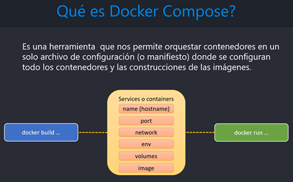

# Sección 11: Docker Compose: Orquestador para definir y ejecutar multi-contenedores

---

## [Docker Compose overview](https://docs.docker.com/compose/)

`Compose` es una herramienta para definir y ejecutar aplicaciones `Docker multicontenedor`. Con `Compose`, utilizas un
archivo `YAML` para configurar los servicios de tu aplicación. Luego, con un solo comando, creas e inicias todos los
servicios a partir de tu configuración.

`Compose` funciona en todos los entornos; `producción`, `staging`, `desarrollo`, `pruebas`, así como flujos de trabajo
CI. También dispone de comandos para gestionar todo el ciclo de vida de tu aplicación:

- Iniciar, detener y reconstruir servicios
- Ver el estado de los servicios en ejecución
- Transmitir la salida de registro de los servicios en ejecución
- Ejecutar un comando puntual en un servicio

Las características clave de `Compose` que lo hacen eficaz son:

- Disponer de múltiples entornos aislados en un único host
- Conservar los datos de volumen cuando se crean contenedores
- Recrear sólo los contenedores que han cambiado
- Soportar variables y mover una composición entre entornos

### [The Compose file](https://docs.docker.com/compose/intro/compose-application-model/#the-compose-file)

Antes de empezar a crear el archivo `compose.yml` (en versiones anteriores era `docker-compose.yml`) veamos algunos
aspectos sobre él.

El archivo `Compose` es un archivo `YAML` que define:

- Version `(Optional)`
- Services `(Required)`
- Networks
- Volumes
- Configs
- Secrets

La ruta predeterminada para un archivo `Compose` es `compose.yaml` (preferido) o `compose.yml` que se coloca en el
directorio de trabajo. `Compose` también admite `docker-compose.yaml` y `docker-compose.yml` para la compatibilidad
con versiones anteriores. Si existen ambos archivos, `Compose` prefiere el canónico `compose.yaml`.

### [Elemento de nivel superior Versión](https://docs.docker.com/compose/compose-file/04-version-and-name/)

La propiedad de nivel superior `versión` está definida por la Especificación Compose para compatibilidad con versiones
anteriores. `Solo tiene carácter informativo`.

**Compose no utiliza la versión para seleccionar un esquema exacto para validar el archivo Compose, sino que prefiere
el esquema más reciente cuando está implementado.**

### [Elemento de nivel superior de los Servicios](https://docs.docker.com/compose/compose-file/05-services/)

Un `servicio `es una definición abstracta de un recurso informático dentro de una aplicación que **puede escalarse o
sustituirse independientemente de otros componentes**.
`Los servicios están respaldados por un conjunto de contenedores`, ejecutados por la plataforma de acuerdo con
los requisitos de replicación y las restricciones de ubicación. **Dado que los servicios están respaldados por
contenedores, se definen mediante una imagen Docker y un conjunto de argumentos de tiempo de ejecución.**
`Todos los contenedores de un servicio se crean de forma idéntica con estos argumentos.`

Un archivo Compose debe declarar un elemento de nivel superior de servicios como un mapa cuyas `claves` **son
representaciones de cadenas de nombres de servicios**, y cuyos `valores` **son definiciones de servicios.**
Una `definición de servicio` **contiene la configuración que se aplica a cada contenedor de servicio.**

**Cada servicio también puede incluir una sección de** `build`, **que define cómo crear la imagen Docker para el
servicio.** `Compose permite crear imágenes Docker utilizando esta definición de servicio.` Si no se utiliza,
la sección de construcción se ignora y el archivo Compose sigue considerándose válido.

**Cada servicio define restricciones y requisitos de tiempo de ejecución para ejecutar sus contenedores.** La sección
de `deploy` agrupa estas restricciones y permite a la plataforma ajustar la estrategia de despliegue para adaptar mejor
las necesidades de los contenedores a los recursos disponibles. Si no se implementa, la sección de despliegue se ignora
y el archivo Compose sigue considerándose válido.

A continuación se muestran algunos atributos usados dentro de un servicio:

- `build`, especifica la configuración de compilación para crear una imagen de contenedor a partir del código fuente,
  tal y como se define en la especificación de compilación de Compose.

- `container_name`, es una cadena que especifica un nombre de contenedor personalizado, **en lugar de
  un nombre generado por defecto.**

- `volumes`, definen rutas de host de montaje o `volúmenes con nombre` que son accesibles por contenedores
  de servicio. Puedes usar volúmenes para definir múltiples tipos de montajes; `volumen`, `bind`, `tmpfs` o `npipe`.

  > Para `reutilizar un volumen a través de múltiples servicios`, se debe declarar un `volumen con nombre` **en la clave
  > de volúmenes de nivel superior.**
  >
  > `La declaración de volúmenes de nivel superior` permite **configurar volúmenes con nombre que pueden reutilizarse en
  > varios servicios.** Para utilizar un volumen en varios servicios, debe conceder explícitamente acceso a cada
  > servicio mediante el atributo volumes.

- `networks`, capa que permite a los servicios comunicarse entre sí. `El elemento de nivel superior networks permite
  configurar redes con nombre que pueden reutilizarse en varios servicios`. Para utilizar una red en varios servicios,
  debes conceder explícitamente acceso a `cada servicio` utilizando el atributo `networks`.

  > Podríamos no configurar explícitamente un `networks` y en ese caso, por defecto, `Compose` configura una única red
  > para tu aplicación. Cada contenedor para un servicio se une a la red por defecto y es accesible por otros
  > contenedores en esa red, y detectable por ellos en un nombre de host idéntico al nombre del contenedor.

