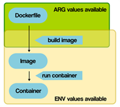
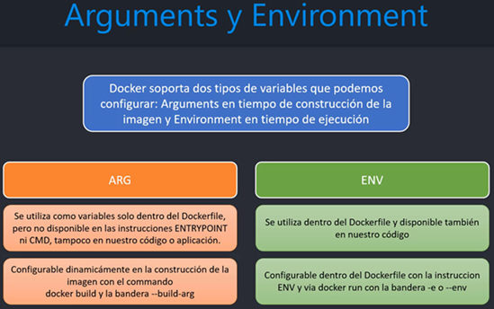

# Sección 10: Docker - Arguments y Environment Variables

---

## [Introducción](https://vsupalov.com/docker-arg-env-variable-guide/)

Al utilizar Docker, distinguimos entre dos tipos diferentes de variables (`ARG y ENV`). Se diferencian en el momento del
ciclo de vida de un `contenedor-imagen `en el que los valores están disponibles.

He aquí un resumen simplificado de las disponibilidades de `ARG` y `ENV`. Comenzando con la construcción de una imagen
`Docker` desde un `Dockerfile`, hasta que un contenedor se ejecuta. Los valores `ARG` no son utilizables desde dentro
de los contenedores en ejecución.



### ARG (Build-time Arguments)

Las variables definidas a través de `ARG` también se conocen como variables en tiempo de compilación. **Solo están
disponibles desde el momento en que son 'anunciadas' en el `Dockerfile` con una instrucción `ARG` en el `Dockerfile`.**

**Los contenedores** en ejecución **no pueden acceder a los valores de las variables `ARG`.**  Así que cualquier cosa
que ejecute a través de instrucciones `CMD` o `ENTRYPOINT` no verá esos valores por defecto.

**El beneficio de `ARG` es que `Docker` esperará obtener valores para esas variables.** Al menos, si usted no
especifica un valor por defecto. **Si esos valores no se proporcionan al ejecutar el comando de compilación, habrá un
mensaje de error.** Aquí hay un ejemplo donde Docker se queja durante la construcción:

````bash
# no default value is specified!
ARG some_value
````

### ENV (Build-time and run-time Environment Variables)

Las variables `ENV` están disponibles tanto durante la construcción como para el futuro contenedor en ejecución.
**En el `Dockerfile`, son utilizables tan pronto como se introducen con una instrucción `ENV`.**

A diferencia de `ARG`, **los valores `ENV` son accesibles por los contenedores iniciados desde la imagen final.** Los
valores `ENV` pueden ser anulados al iniciar un contenedor.

A continuación se muestra el resumen entre `ARG` y `ENV`.



## Trabajando con variables de entorno (ENV) - user-service

Veremos un primer acercamiento al uso de las variables de entorno en este microservicio. El ejemplo será, cambiar
dinámicamente el puerto en la que correrá la aplicación al interior del contendor y también el perfil en el que se
ejecutará. De tal forma que, cuando creemos un nuevo contenedor, podremos asignarle dinámicamente un puerto y/o un
perfil distinto.

### Definiendo variable de entorno en el Dockerfile

Lo primero que haremos será modificar el `application.yml` del `user-service` donde agregaremos la variable de
entorno `CONTAINER_PORT`.

````yml
server:
  port: ${CONTAINER_PORT:8001}
````

**Donde**

- `CONTAINER_PORT` es la variables de entorno.
- `8001` es del valor por defecto. Es decir, si la variable de entorno `CONTAINER_PORT` no fue definida, entonces
  tomará como valor el `8001`.

Luego, en el `Dockerfile` del `user-service` podemos definir la variable de entorno utilizando la instrucción `ENV`.

````Dockerfile
# otras instrucciones
#
ENV CONTAINER_PORT=8000
EXPOSE ${CONTAINER_PORT}
CMD ["java", "org.springframework.boot.loader.launch.JarLauncher"]
````

**Donde**

- `ENV`, esta instrucción establece la variable de entorno `CONTAINER_PORT` con valor de puerto `8000`. Este valor
  estará en el entorno para todas las instrucciones posteriores en la etapa de construcción y puede ser reemplazado en
  línea.
- Al definir una variable de entorno con `ENV` `sí o sí debemos asignarle un valor`, en nuestro caso tiene el puerto
  `8000`.
- Es importante recordar que, en esta situación, aunque `ENV` puede ser utilizado tanto en la construcción como en la
  ejecución del contenedor, cuando se usa en `EXPOSE`, su efecto es únicamente durante la fase de construcción de la
  imagen. Así que en este caso, el `ENV` está funcionando solo para la configuración del puerto en la imagen
  construida.

**Nota**
> Recordemos que en el `application.yml` del `user-service` hemos definido como valor por defecto el `8001` si es que
> la variable de entorno `CONTAINER_PORT` no viene definida.
>
> Ahora, como en el `Dockerfile` estamos estableciendo explícitamente el `ENV CONTAINER_PORT=8000`, significa que
> esa variable siempre estará definida y con valor `8000`, por lo que el puerto por defecto (`8001`) del
> `application.yml` jamás se usará.

A continuación procedemos a construir la imagen para el microservicio `user-service`

````bash
D:\programming\spring\01.udemy\02.andres_guzman\08.docker_kubernetes\docker-kubernetes (feature/section-10)
$ docker image build -t user-service .\business-domain\user-service -f .\business-domain\user-service\Dockerfile
[+] Building 18.7s (25/25) FINISHED
...
````

Procedemos a crear el contenedor a partir de la imagen anterior.

````bash
$ docker container run -d -p 8001:8000 --rm --name c-user-service --network docker-kubernetes-net user-service
4ddab7c97b54defd23f85c9d498dba751febfd59349db4debbe5cee97b986971
````

**Donde**

- `-p 8001:8000`, el puerto externo sigue siendo `8001`, recordemos que usamos ese valor para poder acceder desde
  nuestra máquina local al contendor. Por otro lado, el cambio que hemos realizado fue en el puerto interno `8000`.
  Esto significa que al interior del contenedor nuestra aplicación de Spring Boot usará dicho puerto. Para que eso
  suceda, el valor del puerto interno definido en el parámetro `-p 8001:8000` debe ser coherente con el valor que le
  definimos a la variable `ENV CONTAINER_PORT=8000` dentro del `Dockerfile`.

Vemos los contenedores que tenemos creados.

````bash
$ docker container ls -a
CONTAINER ID   IMAGE                 COMMAND                  CREATED          STATUS          PORTS                               NAMES
4ddab7c97b54   user-service          "/__cacert_entrypoin…"   15 seconds ago   Up 14 seconds   0.0.0.0:8001->8000/tcp              c-user-service
47afe8c9bba9   mysql:8.0.41-debian   "docker-entrypoint.s…"   2 days ago       Up 15 minutes   33060/tcp, 0.0.0.0:3307->3306/tcp   c-mysql
8348796416ea   postgres:17-alpine    "docker-entrypoint.s…"   2 days ago       Up 15 minutes   0.0.0.0:5433->5432/tcp              c-postgres
````

Comprobamos que nuestra aplicación de Spring Boot está ejecutándose al interior del contenedor en el puerto `8000` tal
como lo definimos en la variable `ENV CONTAINER_PORT=8000`.

````bash
$ docker container logs c-user-service

  .   ____          _            __ _ _
 /\\ / ___'_ __ _ _(_)_ __  __ _ \ \ \ \
( ( )\___ | '_ | '_| | '_ \/ _` | \ \ \ \
 \\/  ___)| |_)| | | | | || (_| |  ) ) ) )
  '  |____| .__|_| |_|_| |_\__, | / / / /
 =========|_|==============|___/=/_/_/_/

 :: Spring Boot ::                (v3.4.5)

2025-06-03T04:31:58.306Z  INFO 1 --- [user-service] [           main] d.m.user.app.UserServiceApplication      : Starting UserServiceApplication v0.0.1-SNAPSHOT using Java 21.0.7 with PID 1 (/app/BOOT-INF/classes started by root in /app) 2025-06-03T04:31:58.308Z DEBUG 1 --- [user-service] [           main] d.m.user.app.UserServiceApplication      : Running with Spring Boot v3.4.5, Spring v6.2.6
2025-06-03T04:31:58.309Z  INFO 1 --- [user-service] [           main] d.m.user.app.UserServiceApplication      : The following 1 profile is active: "default"
2025-06-03T04:31:59.684Z  INFO 1 --- [user-service] [           main] .s.d.r.c.RepositoryConfigurationDelegate : Bootstrapping Spring Data JPA repositories in DEFAULT mode.
2025-06-03T04:31:59.767Z  INFO 1 --- [user-service] [           main] .s.d.r.c.RepositoryConfigurationDelegate : Finished Spring Data repository scanning in 67 ms. Found 1 JPA repository interface.
2025-06-03T04:31:59.991Z  INFO 1 --- [user-service] [           main] o.s.cloud.context.scope.GenericScope     : BeanFactory id=91540a6b-3294-3658-b380-dfb1c22ae3d2
2025-06-03T04:32:00.932Z  INFO 1 --- [user-service] [           main] o.s.b.w.embedded.tomcat.TomcatWebServer  : Tomcat initialized with port 8000 (http)
2025-06-03T04:32:00.957Z  INFO 1 --- [user-service] [           main] o.apache.catalina.core.StandardService   : Starting service [Tomcat]
2025-06-03T04:32:00.958Z  INFO 1 --- [user-service] [           main] o.apache.catalina.core.StandardEngine    : Starting Servlet engine: [Apache Tomcat/10.1.40]
2025-06-03T04:32:01.018Z  INFO 1 --- [user-service] [           main] o.a.c.c.C.[Tomcat].[localhost].[/]       : Initializing Spring embedded WebApplicationContext
2025-06-03T04:32:01.019Z  INFO 1 --- [user-service] [           main] w.s.c.ServletWebServerApplicationContext : Root WebApplicationContext: initialization completed in 2640 ms
2025-06-03T04:32:01.503Z  INFO 1 --- [user-service] [           main] o.hibernate.jpa.internal.util.LogHelper  : HHH000204: Processing PersistenceUnitInfo [name: default]
2025-06-03T04:32:01.612Z  INFO 1 --- [user-service] [           main] org.hibernate.Version                    : HHH000412: Hibernate ORM core version 6.6.13.Final
2025-06-03T04:32:01.671Z  INFO 1 --- [user-service] [           main] o.h.c.internal.RegionFactoryInitiator    : HHH000026: Second-level cache disabled
2025-06-03T04:32:02.196Z  INFO 1 --- [user-service] [           main] o.s.o.j.p.SpringPersistenceUnitInfo      : No LoadTimeWeaver setup: ignoring JPA class transformer
2025-06-03T04:32:02.233Z  INFO 1 --- [user-service] [           main] com.zaxxer.hikari.HikariDataSource       : HikariPool-1 - Starting...
2025-06-03T04:32:02.753Z  INFO 1 --- [user-service] [           main] com.zaxxer.hikari.pool.HikariPool        : HikariPool-1 - Added connection com.mysql.cj.jdbc.ConnectionImpl@59cde35
2025-06-03T04:32:02.756Z  INFO 1 --- [user-service] [           main] com.zaxxer.hikari.HikariDataSource       : HikariPool-1 - Start completed.
2025-06-03T04:32:02.883Z  INFO 1 --- [user-service] [           main] org.hibernate.orm.connections.pooling    : HHH10001005: Database info:
        Database JDBC URL [Connecting through datasource 'HikariDataSource (HikariPool-1)']
        Database driver: undefined/unknown
        Database version: 8.0.41
        Autocommit mode: undefined/unknown
        Isolation level: undefined/unknown
        Minimum pool size: undefined/unknown
        Maximum pool size: undefined/unknown
2025-06-03T04:32:04.039Z  INFO 1 --- [user-service] [           main] o.h.e.t.j.p.i.JtaPlatformInitiator       : HHH000489: No JTA platform available (set 'hibernate.transaction.jta.platform' to enable JTA platform integration)
2025-06-03T04:32:04.099Z  INFO 1 --- [user-service] [           main] j.LocalContainerEntityManagerFactoryBean : Initialized JPA EntityManagerFactory for persistence unit 'default'
2025-06-03T04:32:04.971Z  WARN 1 --- [user-service] [           main] JpaBaseConfiguration$JpaWebConfiguration : spring.jpa.open-in-view is enabled by default. Therefore, database queries may be performed during view rendering. Explicitly configure spring.jpa.open-in-view to disable this warning
2025-06-03T04:32:06.051Z  INFO 1 --- [user-service] [           main] o.s.b.a.e.web.EndpointLinksResolver      : Exposing 1 endpoint beneath base path '/actuator'
2025-06-03T04:32:06.165Z  INFO 1 --- [user-service] [           main] o.s.b.w.embedded.tomcat.TomcatWebServer  : Tomcat started on port 8000 (http) with context path '/'
2025-06-03T04:32:06.184Z  INFO 1 --- [user-service] [           main] d.m.user.app.UserServiceApplication      : Started UserServiceApplication in 8.634 seconds (process running for 9.531)
````

Comprobamos que la aplicación sigue funcionando con el puerto externo `8001`pero que esta vez está vinculado al puerto
interno `8000`.

````bash
$ curl -v http://localhost:8001/api/v1/users | jq
>
< HTTP/1.1 200
< Content-Type: application/json
< Transfer-Encoding: chunked
< Date: Tue, 03 Jun 2025 04:34:29 GMT
<
  {
    "id": 1,
    "name": "Lesly",
    "email": "lesly@gmail.com",
    "password": "123456"
  }
]
````

### Sobreescribiendo variable de entorno (`ENV`) a través de línea de comandos

En el `application.yml` del `user-service` creamos la variable de entorno `SPRING_PROFILES_ACTIVE` cuyo valor por
defecto será `default`. Es decir, que tome las configuraciones por defecto si es que no se le define un perfil.

````yml
server:
  port: ${CONTAINER_PORT:8001}
spring:
  profiles:
    active: ${SPRING_PROFILES_ACTIVE:default}
````

Esta vez en el `Dockerfile` no definiremos la variable `SPRING_PROFILES_ACTIVE` con el `ENV` tal como lo hicimos con el
`CONTAINER_PORT`.

Volvemos a construir la imagen para tener el cambio realizado en el `application.yml`.

````bash
D:\programming\spring\01.udemy\02.andres_guzman\08.docker_kubernetes\docker-kubernetes (feature/section-10)
$ docker image build -t user-service .\business-domain\user-service -f .\business-domain\user-service\Dockerfile
[+] Building 1.0s (24/24) FINISHED
...
````

Creamos un contenedor de la imagen anterior con el valor por defecto para la variable de entorno
`SPRING_PROFILES_ACTIVE`.

````bash
$ docker container run -d -p 8001:8000 --rm --name c-user-service --network docker-kubernetes-net user-service
eeae5d3359376ec8952440b7e2f8318e5346156f8901ca1c1d2c71d665c3d21f
````

Si revisamos el log del contenedor `c-user-service`, el perfil se estará ejecutando como `default` y el puerto
estará corriendo en el `8000`.

````bash
$ docker container logs c-user-service

  .   ____          _            __ _ _
 /\\ / ___'_ __ _ _(_)_ __  __ _ \ \ \ \
( ( )\___ | '_ | '_| | '_ \/ _` | \ \ \ \
 \\/  ___)| |_)| | | | | || (_| |  ) ) ) )
  '  |____| .__|_| |_|_| |_\__, | / / / /
 =========|_|==============|___/=/_/_/_/

 :: Spring Boot ::                (v3.4.5)

2025-06-03T04:42:48.473Z  INFO 1 --- [user-service] [           main] d.m.user.app.UserServiceApplication      : Starting UserServiceApplication v0.0.1-SNAPSHOT using Java 21.0.7 with PID 1 (/app/BOOT-INF/classes started by root in /app) 2025-06-03T04:42:48.477Z DEBUG 1 --- [user-service] [           main] d.m.user.app.UserServiceApplication      : Running with Spring Boot v3.4.5, Spring v6.2.6
2025-06-03T04:42:48.478Z  INFO 1 --- [user-service] [           main] d.m.user.app.UserServiceApplication      : The following 1 profile is active: "default"
2025-06-03T04:42:49.897Z  INFO 1 --- [user-service] [           main] .s.d.r.c.RepositoryConfigurationDelegate : Bootstrapping Spring Data JPA repositories in DEFAULT mode.
2025-06-03T04:42:49.961Z  INFO 1 --- [user-service] [           main] .s.d.r.c.RepositoryConfigurationDelegate : Finished Spring Data repository scanning in 51 ms. Found 1 JPA repository interface.
2025-06-03T04:42:50.181Z  INFO 1 --- [user-service] [           main] o.s.cloud.context.scope.GenericScope     : BeanFactory id=91540a6b-3294-3658-b380-dfb1c22ae3d2
2025-06-03T04:42:51.160Z  INFO 1 --- [user-service] [           main] o.s.b.w.embedded.tomcat.TomcatWebServer  : Tomcat initialized with port 8000 (http)
2025-06-03T04:42:51.188Z  INFO 1 --- [user-service] [           main] o.apache.catalina.core.StandardService   : Starting service [Tomcat]
2025-06-03T04:42:51.189Z  INFO 1 --- [user-service] [           main] o.apache.catalina.core.StandardEngine    : Starting Servlet engine: [Apache Tomcat/10.1.40]
2025-06-03T04:42:51.256Z  INFO 1 --- [user-service] [           main] o.a.c.c.C.[Tomcat].[localhost].[/]       : Initializing Spring embedded WebApplicationContext
2025-06-03T04:42:51.257Z  INFO 1 --- [user-service] [           main] w.s.c.ServletWebServerApplicationContext : Root WebApplicationContext: initialization completed in 2711 ms
2025-06-03T04:42:51.728Z  INFO 1 --- [user-service] [           main] o.hibernate.jpa.internal.util.LogHelper  : HHH000204: Processing PersistenceUnitInfo [name: default]
2025-06-03T04:42:51.843Z  INFO 1 --- [user-service] [           main] org.hibernate.Version                    : HHH000412: Hibernate ORM core version 6.6.13.Final
2025-06-03T04:42:51.909Z  INFO 1 --- [user-service] [           main] o.h.c.internal.RegionFactoryInitiator    : HHH000026: Second-level cache disabled
2025-06-03T04:42:52.387Z  INFO 1 --- [user-service] [           main] o.s.o.j.p.SpringPersistenceUnitInfo      : No LoadTimeWeaver setup: ignoring JPA class transformer
2025-06-03T04:42:52.451Z  INFO 1 --- [user-service] [           main] com.zaxxer.hikari.HikariDataSource       : HikariPool-1 - Starting...
2025-06-03T04:42:53.028Z  INFO 1 --- [user-service] [           main] com.zaxxer.hikari.pool.HikariPool        : HikariPool-1 - Added connection com.mysql.cj.jdbc.ConnectionImpl@671f545b
2025-06-03T04:42:53.032Z  INFO 1 --- [user-service] [           main] com.zaxxer.hikari.HikariDataSource       : HikariPool-1 - Start completed.
2025-06-03T04:42:53.155Z  INFO 1 --- [user-service] [           main] org.hibernate.orm.connections.pooling    : HHH10001005: Database info:
        Database JDBC URL [Connecting through datasource 'HikariDataSource (HikariPool-1)']
        Database driver: undefined/unknown
        Database version: 8.0.41
        Autocommit mode: undefined/unknown
        Isolation level: undefined/unknown
        Minimum pool size: undefined/unknown
        Maximum pool size: undefined/unknown
2025-06-03T04:42:54.192Z  INFO 1 --- [user-service] [           main] o.h.e.t.j.p.i.JtaPlatformInitiator       : HHH000489: No JTA platform available (set 'hibernate.transaction.jta.platform' to enable JTA platform integration)
2025-06-03T04:42:54.282Z  INFO 1 --- [user-service] [           main] j.LocalContainerEntityManagerFactoryBean : Initialized JPA EntityManagerFactory for persistence unit 'default'
2025-06-03T04:42:55.147Z  WARN 1 --- [user-service] [           main] JpaBaseConfiguration$JpaWebConfiguration : spring.jpa.open-in-view is enabled by default. Therefore, database queries may be performed during view rendering. Explicitly configure spring.jpa.open-in-view to disable this warning
2025-06-03T04:42:56.095Z  INFO 1 --- [user-service] [           main] o.s.b.a.e.web.EndpointLinksResolver      : Exposing 1 endpoint beneath base path '/actuator'
2025-06-03T04:42:56.198Z  INFO 1 --- [user-service] [           main] o.s.b.w.embedded.tomcat.TomcatWebServer  : Tomcat started on port 8000 (http) with context path '/'
2025-06-03T04:42:56.218Z  INFO 1 --- [user-service] [           main] d.m.user.app.UserServiceApplication      : Started UserServiceApplication in 8.432 seconds (process running for 9.446)
````

La variable `SPRING_PROFILES_ACTIVE` usa el valor por defecto que definimos en el `application.yml`. Mientras que la
variable `CONTAINER_PORT` usa el valor por defecto definido en el `Dockerfile`.

Ahora sí, crearemos un contenedor asignando a través de la línea de comandos variables de entorno que tenemos definido
en el `Dockerfile` y en nuestra aplicación. De esta manera, sobreescribiremos los valores por defecto que tienen
definidos.

````bash
$ docker container run -d -p 8001:8090 --rm --name c-user-service -e SPRING_PROFILES_ACTIVE=dev -e CONTAINER_PORT=8090 --network docker-kubernetes-net user-service
864a878fe97030187abc6c1e714f30926868fb0ba515aa1a9d2b7be8d4a96db7
````

**Donde**

- `-p 8001:8090`, el valor que le definimos al puerto interno de este nuevo contenedor es `8090`.
- `-e` o `--env`, nos permite definir una variable de entorno.
- `CONTAINER_PORT=8090`, variable de entorno definida en la línea de comandos. Esta variable sobreescribe a la variable
  que definimos en el `Dockerfile`, si es que en ese archivo existe dicha variable. Caso contrario, simplemente estamos
  creando la variable para que sea usada por quien la defina al interior del contenedor. En nuestro caso,
  el `application.yml` en la configuración `server.port`.
- `SPRING_PROFILES_ACTIVE=dev`, variable de entorno que no ha sido definido en el `Dockerfile`, pero que sí está
  definido en el `application.yml` de nuestro `user-service`.

**Nota**
> Las variables de entorno que definamos a través de la línea de comandos, no necesariamente tiene que estar definida
> en el `Dockerfile`, es decir, a través de la línea de comandos podemos definir variables de entorno, y si existen
> en el `Dockerfile`, obviamente se sobreescribirán, en caso de que no existan, simplemente estarán disponibles en el
> entorno de ejecución de dicho contenedor, por lo que, podrán ser accedidos por ejemplo, desde el `application.yml`.

Listamos los contenedores.

````bash
$ docker container ls -a
CONTAINER ID   IMAGE                 COMMAND                  CREATED         STATUS          PORTS                               NAMES
864a878fe970   user-service          "/__cacert_entrypoin…"   3 minutes ago   Up 3 minutes    8000/tcp, 0.0.0.0:8001->8090/tcp    c-user-service
47afe8c9bba9   mysql:8.0.41-debian   "docker-entrypoint.s…"   2 days ago      Up 34 minutes   33060/tcp, 0.0.0.0:3307->3306/tcp   c-mysql
8348796416ea   postgres:17-alpine    "docker-entrypoint.s…"   2 days ago      Up 34 minutes   0.0.0.0:5433->5432/tcp              c-postgres
````

Ahora comprobamos que nuestra aplicación de Spring Boot está corriendo en el puerto `8090` y con el perfil `dev`.

````bash
$ docker container logs c-user-service

  .   ____          _            __ _ _
 /\\ / ___'_ __ _ _(_)_ __  __ _ \ \ \ \
( ( )\___ | '_ | '_| | '_ \/ _` | \ \ \ \
 \\/  ___)| |_)| | | | | || (_| |  ) ) ) )
  '  |____| .__|_| |_|_| |_\__, | / / / /
 =========|_|==============|___/=/_/_/_/

 :: Spring Boot ::                (v3.4.5)

2025-06-03T04:47:24.361Z  INFO 1 --- [user-service] [           main] d.m.user.app.UserServiceApplication      : Starting UserServiceApplication v0.0.1-SNAPSHOT using Java 21.0.7 with PID 1 (/app/BOOT-INF/classes started by root in /app) 2025-06-03T04:47:24.364Z DEBUG 1 --- [user-service] [           main] d.m.user.app.UserServiceApplication      : Running with Spring Boot v3.4.5, Spring v6.2.6
2025-06-03T04:47:24.367Z  INFO 1 --- [user-service] [           main] d.m.user.app.UserServiceApplication      : The following 1 profile is active: "dev"
2025-06-03T04:47:25.776Z  INFO 1 --- [user-service] [           main] .s.d.r.c.RepositoryConfigurationDelegate : Bootstrapping Spring Data JPA repositories in DEFAULT mode.
2025-06-03T04:47:25.848Z  INFO 1 --- [user-service] [           main] .s.d.r.c.RepositoryConfigurationDelegate : Finished Spring Data repository scanning in 59 ms. Found 1 JPA repository interface.
2025-06-03T04:47:26.060Z  INFO 1 --- [user-service] [           main] o.s.cloud.context.scope.GenericScope     : BeanFactory id=91540a6b-3294-3658-b380-dfb1c22ae3d2
2025-06-03T04:47:26.843Z  INFO 1 --- [user-service] [           main] o.s.b.w.embedded.tomcat.TomcatWebServer  : Tomcat initialized with port 8090 (http)
2025-06-03T04:47:26.864Z  INFO 1 --- [user-service] [           main] o.apache.catalina.core.StandardService   : Starting service [Tomcat]
2025-06-03T04:47:26.865Z  INFO 1 --- [user-service] [           main] o.apache.catalina.core.StandardEngine    : Starting Servlet engine: [Apache Tomcat/10.1.40]
2025-06-03T04:47:26.910Z  INFO 1 --- [user-service] [           main] o.a.c.c.C.[Tomcat].[localhost].[/]       : Initializing Spring embedded WebApplicationContext
2025-06-03T04:47:26.911Z  INFO 1 --- [user-service] [           main] w.s.c.ServletWebServerApplicationContext : Root WebApplicationContext: initialization completed in 2483 ms
2025-06-03T04:47:27.304Z  INFO 1 --- [user-service] [           main] o.hibernate.jpa.internal.util.LogHelper  : HHH000204: Processing PersistenceUnitInfo [name: default]
2025-06-03T04:47:27.367Z  INFO 1 --- [user-service] [           main] org.hibernate.Version                    : HHH000412: Hibernate ORM core version 6.6.13.Final
2025-06-03T04:47:27.402Z  INFO 1 --- [user-service] [           main] o.h.c.internal.RegionFactoryInitiator    : HHH000026: Second-level cache disabled
2025-06-03T04:47:27.700Z  INFO 1 --- [user-service] [           main] o.s.o.j.p.SpringPersistenceUnitInfo      : No LoadTimeWeaver setup: ignoring JPA class transformer
2025-06-03T04:47:27.737Z  INFO 1 --- [user-service] [           main] com.zaxxer.hikari.HikariDataSource       : HikariPool-1 - Starting...
2025-06-03T04:47:28.111Z  INFO 1 --- [user-service] [           main] com.zaxxer.hikari.pool.HikariPool        : HikariPool-1 - Added connection com.mysql.cj.jdbc.ConnectionImpl@59cde35
2025-06-03T04:47:28.113Z  INFO 1 --- [user-service] [           main] com.zaxxer.hikari.HikariDataSource       : HikariPool-1 - Start completed.
2025-06-03T04:47:28.196Z  INFO 1 --- [user-service] [           main] org.hibernate.orm.connections.pooling    : HHH10001005: Database info:
        Database JDBC URL [Connecting through datasource 'HikariDataSource (HikariPool-1)']
        Database driver: undefined/unknown
        Database version: 8.0.41
        Autocommit mode: undefined/unknown
        Isolation level: undefined/unknown
        Minimum pool size: undefined/unknown
        Maximum pool size: undefined/unknown
2025-06-03T04:47:28.965Z  INFO 1 --- [user-service] [           main] o.h.e.t.j.p.i.JtaPlatformInitiator       : HHH000489: No JTA platform available (set 'hibernate.transaction.jta.platform' to enable JTA platform integration)
2025-06-03T04:47:29.005Z  INFO 1 --- [user-service] [           main] j.LocalContainerEntityManagerFactoryBean : Initialized JPA EntityManagerFactory for persistence unit 'default'
2025-06-03T04:47:29.623Z  WARN 1 --- [user-service] [           main] JpaBaseConfiguration$JpaWebConfiguration : spring.jpa.open-in-view is enabled by default. Therefore, database queries may be performed during view rendering. Explicitly configure spring.jpa.open-in-view to disable this warning
2025-06-03T04:47:30.572Z  INFO 1 --- [user-service] [           main] o.s.b.a.e.web.EndpointLinksResolver      : Exposing 1 endpoint beneath base path '/actuator'
2025-06-03T04:47:30.684Z  INFO 1 --- [user-service] [           main] o.s.b.w.embedded.tomcat.TomcatWebServer  : Tomcat started on port 8090 (http) with context path '/'
2025-06-03T04:47:30.702Z  INFO 1 --- [user-service] [           main] d.m.user.app.UserServiceApplication      : Started UserServiceApplication in 6.934 seconds (process running for 7.503)
````

Verificamos que la aplicación sigue funcionando con el puerto externo de siempre:

````bash
$ curl -v http://localhost:8001/api/v1/users | jq
>
< HTTP/1.1 200
< Content-Type: application/json
< Transfer-Encoding: chunked
< Date: Tue, 03 Jun 2025 04:52:10 GMT
<
[
  {
    "id": 1,
    "name": "Lesly",
    "email": "lesly@gmail.com",
    "password": "123456"
  }
]
````

### Define variable de entorno (`ENV`) en archivos de configuración `.env`

Supongamos que tenemos muchas variables de entorno y queremos utilizar la línea de comandos para definirlas.
Realizarlas como en el apartado anterior resultaría muy engorroso. En vez de eso, podríamos usar
un archivo `.env` donde definiríamos todas las variables de entorno y simplemente en la línea de comando llamar
a ese archivo.

Creamos el archivo `.env` en el directorio que consideremos adecuado; sin embargo, en nuestro caso, lo ubicaremos en
la raíz del microservicio `user-service` para mantener una estructura organizada, ya que las variables de entorno
definidas serán exclusivas de este servicio. En dicho archivo, estableceremos nuestras variables de entorno.
Como ejemplo, incluiremos los valores correspondientes a las dos variables con las que hemos trabajado hasta ahora.

````bash
# Container
CONTAINER_PORT=8888
SPRING_PROFILES_ACTIVE=test
````

**Nota**
> Como usamos el archivo de configuración `.env`, se supone que dicho archivo contendrá información sensible, así que
> debemos evitar subir dicho archivo al repositorio. En mi caso lo subiré, simplemente porque es un curso que estoy
> llevando y quiero tener toda la información, pero si fuera un caso real, deberíamos evitar subirlo al repositorio
> y en su defecto ignorarlo en el archivo `.gitignore`.

Ahora, al momento de correr un nuevo contenedor debemos llamar a este archivo con la instrucción `--env-file`.

````bash
$ docker container run -d -p 8001:8888 --rm --name c-user-service --env-file .\business-domain\user-service\.env --network docker-kubernetes-net user-service
54681edadd96676815b4d70e4768c576a98d8c705f6f97f5e80d666fe0682078
````

**Donde**

- `--env-file`, instrucción que nos permite leer un archivo de variables de entorno.
- `.\business-domain\user-service\.env`, ruta donde está ubicada el archivo `.env`.
- `-p 8001:8888`, definimos para este ejemplo el valor del puerto interno a `8888`. Recordar que ese valor también
  deberá ser definido en el `CONTAINER_PORT` dentro del archivo `.env`.

Verificamos que el contenedor esté en la lista de contenedores.

````bash
$ docker container ls -a
CONTAINER ID   IMAGE                 COMMAND                  CREATED              STATUS              PORTS                               NAMES
54681edadd96   user-service          "/__cacert_entrypoin…"   About a minute ago   Up About a minute   8000/tcp, 0.0.0.0:8001->8888/tcp    c-user-service
47afe8c9bba9   mysql:8.0.41-debian   "docker-entrypoint.s…"   3 days ago           Up 26 minutes       33060/tcp, 0.0.0.0:3307->3306/tcp   c-mysql
8348796416ea   postgres:17-alpine    "docker-entrypoint.s…"   3 days ago           Up 26 minutes       0.0.0.0:5433->5432/tcp              c-postgres
````

Ahora verificamos que nuestra aplicación de Spring Boot esté corriendo al interior del contenedor en el puerto `8888`
con el perfil `test`, valores que fueron definidos en el archivo `.env`.

````bash
$ docker container logs c-user-service

  .   ____          _            __ _ _
 /\\ / ___'_ __ _ _(_)_ __  __ _ \ \ \ \
( ( )\___ | '_ | '_| | '_ \/ _` | \ \ \ \
 \\/  ___)| |_)| | | | | || (_| |  ) ) ) )
  '  |____| .__|_| |_|_| |_\__, | / / / /
 =========|_|==============|___/=/_/_/_/

 :: Spring Boot ::                (v3.4.5)

2025-06-04T04:31:15.541Z  INFO 1 --- [user-service] [           main] d.m.user.app.UserServiceApplication      : Starting UserServiceApplication v0.0.1-SNAPSHOT using Java 21.0.7 with PID 1 (/app/BOOT-INF/classes started by root in /app) 2025-06-04T04:31:15.544Z DEBUG 1 --- [user-service] [           main] d.m.user.app.UserServiceApplication      : Running with Spring Boot v3.4.5, Spring v6.2.6
2025-06-04T04:31:15.548Z  INFO 1 --- [user-service] [           main] d.m.user.app.UserServiceApplication      : The following 1 profile is active: "test"
2025-06-04T04:31:17.004Z  INFO 1 --- [user-service] [           main] .s.d.r.c.RepositoryConfigurationDelegate : Bootstrapping Spring Data JPA repositories in DEFAULT mode.
2025-06-04T04:31:17.078Z  INFO 1 --- [user-service] [           main] .s.d.r.c.RepositoryConfigurationDelegate : Finished Spring Data repository scanning in 59 ms. Found 1 JPA repository interface.
2025-06-04T04:31:17.304Z  INFO 1 --- [user-service] [           main] o.s.cloud.context.scope.GenericScope     : BeanFactory id=91540a6b-3294-3658-b380-dfb1c22ae3d2
2025-06-04T04:31:15.950Z  INFO 1 --- [user-service] [           main] o.s.b.w.embedded.tomcat.TomcatWebServer  : Tomcat initialized with port 8888 (http)
2025-06-04T04:31:15.974Z  INFO 1 --- [user-service] [           main] o.apache.catalina.core.StandardService   : Starting service [Tomcat]
2025-06-04T04:31:15.975Z  INFO 1 --- [user-service] [           main] o.apache.catalina.core.StandardEngine    : Starting Servlet engine: [Apache Tomcat/10.1.40]
2025-06-04T04:31:16.028Z  INFO 1 --- [user-service] [           main] o.a.c.c.C.[Tomcat].[localhost].[/]       : Initializing Spring embedded WebApplicationContext
2025-06-04T04:31:16.029Z  INFO 1 --- [user-service] [           main] w.s.c.ServletWebServerApplicationContext : Root WebApplicationContext: initialization completed in 415 ms
2025-06-04T04:31:16.482Z  INFO 1 --- [user-service] [           main] o.hibernate.jpa.internal.util.LogHelper  : HHH000204: Processing PersistenceUnitInfo [name: default]
2025-06-04T04:31:16.621Z  INFO 1 --- [user-service] [           main] org.hibernate.Version                    : HHH000412: Hibernate ORM core version 6.6.13.Final
2025-06-04T04:31:16.691Z  INFO 1 --- [user-service] [           main] o.h.c.internal.RegionFactoryInitiator    : HHH000026: Second-level cache disabled
2025-06-04T04:31:17.169Z  INFO 1 --- [user-service] [           main] o.s.o.j.p.SpringPersistenceUnitInfo      : No LoadTimeWeaver setup: ignoring JPA class transformer
2025-06-04T04:31:17.212Z  INFO 1 --- [user-service] [           main] com.zaxxer.hikari.HikariDataSource       : HikariPool-1 - Starting...
2025-06-04T04:31:17.755Z  INFO 1 --- [user-service] [           main] com.zaxxer.hikari.pool.HikariPool        : HikariPool-1 - Added connection com.mysql.cj.jdbc.ConnectionImpl@281ca256
2025-06-04T04:31:17.758Z  INFO 1 --- [user-service] [           main] com.zaxxer.hikari.HikariDataSource       : HikariPool-1 - Start completed.
2025-06-04T04:31:17.864Z  INFO 1 --- [user-service] [           main] org.hibernate.orm.connections.pooling    : HHH10001005: Database info:
        Database JDBC URL [Connecting through datasource 'HikariDataSource (HikariPool-1)']
        Database driver: undefined/unknown
        Database version: 8.0.41
        Autocommit mode: undefined/unknown
        Isolation level: undefined/unknown
        Minimum pool size: undefined/unknown
        Maximum pool size: undefined/unknown
2025-06-04T04:31:18.970Z  INFO 1 --- [user-service] [           main] o.h.e.t.j.p.i.JtaPlatformInitiator       : HHH000489: No JTA platform available (set 'hibernate.transaction.jta.platform' to enable JTA platform integration)
2025-06-04T04:31:19.023Z  INFO 1 --- [user-service] [           main] j.LocalContainerEntityManagerFactoryBean : Initialized JPA EntityManagerFactory for persistence unit 'default'
2025-06-04T04:31:19.836Z  WARN 1 --- [user-service] [           main] JpaBaseConfiguration$JpaWebConfiguration : spring.jpa.open-in-view is enabled by default. Therefore, database queries may be performed during view rendering. Explicitly configure spring.jpa.open-in-view to disable this warning
2025-06-04T04:31:21.077Z  INFO 1 --- [user-service] [           main] o.s.b.a.e.web.EndpointLinksResolver      : Exposing 1 endpoint beneath base path '/actuator'
2025-06-04T04:31:21.228Z  INFO 1 --- [user-service] [           main] o.s.b.w.embedded.tomcat.TomcatWebServer  : Tomcat started on port 8888 (http) with context path '/'
2025-06-04T04:31:21.257Z  INFO 1 --- [user-service] [           main] d.m.user.app.UserServiceApplication      : Started UserServiceApplication in 6.411 seconds (process running for 9.73)
````

Nuestra aplicación sigue funcionando perfectamente con el puerto externo `8001` quien ahora está enlazado al puerto
interno `8888`.

````bash
$ curl -v http://localhost:8001/api/v1/users | jq
>
< HTTP/1.1 200
< Content-Type: application/json
< Transfer-Encoding: chunked
< Date: Wed, 04 Jun 2025 04:34:42 GMT
<
[
  {
    "id": 1,
    "name": "Lesly",
    "email": "lesly@gmail.com",
    "password": "123456"
  }
]
````

### Dejando valores por defecto en las variables de entorno

Solo para continuar con valores que hemos venido trabajando desde un inicio, dejaré los valores por defecto en las
variables de entorno.

Primero dejaré por defecto el puerto `8001` en el `CONTAINER_PORT` del `Dockerfile` del `user-service`.

````dockerfile
ENV CONTAINER_PORT=8001
EXPOSE ${CONTAINER_PORT}
CMD ["java", "org.springframework.boot.loader.launch.JarLauncher"]
````

Volvemos a construir la imagen, luego de la modificación del `Dockerfile`.

````bash
D:\programming\spring\01.udemy\02.andres_guzman\08.docker_kubernetes\docker-kubernetes (feature/section-10)
$ docker image build -t user-service .\business-domain\user-service -f .\business-domain\user-service\Dockerfile
[+] Building 1.8s (25/25) FINISHED
...
````

Dejaré el valor de `8001` al `CONTAINER_PORT` del archivo `.env`.

````bash
# Container
CONTAINER_PORT=8001
SPRING_PROFILES_ACTIVE=default
````

Así que volvemos a crear un contenedor con el puerto interno `8001` y el perfil por `default`.

````bash
$ docker container run -d -p 8001:8001 --rm --name c-user-service --env-file .\business-domain\user-service\.env --network docker-kubernetes-net user-service
c1e7e6af6c2fff722a39dc5caf8ae879e71fdb659cbae9f141e4826d83893459
````

Listamos todos los contenedores y vemos que nuestro contenedor `user-service` está ejecutándose en los puertos que hemos
venido trabajando desde un inicio, pero que ahora están siendo parametrizados.

````bash
$ docker container ls -a
CONTAINER ID   IMAGE                 COMMAND                  CREATED          STATUS          PORTS                               NAMES
c1e7e6af6c2f   user-service          "/__cacert_entrypoin…"   20 seconds ago   Up 18 seconds   0.0.0.0:8001->8001/tcp              c-user-service
47afe8c9bba9   mysql:8.0.41-debian   "docker-entrypoint.s…"   3 days ago       Up 33 minutes   33060/tcp, 0.0.0.0:3307->3306/tcp   c-mysql
8348796416ea   postgres:17-alpine    "docker-entrypoint.s…"   3 days ago       Up 33 minutes   0.0.0.0:5433->5432/tcp              c-postgres
````

## Trabajando con argumentos en el Dockerfile (ARG)

Antes de empezar a trabajar con argumentos (`ARG`), considero importante revisar la siguiente teoría:

### [Entendiendo cómo interactúan ARG y FROM](https://docs.docker.com/engine/reference/builder/#understand-how-arg-and-from-interact)

Las instrucciones `FROM` soportan variables que son declaradas por cualquier instrucción `ARG` que ocurra antes del
primer `FROM`. Es decir, podemos declarar al inicio de todas las etapas variables del tipo `ARG` y la instrucción
`FROM` de cada etapa las podrá usar sin problema.

**Veamos el siguiente ejemplo (no es parte del proyecto):**

````dockerfile
ARG  CODE_VERSION=latest

FROM base:${CODE_VERSION}
CMD  /code/run-app

FROM extras:${CODE_VERSION}
CMD  /code/run-extras
````

### Uso de variables `ARG` definidas globalmente dentro de una etapa (`stage`)

Cuando defines un `ARG` antes de cualquier instrucción `FROM`, ese argumento es considerado global y puede usarse en la
instrucción `FROM` inmediatamente posterior. Sin embargo, para que esté disponible dentro de una etapa de construcción
(por ejemplo, para usarlo en un `RUN`, `ENV`, o cualquier otra instrucción dentro del bloque que sigue al `FROM`),
es necesario volver a declarar el mismo `ARG` dentro de esa etapa.

> En resumen: los `ARG` globales pueden usarse en el `FROM`, pero si quieres acceder a su valor dentro del contenido
> de la etapa, debes declarar nuevamente el `ARG` (sin necesidad de asignarle un valor).

````dockerfile
ARG VERSION=latest

# Stage
FROM busybox:${VERSION}
ARG VERSION
RUN echo ${VERSION} > image_version
````

En el ejemplo anterior, `ARG VERSION` se declara primero de forma global, lo que permite usarlo en el `FROM`.
Luego se vuelve a declarar dentro de la etapa para que su valor esté disponible en las instrucciones siguientes,
como el `RUN`.

### Utilizando variables ARG

En el `Dockerfile` del microservicio `user-service` agregamos dos variables del tipo `ARG` para definir la versión
de las imágenes que usaremos.

````dockerfile
ARG JDK_VERSION=21-jdk-alpine
ARG JRE_VERSION=21-jre-alpine

FROM eclipse-temurin:${JDK_VERSION} AS dependencies
WORKDIR /app
COPY ./mvnw ./
COPY ./.mvn ./.mvn
COPY ./pom.xml ./
RUN sed -i -e 's/\r$//' ./mvnw
RUN ./mvnw dependency:go-offline
COPY ./src ./src
RUN ./mvnw clean package -DskipTests

FROM eclipse-temurin:${JRE_VERSION} AS builder
WORKDIR /app
COPY --from=dependencies /app/target/*.jar ./app.jar
RUN java -Djarmode=layertools -jar app.jar extract

FROM eclipse-temurin:${JRE_VERSION} AS runner
WORKDIR /app
RUN mkdir ./logs
COPY --from=builder /app/dependencies ./
COPY --from=builder /app/spring-boot-loader ./
COPY --from=builder /app/snapshot-dependencies ./
COPY --from=builder /app/application ./

ENV CONTAINER_PORT=8001
EXPOSE ${CONTAINER_PORT}
CMD ["java", "org.springframework.boot.loader.launch.JarLauncher"]
````

**Donde**

- Al inicio del `Dockerfile` se definió dos variables del tipo `ARG`  llamadas `JDK_VERSION` y `JRE_VERSION`. Estas
  variables permiten definir de manera dinámica las versiones de las imágenes base (`JDK` y `JRE`) que se utilizan en
  las etapas posteriores del `Dockerfile`.


- `ARG` es una instrucción de Docker que permite declarar variables que pueden ser pasadas al momento de construir la
  imagen.


- Si no pasas un valor al momento de la construcción (con `--build-arg`), el valor por defecto para las variables
  `JDK_VERSION` y `JRE_VERSION` será el que hemos definido en el `Dockerfile`, es decir, el  `21-jdk-alpine` y
  `21-jre-alpine` respectivamente.


- En los tres `FROM` se está haciendo uso de las variables del tipo `ARG` según corresponda la etapa. Esto significa que
  en lugar de escribir una versión fija de las imágenes base (por ejemplo, `21-jdk-alpine` o `21-jre-alpine`), puedes
  cambiar la versión de manera más flexible sin modificar directamente el `Dockerfile`. Si quieres usar, por ejemplo,
  `17-jdk-alpine` o `17-jre-alpine`, solo necesitas pasar esos valores como argumentos cuando construyes la imagen, sin
  tocar el código.

> Los `ARG` son accesibles solo durante la fase de construcción. Una vez que la imagen se construye, las variables
> `ARG` no existen más dentro del contenedor resultante.


Procedemos a construir la imagen.

````bash
D:\programming\spring\01.udemy\02.andres_guzman\08.docker_kubernetes\docker-kubernetes (feature/section-10)
$ docker image build -t user-service .\business-domain\user-service -f .\business-domain\user-service\Dockerfile
[+] Building 71.3s (25/25) FINISHED
...
````

Creamos un contenedor a partir de la imagen anterior.

````bash
$ docker container run -d -p 8001:8001 --rm --name c-user-service --network docker-kubernetes-net user-service
814ba6c409e762cb21a4d7f11dcf1df8b175caf7d93b419e0fe1ac0801fcac37
````

Comprobamos el log de inicio de la aplicación.

````bash
$ docker container logs c-user-service

  .   ____          _            __ _ _
 /\\ / ___'_ __ _ _(_)_ __  __ _ \ \ \ \
( ( )\___ | '_ | '_| | '_ \/ _` | \ \ \ \
 \\/  ___)| |_)| | | | | || (_| |  ) ) ) )
  '  |____| .__|_| |_|_| |_\__, | / / / /
 =========|_|==============|___/=/_/_/_/

 :: Spring Boot ::                (v3.4.5)

2025-06-05T05:00:35.004Z  INFO 1 --- [user-service] [           main] d.m.user.app.UserServiceApplication      : Starting UserServiceApplication v0.0.1-SNAPSHOT using Java 21.0.7 with PID 1 (/app/BOOT-INF/classes started by root in /app) 2025-06-05T05:00:35.006Z DEBUG 1 --- [user-service] [           main] d.m.user.app.UserServiceApplication      : Running with Spring Boot v3.4.5, Spring v6.2.6
2025-06-05T05:00:35.007Z  INFO 1 --- [user-service] [           main] d.m.user.app.UserServiceApplication      : The following 1 profile is active: "default"
2025-06-05T05:00:35.727Z  INFO 1 --- [user-service] [           main] .s.d.r.c.RepositoryConfigurationDelegate : Bootstrapping Spring Data JPA repositories in DEFAULT mode.
2025-06-05T05:00:35.790Z  INFO 1 --- [user-service] [           main] .s.d.r.c.RepositoryConfigurationDelegate : Finished Spring Data repository scanning in 51 ms. Found 1 JPA repository interface.
2025-06-05T05:00:35.367Z  INFO 1 --- [user-service] [           main] o.s.cloud.context.scope.GenericScope     : BeanFactory id=91540a6b-3294-3658-b380-dfb1c22ae3d2
2025-06-05T05:00:36.083Z  INFO 1 --- [user-service] [           main] o.s.b.w.embedded.tomcat.TomcatWebServer  : Tomcat initialized with port 8001 (http)
2025-06-05T05:00:36.099Z  INFO 1 --- [user-service] [           main] o.apache.catalina.core.StandardService   : Starting service [Tomcat]
2025-06-05T05:00:36.100Z  INFO 1 --- [user-service] [           main] o.apache.catalina.core.StandardEngine    : Starting Servlet engine: [Apache Tomcat/10.1.40]
2025-06-05T05:00:36.137Z  INFO 1 --- [user-service] [           main] o.a.c.c.C.[Tomcat].[localhost].[/]       : Initializing Spring embedded WebApplicationContext
2025-06-05T05:00:36.138Z  INFO 1 --- [user-service] [           main] w.s.c.ServletWebServerApplicationContext : Root WebApplicationContext: initialization completed in 1076 ms
2025-06-05T05:00:36.512Z  INFO 1 --- [user-service] [           main] o.hibernate.jpa.internal.util.LogHelper  : HHH000204: Processing PersistenceUnitInfo [name: default]
2025-06-05T05:00:36.561Z  INFO 1 --- [user-service] [           main] org.hibernate.Version                    : HHH000412: Hibernate ORM core version 6.6.13.Final
2025-06-05T05:00:36.593Z  INFO 1 --- [user-service] [           main] o.h.c.internal.RegionFactoryInitiator    : HHH000026: Second-level cache disabled
2025-06-05T05:00:36.845Z  INFO 1 --- [user-service] [           main] o.s.o.j.p.SpringPersistenceUnitInfo      : No LoadTimeWeaver setup: ignoring JPA class transformer
2025-06-05T05:00:36.869Z  INFO 1 --- [user-service] [           main] com.zaxxer.hikari.HikariDataSource       : HikariPool-1 - Starting...
2025-06-05T05:00:37.192Z  INFO 1 --- [user-service] [           main] com.zaxxer.hikari.pool.HikariPool        : HikariPool-1 - Added connection com.mysql.cj.jdbc.ConnectionImpl@5c9e6d95
2025-06-05T05:00:37.194Z  INFO 1 --- [user-service] [           main] com.zaxxer.hikari.HikariDataSource       : HikariPool-1 - Start completed.
2025-06-05T05:00:37.271Z  INFO 1 --- [user-service] [           main] org.hibernate.orm.connections.pooling    : HHH10001005: Database info:
        Database JDBC URL [Connecting through datasource 'HikariDataSource (HikariPool-1)']
        Database driver: undefined/unknown
        Database version: 8.0.41
        Autocommit mode: undefined/unknown
        Isolation level: undefined/unknown
        Minimum pool size: undefined/unknown
        Maximum pool size: undefined/unknown
2025-06-05T05:00:38.002Z  INFO 1 --- [user-service] [           main] o.h.e.t.j.p.i.JtaPlatformInitiator       : HHH000489: No JTA platform available (set 'hibernate.transaction.jta.platform' to enable JTA platform integration)
2025-06-05T05:00:38.044Z DEBUG 1 --- [user-service] [           main] org.hibernate.SQL                        :
    create table users (
        id bigint not null auto_increment,
        email varchar(255) not null,
        name varchar(255) not null,
        password varchar(255) not null,
        primary key (id)
    ) engine=InnoDB
2025-06-05T05:00:38.094Z DEBUG 1 --- [user-service] [           main] org.hibernate.SQL                        :
    alter table users
       drop index UK6dotkott2kjsp8vw4d0m25fb7
2025-06-05T05:00:38.317Z DEBUG 1 --- [user-service] [           main] org.hibernate.SQL                        :
    alter table users
       add constraint UK6dotkott2kjsp8vw4d0m25fb7 unique (email)
2025-06-05T05:00:38.351Z  INFO 1 --- [user-service] [           main] j.LocalContainerEntityManagerFactoryBean : Initialized JPA EntityManagerFactory for persistence unit 'default'
2025-06-05T05:00:38.922Z  WARN 1 --- [user-service] [           main] JpaBaseConfiguration$JpaWebConfiguration : spring.jpa.open-in-view is enabled by default. Therefore, database queries may be performed during view rendering. Explicitly configure spring.jpa.open-in-view to disable this warning
2025-06-05T05:00:39.863Z  INFO 1 --- [user-service] [           main] o.s.b.a.e.web.EndpointLinksResolver      : Exposing 1 endpoint beneath base path '/actuator'
2025-06-05T05:00:39.964Z  INFO 1 --- [user-service] [           main] o.s.b.w.embedded.tomcat.TomcatWebServer  : Tomcat started on port 8001 (http) with context path '/'
2025-06-05T05:00:39.983Z  INFO 1 --- [user-service] [           main] d.m.user.app.UserServiceApplication      : Started UserServiceApplication in 5.51 seconds (process running for 7.121)
````

Finalmente, realizamos peticiones al endpoint para ver que todo sigue funcionando correctamente.

````bash
$ curl -v http://localhost:8001/api/v1/users | jq
>
< HTTP/1.1 200
< Content-Type: application/json
< Transfer-Encoding: chunked
< Date: Thu, 05 Jun 2025 05:03:53 GMT
<
[
  {
    "id": 1,
    "name": "Lesly",
    "email": "lesly@gmail.com",
    "password": "123456"
  }
]
````

### Sobreescribiendo variables ARG a través de la línea de comando

Al momento de construir una imagen podemos asignar en la misma línea de comando las variables `ARG` que hayamos
definido en el `Dockerfile`, de esa forma estaremos sobreescribiéndolos. Esto es posible gracias a la instrucción
`--build-arg <varname>=<value>`.

Para nuestro ejemplo, vamos a crear una imagen pasándole por línea de comando nuevos valores para las variables
definidas en el `Dockerfile`: `JDK_VERSION=24-jdk-alpine` y `JRE_VERSION=24-jre-alpine`.

````bash
D:\programming\spring\01.udemy\02.andres_guzman\08.docker_kubernetes\docker-kubernetes (feature/section-10)                                                                                  
$ docker image build --build-arg JDK_VERSION=24-jdk-alpine --build-arg JRE_VERSION=24-jre-alpine -t user-service .\business-domain\user-service -f .\business-domain\user-service\Dockerfile 
[+] Building 87.9s (25/25) FINISHED                                                                                                                                                          
 => [internal] load build definition from Dockerfile                                                                                                                                         
 => => transferring dockerfile: 901B                                                                                                                                                         
 => [internal] load metadata for docker.io/library/eclipse-temurin:24-jre-alpine                                                                                                             
 => [internal] load metadata for docker.io/library/eclipse-temurin:24-jdk-alpine                                                                                                             
 => [auth] library/eclipse-temurin:pull token for registry-1.docker.io                                                                                                                       
 => [internal] load .dockerignore                                                                                                                                                            
 => => transferring context: 214B                                                                                                                                                            
 => [dependencies 1/9] FROM docker.io/library/eclipse-temurin:24-jdk-alpine@sha256:d729416b123cd50d4a70122328ae17d38adced6fa767062d0c0f134e5843deab
...                                          
````

Como observamos la parte inicial del resultado anterior, se está descargando una nueva imagen, la versión 24 de java
tanto para el `JDK` como para el `JRE`.

A partir de la imagen anterior, construimos nuestro contenedor.

````bash
$ docker container run -d -p 8001:8001 --rm --name c-user-service --network docker-kubernetes-net user-service
794ada18bf8d79e6bebdc553078f4754963fcd094e46ebb2f82c7fe985f26669
````

Si ingresamos dentro del contenedor que acabamos de crear `c-user-service` y consultamos por la versión de java que se
está usando, vemos que nos muestra la versión `24` que es la versión que definimos por línea de comandos.

````bash
$ docker container exec -it c-user-service /bin/sh
/app # java --version
openjdk 24.0.1 2025-04-15
OpenJDK Runtime Environment Temurin-24.0.1+9 (build 24.0.1+9)
OpenJDK 64-Bit Server VM Temurin-24.0.1+9 (build 24.0.1+9, mixed mode, sharing)
/app #
````

Incluso si vemos el log nos aparece que está usando `Java 24`.

````bash
$ docker container logs c-user-service

  .   ____          _            __ _ _
 /\\ / ___'_ __ _ _(_)_ __  __ _ \ \ \ \
( ( )\___ | '_ | '_| | '_ \/ _` | \ \ \ \
 \\/  ___)| |_)| | | | | || (_| |  ) ) ) )
  '  |____| .__|_| |_|_| |_\__, | / / / /
 =========|_|==============|___/=/_/_/_/

 :: Spring Boot ::                (v3.4.5)

2025-06-06T04:21:26.398Z  INFO 1 --- [user-service] [           main] d.m.user.app.UserServiceApplication      : Starting UserServiceApplication v0.0.1-SNAPSHOT using Java 24.0.1 with PID 1 (/app/BOOT-INF/classes started by root in /app) 2025-06-06T04:21:26.402Z DEBUG 1 --- [user-service] [           main] d.m.user.app.UserServiceApplication      : Running with Spring Boot v3.4.5, Spring v6.2.6
2025-06-06T04:21:26.403Z  INFO 1 --- [user-service] [           main] d.m.user.app.UserServiceApplication      : The following 1 profile is active: "default"
2025-06-06T04:21:27.628Z  INFO 1 --- [user-service] [           main] .s.d.r.c.RepositoryConfigurationDelegate : Bootstrapping Spring Data JPA repositories in DEFAULT mode.
2025-06-06T04:21:27.713Z  INFO 1 --- [user-service] [           main] .s.d.r.c.RepositoryConfigurationDelegate : Finished Spring Data repository scanning in 68 ms. Found 1 JPA repository interface.
2025-06-06T04:21:27.931Z  INFO 1 --- [user-service] [           main] o.s.cloud.context.scope.GenericScope     : BeanFactory id=91540a6b-3294-3658-b380-dfb1c22ae3d2
2025-06-06T04:21:28.710Z  INFO 1 --- [user-service] [           main] o.s.b.w.embedded.tomcat.TomcatWebServer  : Tomcat initialized with port 8001 (http)
2025-06-06T04:21:28.729Z  INFO 1 --- [user-service] [           main] o.apache.catalina.core.StandardService   : Starting service [Tomcat]
2025-06-06T04:21:28.730Z  INFO 1 --- [user-service] [           main] o.apache.catalina.core.StandardEngine    : Starting Servlet engine: [Apache Tomcat/10.1.40]
2025-06-06T04:21:28.776Z  INFO 1 --- [user-service] [           main] o.a.c.c.C.[Tomcat].[localhost].[/]       : Initializing Spring embedded WebApplicationContext
2025-06-06T04:21:28.777Z  INFO 1 --- [user-service] [           main] w.s.c.ServletWebServerApplicationContext : Root WebApplicationContext: initialization completed in 2310 ms
2025-06-06T04:21:29.204Z  INFO 1 --- [user-service] [           main] o.hibernate.jpa.internal.util.LogHelper  : HHH000204: Processing PersistenceUnitInfo [name: default]
2025-06-06T04:21:29.266Z  INFO 1 --- [user-service] [           main] org.hibernate.Version                    : HHH000412: Hibernate ORM core version 6.6.13.Final
2025-06-06T04:21:29.482Z  INFO 1 --- [user-service] [           main] o.h.c.internal.RegionFactoryInitiator    : HHH000026: Second-level cache disabled
2025-06-06T04:21:29.839Z  INFO 1 --- [user-service] [           main] o.s.o.j.p.SpringPersistenceUnitInfo      : No LoadTimeWeaver setup: ignoring JPA class transformer
2025-06-06T04:21:29.877Z  INFO 1 --- [user-service] [           main] com.zaxxer.hikari.HikariDataSource       : HikariPool-1 - Starting...
2025-06-06T04:21:30.451Z  INFO 1 --- [user-service] [           main] com.zaxxer.hikari.pool.HikariPool        : HikariPool-1 - Added connection com.mysql.cj.jdbc.ConnectionImpl@54970127
2025-06-06T04:21:30.453Z  INFO 1 --- [user-service] [           main] com.zaxxer.hikari.HikariDataSource       : HikariPool-1 - Start completed.
2025-06-06T04:21:30.581Z  INFO 1 --- [user-service] [           main] org.hibernate.orm.connections.pooling    : HHH10001005: Database info:
        Database JDBC URL [Connecting through datasource 'HikariDataSource (HikariPool-1)']
        Database driver: undefined/unknown
        Database version: 8.0.41
        Autocommit mode: undefined/unknown
        Isolation level: undefined/unknown
        Minimum pool size: undefined/unknown
        Maximum pool size: undefined/unknown
2025-06-06T04:21:31.612Z  INFO 1 --- [user-service] [           main] o.h.e.t.j.p.i.JtaPlatformInitiator       : HHH000489: No JTA platform available (set 'hibernate.transaction.jta.platform' to enable JTA platform integration)
2025-06-06T04:21:31.663Z  INFO 1 --- [user-service] [           main] j.LocalContainerEntityManagerFactoryBean : Initialized JPA EntityManagerFactory for persistence unit 'default'
2025-06-06T04:21:32.358Z  WARN 1 --- [user-service] [           main] JpaBaseConfiguration$JpaWebConfiguration : spring.jpa.open-in-view is enabled by default. Therefore, database queries may be performed during view rendering. Explicitly configure spring.jpa.open-in-view to disable this warning
2025-06-06T04:21:33.638Z  INFO 1 --- [user-service] [           main] o.s.b.a.e.web.EndpointLinksResolver      : Exposing 1 endpoint beneath base path '/actuator'
2025-06-06T04:21:33.802Z  INFO 1 --- [user-service] [           main] o.s.b.w.embedded.tomcat.TomcatWebServer  : Tomcat started on port 8001 (http) with context path '/'
2025-06-06T04:21:33.844Z  INFO 1 --- [user-service] [           main] d.m.user.app.UserServiceApplication      : Started UserServiceApplication in 8.065 seconds (process running for 8.741)
````
