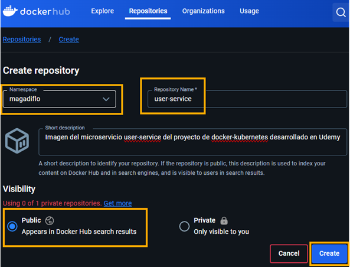
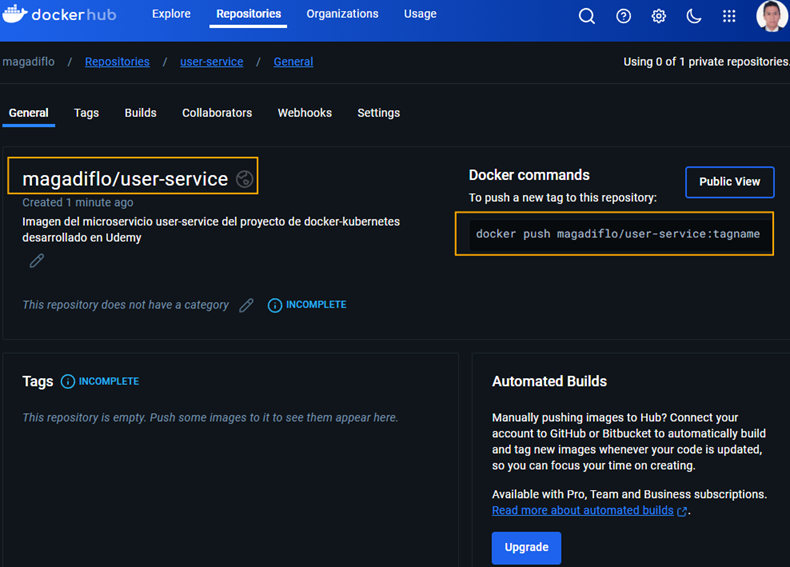
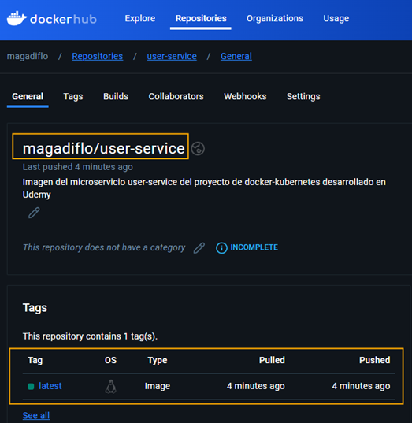

# Sección 12: Docker Hub: Repositorio para compartir imágenes en la nube

---

## ¿Qué es Docker Hub?

`Docker Hub` es un servicio en la nube proporcionado por `Docker` que actúa como un `registro de imágenes de Docker`,
lo que significa que almacena y distribuye `imágenes de contenedores Docker`. Es el repositorio público más grande
para imágenes Docker, y ofrece tanto repositorios públicos como privados.

### Características principales de Docker Hub:

1. `Almacenamiento de imágenes`: Permite a los desarrolladores subir (`push`) sus imágenes de contenedores para
   compartirlas o usarlas en diferentes entornos. También puedes descargar (`pull`) imágenes para utilizarlas localmente
   o en tus servidores.

2. `Imágenes oficiales`: Docker Hub aloja imágenes oficiales de software común, como mysql, nginx, redis, ubuntu, entre
   otros. Estas imágenes son mantenidas y verificadas por los equipos oficiales de desarrollo de ese software,
   asegurando calidad y seguridad.

3. `Imágenes públicas y privadas`:

    - `Públicas`: Cualquiera puede acceder y descargar estas imágenes.
    - `Privadas`: Solo el propietario o usuarios autorizados pueden acceder a estas imágenes. Docker Hub permite
      almacenar imágenes privadas si no quieres que tu código o configuración esté disponible para todo el mundo.

4. `Integración continua`: Docker Hub se puede integrar con plataformas como GitHub o Bitbucket para construir
   automáticamente imágenes cuando se hacen cambios en el código.

5. `Equipos y organizaciones`: Facilita la colaboración entre equipos al permitir que varias personas dentro de una
   organización accedan a las imágenes privadas o compartidas.

6. `Distribución global`: Como está basado en la nube, Docker Hub permite descargar imágenes rápidamente desde cualquier
   parte del mundo.

## Crea nuestro repositorio en Docker Hub y envía imagen con push

En este apartado almacenaremos las imágenes de nuestros microservicios en `Docker Hub`. Para eso necesitamos ingresar
a la web de [hub.docker](https://hub.docker.com/) con nuestras credenciales previamente registradas.

### Crea repositorio en Docker Hub

Lo primero que haremos será crear el repositorio de nuestros microservicios en `Docker Hub`. Pero para no repetir los
pasos, este ejemplo se basará en el microservicio `user-service`, obviamente, los mismos pasos se aplicarán al
microservicio `course-service`.

1. Crea un repositorio para la imagen a subir. El nombre del repositorio será igual al nombre del microservicio cuya
   imagen queremos subir a `Docker Hub`, en nuestro caso, el repositorio se llamará `user-service`.



2. Luego de haber creado el repositorio, veremos la siguiente pantalla.



Hay dos cosas importantes que debemos resaltar luego de la creación del repositorio.

1. El nombre completo de la imagen que subiremos a `Docker Hub` debe ser igual al `Namespace/Repository_name`. Donde el
   `Namespace` es el nombre del usuario y el `Respository_name` el nombre del repositorio que creamos en `Docker Hub`.
   En nuestro caso, la imagen a `pushear` desde el local debe tener este nombre completo `magadiflo/user-service`.

2. Observemos que luego de la creación del repositorio nos muestra el comando de ejemplo para poder enviar una nueva
   etiqueta a este repositorio `docker push magadiflo/user-service:tagname`.

### Enviando imagen desde local hacia Docker Hub

Primero vamos a levantar los contenedores con `Docker Compose`, aprovecharemos el comando para crear las imágenes de los
microservicios.

````bash
M:\PROGRAMACION\DESARROLLO_JAVA_SPRING\01.udemy\02.udemy_andres_guzman\docker-kubernetes (main -> origin)       
$ docker compose up --build -d

[+] Building 1.6s (41/41) FINISHED                                                                              
 => [user-service internal] load build definition from Dockerfile                                               
 => => transferring dockerfile: 909B                                                                            
 => [course-service internal] load metadata for docker.io/library/eclipse-temurin:21-jdk-alpine                 
 => [course-service internal] load metadata for docker.io/library/eclipse-temurin:21-jre-alpine                 
 => [user-service internal] load .dockerignore                                                                  
 => => transferring context: 212B                                                                               
 => [course-service builder 1/4] FROM docker.io/library/eclipse-temurin:21-jre-alpine                           
 => [course-service dependencies 1/8] FROM docker.io/library/eclipse-temurin:21-jdk-alpine                      
 => [user-service internal] load build context                                                                  
 => => transferring context: 5.19kB                                                                             
 => CACHED [course-service builder 2/4] WORKDIR /app                                                            
 => CACHED [user-service runner 3/7] RUN mkdir ./logs                                                           
 => CACHED [course-service dependencies 2/8] WORKDIR /app                                                       
 => CACHED [user-service dependencies 3/8] COPY ./mvnw ./                                                       
 => CACHED [user-service dependencies 4/8] COPY ./.mvn ./.mvn                                                   
 => CACHED [user-service dependencies 5/8] COPY ./pom.xml ./                                                    
 => CACHED [user-service dependencies 6/8] RUN sed -i -e 's/\r$//' ./mvnw      && ./mvnw dependency:go-offline  
 => CACHED [user-service dependencies 7/8] COPY ./src ./src                                                     
 => CACHED [user-service dependencies 8/8] RUN ./mvnw clean package -DskipTests                                 
 => CACHED [user-service builder 3/4] COPY --from=dependencies /app/target/*.jar ./app.jar                      
 => CACHED [user-service builder 4/4] RUN java -Djarmode=layertools -jar app.jar extract                        
 => CACHED [user-service runner 4/7] COPY --from=builder /app/dependencies ./                                   
 => CACHED [user-service runner 5/7] COPY --from=builder /app/spring-boot-loader ./                             
 => CACHED [user-service runner 6/7] COPY --from=builder /app/snapshot-dependencies ./                          
 => CACHED [user-service runner 7/7] COPY --from=builder /app/application ./                                    
 => [user-service] exporting to image                                                                           
 => => exporting layers                                                                                         
 => => writing image sha256:b3195a9af49ead92d9e1a627119a260c95ed9ef80ec6c5443a3e44dc9f5880fa                    
 => => naming to docker.io/library/user-service:latest                                                          
 => [user-service] resolving provenance for metadata file                                                       
 => [course-service internal] load build definition from Dockerfile                                             
 => => transferring dockerfile: 786B                                                                            
 => [course-service internal] load .dockerignore                                                                
 => => transferring context: 2B                                                                                 
 => [course-service internal] load build context                                                                
 => => transferring context: 3.66kB                                                                             
 => CACHED [course-service dependencies 3/8] COPY ./mvnw ./                                                     
 => CACHED [course-service dependencies 4/8] COPY ./.mvn ./.mvn                                                 
 => CACHED [course-service dependencies 5/8] COPY ./pom.xml ./                                                  
 => CACHED [course-service dependencies 6/8] RUN sed -i -e 's/\r$//' ./mvnw      && ./mvnw dependency:go-offline
 => CACHED [course-service dependencies 7/8] COPY ./src ./src                                                   
 => CACHED [course-service dependencies 8/8] RUN ./mvnw clean package -DskipTests                               
 => CACHED [course-service builder 3/4] COPY --from=dependencies /app/target/*.jar ./app.jar                    
 => CACHED [course-service builder 4/4] RUN java -Djarmode=layertools -jar app.jar extract                      
 => CACHED [course-service runner 3/6] COPY --from=builder /app/dependencies ./                                 
 => CACHED [course-service runner 4/6] COPY --from=builder /app/spring-boot-loader ./                           
 => CACHED [course-service runner 5/6] COPY --from=builder /app/snapshot-dependencies ./                        
 => CACHED [course-service runner 6/6] COPY --from=builder /app/application ./                                  
 => [course-service] exporting to image                                                                         
 => => exporting layers                                                                                         
 => => writing image sha256:3595178a5b7df68902e9c9d4a404692893d721ccc5fbf7871ab907f146a48996                    
 => => naming to docker.io/library/course-service:latest                                                        
 => [course-service] resolving provenance for metadata file                                                     
[+] Running 4/4                                                                                                 
 ✔ Container c-mysql           Healthy                                                                          
 ✔ Container c-postgres        Healthy                                                                          
 ✔ Container c-user-service    Started                                                                          
 ✔ Container c-course-service  Started                                                                          
````

Listamos las imágenes que tenemos en local.

````bash
$ docker image ls
REPOSITORY                               TAG             IMAGE ID       CREATED         SIZE
course-service                           latest          3595178a5b7d   2 days ago      247MB
user-service                             latest          b3195a9af49e   2 days ago      248MB
mysql                                    8.0.33          f6360852d654   15 months ago   565MB
postgres                                 15.2-alpine     ddc12ac7fa27   18 months ago   243MB
````

Para este ejemplo, nos interesa la imagen `user-service` con tag `latest`, pero observemos que `NO tenemos el mismo
nombre que nos solicita Docker Hub`, que como recordaremos es `magadiflo/user-service` y en nuestro caso el nombre del
repositorio en local solo dice `user-service` **¿qué podemos hacer?**

1. `Primera Forma`,  (no lo haré así, solo lo coloco para saber que existe esta forma) podemos volver a crear una nueva
   imagen con el nombre requerido `magadiflo/user-service`.
   ````bash
   M:\PROGRAMACION\DESARROLLO_JAVA_SPRING\01.udemy\02.udemy_andres_guzman\docker-kubernetes (main -> origin)
   $ docker image build -t magadiflo/user-service .\projects\user-service -f .\projects\user-service\Dockerfile
   ````

2. `Segunda forma`, (así lo haré) a partir de una imagen existente la podemos volver a etiquetar.

   ````bash
   $ docker tag user-service magadiflo/user-service
   ````
   El comando anterior está renombrando la imagen `user-service` cuyo tag por defecto es `latest` en otra
   imagen cuyo nombre será `magadiflo/user-service` y como tampoco le definimos un tag, usará el por defecto `latest`.
   Es como si hiciéramos un copia y pega de un archivo renombrándolo.

Luego de haber renombrado la imagen con el nombre requerido, listamos para ver que los tenemos en nuestro entorno local.
Para el `course-service` también aplicamos el mismo comando por eso es que vemos la imagen `magadiflo/course-service`.

````bash
$ docker image ls
REPOSITORY                               TAG             IMAGE ID       CREATED         SIZE
course-service                           latest          3595178a5b7d   2 days ago      247MB
magadiflo/course-service                 latest          3595178a5b7d   2 days ago      247MB
user-service                             latest          b3195a9af49e   2 days ago      248MB
magadiflo/user-service                   latest          b3195a9af49e   2 days ago      248MB
mysql                                    8.0.33          f6360852d654   15 months ago   565MB
postgres                                 15.2-alpine     ddc12ac7fa27   18 months ago   243MB
````

Ahora que ya tenemos en nuestra máquina local la imagen con el nombre correcto que espera recibir el repositorio de
`Docker Hub`, llega el momento de subirlo.

Si nunca nos hemos logueados mediante la terminal, debemos hacerlo.

````bash
$ docker login

USING WEB BASED LOGIN
To sign in with credentials on the command line, use 'docker login -u <username>'

Your one-time device confirmation code is: BMLV-CMZF
Press ENTER to open your browser or submit your device code here: https://login.docker.com/activate

Waiting for authentication in the browser…

Login Succeeded
````

Una vez logueados, podemos enviar nuestra imagen `magadiflo/user-service` a `Docker Hub`.

````bash
$ docker push magadiflo/user-service

Using default tag: latest
The push refers to repository [docker.io/magadiflo/user-service]
95f03bea5f35: Pushed
ccb7fbda6622: Pushed
1c3588edf7fb: Pushed
bd2de4799f66: Pushed
b80df4d0004a: Pushed
4aac301fa665: Pushed
236e665be106: Mounted from library/eclipse-temurin
75db719e767d: Mounted from library/eclipse-temurin
b2899ff810f5: Mounted from library/eclipse-temurin
8700812eabac: Mounted from library/eclipse-temurin
d4fc045c9e3a: Mounted from library/node
latest: digest: sha256:e25b1229df053de70b0d6e1e4124ac6609ef48b7d356b7b2fda7240b83abb95b size: 2615
````

Haremos lo mismo con la imagen `magadiflo/course-service`, obviamente, el repositorio para `course-service` también debe
estar creado en `Docker Hub`.

````bash
$ docker push magadiflo/course-service

Using default tag: latest
The push refers to repository [docker.io/magadiflo/course-service]
8f75552b4d17: Pushed
72cc87310ba3: Pushed
d44e24e0c7eb: Pushed
f13257f15097: Pushed
4aac301fa665: Mounted from magadiflo/user-service
236e665be106: Mounted from magadiflo/user-service
75db719e767d: Mounted from magadiflo/user-service
b2899ff810f5: Mounted from magadiflo/user-service
8700812eabac: Mounted from magadiflo/user-service
d4fc045c9e3a: Mounted from magadiflo/user-service
latest: digest: sha256:24be7e837439156360f4b366e2c328833fe334d74060361911b71b79cc29772d size: 2408
````

**Nota**
> Por defecto, si no definimos ningún tag en las imágenes, se utiliza el tag `latest`.

Si revisamos el repositorio de `docker hub` veremos que nuestras imágenes fueron subidos. En la siguiente imagen vemos
que nuestra imagen `magadiflo/user-service` fue subido correctamente a su repositorio.



## Baja imagen desde Docker Hub con pull

En este apartado eliminaremos las imágenes de nuestros microservicios, únicamente nos quedaremos con las imágenes de
`mysql` y `postgres`.

````bash
$ docker image ls
REPOSITORY                               TAG             IMAGE ID       CREATED         SIZE
mysql                                    8.0.33          f6360852d654   15 months ago   565MB
postgres                                 15.2-alpine     ddc12ac7fa27   18 months ago   243MB
````

Recordemos que en el apartado anterior subimos las imágenes de los microservicios a `Docker Hub`, así que para bajarlos,
simplemente usamos el comando `docker pull imagen_a_bajar`.

````bash
$ docker pull magadiflo/user-service
Using default tag: latest
latest: Pulling from magadiflo/user-service
4abcf2066143: Already exists
a21a63612cbe: Already exists
30cfa311aac8: Already exists
f39cfbe71648: Already exists
a39c557e2e95: Already exists
647a79438467: Already exists
54787b28a80c: Already exists
1d0f58fdee0d: Already exists
0842f4b7e5c4: Already exists
14583e96d3e1: Already exists
d0963fa73eb4: Already exists
Digest: sha256:e25b1229df053de70b0d6e1e4124ac6609ef48b7d356b7b2fda7240b83abb95b
Status: Downloaded newer image for magadiflo/user-service:latest
docker.io/magadiflo/user-service:latest

What's next:
    View a summary of image vulnerabilities and recommendations → docker scout quickview magadiflo/user-service
````

Por defecto, como no estamos especificando un tag, bajará la imagen con tag `latest`, aunque, es la única imagen
con dicho tag que tenemos en `Docker Hub`.

Haremos lo mismo con la imagen de cursos, así que al final nuestra lista de imágenes debe verse así.

````bash
$ docker image ls
REPOSITORY                               TAG             IMAGE ID       CREATED         SIZE
magadiflo/course-service                 latest          3595178a5b7d   2 days ago      247MB
magadiflo/user-service                   latest          b3195a9af49e   2 days ago      248MB
mysql                                    8.0.33          f6360852d654   15 months ago   565MB
postgres                                 15.2-alpine     ddc12ac7fa27   18 months ago   243MB
````

**NOTA**
> Lo que hacemos para bajar las imágenes es hacer un `docker pull` pero no es necesario, ya que cuando hagamos un
> `docker container run ... some-image:tag` donde al final definamos la imagen a usar, `Docker` al no encontrar la
> imagen en local `automáticamente` irá a `Docker Hub` a descargarlo. Eso mismo aplica si estamos trabajando con un
> archivo `Dockerfile` o `compose.yml` donde hacemos uso de imágenes.
>
> Si en nuestro local ya tenemos una imagen que bajamos de `Docker Hub`, y luego la imagen en el repositorio remoto se
> actualiza, ahí sí debemos bajar con `docker pull` la imagen actualizada, ya que como inicialmente teníamos en local
> la imagen ya bajada, `Docker` no la actualiza por nosotros sino más bien reutiliza la imagen que encuentre en local.
