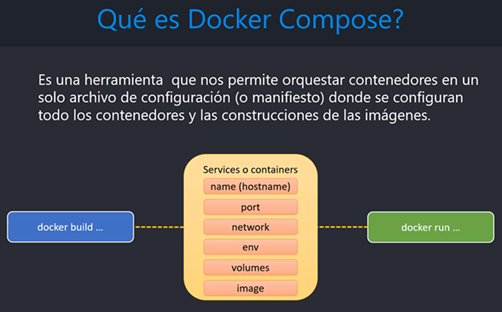

# Sección 11: Docker Compose: Orquestador para definir y ejecutar multi-contenedores

---

## [Docker Compose overview](https://docs.docker.com/compose/)

`Compose` es una herramienta para definir y ejecutar aplicaciones `Docker multicontenedor`. Con `Compose`, utilizas un
archivo `YAML` para configurar los servicios de tu aplicación. Luego, con un solo comando, creas e inicias todos los
servicios a partir de tu configuración.

`Compose` funciona en todos los entornos; `producción`, `staging`, `desarrollo`, `pruebas`, así como flujos de trabajo
`CI`. También dispone de comandos para gestionar todo el ciclo de vida de tu aplicación:

- Iniciar, detener y reconstruir servicios
- Ver el estado de los servicios en ejecución
- Transmitir la salida de registro de los servicios en ejecución
- Ejecutar un comando puntual en un servicio

Las características clave de `Compose` que lo hacen eficaz son:

- Disponer de múltiples entornos aislados en un único host
- Conservar los datos de volumen cuando se crean contenedores
- Recrear solo los contenedores que han cambiado
- Soportar variables y mover una composición entre entornos



### [The Compose file](https://docs.docker.com/compose/intro/compose-application-model/#the-compose-file)

Antes de empezar a crear el archivo `compose.yml` (en versiones anteriores era `docker-compose.yml`) veamos algunos
aspectos sobre él.

El archivo `Compose` es un archivo `YAML` que define:

- Version `(Optional)`
- Services `(Required)`
- Networks
- Volumes
- Configs
- Secrets

La ruta predeterminada para un archivo `Compose` es `compose.yaml` (preferido) o `compose.yml` que se coloca en el
directorio de trabajo. `Compose` también admite `docker-compose.yaml` y `docker-compose.yml` para la compatibilidad
con versiones anteriores. Si existen ambos archivos, `Compose` prefiere el canónico `compose.yaml`.

### [Elemento de nivel superior Versión](https://docs.docker.com/compose/compose-file/04-version-and-name/)

La propiedad de nivel superior `versión` está definida por la `Especificación Compose` para compatibilidad con versiones
anteriores. `Solo tiene carácter informativo`.

**Compose no utiliza la versión para seleccionar un esquema exacto para validar el archivo Compose, sino que prefiere
el esquema más reciente cuando está implementado.**

### [Elemento de nivel superior de los Servicios](https://docs.docker.com/compose/compose-file/05-services/)

Un `servicio `es una definición abstracta de un recurso informático dentro de una aplicación que **puede escalarse o
sustituirse independientemente de otros componentes**.
`Los servicios están respaldados por un conjunto de contenedores`, ejecutados por la plataforma de acuerdo con
los requisitos de replicación y las restricciones de ubicación. **Dado que los servicios están respaldados por
contenedores, se definen mediante una imagen Docker y un conjunto de argumentos de tiempo de ejecución.**
`Todos los contenedores de un servicio se crean de forma idéntica con estos argumentos.`

Un archivo `Compose` debe declarar un elemento de nivel superior de servicios como un mapa cuyas `claves` **son
representaciones de cadenas de nombres de servicios**, y cuyos `valores` **son definiciones de servicios.**
Una `definición de servicio` **contiene la configuración que se aplica a cada contenedor de servicio.**

**Cada servicio también puede incluir una sección de** `build`, **que define cómo crear la imagen Docker para el
servicio.** `Compose permite crear imágenes Docker utilizando esta definición de servicio.` Si no se utiliza,
la sección de construcción se ignora y el archivo `Compose` sigue considerándose válido.

A continuación se muestran algunos atributos usados dentro de un servicio:

- `build`, especifica la configuración de compilación para crear una imagen de contenedor a partir del código fuente,
  tal y como se define en la especificación de compilación de `Compose`.


- `container_name`, es una cadena que especifica un nombre de contenedor personalizado, **en lugar de
  un nombre generado por defecto.**


- `volumes`, definen rutas de host de montaje o `volúmenes con nombre` que son accesibles por contenedores
  de servicio. Puedes usar volúmenes para definir múltiples tipos de montajes; `volumen`, `bind`, `tmpfs` o `npipe`.

  > Para `reutilizar un volumen a través de múltiples servicios`, se debe declarar un `volumen con nombre` **en la clave
  > de volúmenes de nivel superior.**
  >
  > `La declaración de volúmenes de nivel superior` permite **configurar volúmenes con nombre que pueden reutilizarse en
  > varios servicios.** Para utilizar un volumen en varios servicios, debe conceder explícitamente acceso a cada
  > servicio mediante el atributo volumes.

- `networks`, capa que permite a los servicios comunicarse entre sí. `El elemento de nivel superior networks permite
  configurar redes con nombre que pueden reutilizarse en varios servicios`. Para utilizar una red en varios servicios,
  debes conceder explícitamente acceso a `cada servicio` utilizando el atributo `networks`.

  > Podríamos no configurar explícitamente un `networks` y en ese caso, por defecto, `Compose` configura una única red
  > para tu aplicación. Cada contenedor para un servicio se une a la red por defecto y es accesible por otros
  > contenedores en esa red, y detectable por ellos en un nombre de host idéntico al nombre del contenedor.

## Creando archivo de docker compose

Antes de crear el archivo `compose.yml` y sus respectivos servicios, veamos qué imágenes tenemos relacionados a este
proyecto y qué contenedores se están ejecutando actualmente.

Sobre las imágenes.

````bash
$ docker image ls
REPOSITORY       TAG             IMAGE ID       CREATED        SIZE
course-service   latest          092938a96244   3 days ago     270MB
user-service     latest          4fd59c6bcdb5   4 days ago     271MB
postgres         17-alpine       048d0cbdfc92   10 days ago    279MB
mysql            8.0.41-debian   4340b8ad7a7c   4 months ago   610MB
````

Sobre los contenedores.

````bash
$ docker container ls -a
CONTAINER ID   IMAGE                 COMMAND                  CREATED      STATUS          PORTS                               NAMES
b08a8300361b   postgres:17-alpine    "docker-entrypoint.s…"   5 days ago   Up 18 minutes   0.0.0.0:5433->5432/tcp              c-postgres
76ef3be3ad14   mysql:8.0.41-debian   "docker-entrypoint.s…"   5 days ago   Up 18 minutes   33060/tcp, 0.0.0.0:3307->3306/tcp   c-mysql
````

### Eliminando contenedores

Como vamos a usar `docker compose` para la creación de los servicios de contenedores, vamos a eliminar los dos
contenedores de bases de datos mostrados en el resultado anterior que fueron creados manualmente.

🚨 Recordemos que esas bases de datos contenerizadas están trabajando con volúmenes, por lo tanto, únicamente
eliminamos los contenedores.

````bash
$ docker container rm -f c-postgres c-mysql
c-postgres
c-mysql
````

Ahora, si volvemos a listar, veremos que ya no tenemos ningún contenedor.

````bash
$ docker container ls -a
CONTAINER ID   IMAGE     COMMAND   CREATED   STATUS    PORTS     NAMES
````

### A partir de imágenes, crea contenedores de bases de datos

En la raíz de nuestro proyecto `docker-kubernetes` creamos el archivo `compose.yml` y agregamos los siguientes dos
servicios para nuestras bases de datos de `mysql` y `postgres`.

````yml
services:
  s-mysql:
    image: mysql:8.0.41-debian
    container_name: c-mysql
    restart: unless-stopped
    ports:
      - '3307:3306'
    environment:
      MYSQL_ROOT_PASSWORD: magadiflo
      MYSQL_DATABASE: db_user_service
      MYSQL_USER: admin
      MYSQL_PASSWORD: magadiflo
    volumes:
      - mysql-data:/var/lib/mysql
    networks:
      - docker-kubernetes-net
    healthcheck:
      test: [ "CMD-SHELL", "mysqladmin ping -h 127.0.0.1 -u$${MYSQL_USER} -p$${MYSQL_PASSWORD}" ]
      interval: 10s
      timeout: 5s
      retries: 5

  s-postgres:
    image: postgres:17-alpine
    container_name: c-postgres
    restart: unless-stopped
    ports:
      - '5433:5432'
    environment:
      POSTGRES_DB: db_course_service
      POSTGRES_USER: postgres
      POSTGRES_PASSWORD: magadiflo
    volumes:
      - postgres-data:/var/lib/postgresql/data
    networks:
      - docker-kubernetes-net
    healthcheck:
      test: [ 'CMD-SHELL', 'pg_isready -U $${POSTGRES_USER} -d $${POSTGRES_DB}' ]
      interval: 10s
      timeout: 5s
      retries: 5

volumes:
  mysql-data:
    name: mysql-data
    external: true
  postgres-data:
    name: postgres-data
    external: true

networks:
  docker-kubernetes-net:
    name: docker-kubernetes-net
    external: true
````

**Donde**

- `s-mysql` y `s-postgres` son los dos únicos servicios que están definidos hasta el momento en el archivo
  `compose.yml`. Estos servicios utilizan una imagen pública de base de datos que se extrae del registro de `Docker Hub`
  y es a partir de esas imágenes que se crearán los contenedores.


- Como todos los servicios estarán en la misma red `docker-kubernetes-net`, debemos definir
  el `elemento de nivel superior networks` y luego a cada servicio definirle el networks `docker-kubernetes-net`.


- Trabajamos con `volumenes con nombre: mysql-data y postgres-data`, las cuales, además de ser
  definidas en cada servicio, deberán ser definidas en `la declaración de volúmenes de nivel superior`.


- Tanto al servicio de `mysql` como al servicio de `postgres` les hemos definido el atributo `healthcheck`. Pero,
  `¿Qué es un healthcheck?`.

El `healthcheck` es una funcionalidad en `Docker` que permite monitorear el estado de salud de un contenedor. Define
una serie de condiciones que `Docker` verificará periódicamente para determinar si el contenedor está funcionando
correctamente. Si el contenedor no pasa las pruebas de salud, se puede tomar acción, como reiniciar el contenedor o
marcarlo como `no saludable`.

Tomemos como ejemplo el `healthcheck` del servicio de `s-postgres`.

````yml
healthcheck:
  test: [ 'CMD-SHELL', 'pg_isready -U $${POSTGRES_USER} -d $${POSTGRES_DB}' ]
  interval: 10s
  timeout: 5s
  retries: 5
````

1. `test: [ 'CMD-SHELL', 'pg_isready -U $${POSTGRES_USER} -d $${POSTGRES_DB}' ]`
    - Este es el comando que `Docker` ejecuta para verificar si `PostgreSQL` está disponible y listo para aceptar
      conexiones.
    - `CMD-SHELL`: Indica que el comando será ejecutado en un `shell`, lo que permite usar el comando como si lo
      estuvieras ejecutando en la terminal.
    - `pg_isready`: Es una herramienta de `PostgreSQL` que se utiliza específicamente para verificar si el servidor de
      base de datos está disponible y listo para aceptar conexiones. No inicia una conexión real, pero revisa el estado
      del servidor.
    - `-U $${POSTGRES_USER}`: Especifica el usuario que se usará para realizar la comprobación.
    - `-d $${POSTGRES_DB}`: Indica la base de datos sobre la cual se está verificando la disponibilidad.

   > En resumen, este comando verifica que el servidor `PostgreSQL` esté corriendo y sea capaz de aceptar conexiones
   > para el usuario `postgres` en la base de datos `db_course_service`.

2. `interval: 10s`, este parámetro define el intervalo de tiempo entre cada ejecución del `healthcheck`, es decir, cada
   cuánto tiempo `Docker` ejecutará el comando de prueba. En este caso, el intervalo es de 10 segundos. `Docker`
   ejecutará la prueba cada 10 segundos mientras el contenedor esté corriendo.


3. `timeout: 5s`, este parámetro establece el tiempo máximo que `Docker` esperará a que la prueba de `healthcheck` se
   complete antes de considerarla fallida. Aquí se ha configurado un timeout de 5 segundos. Si el comando no devuelve
   una respuesta en ese tiempo, se considera que la prueba ha fallado.


4. `retries: 5`, este parámetro define cuántas veces `Docker` intentará ejecutar el `healthcheck` antes de marcar el
   contenedor como `no saludable`. En este caso, si la prueba falla 5 veces consecutivas, `Docker` marcará el contenedor
   como no saludable.

### Sobre el `$${POSTGRES_USER}`

En `Docker Compose` no existe un soporte directo para interpolación de variables de entorno dentro de los comandos de
`healthcheck`. Sin embargo, podemos solucionarlo utilizando variables de entorno dentro del contenedor para evitar
repetir valores.

Una forma es aprovechar que los valores de las variables de entorno definidos en el servicio (como `POSTGRES_USER` y
`POSTGRES_DB`) están disponibles dentro del contenedor, y podemos utilizarlas en el comando `test` del `healthcheck`.
Lo único que necesitamos es acceder a esas variables usando la siguiente sintaxis `$${POSTGRES_USER}`.

### 🔍 Qué sucede con `$${POSTGRES_USER}` en `compose.yml`

Cuando escribimos, por ejemplo:

````yml
test: [ 'CMD-SHELL', 'pg_isready -U $${POSTGRES_USER} -d $${POSTGRES_DB}' ]
````

`Docker Compose` interpreta el archivo `compose.yml` antes de pasárselo a `Docker`. Si solo escribimos
`${POSTGRES_USER}` (con un solo $), `Compose` intentará expandir la variable usando las variables de entorno del
sistema host (es decir, de donde ejecutas `docker compose up`). Pero si usamos `$$`, `Docker Compose` interpreta
eso como:

- `$$` → se convierte en un solo signo `$`.
- Por tanto, `$${POSTGRES_USER}` → se convierte en `${POSTGRES_USER}` dentro del contenedor, sin que `Compose` lo
  expanda.

### ✅ Qué significa esto en el contexto de healthcheck

El valor final que se pasará al contenedor será:

````bash
pg_isready -U ${POSTGRES_USER} -d ${POSTGRES_DB}
````

Dentro del contenedor, estas variables (`POSTGRES_USER`, `POSTGRES_DB`) sí existen como variables de entorno, gracias
a la sección `environment`, así que se resuelven correctamente cuando el shell las evalúa.

En resumen, el uso de `$$` en `$${POSTGRES_USER}` es un truco de `Docker Compose` para evitar que se expanda la
variable al momento de interpretar el archivo `yml`. En lugar de resolver la variable con el entorno del host,
`Docker Compose` deja la expresión `${POSTGRES_USER}` tal cual y la pasa al contenedor. Ya dentro del contenedor,
cuando se ejecuta el comando del `healthcheck`, el shell sí puede resolver `${POSTGRES_USER}` usando las variables
de entorno que fueron definidas en la sección `environment`.

**Nota 1**
> Cuando hablo de `expandir la variable` en el contexto de `Docker Compose` (y, en general, en programación
> y scripting), me refiero al proceso de reemplazar el nombre de la variable con su valor correspondiente. Es decir,
> la expansión es el acto de tomar una variable definida (como `POSTGRES_USER`) y sustituirla por su valor
> (por ejemplo, `postgres`) en el momento en que se procesa el archivo.

**Nota 2**
> Más adelante crearemos el contenedor para `course-service` quien depende de la base de datos de `PostgreSQL`. El
> servicio de `s-course-service` usará el atributo `depends_on`. Normalmente, combinamos el atributo `depends_on` con el
> atributo `healthcheck` que ya tenemos configurado en el servicio de `s-postgres`. El `healthcheck` indicará al
> servicio de `s-course-service` que espere a que la base de datos de `PostgreSQL` esté lista para que recién empiece a
> crearse. Pero eso lo veremos cuando creemos el servicio para `course-service`.

- En el archivo `compose.yml` también hemos definido el atributo `external: true` tanto para el `volumes` como para el
  `networks`. Esto es necesario, pues de esa manera le indicamos a `docker compose` que use los volúmenes o la red que
  ya existen y que fueron creados mediante la línea de comandos. Es decir, hasta este punto tenemos ya construido una
  red llamada `docker-kubernetes-net`, también tenemos construida el volumen `mysql-data` y `postgres-data` que fueron
  creados mediante la línea de comando (`sin usar Docker Compose`), así que si no colocamos el atributo
  `external: true`, no nos va a dejar ejecutar el comando de `docker compose` y, en cambio, nos mostrará los mensajes
  tal como se muestran a continuación.

    ````bash
    $ docker compose up -d
    time="2025-06-11T00:02:49-05:00" level=warning msg="a network with name docker-kubernetes-net exists but was not created by compose.\nSet `external: true` to use an existing network"
    network docker-kubernetes-net was found but has incorrect label com.docker.compose.network set to "" (expected: "docker-kubernetes-net")
    ````
  El mensaje que ves indica que la red `docker-kubernetes-net` ya existe en `Docker`, pero no fue creada por
  `Docker Compose`, lo que puede generar un conflicto, especialmente en la forma en que `Docker Compose` maneja las
  redes.<br><br>
  Como el mensaje sugiere, necesitas indicarle a `Docker Compose` que esta red es externa y que no debe intentar
  recrearla. Para hacer esto, debes ajustar la configuración de la red en tu archivo `compose.yml` añadiendo la
  opción `external: true`.<br><br>
  Cuando `Docker Compose` intenta crear una red con el mismo nombre de una red que ya existe fuera del contexto de
  `Docker Compose`, puede producir este tipo de advertencias. Al declarar la red como `external:true`, le estás diciendo
  a `Docker Compose` que no intente administrarla y que simplemente la use.

    ````bash
    $ docker compose up -d                                                                                                                                                            
    time="2025-06-11T00:03:38-05:00" level=warning msg="volume \"postgres-data\" already exists but was not created by Docker Compose. Use `external: true` to use an existing volume"
    time="2025-06-11T00:03:38-05:00" level=warning msg="volume \"mysql-data\" already exists but was not created by Docker Compose. Use `external: true` to use an existing volume"                                                                                                                                                                                                                                                                                                                                                      1.3s  ✔ Container c-mysql     Started
    ````
  El nuevo mensaje que te aparece es muy similar al caso de las redes: indica que los volúmenes `mysql-data` y
  `postgres-data` ya existen, pero no fueron creados por `Docker Compose`, lo que puede generar un conflicto.<br><br>
  Para solucionar esto, al igual que con las redes, debes indicar que estos volúmenes son externos y que
  `Docker Compose`solo debe utilizarlos sin intentar crearlos o gestionarlos.<br><br>
  Puedes agregar la propiedad `external: true` a los volúmenes en tu archivo `compose.yml` para indicarle a
  `Docker Compose` que los volúmenes ya existen y no debe crearlos de nuevo.<br><br>
  Esto ocurre porque los volúmenes fueron creados previamente (posiblemente de forma manual o en otro contexto), y
  `Docker Compose` no fue quien los gestionó inicialmente. Al igual que con las redes, `Docker Compose` intenta crear y
  administrar sus propios volúmenes, y si ya existe uno con el mismo nombre, esto genera un conflicto.

### Ejecutando Docker Compose para crear servicios de contenedores de bases de datos

Antes de ejecutar nuestro `compose.yml`, veamos las redes, volúmenes y contenedores que tenemos actualmente. Debemos
notar que tenemos la red `docker-kubernetes-net` ya creada, también tenemos los volúmenes `mysql-data` y `postgres-data`
ya creados. Lo único que no tenemos creados son los contenedores.

````bash
$ docker network ls
NETWORK ID     NAME                    DRIVER    SCOPE
f7fda8e506d0   bridge                  bridge    local
f5cc994b8f90   docker-kubernetes-net   bridge    local
e067f6421fbb   host                    host      local
10b2c1c97ecf   none                    null      local

$ docker volume ls
DRIVER    VOLUME NAME
local     mysql-data
local     postgres-data

$ docker container ls -a
CONTAINER ID   IMAGE            COMMAND                  CREATED       STATUS                     PORTS     NAMES
````

Ejecutamos `Docker Compose` con el siguiente comando y vemos que los dos contenedores de bases de datos se crean
correctamente.

````bash
D:\programming\spring\01.udemy\02.andres_guzman\08.docker_kubernetes\docker-kubernetes (feature/section-11)
λ docker compose up -d                                                                                     
[+] Running 2/2                                                                                            
 ✔ s-mysql Pulled                                                                                          
 ✔ s-postgres Pulled                                                                                       
[+] Running 2/2                                                                                            
 ✔ Container c-mysql     Started                                                                           
 ✔ Container c-postgres  Started                                                                                                                                                   
````

Si listamos los dos contenedores, veremos que ambos está corriendo sin problemas.

````bash
$  docker container ls -a
CONTAINER ID   IMAGE                 COMMAND                  CREATED          STATUS                    PORTS                               NAMES
e27dcd1ec6f8   postgres:17-alpine    "docker-entrypoint.s…"   48 seconds ago   Up 39 seconds (healthy)   0.0.0.0:5433->5432/tcp              c-postgres
1b2c70301c59   mysql:8.0.41-debian   "docker-entrypoint.s…"   48 seconds ago   Up 39 seconds (healthy)   33060/tcp, 0.0.0.0:3307->3306/tcp   c-mysql
````

Inspeccionamos el contenedor `c-postgres`. Debemos notar que en el apartado de `Test`, vemos el comando
`"pg_isready -U ${POSTGRES_USER} -d ${POSTGRES_DB}"` el cual está usando variables de entorno como el
`${POSTGRES_USER}`. Aquí, dentro del contenedor, ya se pasa con `un solo dólar ${POSTGRES_USER}`, mientras que en el
archivo `compose.yml` lo definimos con dos dólares `$${POSTGRES_USER}`, ese es el truco, usar 2 dólares en el archivo
`compose.yml` para que dentro del contenedor pase con 1 dólar. Los valores de estas variables de entorno las
encontramos en el atributo `Env`.

````bash
$ docker container inspect c-postgres
[
    {
        ...
        "Config": {
            ...
            "Env": [
                "POSTGRES_USER=postgres",
                "POSTGRES_PASSWORD=magadiflo",
                "POSTGRES_DB=db_course_service",
                "PATH=/usr/local/sbin:/usr/local/bin:/usr/sbin:/usr/bin:/sbin:/bin",
                "GOSU_VERSION=1.17",
                "LANG=en_US.utf8",
                "PG_MAJOR=17",
                "PG_VERSION=17.5",
                "PG_SHA256=fcb7ab38e23b264d1902cb25e6adafb4525a6ebcbd015434aeef9eda80f528d8",
                "DOCKER_PG_LLVM_DEPS=llvm19-dev \t\tclang19",
                "PGDATA=/var/lib/postgresql/data"
            ],
            "Cmd": [
                "postgres"
            ],
            "Healthcheck": {
                "Test": [
                    "CMD-SHELL",
                    "pg_isready -U ${POSTGRES_USER} -d ${POSTGRES_DB}"
                ],
                "Interval": 10000000000,
                "Timeout": 5000000000,
                "Retries": 5
            },
            "Image": "postgres:17-alpine",
            "Volumes": {
                "/var/lib/postgresql/data": {}
            },
           ...
        }
    }
]
````

Inspeccionamos el contenedor `c-mysql`.

````bash
$ docker container inspect c-mysql
[
    {
        ...
        "Config": {
            "Hostname": "1b2c70301c59",
            "Domainname": "",
            "User": "",
            "AttachStdin": false,
            "AttachStdout": true,
            "AttachStderr": true,
            "ExposedPorts": {
                "3306/tcp": {},
                "33060/tcp": {}
            },
            "Tty": false,
            "OpenStdin": false,
            "StdinOnce": false,
            "Env": [
                "MYSQL_DATABASE=db_user_service",
                "MYSQL_USER=admin",
                "MYSQL_PASSWORD=magadiflo",
                "MYSQL_ROOT_PASSWORD=magadiflo",
                "PATH=/usr/local/sbin:/usr/local/bin:/usr/sbin:/usr/bin:/sbin:/bin",
                "GOSU_VERSION=1.17",
                "MYSQL_MAJOR=8.0",
                "MYSQL_VERSION=8.0.41-1debian12"
            ],
            "Cmd": [
                "mysqld"
            ],
            "Healthcheck": {
                "Test": [
                    "CMD-SHELL",
                    "mysqladmin ping -h 127.0.0.1 -u${MYSQL_USER} -p${MYSQL_PASSWORD}"
                ],
                "Interval": 10000000000,
                "Timeout": 5000000000,
                "Retries": 5
            },
            "Image": "mysql:8.0.41-debian",
            "Volumes": {
                "/var/lib/mysql": {}
            },
            "WorkingDir": "",
            "Entrypoint": [
                "docker-entrypoint.sh"
            ],
            "OnBuild": null,
            "Labels": {
                "com.docker.compose.config-hash": "84e33592b9fed512d4545d4f9d50200496213a6ce07c4b770d899f1e5e574f29",
                "com.docker.compose.container-number": "1",
                "com.docker.compose.depends_on": "",
                "com.docker.compose.image": "sha256:4340b8ad7a7ca86dc7f4abe876bc0c8addb3636b0d1be5e660573153540a392c",
                "com.docker.compose.oneoff": "False",
                "com.docker.compose.project": "docker-kubernetes",
                "com.docker.compose.project.config_files": "D:\\programming\\spring\\01.udemy\\02.andres_guzman\\08.docker_kubernetes\\docker-kubernetes\\compose.yml",
                "com.docker.compose.project.working_dir": "D:\\programming\\spring\\01.udemy\\02.andres_guzman\\08.docker_kubernetes\\docker-kubernetes",
                "com.docker.compose.service": "s-mysql",
                "com.docker.compose.version": "2.36.0"
            }
        ...
    }
]
````

Comprobamos que el contenedor `c-postgres` contiene los datos almacenados en el volumen.

````bash
$ docker container exec -it c-postgres /bin/sh
/ # psql -U postgres -d db_course_service
psql (17.5)
Type "help" for help.

db_course_service=# \dt
            List of relations
 Schema |     Name     | Type  |  Owner
--------+--------------+-------+----------
 public | course_users | table | postgres
 public | courses      | table | postgres
(2 rows)

db_course_service=# SELECT * FROM courses;
 id |         name
----+----------------------
  1 | Spring Boot 3
  2 | Spring WebFlux
  3 | Reactive Programming
  4 | Docker
  5 | Kubernetes
(5 rows)

db_course_service=#
````

Comprobamos que el contenedor `c-mysql` contiene los datos almacenados en el volumen.

````bash
$ docker container exec -it c-mysql /bin/sh
# mysql -uadmin -p
Enter password:
Welcome to the MySQL monitor.  Commands end with ; or \g.
Your MySQL connection id is 73
Server version: 8.0.41 MySQL Community Server - GPL

Copyright (c) 2000, 2025, Oracle and/or its affiliates.

Oracle is a registered trademark of Oracle Corporation and/or its
affiliates. Other names may be trademarks of their respective
owners.

Type 'help;' or '\h' for help. Type '\c' to clear the current input statement.

mysql> SHOW DATABASES;
+--------------------+
| Database           |
+--------------------+
| db_user_service    |
| information_schema |
| performance_schema |
+--------------------+
3 rows in set (0.00 sec)

mysql> USE db_user_service;
Reading table information for completion of table and column names
You can turn off this feature to get a quicker startup with -A

Database changed
mysql> SHOW TABLES;
+---------------------------+
| Tables_in_db_user_service |
+---------------------------+
| users                     |
+---------------------------+
1 row in set (0.00 sec)

mysql> SELECT * FROM users;
+----+--------------------+----------+----------+
| id | email              | name     | password |
+----+--------------------+----------+----------+
|  1 | lesly@gmail.com    | Lesly    | 123456   |
|  4 | kiara@gmail.com    | Kiara    | 123456   |
|  5 | milagros@gmail.com | Milagros | 123456   |
|  6 | susana@gmail.com   | Susana   | 123456   |
|  7 | briela@gmail.com   | Briela   | 123456   |
+----+--------------------+----------+----------+
5 rows in set (0.00 sec)

mysql>
````

### A partir de imágenes, crea contenedores de microservicios de usuarios y cursos

En el apartado anterior agregamos al archivo `compose.yml` los servicios para nuestros contenedores de bases de datos.
En esta sección veremos cómo agregar los servicios para los contenedores de nuestros microservicios.

Observemos que actualmente tenemos construida nuestras imágenes de los microservicios `user-service` y
`course-service`. Entonces, a partir de esas imágenes ya construidas, definiremos en el archivo `compose.yml` la
configuración necesaria para crear los servicios para los contenedores de nuestros dos microservicios.

````bash
$ docker image ls
REPOSITORY       TAG             IMAGE ID       CREATED        SIZE
course-service   latest          092938a96244   5 days ago     270MB
postgres         17-alpine       f40315d0e8a6   5 days ago     279MB
user-service     latest          4fd59c6bcdb5   6 days ago     271MB
mysql            8.0.41-debian   4340b8ad7a7c   4 months ago   610MB
````

A continuación se muestra únicamente la configuración de los servicios correspondientes a nuestras dos aplicaciones.
Estos servicios están definidos en el `compose.yml`.

````bash
services:
  s-user-service:
    image: user-service:latest
    container_name: c-user-service
    restart: unless-stopped
    ports:
      - '8001:8001'
    env_file: ./business-domain/user-service/.env
    networks:
      - docker-kubernetes-net
    depends_on:
      s-mysql:
        condition: service_healthy

  s-course-service:
    image: course-service:latest
    container_name: c-course-service
    restart: unless-stopped
    ports:
      - '8002:8002'
    env_file: ./business-domain/course-service/.env
    networks:
      - docker-kubernetes-net
    depends_on:
      s-postgres:
        condition: service_healthy
````

**Donde**

- Hemos agregado 2 servicios `s-user-service` y `s-course-service`.


- En `image` estamos definiendo la imagen que vamos a usar y que precisamente ya los tenemos construidos y están
  alojados en la plataforma de `Docker` de nuestra máquina local. Más adelante veremos cómo usar `compose.yml` para que
  él sea quien inicie la construcción de la imagen apoyándonos del `Dockerfile`.


- La opción `depends_on` hace referencia al servicio del cual depende. Por ejemplo, servicio `s-course-service` depende
  del servicio `s-postgres`.


- El `s-courser-service` depende del servicio `s-postgres` y la condición para que `s-course-service` inicie, es que el
  servicio `s-postgres` debe estar en `service_healthy`. Eso significa que el servicio dependiente solo arrancará una
  vez que el servicio del que depende haya pasado su `healthcheck` y esté en estado `healthy` (saludable). Es una medida
  de seguridad para garantizar que la base de datos esté realmente lista para recibir conexiones antes de que el
  microservicio intente interactuar con ella. Por esa razón es que en el servicio de `s-postgres` usamos el atributo
  `healthcheck` y su `test`.


- `restart` define la política que la plataforma aplica al terminar el contenedor. Los distintos valores son:
    - `no`: La política de reinicio por defecto. No reinicia el contenedor bajo ninguna circunstancia.
    - `always`: La política siempre reinicia el contenedor hasta su eliminación.
    - `on-failure`: La política reinicia el contenedor si el código de salida indica un error.
    - `unless-stopped`: La política `unless-stopped` reinicia automáticamente el contenedor sin importar el código de
      salida (si falló o no), pero deja de reiniciarlo si el contenedor ha sido detenido manualmente por el usuario. No
      se reiniciará nuevamente hasta que sea iniciado manualmente, incluso después de reiniciar Docker o el sistema.

## Ejecuta docker compose up y down

Antes de ejecutar el archivo `compose.yml` necesitamos asegurarnos de no tener levantado ningún contenedor de nuestros
servicios. Recordemos que anteriormente usamos el comando `docker compose up -d` para levantar los servicios de los
contenedores de bases de datos, así que en este momento simplemente ejecutamos `docker compose down` para eliminar
los contenedores que ya teníamos levantado de esas bases de datos. Es importante resaltar que dicho comando lo debemos
ejecutar en la misma raíz donde se encuentra el archivo `compose.yml`.

En resumen, debemos iniciar con la red existente `docker-kubernetes-net`, los volúmenes existentes `mysql-data` y
`postgres-data` y con ningún contenedor.

> `Nota`, en el comentario anterior digo que debemos iniciar con la red y volúmenes `existentes`, es porque esos
> componentes ya los habíamos creado desde un inicio con línea de comandos, así que como vamos a usar `docker compose`
> simplemente los vamos a reutilizar.

````bash
$ docker network ls
NETWORK ID     NAME                    DRIVER    SCOPE
5216d833c074   bridge                  bridge    local
f5cc994b8f90   docker-kubernetes-net   bridge    local
e067f6421fbb   host                    host      local
10b2c1c97ecf   none                    null      local

$ docker volume ls
DRIVER    VOLUME NAME
local     mysql-data
local     postgres-data

$ docker container ls -a
CONTAINER ID   IMAGE     COMMAND   CREATED   STATUS    PORTS     NAMES
````

Una vez que tenemos todo listo, nos posicionamos en la raíz donde se encuentra el archivo `compose.yml` y ejecutamos el
siguiente comando.

````bash
D:\programming\spring\01.udemy\02.andres_guzman\08.docker_kubernetes\docker-kubernetes (feature/section-11) 
$ docker compose up -d                                                                                      
[+] Running 4/4                                                                                             
 ✔ Container c-postgres        Healthy                                                                      
 ✔ Container c-mysql           Healthy                                                                      
 ✔ Container c-course-service  Started                                                                      
 ✔ Container c-user-service    Started                                                                      
````

**Donde**

- `docker compose up`, construye, (re)crea, inicia y adjunta a contenedores para un servicio. A menos que ya se estén
  ejecutando; este comando también inicia cualquier servicio vinculado.
- `-d o --detach`, inicia los contenedores en segundo plano y los deja funcionando.

Verificamos que los 4 contenedores se estén ejecutando correctamente, es decir, tengan el estado en `Up`.

````bash
$ docker container ls -a
CONTAINER ID   IMAGE                   COMMAND                  CREATED              STATUS                        PORTS                               NAMES
92ed8273a7e6   user-service:latest     "/__cacert_entrypoin…"   About a minute ago   Up About a minute             0.0.0.0:8001->8001/tcp              c-user-service
aa982a66e44b   course-service:latest   "/__cacert_entrypoin…"   About a minute ago   Up About a minute             0.0.0.0:8002->8002/tcp              c-course-service
fc7240594bad   postgres:17-alpine      "docker-entrypoint.s…"   About a minute ago   Up About a minute (healthy)   0.0.0.0:5433->5432/tcp              c-postgres
4a54e7d1aeda   mysql:8.0.41-debian     "docker-entrypoint.s…"   About a minute ago   Up About a minute (healthy)   33060/tcp, 0.0.0.0:3307->3306/tcp   c-mysql
````

Ahora, con una sola petición al backend, comprobaremos que todos los microservicios y bases de datos estén funcionando
correctamente. Esta petición buscará todos los cursos existentes y nos traerá además, los usuarios que estén
relacionados con cada curso.

````bash
$ curl -v -G --data "loadRelations=true" http://localhost:8002/api/v1/courses | jq
>
< HTTP/1.1 200
< Content-Type: application/json
< Transfer-Encoding: chunked
< Date: Thu, 12 Jun 2025 05:01:10 GMT
<
[
  {
    "id": 1,
    "name": "Spring Boot 3",
    "users": [
      {
        "id": 4,
        "name": "Kiara",
        "email": "kiara@gmail.com",
        "password": "123456"
      },
      {
        "id": 5,
        "name": "Milagros",
        "email": "milagros@gmail.com",
        "password": "123456"
      }
    ]
  },
  {...}
]
````

### 📢 Importante

Repasemos rápidamente los servicios que tenemos en el `compose.yml` y el nombre que le dimos a los contenedores de
dichos servicios en el atributo `container_name`.

| Servicios        | Container Name   |
|------------------|------------------|
| s-mysql          | c-mysql          |
| s-postgres       | c-postgres       |
| s-user-service   | c-user-service   |
| s-course-service | c-course-service |

Ahora tomemos como ejemplo las variables de entorno definidas en el archivo `.env` del microservicio `course-service`:

````bash
# Container
CONTAINER_PORT=8002

# Database
DB_HOST=c-postgres
DB_PORT=5432
DB_NAME=db_course_service
DB_USERNAME=postgres
DB_PASSWORD=magadiflo

# Communication with microservice user-service
USER_SERVICE_HOST=c-user-service
USER_SERVICE_PORT=8001
````

- Observa que en `DB_HOST` se está utilizando el valor del `container_name` definido en `compose.yml`, es decir,
  `c-postgres`.
- De igual forma, en `USER_SERVICE_HOST` se está usando `c-user-service`, también tomado del `container_name`.

### ⚠️ ¿Qué es lo que quiero decir con esto?

Cuando trabajemos con `Docker Compose`, lo ideal es que `✅ utilicemos el nombre del servicio` *(no el del contenedor)*
definido en el archivo `compose.yml` para permitir la comunicación entre microservicios.

Cuando no se especifica una red externa, `Docker Compose` crea automáticamente una red interna para los servicios, y
cada uno puede ser alcanzado por su nombre de servicio. En nuestro caso, estamos utilizando una red externa ya creada
previamente (`docker-kubernetes-net`), y `Docker Compose` la aprovecha para permitir esa misma comunicación entre
servicios.

En nuestro caso, el microservicio `course-service` puede comunicarse con `user-service` utilizando el nombre del
servicio: `s-user-service`. Por lo tanto, una llamada HTTP se realizaría así:

````bash
http://s-user-service:<puerto>
````

Donde `<puerto>` corresponde al puerto interno configurado en la propiedad `server.port` del servicio destino.

En resumen:

> ✅ Usa el `nombre del servicio` para la comunicación entre microservicios.

Aunque también funcionaría usar el `container_name` (porque `Docker` permite que los contenedores se comuniquen entre
sí dentro de la red), no es lo más recomendable por las siguientes razones:

1. `Cambios en el nombre del contenedor`: Si decides cambiar el `container_name` en el `compose.yml`, deberás actualizar
   todas las referencias en tu código. En cambio, el nombre del servicio tiende a ser más estable.


2. `Consistencia y legibilidad`: Usar el nombre del servicio hace que el código sea más claro y coherente. Otras
   personas (o tú mismo en el futuro) podrán entender rápidamente que se está haciendo referencia a un servicio definido
   en `Docker Compose`.


3. `Escalabilidad`: Si en el futuro decides escalar tu servicio (por ejemplo, ejecutando múltiples instancias de un
   mismo microservicio), podrías enfrentar problemas si estás utilizando `container_name`. Esto se debe a que Docker
   Compose genera nombres únicos para cada contenedor basado en el nombre del servicio y el número de instancia (por
   ejemplo, `s-user-service_1`, `s-user-service_2`, etc.), lo que significa que el `container_name` no será el mismo
   para todas las instancias y no podrás referenciarlo de manera uniforme.

Por todas estas razones, se recomienda utilizar el nombre del servicio en lugar del `container_name` para la
comunicación entre microservicios en `Docker Compose`. Esta práctica mejora la flexibilidad, escalabilidad y
mantenibilidad de tu aplicación.

A partir de lo mencionado, vamos a actualizar nuestras variables de entorno para usar el nombre del servicio en lugar
del nombre del contenedor. Esto es especialmente importante ahora que estamos trabajando con `Docker Compose` y nos
beneficiaremos del sistema de resolución de nombres que ofrece.

A continuación, se muestra el contenido actualizado del archivo `.env` del microservicio `course-service`, el cual se
conecta a los servicios `s-postgres` y `s-user-service`:

````bash
# Container
CONTAINER_PORT=8002

# Database
DB_HOST=s-postgres
DB_PORT=5432
DB_NAME=db_course_service
DB_USERNAME=postgres
DB_PASSWORD=magadiflo

# Communication with microservice user-service
USER_SERVICE_HOST=s-user-service
USER_SERVICE_PORT=8001
````

Lo mismo haremos en el archivo `.env` del microservicio `user-service`.

````bash
# Container
CONTAINER_PORT=8001
SPRING_PROFILES_ACTIVE=default

# Database
DB_HOST=s-mysql
DB_PORT=3306
DB_NAME=db_user_service
DB_USERNAME=admin
DB_PASSWORD=magadiflo

# Communication with microservice course-service
COURSE_SERVICE_HOST=s-course-service
COURSE_SERVICE_PORT=8002
````

Antes de ejecutar `docker compose` es necesario detener los contenedores que anteriormente habíamos ejecutado. Para
eso simplemente ejecutamos:

````bash
$ docker compose down
````

Volvemos a ejecutar el comando de `docker compose` para levantar los contenedores.

````bash
D:\programming\spring\01.udemy\02.andres_guzman\08.docker_kubernetes\docker-kubernetes (feature/section-11)
$ docker compose up -d                                                                                     
[+] Running 4/4                                                                                            
 ✔ Container c-postgres        Healthy                                                                     
 ✔ Container c-mysql           Healthy                                                                     
 ✔ Container c-user-service    Started                                                                     
 ✔ Container c-course-service  Started                                                                     
````

Verificamos que los contenedores se han levantado correctamente.

````bash
$ docker container ls -a
CONTAINER ID   IMAGE                   COMMAND                  CREATED              STATUS                        PORTS                               NAMES
37873d9cf7dd   course-service:latest   "/__cacert_entrypoin…"   About a minute ago   Up About a minute             0.0.0.0:8002->8002/tcp              c-course-service
4888af62bd30   user-service:latest     "/__cacert_entrypoin…"   About a minute ago   Up About a minute             0.0.0.0:8001->8001/tcp              c-user-service
d0e6f0411ce9   postgres:17-alpine      "docker-entrypoint.s…"   About a minute ago   Up About a minute (healthy)   0.0.0.0:5433->5432/tcp              c-postgres
9fbe6ecfa2a6   mysql:8.0.41-debian     "docker-entrypoint.s…"   About a minute ago   Up About a minute (healthy)   33060/tcp, 0.0.0.0:3307->3306/tcp   c-mysql
````

Ahora realizamos una petición al backend donde vemos la interacción de los 4 contenedores.

````bash
$ curl -v -G --data "loadRelations=true" http://localhost:8002/api/v1/courses | jq
>
< HTTP/1.1 200
< Content-Type: application/json
< Transfer-Encoding: chunked
< Date: Fri, 13 Jun 2025 05:12:36 GMT
<
[
  {
    "id": 1,
    "name": "Spring Boot 3",
    "users": [
      {
        "id": 4,
        "name": "Kiara",
        "email": "kiara@gmail.com",
        "password": "123456"
      },
      {
        "id": 5,
        "name": "Milagros",
        "email": "milagros@gmail.com",
        "password": "123456"
      }
    ]
  },
  {
    "id": 2,
    "name": "Spring WebFlux",
    "users": [
      {
        "id": 6,
        "name": "Susana",
        "email": "susana@gmail.com",
        "password": "123456"
      }
    ]
  },
  {...}
]
````

Como resultado vemos que nos está trayendo los datos solicitados. De esta manera comprobamos que el
`usar el nombre de los servicios` sí está funcionando sin problemas.

### 📌 Eliminando contenedores creados con docker compose (`docker compose down`)

Finalmente, decíamos que para eliminar los contenedores creados con `docker compose` debíamos ejecutar el comando
`docker compose down`, pero hasta ahora no he mostrado un ejemplo. Así que vamos a eliminar los cuatro contenedores
que creamos anteriormente con `docker compose`.

Listando los cuatro contenedores creados anteriormente con docker compose.

````bash
$ docker container ls -a
CONTAINER ID   IMAGE                   COMMAND                  CREATED         STATUS                   PORTS                               NAMES
37873d9cf7dd   course-service:latest   "/__cacert_entrypoin…"   6 minutes ago   Up 6 minutes             0.0.0.0:8002->8002/tcp              c-course-service
4888af62bd30   user-service:latest     "/__cacert_entrypoin…"   6 minutes ago   Up 6 minutes             0.0.0.0:8001->8001/tcp              c-user-service
d0e6f0411ce9   postgres:17-alpine      "docker-entrypoint.s…"   6 minutes ago   Up 6 minutes (healthy)   0.0.0.0:5433->5432/tcp              c-postgres
9fbe6ecfa2a6   mysql:8.0.41-debian     "docker-entrypoint.s…"   6 minutes ago   Up 6 minutes (healthy)   33060/tcp, 0.0.0.0:3307->3306/tcp   c-mysql
````

Procedemos a eliminar los contenedores usando el comando `docker compose down`.

````bash
D:\programming\spring\01.udemy\02.andres_guzman\08.docker_kubernetes\docker-kubernetes (feature/section-11)
$ docker compose down                                                                                      
[+] Running 4/4                                                                                            
 ✔ Container c-course-service  Removed                                                                     
 ✔ Container c-user-service    Removed                                                                     
 ✔ Container c-postgres        Removed                                                                     
 ✔ Container c-mysql           Removed                                                                                                                                     
````

Si listamos los contenedores veremos que ya no tenemos ninguno.

````bash
$ docker container ls -a
CONTAINER ID   IMAGE     COMMAND   CREATED   STATUS    PORTS     NAMES
````
