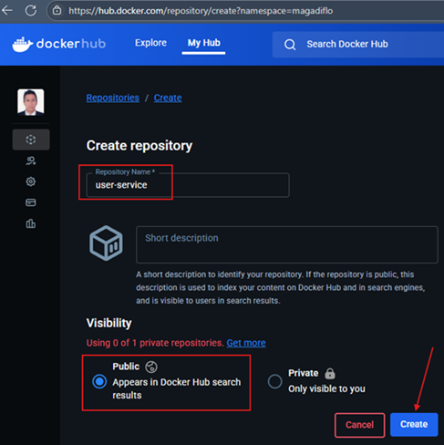
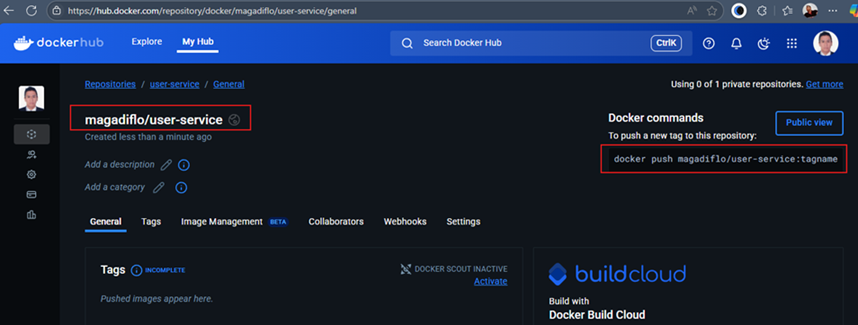
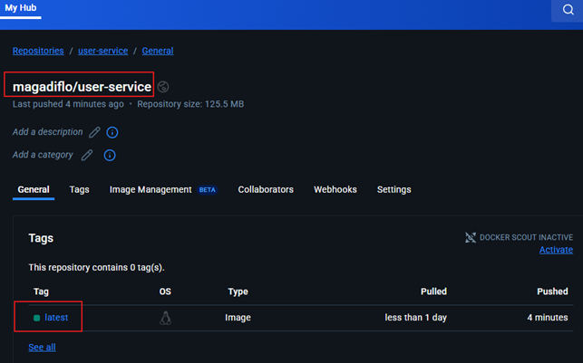

# Sección 12: Docker Hub - Repositorio para compartir imágenes en la nube

---

## ¿Qué es Docker Hub?

`Docker Hub` es un servicio en la nube proporcionado por `Docker` que actúa como un `registro de imágenes de Docker`,
lo que significa que almacena y distribuye `imágenes de contenedores Docker`. Es el repositorio público más grande
para imágenes `Docker`, y ofrece tanto repositorios públicos como privados.

### Características principales de Docker Hub:

1. `Almacenamiento de imágenes`: Permite a los desarrolladores subir (`push`) sus imágenes de contenedores para
   compartirlas o usarlas en diferentes entornos. También puedes descargar (`pull`) imágenes para utilizarlas localmente
   o en tus servidores.
2. `Imágenes oficiales`: Docker Hub aloja imágenes oficiales de software común, como mysql, nginx, redis, ubuntu, entre
   otros. Estas imágenes son mantenidas y verificadas por los equipos oficiales de desarrollo de ese software,
   asegurando calidad y seguridad.
3. `Imágenes públicas y privadas`:
    - `Públicas`: Cualquiera puede acceder y descargar estas imágenes.
    - `Privadas`: Solo el propietario o usuarios autorizados pueden acceder a estas imágenes. Docker Hub permite
      almacenar imágenes privadas si no quieres que tu código o configuración esté disponible para todo el mundo.
4. `Integración continua`: Docker Hub se puede integrar con plataformas como GitHub o Bitbucket para construir
   automáticamente imágenes cuando se hacen cambios en el código.
5. `Equipos y organizaciones`: Facilita la colaboración entre equipos al permitir que varias personas dentro de una
   organización accedan a las imágenes privadas o compartidas.
6. `Distribución global`: Como está basado en la nube, Docker Hub permite descargar imágenes rápidamente desde cualquier
   parte del mundo.

## Crea nuestro repositorio en Docker Hub y envía imagen con push

En este apartado almacenaremos las imágenes de nuestros microservicios en `Docker Hub`. Para eso necesitamos ingresar
a la web de [hub.docker](https://hub.docker.com/) con nuestras credenciales previamente registradas.

### Crea repositorio en Docker Hub

Lo primero que haremos será crear los repositorios en `Docker Hub` para nuestros microservicios `user-service` y
`course-service`.

> Para no repetir los pasos, este ejemplo se basará en el microservicio `user-service`, obviamente, los mismos pasos
> se aplicarán al microservicio `course-service`.

1. Crea un repositorio para la imagen a subir. El nombre del repositorio será igual al nombre del microservicio cuya
   imagen queremos subir a `Docker Hub`, en nuestro caso, el repositorio se llamará `user-service`.



2. Luego de haber creado el repositorio, veremos la siguiente pantalla.



Hay dos cosas importantes que debemos resaltar luego de la creación del repositorio.

1. El nombre completo de la imagen que subiremos a `Docker Hub` debe ser igual al `<Namespace>/<Repository_name>`. Donde
   el `<Namespace>` es el nombre del usuario y el `<Respository_name>` el nombre del repositorio que creamos en
   `Docker Hub`. En nuestro caso, la imagen a `pushear` desde el local debe tener este nombre completo
   `magadiflo/user-service`.


2. Observemos que luego de la creación del repositorio en docker hub, se nos muestra el comando de ejemplo para poder
   enviar una nueva imagen a este repositorio. El comando sería: `docker push magadiflo/user-service:tagname`.

### Enviando imagen desde local hacia Docker Hub

Primero vamos a levantar los contenedores con `Docker Compose`, aprovecharemos el comando para reconstruir las imágenes
de los microservicios.

````bash
D:\programming\spring\01.udemy\02.andres_guzman\08.docker_kubernetes\docker-kubernetes (feature/section-12)                                                       
$ docker compose up -d --build                                                                                                                                    
Compose can now delegate builds to bake for better performance.                                                                                                   
 To do so, set COMPOSE_BAKE=true.                                                                                                                                 
[+] Building 1.6s (44/44) FINISHED                                                                                                                                
 => [s-user-service internal] load build definition from Dockerfile                                                                                               
 => => transferring dockerfile: 901B                                                                                                                              
 => [s-course-service internal] load build definition from Dockerfile                                                                                             
 => => transferring dockerfile: 794B                                                                                                                              
 => [s-user-service internal] load metadata for docker.io/library/eclipse-temurin:21-jdk-alpine                                                                   
 => [s-user-service internal] load metadata for docker.io/library/eclipse-temurin:21-jre-alpine                                                                   
 => [s-user-service auth] library/eclipse-temurin:pull token for registry-1.docker.io                                                                             
 => [s-course-service internal] load .dockerignore                                                                                                                
 => => transferring context: 2B                                                                                                                                   
 => [s-user-service internal] load .dockerignore                                                                                                                  
 => => transferring context: 214B                                                                                                                                 
 => [s-user-service dependencies 1/9] FROM docker.io/library/eclipse-temurin:21-jdk-alpine@sha256:2f2f553ce09d25e2d2f0f521ab94cd73f70c9b21327a29149c23a2b63b8e29a0
 => [s-user-service builder 1/4] FROM docker.io/library/eclipse-temurin:21-jre-alpine@sha256:8728e354e012e18310faa7f364d00185277dec741f4f6d593af6c61fc0eb15fd     
 => [s-user-service internal] load build context                                                                                                                  
 => => transferring context: 5.25kB                                                                                                                               
 => [s-course-service internal] load build context                                                                                                                
 => => transferring context: 3.77kB                                                                                                                               
 => CACHED [s-course-service builder 2/4] WORKDIR /app                                                                                                            
 => CACHED [s-course-service runner 3/7] RUN mkdir ./logs                                                                                                         
 => CACHED [s-course-service dependencies 2/9] WORKDIR /app                                                                                                       
 => CACHED [s-user-service dependencies 3/9] COPY ./mvnw ./                                                                                                       
 => CACHED [s-user-service dependencies 4/9] COPY ./.mvn ./.mvn                                                                                                   
 => CACHED [s-user-service dependencies 5/9] COPY ./pom.xml ./                                                                                                    
 => CACHED [s-user-service dependencies 6/9] RUN sed -i -e 's/\r$//' ./mvnw                                                                                       
 => CACHED [s-user-service dependencies 7/9] RUN ./mvnw dependency:go-offline                                                                                     
 => CACHED [s-user-service dependencies 8/9] COPY ./src ./src                                                                                                     
 => CACHED [s-user-service dependencies 9/9] RUN ./mvnw clean package -DskipTests                                                                                 
 => CACHED [s-user-service builder 3/4] COPY --from=dependencies /app/target/*.jar ./app.jar                                                                      
 => CACHED [s-user-service builder 4/4] RUN java -Djarmode=layertools -jar app.jar extract                                                                        
 => CACHED [s-user-service runner 4/7] COPY --from=builder /app/dependencies ./                                                                                   
 => CACHED [s-user-service runner 5/7] COPY --from=builder /app/spring-boot-loader ./                                                                             
 => CACHED [s-user-service runner 6/7] COPY --from=builder /app/snapshot-dependencies ./                                                                          
 => CACHED [s-user-service runner 7/7] COPY --from=builder /app/application ./                                                                                    
 => CACHED [s-course-service dependencies 3/9] COPY ./mvnw ./                                                                                                     
 => CACHED [s-course-service dependencies 4/9] COPY ./.mvn ./.mvn                                                                                                 
 => CACHED [s-course-service dependencies 5/9] COPY ./pom.xml ./                                                                                                  
 => CACHED [s-course-service dependencies 6/9] RUN sed -i -e 's/\r$//' ./mvnw                                                                                     
 => CACHED [s-course-service dependencies 7/9] RUN ./mvnw dependency:go-offline                                                                                   
 => CACHED [s-course-service dependencies 8/9] COPY ./src ./src                                                                                                   
 => CACHED [s-course-service dependencies 9/9] RUN ./mvnw clean package -DskipTests                                                                               
 => CACHED [s-course-service builder 3/4] COPY --from=dependencies /app/target/*.jar ./app.jar                                                                    
 => CACHED [s-course-service builder 4/4] RUN java -Djarmode=layertools -jar app.jar extract                                                                      
 => CACHED [s-course-service runner 4/7] COPY --from=builder /app/dependencies ./                                                                                 
 => CACHED [s-course-service runner 5/7] COPY --from=builder /app/spring-boot-loader ./                                                                           
 => CACHED [s-course-service runner 6/7] COPY --from=builder /app/snapshot-dependencies ./                                                                        
 => CACHED [s-course-service runner 7/7] COPY --from=builder /app/application ./                                                                                  
 => [s-user-service] exporting to image                                                                                                                           
 => => exporting layers                                                                                                                                           
 => => writing image sha256:6c583be9dae5d1ce8d10ef8fe5bf20b4b47d6e2a740e5b9cd1df15a8bf7d92af                                                                      
 => => naming to docker.io/library/user-service:latest                                                                                                            
 => [s-course-service] exporting to image                                                                                                                         
 => => exporting layers                                                                                                                                           
 => => writing image sha256:c50898fb362db7cbabb4ce0da44cce2ae8b001334c63a97dc979a1f57a36193c                                                                      
 => => naming to docker.io/library/course-service:latest                                                                                                          
 => [s-course-service] resolving provenance for metadata file                                                                                                     
 => [s-user-service] resolving provenance for metadata file                                                                                                       
[+] Running 6/6                                                                                                                                                   
 ✔ s-course-service            Built                                                                                                                              
 ✔ s-user-service              Built                                                                                                                              
 ✔ Container c-mysql           Healthy                                                                                                                            
 ✔ Container c-postgres        Healthy                                                                                                                            
 ✔ Container c-course-service  Started                                                                                                                            
 ✔ Container c-user-service    Started                                                                                                                            
````

Listamos las imágenes que tenemos en local para verificar el que enviaremos a docker hub.

````bash
$ docker image ls
REPOSITORY       TAG             IMAGE ID       CREATED        SIZE
user-service     latest          6c583be9dae5   41 hours ago   271MB
course-service   latest          c50898fb362d   8 days ago     270MB
postgres         17-alpine       f40315d0e8a6   9 days ago     279MB
mysql            8.0.41-debian   4340b8ad7a7c   4 months ago   610MB
````

Para este ejemplo, nos interesa la imagen `user-service` con tag `latest`, pero observemos que `NO tenemos el mismo
nombre que nos solicita Docker Hub`, que como recordaremos es `magadiflo/user-service` y en nuestro caso el nombre del
repositorio en local solo dice `user-service` **¿qué podemos hacer?**

1. `Primera Forma`,  (no lo haré así, solo lo coloco para saber que existe esta forma) podemos volver a crear una nueva
   imagen con el nombre requerido `magadiflo/user-service`.
   ````bash
   D:\programming\spring\01.udemy\02.andres_guzman\08.docker_kubernetes\docker-kubernetes (feature/section-12)
   $ docker image build -t magadiflo/user-service .\business-domain\user-service -f .\business-domain\user-service\Dockerfile
   ````

2. `Segunda forma`, (así lo haré) a partir de una imagen existente la podemos volver a etiquetar.

   ````bash
   $ docker tag user-service magadiflo/user-service
   ````
   El comando anterior está renombrando la imagen `user-service` cuyo tag por defecto es `latest` en otra
   imagen cuyo nombre será `magadiflo/user-service` y como tampoco le definimos un tag, usará el por defecto `latest`.
   Es como si hiciéramos un copia y pega de un archivo renombrándolo.

Luego de haber renombrado la imagen con el nombre requerido, listamos para ver que los tenemos en nuestro entorno local.
Para el `course-service` también aplicamos el mismo comando por eso es que vemos la imagen `magadiflo/course-service`.

````bash
$ docker image ls
REPOSITORY                 TAG             IMAGE ID       CREATED        SIZE
user-service               latest          6c583be9dae5   42 hours ago   271MB
magadiflo/user-service     latest          6c583be9dae5   42 hours ago   271MB
course-service             latest          c50898fb362d   8 days ago     270MB
magadiflo/course-service   latest          c50898fb362d   8 days ago     270MB
postgres                   17-alpine       f40315d0e8a6   9 days ago     279MB
mysql                      8.0.41-debian   4340b8ad7a7c   4 months ago   610MB
````

Ahora que ya tenemos en nuestra máquina local la imagen con el nombre correcto que espera recibir el repositorio de
`Docker Hub`, llega el momento de subirlo.

Si nunca nos hemos logueados mediante la terminal, debemos hacerlo.

````bash
$ docker login

USING WEB BASED LOGIN
To sign in with credentials on the command line, use 'docker login -u <username>'

Your one-time device confirmation code is: BMLV-CMZF
Press ENTER to open your browser or submit your device code here: https://login.docker.com/activate

Waiting for authentication in the browser…

Login Succeeded
````

Una vez logueados, podemos enviar nuestra imagen `magadiflo/user-service` a `Docker Hub`.

````bash
$ docker push magadiflo/user-service
Using default tag: latest
The push refers to repository [docker.io/magadiflo/user-service]
20d598356318: Pushed
51db5b3709ee: Pushed
cb65adb9bb7c: Pushed
ba1c858a9be6: Pushed
a28e5da562c0: Pushed
301910174cbf: Pushed
5c70c8580947: Mounted from library/eclipse-temurin
002d22842e01: Mounted from library/eclipse-temurin
d34c6dad4fc8: Mounted from library/eclipse-temurin
343c5fbeb913: Mounted from library/eclipse-temurin
08000c18d16d: Mounted from library/eclipse-temurin
latest: digest: sha256:d0edef392f95e3e3e082745d166f3f86da4fe3d29d86a3300ce0bcfb5ef68a4b size: 2617
````

Haremos lo mismo con la imagen `magadiflo/course-service`. Obviamente, el repositorio para `course-service` también debe
estar creado en `Docker Hub`.

````bash
$ docker push magadiflo/course-service
Using default tag: latest
The push refers to repository [docker.io/magadiflo/course-service]
f4884f91c021: Pushed
83d8ab2819e0: Pushed
f83af2a5a5e2: Pushed
bc2b16d360cd: Pushed
a28e5da562c0: Mounted from magadiflo/user-service
301910174cbf: Mounted from magadiflo/user-service
5c70c8580947: Mounted from magadiflo/user-service
002d22842e01: Mounted from magadiflo/user-service
d34c6dad4fc8: Mounted from magadiflo/user-service
343c5fbeb913: Mounted from magadiflo/user-service
08000c18d16d: Mounted from magadiflo/user-service
latest: digest: sha256:a1eb1f546d7bd0e30744c64cea45a64db475b0e6b006810435efe8444b08f031 size: 2617
````

**Nota**
> Por defecto, si no definimos ningún tag en las imágenes, se utiliza el tag `latest`.

Si revisamos el repositorio de `docker hub` veremos que nuestras imágenes fueron subidos correctamente. En la siguiente
imagen vemos que nuestra imagen `magadiflo/user-service` fue subido correctamente a su repositorio.



## Baja imagen desde Docker Hub con pull

Si tenemos contenedores que hemos levantado con `docker compose up -d`, los vamos a detener. Luego, dejamos
solo con las imágenes de las bases de datos `mysql` y `postgres`. Todas las demás imágenes las eliminaremos.

````bash
$ docker image ls
REPOSITORY   TAG             IMAGE ID       CREATED        SIZE
postgres     17-alpine       f40315d0e8a6   9 days ago     279MB
mysql        8.0.41-debian   4340b8ad7a7c   4 months ago   610MB
````

Lo que haremos en este apartado será descargar las imágenes de nuestros microservicios que anteriormente hemos subido
a `Docker Hub`. Para eso, simplemente usamos el comando `docker pull <imagen_a_bajar>`.

````bash
$ docker pull magadiflo/user-service
Using default tag: latest
latest: Pulling from magadiflo/user-service
f18232174bc9: Already exists
f6cd406c8d97: Already exists
74f6a226ed93: Already exists
e6744199aa66: Already exists
cda86626eeb3: Already exists
7aae2784099c: Already exists
4573d62d32c8: Already exists
918761b1bd58: Already exists
ff528ab44d74: Already exists
d886de221ead: Already exists
52fa11846936: Already exists
Digest: sha256:d0edef392f95e3e3e082745d166f3f86da4fe3d29d86a3300ce0bcfb5ef68a4b
Status: Downloaded newer image for magadiflo/user-service:latest
docker.io/magadiflo/user-service:latest
````

Como no estamos especificando un tag, por defecto bajará la imagen con tag `latest`, aunque es la única imagen
con dicho tag que tenemos en `Docker Hub`.

Haremos lo mismo con la imagen de cursos, así que al final nuestra lista de imágenes debe verse así.

````bash
$ docker image ls
REPOSITORY                 TAG             IMAGE ID       CREATED        SIZE
magadiflo/user-service     latest          6c583be9dae5   43 hours ago   271MB
magadiflo/course-service   latest          c50898fb362d   8 days ago     270MB
postgres                   17-alpine       f40315d0e8a6   9 days ago     279MB
mysql                      8.0.41-debian   4340b8ad7a7c   4 months ago   610MB
````

**NOTA**
> Lo que hacemos para bajar las imágenes es hacer un `docker pull` pero no es necesario, ya que cuando hagamos un
> `docker container run ... some-image:tag` donde al final definamos la imagen a usar, `Docker` al no encontrar la
> imagen en local `automáticamente` irá a `Docker Hub` a descargarlo. Eso mismo aplica si estamos trabajando con un
> archivo `Dockerfile` o `compose.yml` donde hacemos uso de imágenes.
>
> Si en nuestro local ya tenemos una imagen que bajamos de `Docker Hub`, y luego la imagen en el repositorio remoto se
> actualiza, ahí sí debemos bajar con `docker pull` la imagen actualizada, ya que como inicialmente teníamos en local
> la imagen ya bajada, `Docker` no la actualiza por nosotros sino más bien reutiliza la imagen que encuentre en local.

