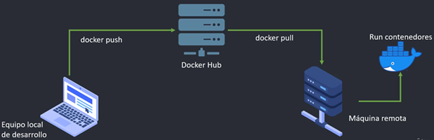

# Sección 13: Docker - Despliegue en producción - Amazon AWS

**Importante**
> En esta sección se hace uso de AWS, pero como no tengo cuenta no pude seguir los pasos. Básicamente, esta sección la
> estoy tomando como una guía para ver cómo es que se despliega a AWS usando los dos enfoques que se mencionan más
> abajo.
>
> Simplemente, son videos que veré, no haré otra cosa más que ver los videos de esta sección, con excepción del primer
> video de introducción donde sí colocaré lo que se mencione en esta documentación.

---

## Introducción

En esta sección abordaremos el despliegue del proyecto a un entorno de producción utilizando
`Amazon Web Services (AWS)`.

Veremos dos enfoques principales para realizar este despliegue:

1. `Auto-administrado o manual`: Consiste en gestionar directamente la infraestructura, como un servidor virtual
   (`VPS`), donde instalaremos y ejecutaremos nuestras aplicaciones de forma manual. Un ejemplo de este enfoque es el
   uso de `Amazon EC2` (Elastic Compute Cloud), que es el servicio de máquinas virtuales (`VPS`) proporcionado por
   `AWS`, similar a un `VPS` (Servidor Privado Virtual) tradicional.

2. `Administrado por el servicio (gestionado)`: En este enfoque delegamos gran parte de la administración a servicios
   de AWS diseñados para orquestar y ejecutar contenedores. Un ejemplo es `Amazon ECS` (Elastic Container Service), un
   servicio que permite ejecutar contenedores Docker sin necesidad de administrar directamente la infraestructura
   subyacente.

### Enfoque Auto-administrado (manual)

Este enfoque implica conectarse manualmente a una instancia remota (por ejemplo, una `instancia EC2`) mediante `SSH`,
instalar Docker, realizar un pull de nuestras imágenes desde Docker Hub (u otro registro de contenedores), y ejecutar
los contenedores directamente en ese servidor.

A continuación, se muestra un diagrama que representa este flujo `auto-administrado`:

### Ventajas y desventajas del enfoque auto-administrado

Ventajas:

- Mayor control sobre la configuración del entorno.
- Fácil de entender y poner en práctica inicialmente.
- Útil para entornos de prueba o proyectos pequeños.

Desventajas:

- Requiere mantenimiento manual de la infraestructura.
- Menor escalabilidad.
- Más propenso a errores humanos.
- No aprovecha las capacidades de orquestación de contenedores.

> 💡 `Tip`: Este enfoque puede ser un buen primer paso para aprender a desplegar aplicaciones en la nube, pero a medida
> que el sistema crece o necesita alta disponibilidad, conviene migrar a servicios gestionados como `ECS`, `EKS` o
> `Fargate`.
