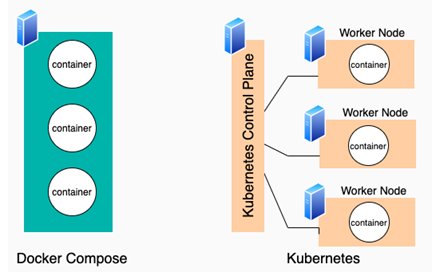
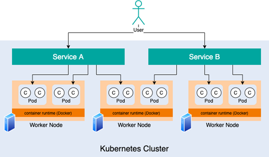
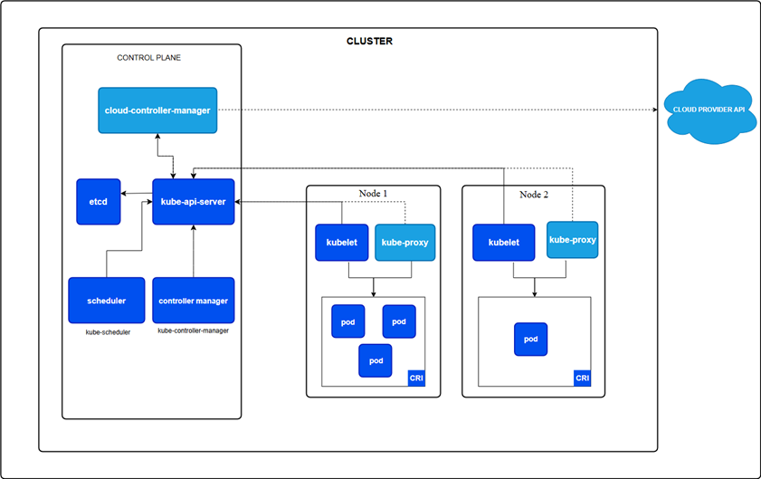
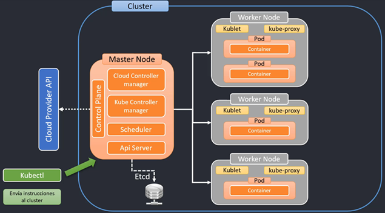

# Sección 14: Kubernetes

---

## Introducción

### [Kubernetes vs Docker Compose](https://www.theserverside.com/blog/Coffee-Talk-Java-News-Stories-and-Opinions/What-is-Kubernetes-vs-Docker-Compose-How-these-DevOps-tools-compare)

`Kubernetes y Docker Compose` **son marcos de orquestación de contenedores.**

- `Docker Compose` ejecuta contenedores en un único equipo anfitrión.
- `Kubernetes` ejecuta contenedores en varios ordenadores, virtuales o reales.



`Entendiendo Docker Compose`, como se mencionó anteriormente, Docker Compose es una tecnología de orquestación de
contenedores que está destinada a ejecutar una serie de contenedores en una sola máquina host. Los desarrolladores
crean un archivo Docker Compose que describe las imágenes de contenedor y la configuración con la que se compone el
Docker Compose. El nombre de este archivo es `compose.yml` o para versiones anteriores `docker-compose.yml`.

`Entendiendo Kubernetes`, como se ha mencionado anteriormente, Kubernetes es una tecnología de orquestación de
contenedores. Bajo Kubernetes, la lógica de una aplicación web se segmenta en contenedores. Los contenedores se
organizan en una abstracción llamada pod. Un pod puede tener uno o varios contenedores. La lógica de un pod se expone
a la red a través de otra abstracción de Kubernetes denominada servicio. En resumen, la red conoce los servicios de
Kubernetes y un servicio conoce el pod o los pods que tienen su lógica. Dentro de cada pod hay uno o varios
contenedores que realizan la lógica del pod en cuestión (Ver figura de abajo).

Un servicio de Kubernetes expone la lógica de los contenedores de un pod a la red.



En `Kubernetes`, los contenedores, pods y servicios se alojan dentro de una colección de uno o varios equipos, reales
o virtuales. En la jerga de `Kubernetes`, `un ordenador se denomina nodo`. `Kubernetes` se ejecuta en varios nodos.
La colección de nodos se denomina `clúster de Kubernetes`.

Los pods y los contenedores asociados a un servicio se pueden alojar en varios equipos. Además, Kubernetes tiene
características de escalado y tolerancia a errores que hacen que Kubernetes pueda crear automáticamente más pods en
tiempo de ejecución para satisfacer el aumento de la demanda sin pérdida de servicio. Además, si un pod falla,
Kubernetes lo repondrá automáticamente. Docker Compose admite reinicios automáticos en caso de error, pero no está
diseñado para admitir el escalado automático.

Lo importante que hay que entender sobre la diferencia entre Docker Compose es que, mientras que en Docker Compose, un
contenedor y su servicio y red correspondientes se ejecutan en una sola máquina, en Kubernetes los contenedores se
organizan según una abstracción llamada pod. Un pod puede ser utilizado por uno o varios servicios, y los pods asociados
a un solo servicio suelen estar distribuidos en varios equipos.

### [¿Qué es Kubernetes?](https://kubernetes.io/es/docs/concepts/overview/what-is-kubernetes/)

`Kubernetes (K8s)` es una plataforma de código abierto para automatizar la implementación, el escalado y la
administración de aplicaciones en contenedores.

El despliegue de contenedores con `Kubernetes` pueden ayudarnos de mejor forma y más estandarizada.

- `Revisión de salud (health check) del contenedor y re-deploy`, los contenedores pueden fallar y detenerse, se pueden
  caer y necesitan ser reemplazados.
- `Autoescalado (Autoscaling)`, necesitamos escalar nuestros servicios según aumenta o disminuye el tráfico.
- `Balanceo de carga (Load Balancer)`, distribuir uniformemente el tráfico entrante o carga de trabajo entre los
  contenedores.

`Kubernetes` provee configuración estandarizada, archivos de manifiesto `yml`, contenedores, números de instancias,
servicios, puertos, recursos, etc.

- Se puede llevar a cualquier proveedor en la nube como `Amazon EKS`, `Microsoft Azure`, `Google Cloud`, etc.
- O bien, se puede configurar en máquinas remotas o data centers administrador por nosotros, por ejemplo `VPS`.

📢 **IMPORTANTE**

> `Kubernetes` no es un servicio en la nube, sino más bien, es un software que podemos instalar y configurar en la nube
> ya sea en una máquina remota que administraremos nosotros (Ejm. EC2, algún otro VPS, etc), es decir, al igual que
> hicimos con `Docker` cuando usamos `Amazon EC2`, también podemos hacer lo mismo con `Kubernetes`, instalar y
> configurarlo, de forma que sea auto-administrada por nosotros.
>
> Por lo tanto, `Kubernetes` no es un proveedor de servicio, es un `framework` que nos ayuda en el despliegue de
> contenedores de forma automatizada con **revisión de salud, re-deploy, auto-escalamiento, balanceo de carga.**
>
> Podemos usar `Kubernetes` en `Amazon`, `Azure`, `Google Cloud`, etc.

## Conceptos Arquitectónicos detrás de Kubernetes

Un `clúster de Kubernetes` consta de un `control plane` y un conjunto de `máquinas de trabajo`, llamadas `nodos`, que
ejecutan aplicaciones en contenedores. Cada clúster necesita al menos un nodo de trabajo para ejecutar `pods`.

Los `nodos de trabajo` alojan los `pods` que componen la carga de trabajo de la aplicación. El `control plane`
administra los `nodos de trabajo` y los `pods` del clúster. En entornos de producción, el `control plane` suele
ejecutarse en varios equipos y un clúster suele ejecutar varios nodos, lo que proporciona tolerancia a fallos y alta
disponibilidad.

Este documento describe los diversos componentes necesarios para un `clúster de Kubernetes` completo y funcional.



### 🧠 Componentes del control plane

Los componentes del plano de control toman decisiones globales sobre el clúster (por ejemplo, el scheduling), además de
detectar y responder a eventos del clúster (por ejemplo, iniciar un nuevo pod cuando el campo de réplicas de una
implementación no está satisfecho).

Los componentes del plano de control se pueden ejecutar en cualquier equipo del clúster. Sin embargo, para simplificar,
los scripts de configuración suelen iniciar todos los componentes del plano de control en el mismo equipo y no ejecutan
contenedores de usuario en este.

### 🧠 Kube-apiserver

El `API Server` es un componente del plano de control de Kubernetes que expone la API de Kubernetes. El API server es
la interfaz del plano de control de Kubernetes.

La implementación principal de un API Server de Kubernetes es `kube-apiserver`. `Kube-apiserver` está diseñado para
escalar horizontalmente; es decir, escala mediante la implementación de más instancias. Se pueden ejecutar varias
instancias de `kube-apiserver` y equilibrar el tráfico entre ellas.Almacén de valores clave consistente y de alta
disponibilidad que se utiliza como almacén de respaldo de Kubernetes para todos los datos del clúster.

### 🧠 Etcd

Almacén de valores clave consistente y de alta disponibilidad que se utiliza como almacén de respaldo de `Kubernetes`
para todos los datos del clúster.

Si su clúster de Kubernetes utiliza etcd como almacén de respaldo, asegúrese de contar con un plan de respaldo para los
datos.

### 🧠 kube-scheduler

Es el componente del control plane encargado de asignar los `Pods` recién creados (que aún no están asignados a ningún
nodo) a un nodo disponible del clúster.

El scheduler evalúa varios factores como: uso de recursos, afinidad/anti-afinidad, restricciones de nodo, tolerancias y
más, para decidir en qué nodo es más adecuado ejecutar ese Pod.

### 🧠 kube-controller-manager

Es el componente que se encarga de ejecutar varios controladores (programas que vigilan el estado del clúster) en un
solo proceso.

Algunos de los controladores más importantes son:

- Node Controller: monitorea el estado de los nodos.
- Replication Controller: garantiza que el número deseado de réplicas de un Pod esté siempre corriendo.
- Endpoints Controller: gestiona los objetos Endpoint para servicios.
- Service Account & Token Controllers: maneja cuentas de servicio y tokens de acceso.

En resumen, el `kube-controller-manager` se asegura de que el estado real del clúster coincida con el estado deseado
definido en las configuraciones de Kubernetes.

### 🧠 cloud-controller-manager

Es un componente del `control plane` que permite que `Kubernetes` interactúe con los proveedores de nube (como `AWS`,
`GCP`, `Azure`).

Se encarga de separar la lógica específica del proveedor de nube del resto del clúster. Algunas de sus funciones
incluyen:

- Gestionar nodos según la infraestructura de nube (por ejemplo, eliminar nodos apagados).
- Asignar IPs externas a servicios.
- Crear balanceadores de carga (load balancers).

Solo es necesario si el clúster corre en un entorno de nube.

### 🧠 Componentes del Nodo (Node components)

Son los procesos que se ejecutan en cada `nodo del clúster` y se encargan de que los `Pods` funcionen correctamente.
Incluyen:

- `kubelet`: Agente que se comunica con el control plane, ejecuta los `Pods` en el nodo y reporta su estado.
- `kube-proxy`: Maneja la red en cada nodo, configurando reglas de red para permitir la comunicación entre `Pods` y
  `Servicios`.
- `Container Runtime`: Software que ejecuta los contenedores (por ejemplo, `containerd`, `CRI-O` o `Docker`).

Estos componentes son esenciales para que cada nodo participe activamente en el `clúster de Kubernetes`.

### 🧠 kubelet

Un agente que se ejecuta en cada nodo del clúster. Garantiza que los contenedores se ejecuten en un pod.

`Kubelet` toma un conjunto de `PodSpecs` proporcionados mediante diversos mecanismos y garantiza que los contenedores
descritos en ellas se ejecuten correctamente. Kubelet no administra contenedores que no hayan sido creados por
Kubernetes.

### 🧠 Container runtime

Un componente fundamental que permite a `Kubernetes` ejecutar contenedores eficazmente. Se encarga de gestionar la
ejecución y el ciclo de vida de los contenedores dentro del entorno de `Kubernetes`.

A continuación se muestra el diagrama de la arquitectura de kubernetes mostrado en el curso.



📝 **NOTA**

- `Minikube` es una herramienta que nos permite crear un clúster local de `Kubernetes` en nuestra máquina. Es ideal para
  desarrollo y pruebas, ya que simula un entorno de clúster real.


- `kubectl` (**abreviatura de Kubernetes control**) es la `herramienta de línea de comandos` para interactuar con un
  clúster de `Kubernetes`. Permite ejecutar comandos para desplegar aplicaciones, inspeccionar recursos y administrar el
  clúster. Funciona tanto con `minikube` en entornos locales como con clústeres remotos en la nube (por ejemplo,
  en `Amazon EKS`, `Google GKE`, `Azure AKS`, etc.).

## Introducción a los objetos de Kubernetes

`Kubernetes` define y gestiona su infraestructura a través de una serie de objetos que representan el estado deseado
del sistema. Estos objetos son entidades persistentes del clúster y permiten declarar qué quieres que ocurra
(por ejemplo, cuántas réplicas de una aplicación deben estar ejecutándose), y `Kubernetes` se encarga de hacerlo
realidad.

A continuación se listan algunos de los objetos fundamentales en Kubernetes:

- 💡 `Pod`: Unidad más pequeña de ejecución. Representa una o más contenedores que comparten almacenamiento, red y
  especificaciones sobre cómo ejecutar los contenedores.


- 💡 `Deployment`: Controlador que gestiona la creación y actualización de réplicas de `Pods` de forma declarativa.
  Permite realizar escalamiento y actualizaciones sin tiempo de inactividad.


- 💡 `Service`: Objeto que expone un conjunto de `Pods` como un único servicio de red. Garantiza acceso estable a los
  `Pods`, incluso cuando sus direcciones IP cambian.


- 💡 `Namespace`: Mecanismo para agrupar y aislar recursos dentro de un mismo clúster. Útil para organizar ambientes
  (dev, staging, prod) o equipos.


- 💡 `Volume`: Abstracción para gestionar almacenamiento persistente que puede ser compartido entre contenedores de un
  mismo `Pod`.

## Pods en Kubernetes

Los `Pods` son la unidad más pequeña que se puede desplegar y administrar en `Kubernetes`. Representan una instancia en
ejecución de una aplicación dentro del clúster.

Un `Pod` encapsula uno o más contenedores (por ejemplo, contenedores Docker), junto con recursos compartidos como:

- Dirección IP y puerto
- Almacenamiento (volúmenes)
- Configuraciones para la ejecución de contenedores

Los contenedores dentro de un mismo `Pod`:

- Se ejecutan en el mismo nodo.
- Comparten la misma red, por lo tanto, pueden comunicarse entre sí usando `localhost` y puertos expuestos.
- Pueden compartir almacenamiento, accediendo a los mismos volúmenes montados.
- Están co-ubicados y co-programados, lo que significa que se despliegan y se terminan juntos como una unidad lógica.

Por diseño, los contenedores dentro de un Pod están estrechamente relacionados. Esto es útil en casos donde uno de los
contenedores complementa al otro, como un contenedor principal que sirve la aplicación, y un contenedor sidecar que
recolecta logs o realiza tareas auxiliares.

> ⚠️ `Buenas prácticas`: Aunque un `Pod` puede contener varios contenedores, lo más habitual (y recomendable) es
> usar un solo contenedor por `Pod`. Esto simplifica la gestión, el escalamiento y el monitoreo de las aplicaciones.

### Comunicación entre Pods

- Cada `Pod` tiene su propia IP única dentro del clúster.
- La comunicación entre `Pods` se realiza a través de esta IP o mediante un Service, que actúa como punto de acceso
  estable incluso si los `Pods` cambian.

## Deployments en Kubernetes

Un `Deployment` es un objeto de `Kubernetes` que permite administrar el ciclo de vida de los `Pods` de forma
declarativa. Es uno de los controladores más comunes, y se utiliza para definir cómo crear, actualizar, escalar y
revertir instancias de una aplicación en contenedores.

Con un `Deployment` puedes:

- Crear y mantener múltiples réplicas de un `Pod` en ejecución.
- Realizar actualizaciones controladas (rolling updates) de versiones del contenedor sin tiempo de inactividad.
- Revertir a una versión anterior en caso de error.
- Escalar la aplicación (aumentar o reducir la cantidad de Pods) fácilmente.

El `Deployment` actúa como un controlador de alto nivel que administra objetos más bajos llamados ReplicaSets,
los cuales a su vez garantizan que el número especificado de `Pods` esté siempre corriendo.

Cuando defines un `Deployment` (mediante un manifiesto `YML`), indicas el estado deseado de la aplicación (imagen del
contenedor, cantidad de réplicas, puertos, etc.). `Kubernetes` se encarga de alinear el estado actual del sistema con
ese estado deseado de forma automática y segura.

> ⚙️ Las operaciones con `Deployments` suelen ejecutarse mediante `kubectl`, la herramienta de línea de comandos de
> Kubernetes disponible para Linux, macOS y Windows.

## Modos de creación de objetos

Existen dos enfoques principales para crear objetos en Kubernetes:

- `Imperativo`: Se realiza directamente desde la línea de comandos (`kubectl`) especificando los parámetros de manera
  explícita. Es útil para tareas rápidas, pero difícil de reproducir y versionar.

  Ejemplo:

  ````bash
  $ kubectl run mi-app --image=nginx --port=80
  ````

- `Declarativo`: Se basa en archivos de configuración `YML` (también llamados manifiestos), donde se describe el estado
  deseado del objeto. Es el enfoque recomendado para entornos productivos, ya que facilita el versionado, reutilización
  y control de cambios.

  Ejemplo:
  ````yml
  apiVersion: apps/v1
  kind: Deployment
  metadata:
    name: mi-app
  spec:
    replicas: 2
    selector:
      matchLabels:
        app: mi-app
  ...
  ````

## Instalando Herramientas

### [Kubectl](https://kubernetes.io/docs/tasks/tools/#kubectl)

La herramienta de línea de comandos de `Kubernetes`, `kubectl`, permite ejecutar comandos en clústeres de `Kubernetes`.
Puede usar `kubectl` para implementar aplicaciones, inspeccionar y administrar recursos del clúster y consultar
registros.

`kubectl` se puede instalar en diversas plataformas Linux, macOS y Windows. Para ver las distintas formas de instalar
`kubectl` en nuestra máquina de windows podemos visitar el siguiente enlace
[Install and Set Up kubectl on Windows](https://kubernetes.io/docs/tasks/tools/install-kubectl-windows/).

En nuestro caso elegimos la opción de instalar `kubectl` mediante el administrador de paquetes
[Chocolatey](https://community.chocolatey.org/). Para eso podemos visitar el siguiente enlace
[Install on Windows using Chocolatey, Scoop, or winget](https://kubernetes.io/docs/tasks/tools/install-kubectl-windows/#install-nonstandard-package-tools)
o, si no, ir directamente a la página de [Chocolatey](https://community.chocolatey.org/).

Pero para resumir lo que haremos será:

- Abrir el `PowerShell` de windows en modo administrador y ejecutar el siguiente comando para instalar el administrador
  de paquetes chocolatey.
  ````bash
  $ Set-ExecutionPolicy Bypass -Scope Process -Force; [System.Net.ServicePointManager]::SecurityProtocol = [System.Net.ServicePointManager]::SecurityProtocol -bor 3072; iex ((New-Object System.Net.WebClient).DownloadString('https://community.chocolatey.org/install.ps1'))
  ````
- Una vez que finalice la instalación, comprobamos que se efectuó correctamente.
  ````bash
  $ choco --version
  2.4.3
  ````
- Ahora ya podemos instalar `kubectl`, para eso ejecutamos el comando de abajo (en el proceso nos pedirá que si queremos
  ejecutar un script, solo le decimos que sí con `Y`).
  ````bash
  $ choco install kubernetes-cli
  ````

- Finalizada la instalación de `kubectl`, comprobamos que se efectuó correctamente.
  ````bash
  $ kubectl version --client
  Client Version: v1.33.2
  Kustomize Version: v5.6.0
  ````

Luego de la instalación haremos dos cosas:

- Verificar que el directorio `.kube` exista en la siguiente ruta: `C:\Users\magadiflo\.kube`.
- Si no existe, crearlo manualmente o con `mkdir .kube`.
- Dentro del directorio `.kube` creamos el archivo `config` sin extensión usando el siguiente comando:
  ````bash
  $ touch config
  ````

### [Minikube](https://kubernetes.io/docs/tasks/tools/#minikube)

`Minikube` es `Kubernetes local`, enfocado en facilitar el aprendizaje y desarrollo para `Kubernetes`.

Solo necesitas un contenedor `Docker` (o similarmente compatible) o un entorno de máquina virtual, y `Kubernetes` está
a un solo comando: `minikube start`.

[Pasos para instalar minikube:](https://minikube.sigs.k8s.io/docs/start/?arch=%2Fwindows%2Fx86-64%2Fstable%2F.exe+download)

- Descargamos e instalamos la
  [última versión](https://storage.googleapis.com/minikube/releases/latest/minikube-installer.exe) del instalador.

Luego de la instalación:

- Volvemos a abrir la terminal pero esta vez con `acceso de administrador` y ejecutamos:
  ````bash
  $ minikube start --driver=hyperv
  ````
    - `minikube start`, inicia un clúster de `Kubernetes local`. Este clúster consiste en un solo nodo que actúa como
      control plane (maestro y trabajador al mismo tiempo). Ideal para desarrollo, pruebas y aprendizaje.
    - `--driver=hyperv`, especifica que el clúster se debe ejecutar dentro de una máquina virtual gestionada por
      `Hyper-V`, el hipervisor nativo de Windows. `Minikube` soporta múltiples drivers como `docker`, `virtualbox`,
      `hyperv`, etc.


- Luego de iniciar minikube con el driver `hyperv`, vemos que la ejecución se efectúa correctamente:
  ````bash
  $ minikube start --driver=hyperv
  * minikube v1.36.0 on Microsoft Windows 11 Pro 10.0.26100.4349 Build 26100.4349
  * Using the hyperv driver based on user configuration
  * Starting "minikube" primary control-plane node in "minikube" cluster
  * Creating hyperv VM (CPUs=2, Memory=6000MB, Disk=20000MB) ...
  ! Image was not built for the current minikube version. To resolve this you can delete and recreate your minikube cluster using the latest images. Expected minikube version: v1.35.0 -> Actual minikube version: v1.36.0
  ! Failing to connect to https://registry.k8s.io/ from inside the minikube VM
  * To pull new external images, you may need to configure a proxy: https://minikube.sigs.k8s.io/docs/reference/networking/proxy/
  * Preparing Kubernetes v1.33.1 on Docker 28.0.4 ...
    - Generating certificates and keys ...
    - Booting up control plane ...
    - Configuring RBAC rules ...
  * Configuring bridge CNI (Container Networking Interface) ...
  * Verifying Kubernetes components...
    - Using image gcr.io/k8s-minikube/storage-provisioner:v5
  * Enabled addons: storage-provisioner, default-storageclass
  * Done! kubectl is now configured to use "minikube" cluster and "default" namespace by default
  ````

- Procedemos a verificar el `status` de `minikube`.
  ````bash
  $ minikube status
  minikube
  type: Control Plane
  host: Running
  kubelet: Running
  apiserver: Running
  kubeconfig: Configured
  ````

En el apartado de creación de `kubectl` creamos el archivo `config` en la siguiente ruta
`C:\Users\magadiflo\.kube\config`. Si ahora revisamos dicho archivo, veremos que se habrá poblado con las
configuraciones de clúster de `minikube` para que `kubectl` se pueda comunicar con él.

````yml
apiVersion: v1
clusters:
  - cluster:
      certificate-authority: C:\Users\magadiflo\.minikube\ca.crt
      extensions:
        - extension:
            last-update: Wed, 25 Jun 2025 23:32:37 -05
            provider: minikube.sigs.k8s.io
            version: v1.36.0
          name: cluster_info
      server: https://172.25.56.162:8443
    name: minikube
contexts:
  - context:
      cluster: minikube
      extensions:
        - extension:
            last-update: Wed, 25 Jun 2025 23:32:37 -05
            provider: minikube.sigs.k8s.io
            version: v1.36.0
          name: context_info
      namespace: default
      user: minikube
    name: minikube
current-context: minikube
kind: Config
preferences: { }
users:
  - name: minikube
    user:
      client-certificate: C:\Users\magadiflo\.minikube\profiles\minikube\client.crt
      client-key: C:\Users\magadiflo\.minikube\profiles\minikube\client.key
````

## Creando deployment MySQL - Forma Imperativa

Antes de crear el deployment con `MySQL` debemos asegurarnos de levantar `minikube`, así que ejecutamos el siguiente
comando usando la línea de comandos en `modo administrador`:

````bash
$ minikube start --driver=hyperv
* minikube v1.36.0 on Microsoft Windows 11 Pro 10.0.26100.4349 Build 26100.4349
* Using the hyperv driver based on existing profile
* Starting "minikube" primary control-plane node in "minikube" cluster
* Restarting existing hyperv VM for "minikube" ...
! Image was not built for the current minikube version. To resolve this you can delete and recreate your minikube cluster using the latest images. Expected minikube version: v1.35.0 -> Actual minikube version: v1.36.0
! Failing to connect to https://registry.k8s.io/ from inside the minikube VM
* To pull new external images, you may need to configure a proxy: https://minikube.sigs.k8s.io/docs/reference/networking/proxy/
* Preparing Kubernetes v1.33.1 on Docker 28.0.4 ...
* Configuring bridge CNI (Container Networking Interface) ...
* Verifying Kubernetes components...
  - Using image gcr.io/k8s-minikube/storage-provisioner:v5
* Enabled addons: storage-provisioner, default-storageclass
* Done! kubectl is now configured to use "minikube" cluster and "default" namespace by default
````

**NOTA**
> Si al ejecutar el `minikube start` nos sale el siguiente mensaje:  `Unable to resolve the current
> Docker CLI context "default": context "default" does not exist`, podemos detener el servicio con `minikube stop`
> y luego ejecutar el siguiente comando: `docker context use default`. Ahora sí volvemos a iniciar minikube y ya no
> deberíamos ver ese mensaje.

Verificamos que se estén ejecutando todos los servicios:

````bash
$ minikube status
minikube
type: Control Plane
host: Running
kubelet: Running
apiserver: Running
kubeconfig: Configured
````

Ahora sí, iniciamos con la creación del `deployment` para `MySQL`. Recordemos que un deployment tendrá un pod y un pod
tendrá uno o muchos contenedores (en nuestro caso idealmente solo uno). El contenedor que crearemos requerirá una
imagen.

La imagen en kubernetes siempre se descarga de `docker hub`. Ahora, con la `forma imperativa`
`no podemos mandar variables de entorno (ambiente)`, que es lo que en este caso está esperando la imagen de `MySQL`
como el asignar un nombre a la base de datos, el username, el password, etc., por lo que al crear el deployment de
manera imperativa esperaremos obtener errores.

````bash
$ kubectl create deployment d-mysql --image=mysql:8.0.41-debian --port=3306
deployment.apps/d-mysql created
````

### 📋 ¿Qué hace este comando?

Este comando crea un `Deployment` en `Kubernetes` llamado `d-mysql` que:

1. Despliega un `Pod` con un `contenedor` basado en la imagen oficial de `MySQL 8.0.41` (versión Debian).
2. El contenedor usará internamente el puerto `3306` (por defecto en MySQL). Este puerto solo está disponible dentro
   del Pod y no es accesible desde fuera del clúster a menos que se cree un Service.

**Resumen**

- `create deployment`, indica que se creará un recurso del tipo `Deployment`, que gestiona réplicas y actualizaciones
  de `Pods`.
- `d-mysql`, es el nombre asignado al `Deployment`, y por defecto, el nombre de los `Pods` creados por este comenzará
  con ese nombre seguido de un identificador aleatorio.
- `--image=mysql:8.0.41-debian`, imagen de Docker que se usará para el contenedor. En este caso, MySQL 8 basado en
  Debian que bajada de `Docker Hub`.
- `--port=3306`, indica que el contenedor escuchará internamente en el puerto `3306`, que es el puerto por defecto de
  MySQL. Sin embargo, este parámetro `no expone el puerto fuera del Pod`, ni crea un Service. Para permitir el acceso
  desde otros Pods o desde fuera del clúster, es necesario crear un Service por separado.

### 📌 Nota importante

Este comando:

- `No crea un Service`, así que el contenedor `no es accesible desde fuera del clúster` todavía.
- El `comando imperativo` no permite asignar variables de entorno como `MYSQL_ROOT_PASSWORD`, por lo que `MySQL` no
  iniciará correctamente. Para definir variables de ambiente es necesario usar la `forma declarativa`, mediante un
  archivo `YAML`. Por eso pueden aparecer errores al iniciar el contenedor.

Si listamos los deployments veremos que el deployment que acabamos de construir `d-mysql` tiene el valor
`READY: 0/1`. Eso significa que no está listo, ya que el contenedor de `MySQL` espera recibir variables de ambiente y
no le hemos pasado, por eso `no está READY`.

````bash
$ kubectl get deployments
NAME      READY   UP-TO-DATE   AVAILABLE   AGE
d-mysql   0/1     1            0           47s
````

Listamos los pods y vemos que estamos obteniendo lo mismo, es decir el status del pod está en `CrashLoopBackOff`, como
que ocurrió un error y es precisamente por lo de las variables de entorno que el contenedor de mysql espera recibir,
pero que no le hemos pasado.

````bash
$ kubectl get pods
NAME                       READY   STATUS             RESTARTS       AGE
d-mysql-7cbc75f4bd-mvgcf   0/1     CrashLoopBackOff   9 (3m2s ago)   24m
````

Podemos describir el pod para ver qué ocurrió.

````bash
$ kubectl describe pods d-mysql-7cbc75f4bd-mvgcf
Name:             d-mysql-7cbc75f4bd-mvgcf
Namespace:        default
Priority:         0
Service Account:  default
Node:             minikube/172.25.48.212
Start Time:       Wed, 25 Jun 2025 23:55:50 -0500
Labels:           app=d-mysql
                  pod-template-hash=7cbc75f4bd
Annotations:      <none>
Status:           Running
IP:               10.244.0.5
IPs:
  IP:           10.244.0.5
Controlled By:  ReplicaSet/d-mysql-7cbc75f4bd
Containers:
  mysql:
    Container ID:   docker://ab9887847eca5d7bafa2487ae6b2b21f72b30d0e8bcfbbabea7469bfd77a38fc
    Image:          mysql:8.0.41-debian
    Image ID:       docker-pullable://mysql@sha256:b2252987e0ecdb820e96928948ac3bca1adcd2b4a2a2c7b0d7ea78f77a9dc6ac
    Port:           3306/TCP
    Host Port:      0/TCP
    State:          Waiting
      Reason:       CrashLoopBackOff
    Last State:     Terminated
      Reason:       Error
      Exit Code:    1
      Started:      Thu, 26 Jun 2025 00:22:49 -0500
      Finished:     Thu, 26 Jun 2025 00:22:49 -0500
    Ready:          False
    Restart Count:  10
    Environment:    <none>
    Mounts:
      /var/run/secrets/kubernetes.io/serviceaccount from kube-api-access-g6wd7 (ro)
Conditions:
  Type                        Status
  PodReadyToStartContainers   True
  Initialized                 True
  Ready                       False
  ContainersReady             False
  PodScheduled                True
Volumes:
  kube-api-access-g6wd7:
    Type:                    Projected (a volume that contains injected data from multiple sources)
    TokenExpirationSeconds:  3607
    ConfigMapName:           kube-root-ca.crt
    Optional:                false
    DownwardAPI:             true
QoS Class:                   BestEffort
Node-Selectors:              <none>
Tolerations:                 node.kubernetes.io/not-ready:NoExecute op=Exists for 300s
                             node.kubernetes.io/unreachable:NoExecute op=Exists for 300s
Events:
  Type     Reason     Age                   From               Message
  ----     ------     ----                  ----               -------
  Normal   Scheduled  29m                   default-scheduler  Successfully assigned default/d-mysql-7cbc75f4bd-mvgcf to minikube
  Normal   Pulling    29m                   kubelet            Pulling image "mysql:8.0.41-debian"
  Normal   Pulled     29m                   kubelet            Successfully pulled image "mysql:8.0.41-debian" in 34.872s (34.872s including waiting). Image size: 609852301 bytes.
  Normal   Created    13m (x9 over 29m)     kubelet            Created container: mysql
  Normal   Started    13m (x9 over 29m)     kubelet            Started container mysql
  Warning  BackOff    4m6s (x119 over 29m)  kubelet            Back-off restarting failed container mysql in pod d-mysql-7cbc75f4bd-mvgcf_default(1ca29ba5-12eb-4013-bfc0-a5e4707240aa)
  Normal   Pulled     2m54s (x10 over 29m)  kubelet            Container image "mysql:8.0.41-debian" already present on machine
````

Otra forma de ver en detalle el error que ocurrió es con el comando `kubectl logs`:

````bash
$ kubectl logs d-mysql-7cbc75f4bd-mvgcf
2025-06-26 05:22:49+00:00 [Note] [Entrypoint]: Entrypoint script for MySQL Server 8.0.41-1debian12 started.
2025-06-26 05:22:49+00:00 [Note] [Entrypoint]: Switching to dedicated user 'mysql'
2025-06-26 05:22:49+00:00 [Note] [Entrypoint]: Entrypoint script for MySQL Server 8.0.41-1debian12 started.
2025-06-26 05:22:49+00:00 [ERROR] [Entrypoint]: Database is uninitialized and password option is not specified
    You need to specify one of the following as an environment variable:
    - MYSQL_ROOT_PASSWORD
    - MYSQL_ALLOW_EMPTY_PASSWORD
    - MYSQL_RANDOM_ROOT_PASSWORD
````

## Creando deployment MySQL - Forma Declarativa

Lo primero que haremos será eliminar el `deployment` creado en el apartado anterior.

````bash
$ kubectl delete deployment d-mysql
deployment.apps "d-mysql" deleted
````

La idea en este apartado es que a partir de la forma `imperativa`, es decir, mediante la línea de comandos
podamos crear el `deployment` en forma `declarativa` generando la configuración en un archivo `yml`.

Para organizar mejor nuestros archivos, vamos a crear un directorio en la raíz de este proyecto llamado `/kubernetes`
y dentro de él del directorio `/deployments` donde iremos colocando todos los archivos relacionados a él.

Ejecutamos el siguiente comando para generar el archivo `YAML` del `Deployment` de `MySQL`:

````bash
D:\programming\spring\01.udemy\02.andres_guzman\08.docker_kubernetes\docker-kubernetes (feature/section-14)
$ kubectl create deployment d-mysql --image=mysql:8.0.41-debian --port=3306 --dry-run=client -o yaml > .\kubernetes\deployments\deployment-mysql.yml
````

**DONDE**

- `kubectl create deployment d-mysql --image=mysql:8.0.41-debian --port=3306`, crea un `Deployment` llamado `d-mysql`
  de forma imperativa, especificando la imagen de MySQL versión `8.0.41-debian` y el puerto `3306`.
- `--dry-run=client`, simula la creación del recurso y muestra la configuración resultante, pero sin enviarla al
  clúster. Útil para verificar o generar archivos de configuración. En nuestro caso nos permitirá colocar la
  configuración resultante en un archivo `yml`.
- `-o yaml`, define que la salida se muestre en formato `YAML`.
- `deployment-mysql.yml`, le damos un nombre al archivo de configuración del deployment de mysql.
- `> ./kubernetes/deployments/deployment-mysql.yml`, redirige la salida del comando al archivo `deployment-mysql.yml`
  dentro de la carpeta `kubernetes/deployments`.

Como salida podemos observar en el directorio `./kubernetes/deployments` el archivo `deployment-mysql.yml`
con la siguiente configuración por defecto (algunas configuraciones no lo vamos a necesitar):

````yml
apiVersion: apps/v1
kind: Deployment
metadata:
  creationTimestamp: null
  labels:
    app: d-mysql
  name: d-mysql
spec:
  replicas: 1
  selector:
    matchLabels:
      app: d-mysql
  strategy: { }
  template:
    metadata:
      creationTimestamp: null
      labels:
        app: d-mysql
    spec:
      containers:
        - image: mysql:8.0.41-debian
          name: mysql
          ports:
            - containerPort: 3306
          resources: { }
status: { }
````

Limpiamos el archivo yml anterior y dejamos solo las configuraciones importantes agregando, por supuesto, las variables
de entorno, que fueron el motivo por le cuál creamos este archivo.

````yml
apiVersion: apps/v1
kind: Deployment                            # <-- Este recurso es el Deployment
metadata:
  name: d-mysql                             # Nombre del Deployment
spec:
  replicas: 1                               # Cantidad de Pods que debe mantener
  selector:
    matchLabels:
      app: d-mysql                          # <<< Importantísimo: Este selector indica que va a controlar los Pods que tengan la etiqueta app: d-mysql
  template: #                               <<< AQUÍ empieza la plantilla del POD
    metadata:
      labels:
        app: d-mysql                        # <<< Etiqueta que tendrán los Pods creados por este Deployment
    spec:
      containers: #                           <<< Aquí defines los contenedores del POD
        - image: mysql:8.0.41-debian
          name: c-mysql
          ports:
            - containerPort: 3306
          env:
            - name: MYSQL_ROOT_PASSWORD
              value: magadiflo
            - name: MYSQL_DATABASE
              value: db_user_service
            - name: MYSQL_USER
              value: admin
            - name: MYSQL_PASSWORD
              value: magadiflo
````

**NOTA**
> En mi caso, le cambié el nombre del contenedor a `c-mysql`. Cuando generamos el archivo desde la línea de comandos,
> nos creó el nombre del contendor `mysql`, pero en mi caso lo renombré a `c-mysql` para tenerlo similar a cómo lo
> venimos trabajando en el `docker compose`.

#### ¿Qué parte es el POD?

El `Pod` en sí es todo lo que está dentro del bloque `template:`. Concretamente.

````yml
template:
  metadata:
    labels:
      app: d-mysql
  spec:
    containers:
      - ...
````

Ahora que ya tenemos el archivo del `deployment` con las variables de entorno agregadas, creamos el deployment pero
esta vez usando el comando `apply`, ya que usaremos un archivo `yml`. Es decir, cuando usemos un archivo `yml` la
instrucción será `apply` y no `create`.

````bash
$ kubectl apply -f .\kubernetes\deployments\deployment-mysql.yml
deployment.apps/d-mysql created
````

Ahora, debemos verificar que se ha creado el `deployment` llamado `d-mysql` y está en `READY 1/1`.

````bash
$ kubectl get deployments
NAME      READY   UP-TO-DATE   AVAILABLE   AGE
d-mysql   1/1     1            1           60s
````

Lo mismo debe ocurrir si listamos los pods.

````bash
$ kubectl get pods
NAME                       READY   STATUS    RESTARTS   AGE
d-mysql-7b947869d5-d77d4   1/1     Running   0          2m6s
````

Describimos el pod y vemos que todo está ok.

````bash
$ kubectl describe pods d-mysql-7b947869d5-d77d4
Name:             d-mysql-7b947869d5-d77d4
Namespace:        default
Priority:         0
Service Account:  default
Node:             minikube/172.25.48.212
Start Time:       Fri, 27 Jun 2025 00:18:25 -0500
Labels:           app=d-mysql
                  pod-template-hash=7b947869d5
Annotations:      <none>
Status:           Running
IP:               10.244.0.9
IPs:
  IP:           10.244.0.9
Controlled By:  ReplicaSet/d-mysql-7b947869d5
Containers:
  c-mysql:
    Container ID:   docker://ddd4ed7ac3ae8618818f6aefbb0852f1ed7a30913f0dbcd9a6c4a281d1d5fa63
    Image:          mysql:8.0.41-debian
    Image ID:       docker-pullable://mysql@sha256:b2252987e0ecdb820e96928948ac3bca1adcd2b4a2a2c7b0d7ea78f77a9dc6ac
    Port:           3306/TCP
    Host Port:      0/TCP
    State:          Running
      Started:      Fri, 27 Jun 2025 00:18:25 -0500
    Ready:          True
    Restart Count:  0
    Environment:
      MYSQL_ROOT_PASSWORD:  magadiflo
      MYSQL_DATABASE:       db_user_service
      MYSQL_USER:           admin
      MYSQL_PASSWORD:       magadiflo
    Mounts:
      /var/run/secrets/kubernetes.io/serviceaccount from kube-api-access-shnpg (ro)
Conditions:
  Type                        Status
  PodReadyToStartContainers   True
  Initialized                 True
  Ready                       True
  ContainersReady             True
  PodScheduled                True
Volumes:
  kube-api-access-shnpg:
    Type:                    Projected (a volume that contains injected data from multiple sources)
    TokenExpirationSeconds:  3607
    ConfigMapName:           kube-root-ca.crt
    Optional:                false
    DownwardAPI:             true
QoS Class:                   BestEffort
Node-Selectors:              <none>
Tolerations:                 node.kubernetes.io/not-ready:NoExecute op=Exists for 300s
                             node.kubernetes.io/unreachable:NoExecute op=Exists for 300s
Events:
  Type    Reason     Age    From               Message
  ----    ------     ----   ----               -------
  Normal  Scheduled  2m58s  default-scheduler  Successfully assigned default/d-mysql-7b947869d5-d77d4 to minikube
  Normal  Pulled     2m58s  kubelet            Container image "mysql:8.0.41-debian" already present on machine
  Normal  Created    2m58s  kubelet            Created container: c-mysql
  Normal  Started    2m58s  kubelet            Started container c-mysql
````

Si verificamos el log del pod `d-mysql-7b947869d5-d77d4` también observaremos que la ejecución es exitosa.

````bash
$ kubectl logs d-mysql-7b947869d5-d77d4
2025-06-27 05:18:25+00:00 [Note] [Entrypoint]: Entrypoint script for MySQL Server 8.0.41-1debian12 started.
2025-06-27 05:18:25+00:00 [Note] [Entrypoint]: Switching to dedicated user 'mysql'
2025-06-27 05:18:25+00:00 [Note] [Entrypoint]: Entrypoint script for MySQL Server 8.0.41-1debian12 started.
2025-06-27 05:18:26+00:00 [Note] [Entrypoint]: Initializing database files
...
2025-06-27 05:18:38+00:00 [Note] [Entrypoint]: Creating database db_user_service
2025-06-27 05:18:38+00:00 [Note] [Entrypoint]: Creating user admin
2025-06-27 05:18:38+00:00 [Note] [Entrypoint]: Giving user admin access to schema db_user_service
...
2025-06-27 05:18:40+00:00 [Note] [Entrypoint]: MySQL init process done. Ready for start up.

2025-06-27T05:18:40.909649Z 0 [System] [MY-010116] [Server] /usr/sbin/mysqld (mysqld 8.0.41) starting as process 1
2025-06-27T05:18:40.914564Z 1 [System] [MY-013576] [InnoDB] InnoDB initialization has started.
2025-06-27T05:18:41.169343Z 1 [System] [MY-013577] [InnoDB] InnoDB initialization has ended.
...
2025-06-27T05:18:41.411612Z 0 [System] [MY-011323] [Server] X Plugin ready for connections. Bind-address: '::' port: 33060, socket: /var/run/mysqld/mysqlx.sock
2025-06-27T05:18:41.411673Z 0 [System] [MY-010931] [Server] /usr/sbin/mysqld: ready for connections. Version: '8.0.41'  socket: '/var/run/mysqld/mysqld.sock'  port: 3306  MySQL Community Server - GPL.
````

## Creando el servicio MySQL para la comunicación interna mediante un hostname

Vamos a crear el servicio que nos permitirá exponer el `Deployment` de `MySQL` que creamos en el apartado anterior. De
esta forma, cuando se cree el `Pod` que contenga el contenedor del `user-service`, este podrá conectarse a `MySQL` de
manera estable y predecible.

> Un `Service` en `Kubernetes` es un recurso que define una abstracción de red para acceder a uno o varios `Pods`
> relacionados. En otras palabras, gestiona el tráfico hacia esos `Pods` mediante una `IP fija` que no cambia
> (`ClusterIP`) o un nombre de dominio (`hostname`) accesible dentro o fuera del clúster, según el tipo de servicio.

Antes de ejecutar el comando para crear el servicio, revisemos los principales tipos de `Service`:

- `ClusterIP` (por defecto): `permite la comunicación interna entre Pods` dentro del clúster de Kubernetes,
  independientemente de la máquina (`Node`) donde se encuentren. Es la opción más común cuando solo necesitas exponer
  el servicio para otros `Pods`.

- `NodePort`: expone el servicio a través de un puerto en cada Node del clúster, lo que `permite el acceso externo`
  (por ejemplo, desde fuera del clúster). Internamente, Kubernetes asigna un puerto dinámico en el rango `30000-32767`.

- `LoadBalancer`: crea automáticamente un balanceador de carga externo en el proveedor de nube (por ejemplo, GCP, AWS o
  Azure), que distribuye el tráfico entrante entre los `Pods`. También permite comunicación interna. Este tipo requiere
  soporte del proveedor de infraestructura.

Ahora sí, crearemos nuestro servicio usando el tipo `ClusterIP` y asignándole un nombre personalizado.

````bash
$ kubectl expose deployment d-mysql --port=3306 --type=ClusterIP --name=s-mysql
service/s-mysql exposed
````

**Donde**

- `d-mysql` es el nombre del Deployment que vamos a exponer.
- `--name=s-mysql` define el `nombre que tendrá el Service` que se crea. De este modo, el servicio se llamará `s-mysql`
  y su hostname interno será `s-mysql`.
- `--port=3306` es el puerto en el que el servicio estará escuchando. Este puerto debe coincidir con el puerto expuesto
  por el contenedor en el Deployment (`deployment-mysql.yml`), ya que `MySQL` escucha en ese puerto por defecto.

El nombre que le dimos a este servicio (`s-mysql`) en `kubernetes` es similar al nombre del servicio con el que
estuvimos trabajando en docker compose. Es decir, si revisamos el archivo `compose.yml` veremos que el servicio de
mysql se llama `s-mysql` y además, en el archivo `.env` del `user-service` tenemos variables de entorno, una de ellas
es el `DB_HOST` cuyo valor, precisamente es el nombre del servicio que está definido en el `compose.yml` (`s-mysql`).

````yml
# Database
DB_HOST=s-mysql
````

Esto significó, en docker compose, que el microservicio `user-service` podía comunicarse con la base de datos de mysql
a través del servicio de docker compose `s-mysql`.

Ahora, regresemos al servicio que acabamos de crear con `kubernetes`; como vemos, le hemos dado el nombre de
`--name=s-mysql`, simplemente por continuar con el mismo nombre, pero ahora estamos en kubernetes.

Ahora, un punto importante aquí es que el nombre del servicio `s-mysql` en kubernetes, no lo usaremos en ese archivo
`.env` (ese archivo es para docker compose), sino más bien lo definiremos directamente en el archivo `Deployment`
cuando creemos el deployment del microsrvicio `user-service` o como veremos más adelante, definiremos las variables de
entorno en los `ConfigMaps`.

**Nota**
> Cuando creas un `Service` con `kubectl expose`, `Kubernetes` genera automáticamente un selector que coincide con las
> etiquetas del `Deployment` para dirigir el tráfico al `Pod` correspondiente.

**Importante:**
> Si no defines explícitamente un nombre mediante `--name`, el `Service` tomará por defecto el mismo nombre que el
> `Deployment`. Por ejemplo, si omites `--name`, este comando:
>
> `kubectl expose deployment d-mysql --port=3306 --type=ClusterIP`
>
> Creará un Service llamado `d-mysql`.

Para listar los servicios y verificar el que acabamos de crear:

````bash
$ kubectl get services
NAME         TYPE        CLUSTER-IP      EXTERNAL-IP   PORT(S)    AGE
kubernetes   ClusterIP   10.96.0.1       <none>        443/TCP    2d1h
s-mysql      ClusterIP   10.105.86.104   <none>        3306/TCP   10m
````

> Observa que el servicio `s-mysql` no tiene un `EXTERNAL-IP`, ya que definimos el tipo `ClusterIP`, que expone el
> servicio únicamente para la comunicación interna entre los `Pods` del clúster.

Podemos inspeccionar con más detalle el servicio `s-mysql` utilizando `describe`:

````bash
$ kubectl describe service s-mysql
Name:                     s-mysql
Namespace:                default
Labels:                   <none>
Annotations:              <none>
Selector:                 app=d-mysql
Type:                     ClusterIP
IP Family Policy:         SingleStack
IP Families:              IPv4
IP:                       10.105.86.104
IPs:                      10.105.86.104
Port:                     <unset>  3306/TCP
TargetPort:               3306/TCP
Endpoints:                10.244.0.10:3306
Session Affinity:         None
Internal Traffic Policy:  Cluster
Events:                   <none>
````

**Puntos clave:**

- `Selector`: `app=d-mysql`. Este atributo es muy importante, ya que determina qué `Pods` serán seleccionados por el
  servicio. El `Service` reenvía el tráfico a los `Pods` que tengan esta etiqueta.
- `ClusterIP`: define que el tráfico solo será accesible dentro del clúster. Aunque no es un `LoadBalancer` externo,
  `Kubernetes` reparte las peticiones internas entre los `Pods` que coincidan con el selector
  (`balanceo de carga interno`).
- `Endpoints`: indica la IP interna y el puerto del Pod que actualmente atiende el tráfico en este servicio.

Para visualizar todo el estado actual de nuestros recursos, podemos ejecutar `kubectl get all`:

````bash
$ kubectl get all
NAME                           READY   STATUS    RESTARTS      AGE
pod/d-mysql-7b947869d5-d77d4   1/1     Running   1 (85m ago)   24h

NAME                 TYPE        CLUSTER-IP      EXTERNAL-IP   PORT(S)    AGE
service/kubernetes   ClusterIP   10.96.0.1       <none>        443/TCP    2d1h
service/s-mysql      ClusterIP   10.105.86.104   <none>        3306/TCP   13m

NAME                      READY   UP-TO-DATE   AVAILABLE   AGE
deployment.apps/d-mysql   1/1     1            1           24h

NAME                                 DESIRED   CURRENT   READY   AGE
replicaset.apps/d-mysql-7b947869d5   1         1         1       24h
````

## Creando deployment de usuarios

Recordemos que nuestro microservicio `user-service` está esperando variables de entorno, por lo que al crear un
`deployment` a través de la línea de comando no podemos mandar esas variables. En consecuencia, lo que haremos será
similar a lo que hicimos con `MySQL`, es decir, a partir de una instrucción de línea de comando (`imperativa`)
pasaremos a una forma `declarativa` creando el archivo `yml`.

Ejecutamos el siguiente comando para crear nuestro archivo de deployment `deployment-users.yml`.

````bash
D:\programming\spring\01.udemy\02.andres_guzman\08.docker_kubernetes\docker-kubernetes (feature/section-14)
$ kubectl create deployment d-user-service --image=magadiflo/user-service:latest --port=8001 --dry-run=client -o yaml > .\kubernetes\deployments\deployment-user.yml
````

⚠️ **Nota**
> La imagen (`magadiflo/user-service:latest`) que internamente usará el deployment `deployment-users.yml` será
> descargada desde `Docker Hub`, no desde nuestra máquina local.

Se nos creará el archivo `kubernetes/deployments/deployment-user.yml` a quien limpiaremos y dejaremos solo las opciones
necesarias. Además, agregaremos al final las variables de entorno que espera recibir el microservicio `user-service`.

````yml
apiVersion: apps/v1
kind: Deployment
metadata:
  name: d-user-service
spec:
  replicas: 1
  selector:
    matchLabels:
      app: d-user-service
  template:
    metadata:
      labels:
        app: d-user-service
    spec:
      containers:
        - image: magadiflo/user-service:latest
          name: c-user-service
          ports:
            - containerPort: 8001
          env:
            - name: CONTAINER_PORT
              value: '8001'
            - name: DB_HOST
              value: s-mysql
            - name: DB_PORT
              value: '3306'
            - name: DB_NAME
              value: db_user_service
            - name: DB_USERNAME
              value: admin
            - name: DB_PASSWORD
              value: magadiflo
            - name: COURSE_SERVICE_HOST
              value: s-course-service
            - name: COURSE_SERVICE_PORT
              value: '8002'
````

Ahora que ya tenemos el archivo del deployment `deployment-user.yml` con las variables de entorno agregadas; creamos
el deployment pero esta vez usando el comando `apply`, ya que estamos usando un archivo `yml`.

🚀 **Importante**
> Cuando usemos un archivo `yml` la instrucción será `apply` y no `create`.

````bash
$ kubectl apply -f .\kubernetes\deployments\deployment-user.yml
deployment.apps/d-user-service created
````

Listamos los deployments para ver si nuestro deployment `d-user-service` está `READY` `1/1`.

````bash
$ kubectl get deployments
NAME             READY   UP-TO-DATE   AVAILABLE   AGE
d-mysql          1/1     1            1           3d23h
d-user-service   1/1     1            1           89s
````

Lo mismo debe pasar si listamos los pods.

````bash
$ kubectl get pods
NAME                              READY   STATUS    RESTARTS      AGE
d-mysql-7b947869d5-d77d4          1/1     Running   2 (60m ago)   3d23h
d-user-service-7bc4ffb6df-xzlw5   1/1     Running   0             17m
````

Podemos ver todo el escenario completo.

````bash
$ kubectl get all
NAME                                  READY   STATUS    RESTARTS      AGE
pod/d-mysql-7b947869d5-d77d4          1/1     Running   2 (61m ago)   3d23h
pod/d-user-service-7bc4ffb6df-xzlw5   1/1     Running   0             17m

NAME                 TYPE        CLUSTER-IP      EXTERNAL-IP   PORT(S)    AGE
service/kubernetes   ClusterIP   10.96.0.1       <none>        443/TCP    5d
service/s-mysql      ClusterIP   10.105.86.104   <none>        3306/TCP   2d23h

NAME                             READY   UP-TO-DATE   AVAILABLE   AGE
deployment.apps/d-mysql          1/1     1            1           3d23h
deployment.apps/d-user-service   1/1     1            1           17m

NAME                                        DESIRED   CURRENT   READY   AGE
replicaset.apps/d-mysql-7b947869d5          1         1         1       3d23h
replicaset.apps/d-user-service-7bc4ffb6df   1         1         1       17m
````

Podemos ver el log del pod `d-user-service-7bc4ffb6df-xzlw5` correspondiente a nuestro deployment `d-user-service`.

````bash
$ kubectl logs d-user-service-7bc4ffb6df-xzlw5

  .   ____          _            __ _ _
 /\\ / ___'_ __ _ _(_)_ __  __ _ \ \ \ \
( ( )\___ | '_ | '_| | '_ \/ _` | \ \ \ \
 \\/  ___)| |_)| | | | | || (_| |  ) ) ) )
  '  |____| .__|_| |_|_| |_\__, | / / / /
 =========|_|==============|___/=/_/_/_/

 :: Spring Boot ::                (v3.4.5)

2025-07-01T04:56:02.851Z  INFO 1 --- [user-service] [           main] d.m.user.app.UserServiceApplication      : Starting UserServiceApplication v0.0.1-SNAPSHOT using Java 21.0.7 with PID 1 (/app/BOOT-INF/classes started by root in /app) 2025-07-01T04:56:02.855Z DEBUG 1 --- [user-service] [           main] d.m.user.app.UserServiceApplication      : Running with Spring Boot v3.4.5, Spring v6.2.6
2025-07-01T04:56:02.860Z  INFO 1 --- [user-service] [           main] d.m.user.app.UserServiceApplication      : The following 1 profile is active: "default"
2025-07-01T04:56:04.426Z  INFO 1 --- [user-service] [           main] .s.d.r.c.RepositoryConfigurationDelegate : Bootstrapping Spring Data JPA repositories in DEFAULT mode.
2025-07-01T04:56:04.469Z  INFO 1 --- [user-service] [           main] .s.d.r.c.RepositoryConfigurationDelegate : Finished Spring Data repository scanning in 35 ms. Found 1 JPA repository interface.
2025-07-01T04:56:04.694Z  INFO 1 --- [user-service] [           main] o.s.cloud.context.scope.GenericScope     : BeanFactory id=537a9c57-ed35-3f7c-a7cb-5fba7a46192c
2025-07-01T04:56:05.431Z  INFO 1 --- [user-service] [           main] o.s.b.w.embedded.tomcat.TomcatWebServer  : Tomcat initialized with port 8001 (http)
2025-07-01T04:56:05.447Z  INFO 1 --- [user-service] [           main] o.apache.catalina.core.StandardService   : Starting service [Tomcat]
2025-07-01T04:56:05.447Z  INFO 1 --- [user-service] [           main] o.apache.catalina.core.StandardEngine    : Starting Servlet engine: [Apache Tomcat/10.1.40]
2025-07-01T04:56:05.479Z  INFO 1 --- [user-service] [           main] o.a.c.c.C.[Tomcat].[localhost].[/]       : Initializing Spring embedded WebApplicationContext
2025-07-01T04:56:05.479Z  INFO 1 --- [user-service] [           main] w.s.c.ServletWebServerApplicationContext : Root WebApplicationContext: initialization completed in 2544 ms
2025-07-01T04:56:05.778Z  INFO 1 --- [user-service] [           main] o.hibernate.jpa.internal.util.LogHelper  : HHH000204: Processing PersistenceUnitInfo [name: default]
2025-07-01T04:56:05.818Z  INFO 1 --- [user-service] [           main] org.hibernate.Version                    : HHH000412: Hibernate ORM core version 6.6.13.Final
2025-07-01T04:56:05.841Z  INFO 1 --- [user-service] [           main] o.h.c.internal.RegionFactoryInitiator    : HHH000026: Second-level cache disabled
2025-07-01T04:56:06.068Z  INFO 1 --- [user-service] [           main] o.s.o.j.p.SpringPersistenceUnitInfo      : No LoadTimeWeaver setup: ignoring JPA class transformer
2025-07-01T04:56:06.091Z  INFO 1 --- [user-service] [           main] com.zaxxer.hikari.HikariDataSource       : HikariPool-1 - Starting...
2025-07-01T04:56:06.386Z  INFO 1 --- [user-service] [           main] com.zaxxer.hikari.pool.HikariPool        : HikariPool-1 - Added connection com.mysql.cj.jdbc.ConnectionImpl@17e2835c
2025-07-01T04:56:06.388Z  INFO 1 --- [user-service] [           main] com.zaxxer.hikari.HikariDataSource       : HikariPool-1 - Start completed.
2025-07-01T04:56:06.461Z  INFO 1 --- [user-service] [           main] org.hibernate.orm.connections.pooling    : HHH10001005: Database info:
        Database JDBC URL [Connecting through datasource 'HikariDataSource (HikariPool-1)']
        Database driver: undefined/unknown
        Database version: 8.0.41
        Autocommit mode: undefined/unknown
        Isolation level: undefined/unknown
        Minimum pool size: undefined/unknown
        Maximum pool size: undefined/unknown
2025-07-01T04:56:07.354Z  INFO 1 --- [user-service] [           main] o.h.e.t.j.p.i.JtaPlatformInitiator       : HHH000489: No JTA platform available (set 'hibernate.transaction.jta.platform' to enable JTA platform integration)
2025-07-01T04:56:07.396Z DEBUG 1 --- [user-service] [           main] org.hibernate.SQL                        :
    create table users (
        id bigint not null auto_increment,
        email varchar(255) not null,
        name varchar(255) not null,
        password varchar(255) not null,
        primary key (id)
    ) engine=InnoDB
2025-07-01T04:56:07.445Z DEBUG 1 --- [user-service] [           main] org.hibernate.SQL                        :
    alter table users
       drop index UK6dotkott2kjsp8vw4d0m25fb7
2025-07-01T04:56:07.702Z DEBUG 1 --- [user-service] [           main] org.hibernate.SQL                        :
    alter table users
       add constraint UK6dotkott2kjsp8vw4d0m25fb7 unique (email)
2025-07-01T04:56:07.734Z  INFO 1 --- [user-service] [           main] j.LocalContainerEntityManagerFactoryBean : Initialized JPA EntityManagerFactory for persistence unit 'default'
2025-07-01T04:56:08.263Z  WARN 1 --- [user-service] [           main] JpaBaseConfiguration$JpaWebConfiguration : spring.jpa.open-in-view is enabled by default. Therefore, database queries may be performed during view rendering. Explicitly configure spring.jpa.open-in-view to disable this warning
2025-07-01T04:56:09.109Z  INFO 1 --- [user-service] [           main] o.s.b.a.e.web.EndpointLinksResolver      : Exposing 1 endpoint beneath base path '/actuator'
2025-07-01T04:56:09.187Z  INFO 1 --- [user-service] [           main] o.s.b.w.embedded.tomcat.TomcatWebServer  : Tomcat started on port 8001 (http) with context path '/'
2025-07-01T04:56:09.200Z  INFO 1 --- [user-service] [           main] d.m.user.app.UserServiceApplication      : Started UserServiceApplication in 7.061 seconds (process running for 7.663)
````

Realizamos un describe para ver todo el detalle de nuestro deployment `d-user-service`.

````bash
$ kubectl describe deployment d-user-service
Name:                   d-user-service
Namespace:              default
CreationTimestamp:      Mon, 30 Jun 2025 23:55:49 -0500
Labels:                 <none>
Annotations:            deployment.kubernetes.io/revision: 1
Selector:               app=d-user-service
Replicas:               1 desired | 1 updated | 1 total | 1 available | 0 unavailable
StrategyType:           RollingUpdate
MinReadySeconds:        0
RollingUpdateStrategy:  25% max unavailable, 25% max surge
Pod Template:
  Labels:  app=d-user-service
  Containers:
   c-user-service:
    Image:      magadiflo/user-service:latest
    Port:       8001/TCP
    Host Port:  0/TCP
    Environment:
      CONTAINER_PORT:       8001
      DB_HOST:              s-mysql
      DB_PORT:              3306
      DB_NAME:              db_user_service
      DB_USERNAME:          admin
      DB_PASSWORD:          magadiflo
      COURSE_SERVICE_HOST:  s-course-service
      COURSE_SERVICE_PORT:  8002
    Mounts:                 <none>
  Volumes:                  <none>
  Node-Selectors:           <none>
  Tolerations:              <none>
Conditions:
  Type           Status  Reason
  ----           ------  ------
  Available      True    MinimumReplicasAvailable
  Progressing    True    NewReplicaSetAvailable
OldReplicaSets:  <none>
NewReplicaSet:   d-user-service-7bc4ffb6df (1/1 replicas created)
Events:
  Type    Reason             Age   From                   Message
  ----    ------             ----  ----                   -------
  Normal  ScalingReplicaSet  26m   deployment-controller  Scaled up replica set d-user-service-7bc4ffb6df from 0 to 1
````

Realizamos un describe del pod `d-user-service-7bc4ffb6df-xzlw5` correspondiente a nuestro deployment `d-user-service`.

````bash
$ kubectl describe pods d-user-service-7bc4ffb6df-xzlw5
Name:             d-user-service-7bc4ffb6df-xzlw5
Namespace:        default
Priority:         0
Service Account:  default
Node:             minikube/172.25.48.212
Start Time:       Mon, 30 Jun 2025 23:55:49 -0500
Labels:           app=d-user-service
                  pod-template-hash=7bc4ffb6df
Annotations:      <none>
Status:           Running
IP:               10.244.0.14
IPs:
  IP:           10.244.0.14
Controlled By:  ReplicaSet/d-user-service-7bc4ffb6df
Containers:
  c-user-service:
    Container ID:   docker://61fab55924ea4700429d9f581a9748e5c28fa4430129a497140fab47b2568ac0
    Image:          magadiflo/user-service:latest
    Image ID:       docker-pullable://magadiflo/user-service@sha256:d0edef392f95e3e3e082745d166f3f86da4fe3d29d86a3300ce0bcfb5ef68a4b
    Port:           8001/TCP
    Host Port:      0/TCP
    State:          Running
      Started:      Mon, 30 Jun 2025 23:56:01 -0500
    Ready:          True
    Restart Count:  0
    Environment:
      CONTAINER_PORT:       8001
      DB_HOST:              s-mysql
      DB_PORT:              3306
      DB_NAME:              db_user_service
      DB_USERNAME:          admin
      DB_PASSWORD:          magadiflo
      COURSE_SERVICE_HOST:  s-course-service
      COURSE_SERVICE_PORT:  8002
    Mounts:
      /var/run/secrets/kubernetes.io/serviceaccount from kube-api-access-w2cm4 (ro)
Conditions:
  Type                        Status
  PodReadyToStartContainers   True
  Initialized                 True
  Ready                       True
  ContainersReady             True
  PodScheduled                True
Volumes:
  kube-api-access-w2cm4:
    Type:                    Projected (a volume that contains injected data from multiple sources)
    TokenExpirationSeconds:  3607
    ConfigMapName:           kube-root-ca.crt
    Optional:                false
    DownwardAPI:             true
QoS Class:                   BestEffort
Node-Selectors:              <none>
Tolerations:                 node.kubernetes.io/not-ready:NoExecute op=Exists for 300s
                             node.kubernetes.io/unreachable:NoExecute op=Exists for 300s
Events:
  Type    Reason     Age   From               Message
  ----    ------     ----  ----               -------
  Normal  Scheduled  29m   default-scheduler  Successfully assigned default/d-user-service-7bc4ffb6df-xzlw5 to minikube
  Normal  Pulling    29m   kubelet            Pulling image "magadiflo/user-service:latest"
  Normal  Pulled     29m   kubelet            Successfully pulled image "magadiflo/user-service:latest" in 9.833s (9.833s including waiting). Image size: 270793294 bytes.
  Normal  Created    29m   kubelet            Created container: c-user-service
  Normal  Started    29m   kubelet            Started container c-user-service 
````
