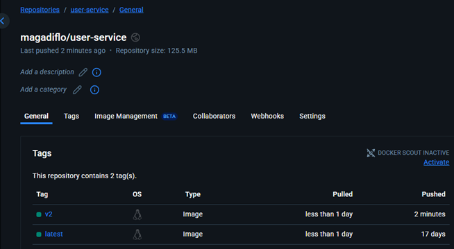

# Sección 14: Kubernetes

---

## Introducción

### [Kubernetes vs Docker Compose](https://www.theserverside.com/blog/Coffee-Talk-Java-News-Stories-and-Opinions/What-is-Kubernetes-vs-Docker-Compose-How-these-DevOps-tools-compare)

`Kubernetes y Docker Compose` **son marcos de orquestación de contenedores.**

- `Docker Compose` ejecuta contenedores en un único equipo anfitrión.
- `Kubernetes` ejecuta contenedores en varios ordenadores, virtuales o reales.


`Entendiendo Docker Compose`, como se mencionó anteriormente, Docker Compose es una tecnología de orquestación de
contenedores que está destinada a ejecutar una serie de contenedores en una sola máquina host. Los desarrolladores
crean un archivo Docker Compose que describe las imágenes de contenedor y la configuración con la que se compone el
Docker Compose. El nombre de este archivo es `compose.yml` o para versiones anteriores `docker-compose.yml`.

`Entendiendo Kubernetes`, como se ha mencionado anteriormente, Kubernetes es una tecnología de orquestación de
contenedores. Bajo Kubernetes, la lógica de una aplicación web se segmenta en contenedores. Los contenedores se
organizan en una abstracción llamada pod. Un pod puede tener uno o varios contenedores. La lógica de un pod se expone
a la red a través de otra abstracción de Kubernetes denominada servicio. En resumen, la red conoce los servicios de
Kubernetes y un servicio conoce el pod o los pods que tienen su lógica. Dentro de cada pod hay uno o varios
contenedores que realizan la lógica del pod en cuestión (Ver figura de abajo).

Un servicio de Kubernetes expone la lógica de los contenedores de un pod a la red.


En `Kubernetes`, los contenedores, pods y servicios se alojan dentro de una colección de uno o varios equipos, reales
o virtuales. En la jerga de `Kubernetes`, `un ordenador se denomina nodo`. `Kubernetes` se ejecuta en varios nodos.
La colección de nodos se denomina `clúster de Kubernetes`.

Los pods y los contenedores asociados a un servicio se pueden alojar en varios equipos. Además, Kubernetes tiene
características de escalado y tolerancia a errores que hacen que Kubernetes pueda crear automáticamente más pods en
tiempo de ejecución para satisfacer el aumento de la demanda sin pérdida de servicio. Además, si un pod falla,
Kubernetes lo repondrá automáticamente. Docker Compose admite reinicios automáticos en caso de error, pero no está
diseñado para admitir el escalado automático.

Lo importante que hay que entender sobre la diferencia entre Docker Compose es que, mientras que en Docker Compose, un
contenedor y su servicio y red correspondientes se ejecutan en una sola máquina, en Kubernetes los contenedores se
organizan según una abstracción llamada pod. Un pod puede ser utilizado por uno o varios servicios, y los pods asociados
a un solo servicio suelen estar distribuidos en varios equipos.

### [¿Qué es Kubernetes?](https://kubernetes.io/es/docs/concepts/overview/what-is-kubernetes/)

`Kubernetes (K8s)` es una plataforma de código abierto para automatizar la implementación, el escalado y la
administración de aplicaciones en contenedores.

El despliegue de contenedores con `Kubernetes` pueden ayudarnos de mejor forma y más estandarizada.

- `Revisión de salud (health check) del contenedor y re-deploy`, los contenedores pueden fallar y detenerse, se pueden
  caer y necesitan ser reemplazados.
- `Autoescalado (Autoscaling)`, necesitamos escalar nuestros servicios según aumenta o disminuye el tráfico.
- `Balanceo de carga (Load Balancer)`, distribuir uniformemente el tráfico entrante o carga de trabajo entre los
  contenedores.

`Kubernetes` provee configuración estandarizada, archivos de manifiesto `yml`, contenedores, números de instancias,
servicios, puertos, recursos, etc.

- Se puede llevar a cualquier proveedor en la nube como `Amazon EKS`, `Microsoft Azure`, `Google Cloud`, etc.
- O bien, se puede configurar en máquinas remotas o data centers administrador por nosotros, por ejemplo `VPS`.

📢 **IMPORTANTE**

> `Kubernetes` no es un servicio en la nube, sino más bien, es un software que podemos instalar y configurar en la nube
> ya sea en una máquina remota que administraremos nosotros (Ejm. EC2, algún otro VPS, etc), es decir, al igual que
> hicimos con `Docker` cuando usamos `Amazon EC2`, también podemos hacer lo mismo con `Kubernetes`, instalar y
> configurarlo, de forma que sea auto-administrada por nosotros.
>
> Por lo tanto, `Kubernetes` no es un proveedor de servicio, es un `framework` que nos ayuda en el despliegue de
> contenedores de forma automatizada con **revisión de salud, re-deploy, auto-escalamiento, balanceo de carga.**
>
> Podemos usar `Kubernetes` en `Amazon`, `Azure`, `Google Cloud`, etc.

## Conceptos Arquitectónicos detrás de Kubernetes

Un `clúster de Kubernetes` consta de un `control plane` y un conjunto de `máquinas de trabajo`, llamadas `nodos`, que
ejecutan aplicaciones en contenedores. Cada clúster necesita al menos un nodo de trabajo para ejecutar `pods`.

Los `nodos de trabajo` alojan los `pods` que componen la carga de trabajo de la aplicación. El `control plane`
administra los `nodos de trabajo` y los `pods` del clúster. En entornos de producción, el `control plane` suele
ejecutarse en varios equipos y un clúster suele ejecutar varios nodos, lo que proporciona tolerancia a fallos y alta
disponibilidad.

Este documento describe los diversos componentes necesarios para un `clúster de Kubernetes` completo y funcional.


### 🧠 Componentes del control plane

Los componentes del plano de control toman decisiones globales sobre el clúster (por ejemplo, el scheduling), además de
detectar y responder a eventos del clúster (por ejemplo, iniciar un nuevo pod cuando el campo de réplicas de una
implementación no está satisfecho).

Los componentes del plano de control se pueden ejecutar en cualquier equipo del clúster. Sin embargo, para simplificar,
los scripts de configuración suelen iniciar todos los componentes del plano de control en el mismo equipo y no ejecutan
contenedores de usuario en este.

### 🧠 Kube-apiserver

El `API Server` es un componente del plano de control de Kubernetes que expone la API de Kubernetes. El API server es
la interfaz del plano de control de Kubernetes.

La implementación principal de un API Server de Kubernetes es `kube-apiserver`. `Kube-apiserver` está diseñado para
escalar horizontalmente; es decir, escala mediante la implementación de más instancias. Se pueden ejecutar varias
instancias de `kube-apiserver` y equilibrar el tráfico entre ellas.Almacén de valores clave consistente y de alta
disponibilidad que se utiliza como almacén de respaldo de Kubernetes para todos los datos del clúster.

### 🧠 Etcd

Almacén de valores clave consistente y de alta disponibilidad que se utiliza como almacén de respaldo de `Kubernetes`
para todos los datos del clúster.

Si su clúster de Kubernetes utiliza etcd como almacén de respaldo, asegúrese de contar con un plan de respaldo para los
datos.

### 🧠 kube-scheduler

Es el componente del control plane encargado de asignar los `Pods` recién creados (que aún no están asignados a ningún
nodo) a un nodo disponible del clúster.

El scheduler evalúa varios factores como: uso de recursos, afinidad/anti-afinidad, restricciones de nodo, tolerancias y
más, para decidir en qué nodo es más adecuado ejecutar ese Pod.

### 🧠 kube-controller-manager

Es el componente que se encarga de ejecutar varios controladores (programas que vigilan el estado del clúster) en un
solo proceso.

Algunos de los controladores más importantes son:

- Node Controller: monitorea el estado de los nodos.
- Replication Controller: garantiza que el número deseado de réplicas de un Pod esté siempre corriendo.
- Endpoints Controller: gestiona los objetos Endpoint para servicios.
- Service Account & Token Controllers: maneja cuentas de servicio y tokens de acceso.

En resumen, el `kube-controller-manager` se asegura de que el estado real del clúster coincida con el estado deseado
definido en las configuraciones de Kubernetes.

### 🧠 cloud-controller-manager

Es un componente del `control plane` que permite que `Kubernetes` interactúe con los proveedores de nube (como `AWS`,
`GCP`, `Azure`).

Se encarga de separar la lógica específica del proveedor de nube del resto del clúster. Algunas de sus funciones
incluyen:

- Gestionar nodos según la infraestructura de nube (por ejemplo, eliminar nodos apagados).
- Asignar IPs externas a servicios.
- Crear balanceadores de carga (load balancers).

Solo es necesario si el clúster corre en un entorno de nube.

### 🧠 Componentes del Nodo (Node components)

Son los procesos que se ejecutan en cada `nodo del clúster` y se encargan de que los `Pods` funcionen correctamente.
Incluyen:

- `kubelet`: Agente que se comunica con el control plane, ejecuta los `Pods` en el nodo y reporta su estado.
- `kube-proxy`: Maneja la red en cada nodo, configurando reglas de red para permitir la comunicación entre `Pods` y
  `Servicios`.
- `Container Runtime`: Software que ejecuta los contenedores (por ejemplo, `containerd`, `CRI-O` o `Docker`).

Estos componentes son esenciales para que cada nodo participe activamente en el `clúster de Kubernetes`.

### 🧠 kubelet

Un agente que se ejecuta en cada nodo del clúster. Garantiza que los contenedores se ejecuten en un pod.

`Kubelet` toma un conjunto de `PodSpecs` proporcionados mediante diversos mecanismos y garantiza que los contenedores
descritos en ellas se ejecuten correctamente. Kubelet no administra contenedores que no hayan sido creados por
Kubernetes.

### 🧠 Container runtime

Un componente fundamental que permite a `Kubernetes` ejecutar contenedores eficazmente. Se encarga de gestionar la
ejecución y el ciclo de vida de los contenedores dentro del entorno de `Kubernetes`.

A continuación se muestra el diagrama de la arquitectura de kubernetes mostrado en el curso.


📝 **NOTA**

- `Minikube` es una herramienta que nos permite crear un clúster local de `Kubernetes` en nuestra máquina. Es ideal para
  desarrollo y pruebas, ya que simula un entorno de clúster real.


- `kubectl` (**abreviatura de Kubernetes control**) es la `herramienta de línea de comandos` para interactuar con un
  clúster de `Kubernetes`. Permite ejecutar comandos para desplegar aplicaciones, inspeccionar recursos y administrar el
  clúster. Funciona tanto con `minikube` en entornos locales como con clústeres remotos en la nube (por ejemplo,
  en `Amazon EKS`, `Google GKE`, `Azure AKS`, etc.).

## Introducción a los objetos de Kubernetes

`Kubernetes` define y gestiona su infraestructura a través de una serie de objetos que representan el estado deseado
del sistema. Estos objetos son entidades persistentes del clúster y permiten declarar qué quieres que ocurra
(por ejemplo, cuántas réplicas de una aplicación deben estar ejecutándose), y `Kubernetes` se encarga de hacerlo
realidad.

A continuación se listan algunos de los objetos fundamentales en Kubernetes:

- 💡 `Pod`: Unidad más pequeña de ejecución. Representa una o más contenedores que comparten almacenamiento, red y
  especificaciones sobre cómo ejecutar los contenedores.


- 💡 `Deployment`: Controlador que gestiona la creación y actualización de réplicas de `Pods` de forma declarativa.
  Permite realizar escalamiento y actualizaciones sin tiempo de inactividad.


- 💡 `Service`: Objeto que expone un conjunto de `Pods` como un único servicio de red. Garantiza acceso estable a los
  `Pods`, incluso cuando sus direcciones IP cambian.


- 💡 `Namespace`: Mecanismo para agrupar y aislar recursos dentro de un mismo clúster. Útil para organizar ambientes
  (dev, staging, prod) o equipos.


- 💡 `Volume`: Abstracción para gestionar almacenamiento persistente que puede ser compartido entre contenedores de un
  mismo `Pod`.

## Pods en Kubernetes

Los `Pods` son la unidad más pequeña que se puede desplegar y administrar en `Kubernetes`. Representan una instancia en
ejecución de una aplicación dentro del clúster.

Un `Pod` encapsula uno o más contenedores (por ejemplo, contenedores Docker), junto con recursos compartidos como:

- Dirección IP y puerto
- Almacenamiento (volúmenes)
- Configuraciones para la ejecución de contenedores

Los contenedores dentro de un mismo `Pod`:

- Se ejecutan en el mismo nodo.
- Comparten la misma red, por lo tanto, pueden comunicarse entre sí usando `localhost` y puertos expuestos.
- Pueden compartir almacenamiento, accediendo a los mismos volúmenes montados.
- Están co-ubicados y co-programados, lo que significa que se despliegan y se terminan juntos como una unidad lógica.

Por diseño, los contenedores dentro de un Pod están estrechamente relacionados. Esto es útil en casos donde uno de los
contenedores complementa al otro, como un contenedor principal que sirve la aplicación, y un contenedor sidecar que
recolecta logs o realiza tareas auxiliares.

> ⚠️ `Buenas prácticas`: Aunque un `Pod` puede contener varios contenedores, lo más habitual (y recomendable) es
> usar un solo contenedor por `Pod`. Esto simplifica la gestión, el escalamiento y el monitoreo de las aplicaciones.

### Comunicación entre Pods

- Cada `Pod` tiene su propia IP única dentro del clúster.
- La comunicación entre `Pods` se realiza a través de esta IP o mediante un Service, que actúa como punto de acceso
  estable incluso si los `Pods` cambian.

## Deployments en Kubernetes

Un `Deployment` es un objeto de `Kubernetes` que permite administrar el ciclo de vida de los `Pods` de forma
declarativa. Es uno de los controladores más comunes, y se utiliza para definir cómo crear, actualizar, escalar y
revertir instancias de una aplicación en contenedores.

Con un `Deployment` puedes:

- Crear y mantener múltiples réplicas de un `Pod` en ejecución.
- Realizar actualizaciones controladas (rolling updates) de versiones del contenedor sin tiempo de inactividad.
- Revertir a una versión anterior en caso de error.
- Escalar la aplicación (aumentar o reducir la cantidad de Pods) fácilmente.

El `Deployment` actúa como un controlador de alto nivel que administra objetos más bajos llamados ReplicaSets,
los cuales a su vez garantizan que el número especificado de `Pods` esté siempre corriendo.

Cuando defines un `Deployment` (mediante un manifiesto `YML`), indicas el estado deseado de la aplicación (imagen del
contenedor, cantidad de réplicas, puertos, etc.). `Kubernetes` se encarga de alinear el estado actual del sistema con
ese estado deseado de forma automática y segura.

> ⚙️ Las operaciones con `Deployments` suelen ejecutarse mediante `kubectl`, la herramienta de línea de comandos de
> Kubernetes disponible para Linux, macOS y Windows.

## Modos de creación de objetos

Existen dos enfoques principales para crear objetos en Kubernetes:

- `Imperativo`: Se realiza directamente desde la línea de comandos (`kubectl`) especificando los parámetros de manera
  explícita. Es útil para tareas rápidas, pero difícil de reproducir y versionar.

  Ejemplo:

  ````bash
  $ kubectl run mi-app --image=nginx --port=80
  ````

- `Declarativo`: Se basa en archivos de configuración `YML` (también llamados manifiestos), donde se describe el estado
  deseado del objeto. Es el enfoque recomendado para entornos productivos, ya que facilita el versionado, reutilización
  y control de cambios.

  Ejemplo:
  ````yml
  apiVersion: apps/v1
  kind: Deployment
  metadata:
    name: mi-app
  spec:
    replicas: 2
    selector:
      matchLabels:
        app: mi-app
  ...
  ````

## Instalando Herramientas

### [Kubectl](https://kubernetes.io/docs/tasks/tools/#kubectl)

La herramienta de línea de comandos de `Kubernetes`, `kubectl`, permite ejecutar comandos en clústeres de `Kubernetes`.
Puede usar `kubectl` para implementar aplicaciones, inspeccionar y administrar recursos del clúster y consultar
registros.

`kubectl` se puede instalar en diversas plataformas Linux, macOS y Windows. Para ver las distintas formas de instalar
`kubectl` en nuestra máquina de windows podemos visitar el siguiente enlace
[Install and Set Up kubectl on Windows](https://kubernetes.io/docs/tasks/tools/install-kubectl-windows/).

En nuestro caso elegimos la opción de instalar `kubectl` mediante el administrador de paquetes
[Chocolatey](https://community.chocolatey.org/). Para eso podemos visitar el siguiente enlace
[Install on Windows using Chocolatey, Scoop, or winget](https://kubernetes.io/docs/tasks/tools/install-kubectl-windows/#install-nonstandard-package-tools)
o, si no, ir directamente a la página de [Chocolatey](https://community.chocolatey.org/).

Pero para resumir lo que haremos será:

- Abrir el `PowerShell` de windows en modo administrador y ejecutar el siguiente comando para instalar el administrador
  de paquetes chocolatey.
  ````bash
  $ Set-ExecutionPolicy Bypass -Scope Process -Force; [System.Net.ServicePointManager]::SecurityProtocol = [System.Net.ServicePointManager]::SecurityProtocol -bor 3072; iex ((New-Object System.Net.WebClient).DownloadString('https://community.chocolatey.org/install.ps1'))
  ````
- Una vez que finalice la instalación, comprobamos que se efectuó correctamente.
  ````bash
  $ choco --version
  2.4.3
  ````
- Ahora ya podemos instalar `kubectl`, para eso ejecutamos el comando de abajo (en el proceso nos pedirá que si queremos
  ejecutar un script, solo le decimos que sí con `Y`).
  ````bash
  $ choco install kubernetes-cli
  ````

- Finalizada la instalación de `kubectl`, comprobamos que se efectuó correctamente.
  ````bash
  $ kubectl version --client
  Client Version: v1.33.2
  Kustomize Version: v5.6.0
  ````

Luego de la instalación haremos dos cosas:

- Verificar que el directorio `.kube` exista en la siguiente ruta: `C:\Users\magadiflo\.kube`.
- Si no existe, crearlo manualmente o con `mkdir .kube`.
- Dentro del directorio `.kube` creamos el archivo `config` sin extensión usando el siguiente comando:
  ````bash
  $ touch config
  ````

### [Minikube](https://kubernetes.io/docs/tasks/tools/#minikube)

`Minikube` es `Kubernetes local`, enfocado en facilitar el aprendizaje y desarrollo para `Kubernetes`.

Solo necesitas un contenedor `Docker` (o similarmente compatible) o un entorno de máquina virtual, y `Kubernetes` está
a un solo comando: `minikube start`.

[Pasos para instalar minikube:](https://minikube.sigs.k8s.io/docs/start/?arch=%2Fwindows%2Fx86-64%2Fstable%2F.exe+download)

- Descargamos e instalamos la
  [última versión](https://storage.googleapis.com/minikube/releases/latest/minikube-installer.exe) del instalador.

Luego de la instalación:

- Volvemos a abrir la terminal, esta vez con `acceso de administrador`, y ejecutamos:
  ````bash
  $ minikube start --driver=docker
  ````
    - `minikube start`, inicia un clúster de Kubernetes local. Este clúster está compuesto por un solo nodo que actúa
      como control plane (es decir, cumple el rol de maestro y trabajador a la vez). Es ideal para entornos de
      desarrollo, pruebas y aprendizaje.
    - `--driver=docker`, este flag le `indica a Minikube qué tecnología utilizar` para crear y ejecutar el clúster
      local. Minikube soporta múltiples drivers como `docker`, `virtualbox`, `hyperv`, entre otros. En este caso, se
      usa `Docker` como backend, lo que permite levantar el clúster dentro de un contenedor en lugar de una máquina
      virtual, haciendo el proceso más rápido y liviano.


- Luego de iniciar minikube con el driver `docker`, vemos que la ejecución se efectúa correctamente:
  ````bash
  $ minikube start --driver=docker
  * minikube v1.36.0 on Microsoft Windows 11 Pro 10.0.26100.4652 Build 26100.4652
  * Using the docker driver based on user configuration
  * Using Docker Desktop driver with root privileges
  * Starting "minikube" primary control-plane node in "minikube" cluster
  * Pulling base image v0.0.47 ...
  * Creating docker container (CPUs=2, Memory=8100MB) ...
    ! Failing to connect to https://registry.k8s.io/ from inside the minikube container
  * To pull new external images, you may need to configure a proxy: https://minikube.sigs.k8s.io/docs/reference/networking/proxy/
  * Preparing Kubernetes v1.33.1 on Docker 28.1.1 ...
    - Generating certificates and keys ...
    - Booting up control plane ...
    - Configuring RBAC rules ...
  * Configuring bridge CNI (Container Networking Interface) ...
  * Verifying Kubernetes components...
    - Using image gcr.io/k8s-minikube/storage-provisioner:v5
  * Enabled addons: storage-provisioner, default-storageclass
  * Done! kubectl is now configured to use "minikube" cluster and "default" namespace by default
  ````

- Procedemos a verificar el `status` de `minikube`.
  ````bash
  $ minikube status
  minikube
  type: Control Plane
  host: Running
  kubelet: Running
  apiserver: Running
  kubeconfig: Configured
  ````
  > Aunque `Minikube` con `Docker` ejecuta `Kubernetes` dentro de un contenedor, el clúster se conserva entre reinicios
  > del sistema siempre que no se elimine manualmente. Al volver a encender la PC, basta con ejecutar `minikube start`
  > para restaurar el clúster y continuar trabajando con los `deployments` y `servicios` previamente creados.
  >
  > Una vez creado el clúster con `--driver=docker`, ya no es necesario volver a especificar el driver en futuros
  > arranques. `Minikube` recuerda la configuración utilizada. Basta con ejecutar `minikube start` para reiniciar el
  > clúster existente.

En el apartado de creación de `kubectl` creamos el archivo `config` en la siguiente ruta
`C:\Users\magadiflo\.kube\config`. Si ahora revisamos dicho archivo, veremos que se habrá poblado con las
configuraciones de clúster de `minikube` para que `kubectl` se pueda comunicar con él.

````yml
apiVersion: v1
clusters:
  - cluster:
      certificate-authority: C:\Users\magadiflo\.minikube\ca.crt
      extensions:
        - extension:
            last-update: Fri, 18 Jul 2025 23:26:20 -05
            provider: minikube.sigs.k8s.io
            version: v1.36.0
          name: cluster_info
      server: https://127.0.0.1:56164
    name: minikube
contexts:
  - context:
      cluster: minikube
      extensions:
        - extension:
            last-update: Fri, 18 Jul 2025 23:26:20 -05
            provider: minikube.sigs.k8s.io
            version: v1.36.0
          name: context_info
      namespace: default
      user: minikube
    name: minikube
current-context: minikube
kind: Config
preferences: { }
users:
  - name: minikube
    user:
      client-certificate: C:\Users\magadiflo\.minikube\profiles\minikube\client.crt
      client-key: C:\Users\magadiflo\.minikube\profiles\minikube\client.key
````

## 🚨 Importante

> Durante las primeras secciones de este tutorial estuve utilizando el driver `--driver=hyperv` para levantar el clúster
> de `Minikube`. Sin embargo, experimenté diversos problemas de estabilidad y conectividad, lo cual me llevó a tomar la
> decisión de cambiar al driver `--driver=docker`.
>
> Por esta razón, es posible que en algunas partes de la documentación aún veamos el uso de `--driver=hyperv`. A
> partir del apartado `142. Escribiendo Deployment y Service de cursos`, todo el trabajo con `Minikube` será realizado
> usando `--driver=docker`, ya que ofrece una experiencia más estable y sencilla al integrarse directamente con
> `Docker Desktop`.
>
> Para mantener coherencia y continuidad, en ese apartado de la `142. Escribiendo Deployment y Service de cursos`
> reconstruiré los deployments y servicios previos utilizando el nuevo driver.

## Creando deployment MySQL - Forma Imperativa

Antes de crear el deployment con `MySQL` debemos asegurarnos de levantar `minikube`, así que ejecutamos el siguiente
comando usando la línea de comandos en `modo administrador`:

````bash
$ minikube start --driver=hyperv
* minikube v1.36.0 on Microsoft Windows 11 Pro 10.0.26100.4349 Build 26100.4349
* Using the hyperv driver based on existing profile
* Starting "minikube" primary control-plane node in "minikube" cluster
* Restarting existing hyperv VM for "minikube" ...
! Image was not built for the current minikube version. To resolve this you can delete and recreate your minikube cluster using the latest images. Expected minikube version: v1.35.0 -> Actual minikube version: v1.36.0
! Failing to connect to https://registry.k8s.io/ from inside the minikube VM
* To pull new external images, you may need to configure a proxy: https://minikube.sigs.k8s.io/docs/reference/networking/proxy/
* Preparing Kubernetes v1.33.1 on Docker 28.0.4 ...
* Configuring bridge CNI (Container Networking Interface) ...
* Verifying Kubernetes components...
  - Using image gcr.io/k8s-minikube/storage-provisioner:v5
* Enabled addons: storage-provisioner, default-storageclass
* Done! kubectl is now configured to use "minikube" cluster and "default" namespace by default
````

**NOTA**
> Si al ejecutar el `minikube start` nos sale el siguiente mensaje:  `Unable to resolve the current
> Docker CLI context "default": context "default" does not exist`, podemos detener el servicio con `minikube stop`
> y luego ejecutar el siguiente comando: `docker context use default`. Ahora sí volvemos a iniciar minikube y ya no
> deberíamos ver ese mensaje.

Verificamos que se estén ejecutando todos los servicios:

````bash
$ minikube status
minikube
type: Control Plane
host: Running
kubelet: Running
apiserver: Running
kubeconfig: Configured
````

Ahora sí, iniciamos con la creación del `deployment` para `MySQL`. Recordemos que un deployment tendrá un pod y un pod
tendrá uno o muchos contenedores (en nuestro caso idealmente solo uno). El contenedor que crearemos requerirá una
imagen.

La imagen en kubernetes siempre se descarga de `docker hub`. Ahora, con la `forma imperativa`
`no podemos mandar variables de entorno (ambiente)`, que es lo que en este caso está esperando la imagen de `MySQL`
como el asignar un nombre a la base de datos, el username, el password, etc., por lo que al crear el deployment de
manera imperativa esperaremos obtener errores.

````bash
$ kubectl create deployment d-mysql --image=mysql:8.0.41-debian --port=3306
deployment.apps/d-mysql created
````

### 📋 ¿Qué hace este comando?

Este comando crea un `Deployment` en `Kubernetes` llamado `d-mysql` que:

1. Despliega un `Pod` con un `contenedor` basado en la imagen oficial de `MySQL 8.0.41` (versión Debian).
2. El contenedor usará internamente el puerto `3306` (por defecto en MySQL). Este puerto solo está disponible dentro
   del Pod y no es accesible desde fuera del clúster a menos que se cree un Service.

**Resumen**

- `create deployment`, indica que se creará un recurso del tipo `Deployment`, que gestiona réplicas y actualizaciones
  de `Pods`.
- `d-mysql`, es el nombre asignado al `Deployment`, y por defecto, el nombre de los `Pods` creados por este comenzará
  con ese nombre seguido de un identificador aleatorio.
- `--image=mysql:8.0.41-debian`, imagen de Docker que se usará para el contenedor. En este caso, MySQL 8 basado en
  Debian que bajada de `Docker Hub`.
- `--port=3306`, indica que el contenedor escuchará internamente en el puerto `3306`, que es el puerto por defecto de
  MySQL. Sin embargo, este parámetro `no expone el puerto fuera del Pod`, ni crea un Service. Para permitir el acceso
  desde otros Pods o desde fuera del clúster, es necesario crear un Service por separado.

### 📌 Nota importante

Este comando:

- `No crea un Service`, así que el contenedor `no es accesible desde fuera del clúster` todavía.
- El `comando imperativo` no permite asignar variables de entorno como `MYSQL_ROOT_PASSWORD`, por lo que `MySQL` no
  iniciará correctamente. Para definir variables de ambiente es necesario usar la `forma declarativa`, mediante un
  archivo `YAML`. Por eso pueden aparecer errores al iniciar el contenedor.

Si listamos los deployments veremos que el deployment que acabamos de construir `d-mysql` tiene el valor
`READY: 0/1`. Eso significa que no está listo, ya que el contenedor de `MySQL` espera recibir variables de ambiente y
no le hemos pasado, por eso `no está READY`.

````bash
$ kubectl get deployments
NAME      READY   UP-TO-DATE   AVAILABLE   AGE
d-mysql   0/1     1            0           47s
````

Listamos los pods y vemos que estamos obteniendo lo mismo, es decir el status del pod está en `CrashLoopBackOff`, como
que ocurrió un error y es precisamente por lo de las variables de entorno que el contenedor de mysql espera recibir,
pero que no le hemos pasado.

````bash
$ kubectl get pods
NAME                       READY   STATUS             RESTARTS       AGE
d-mysql-7cbc75f4bd-mvgcf   0/1     CrashLoopBackOff   9 (3m2s ago)   24m
````

Podemos describir el pod para ver qué ocurrió.

````bash
$ kubectl describe pods d-mysql-7cbc75f4bd-mvgcf
Name:             d-mysql-7cbc75f4bd-mvgcf
Namespace:        default
Priority:         0
Service Account:  default
Node:             minikube/172.25.48.212
Start Time:       Wed, 25 Jun 2025 23:55:50 -0500
Labels:           app=d-mysql
                  pod-template-hash=7cbc75f4bd
Annotations:      <none>
Status:           Running
IP:               10.244.0.5
IPs:
  IP:           10.244.0.5
Controlled By:  ReplicaSet/d-mysql-7cbc75f4bd
Containers:
  mysql:
    Container ID:   docker://ab9887847eca5d7bafa2487ae6b2b21f72b30d0e8bcfbbabea7469bfd77a38fc
    Image:          mysql:8.0.41-debian
    Image ID:       docker-pullable://mysql@sha256:b2252987e0ecdb820e96928948ac3bca1adcd2b4a2a2c7b0d7ea78f77a9dc6ac
    Port:           3306/TCP
    Host Port:      0/TCP
    State:          Waiting
      Reason:       CrashLoopBackOff
    Last State:     Terminated
      Reason:       Error
      Exit Code:    1
      Started:      Thu, 26 Jun 2025 00:22:49 -0500
      Finished:     Thu, 26 Jun 2025 00:22:49 -0500
    Ready:          False
    Restart Count:  10
    Environment:    <none>
    Mounts:
      /var/run/secrets/kubernetes.io/serviceaccount from kube-api-access-g6wd7 (ro)
Conditions:
  Type                        Status
  PodReadyToStartContainers   True
  Initialized                 True
  Ready                       False
  ContainersReady             False
  PodScheduled                True
Volumes:
  kube-api-access-g6wd7:
    Type:                    Projected (a volume that contains injected data from multiple sources)
    TokenExpirationSeconds:  3607
    ConfigMapName:           kube-root-ca.crt
    Optional:                false
    DownwardAPI:             true
QoS Class:                   BestEffort
Node-Selectors:              <none>
Tolerations:                 node.kubernetes.io/not-ready:NoExecute op=Exists for 300s
                             node.kubernetes.io/unreachable:NoExecute op=Exists for 300s
Events:
  Type     Reason     Age                   From               Message
  ----     ------     ----                  ----               -------
  Normal   Scheduled  29m                   default-scheduler  Successfully assigned default/d-mysql-7cbc75f4bd-mvgcf to minikube
  Normal   Pulling    29m                   kubelet            Pulling image "mysql:8.0.41-debian"
  Normal   Pulled     29m                   kubelet            Successfully pulled image "mysql:8.0.41-debian" in 34.872s (34.872s including waiting). Image size: 609852301 bytes.
  Normal   Created    13m (x9 over 29m)     kubelet            Created container: mysql
  Normal   Started    13m (x9 over 29m)     kubelet            Started container mysql
  Warning  BackOff    4m6s (x119 over 29m)  kubelet            Back-off restarting failed container mysql in pod d-mysql-7cbc75f4bd-mvgcf_default(1ca29ba5-12eb-4013-bfc0-a5e4707240aa)
  Normal   Pulled     2m54s (x10 over 29m)  kubelet            Container image "mysql:8.0.41-debian" already present on machine
````

Otra forma de ver en detalle el error que ocurrió es con el comando `kubectl logs`:

````bash
$ kubectl logs d-mysql-7cbc75f4bd-mvgcf
2025-06-26 05:22:49+00:00 [Note] [Entrypoint]: Entrypoint script for MySQL Server 8.0.41-1debian12 started.
2025-06-26 05:22:49+00:00 [Note] [Entrypoint]: Switching to dedicated user 'mysql'
2025-06-26 05:22:49+00:00 [Note] [Entrypoint]: Entrypoint script for MySQL Server 8.0.41-1debian12 started.
2025-06-26 05:22:49+00:00 [ERROR] [Entrypoint]: Database is uninitialized and password option is not specified
    You need to specify one of the following as an environment variable:
    - MYSQL_ROOT_PASSWORD
    - MYSQL_ALLOW_EMPTY_PASSWORD
    - MYSQL_RANDOM_ROOT_PASSWORD
````

## Creando deployment MySQL - Forma Declarativa

Lo primero que haremos será eliminar el `deployment` creado en el apartado anterior.

````bash
$ kubectl delete deployment d-mysql
deployment.apps "d-mysql" deleted
````

La idea en este apartado es que a partir de la forma `imperativa`, es decir, mediante la línea de comandos
podamos crear el `deployment` en forma `declarativa` generando la configuración en un archivo `yml`.

Para organizar mejor nuestros archivos, vamos a crear un directorio en la raíz de este proyecto llamado `/kubernetes`
y dentro de él del directorio `/deployments` donde iremos colocando todos los archivos relacionados a él.

Ejecutamos el siguiente comando para generar el archivo `YAML` del `Deployment` de `MySQL`:

````bash
D:\programming\spring\01.udemy\02.andres_guzman\08.docker_kubernetes\docker-kubernetes (feature/section-14)
$ kubectl create deployment d-mysql --image=mysql:8.0.41-debian --port=3306 --dry-run=client -o yaml > .\kubernetes\deployments\deployment-mysql.yml
````

**DONDE**

- `kubectl create deployment d-mysql --image=mysql:8.0.41-debian --port=3306`, crea un `Deployment` llamado `d-mysql`
  de forma imperativa, especificando la imagen de MySQL versión `8.0.41-debian` y el puerto `3306`.
- `--dry-run=client`, simula la creación del recurso y muestra la configuración resultante, pero sin enviarla al
  clúster. Útil para verificar o generar archivos de configuración. En nuestro caso nos permitirá colocar la
  configuración resultante en un archivo `yml`.
- `-o yaml`, define que la salida se muestre en formato `YAML`.
- `deployment-mysql.yml`, le damos un nombre al archivo de configuración del deployment de mysql.
- `> ./kubernetes/deployments/deployment-mysql.yml`, redirige la salida del comando al archivo `deployment-mysql.yml`
  dentro de la carpeta `kubernetes/deployments`.

Como salida podemos observar en el directorio `./kubernetes/deployments` el archivo `deployment-mysql.yml`
con la siguiente configuración por defecto (algunas configuraciones no lo vamos a necesitar):

````yml
apiVersion: apps/v1
kind: Deployment
metadata:
  creationTimestamp: null
  labels:
    app: d-mysql
  name: d-mysql
spec:
  replicas: 1
  selector:
    matchLabels:
      app: d-mysql
  strategy: { }
  template:
    metadata:
      creationTimestamp: null
      labels:
        app: d-mysql
    spec:
      containers:
        - image: mysql:8.0.41-debian
          name: mysql
          ports:
            - containerPort: 3306
          resources: { }
status: { }
````

Limpiamos el archivo yml anterior y dejamos solo las configuraciones importantes agregando, por supuesto, las variables
de entorno, que fueron el motivo por le cuál creamos este archivo.

````yml
apiVersion: apps/v1
kind: Deployment                            # <-- Este recurso es el Deployment
metadata:
  name: d-mysql                             # Nombre del Deployment
spec:
  replicas: 1                               # Cantidad de Pods que debe mantener
  selector:
    matchLabels:
      app: d-mysql                          # <<< Importantísimo: Este selector indica que va a controlar los Pods que tengan la etiqueta app: d-mysql
  template: #                               <<< AQUÍ empieza la plantilla del POD
    metadata:
      labels:
        app: d-mysql                        # <<< Etiqueta que tendrán los Pods creados por este Deployment
    spec:
      containers: #                           <<< Aquí defines los contenedores del POD
        - image: mysql:8.0.41-debian
          name: c-mysql
          ports:
            - containerPort: 3306
          env:
            - name: MYSQL_ROOT_PASSWORD
              value: magadiflo
            - name: MYSQL_DATABASE
              value: db_user_service
            - name: MYSQL_USER
              value: admin
            - name: MYSQL_PASSWORD
              value: magadiflo
````

**NOTA**
> En mi caso, le cambié el nombre del contenedor a `c-mysql`. Cuando generamos el archivo desde la línea de comandos,
> nos creó el nombre del contendor `mysql`, pero en mi caso lo renombré a `c-mysql` para tenerlo similar a cómo lo
> venimos trabajando en el `docker compose`.

#### ¿Qué parte es el POD?

El `Pod` en sí es todo lo que está dentro del bloque `template:`. Concretamente.

````yml
template:
  metadata:
    labels:
      app: d-mysql
  spec:
    containers:
      - ...
````

Ahora que ya tenemos el archivo del `deployment` con las variables de entorno agregadas, creamos el deployment pero
esta vez usando el comando `apply`, ya que usaremos un archivo `yml`. Es decir, cuando usemos un archivo `yml` la
instrucción será `apply` y no `create`.

````bash
$ kubectl apply -f .\kubernetes\deployments\deployment-mysql.yml
deployment.apps/d-mysql created
````

Ahora, debemos verificar que se ha creado el `deployment` llamado `d-mysql` y está en `READY 1/1`.

````bash
$ kubectl get deployments
NAME      READY   UP-TO-DATE   AVAILABLE   AGE
d-mysql   1/1     1            1           60s
````

Lo mismo debe ocurrir si listamos los pods.

````bash
$ kubectl get pods
NAME                       READY   STATUS    RESTARTS   AGE
d-mysql-7b947869d5-d77d4   1/1     Running   0          2m6s
````

Describimos el pod y vemos que todo está ok.

````bash
$ kubectl describe pods d-mysql-7b947869d5-d77d4
Name:             d-mysql-7b947869d5-d77d4
Namespace:        default
Priority:         0
Service Account:  default
Node:             minikube/172.25.48.212
Start Time:       Fri, 27 Jun 2025 00:18:25 -0500
Labels:           app=d-mysql
                  pod-template-hash=7b947869d5
Annotations:      <none>
Status:           Running
IP:               10.244.0.9
IPs:
  IP:           10.244.0.9
Controlled By:  ReplicaSet/d-mysql-7b947869d5
Containers:
  c-mysql:
    Container ID:   docker://ddd4ed7ac3ae8618818f6aefbb0852f1ed7a30913f0dbcd9a6c4a281d1d5fa63
    Image:          mysql:8.0.41-debian
    Image ID:       docker-pullable://mysql@sha256:b2252987e0ecdb820e96928948ac3bca1adcd2b4a2a2c7b0d7ea78f77a9dc6ac
    Port:           3306/TCP
    Host Port:      0/TCP
    State:          Running
      Started:      Fri, 27 Jun 2025 00:18:25 -0500
    Ready:          True
    Restart Count:  0
    Environment:
      MYSQL_ROOT_PASSWORD:  magadiflo
      MYSQL_DATABASE:       db_user_service
      MYSQL_USER:           admin
      MYSQL_PASSWORD:       magadiflo
    Mounts:
      /var/run/secrets/kubernetes.io/serviceaccount from kube-api-access-shnpg (ro)
Conditions:
  Type                        Status
  PodReadyToStartContainers   True
  Initialized                 True
  Ready                       True
  ContainersReady             True
  PodScheduled                True
Volumes:
  kube-api-access-shnpg:
    Type:                    Projected (a volume that contains injected data from multiple sources)
    TokenExpirationSeconds:  3607
    ConfigMapName:           kube-root-ca.crt
    Optional:                false
    DownwardAPI:             true
QoS Class:                   BestEffort
Node-Selectors:              <none>
Tolerations:                 node.kubernetes.io/not-ready:NoExecute op=Exists for 300s
                             node.kubernetes.io/unreachable:NoExecute op=Exists for 300s
Events:
  Type    Reason     Age    From               Message
  ----    ------     ----   ----               -------
  Normal  Scheduled  2m58s  default-scheduler  Successfully assigned default/d-mysql-7b947869d5-d77d4 to minikube
  Normal  Pulled     2m58s  kubelet            Container image "mysql:8.0.41-debian" already present on machine
  Normal  Created    2m58s  kubelet            Created container: c-mysql
  Normal  Started    2m58s  kubelet            Started container c-mysql
````

Si verificamos el log del pod `d-mysql-7b947869d5-d77d4` también observaremos que la ejecución es exitosa.

````bash
$ kubectl logs d-mysql-7b947869d5-d77d4
2025-06-27 05:18:25+00:00 [Note] [Entrypoint]: Entrypoint script for MySQL Server 8.0.41-1debian12 started.
2025-06-27 05:18:25+00:00 [Note] [Entrypoint]: Switching to dedicated user 'mysql'
2025-06-27 05:18:25+00:00 [Note] [Entrypoint]: Entrypoint script for MySQL Server 8.0.41-1debian12 started.
2025-06-27 05:18:26+00:00 [Note] [Entrypoint]: Initializing database files
...
2025-06-27 05:18:38+00:00 [Note] [Entrypoint]: Creating database db_user_service
2025-06-27 05:18:38+00:00 [Note] [Entrypoint]: Creating user admin
2025-06-27 05:18:38+00:00 [Note] [Entrypoint]: Giving user admin access to schema db_user_service
...
2025-06-27 05:18:40+00:00 [Note] [Entrypoint]: MySQL init process done. Ready for start up.

2025-06-27T05:18:40.909649Z 0 [System] [MY-010116] [Server] /usr/sbin/mysqld (mysqld 8.0.41) starting as process 1
2025-06-27T05:18:40.914564Z 1 [System] [MY-013576] [InnoDB] InnoDB initialization has started.
2025-06-27T05:18:41.169343Z 1 [System] [MY-013577] [InnoDB] InnoDB initialization has ended.
...
2025-06-27T05:18:41.411612Z 0 [System] [MY-011323] [Server] X Plugin ready for connections. Bind-address: '::' port: 33060, socket: /var/run/mysqld/mysqlx.sock
2025-06-27T05:18:41.411673Z 0 [System] [MY-010931] [Server] /usr/sbin/mysqld: ready for connections. Version: '8.0.41'  socket: '/var/run/mysqld/mysqld.sock'  port: 3306  MySQL Community Server - GPL.
````

## Creando el servicio MySQL para la comunicación interna mediante un hostname

Vamos a crear el servicio que nos permitirá exponer el `Deployment` de `MySQL` que creamos en el apartado anterior. De
esta forma, cuando se cree el `Pod` que contenga el contenedor del `user-service`, este podrá conectarse a `MySQL` de
manera estable y predecible.

> Un `Service` en `Kubernetes` es un recurso que define una abstracción de red para acceder a uno o varios `Pods`
> relacionados. En otras palabras, gestiona el tráfico hacia esos `Pods` mediante una `IP fija` que no cambia
> (`ClusterIP`) o un nombre de dominio (`hostname`) accesible dentro o fuera del clúster, según el tipo de servicio.

Antes de ejecutar el comando para crear el servicio, revisemos los principales tipos de `Service`:

- `ClusterIP` (por defecto): `permite la comunicación interna entre Pods` dentro del clúster de Kubernetes,
  independientemente de la máquina (`Node`) donde se encuentren. Es la opción más común cuando solo necesitas exponer
  el servicio para otros `Pods`.

- `NodePort`: expone el servicio a través de un puerto en cada Node del clúster, lo que `permite el acceso externo`
  (por ejemplo, desde fuera del clúster). Internamente, Kubernetes asigna un puerto dinámico en el rango `30000-32767`.

- `LoadBalancer`: crea automáticamente un balanceador de carga externo en el proveedor de nube (por ejemplo, GCP, AWS o
  Azure), que distribuye el tráfico entrante entre los `Pods`. También permite comunicación interna. Este tipo requiere
  soporte del proveedor de infraestructura.

Ahora sí, crearemos nuestro servicio usando el tipo `ClusterIP` y asignándole un nombre personalizado.

````bash
$ kubectl expose deployment d-mysql --port=3306 --type=ClusterIP --name=s-mysql
service/s-mysql exposed
````

**Donde**

- `d-mysql` es el nombre del Deployment que vamos a exponer.
- `--name=s-mysql` define el `nombre que tendrá el Service` que se crea. De este modo, el servicio se llamará `s-mysql`
  y su hostname interno será `s-mysql`.
- `--port=3306` es el puerto en el que el servicio estará escuchando. Este puerto debe coincidir con el puerto expuesto
  por el contenedor en el Deployment (`deployment-mysql.yml`), ya que `MySQL` escucha en ese puerto por defecto.

El nombre que le dimos a este servicio (`s-mysql`) en `kubernetes` es similar al nombre del servicio con el que
estuvimos trabajando en docker compose. Es decir, si revisamos el archivo `compose.yml` veremos que el servicio de
mysql se llama `s-mysql` y además, en el archivo `.env` del `user-service` tenemos variables de entorno, una de ellas
es el `DB_HOST` cuyo valor, precisamente es el nombre del servicio que está definido en el `compose.yml` (`s-mysql`).

````yml
# Database
DB_HOST=s-mysql
````

Esto significó, en docker compose, que el microservicio `user-service` podía comunicarse con la base de datos de mysql
a través del servicio de docker compose `s-mysql`.

Ahora, regresemos al servicio que acabamos de crear con `kubernetes`; como vemos, le hemos dado el nombre de
`--name=s-mysql`, simplemente por continuar con el mismo nombre, pero ahora estamos en kubernetes.

Ahora, un punto importante aquí es que el nombre del servicio `s-mysql` en kubernetes, no lo usaremos en ese archivo
`.env` (ese archivo es para docker compose), sino más bien lo definiremos directamente en el archivo `Deployment`
cuando creemos el deployment del microsrvicio `user-service` o como veremos más adelante, definiremos las variables de
entorno en los `ConfigMaps`.

**Nota**
> Cuando creas un `Service` con `kubectl expose`, `Kubernetes` genera automáticamente un selector que coincide con las
> etiquetas del `Deployment` para dirigir el tráfico al `Pod` correspondiente.

**Importante:**
> Si no defines explícitamente un nombre mediante `--name`, el `Service` tomará por defecto el mismo nombre que el
> `Deployment`. Por ejemplo, si omites `--name`, este comando:
>
> `kubectl expose deployment d-mysql --port=3306 --type=ClusterIP`
>
> Creará un Service llamado `d-mysql`.

Para listar los servicios y verificar el que acabamos de crear:

````bash
$ kubectl get services
NAME         TYPE        CLUSTER-IP      EXTERNAL-IP   PORT(S)    AGE
kubernetes   ClusterIP   10.96.0.1       <none>        443/TCP    2d1h
s-mysql      ClusterIP   10.105.86.104   <none>        3306/TCP   10m
````

> Observa que el servicio `s-mysql` no tiene un `EXTERNAL-IP`, ya que definimos el tipo `ClusterIP`, que expone el
> servicio únicamente para la comunicación interna entre los `Pods` del clúster.

Podemos inspeccionar con más detalle el servicio `s-mysql` utilizando `describe`:

````bash
$ kubectl describe service s-mysql
Name:                     s-mysql
Namespace:                default
Labels:                   <none>
Annotations:              <none>
Selector:                 app=d-mysql
Type:                     ClusterIP
IP Family Policy:         SingleStack
IP Families:              IPv4
IP:                       10.105.86.104
IPs:                      10.105.86.104
Port:                     <unset>  3306/TCP
TargetPort:               3306/TCP
Endpoints:                10.244.0.10:3306
Session Affinity:         None
Internal Traffic Policy:  Cluster
Events:                   <none>
````

**Puntos clave:**

- `Selector`: `app=d-mysql`. Este atributo es muy importante, ya que determina qué `Pods` serán seleccionados por el
  servicio. El `Service` reenvía el tráfico a los `Pods` que tengan esta etiqueta.
- `ClusterIP`: define que el tráfico solo será accesible dentro del clúster. Aunque no es un `LoadBalancer` externo,
  `Kubernetes` reparte las peticiones internas entre los `Pods` que coincidan con el selector
  (`balanceo de carga interno`).
- `Endpoints`: indica la IP interna y el puerto del Pod que actualmente atiende el tráfico en este servicio.

Para visualizar todo el estado actual de nuestros recursos, podemos ejecutar `kubectl get all`:

````bash
$ kubectl get all
NAME                           READY   STATUS    RESTARTS      AGE
pod/d-mysql-7b947869d5-d77d4   1/1     Running   1 (85m ago)   24h

NAME                 TYPE        CLUSTER-IP      EXTERNAL-IP   PORT(S)    AGE
service/kubernetes   ClusterIP   10.96.0.1       <none>        443/TCP    2d1h
service/s-mysql      ClusterIP   10.105.86.104   <none>        3306/TCP   13m

NAME                      READY   UP-TO-DATE   AVAILABLE   AGE
deployment.apps/d-mysql   1/1     1            1           24h

NAME                                 DESIRED   CURRENT   READY   AGE
replicaset.apps/d-mysql-7b947869d5   1         1         1       24h
````

## Creando deployment de usuarios

Recordemos que nuestro microservicio `user-service` está esperando variables de entorno, por lo que al crear un
`deployment` a través de la línea de comando no podemos mandar esas variables. En consecuencia, lo que haremos será
similar a lo que hicimos con `MySQL`, es decir, a partir de una instrucción de línea de comando (`imperativa`)
pasaremos a una forma `declarativa` creando el archivo `yml`.

Ejecutamos el siguiente comando para crear nuestro archivo de deployment `deployment-users.yml`.

````bash
D:\programming\spring\01.udemy\02.andres_guzman\08.docker_kubernetes\docker-kubernetes (feature/section-14)
$ kubectl create deployment d-user-service --image=magadiflo/user-service:latest --port=8001 --dry-run=client -o yaml > .\kubernetes\deployments\deployment-user.yml
````

⚠️ **Nota**
> La imagen (`magadiflo/user-service:latest`) que internamente usará el deployment `deployment-users.yml` será
> descargada desde `Docker Hub`, no desde nuestra máquina local.

Se nos creará el archivo `kubernetes/deployments/deployment-user.yml` a quien limpiaremos y dejaremos solo las opciones
necesarias. Además, agregaremos al final las variables de entorno que espera recibir el microservicio `user-service`.

````yml
apiVersion: apps/v1
kind: Deployment
metadata:
  name: d-user-service
spec:
  replicas: 1
  selector:
    matchLabels:
      app: d-user-service
  template:
    metadata:
      labels:
        app: d-user-service
    spec:
      containers:
        - image: magadiflo/user-service:latest
          name: c-user-service
          ports:
            - containerPort: 8001
          env:
            - name: CONTAINER_PORT
              value: '8001'
            - name: DB_HOST
              value: s-mysql
            - name: DB_PORT
              value: '3306'
            - name: DB_NAME
              value: db_user_service
            - name: DB_USERNAME
              value: admin
            - name: DB_PASSWORD
              value: magadiflo
            - name: COURSE_SERVICE_HOST
              value: s-course-service
            - name: COURSE_SERVICE_PORT
              value: '8002'
````

Ahora que ya tenemos el archivo del deployment `deployment-user.yml` con las variables de entorno agregadas; creamos
el deployment pero esta vez usando el comando `apply`, ya que estamos usando un archivo `yml`.

🚀 **Importante**
> Cuando usemos un archivo `yml` la instrucción será `apply` y no `create`.

````bash
$ kubectl apply -f .\kubernetes\deployments\deployment-user.yml
deployment.apps/d-user-service created
````

Listamos los deployments para ver si nuestro deployment `d-user-service` está `READY` `1/1`.

````bash
$ kubectl get deployments
NAME             READY   UP-TO-DATE   AVAILABLE   AGE
d-mysql          1/1     1            1           3d23h
d-user-service   1/1     1            1           89s
````

Lo mismo debe pasar si listamos los pods.

````bash
$ kubectl get pods
NAME                              READY   STATUS    RESTARTS      AGE
d-mysql-7b947869d5-d77d4          1/1     Running   2 (60m ago)   3d23h
d-user-service-7bc4ffb6df-xzlw5   1/1     Running   0             17m
````

Podemos ver todo el escenario completo.

````bash
$ kubectl get all
NAME                                  READY   STATUS    RESTARTS      AGE
pod/d-mysql-7b947869d5-d77d4          1/1     Running   2 (61m ago)   3d23h
pod/d-user-service-7bc4ffb6df-xzlw5   1/1     Running   0             17m

NAME                 TYPE        CLUSTER-IP      EXTERNAL-IP   PORT(S)    AGE
service/kubernetes   ClusterIP   10.96.0.1       <none>        443/TCP    5d
service/s-mysql      ClusterIP   10.105.86.104   <none>        3306/TCP   2d23h

NAME                             READY   UP-TO-DATE   AVAILABLE   AGE
deployment.apps/d-mysql          1/1     1            1           3d23h
deployment.apps/d-user-service   1/1     1            1           17m

NAME                                        DESIRED   CURRENT   READY   AGE
replicaset.apps/d-mysql-7b947869d5          1         1         1       3d23h
replicaset.apps/d-user-service-7bc4ffb6df   1         1         1       17m
````

Podemos ver el log del pod `d-user-service-7bc4ffb6df-xzlw5` correspondiente a nuestro deployment `d-user-service`.

````bash
$ kubectl logs d-user-service-7bc4ffb6df-xzlw5

  .   ____          _            __ _ _
 /\\ / ___'_ __ _ _(_)_ __  __ _ \ \ \ \
( ( )\___ | '_ | '_| | '_ \/ _` | \ \ \ \
 \\/  ___)| |_)| | | | | || (_| |  ) ) ) )
  '  |____| .__|_| |_|_| |_\__, | / / / /
 =========|_|==============|___/=/_/_/_/

 :: Spring Boot ::                (v3.4.5)

2025-07-01T04:56:02.851Z  INFO 1 --- [user-service] [           main] d.m.user.app.UserServiceApplication      : Starting UserServiceApplication v0.0.1-SNAPSHOT using Java 21.0.7 with PID 1 (/app/BOOT-INF/classes started by root in /app) 2025-07-01T04:56:02.855Z DEBUG 1 --- [user-service] [           main] d.m.user.app.UserServiceApplication      : Running with Spring Boot v3.4.5, Spring v6.2.6
2025-07-01T04:56:02.860Z  INFO 1 --- [user-service] [           main] d.m.user.app.UserServiceApplication      : The following 1 profile is active: "default"
2025-07-01T04:56:04.426Z  INFO 1 --- [user-service] [           main] .s.d.r.c.RepositoryConfigurationDelegate : Bootstrapping Spring Data JPA repositories in DEFAULT mode.
2025-07-01T04:56:04.469Z  INFO 1 --- [user-service] [           main] .s.d.r.c.RepositoryConfigurationDelegate : Finished Spring Data repository scanning in 35 ms. Found 1 JPA repository interface.
2025-07-01T04:56:04.694Z  INFO 1 --- [user-service] [           main] o.s.cloud.context.scope.GenericScope     : BeanFactory id=537a9c57-ed35-3f7c-a7cb-5fba7a46192c
2025-07-01T04:56:05.431Z  INFO 1 --- [user-service] [           main] o.s.b.w.embedded.tomcat.TomcatWebServer  : Tomcat initialized with port 8001 (http)
2025-07-01T04:56:05.447Z  INFO 1 --- [user-service] [           main] o.apache.catalina.core.StandardService   : Starting service [Tomcat]
2025-07-01T04:56:05.447Z  INFO 1 --- [user-service] [           main] o.apache.catalina.core.StandardEngine    : Starting Servlet engine: [Apache Tomcat/10.1.40]
2025-07-01T04:56:05.479Z  INFO 1 --- [user-service] [           main] o.a.c.c.C.[Tomcat].[localhost].[/]       : Initializing Spring embedded WebApplicationContext
2025-07-01T04:56:05.479Z  INFO 1 --- [user-service] [           main] w.s.c.ServletWebServerApplicationContext : Root WebApplicationContext: initialization completed in 2544 ms
2025-07-01T04:56:05.778Z  INFO 1 --- [user-service] [           main] o.hibernate.jpa.internal.util.LogHelper  : HHH000204: Processing PersistenceUnitInfo [name: default]
2025-07-01T04:56:05.818Z  INFO 1 --- [user-service] [           main] org.hibernate.Version                    : HHH000412: Hibernate ORM core version 6.6.13.Final
2025-07-01T04:56:05.841Z  INFO 1 --- [user-service] [           main] o.h.c.internal.RegionFactoryInitiator    : HHH000026: Second-level cache disabled
2025-07-01T04:56:06.068Z  INFO 1 --- [user-service] [           main] o.s.o.j.p.SpringPersistenceUnitInfo      : No LoadTimeWeaver setup: ignoring JPA class transformer
2025-07-01T04:56:06.091Z  INFO 1 --- [user-service] [           main] com.zaxxer.hikari.HikariDataSource       : HikariPool-1 - Starting...
2025-07-01T04:56:06.386Z  INFO 1 --- [user-service] [           main] com.zaxxer.hikari.pool.HikariPool        : HikariPool-1 - Added connection com.mysql.cj.jdbc.ConnectionImpl@17e2835c
2025-07-01T04:56:06.388Z  INFO 1 --- [user-service] [           main] com.zaxxer.hikari.HikariDataSource       : HikariPool-1 - Start completed.
2025-07-01T04:56:06.461Z  INFO 1 --- [user-service] [           main] org.hibernate.orm.connections.pooling    : HHH10001005: Database info:
        Database JDBC URL [Connecting through datasource 'HikariDataSource (HikariPool-1)']
        Database driver: undefined/unknown
        Database version: 8.0.41
        Autocommit mode: undefined/unknown
        Isolation level: undefined/unknown
        Minimum pool size: undefined/unknown
        Maximum pool size: undefined/unknown
2025-07-01T04:56:07.354Z  INFO 1 --- [user-service] [           main] o.h.e.t.j.p.i.JtaPlatformInitiator       : HHH000489: No JTA platform available (set 'hibernate.transaction.jta.platform' to enable JTA platform integration)
2025-07-01T04:56:07.396Z DEBUG 1 --- [user-service] [           main] org.hibernate.SQL                        :
    create table users (
        id bigint not null auto_increment,
        email varchar(255) not null,
        name varchar(255) not null,
        password varchar(255) not null,
        primary key (id)
    ) engine=InnoDB
2025-07-01T04:56:07.445Z DEBUG 1 --- [user-service] [           main] org.hibernate.SQL                        :
    alter table users
       drop index UK6dotkott2kjsp8vw4d0m25fb7
2025-07-01T04:56:07.702Z DEBUG 1 --- [user-service] [           main] org.hibernate.SQL                        :
    alter table users
       add constraint UK6dotkott2kjsp8vw4d0m25fb7 unique (email)
2025-07-01T04:56:07.734Z  INFO 1 --- [user-service] [           main] j.LocalContainerEntityManagerFactoryBean : Initialized JPA EntityManagerFactory for persistence unit 'default'
2025-07-01T04:56:08.263Z  WARN 1 --- [user-service] [           main] JpaBaseConfiguration$JpaWebConfiguration : spring.jpa.open-in-view is enabled by default. Therefore, database queries may be performed during view rendering. Explicitly configure spring.jpa.open-in-view to disable this warning
2025-07-01T04:56:09.109Z  INFO 1 --- [user-service] [           main] o.s.b.a.e.web.EndpointLinksResolver      : Exposing 1 endpoint beneath base path '/actuator'
2025-07-01T04:56:09.187Z  INFO 1 --- [user-service] [           main] o.s.b.w.embedded.tomcat.TomcatWebServer  : Tomcat started on port 8001 (http) with context path '/'
2025-07-01T04:56:09.200Z  INFO 1 --- [user-service] [           main] d.m.user.app.UserServiceApplication      : Started UserServiceApplication in 7.061 seconds (process running for 7.663)
````

Realizamos un describe para ver todo el detalle de nuestro deployment `d-user-service`.

````bash
$ kubectl describe deployment d-user-service
Name:                   d-user-service
Namespace:              default
CreationTimestamp:      Mon, 30 Jun 2025 23:55:49 -0500
Labels:                 <none>
Annotations:            deployment.kubernetes.io/revision: 1
Selector:               app=d-user-service
Replicas:               1 desired | 1 updated | 1 total | 1 available | 0 unavailable
StrategyType:           RollingUpdate
MinReadySeconds:        0
RollingUpdateStrategy:  25% max unavailable, 25% max surge
Pod Template:
  Labels:  app=d-user-service
  Containers:
   c-user-service:
    Image:      magadiflo/user-service:latest
    Port:       8001/TCP
    Host Port:  0/TCP
    Environment:
      CONTAINER_PORT:       8001
      DB_HOST:              s-mysql
      DB_PORT:              3306
      DB_NAME:              db_user_service
      DB_USERNAME:          admin
      DB_PASSWORD:          magadiflo
      COURSE_SERVICE_HOST:  s-course-service
      COURSE_SERVICE_PORT:  8002
    Mounts:                 <none>
  Volumes:                  <none>
  Node-Selectors:           <none>
  Tolerations:              <none>
Conditions:
  Type           Status  Reason
  ----           ------  ------
  Available      True    MinimumReplicasAvailable
  Progressing    True    NewReplicaSetAvailable
OldReplicaSets:  <none>
NewReplicaSet:   d-user-service-7bc4ffb6df (1/1 replicas created)
Events:
  Type    Reason             Age   From                   Message
  ----    ------             ----  ----                   -------
  Normal  ScalingReplicaSet  26m   deployment-controller  Scaled up replica set d-user-service-7bc4ffb6df from 0 to 1
````

Realizamos un describe del pod `d-user-service-7bc4ffb6df-xzlw5` correspondiente a nuestro deployment `d-user-service`.

````bash
$ kubectl describe pods d-user-service-7bc4ffb6df-xzlw5
Name:             d-user-service-7bc4ffb6df-xzlw5
Namespace:        default
Priority:         0
Service Account:  default
Node:             minikube/172.25.48.212
Start Time:       Mon, 30 Jun 2025 23:55:49 -0500
Labels:           app=d-user-service
                  pod-template-hash=7bc4ffb6df
Annotations:      <none>
Status:           Running
IP:               10.244.0.14
IPs:
  IP:           10.244.0.14
Controlled By:  ReplicaSet/d-user-service-7bc4ffb6df
Containers:
  c-user-service:
    Container ID:   docker://61fab55924ea4700429d9f581a9748e5c28fa4430129a497140fab47b2568ac0
    Image:          magadiflo/user-service:latest
    Image ID:       docker-pullable://magadiflo/user-service@sha256:d0edef392f95e3e3e082745d166f3f86da4fe3d29d86a3300ce0bcfb5ef68a4b
    Port:           8001/TCP
    Host Port:      0/TCP
    State:          Running
      Started:      Mon, 30 Jun 2025 23:56:01 -0500
    Ready:          True
    Restart Count:  0
    Environment:
      CONTAINER_PORT:       8001
      DB_HOST:              s-mysql
      DB_PORT:              3306
      DB_NAME:              db_user_service
      DB_USERNAME:          admin
      DB_PASSWORD:          magadiflo
      COURSE_SERVICE_HOST:  s-course-service
      COURSE_SERVICE_PORT:  8002
    Mounts:
      /var/run/secrets/kubernetes.io/serviceaccount from kube-api-access-w2cm4 (ro)
Conditions:
  Type                        Status
  PodReadyToStartContainers   True
  Initialized                 True
  Ready                       True
  ContainersReady             True
  PodScheduled                True
Volumes:
  kube-api-access-w2cm4:
    Type:                    Projected (a volume that contains injected data from multiple sources)
    TokenExpirationSeconds:  3607
    ConfigMapName:           kube-root-ca.crt
    Optional:                false
    DownwardAPI:             true
QoS Class:                   BestEffort
Node-Selectors:              <none>
Tolerations:                 node.kubernetes.io/not-ready:NoExecute op=Exists for 300s
                             node.kubernetes.io/unreachable:NoExecute op=Exists for 300s
Events:
  Type    Reason     Age   From               Message
  ----    ------     ----  ----               -------
  Normal  Scheduled  29m   default-scheduler  Successfully assigned default/d-user-service-7bc4ffb6df-xzlw5 to minikube
  Normal  Pulling    29m   kubelet            Pulling image "magadiflo/user-service:latest"
  Normal  Pulled     29m   kubelet            Successfully pulled image "magadiflo/user-service:latest" in 9.833s (9.833s including waiting). Image size: 270793294 bytes.
  Normal  Created    29m   kubelet            Created container: c-user-service
  Normal  Started    29m   kubelet            Started container c-user-service 
````

## Creando el servicio de usuarios para la comunicación, tráfico y LoadBalancer

En esta sección crearemos el servicio para el deployment `d-user-service` que creamos en el apartado anterior.

````bash
$ kubectl expose deployment d-user-service --port=8001 --type=LoadBalancer --name=s-user-service
service/s-user-service exposed
````

**Dónde:**

- `--port=8001`: es el puerto del servicio que manejará el tráfico dirigido a los pods y, dentro de cada pod, hacia el
  contenedor que ejecuta el microservicio `user-service`.
- `--type=LoadBalancer`: indicamos que `queremos exponer el servicio de forma externa al clúster`. Este tipo de
  servicio `solicita automáticamente un balanceador de carga` en la nube (en entornos reales), pero también permite
  comunicación interna mediante su `ClusterIP`.
- `--name=s-user-service`: nombre asignado a nuestro servicio.

Verificamos que el servicio `s-user-service` se haya creado correctamente:

````bash
$ kubectl get services
NAME             TYPE           CLUSTER-IP       EXTERNAL-IP   PORT(S)          AGE
kubernetes       ClusterIP      10.96.0.1        <none>        443/TCP          6d
s-mysql          ClusterIP      10.105.86.104    <none>        3306/TCP         3d23h
s-user-service   LoadBalancer   10.108.211.151   <pending>     8001:31277/TCP   37s
````

Observemos que la IP (`10.108.211.151`) que muestra el servicio `s-user-service` es una `IP privada` del clúster.
Esta IP, al igual que el nombre DNS interno (`s-user-service`), puede utilizarse para comunicación interna entre
microservicios dentro del clúster, pero no está disponible desde fuera.

Para la `comunicación externa` (por ejemplo, usando Postman o un cliente HTTP), normalmente se utiliza el `EXTERNAL-IP`.
Sin embargo, como estamos trabajando con `Minikube`, vemos que este campo aparece como `pending`, porque `Minikube`
no crea un balanceador de carga real como lo haría un proveedor de nube (por ejemplo, AWS, Azure o GCP).

No hay problema: podemos utilizar la IP del clúster de `Minikube` o las herramientas propias de `Minikube` para
acceder al servicio expuesto. Las opciones principales son:

- `minikube service s-user-service`: este comando abrirá automáticamente el navegador con la URL del servicio,
  resolviendo la IP y el puerto.


- `minikube tunnel`: crea un túnel que simula un balanceador de carga y asigna un `EXTERNAL-IP` real en tu máquina
  local.

> `Importante`: como estamos trabajando en un entorno local (un clúster ficticio), es normal que el `EXTERNAL-IP`
> aparezca como `pending`. En un entorno en la nube, este campo mostrará la IP pública asignada por el proveedor.

#### Nota sobre los puertos:

En `PORT(S)` observamos `8001:31277/TCP` para el servicio `s-user-service`, lo que significa:

- `8001`: el puerto expuesto por el servicio dentro del clúster.
- `31277`: el `NodePort` asignado automáticamente, a través del cual también se puede acceder al servicio si se
  configurara con `type=NodePort`.

### Obteniendo URL del servicio (IP y Puerto)

¿En `Minikube` cómo podemos acceder al `EXTERNAL-IP`?, para acceder al servicio con un URL accesible desde nuestro
equipo local, podemos utilizar el comando propio de `Minikube` para que nos muestre la IP y el puerto, tal como lo
señalamos anteriormente.

````bash
$ minikube service s-user-service --url
http://172.25.48.212:31277
````

Como observamos, este comando nos muestra la dirección IP asignada a la red virtual donde se ejecuta `Minikube`
(por ejemplo, la IP de la VM) junto con el puerto (`NodePort`) que `Kubernetes` ha expuesto. Esta URL es accesible
desde nuestra máquina local (`host`), por lo que podemos consumir el microservicio usando `Postman`, `navegador web`
o herramientas como `curl`.

> `Nota`: Esta IP no es pública en Internet, sino que está disponible solo dentro de nuestro equipo local o la red
> virtual de Minikube.

Al utilizar este acceso, el servicio tiene un comportamiento similar a un `LoadBalancer`: si tenemos varios `pods` que
ejecutan el microservicio `user-service`, `Kubernetes` distribuirá las solicitudes entrantes de manera balanceada
entre todos ellos.

Por ejemplo, si escalamos el `deployment` (no ejecutemos este comando, solo es parte del ejemplo).

````bash
$ kubectl scale deployment d-user-service --replicas=3
````

`Kubernetes` mantendrá las tres réplicas y el servicio `s-user-service` balanceará la carga automáticamente entre
esos `pods`.

### Pruebas de acceso HTTP a user-service mediante la URL expuesta por Minikube

Listamos los usuarios que tenemos registrados.

````bash
$ curl -v http://172.25.48.212:31277/api/v1/users | jq
>
< HTTP/1.1 200
< Content-Type: application/json
< Transfer-Encoding: chunked
< Date: Wed, 02 Jul 2025 06:06:20 GMT
<
[]
````

Vemos que inicialmente no tenemos ningún usuario, así que aprovechamos y creamos algunos de ellos.

````bash
$ curl -v -X POST -H "Content-Type: application/json" -d "{\"name\": \"Martin\", \"email\": \"martin@gmail.com\", \"password\": \"123456\"}" http://172.25.48.212:31277/api/v1/users | jq
>
< HTTP/1.1 201
< Location: http://172.25.48.212:31277/api/v1/users/1
< Content-Type: application/json
< Transfer-Encoding: chunked
< Date: Wed, 02 Jul 2025 06:08:34 GMT
<
{
  "id": 1,
  "name": "Martin",
  "email": "martin@gmail.com",
  "password": "123456"
}
````

Volvemos a listar los usuarios y vemos los que acabamos de registrar.

````bash
$ curl -v http://172.25.48.212:31277/api/v1/users | jq
>
< HTTP/1.1 200
< Content-Type: application/json
< Transfer-Encoding: chunked
< Date: Wed, 02 Jul 2025 06:10:51 GMT
<
[
  {
    "id": 1,
    "name": "Martin",
    "email": "martin@gmail.com",
    "password": "123456"
  },
  {
    "id": 2,
    "name": "Karen",
    "email": "karen@gmail.com",
    "password": "123456"
  },
  {
    "id": 3,
    "name": "María",
    "email": "maria@gmail.com",
    "password": "123456"
  },
  {
    "id": 4,
    "name": "Lucía",
    "email": "lucia@gmail.com",
    "password": "123456"
  }
] 
````

## Actualizando imagen de un deployment

Veamos otra característica de `kubectl` y `Kubernetes`: la posibilidad de modificar de forma imperativa (a través de
línea de comandos) la imagen de un `Deployment`.

Recordemos que un `Deployment` contiene uno o más `pods`, y cada `pod` contiene al menos un `contenedor`
(en nuestro caso solo tendrá uno). La idea es que, después de realizar alguna modificación en el código fuente de
nuestra aplicación, podamos actualizar la imagen del contenedor para desplegar los cambios sin necesidad de eliminar y
recrear el `Deployment` completo.

### Modificando código fuente

Para este ejemplo, realizamos una modificación en el código fuente del microservicio `user-service`, específicamente en
el controlador `UserController`.

````java

@Slf4j
@RequiredArgsConstructor
@RestController
@RequestMapping(path = "/api/v1/users")
public class UserController {

    private final UserService userService;
    private final ApplicationContext context;

    @GetMapping(path = "/simulate-an-error")
    public void simulateAnError() {
        var configurableApplicationContext = (ConfigurableApplicationContext) this.context;
        configurableApplicationContext.close();
    }

    @GetMapping
    public ResponseEntity<List<UserResponse>> findAllUsers() {
        log.info("¡Lista todos los usuarios!");
        return ResponseEntity.ok(this.userService.findAllUsers());
    }
    /* other code */
}
````

Los cambios realizados son los siguientes:

- Se agregó un nuevo endpoint `/simulate-an-error`, que utilizaremos más adelante para simular un fallo controlado
  en la aplicación. `Este endpoint cerrará el contexto de Spring`, provocando que el `contenedor falle`. Así podremos
  observar cómo `Kubernetes` reacciona al error, por ejemplo, `reiniciando el pod automáticamente`.


- En el método `findAllUsers()`, se añadió un mensaje de log que se imprimirá cada vez que se realice una solicitud a
  este endpoint.

### Sobre el endpoint /simulate-an-error

El endpoint `/simulate-an-error` está diseñado para provocar intencionalmente un fallo en la aplicación y así observar
cómo `Kubernetes` reacciona ante un contenedor que deja de funcionar.

Para lograrlo, utiliza el objeto `ApplicationContext`, que es el contenedor principal de `Spring`. Este contexto es
responsable de:

- Cargar la configuración de la aplicación.
- Instanciar y gestionar los beans.
- Administrar el ciclo de vida de la aplicación Spring.

En este ejemplo, el `ApplicationContext` se inyecta en el controlador como dependencia. Luego, en el método
`simulateAnError()`, se convierte a `ConfigurableApplicationContext`, que es una interfaz más específica que permite
realizar operaciones de ciclo de vida avanzadas, como detener o cerrar el contexto.

La llamada a:

````bash
configurableApplicationContext.close();
````

Provoca el cierre inmediato del contexto de Spring, lo que tiene como efecto:

- Finalizar todos los beans gestionados por Spring.
- Detener los hilos de fondo que mantiene el contenedor de Spring Boot.
- Apagar completamente la aplicación.

Desde la perspectiva de `Kubernetes`, el contenedor dejará de responder y eventualmente se detendrá, haciendo que el
`pod` entre en estado `CrashLoopBackOff` o similar. Si el `Deployment` tiene configurada una política de reinicio
(por defecto `Always`), `Kubernetes` creará automáticamente un `nuevo pod` para reemplazar al que falló.

En resumen, este mecanismo se utiliza aquí como una forma controlada de simular un error crítico, validar el
comportamiento de autocomposición de `Kubernetes` y comprobar que el clúster mantiene disponible la aplicación incluso
ante fallos en la ejecución.

### Generando imagen de user-service con los nuevos cambios

Una vez completadas las modificaciones en el código fuente, es necesario generar una nueva imagen de `Docker` que
contenga estos cambios. Para ello, se utilizará el `Dockerfile` del `user-service` y se construirá la imagen
actualizada que después se podrá publicar en un repositorio de imágenes o usar localmente según corresponda.

````bash
D:\programming\spring\01.udemy\02.andres_guzman\08.docker_kubernetes\docker-kubernetes (feature/section-14)                                        
$ docker image build -t magadiflo/user-service .\business-domain\user-service -f .\business-domain\user-service\Dockerfile                         
[+] Building 58.1s (25/25) FINISHED                                                                                                                
 => [internal] load build definition from Dockerfile                                                                                               
 => => transferring dockerfile: 901B                                                                                                               
 => [internal] load metadata for docker.io/library/eclipse-temurin:21-jdk-alpine                                                                   
 => [internal] load metadata for docker.io/library/eclipse-temurin:21-jre-alpine                                                                   
 => [auth] library/eclipse-temurin:pull token for registry-1.docker.io                                                                             
 => [internal] load .dockerignore                                                                                                                  
 => => transferring context: 214B                                                                                                                  
 => [dependencies 1/9] FROM docker.io/library/eclipse-temurin:21-jdk-alpine@sha256:2f2f553ce09d25e2d2f0f521ab94cd73f70c9b21327a29149c23a2b63b8e29a0
 => => resolve docker.io/library/eclipse-temurin:21-jdk-alpine@sha256:2f2f553ce09d25e2d2f0f521ab94cd73f70c9b21327a29149c23a2b63b8e29a0             
 => => sha256:cd16cdda0a23d8f14343eb230f757804d9c99c15b2120a14fb29c2ca746436aa 4.37kB / 4.37kB                                                     
 => => sha256:d29b21f5b2c17ebc06e9a99b3cfcd3cfc8e8a3fed872fff81641100e99586c42 20.95MB / 20.95MB                                                   
 => => sha256:370873e386b22025c28fa9279cae3a1cd222ac243a221679834774d0620fa7f3 157.86MB / 157.86MB                                                 
 => => sha256:5bb1def311668c63d0555cfb562a2dc952ee1c071f75d5f1805f7e6383c36365 130B / 130B                                                         
 => => sha256:2f2f553ce09d25e2d2f0f521ab94cd73f70c9b21327a29149c23a2b63b8e29a0 2.68kB / 2.68kB                                                     
 => => sha256:3655e24c29da43f666d6306d16f7b6ae30c9dc10188d52859c8f0f749b650ea7 1.94kB / 1.94kB                                                     
 => => sha256:aa49a465cc24db7df330480bc605cd2f13f785972d1645eeff0397c467e58380 2.28kB / 2.28kB                                                     
 => => extracting sha256:d29b21f5b2c17ebc06e9a99b3cfcd3cfc8e8a3fed872fff81641100e99586c42                                                          
 => => extracting sha256:370873e386b22025c28fa9279cae3a1cd222ac243a221679834774d0620fa7f3                                                          
 => => extracting sha256:5bb1def311668c63d0555cfb562a2dc952ee1c071f75d5f1805f7e6383c36365                                                          
 => => extracting sha256:aa49a465cc24db7df330480bc605cd2f13f785972d1645eeff0397c467e58380                                                          
 => [builder 1/4] FROM docker.io/library/eclipse-temurin:21-jre-alpine@sha256:8728e354e012e18310faa7f364d00185277dec741f4f6d593af6c61fc0eb15fd     
 => [internal] load build context                                                                                                                  
 => => transferring context: 5.70kB                                                                                                                
 => [dependencies 2/9] WORKDIR /app                                                                                                                
 => [dependencies 3/9] COPY ./mvnw ./                                                                                                              
 => [dependencies 4/9] COPY ./.mvn ./.mvn                                                                                                          
 => [dependencies 5/9] COPY ./pom.xml ./                                                                                                           
 => [dependencies 6/9] RUN sed -i -e 's/\r$//' ./mvnw                                                                                              
 => [dependencies 7/9] RUN ./mvnw dependency:go-offline                                                                                            
 => [dependencies 8/9] COPY ./src ./src                                                                                                            
 => [dependencies 9/9] RUN ./mvnw clean package -DskipTests                                                                                        
 => CACHED [builder 2/4] WORKDIR /app                                                                                                              
 => [builder 3/4] COPY --from=dependencies /app/target/*.jar ./app.jar                                                                             
 => [builder 4/4] RUN java -Djarmode=layertools -jar app.jar extract                                                                               
 => CACHED [runner 3/7] RUN mkdir ./logs                                                                                                           
 => CACHED [runner 4/7] COPY --from=builder /app/dependencies ./                                                                                   
 => CACHED [runner 5/7] COPY --from=builder /app/spring-boot-loader ./                                                                             
 => CACHED [runner 6/7] COPY --from=builder /app/snapshot-dependencies ./                                                                          
 => [runner 7/7] COPY --from=builder /app/application ./                                                                                           
 => exporting to image                                                                                                                             
 => => exporting layers                                                                                                                            
 => => writing image sha256:1ad3ab18e3ec1b4335b95fd0dbbc3fbc986b2d3f0b346c953fffd1c990141272                                                       
 => => naming to docker.io/magadiflo/user-service                                                                                                  
````

Listamos las imágenes y vemos que el que acabamos de construir fue creado hace 3 minutos.

> `Nota`: esta nueva imagen creada reemplazó a la imagen antigua que ya estaba creada en local. Al momento de
> reemplazarlo el `tag` de la antigua imagen se puso como `<none>`, así que para dejar solo la imagen actual es que
> procedí a eliminar la imagen antigua que había quedado así: `magadiflo/user-service:<none>`. Lo eliminé utilizando
> su identificador.

````bash
$ docker image ls
REPOSITORY                 TAG             IMAGE ID       CREATED         SIZE
magadiflo/user-service     latest          1ad3ab18e3ec   3 minutes ago   271MB
magadiflo/course-service   latest          c50898fb362d   3 weeks ago     270MB
postgres                   17-alpine       f40315d0e8a6   3 weeks ago     279MB
mysql                      8.0.41-debian   4340b8ad7a7c   5 months ago    610MB
````

### Subiendo imagen actualizada a Docker Hub

La imagen que acabamos de construir `magadiflo/user-service` se encuentra en nuestra plataforma local de Docker. Ahora,
como vamos a requerir subir esa imagen a `Docker Hub` sería importante `asignarle un tag diferente` para que cuando
actualicemos la imagen dentro del `pod`, sea uno distinto al que ya existe y haga la actualización.

````bash
$ docker image tag magadiflo/user-service:latest magadiflo/user-service:v2
````

Ahora vemos que nuestra imagen `magadiflo/user-service` está con el tag `v2` y es la que subiremos a `Docker Hub`.

````bash
$ docker image ls
REPOSITORY                 TAG             IMAGE ID       CREATED         SIZE
magadiflo/user-service     latest          1ad3ab18e3ec   7 minutes ago   271MB
magadiflo/user-service     v2              1ad3ab18e3ec   7 minutes ago   271MB
magadiflo/course-service   latest          c50898fb362d   3 weeks ago     270MB
postgres                   17-alpine       f40315d0e8a6   3 weeks ago     279MB
mysql                      8.0.41-debian   4340b8ad7a7c   5 months ago    610M 
````

Procedemos a subir nuestra imagen `magadiflo/user-service:v2` a `Docker Hub`.

````bash
$ docker push magadiflo/user-service:v2
The push refers to repository [docker.io/magadiflo/user-service]
0ba701275d8d: Pushed
51db5b3709ee: Layer already exists
cb65adb9bb7c: Layer already exists
ba1c858a9be6: Layer already exists
a28e5da562c0: Layer already exists
301910174cbf: Layer already exists
5c70c8580947: Layer already exists
002d22842e01: Layer already exists
d34c6dad4fc8: Layer already exists
343c5fbeb913: Layer already exists
08000c18d16d: Layer already exists
v2: digest: sha256:f44960ab33438839bfb25faa1ed1a184fa62c58c057a5cd31b0874f89cd306a2 size: 2617
````

Si revisamos `Docker Hub` vemos que la imagen `magadiflo/user-service` con el tag `v2` fue subido correctamente.



### Actualizando imagen del deployment `d-user-service`

Con un comando propio de `Kubectl` vamos a modificar la imagen que tenemos actualmente en el Deployment
`d-user-service`. Si hacemos un `describe` del deployment veremos que estamos usando la imagen
`magadiflo/user-service:latest` en el contenedor de nombre `c-user-service`. Este nombre del contenedor será muy
importante, porque será el que usemos para realizar la actualización de la imagen en el deployment.

````bash
$ kubectl describe deployment d-user-service
Name:                   d-user-service
Namespace:              default
CreationTimestamp:      Mon, 30 Jun 2025 23:55:49 -0500
Labels:                 <none>
Annotations:            deployment.kubernetes.io/revision: 1
Selector:               app=d-user-service
Replicas:               1 desired | 1 updated | 1 total | 1 available | 0 unavailable
StrategyType:           RollingUpdate
MinReadySeconds:        0
RollingUpdateStrategy:  25% max unavailable, 25% max surge
Pod Template:
  Labels:  app=d-user-service
  Containers:
   c-user-service:
    Image:      magadiflo/user-service:latest
    Port:       8001/TCP
    Host Port:  0/TCP
    Environment:
      CONTAINER_PORT:       8001
      DB_HOST:              s-mysql
      DB_PORT:              3306
      DB_NAME:              db_user_service
      DB_USERNAME:          admin
      DB_PASSWORD:          magadiflo
      COURSE_SERVICE_HOST:  s-course-service
      COURSE_SERVICE_PORT:  8002
    Mounts:                 <none>
  Volumes:                  <none>
  Node-Selectors:           <none>
  Tolerations:              <none>
Conditions:
  Type           Status  Reason
  ----           ------  ------
  Progressing    True    NewReplicaSetAvailable
  Available      True    MinimumReplicasAvailable
OldReplicaSets:  <none>
NewReplicaSet:   d-user-service-7bc4ffb6df (1/1 replicas created)
Events:          <none>
````

Entonces, vemos que el nombre del contenedor es `c-user-service` y está usando la imagen
`magadiflo/user-service:latest`,
el cual será el que actualizaremos por la nueva imagen que subimos a `Docker Hub`.

Para actualizar la imagen utilizada en el Deployment `d-user-service`, ejecutamos el siguiente comando.

````bash
$ kubectl set image deployment d-user-service c-user-service=magadiflo/user-service:v2
deployment.apps/d-user-service image updated
````

**Dónde**

- `set image`: indica que queremos cambiar la imagen que utiliza el contenedor del Deployment.
- `deployment d-user-service`: especifica el recurso que vamos a actualizar, en este caso el Deployment llamado
  `d-user-service`.
- `c-user-service=magadiflo/user-service:v2`: aquí se indica el nombre del contenedor dentro del pod (`c-user-service`)
  seguido de la nueva imagen que queremos utilizar (`magadiflo/user-service:v2`). Esta imagen corresponde a la versión
  actualizada que previamente subimos a `Docker Hub` con los cambios del código fuente.

Después de ejecutar el comando para actualizar la imagen del `Deployment`, `Kubernetes` comenzó el proceso de
`rolling update`, que consiste en crear nuevos pods con la imagen actualizada y eliminar los antiguos de manera
progresiva.

Por este motivo, al consultar los pods con el comando `kubectl get pods` observamos que el pod antiguo ya no aparece y
en su lugar hay un nuevo pod creado recientemente `(hace 38m)`. El nombre de este nuevo pod es distinto al anterior
porque `Kubernetes` siempre genera identificadores únicos.

````bash
$ kubectl get pods
NAME                             READY   STATUS    RESTARTS      AGE
d-mysql-7b947869d5-d77d4         1/1     Running   5 (67m ago)   7d
d-user-service-6f79d6d6b-6pfxh   1/1     Running   0             38m
````

En este caso, el `pod` `d-user-service-6f79d6d6b-6pfxh` es el que contiene la nueva imagen `(v2)` que actualizamos.
El `pod` anterior fue `eliminado automáticamente` una vez que este nuevo pod quedó en estado `Running`.

Podemos confirmar este comportamiento revisando los `ReplicaSets` asociados al `Deployment`. Al ejecutar:

````bash
$ kubectl get replicaset
NAME                        DESIRED   CURRENT   READY   AGE
d-mysql-7b947869d5          1         1         1       7d
d-user-service-6f79d6d6b    1         1         1       42m
d-user-service-7bc4ffb6df   0         0         0       3d
````

Aquí podemos interpretar lo siguiente:

- El `ReplicaSet` `d-user-service-7bc4ffb6df` corresponde a la versión anterior de la aplicación.
    - Tiene `DESIRED = 0`, `CURRENT = 0` y `READY = 0`, lo que indica que `Kubernetes` ya no mantiene ninguna réplica
      de ese `ReplicaSet` y que los pods antiguos fueron eliminados.
- El `ReplicaSet` `d-user-service-6f79d6d6b` es el que se creó como parte del proceso de actualización.
    - Tiene `DESIRED = 1`, `CURRENT = 1` y `READY = 1`, indicando que actualmente hay un único pod ejecutándose con la
      nueva imagen.
    - Su edad `(AGE = 42m)` coincide con el momento en que se ejecutó el comando de actualización de la imagen.

En resumen, al actualizar la imagen de un Deployment:
> - `Kubernetes` crea un nuevo `ReplicaSet` que contiene la nueva versión de la aplicación.
> - Inicia uno o más `pods` que utilizan la imagen actualizada.
> - Una vez que estos pods están en estado `Running`, elimina los pods antiguos y reduce a cero las réplicas del
    `ReplicaSet` anterior.
> - El nombre de los `pods` cambia porque cada pod es una nueva instancia con un identificador único.
>
> Este mecanismo permite que la aplicación se actualice sin tiempo de inactividad, garantizando disponibilidad mientras
> se reemplazan las versiones antiguas por las nuevas.

### ¿Qué es un ReplicaSet en Kubernetes?

Un `ReplicaSet` es un recurso de Kubernetes que tiene como responsabilidad principal garantizar que siempre exista un
número deseado de réplicas de un pod ejecutándose en el clúster.

En otras palabras:

- El ReplicaSet no es un pod en sí mismo.
- Es un controlador que vigila si hay suficientes pods activos.
- Si un pod falla, el ReplicaSet crea automáticamente un nuevo pod idéntico para reemplazarlo.

### Relación entre ReplicaSet y los pods

Cuando un Deployment gestiona una aplicación, internamente crea y administra uno o más ReplicaSets. Cada ReplicaSet se
encarga de mantener la cantidad de pods correspondiente a una versión específica de la aplicación.

Por ejemplo, cuando actualizas la imagen de un Deployment, Kubernetes:

- Crea un nuevo ReplicaSet asociado a la nueva imagen.
- Va creando pods nuevos con esa imagen.
- A medida que los nuevos pods se inician, el ReplicaSet anterior reduce la cantidad de réplicas de los pods antiguos
  hasta llegar a cero.

### Sobre los nombres de ReplicaSet y pods

Los nombres de los `ReplicaSets` y los `pods` que crean son muy parecidos porque
`los pods heredan el nombre base del ReplicaSet`. La diferencia principal está en el sufijo final:

- El `ReplicaSet` tiene un nombre similar a `d-user-service-6f79d6d6b`.
- Los `pods` que crea ese `ReplicaSet` añaden un `sufijo aleatorio único`, por ejemplo `d-user-service-6f79d6d6b-6pfxh`.

Este sufijo `(6pfxh)` permite diferenciar cada pod individual que pertenece al mismo `ReplicaSet`.

> `Importante`: Aunque los `pods` y el `ReplicaSet` comparten la mayor parte del nombre, `no son lo mismo`:
>
> - El `ReplicaSet` es el recurso de control que supervisa y mantiene el número de pods.
> - Cada `pod` es una instancia individual que ejecuta la aplicación.
>
> Así, si un `pod` falla, el `ReplicaSet` detectará la falta y creará uno nuevo para sustituirlo automáticamente.

### Verificando la actualización de la imagen en el deployment `d-user-service` y su pod.

Si volvemos a hacer el `describe` del deployment `d-user-service` veremos que la imagen se ha actualizado a la nueva
imagen que subimos a Docker Hub `magadiflo/user-service:v2`.

````bash
$ kubectl describe deployment d-user-service
Name:                   d-user-service
Namespace:              default
CreationTimestamp:      Mon, 30 Jun 2025 23:55:49 -0500
Labels:                 <none>
Annotations:            deployment.kubernetes.io/revision: 2
Selector:               app=d-user-service
Replicas:               1 desired | 1 updated | 1 total | 1 available | 0 unavailable
StrategyType:           RollingUpdate
MinReadySeconds:        0
RollingUpdateStrategy:  25% max unavailable, 25% max surge
Pod Template:
  Labels:  app=d-user-service
  Containers:
   c-user-service:
    Image:      magadiflo/user-service:v2
    Port:       8001/TCP
    Host Port:  0/TCP
    Environment:
      CONTAINER_PORT:       8001
      DB_HOST:              s-mysql
      DB_PORT:              3306
      DB_NAME:              db_user_service
      DB_USERNAME:          admin
      DB_PASSWORD:          magadiflo
      COURSE_SERVICE_HOST:  s-course-service
      COURSE_SERVICE_PORT:  8002
    Mounts:                 <none>
  Volumes:                  <none>
  Node-Selectors:           <none>
  Tolerations:              <none>
Conditions:
  Type           Status  Reason
  ----           ------  ------
  Available      True    MinimumReplicasAvailable
  Progressing    True    NewReplicaSetAvailable
OldReplicaSets:  d-user-service-7bc4ffb6df (0/0 replicas created)
NewReplicaSet:   d-user-service-6f79d6d6b (1/1 replicas created)
Events:
  Type    Reason             Age   From                   Message
  ----    ------             ----  ----                   -------
  Normal  ScalingReplicaSet  54s   deployment-controller  Scaled up replica set d-user-service-6f79d6d6b from 0 to 1
  Normal  ScalingReplicaSet  48s   deployment-controller  Scaled down replica set d-user-service-7bc4ffb6df from 1 to 0
````

También podemos hacer el `describe` del `pod` del deployment `d-user-service`, pero para eso necesitamos averiguar cuál
es el nombre del pod. En este caso el nombre de ese pod es `d-user-service-6f79d6d6b-6pfxh`.

````bash
$ kubectl get pods
NAME                             READY   STATUS    RESTARTS      AGE
d-mysql-7b947869d5-d77d4         1/1     Running   6 (39m ago)   10d
d-user-service-6f79d6d6b-6pfxh   1/1     Running   2 (39m ago)   4d 
````

Una vez identificado el nombre del pod procedemos a realizar el describe.

````bash
$ kubectl describe pods d-user-service-6f79d6d6b-6pfxh
Name:             d-user-service-6f79d6d6b-6pfxh
Namespace:        default
Priority:         0
Service Account:  default
Node:             minikube/172.25.48.212
Start Time:       Thu, 03 Jul 2025 23:44:52 -0500
Labels:           app=d-user-service
                  pod-template-hash=6f79d6d6b
Annotations:      <none>
Status:           Running
IP:               10.244.0.29
IPs:
  IP:           10.244.0.29
Controlled By:  ReplicaSet/d-user-service-6f79d6d6b
Containers:
  c-user-service:
    Container ID:   docker://f0eadca763427ae7b165fdedad9fb6e39a68740121f2a59e293bbf671a699358
    Image:          magadiflo/user-service:v2
    Image ID:       docker-pullable://magadiflo/user-service@sha256:f44960ab33438839bfb25faa1ed1a184fa62c58c057a5cd31b0874f89cd306a2
    Port:           8001/TCP
    Host Port:      0/TCP
    State:          Running
      Started:      Mon, 07 Jul 2025 23:14:36 -0500
    Last State:     Terminated
      Reason:       Error
      Exit Code:    1
      Started:      Mon, 07 Jul 2025 23:14:09 -0500
      Finished:     Mon, 07 Jul 2025 23:14:20 -0500
    Ready:          True
    Restart Count:  2
    Environment:
      CONTAINER_PORT:       8001
      DB_HOST:              s-mysql
      DB_PORT:              3306
      DB_NAME:              db_user_service
      DB_USERNAME:          admin
      DB_PASSWORD:          magadiflo
      COURSE_SERVICE_HOST:  s-course-service
      COURSE_SERVICE_PORT:  8002
...
````

Como se observa, la imagen está actualizada a la última imagen que hemos subido `magadiflo/user-service:v2`.

### Verificando los cambios en la aplicación

Primero obtenemos la URL del servicio `s-user-service` (IP y Puerto) utilizando el siguiente comando.

````bash
$ minikube service s-user-service --url
http://172.25.48.212:31277
````

Ahora que tenemos la url desde donde podemos acceder desde pc local hacia el Culster de Minikube, realizamos una
petición al microservicio de usuarios, precisamente al endpoint donde hicimos el cambio. Luego verificamos que esos
cambios se estén reflejando.

````bash
$ curl -v http://172.25.48.212:31277/api/v1/users | jq
>
< HTTP/1.1 200
< Content-Type: application/json
< Transfer-Encoding: chunked
< Date: Tue, 08 Jul 2025 04:44:14 GMT
<
[]
````

Si revisamos el log del pod `d-user-service-6f79d6d6b-6pfxh`, que internamente tiene el contenedor de nuestra aplicación
`user-service`, vemos que nuestro cambio sí se ha aplicado dado que se está imprimiendo el mensaje en consola
`¡Lista todos los usuarios!`.

````bash
kubectl logs d-user-service-6f79d6d6b-6pfxh

  .   ____          _            __ _ _
 /\\ / ___'_ __ _ _(_)_ __  __ _ \ \ \ \
( ( )\___ | '_ | '_| | '_ \/ _` | \ \ \ \
 \\/  ___)| |_)| | | | | || (_| |  ) ) ) )
  '  |____| .__|_| |_|_| |_\__, | / / / /
 =========|_|==============|___/=/_/_/_/

 :: Spring Boot ::                (v3.4.5)

2025-07-08T04:14:37.494Z  INFO 1 --- [user-service] [           main] d.m.user.app.UserServiceApplication      : Starting UserServiceApplication v0.0.1-SNAPSHOT using Java 21.0.7 with PID 1 (/app/BOOT-INF/classes started by root in /app) 2025-07-08T04:14:37.495Z DEBUG 1 --- [user-service] [           main] d.m.user.app.UserServiceApplication      : Running with Spring Boot v3.4.5, Spring v6.2.6
2025-07-08T04:14:37.496Z  INFO 1 --- [user-service] [           main] d.m.user.app.UserServiceApplication      : The following 1 profile is active: "default"
2025-07-08T04:14:38.759Z  INFO 1 --- [user-service] [           main] .s.d.r.c.RepositoryConfigurationDelegate : Bootstrapping Spring Data JPA repositories in DEFAULT mode.
2025-07-08T04:14:38.820Z  INFO 1 --- [user-service] [           main] .s.d.r.c.RepositoryConfigurationDelegate : Finished Spring Data repository scanning in 52 ms. Found 1 JPA repository interface.
2025-07-08T04:14:39.009Z  INFO 1 --- [user-service] [           main] o.s.cloud.context.scope.GenericScope     : BeanFactory id=537a9c57-ed35-3f7c-a7cb-5fba7a46192c
2025-07-08T04:14:39.672Z  INFO 1 --- [user-service] [           main] o.s.b.w.embedded.tomcat.TomcatWebServer  : Tomcat initialized with port 8001 (http)
2025-07-08T04:14:39.684Z  INFO 1 --- [user-service] [           main] o.apache.catalina.core.StandardService   : Starting service [Tomcat]
...
...
2025-07-08T04:14:46.025Z  INFO 1 --- [user-service] [           main] o.s.b.w.embedded.tomcat.TomcatWebServer  : Tomcat started on port 8001 (http) with context path '/'
...
2025-07-08T04:44:14.762Z  INFO 1 --- [user-service] [nio-8001-exec-1] d.m.user.app.controller.UserController   : ¡Lista todos los usuarios!
2025-07-08T04:44:14.860Z DEBUG 1 --- [user-service] [nio-8001-exec-1] org.hibernate.SQL                        :
    select
        u1_0.id,
        u1_0.email,
        u1_0.name,
        u1_0.password
    from
        users u1_0
````

### Provocando intencionalmente un error

Ahora usaremos el endpoint que creamos en el controlador `/api/v1/users/simulate-an-error` del `user-service` para
observar cómo es que `kubernetes` vuelve a reiniciar el pod.

Para eso, previamente, observamos cómo es que tenemos los pods. Fijémonos que en la opción `RESTARTS` del pod
`d-user-service-6f79d6d6b-6pfxh` ya tiene 2 reinicios.

````bash
$ kubectl get pods
NAME                             READY   STATUS    RESTARTS      AGE
d-mysql-7b947869d5-d77d4         1/1     Running   6 (48m ago)   10d
d-user-service-6f79d6d6b-6pfxh   1/1     Running   2 (47m ago)   4d
````

El siguiente paso sería llamar intencionalmente al endpoint para provocar el error. Como respuesta nos muestra el
error `Empty reply from server` indica que el servidor (tu microservicio) dejó de responder, probablemente por un
`System.exit(1)` o una excepción sin capturar que terminó la aplicación, causando que el contenedor se detuviera.

````bash
$ curl -v http://172.25.48.212:31277/api/v1/users/simulate-an-error | jq
> GET /api/v1/users/simulate-an-error HTTP/1.1
> Host: 172.25.48.212:31277
> User-Agent: curl/8.13.0
> Accept: */*
>
* Request completely sent off
  0     0    0     0    0     0      0      0 --:--:--  0:00:30 --:--:--     0* Empty reply from server
  0     0    0     0    0     0      0      0 --:--:--  0:00:30 --:--:--     0
* shutting down connection #0
curl: (52) Empty reply from server
````

Luego, verificamos nuevamente `el estado del pod`. En este caso, vemos que nos dice que se ha reiniciado hace 12
minutos, que es el tiempo en el que realicé esta consulta luego de haber provocado el error y además, en la columna
`RESTARTS` ahora aparece que se ha reiniciado 3 veces, es decir, `el pod efectivamente se reinició tras el fallo`.

````bash
$ kubectl get pods
NAME                             READY   STATUS    RESTARTS      AGE
d-mysql-7b947869d5-d77d4         1/1     Running   6 (62m ago)   10d
d-user-service-6f79d6d6b-6pfxh   1/1     Running   3 (12m ago)   4d
````

Si volvemos a hacer una petición a un endpoint válido, vemos que el microservicio está respondiendo correctamente.

````bash
$ curl -v http://172.25.48.212:31277/api/v1/users | jq
>
< HTTP/1.1 200
< Content-Type: application/json
< Transfer-Encoding: chunked
< Date: Tue, 08 Jul 2025 05:17:53 GMT
<
[]
````

### 📌 Conclusión

Cuando un contenedor dentro de un pod de Kubernetes falla —por ejemplo, debido a un error fatal como una excepción no
controlada o una terminación abrupta de la aplicación— Kubernetes detecta ese fallo a través de sus mecanismos de
monitoreo (como el liveness probe, o simplemente por el código de salida del contenedor).

Gracias a su controlador de replicación o ReplicaSet, Kubernetes actúa automáticamente para reiniciar el contenedor
dentro del pod, tratando de devolver el servicio a un estado saludable sin intervención humana.

Este comportamiento es parte del diseño autocurativo de Kubernetes y es una de las principales razones por las cuales se
usa para desplegar aplicaciones resilientes en producción.

> Cuando un `pod falla`, `Kubernetes lo reinicia automáticamente` para mantener la `aplicación disponible`.

## Réplicas: escalando instancias de Pods en un Deployment

> En este apartado fue necesario `eliminar Minikube` mediante el comando `minikube delete` y volver a crearlo con
> `minikube start --driver=hyperv`, debido a problemas que impedían su correcto arranque.
>
> Como consecuencia, es probable que algunos identificadores de recursos como `Pods`, `Services`, etc., hayan cambiado.
> Incluso valores como la `URL` obtenida con `minikube service s-user-service --url` también serán distintos, ya que se
> generan dinámicamente en cada instancia del clúster.

En este apartado abordaremos el `escalado de réplicas` en un `Deployment` para aumentar la cantidad de instancias
(`pods`) que ejecutan nuestro microservicio. Lo haremos de manera imperativa, es decir, usando comandos directos con
`kubectl`.

### Paso 1: Verificar los pods actuales

Primero, consultamos los `pods` en ejecución para verificar cuántas instancias están activas del microservicio
`user-service`.

````bash
$ kubectl get pods
NAME                             READY   STATUS    RESTARTS      AGE
d-mysql-7b947869d5-p2h2l         1/1     Running   1 (11m ago)   23h
d-user-service-6f79d6d6b-h5hgw   1/1     Running   4 (11m ago)   23h
````

Vemos que actualmente solo hay una instancia (`pod`) del deployment `d-user-service`.

### Paso 2: Escalar el Deployment

Para aumentar la cantidad de `pods` a 3, ejecutamos el siguiente comando:

````bash
$ kubectl scale deployment d-user-service --replicas=3
deployment.apps/d-user-service scaled
````

Este comando indica a `Kubernetes` que deseamos que el `Deployment` `d-user-service` tenga tres pods en total. Como ya
hay uno corriendo, `Kubernetes` creará `dos pods adicionales`.

### Paso 3: Verificar el escalado

Volvemos a listar los `pods` para confirmar que ahora hay tres instancias del microservicio:

````bash
$ kubectl get pods
NAME                             READY   STATUS    RESTARTS      AGE
d-mysql-7b947869d5-p2h2l         1/1     Running   1 (13m ago)   23h
d-user-service-6f79d6d6b-5svs4   1/1     Running   0             40s
d-user-service-6f79d6d6b-h5hgw   1/1     Running   4 (13m ago)   23h
d-user-service-6f79d6d6b-tk5bl   1/1     Running   0             40s
````

✅ Ahora el microservicio `user-service` está corriendo en tres pods distintos, todos con el mismo template
especificado por el `Deployment`.

### Paso 4: Realizar peticiones al servicio

Recordemos que el nombre del servicio que expusimos en apartados anteriores fue `s-user-service`.

````bash
$ kubectl get services
NAME             TYPE           CLUSTER-IP       EXTERNAL-IP   PORT(S)          AGE
kubernetes       ClusterIP      10.96.0.1        <none>        443/TCP          24h
s-mysql          ClusterIP      10.100.121.143   <none>        3306/TCP         23h
s-user-service   LoadBalancer   10.96.19.179     <pending>     8001:31054/TCP   23h
````

Obtenemos la url y el puerto del servicio expuesto `s-user-service`.

````bash
$ minikube service s-user-service --url
http://172.24.118.42:31054
````

Usando la url y el puerto del servicio podemos probar que nuestra aplicación sigue respondiendo correctamente.

````bash
$ curl -v http://172.24.118.42:31054/api/v1/users | jq
>
< HTTP/1.1 200
< Content-Type: application/json
< Transfer-Encoding: chunked
< Date: Thu, 10 Jul 2025 04:16:48 GMT
<
[]
````

> 💡 `Nota`: Aunque estamos ejecutando Kubernetes en Minikube, al exponer el Service con el comando
> `minikube service s-user-service --url`, estamos accediendo al Service de tipo `LoadBalancer`. Esto permite que el
> tráfico sea distribuido entre todos los pods disponibles gracias al balanceo de carga interno que gestiona Kubernetes.
> Aunque el campo `EXTERNAL-IP` aparece como `<pending>`, `Minikube` redirige el tráfico local al puerto del servicio
> dentro del clúster, permitiendo probar el balanceo de carga como si estuviéramos en un entorno real.
>
> ⚠ Si accediéramos directamente a la IP de un pod, el balanceo no ocurriría, ya que estaríamos apuntando a una
> instancia específica, no al Service.

## Verificando comportamiento de los pods escalados

Ahora que tenemos tres réplicas del microservicio `user-service` corriendo, veamos cómo responde el sistema ante una
falla simulada.

### Simulando un error en un pod

Ejecutamos una petición al endpoint `/simulate-an-error`, diseñado para provocar un fallo controlado en uno de los pods:

````bash
$ curl -v http://172.24.118.42:31054/api/v1/users/simulate-an-error | jq
...
* Empty reply from server
* shutting down connection #0
curl: (52) Empty reply from server
````

Como vemos en la salida, el servidor no responde correctamente. Esta falla intencional provoca que uno de los pods
entre en un estado inestable, lo cual es detectado automáticamente por `Kubernetes`.

### Kubernetes maneja la falla automáticamente

Al detectar que un pod ha fallado, `Kubernetes` procede a reiniciarlo automáticamente según la política de reinicio
definida por el `Deployment` (por defecto: `Always`).

Durante este reinicio, las otras dos réplicas del pod siguen activas y disponibles para atender nuevas peticiones.

Podemos comprobarlo accediendo a un endpoint válido inmediatamente después del error:

````bash
$ curl -v http://172.24.118.42:31054/api/v1/users | jq
>
< HTTP/1.1 200
< Content-Type: application/json
< Transfer-Encoding: chunked
< Date: Thu, 10 Jul 2025 04:49:09 GMT
<
[]
````

✅ `Resultado esperado`: La aplicación sigue funcionando correctamente porque el service `s-user-service` redirige la
petición a uno de los pods que siguen activos. No hay interrupción visible para el cliente.

### Estado de los pods tras la falla

Inspeccionamos el estado de los pods después de la simulación:

````bash
$ kubectl get pods
NAME                             READY   STATUS    RESTARTS        AGE
d-mysql-7b947869d5-p2h2l         1/1     Running   1 (53m ago)     24h
d-user-service-6f79d6d6b-5svs4   1/1     Running   1 (2m55s ago)   40m
d-user-service-6f79d6d6b-h5hgw   1/1     Running   4 (52m ago)     24h
d-user-service-6f79d6d6b-tk5bl   1/1     Running   0               40m
````

Podemos ver que uno de los pods ha incrementado su contador de reinicios (`RESTARTS=1`), lo cual confirma que sufrió
una caída y fue automáticamente recuperado.

### Alta disponibilidad y resiliencia

Este comportamiento demuestra una de las fortalezas clave de `Kubernetes`:

> Alta disponibilidad a nivel de aplicación.

Gracias a las `réplicas` y al `balanceo de carga` que realiza el service `s-user-service`, el sistema puede seguir
funcionando incluso si una de las instancias falla. Esto es un ejemplo básico de resiliencia en arquitecturas
distribuidas.

### Reducción de réplicas

Ahora que hemos verificado el comportamiento del sistema con múltiples pods, procedemos a escalar nuevamente el
Deployment a una sola réplica:

````bash
$ kubectl scale deployment d-user-service --replicas=1
deployment.apps/d-user-service scaled
````

Verificamos:

````bash
$ kubectl get pods
NAME                             READY   STATUS    RESTARTS      AGE
d-mysql-7b947869d5-p2h2l         1/1     Running   1 (55m ago)   24h
d-user-service-6f79d6d6b-tk5bl   1/1     Running   0             42m
````

✅ Como resultado, Kubernetes eliminó automáticamente los pods sobrantes y dejó solo una instancia del microservicio
ejecutándose.

## Pasando del método imperativo al declarativo con archivos de configuraciones yml

En los apartados anteriores creamos los servicios `s-mysql` y `s-user-service` mediante la línea de comandos
(imperativa). Recordemos que usamos los siguientes comandos para la creación de dichos servicios:

````bash
$ kubectl expose deployment d-mysql --port=3306 --type=ClusterIP --name=s-mysql
$ kubectl expose deployment d-user-service --port=8001 --type=LoadBalancer --name=s-user-service
````

Podemos comprobar que tenemos los servicios creados hasta este momento si los listamos.

````bash
$ kubectl get services
NAME             TYPE           CLUSTER-IP       EXTERNAL-IP   PORT(S)          AGE
kubernetes       ClusterIP      10.96.0.1        <none>        443/TCP          47h
s-mysql          ClusterIP      10.100.121.143   <none>        3306/TCP         47h
s-user-service   LoadBalancer   10.96.19.179     <pending>     8001:31054/TCP   47h
````

En este apartado utilizaremos los servicios ya creados (`s-mysql` y `s-user-service`) para generar a partir de ellos,
los archivos `yml` (declarativa) con los que estaremos trabajando.

### Crea archivo yml para el servicio de mysql

Antes de continuar, veamos qué pasaría si mediante la línea de comandos imprimimos la salida de los detalles del
servicio `s-mysql` en un formato `yaml`.

````bash
$ kubectl get service s-mysql -o yaml
apiVersion: v1
kind: Service
metadata:
  creationTimestamp: "2025-07-09T04:37:33Z"
  name: s-mysql
  namespace: default
  resourceVersion: "795"
  uid: f3976be6-12b1-4803-a027-c38fa9f08923
spec:
  clusterIP: 10.100.121.143
  clusterIPs:
    - 10.100.121.143
  internalTrafficPolicy: Cluster
  ipFamilies:
    - IPv4
  ipFamilyPolicy: SingleStack
  ports:
    - port: 3306
      protocol: TCP
      targetPort: 3306
  selector:
    app: d-mysql
  sessionAffinity: None
  type: ClusterIP
status:
  loadBalancer: { }
````

Como se observa, el comando anterior ha impreso en la consola los detalles del servicio `s-mysql`. Ahora, podemos
aprovechar ese comando para poder imprimir el resultado en un archivo `yml`.

Entonces, posicionados en la raíz de nuestra aplicación, vamos a crear el archivo `service-mysql.yml` utilizando el
comando anterior que nos retorna toda la configuración ya dada para el servicio `s-mysql`.

> `Nota`, la ruta `.\kubernetes\services\` la tenemos que crear, dado que es allí donde colocaremos los archivos de
> servicios.

````bash
D:\programming\spring\01.udemy\02.andres_guzman\08.docker_kubernetes\docker-kubernetes (feature/section-14)
$ kubectl get service s-mysql -o yaml > .\kubernetes\services\service-mysql.yml
````

Luego de haber ejecutado el comando anterior verificamos el directorio `.\kubernetes\services\`. Debemos observar que
se creó el archivo `service-mysql.yml` con el siguiente contenido.

````yml
apiVersion: v1
kind: Service
metadata:
  creationTimestamp: "2025-07-09T04:37:33Z"
  name: s-mysql
  namespace: default
  resourceVersion: "795"
  uid: f3976be6-12b1-4803-a027-c38fa9f08923
spec:
  clusterIP: 10.100.121.143
  clusterIPs:
    - 10.100.121.143
  internalTrafficPolicy: Cluster
  ipFamilies:
    - IPv4
  ipFamilyPolicy: SingleStack
  ports:
    - port: 3306
      protocol: TCP
      targetPort: 3306
  selector:
    app: d-mysql
  sessionAffinity: None
  type: ClusterIP
status:
  loadBalancer: { }
````

Realizamos una limpieza del contenido generado en el archivo `service-mysql.yml` para dejar únicamente las
configuraciones básicas. El siguiente archivo `YAML` define un recurso de tipo `Service` en `Kubernetes` que permite
exponer el contenedor de `MySQL` de manera interna dentro del clúster.

````yml
apiVersion: v1
kind: Service
metadata:
  name: s-mysql
spec:
  ports:
    - port: 3306
      protocol: TCP
      targetPort: 3306
  selector:
    app: d-mysql
  type: ClusterIP
````

#### 🔍 Explicación de los campos clave

- `port`: Es el puerto en el que el service `s-mysql` estará disponible dentro del clúster. Cualquier otro `pod` que
  quiera conectarse al servicio `s-mysql` deberá hacerlo a través de este puerto (en este caso `3306`).


- `targetPort`: Es el `puerto dentro del contenedor`, es decir, el puerto donde realmente escucha `MySQL`. Este campo
  permite que el service `s-mysql` actúe como un proxy entre el mundo externo (otros `pods`) y el `contenedor`.
  🧠 Si `port` y `targetPort` fueran distintos, `Kubernetes` traduciría automáticamente las peticiones.
  En este caso, ambos son `3306` porque `MySQL` expone su servicio directamente en ese puerto.


- `protocol`: Especifica el protocolo usado en la comunicación. Por defecto es `TCP`, que es el más común en servicios
  como bases de datos.

- `selector`: Este campo define a qué `pods` debe redirigir el service `s-mysql` las peticiones. En este ejemplo, el
  selector `app: d-mysql` busca todos los `pods` que tengan esa etiqueta. Si revisamos el archivo
  `deployment-mysql.yml`, veremos que en la sección `spec.template.metadata.labels` está definida la etiqueta
  `app: d-mysql`. Esto garantiza que el service `s-mysql` conectará correctamente con los `pods` gestionados por ese
  `Deployment`.

- `type: ClusterIP`: Es el tipo más común de Service. Expone el servicio de forma interna dentro del clúster.
  Es decir, otros `pods` pueden acceder a `s-mysql`, pero no es accesible desde fuera del clúster (por ejemplo,
  desde el navegador o curl desde tu máquina).

### Crea archivo yml para el servicio de usuario

Haremos lo mismo que hicimos en el apartado anterior para la creación del archivo yml para el servicio de mysql pero en
este caso para nuestro microservicio usuario.

````bash
D:\programming\spring\01.udemy\02.andres_guzman\08.docker_kubernetes\docker-kubernetes (feature/section-14)
$ kubectl get service s-user-service -o yaml > .\kubernetes\services\service-user.yml
````

Luego de la creación limpiamos el archivo `service-user.yml` dejando únicamente las configuraciones básicas, tales como
se muestra a continuación.

````yml
apiVersion: v1
kind: Service
metadata:
  name: s-user-service
spec:
  ports:
    - port: 8001
      protocol: TCP
      targetPort: 8001
  selector:
    app: d-user-service
  type: LoadBalancer
````

## Trabajando con la forma declarativa con deployment-user.yml

En este apartado estaremos trabajando netamente con los archivos yml que hemos creado anteriormente, para ver lo
sencillo que es trabajar con estos archivos.

Verificamos los deployments que tenemos actualmente.

````bash
$ kubectl get deployments
NAME             READY   UP-TO-DATE   AVAILABLE   AGE
d-mysql          1/1     1            1           5d23h
d-user-service   1/1     1            1           5d23h 
````

A manera de recordar, si trabajamos de forma imperativa, usaríamos el siguiente comando para eliminar el deployment
`d-user-service`.

````bash
$ kubectl delete deployment d-user-service 
````

### Eliminando deployment d-user-service de forma declarativa

Pero ahora estamos trabajando con archivos yaml, por lo que ahora lo haremos de manera declarativa, utilizando el
archivo yaml que hemos creado.

````bash
$ kubectl delete -f .\kubernetes\deployments\deployment-user.yml
deployment.apps "d-user-service" deleted
````

El comando anterior no es que vaya a eliminar el archivo de configuración `deployment-user.yml`, sino más bien,
eliminaremos el `deployment` que está configurado en ese archivo, el cual es, obviamente el `d-user-service`.

Ahora, volvemos a listar los deployments y vemos que efectivamente se ha eliminado el `d-user-service`.

````bash
$ kubectl get deployments
NAME      READY   UP-TO-DATE   AVAILABLE   AGE
d-mysql   1/1     1            1           5d23h
````

Incluso si listamos los pods veremos que solo tenemos el relacionado a la base de datos de mysql.

````bash
$ kubectl get pods
NAME                       READY   STATUS    RESTARTS      AGE
d-mysql-7b947869d5-p2h2l   1/1     Running   3 (11m ago)   5d23h
````

### Creando deployment d-user-service a partir de su archivo yml

Ahora volvemos a crear el `deployment` a partir del archivo `deployment-user.yml`.

````bash
$ kubectl apply -f .\kubernetes\deployments\deployment-user.yml
deployment.apps/d-user-service created
````

Si listamos los `deployments` vemos que el nuevo al deployment `d-user-service` fue creado hace 14 segundos.

````bash
$ kubectl get deployments
NAME             READY   UP-TO-DATE   AVAILABLE   AGE
d-mysql          1/1     1            1           5d23h
d-user-service   1/1     1            1           14s
````

Incluso si listamos los pods podremos ver que tenemos un pod relacionado a nuestro deployment `d-user-service`.

````bash
$ kubectl get pods
NAME                              READY   STATUS    RESTARTS      AGE
d-mysql-7b947869d5-p2h2l          1/1     Running   3 (15m ago)   5d23h
d-user-service-7bc4ffb6df-xfmxj   1/1     Running   0             91s
````

Si hasta este punto realizamos una petición a nuestro microservicio de usuario, vemos que todo sigue funcionando como
antes.

````bash
$ curl -v http://172.24.118.42:31054/api/v1/users | jq
>
< HTTP/1.1 200
< Content-Type: application/json
< Transfer-Encoding: chunked
< Date: Tue, 15 Jul 2025 04:24:19 GMT
<
[]
````

### Escalando 5 instancias de pods para el deployment d-user-service

Qué pasa si modificamos el archivo `deployment-user.yml` e incrementamos a 5 réplicas el número de pods que deseamos
generar para el deployment `d-user-service`.

````yaml
apiVersion: apps/v1
kind: Deployment
metadata:
  name: d-user-service
spec:
  replicas: 5
  selector:
    matchLabels:
      app: d-user-service
...
````

Habiendo realizado las modificaciones en el archivo `deployment-user.yml`, es muy fácil aplicar los cambios.

````bash
$ kubectl apply -f .\kubernetes\deployments\deployment-user.yml
deployment.apps/d-user-service configured
````

Anteriormente, cuando hicimos un `apply` del `deployment-user.yml` en la consola nos apareció el mensaje `created`,
es porque aún no teníamos creado el deployment con el archivo `deployment-user.yml`.

Por otro lado, observemos que ahora no dice `created` porque ya teníamos creado el archivo, sino más bien dice
`configured` porque modificamos el `deployment-user.yml`.

Si ahora verificamos los pods, veremos las 5 instancias creadas:

````bash
$ kubectl get pods
NAME                              READY   STATUS    RESTARTS      AGE
d-mysql-7b947869d5-p2h2l          1/1     Running   3 (30m ago)   5d23h
d-user-service-7bc4ffb6df-9g5j2   1/1     Running   0             3m46s
d-user-service-7bc4ffb6df-b6szh   1/1     Running   0             3m46s
d-user-service-7bc4ffb6df-c975m   1/1     Running   0             3m46s
d-user-service-7bc4ffb6df-rvwbr   1/1     Running   0             3m46s
d-user-service-7bc4ffb6df-xfmxj   1/1     Running   0             16m
````

Si vemos el servicio `s-user-service` debemos observar que detectó las IPs de las 5 instancias de los pods, eso lo
podemos ver en la fila `Endpoints` al mostrar las IPs de cada Pod. El servicio las usará con balanceo de carga,
por eso es que vemos este atributo: `Type: LoadBalancer`.

````bash
$ kubectl describe service s-user-service
Name:                     s-user-service
Namespace:                default
Labels:                   <none>
Annotations:              <none>
Selector:                 app=d-user-service
Type:                     LoadBalancer
IP Family Policy:         SingleStack
IP Families:              IPv4
IP:                       10.96.19.179
IPs:                      10.96.19.179
Port:                     <unset>  8001/TCP
TargetPort:               8001/TCP
NodePort:                 <unset>  31054/TCP
Endpoints:                10.244.0.18:8001,10.244.0.19:8001,10.244.0.20:8001 + 2 more...
Session Affinity:         None
External Traffic Policy:  Cluster
Internal Traffic Policy:  Cluster
Events:                   <none>
...
````

> En resumen, tan solo actualizando el archivo yml `deployment-user.yml` y ejecutando el comando `apply` es que
> podemos actualizar el estado de nuestro despliegue en función a nuestra configuración.

## Escribiendo deployment declarativo para postgres

Recordemos que cuando creamos el deployment para mysql, lo hicimos ejecutando el siguiente comando:

````bash
D:\programming\spring\01.udemy\02.andres_guzman\08.docker_kubernetes\docker-kubernetes (feature/section-14)
$ kubectl create deployment d-mysql --image=mysql:8.0.41-debian --port=3306 --dry-run=client -o yaml > .\kubernetes\deployments\deployment-mysql.yml
````

El comando anterior nos creó automáticamente el archivo `deployment-mysql.yml` con ciertas configuraciones previas,
mismas que fueron definidas precisamente en esa línea de comandos. El archivo generado se creó adicionalmente con otras
configuraciones que son propias de la creación de un deployment.

Ahora toca crear el deployment para postgres, pero esta vez el archivo `deployment-postgres.yml` lo crearemos
manualmente, incluso todas las propiedades lo crearemos de manera manual, escribiendo uno a uno las configuraciones.
Esto lo hacemos para poder ir memorizando de alguna manera estas configuraciones.

**NOTA**
> Siempre es bueno revisar la documentación oficial, ya que allí encontraremos las configuraciones que debemos utilizar.
> Para nuestro caso, como estamos configurando el deployment, podemos visitar la siguiente página
> [kubernetes/deployment](https://kubernetes.io/es/docs/concepts/workloads/controllers/deployment/)

Con el archivo `deployment-postgres.yml` creado en el directorio `kubernetes/deployments` y con las configuraciones
agregadas manualmente, este archivo quedaría de la siguiente manera.

````yml
apiVersion: apps/v1
kind: Deployment
metadata:
  name: d-postgres
spec:
  replicas: 1
  selector:
    matchLabels:
      app: d-postgres
  template:
    metadata:
      labels:
        app: d-postgres
    spec:
      containers:
        - image: postgres:17-alpine
          name: c-postgres
          ports:
            - containerPort: 5432
          env:
            - name: POSTGRES_DB
              value: db_course_service
            - name: POSTGRES_USER
              value: postgres
            - name: POSTGRES_PASSWORD
              value: magadiflo
````

## Escribiendo service declarativo para postgres

En este paso, vamos a crear un recurso `Service` para exponer el `Deployment` llamado `d-postgres` que configuramos
previamente. El objetivo es permitir la comunicación entre los distintos `Pods` del clúster, en particular entre el
microservicio de cursos y la base de datos `PostgreSQL`.

Cuando despleguemos el contenedor del microservicio de cursos, este necesitará conectarse con la base de datos
`PostgreSQL`. Esta base de datos se encuentra en un contenedor dentro del Pod generado a partir del Deployment
`d-postgres`. Para facilitar esta comunicación interna dentro del clúster, necesitamos crear un `Service` que actúe
como un punto de acceso estable para los demás `Pods`.

Crearemos un archivo YAML en la ruta `kubernetes/services/service-postgres.yml` con la siguiente configuración:

````yml
apiVersion: v1
kind: Service
metadata:
  name: s-postgres
spec:
  ports:
    - port: 5432
      protocol: TCP
      targetPort: 5432
  selector:
    app: d-postgres
  type: ClusterIP
````

**Dónde**

- `kind: Service`: Especifica que estamos creando un recurso de tipo Service.
- `metadata.name: s-postgres`: Define el nombre del servicio. Este nombre será utilizado por otros `Pods` para acceder
  al servicio, por ejemplo: `s-postgres:5432`.
- `type: ClusterIP`: Expone el servicio de forma interna dentro del clúster (no es accesible desde fuera). Es el tipo
  predeterminado y adecuado para comunicación entre Pods.
- `selector.app: d-postgres`: Este selector vincula el Service con los Pods que tienen la etiqueta `app: d-postgres`.
  Es importante que el Deployment de `PostgreSQL` tenga esta misma etiqueta.
- `ports.port`: Puerto expuesto por el Service.
- `ports.targetPort`: Puerto del contenedor al que se redirigirá el tráfico recibido por el Service.

## Aplicando deployment y service de Postgres

Una vez que tenemos los dos archivos (`deployment-postgres.yml` y `service-postgres.yml`) bien configurados, es momento
de aplicarlos.

### Aplicando deployment de postgres

Primero verificamos que tenemos los siguientes deployments.

````bash
$ kubectl get deployments
NAME             READY   UP-TO-DATE   AVAILABLE   AGE
d-mysql          1/1     1            1           8d
d-user-service   5/5     5            5           2d
````

Ahora, aplicamos el deployment `deployment-postgres.yml`.

````bash
$ kubectl apply -f .\kubernetes\deployments\deployment-postgres.yml
deployment.apps/d-postgres created
````

Volvemos a verificar los deployments y vemos que el `d-postgres` se acaba de crear.

````bash
$ kubectl get deployments
NAME             READY   UP-TO-DATE   AVAILABLE   AGE
d-mysql          1/1     1            1           8d
d-postgres       1/1     1            1           47s
d-user-service   5/5     5            5           2d
````

Verificamos los pods existentes y vemos que el de postgres también está creado.

````bash
$ kubectl get pods
NAME                              READY   STATUS    RESTARTS      AGE
d-mysql-7b947869d5-p2h2l          1/1     Running   6 (51m ago)   8d
d-postgres-69f7b66859-swhwg       1/1     Running   0             77s
d-user-service-7bc4ffb6df-9g5j2   1/1     Running   4 (50m ago)   2d
d-user-service-7bc4ffb6df-b6szh   1/1     Running   4 (50m ago)   2d
d-user-service-7bc4ffb6df-c975m   1/1     Running   4 (50m ago)   2d
d-user-service-7bc4ffb6df-rvwbr   1/1     Running   4 (50m ago)   2d
d-user-service-7bc4ffb6df-xfmxj   1/1     Running   4 (50m ago)   2d
````

### Aplicando servicio de postgres

Aplicamos las configuraciones del archivo `service-postgres.yml`.

````bash
$ kubectl apply -f .\kubernetes\services\service-postgres.yml
service/s-postgres created
````

Si verificamos los servicios, vemos que el `s-postgres` fue creado hace 12 segundos.

````bash
$ kubectl get services
NAME             TYPE           CLUSTER-IP       EXTERNAL-IP   PORT(S)          AGE
kubernetes       ClusterIP      10.96.0.1        <none>        443/TCP          8d
s-mysql          ClusterIP      10.100.121.143   <none>        3306/TCP         8d
s-postgres       ClusterIP      10.100.222.108   <none>        5432/TCP         12s
s-user-service   LoadBalancer   10.96.19.179     <pending>     8001:31054/TCP   7d23h 
````

**NOTA**
> Podríamos haber ejecutado los dos archivos al mismo tiempo, de esta manera:  
> `kubectl apply -f .\kubernetes\deployments\deployment-postgres.yml -f .\kubernetes\services\service-postgres.yml`,
> pero lo quise hacer uno por uno como parte del aprendizaje.

Hasta este punto, ya hemos creado varios recursos dentro de nuestro `clúster de Kubernetes`. Para obtener una visión
general de todos los objetos activos en el namespace actual, podemos usar el siguiente comando `kubectl get all`.

Como vemos, el comando lista todos los `Pods`, `Services`, `Deployments` y `ReplicaSets`. A continuación se
muestra un ejemplo de salida:

````bash
$ kubectl get all
NAME                                  READY   STATUS    RESTARTS      AGE
pod/d-mysql-7b947869d5-p2h2l          1/1     Running   6 (56m ago)   8d
pod/d-postgres-69f7b66859-swhwg       1/1     Running   0             6m41s
pod/d-user-service-7bc4ffb6df-9g5j2   1/1     Running   4 (55m ago)   2d
pod/d-user-service-7bc4ffb6df-b6szh   1/1     Running   4 (55m ago)   2d
pod/d-user-service-7bc4ffb6df-c975m   1/1     Running   4 (55m ago)   2d
pod/d-user-service-7bc4ffb6df-rvwbr   1/1     Running   4 (55m ago)   2d
pod/d-user-service-7bc4ffb6df-xfmxj   1/1     Running   4 (55m ago)   2d

NAME                     TYPE           CLUSTER-IP       EXTERNAL-IP   PORT(S)          AGE
service/kubernetes       ClusterIP      10.96.0.1        <none>        443/TCP          8d
service/s-mysql          ClusterIP      10.100.121.143   <none>        3306/TCP         8d
service/s-postgres       ClusterIP      10.100.222.108   <none>        5432/TCP         3m34s
service/s-user-service   LoadBalancer   10.96.19.179     <pending>     8001:31054/TCP   8d

NAME                             READY   UP-TO-DATE   AVAILABLE   AGE
deployment.apps/d-mysql          1/1     1            1           8d
deployment.apps/d-postgres       1/1     1            1           6m41s
deployment.apps/d-user-service   5/5     5            5           2d

NAME                                        DESIRED   CURRENT   READY   AGE
replicaset.apps/d-mysql-7b947869d5          1         1         1       8d
replicaset.apps/d-postgres-69f7b66859       1         1         1       6m41s
replicaset.apps/d-user-service-7bc4ffb6df   5         5         5       2d
````

## 🔄 Actualización del entorno de Minikube: Cambio de driver de Hyper-V a Docker

Durante las primeras secciones de este tutorial estuve trabajando con `Minikube` utilizando el driver `--driver=hyperv`.
Sin embargo, a lo largo del desarrollo se presentaron diversos inconvenientes, como problemas al `reiniciar el clúster`,
pérdida del estado de los recursos y dificultades de red, especialmente al intentar acceder a registros externos desde
el contenedor de Kubernetes.

Luego de evaluar las opciones disponibles, decidí migrar al driver `--driver=docker`, que se integra directamente con
`Docker Desktop`. Esta alternativa resultó ser mucho más estable, rápida de levantar y sencilla de mantener, lo cual es
ideal para entornos locales de desarrollo.

Como se explicó previamente en el apartado `Instalando Herramientas`, esta transición marca una mejora en la
experiencia general de trabajo con `Minikube`.

> ⚠️ Por tal motivo, a partir de este punto volveré a implementar los `deployments` y `servicios` que ya se habían
> trabajado previamente, esta vez ejecutándolos en el nuevo entorno basado en `Docker`.

### Aplicamos los tres deployments que tenemos hasta este momento.

- Deployment de mysql

````bash
$ kubectl apply -f .\kubernetes\deployments\deployment-mysql.yml
deployment.apps/d-mysql created
````

- Deployment de postgres

````bash
kubectl apply -f .\kubernetes\deployments\deployment-postgres.yml
deployment.apps/d-postgres created
````

- Deployment de user

````bash
kubectl apply -f .\kubernetes\deployments\deployment-user.yml
deployment.apps/d-user-service created
````

Listamos todos los deployments.

````bash
$ kubectl get deployments
NAME             READY   UP-TO-DATE   AVAILABLE   AGE
d-mysql          1/1     1            1           13m
d-postgres       1/1     1            1           2m26s
d-user-service   5/5     5            5           2m2s
````

Listamos todos los pods creados a partir de los deployments.

````bash
$ kubectl get pods
NAME                              READY   STATUS    RESTARTS      AGE
d-mysql-7b947869d5-fshhr          1/1     Running   0             14m
d-postgres-69f7b66859-9j8h7       1/1     Running   0             3m32s
d-user-service-7bc4ffb6df-4zzj8   1/1     Running   2 (24s ago)   3m7s
d-user-service-7bc4ffb6df-fg95f   1/1     Running   1 (76s ago)   3m7s
d-user-service-7bc4ffb6df-pvm4w   1/1     Running   1 (76s ago)   3m8s
d-user-service-7bc4ffb6df-pvm9t   1/1     Running   1 (75s ago)   3m8s
d-user-service-7bc4ffb6df-r54hn   1/1     Running   1 (74s ago)   3m8s 
````

### Aplicamos los tres servicios que tenemos hasta este momento

- Servicio de mysql

````bash
$ kubectl apply -f .\kubernetes\services\service-mysql.yml
service/s-mysql created
````

- Servicio de postgres

````bash
$ kubectl apply -f .\kubernetes\services\service-postgres.yml
service/s-postgres created
````

- Servicio de user

````bash
kubectl apply -f .\kubernetes\services\service-user.yml
service/s-user-service created 
````

Listamos todos los servicios

````bash
$ kubectl get services
NAME             TYPE           CLUSTER-IP       EXTERNAL-IP   PORT(S)          AGE
kubernetes       ClusterIP      10.96.0.1        <none>        443/TCP          75m
s-mysql          ClusterIP      10.98.162.202    <none>        3306/TCP         98s
s-postgres       ClusterIP      10.110.100.114   <none>        5432/TCP         57s
s-user-service   LoadBalancer   10.103.167.107   <pending>     8001:31956/TCP   47s
````

Listamos todos los objetos de `Kubernetes` más comunes dentro del namespace actual. Entre ellos se incluyen `pods`,
`services`, `deployments`, `replicasets`, entre otros.

````bash
$ kubectl get all
NAME                                  READY   STATUS    RESTARTS        AGE
pod/d-mysql-7b947869d5-fshhr          1/1     Running   0               31m
pod/d-postgres-69f7b66859-9j8h7       1/1     Running   0               20m
pod/d-user-service-7bc4ffb6df-4zzj8   1/1     Running   7 (7m45s ago)   20m
pod/d-user-service-7bc4ffb6df-fg95f   1/1     Running   7 (7m37s ago)   20m
pod/d-user-service-7bc4ffb6df-pvm4w   1/1     Running   7 (6m57s ago)   20m
pod/d-user-service-7bc4ffb6df-pvm9t   1/1     Running   7 (7m2s ago)    20m
pod/d-user-service-7bc4ffb6df-r54hn   1/1     Running   7 (8m9s ago)    20m

NAME                     TYPE           CLUSTER-IP       EXTERNAL-IP   PORT(S)          AGE
service/kubernetes       ClusterIP      10.96.0.1        <none>        443/TCP          78m
service/s-mysql          ClusterIP      10.98.162.202    <none>        3306/TCP         4m1s
service/s-postgres       ClusterIP      10.110.100.114   <none>        5432/TCP         3m20s
service/s-user-service   LoadBalancer   10.103.167.107   <pending>     8001:31956/TCP   3m10s

NAME                             READY   UP-TO-DATE   AVAILABLE   AGE
deployment.apps/d-mysql          1/1     1            1           31m
deployment.apps/d-postgres       1/1     1            1           20m
deployment.apps/d-user-service   5/5     5            5           20m

NAME                                        DESIRED   CURRENT   READY   AGE
replicaset.apps/d-mysql-7b947869d5          1         1         1       31m
replicaset.apps/d-postgres-69f7b66859       1         1         1       20m
replicaset.apps/d-user-service-7bc4ffb6df   5         5         5       20m 
````

Para realizar una prueba de funcionamiento vamos a obtener la url para nuestro servicio `s-user-service` a través del
siguiente comando.

````bash
$ minikube service s-user-service --url
http://127.0.0.1:57826
! Because you are using a Docker driver on windows, the terminal needs to be open to run it.
````

> El comando `minikube service s-user-service --url` devuelve una URL temporal para acceder a un servicio desde el
> navegador o herramientas externas. Al usar el driver `docker`, este comando crea un túnel dinámico entre el host y el
> contenedor de Minikube. Por esta razón, la URL solo estará activa mientras la terminal donde se ejecutó permanezca
> abierta.

### 🧠 ¿Por qué ocurre esto?

- Cuando usamos `--driver=docker`, el clúster corre dentro de un contenedor.
- `Docker` no expone los puertos del contenedor de `Minikube` directamente al host.
- Entonces, `Minikube` levanta un túnel temporal usando `kubectl port-forward`.
- Este túnel depende del proceso en esa terminal, así que:
    - Si cierras la terminal, el túnel se corta.
    - La URL dejará de funcionar.

Ahora realizamos una petición al microservicio de usuario utilizando la url `http://127.0.0.1:57826`.

````bash
$ curl -v http://127.0.0.1:57826/api/v1/users | jq
>
< HTTP/1.1 200
< Content-Type: application/json
< Transfer-Encoding: chunked
< Date: Sat, 19 Jul 2025 05:56:13 GMT
<
[]
````

Si revisamos el pod `d-user-service-7bc4ffb6df-pvm9t` vemos que este fue el quien se encargó de procesar la solicitud.

````bash
$ kubectl logs d-user-service-7bc4ffb6df-pvm9t

  .   ____          _            __ _ _
 /\\ / ___'_ __ _ _(_)_ __  __ _ \ \ \ \
( ( )\___ | '_ | '_| | '_ \/ _` | \ \ \ \
 \\/  ___)| |_)| | | | | || (_| |  ) ) ) )
  '  |____| .__|_| |_|_| |_\__, | / / / /
 =========|_|==============|___/=/_/_/_/

 :: Spring Boot ::                (v3.4.5)

2025-07-19T05:42:57.942Z  INFO 1 --- [user-service] [           main] d.m.user.app.UserServiceApplication      : Starting UserServiceApplication v0.0.1-SNAPSHOT using Java 21.0.7 with PID 1 (/app/BOOT-INF/classes started by root in /app) 2025-07-19T05:42:57.949Z DEBUG 1 --- [user-service] [           main] d.m.user.app.UserServiceApplication      : Running with Spring Boot v3.4.5, Spring v6.2.6
2025-07-19T05:42:57.952Z  INFO 1 --- [user-service] [           main] d.m.user.app.UserServiceApplication      : The following 1 profile is active: "default"
2025-07-19T05:43:08.502Z  INFO 1 --- [user-service] [           main] .s.d.r.c.RepositoryConfigurationDelegate : Bootstrapping Spring Data JPA repositories in DEFAULT mode.
2025-07-19T05:43:08.902Z  INFO 1 --- [user-service] [           main] .s.d.r.c.RepositoryConfigurationDelegate : Finished Spring Data repository scanning in 379 ms. Found 1 JPA repository interface.
2025-07-19T05:43:09.909Z  INFO 1 --- [user-service] [           main] o.s.cloud.context.scope.GenericScope     : BeanFactory id=537a9c57-ed35-3f7c-a7cb-5fba7a46192c
2025-07-19T05:43:14.123Z  INFO 1 --- [user-service] [           main] o.s.b.w.embedded.tomcat.TomcatWebServer  : Tomcat initialized with port 8001 (http)
2025-07-19T05:43:14.220Z  INFO 1 --- [user-service] [           main] o.apache.catalina.core.StandardService   : Starting service [Tomcat]
...
2025-07-19T05:43:17.626Z  INFO 1 --- [user-service] [           main] org.hibernate.Version                    : HHH000412: Hibernate ORM core version 6.6.13.Final
2025-07-19T05:43:18.006Z  INFO 1 --- [user-service] [           main] o.h.c.internal.RegionFactoryInitiator    : HHH000026: Second-level cache disabled
2025-07-19T05:43:20.127Z  INFO 1 --- [user-service] [           main] o.s.o.j.p.SpringPersistenceUnitInfo      : No LoadTimeWeaver setup: ignoring JPA class transformer
...
2025-07-19T05:43:23.117Z  INFO 1 --- [user-service] [           main] org.hibernate.orm.connections.pooling    : HHH10001005: Database info:
        Database JDBC URL [Connecting through datasource 'HikariDataSource (HikariPool-1)']
        Database driver: undefined/unknown
        Database version: 8.0.41
        Autocommit mode: undefined/unknown
        Isolation level: undefined/unknown
        Minimum pool size: undefined/unknown
        Maximum pool size: undefined/unknown
...
2025-07-19T05:43:36.401Z  INFO 1 --- [user-service] [           main] o.s.b.a.e.web.EndpointLinksResolver      : Exposing 1 endpoint beneath base path '/actuator'
2025-07-19T05:43:36.912Z  INFO 1 --- [user-service] [           main] o.s.b.w.embedded.tomcat.TomcatWebServer  : Tomcat started on port 8001 (http) with context path '/'
...
2025-07-19T05:56:12.963Z DEBUG 1 --- [user-service] [nio-8001-exec-1] org.hibernate.SQL                        :
    select
        u1_0.id,
        u1_0.email,
        u1_0.name,
        u1_0.password
    from
        users u1_0
````

## Escribiendo objetos Deployment y Service de cursos

En esta sección crearemos los objetos `Deployment` y `Service` correspondientes al contenedor del microservicio de
cursos. Estos recursos nos permitirán definir cómo se desplegará la aplicación dentro del `clúster de Kubernetes` y
cómo será expuesta internamente para que otros servicios puedan comunicarse con ella.

Comenzamos creando el archivo `deployment-course.yml`, donde escribiremos la configuración necesaria para definir el
`Deployment` del servicio:

````yml
apiVersion: apps/v1
kind: Deployment
metadata:
  name: d-course-service
spec:
  replicas: 1
  selector:
    matchLabels:
      app: d-course-service
  template:
    metadata:
      labels:
        app: d-course-service
    spec:
      containers:
        - image: magadiflo/course-service:latest
          name: c-course-service
          ports:
            - containerPort: 8002
          env:
            - name: CONTAINER_PORT
              value: '8002'
            - name: DB_HOST
              value: s-postgres
            - name: DB_PORT
              value: '5432'
            - name: DB_NAME
              value: db_course_service
            - name: DB_USERNAME
              value: postgres
            - name: DB_PASSWORD
              value: magadiflo
            - name: USER_SERVICE_HOST
              value: s-user-service
            - name: USER_SERVICE_PORT
              value: '8001'
````

Del mismo modo, creamos el archivo `service-course.yml`, donde definiremos la configuración necesaria para exponer
el microservicio de cursos a través de un objeto `Service`:

````yml
apiVersion: v1
kind: Service
metadata:
  name: s-course-service
spec:
  ports:
    - port: 8002
      protocol: TCP
      targetPort: 8002
  selector:
    app: d-course-service
  type: LoadBalancer
````

Este servicio permitirá que otros componentes del clúster (e incluso clientes externos, dependiendo del entorno) puedan
acceder al contenedor del microservicio mediante el puerto `8002`.

## Aplicando el Deployment y Service del microservicio de cursos

Antes de aplicar los archivos creados en el apartado anterior, debemos asegurarnos de que `Minikube` esté levantado
correctamente. Como estamos utilizando `Minikube` con `Docker` como `driver`, el clúster se ejecuta dentro de un
contenedor de Docker. Por lo tanto, el primer paso es iniciar dicho contenedor manualmente con el siguiente comando:

````bash
$ docker container start minikube
````

Una vez iniciado el contenedor, procedemos a `arrancar el clúster de Minikube` utilizando el siguiente comando:

````bash
$ minikube start
* minikube v1.36.0 on Microsoft Windows 11 Pro 10.0.26100.4652 Build 26100.4652
* Using the docker driver based on existing profile
* Starting "minikube" primary control-plane node in "minikube" cluster
* Pulling base image v0.0.47 ...
* Updating the running docker "minikube" container ...
! Failing to connect to https://registry.k8s.io/ from inside the minikube container
* To pull new external images, you may need to configure a proxy: https://minikube.sigs.k8s.io/docs/reference/networking/proxy/
* Preparing Kubernetes v1.33.1 on Docker 28.1.1 ...
* Verifying Kubernetes components...
  - Using image gcr.io/k8s-minikube/storage-provisioner:v5
* Enabled addons: storage-provisioner, default-storageclass
* Done! kubectl is now configured to use "minikube" cluster and "default" namespace by default
````

Con el clúster de Minikube en funcionamiento y las configuraciones del Deployment y Service ya definidas para el
microservicio de cursos, aplicamos ambos manifiestos utilizando el siguiente comando:

````bash
$ kubectl apply -f .\kubernetes\deployments\deployment-course.yml -f .\kubernetes\services\service-course.yml
deployment.apps/d-course-service created
service/s-course-service created
````

Este comando crea los objetos necesarios dentro del clúster, desplegando el contenedor correspondiente al microservicio
y exponiéndolo mediante el servicio definido.

Para verificar que el `Deployment`, el `Pod` y el `Service` del microservicio de cursos se hayan creado correctamente,
ejecutamos el siguiente comando:

````bash
$ kubectl get all
NAME                                    READY   STATUS    RESTARTS      AGE
pod/d-course-service-5f7bdcf6dc-ln4pg   1/1     Running   0             11m
pod/d-mysql-7b947869d5-fshhr            1/1     Running   1 (18h ago)   19h
pod/d-postgres-69f7b66859-9j8h7         1/1     Running   1 (18h ago)   19h
pod/d-user-service-7bc4ffb6df-4zzj8     1/1     Running   9 (15m ago)   19h
pod/d-user-service-7bc4ffb6df-fg95f     1/1     Running   9 (15m ago)   19h
pod/d-user-service-7bc4ffb6df-pvm4w     1/1     Running   9 (15m ago)   19h
pod/d-user-service-7bc4ffb6df-pvm9t     1/1     Running   9 (15m ago)   19h
pod/d-user-service-7bc4ffb6df-r54hn     1/1     Running   9 (15m ago)   19h

NAME                       TYPE           CLUSTER-IP       EXTERNAL-IP   PORT(S)          AGE
service/kubernetes         ClusterIP      10.96.0.1        <none>        443/TCP          20h
service/s-course-service   LoadBalancer   10.101.6.84      <pending>     8002:31033/TCP   11m
service/s-mysql            ClusterIP      10.98.162.202    <none>        3306/TCP         19h
service/s-postgres         ClusterIP      10.110.100.114   <none>        5432/TCP         19h
service/s-user-service     LoadBalancer   10.103.167.107   <pending>     8001:31956/TCP   19h

NAME                               READY   UP-TO-DATE   AVAILABLE   AGE
deployment.apps/d-course-service   1/1     1            1           11m
deployment.apps/d-mysql            1/1     1            1           19h
deployment.apps/d-postgres         1/1     1            1           19h
deployment.apps/d-user-service     5/5     5            5           19h

NAME                                          DESIRED   CURRENT   READY   AGE
replicaset.apps/d-course-service-5f7bdcf6dc   1         1         1       11m
replicaset.apps/d-mysql-7b947869d5            1         1         1       19h
replicaset.apps/d-postgres-69f7b66859         1         1         1       19h
replicaset.apps/d-user-service-7bc4ffb6df     5         5         5       19h
````

Este comando lista los objetos más relevantes del clúster dentro del namespace actual, permitiéndonos confirmar que los
recursos fueron aplicados con éxito y que el pod correspondiente está en estado `Running`.

## Verificación de despliegue y comunicación entre servicios

Para comprobar que el microservicio de cursos se ha desplegado correctamente y que es accesible desde fuera del clúster,
ejecutamos el siguiente comando.

````bash
$ minikube service s-course-service --url
http://127.0.0.1:60309
! Because you are using a Docker driver on windows, the terminal needs to be open to run it.
````

Esto generará una URL temporal, accesible desde el navegador o herramientas como Postman o curl, a través de la cual
podemos interactuar con el microservicio.

> ⚠️ Como estamos utilizando `Minikube` con el `driver Docker`, esta URL estará disponible únicamente mientras la
> terminal permanezca abierta. Esto se debe a que `Minikube crea un túnel local` usando `port forwarding` para exponer
> el servicio fuera del contenedor.

Usamos la url proporcionada para realizar una petición al microservicio de curso.

````bash
$ curl -v -X POST -H "Content-Type: application/json" -d "{\"name\": \"Docker\"}" http://127.0.0.1:60309/api/v1/courses | jq
>
< HTTP/1.1 201
< Location: http://127.0.0.1:60309/api/v1/courses/1
< Content-Type: application/json
< Transfer-Encoding: chunked
< Date: Sun, 20 Jul 2025 01:39:46 GMT
<
{
  "id": 1,
  "name": "Docker"
} 
````

Con el curso registrado, podemos registrar un usuario y asignarlo a ese curso, de esa forma estaremos comprobando
la interacción y funcionamiento entre los dos microservicios usuario y cursos.

````bash
$ curl -v -X POST -H "Content-Type: application/json" -d "{\"name\": \"Briela\", \"email\": \"briela@gmail.com\", \"password\": \"123456\"}" http://127.0.0.1:60309/api/v1/courses/1/users | jq
>
< HTTP/1.1 201
< Content-Type: application/json
< Transfer-Encoding: chunked
< Date: Sun, 20 Jul 2025 01:45:47 GMT
<
{
  "id": 1,
  "name": "Briela",
  "email": "briela@gmail.com",
  "password": "123456"
}
````

Si ahora vemos el detalle del curso registrado anteriormente, podremos observar que nuestro usuario está asociado a
dicho curso.

````bash
$ curl -v -G --data "loadRelations=true" http://127.0.0.1:60309/api/v1/courses/1 | jq
>
< HTTP/1.1 200
< Content-Type: application/json
< Transfer-Encoding: chunked
< Date: Sun, 20 Jul 2025 01:49:05 GMT
<
{
  "id": 1,
  "name": "Docker",
  "users": [
    {
      "id": 1,
      "name": "Briela",
      "email": "briela@gmail.com",
      "password": "123456"
    }
  ]
}
````

Con estas pruebas confirmamos que el microservicio de cursos ha sido desplegado correctamente y que expone su API como
se espera. Además, se ha verificado que la lógica interna que gestiona la relación entre cursos y usuarios funciona
correctamente, permitiendo registrar usuarios y asociarlos a un curso específico.

La respuesta del endpoint que lista el detalle del curso, incluyendo los usuarios asociados, demuestra que los
microservicios están interactuando entre sí de forma exitosa dentro del clúster de Kubernetes.

> ✅ De esta manera, hemos validado tanto el despliegue como la comunicación entre servicios, asegurando que el sistema
> distribuido funcione correctamente sobre Minikube usando Docker como entorno de ejecución.
