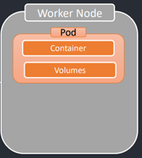
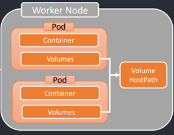
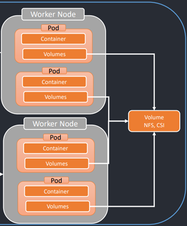

# Sección 15: Kubernetes: Volúmenes

---

## [📦 Introducción a los Volúmenes en Kubernetes](https://kubernetes.io/docs/concepts/storage/volumes/)

En Kubernetes, `los archivos almacenados dentro de un contenedor son efímeros`, lo que representa ciertos desafíos para
aplicaciones que requieren persistencia de datos o almacenamiento compartido.

### 🧨 Problemas comunes sin volúmenes

1. `Pérdida de datos al reiniciar el contenedor`: Si un contenedor se bloquea o se detiene, todos los archivos creados o
   modificados durante su ejecución se pierden, ya que el sistema de archivos del contenedor se reinicia con un estado
   limpio cuando el `kubelet` lo vuelve a lanzar.


2. `Dificultad para compartir datos entre contenedores del mismo Pod`: En situaciones donde múltiples contenedores
   comparten un Pod, puede ser complicado habilitar un sistema de archivos común entre ellos sin una solución adecuada.

### ✅ ¿Cómo lo resuelve Kubernetes?

Para abordar estos problemas, `Kubernetes introduce la abstracción de volumen`. Esta permite proporcionar
almacenamiento persistente o compartido a los contenedores dentro de un Pod.

> 📌 Un `volumen en Kubernetes` es básicamente un directorio accesible desde uno o varios contenedores del Pod, que
> puede estar respaldado por distintos medios de almacenamiento, según el tipo de volumen utilizado.

### 🧱 Tipos de volúmenes

Kubernetes soporta diversos tipos de volúmenes, y un Pod puede montar varios de ellos simultáneamente. Se clasifican, de
forma general, en:

- `Volúmenes efímeros`: Existen únicamente durante la vida del Pod. Cuando este se elimina, el volumen también se
  destruye.

- `Volúmenes persistentes`: Sobreviven incluso después de que el Pod se elimina. Su ciclo de vida es independiente del
  Pod, permitiendo que los datos se mantengan y puedan ser reutilizados por nuevos Pods.

> 🔁 Un volumen, sin importar su tipo, conserva sus datos durante los reinicios de los contenedores dentro del
> mismo Pod. Sin embargo, solo los volúmenes persistentes sobreviven a la eliminación del Pod completo.

### 💡 Ejemplo simple

Supón que tienes un Pod con un volumen `emptyDir` (el volumen se monta dentro del pod), y un contenedor escribe un
archivo ahí. Si el contenedor se reinicia por error interno, `el archivo sigue estando presente` en ese volumen cuando
el contenedor se vuelve a iniciar.

Sin embargo, si se elimina el `Pod` completo, entonces:

- Si era un `volumen efímero` (`emptyDir`), el contenido se borra.
- Si era un `volumen persistente` (como un `persistentVolumeClaim`), los datos se conservan, incluso después de
  eliminar el Pod.

## [Tipos de volúmenes](https://kubernetes.io/docs/concepts/storage/volumes/#volume-types)

Como vimos anteriormente, en Kubernetes existen dos grandes categorías de volúmenes:

- `Volúmenes efímeros`: viven mientras el Pod exista.
- `Volúmenes persistentes`: sobreviven incluso si el Pod es eliminado.

A continuación, exploramos algunos de los tipos más comunes.

### [🗂️ emptyDir](https://kubernetes.io/docs/concepts/storage/volumes/#emptydir)

Este es uno de los volúmenes efímeros más utilizados.

- `El volumen emptyDir se monta dentro del Pod` y su ciclo de vida está ligado directamente al del Pod, no al de los
  contenedores individuales.
- Se crea `cuando el Pod es asignado a un nodo`, y como su nombre lo indica, `inicialmente está vacío`.
- Todos los contenedores del Pod pueden `leer y escribir archivos compartidos` en este volumen. Pueden montarlo en la
  misma ruta o en rutas distintas según se requiera.
- Cuando el `Pod se elimina`, el volumen `emptyDir` también se `destruye automáticamente`, junto con todos los datos
  almacenados en él. Por eso, se usa comúnmente para `almacenar datos temporales`.

📌 Importante:

> La `caída o reinicio de un contenedor` dentro del Pod `no elimina` el volumen `emptyDir`.
> Los datos almacenados permanecen disponibles mientras el `Pod siga activo en el nodo`.



### [🗂️ hostPath](https://kubernetes.io/docs/concepts/storage/volumes/#hostpath)

El volumen `hostPath` permite montar directamente un archivo o directorio del sistema de archivos del nodo host
(el Worker Node) dentro del Pod.

- Es `externo al Pod`, pero `local al nodo` donde se ejecuta.
- Su uso está `limitado a escenarios donde se tiene control total del nodo`, y por lo general
  `solo es viable en clústeres con un solo nodo` o para tareas muy específicas.

📌 Se puede usar para casos como:

- Acceder a archivos del host que necesita la aplicación (por ejemplo, logs del sistema).
- Exponer sockets de Docker o herramientas de monitoreo.



🚨 Advertencia de seguridad:

> El uso de `hostPath` conlleva `riesgos importantes de seguridad`, ya que permite al contenedor acceder directamente al
> sistema de archivos del nodo, lo que `puede comprometer el nodo completo` si no se tiene cuidado.
>
> `Si puedes evitar usar hostPath, deberías hacerlo.`
>
> En su lugar, se recomienda utilizar un `PersistentVolume local (local PV)` con las debidas restricciones y
> aislamiento.

📝 Nota:

> En los siguientes apartados usaremos el `hostPath` por ser más simple y directo en entornos de desarrollo o
> pruebas. Sin embargo, más adelante veremos cómo reemplazarlo por una alternativa más segura y desacoplada utilizando
> `PersistentVolume` y `PersistentVolumeClaim`.

### 🗂️[nfs](https://kubernetes.io/docs/concepts/storage/volumes/#nfs), [csi](https://kubernetes.io/docs/concepts/storage/volumes/#csi)

Tanto `nfs` como `csi` son tipos de volúmenes que permiten el acceso desde `varios Worker Nodes`, por lo que están
diseñados para funcionar correctamente en `clústeres multi-nodo`.

Veamos qué hace cada uno:

### 📁 nfs – Network File System

- Un volumen `nfs` permite montar un recurso compartido NFS existente en uno o varios Pods.
- A diferencia de `emptyDir`, `el contenido no se elimina cuando el Pod se borra`; simplemente se desmonta.
- Esto permite que el volumen:
    - `Esté pre-poblado con datos`.
    - `Comparta información entre múltiples Pods`, incluso si están en nodos distintos.
    - `Admite múltiples escritores simultáneamente`, lo cual es ideal para escenarios de acceso concurrente.

> 📌 Es importante contar con un servidor NFS configurado y accesible desde todos los nodos del clúster.

### 📦 csi – Container Storage Interface

- CSI define una `interfaz estándar` y extensible para integrar soluciones de almacenamiento externas con Kubernetes.
- Gracias a CSI, los proveedores de almacenamiento (como AWS EBS, GCP PD, Ceph, NetApp, etc.) pueden ofrecer volúmenes
  que Kubernetes puede montar automáticamente.
- Permite que Kubernetes `interactúe con cualquier sistema de almacenamiento compatible con CSI`, tanto para clústeres
  on-premise como en la nube.
- CSI reemplaza gradualmente a muchos controladores in-tree antiguos, y es el enfoque recomendado para nuevas
  implementaciones.



## 🛠️ Configurando un volumen hostPath para MySQL

Cuando trabajamos con contenedores en `Kubernetes`, los datos almacenados en el sistema de archivos del contenedor se
eliminan si el contenedor o el Pod se reinicia o destruye. Para evitar esta pérdida de datos, debemos montar un volumen
externo al contenedor que persista los datos, incluso si el Pod deja de existir.

### 🔍 ¿Qué tipo de volumen usar?

En este escenario, usaremos el tipo de volumen `hostPath`, que permite montar un directorio local del nodo (el host)
dentro del contenedor. De este modo, aunque el Pod sea eliminado, los datos seguirán existiendo en el sistema de
archivos del nodo.

> 💡 Más adelante aprenderemos a usar una opción más segura y desacoplada: los `PersistentVolume` y
`PersistentVolumeClaim`.

### 📦 Definiendo el volumen `hostPath` para MySQL

En este punto queremos configurar el volumen para la base de datos MySQL utilizada por el microservicio de usuarios.
Para ello, modificamos el archivo `deployment-mysql.yml` con la siguiente configuración:

````yml
apiVersion: apps/v1
kind: Deployment
metadata:
  name: d-mysql
spec:
  replicas: 1
  selector:
    matchLabels:
      app: d-mysql
  template:
    metadata:
      labels:
        app: d-mysql
    spec:
      containers:
        - image: mysql:8.0.41-debian
          name: c-mysql
          ports:
            - containerPort: 3306
          env:
            - name: MYSQL_ROOT_PASSWORD
              value: magadiflo
            - name: MYSQL_DATABASE
              value: db_user_service
            - name: MYSQL_USER
              value: admin
            - name: MYSQL_PASSWORD
              value: magadiflo
          volumeMounts:
            - name: mysql-data
              mountPath: /var/lib/mysql
      volumes:
        - name: mysql-data
          hostPath:
            path: /var/lib/mysql
            type: DirectoryOrCreate
````

### 🧩 Estructura de configuración

La definición del volumen consta de dos partes principales:

1. Configuración del volumen

````yaml
volumes:
  - name: mysql-data
    hostPath:
      path: /var/lib/mysql
      type: DirectoryOrCreate
````

¿Qué significa esto?

- `name: mysql-data`: nombre del volumen, que usaremos como referencia en el contenedor.
- `hostPath.path: /var/lib/mysql`: ruta del sistema de archivos del nodo host donde se almacenarán los datos.
  > Esta ruta no tiene que ser igual a la del contenedor, pero es común usar la misma por coherencia.
- `type: DirectoryOrCreate`: si el directorio ya existe en el nodo, lo reutiliza; si no, lo crea automáticamente.

2. Configuración del `volumeMounts` en el contenedor

````yml
volumeMounts:
  - name: mysql-data
    mountPath: /var/lib/mysql
````

¿Qué significa esto?

- `name: mysql-data`: nombre del volumen a montar, debe coincidir con el definido en volumes.
- `mountPath: /var/lib/mysql`: ruta dentro del contenedor MySQL donde se almacenarán los datos.

> Es muy importante que esta ruta (`mountPath`) coincida exactamente con el directorio que MySQL usa internamente para
> almacenar sus datos. En el caso de la imagen oficial `mysql:8.0.41-debian`, ese directorio es `/var/lib/mysql`.

📌 Nota importante
> Aunque el directorio del host (`hostPath.path`) podría ser diferente, se recomienda usar la misma ruta que el
> `mountPath` del contenedor para mantener la coherencia y facilitar el mantenimiento.

## Aplicando configuración de volumen hostPath para MySQL

Antes de aplicar el `deployment-mysql.yml` donde configuramos el volumen del tipo `hostPath`, vamos a ver qué `pods`
tenemos actualmente en ejecución.

````bash
$ kubectl get pods
NAME                                READY   STATUS    RESTARTS       AGE
d-course-service-5f7bdcf6dc-ln4pg   1/1     Running   4 (3m9s ago)   5d3h
d-mysql-7b947869d5-fshhr            1/1     Running   5 (3m9s ago)   5d23h
d-postgres-69f7b66859-9j8h7         1/1     Running   5 (3m9s ago)   5d22h
d-user-service-7bc4ffb6df-4zzj8     1/1     Running   17 (53s ago)   5d22h
d-user-service-7bc4ffb6df-fg95f     1/1     Running   17 (53s ago)   5d22h
d-user-service-7bc4ffb6df-pvm4w     1/1     Running   17 (53s ago)   5d22h
d-user-service-7bc4ffb6df-pvm9t     1/1     Running   17 (51s ago)   5d22h
d-user-service-7bc4ffb6df-r54hn     1/1     Running   17 (54s ago)   5d22h
````

Ahora estamos listos para aplicar el deployment `deployment-mysql.yml`.

````bash
$ kubectl apply -f .\kubernetes\deployments\deployment-mysql.yml
deployment.apps/d-mysql configured
````

📌Nota técnica:
> Este comando actualizó el Deployment existente `d-mysql` para incluir la nueva configuración de volumen.
> El mensaje `configured` indica que el Deployment `d-mysql` ya existía en el clúster y fue modificado con la nueva
> configuración.
>
> Si el Deployment no hubiera existido previamente, el mensaje habría sido `created`.
>
> Para verificar que el volumen fue aplicado correctamente, se recomienda revisar el estado del pod con:
> `kubectl describe pod <nombre-del-pod>`


Volvemos a listar los pods, notemos que algo curioso pasó en el pod de mysql.

````bash
$ kubectl get pods
NAME                                READY   STATUS    RESTARTS         AGE
d-course-service-5f7bdcf6dc-ln4pg   1/1     Running   4 (6m16s ago)    5d3h
d-mysql-7c844dccd9-8fch2            1/1     Running   0                40s
d-postgres-69f7b66859-9j8h7         1/1     Running   5 (6m16s ago)    5d23h
d-user-service-7bc4ffb6df-4zzj8     1/1     Running   17 (4m ago)      5d23h
d-user-service-7bc4ffb6df-fg95f     1/1     Running   17 (4m ago)      5d23h
d-user-service-7bc4ffb6df-pvm4w     1/1     Running   17 (4m ago)      5d23h
d-user-service-7bc4ffb6df-pvm9t     1/1     Running   17 (3m58s ago)   5d23h
d-user-service-7bc4ffb6df-r54hn     1/1     Running   17 (4m1s ago)    5d23h
````

Después de aplicar la nueva configuración, se observa que el nombre del Pod cambió:

````bash
Antes: d-mysql-7b947869d5-fshhr
Después: d-mysql-7c844dccd9-8fch2
````

📌 Explicación Técnica:

- Cuando se modifica la plantilla del Deployment (como al agregar volúmenes), Kubernetes crea un nuevo `ReplicaSet` con
  un hash distinto.
- Este nuevo `ReplicaSet` genera Pods actualizados con la nueva configuración.
- Los Pods anteriores son eliminados automáticamente para mantener la consistencia.
- Este proceso garantiza que los cambios aplicados al Deployment se reflejen correctamente en ejecución.

Si en este punto hacemos un `describe` del nuevo pod de mysql veremos que el volumen ya está configurado.

````bash
$ kubectl describe pod d-mysql-7c844dccd9-8fch2
Name:             d-mysql-7c844dccd9-8fch2
Namespace:        default
Priority:         0
Service Account:  default
Node:             minikube/192.168.49.2
Start Time:       Thu, 24 Jul 2025 23:25:50 -0500
Labels:           app=d-mysql
                  pod-template-hash=7c844dccd9
Annotations:      <none>
Status:           Running
IP:               10.244.0.55
IPs:
  IP:           10.244.0.55
Controlled By:  ReplicaSet/d-mysql-7c844dccd9
Containers:
  c-mysql:
    Container ID:   docker://1ba4a4d1dceddf2523b4a24aa77280b368cb3eac4709e5d3130f6c3fd3a74e05
    Image:          mysql:8.0.41-debian
    Image ID:       docker-pullable://mysql@sha256:b2252987e0ecdb820e96928948ac3bca1adcd2b4a2a2c7b0d7ea78f77a9dc6ac
    Port:           3306/TCP
    Host Port:      0/TCP
    State:          Running
      Started:      Thu, 24 Jul 2025 23:25:51 -0500
    Ready:          True
    Restart Count:  0
    Environment:
      MYSQL_ROOT_PASSWORD:  magadiflo
      MYSQL_DATABASE:       db_user_service
      MYSQL_USER:           admin
      MYSQL_PASSWORD:       magadiflo
    Mounts:
      /var/lib/mysql from mysql-data (rw)
      /var/run/secrets/kubernetes.io/serviceaccount from kube-api-access-vfjlx (ro)
Conditions:
  Type                        Status
  PodReadyToStartContainers   True
  Initialized                 True
  Ready                       True
  ContainersReady             True
  PodScheduled                True
Volumes:
  mysql-data:
    Type:          HostPath (bare host directory volume)
    Path:          /var/lib/mysql
    HostPathType:  DirectoryOrCreate
  kube-api-access-vfjlx:
    Type:                    Projected (a volume that contains injected data from multiple sources)
    TokenExpirationSeconds:  3607
    ConfigMapName:           kube-root-ca.crt
    Optional:                false
    DownwardAPI:             true
QoS Class:                   BestEffort
Node-Selectors:              <none>
Tolerations:                 node.kubernetes.io/not-ready:NoExecute op=Exists for 300s
                             node.kubernetes.io/unreachable:NoExecute op=Exists for 300s
Events:
  Type    Reason     Age   From               Message
  ----    ------     ----  ----               -------
  Normal  Scheduled  16m   default-scheduler  Successfully assigned default/d-mysql-7c844dccd9-8fch2 to minikube
  Normal  Pulled     16m   kubelet            Container image "mysql:8.0.41-debian" already present on machine
  Normal  Created    16m   kubelet            Created container: c-mysql
  Normal  Started    16m   kubelet            Started container c-mysql
````

## Creando tablas en MySQL para el microservicio de usuarios

Hasta este punto tenemos creado el pod de mysql junto al volumen del tipo hostPath, pero aun nuestra base de datos está
vacía, no tiene ninguna tabla. En ese sentido, si realizamos una petición al servicio de usuarios, simplemente
recibiremos un error, ya que no hay tablas en nuestra base de datos.

Para crear nuestras tablas, debemos levantar un nuevo pod de nuestro microservicio de usuarios, pero previamente hay
que eliminar las 5 instancias que tenemos en ejecución de este microservicio y aprovecharemos a definir una única
instancia.

Entonces, procedemos a eliminar todos los deployments de `d-user-service`.

````bash
$ kubectl delete -f .\kubernetes\deployments\deployment-user.yml
deployment.apps "d-user-service" deleted
````

Si listamos los deployments, vemos que ya no tenemos el de usuarios.

````bash
$ kubectl get deployments
NAME               READY   UP-TO-DATE   AVAILABLE   AGE
d-course-service   1/1     1            1           5d4h
d-mysql            1/1     1            1           5d23h
d-postgres         1/1     1            1           5d23h
````

Modificamos el `deployment-user.yml` para tener una sola réplica de pods (1 solo pod).

````yml
apiVersion: apps/v1
kind: Deployment
metadata:
  name: d-user-service
spec:
  replicas: 1
  selector:
    matchLabels:
      app: d-user-service
...
````

Habiendo eliminado los pods de usuarios y actualizado la réplica a un solo pod, procedemos a `aplicar` el
`deployment-user.yml` para que:

- Se cree un solo pod
- Se creen las tablas en el contenedor de dicho pod

````bash
$ kubectl apply -f .\kubernetes\deployments\deployment-user.yml
deployment.apps/d-user-service created
````

Si listamos nuevamente los deployments veremos que el deployment `d-user-service` fue creado hace `35s`.

````bash
kubectl get deployments
NAME               READY   UP-TO-DATE   AVAILABLE   AGE
d-course-service   1/1     1            1           5d4h
d-mysql            1/1     1            1           5d23h
d-postgres         1/1     1            1           5d23h
d-user-service     1/1     1            1           35s 
````

Ahora, procedemos a listar todos los pods existentes

````bash
$ kubectl get pods
NAME                                READY   STATUS    RESTARTS      AGE
d-course-service-5f7bdcf6dc-ln4pg   1/1     Running   4 (37m ago)   5d4h
d-mysql-7c844dccd9-8fch2            1/1     Running   0             32m
d-postgres-69f7b66859-9j8h7         1/1     Running   5 (37m ago)   5d23h
d-user-service-7bc4ffb6df-sdcpp     1/1     Running   0             4m35s
````

Si hacemos un `logs` al pod del deployment `d-user-service`, comprobaremos que las tablas se han creado correctamente.

````bash
$ kubectl logs d-user-service-7bc4ffb6df-sdcpp

  .   ____          _            __ _ _
 /\\ / ___'_ __ _ _(_)_ __  __ _ \ \ \ \
( ( )\___ | '_ | '_| | '_ \/ _` | \ \ \ \
 \\/  ___)| |_)| | | | | || (_| |  ) ) ) )
  '  |____| .__|_| |_|_| |_\__, | / / / /
 =========|_|==============|___/=/_/_/_/

 :: Spring Boot ::                (v3.4.5)

2025-07-25T04:53:42.317Z  INFO 1 --- [user-service] [           main] d.m.user.app.UserServiceApplication      : Starting UserServiceApplication v0.0.1-SNAPSHOT using Java 21.0.7 with PID 1 (/app/BOOT-INF/classes started by root in /app) 2025-07-25T04:53:42.321Z DEBUG 1 --- [user-service] [           main] d.m.user.app.UserServiceApplication      : Running with Spring Boot v3.4.5, Spring v6.2.6
2025-07-25T04:53:42.323Z  INFO 1 --- [user-service] [           main] d.m.user.app.UserServiceApplication      : The following 1 profile is active: "default"
...
2025-07-25T04:53:49.120Z  INFO 1 --- [user-service] [           main] o.s.b.w.embedded.tomcat.TomcatWebServer  : Tomcat initialized with port 8001 (http)
...
2025-07-25T04:53:52.424Z  INFO 1 --- [user-service] [           main] com.zaxxer.hikari.HikariDataSource       : HikariPool-1 - Starting...
2025-07-25T04:53:53.048Z  INFO 1 --- [user-service] [           main] com.zaxxer.hikari.pool.HikariPool        : HikariPool-1 - Added connection com.mysql.cj.jdbc.ConnectionImpl@8ecc457
2025-07-25T04:53:53.051Z  INFO 1 --- [user-service] [           main] com.zaxxer.hikari.HikariDataSource       : HikariPool-1 - Start completed.
2025-07-25T04:53:53.166Z  INFO 1 --- [user-service] [           main] org.hibernate.orm.connections.pooling    : HHH10001005: Database info:
        Database JDBC URL [Connecting through datasource 'HikariDataSource (HikariPool-1)']
        Database driver: undefined/unknown
        Database version: 8.0.41
        Autocommit mode: undefined/unknown
        Isolation level: undefined/unknown
        Minimum pool size: undefined/unknown
        Maximum pool size: undefined/unknown
2025-07-25T04:53:53.353Z  INFO 1 --- [user-service] [           main] o.h.e.t.j.p.i.JtaPlatformInitiator       : HHH000489: No JTA platform available (set 'hibernate.transaction.jta.platform' to enable JTA platform integration)
2025-07-25T04:53:53.390Z DEBUG 1 --- [user-service] [           main] org.hibernate.SQL                        :
    create table users (
        id bigint not null auto_increment,
        email varchar(255) not null,
        name varchar(255) not null,
        password varchar(255) not null,
        primary key (id)
    ) engine=InnoDB
2025-07-25T04:53:53.439Z DEBUG 1 --- [user-service] [           main] org.hibernate.SQL                        :
    alter table users
       drop index UK6dotkott2kjsp8vw4d0m25fb7
2025-07-25T04:53:53.660Z DEBUG 1 --- [user-service] [           main] org.hibernate.SQL                        :
    alter table users
       add constraint UK6dotkott2kjsp8vw4d0m25fb7 unique (email)
2025-07-25T04:53:53.693Z  INFO 1 --- [user-service] [           main] j.LocalContainerEntityManagerFactoryBean : Initialized JPA EntityManagerFactory for persistence unit 'default'
...
2025-07-25T04:53:59.925Z  INFO 1 --- [user-service] [           main] o.s.b.w.embedded.tomcat.TomcatWebServer  : Tomcat started on port 8001 (http) with context path '/'
2025-07-25T04:53:59.945Z  INFO 1 --- [user-service] [           main] d.m.user.app.UserServiceApplication      : Started UserServiceApplication in 18.789 seconds (process running for 20.476)
````

## Registrando usuarios a través del microservicio de usuarios

Primero, obtenemos la URL temporal del Service `s-user-service` ejecutando el siguiente comando:

````bash
$ minikube service s-user-service --url
http://127.0.0.1:52948
! Because you are using a Docker driver on windows, the terminal needs to be open to run it.
````

Con esta URL, ya podemos realizar peticiones al microservicio user-service. A continuación, se muestra cómo registrar
un nuevo usuario mediante una petición `POST`.

````bash
$ curl -v -X POST -H "Content-Type: application/json" -d "{\"name\": \"Martin\", \"email\":\"martin@gmail.com\", \"password\": \"12345\"}" http://127.0.0.1:52948/api/v1/users | jq
>
< HTTP/1.1 201
< Location: http://127.0.0.1:52948/api/v1/users/1
< Content-Type: application/json
< Transfer-Encoding: chunked
< Date: Fri, 25 Jul 2025 05:08:28 GMT
<
{
  "id": 1,
  "name": "Martin",
  "email": "martin@gmail.com",
  "password": "12345"
} 
````

Listamos los usuarios registrados.

````bash
$ curl -v http://127.0.0.1:52948/api/v1/users | jq
>
< HTTP/1.1 200
< Content-Type: application/json
< Transfer-Encoding: chunked
< Date: Fri, 25 Jul 2025 05:27:41 GMT
<
[
  {
    "id": 1,
    "name": "Martin",
    "email": "martin@gmail.com",
    "password": "12345"
  }
]
````

## Verifica persistencia de datos tras eliminación de Pods

Hasta este punto, hemos configurado un volumen de tipo `hostPath` en el deployment de `mysql`. Esto implica que los
datos se almacenan fuera del ciclo de vida del pod, lo que garantiza su persistencia incluso si el pod se elimina y
vuelve a crearse. Por lo tanto, el usuario que registramos previamente debería seguir existiendo tras reiniciar el pod
de mysql.

Para esta prueba, vamos a eliminar no solo el deployment de mysql, sino que también el de usuario a través de sus
archivos `yml`.

````bash
$ kubectl delete -f .\kubernetes\deployments\deployment-mysql.yml -f .\kubernetes\deployments\deployment-user.yml
deployment.apps "d-mysql" deleted
deployment.apps "d-user-service" deleted
````

Si listamos los deployments veremos que los que eliminamos ya no aparecen.

````bash
$ kubectl get deployments
NAME               READY   UP-TO-DATE   AVAILABLE   AGE
d-course-service   1/1     1            1           5d4h
d-postgres         1/1     1            1           6d
````

Incluso si listamos los pods veremos que tampoco aparecerán los pods correspondientes a los deployments eliminados.

````bash
$ kubectl get pods
NAME                                READY   STATUS    RESTARTS      AGE
d-course-service-5f7bdcf6dc-ln4pg   1/1     Running   4 (77m ago)   5d4h
d-postgres-69f7b66859-9j8h7         1/1     Running   5 (77m ago)   6d
````

Utilizando los archivos `yml` vamos a aplicar los deployments para crear nuevamente los pods.

````bash
$ kubectl apply -f .\kubernetes\deployments\deployment-user.yml -f .\kubernetes\deployments\deployment-mysql.yml
deployment.apps/d-user-service created
deployment.apps/d-mysql created
````

Verificamos que los deployments de mysql y user se han creado.

````bash
$ kubectl get deployments
NAME               READY   UP-TO-DATE   AVAILABLE   AGE
d-course-service   1/1     1            1           5d4h
d-mysql            1/1     1            1           40s
d-postgres         1/1     1            1           6d
d-user-service     1/1     1            1           40s
````

Verificamos que los pods correspondientes a los deployments también se han creado.

````bash
$ kubectl get pods
NAME                                READY   STATUS    RESTARTS      AGE
d-course-service-5f7bdcf6dc-ln4pg   1/1     Running   4 (80m ago)   5d4h
d-mysql-7c844dccd9-xgkn8            1/1     Running   0             86s
d-postgres-69f7b66859-9j8h7         1/1     Running   5 (80m ago)   6d
d-user-service-7bc4ffb6df-l8c5l     1/1     Running   0             86s
````

Una vez recreados los pods de `mysql` y de `usuarios`, procedemos a realizar nuevamente una petición al
endpoint correspondiente. Al listar los usuarios registrados, confirmamos que el dato ingresado previamente se ha
conservado correctamente, lo que `valida la persistencia de datos gracias al volumen hostPath`.

````bash
$ curl -v http://127.0.0.1:52948/api/v1/users | jq
>
< HTTP/1.1 200
< Content-Type: application/json
< Transfer-Encoding: chunked
< Date: Fri, 25 Jul 2025 05:42:31 GMT
<
[
  {
    "id": 1,
    "name": "Martin",
    "email": "martin@gmail.com",
    "password": "12345"
  }
]
````

### Conclusión

Al eliminar los pods de mysql y de usuarios, y luego volver a crearlos, observamos que los datos
registrados previamente permanecen intactos. `Esto confirma que el uso de volúmenes persistentes`, en este caso, un
`volumen de tipo hostPath`, permite desacoplar el ciclo de vida de los datos del ciclo de vida de los pods.

Este comportamiento es fundamental en entornos productivos donde la persistencia de información debe estar garantizada,
incluso ante reinicios, fallos o actualizaciones de los contenedores. Si bien `hostPath` es útil para pruebas locales o
ambientes de desarrollo, en entornos productivos se recomienda utilizar soluciones de almacenamiento más robustas y
desacopladas del nodo, como `PersistentVolumes` respaldados por `NFS`, `EBS`, `GCEPersistentDisk`, entre otros.

Este ejercicio refuerza el principio de que los contenedores deben ser efímeros, mientras que los datos críticos deben
persistir mediante mecanismos adecuados de almacenamiento gestionado por `Kubernetes`.

## 🛠️ Configurando un volumen hostPath para PostgreSQL

En los apartados anteriores configuramos un volumen del tipo `hostPath` para MySQL. Ahora aplicaremos el mismo enfoque
para la base de datos `PostgreSQL`, ajustando el archivo `deployment-postgres.yml`.

El objetivo es `montar un volumen externo al Pod` que permita conservar los datos incluso si el Pod es eliminado.

````yml
apiVersion: apps/v1
kind: Deployment
metadata:
  name: d-postgres
spec:
  replicas: 1
  selector:
    matchLabels:
      app: d-postgres
  template:
    metadata:
      labels:
        app: d-postgres
    spec:
      containers:
        - image: postgres:17-alpine
          name: c-postgres
          ports:
            - containerPort: 5432
          env:
            - name: POSTGRES_DB
              value: db_course_service
            - name: POSTGRES_USER
              value: postgres
            - name: POSTGRES_PASSWORD
              value: magadiflo
          volumeMounts:
            - name: postgres-data
              mountPath: /var/lib/postgresql/data
      volumes:
        - name: postgres-data
          hostPath:
            path: /var/lib/postgresql/data
            type: DirectoryOrCreate
````

### 🧩 ¿Por qué usamos `/var/lib/postgresql/data`?

Esta ruta (`mountPath`) es el directorio predeterminado que la imagen oficial de PostgreSQL utiliza para almacenar sus
datos.

Montar el volumen en esa ruta asegura que los datos de PostgreSQL se escriban directamente en el directorio externo del
nodo (hostPath), lo cual permite preservar los datos si el Pod se elimina o reinicia.

### 📌 Nota adicional

Como mencionamos anteriormente, el tipo `hostPath` es útil para entornos de desarrollo o pruebas locales.
En entornos productivos o multi-nodo, se recomienda usar una solución más segura basada en `PersistentVolume` y
`PersistentVolumeClaim`, que veremos más adelante.

## Aplicando configuración de volumen hostPath para PostgreSQL

Antes de aplicar el archivo `deployment-postgres.yml` con la configuración del volumen `hostPath`, verificamos los Pods
actualmente en ejecución:

````bash
$ kubectl get pods
NAME                                READY   STATUS    RESTARTS      AGE
d-course-service-5f7bdcf6dc-ln4pg   1/1     Running   5 (18m ago)   6d3h
d-mysql-7c844dccd9-xgkn8            1/1     Running   1 (18m ago)   22h
d-postgres-69f7b66859-9j8h7         1/1     Running   6 (18m ago)   6d23h
d-user-service-7bc4ffb6df-l8c5l     1/1     Running   1 (18m ago)   22h
````

Luego aplicamos el `Deployment` con la nueva configuración:

````bash
$ kubectl apply -f .\kubernetes\deployments\deployment-postgres.yml
deployment.apps/d-postgres configured
````

Volvemos a listar los Pods. Observamos que se ha creado una nueva instancia de `PostgreSQL`, que ya cuenta con el
volumen `hostPath` montado:

````bash
$ kubectl get pods
NAME                                READY   STATUS    RESTARTS      AGE
d-course-service-5f7bdcf6dc-ln4pg   1/1     Running   5 (20m ago)   6d3h
d-mysql-7c844dccd9-xgkn8            1/1     Running   1 (20m ago)   22h
d-postgres-5984c94d6f-b5qvl         1/1     Running   0             78s
d-user-service-7bc4ffb6df-l8c5l     1/1     Running   1 (20m ago)   22h
````

## Creando tablas en Postgres para microservicio de cursos

Para crear las tablas del microservicio de cursos en la base de datos de postgres, vamos a eliminar todos los pods que
tengamos de cursos. Luego, aplicaremos el deployment para levantar un pod y así crear la tabla en la base de datos
cuando el contenedor dentro del pod se inicie.

Primero listamos todos los deployments que actualmente están en ejecución.

````bash
$ kubectl get deployments
NAME               READY   UP-TO-DATE   AVAILABLE   AGE
d-course-service   1/1     1            1           6d3h
d-mysql            1/1     1            1           23h
d-postgres         1/1     1            1           6d23h
d-user-service     1/1     1            1           23h
````

También podemos listar los pods para ver que tenemos un solo pod de cursos.

````bash
$ kubectl get pods
NAME                                READY   STATUS    RESTARTS      AGE
d-course-service-5f7bdcf6dc-ln4pg   1/1     Running   5 (28m ago)   6d3h
d-mysql-7c844dccd9-xgkn8            1/1     Running   1 (28m ago)   23h
d-postgres-5984c94d6f-b5qvl         1/1     Running   0             9m27s
d-user-service-7bc4ffb6df-l8c5l     1/1     Running   1 (28m ago)   23h
````

Ahora sí procedemos a eliminar los pods que tengamos de cursos a través del `deployment-course.yml`.

````bash
$ kubectl delete -f .\kubernetes\deployments\deployment-course.yml
deployment.apps "d-course-service" deleted
````

Si volvemos a listar los deployments y pods veremos que ya no está el de cursos.

````bash
$ kubectl get deployments
NAME             READY   UP-TO-DATE   AVAILABLE   AGE
d-mysql          1/1     1            1           23h
d-postgres       1/1     1            1           6d23h
d-user-service   1/1     1            1           23h
````

````bash
$ kubectl get pods
NAME                              READY   STATUS    RESTARTS      AGE
d-mysql-7c844dccd9-xgkn8          1/1     Running   1 (31m ago)   23h
d-postgres-5984c94d6f-b5qvl       1/1     Running   0             12m
d-user-service-7bc4ffb6df-l8c5l   1/1     Running   1 (31m ago)   23h
````

Ahora aplicamos el `deployment-course.yml` para crear un nuevo pod de curso.

````bash
$ kubectl apply -f .\kubernetes\deployments\deployment-course.yml
deployment.apps/d-course-service created
````

Listamos los deployments y pods creados.

````bash
$ kubectl get deployments
NAME               READY   UP-TO-DATE   AVAILABLE   AGE
d-course-service   1/1     1            1           48s
d-mysql            1/1     1            1           23h
d-postgres         1/1     1            1           6d23h
d-user-service     1/1     1            1           23h
````

````bash
$ kubectl get pods
NAME                                READY   STATUS    RESTARTS      AGE
d-course-service-5f7bdcf6dc-cjjt6   1/1     Running   0             51s
d-mysql-7c844dccd9-xgkn8            1/1     Running   1 (34m ago)   23h
d-postgres-5984c94d6f-b5qvl         1/1     Running   0             15m
d-user-service-7bc4ffb6df-l8c5l     1/1     Running   1 (34m ago)   23h
````

Si hacemos un `logs` al pod del deployment `d-course-service`, comprobaremos que las tablas se han creado correctamente.

````bash
$ kubectl logs d-course-service-5f7bdcf6dc-cjjt6

  .   ____          _            __ _ _
 /\\ / ___'_ __ _ _(_)_ __  __ _ \ \ \ \
( ( )\___ | '_ | '_| | '_ \/ _` | \ \ \ \
 \\/  ___)| |_)| | | | | || (_| |  ) ) ) )
  '  |____| .__|_| |_|_| |_\__, | / / / /
 =========|_|==============|___/=/_/_/_/

 :: Spring Boot ::                (v3.4.5)

2025-07-26T04:47:35.640Z  INFO 1 --- [course-service] [           main] d.m.course.app.CourseServiceApplication  : Starting CourseServiceApplication v0.0.1-SNAPSHOT using Java 21.0.7 with PID 1 (/app/BOOT-INF/classes started by root in /app)
2025-07-26T04:47:35.643Z DEBUG 1 --- [course-service] [           main] d.m.course.app.CourseServiceApplication  : Running with Spring Boot v3.4.5, Spring v6.2.6
...
2025-07-26T04:47:40.145Z  INFO 1 --- [course-service] [           main] o.s.b.w.embedded.tomcat.TomcatWebServer  : Tomcat initialized with port 8002 (http)
...
2025-07-26T04:47:42.345Z  INFO 1 --- [course-service] [           main] com.zaxxer.hikari.pool.HikariPool        : HikariPool-1 - Added connection org.postgresql.jdbc.PgConnection@24010875
2025-07-26T04:47:42.347Z  INFO 1 --- [course-service] [           main] com.zaxxer.hikari.HikariDataSource       : HikariPool-1 - Start completed.
2025-07-26T04:47:42.445Z  INFO 1 --- [course-service] [           main] org.hibernate.orm.connections.pooling    : HHH10001005: Database info:
        Database JDBC URL [Connecting through datasource 'HikariDataSource (HikariPool-1)']
        Database driver: undefined/unknown
        Database version: 17.5
        Autocommit mode: undefined/unknown
        Isolation level: undefined/unknown
        Minimum pool size: undefined/unknown
        Maximum pool size: undefined/unknown
2025-07-26T04:47:43.869Z  INFO 1 --- [course-service] [           main] o.h.e.t.j.p.i.JtaPlatformInitiator       : HHH000489: No JTA platform available (set 'hibernate.transaction.jta.platform' to enable JTA platform integration)
2025-07-26T04:47:43.917Z DEBUG 1 --- [course-service] [           main] org.hibernate.SQL                        :
    create table course_users (
        id bigint generated by default as identity,
        user_id bigint,
        course_id bigint,
        primary key (id)
    )
2025-07-26T04:47:43.924Z DEBUG 1 --- [course-service] [           main] org.hibernate.SQL                        :
    create table courses (
        id bigint generated by default as identity,
        name varchar(255) not null,
        primary key (id)
    )
2025-07-26T04:47:43.929Z DEBUG 1 --- [course-service] [           main] org.hibernate.SQL                        :
    alter table if exists course_users
       drop constraint if exists UKkdhhgtn4xoxgggdkh5fooi5i7
2025-07-26T04:47:43.933Z  WARN 1 --- [course-service] [           main] o.h.engine.jdbc.spi.SqlExceptionHelper   : SQL Warning Code: 0, SQLState: 00000
2025-07-26T04:47:43.933Z  WARN 1 --- [course-service] [           main] o.h.engine.jdbc.spi.SqlExceptionHelper   : constraint "ukkdhhgtn4xoxgggdkh5fooi5i7" of relation "course_users" does not exist, skipping
2025-07-26T04:47:43.934Z DEBUG 1 --- [course-service] [           main] org.hibernate.SQL                        :
    alter table if exists course_users
       add constraint UKkdhhgtn4xoxgggdkh5fooi5i7 unique (user_id)
2025-07-26T04:47:43.937Z DEBUG 1 --- [course-service] [           main] org.hibernate.SQL                        :
    alter table if exists courses
       drop constraint if exists UK5o6x4fpafbywj4v2g0owhh11r
2025-07-26T04:47:43.939Z  WARN 1 --- [course-service] [           main] o.h.engine.jdbc.spi.SqlExceptionHelper   : SQL Warning Code: 0, SQLState: 00000
2025-07-26T04:47:43.940Z  WARN 1 --- [course-service] [           main] o.h.engine.jdbc.spi.SqlExceptionHelper   : constraint "uk5o6x4fpafbywj4v2g0owhh11r" of relation "courses" does not exist, skipping
2025-07-26T04:47:43.940Z DEBUG 1 --- [course-service] [           main] org.hibernate.SQL                        :
    alter table if exists courses
       add constraint UK5o6x4fpafbywj4v2g0owhh11r unique (name)
2025-07-26T04:47:43.944Z DEBUG 1 --- [course-service] [           main] org.hibernate.SQL                        :
    alter table if exists course_users
       add constraint FKcax8xujvganv6xl9ra0sgouem
       foreign key (course_id)
       references courses
...
2025-07-26T04:47:50.035Z  INFO 1 --- [course-service] [           main] o.s.b.w.embedded.tomcat.TomcatWebServer  : Tomcat started on port 8002 (http) with context path '/'
...
````

## Registrando cursos a través del microservicio de cursos

Primero, obtenemos la URL temporal del Service `s-course-service` ejecutando el siguiente comando:

````bash
$ minikube service s-course-service --url
http://127.0.0.1:62745
! Because you are using a Docker driver on windows, the terminal needs to be open to run it.
````

Registramos un curso.

````bash
$ curl -v -X POST -H "Content-Type: application/json" -d "{\"name\": \"Spring Boot 3\"}" http://127.0.0.1:62745/api/v1/courses | jq
>
< HTTP/1.1 201
< Location: http://127.0.0.1:62745/api/v1/courses/1
< Content-Type: application/json
< Transfer-Encoding: chunked
< Date: Sat, 26 Jul 2025 04:55:35 GMT
<
{
  "id": 1,
  "name": "Spring Boot 3"
}
````

Luego de haber registrado varios cursos, los listamos.

````bash
$ curl -v http://127.0.0.1:62745/api/v1/courses | jq
>
< HTTP/1.1 200
< Content-Type: application/json
< Transfer-Encoding: chunked
< Date: Sat, 26 Jul 2025 04:57:23 GMT
<
[
  {
    "id": 1,
    "name": "Spring Boot 3"
  },
  {
    "id": 2,
    "name": "Spring WebFlux"
  },
  {
    "id": 3,
    "name": "Reactive Programming"
  },
  {
    "id": 4,
    "name": "Docker"
  },
  {
    "id": 5,
    "name": "Kubernetes"
  }
]
````

Creamos un usuario a través del microservicio de cursos y lo asignamos a un curso en específico.

````bash
$  curl -v -X POST -H "Content-Type: application/json" -d "{\"name\": \"Milagros\", \"email\": \"milagros@gmail.com\", \"password\": \"123456\"}" http://127.0.0.1:62745/api/v1/courses/1/users | jq
>
< HTTP/1.1 201
< Content-Type: application/json
< Transfer-Encoding: chunked
< Date: Sat, 26 Jul 2025 05:01:23 GMT
<
{
  "id": 2,
  "name": "Milagros",
  "email": "milagros@gmail.com",
  "password": "123456"
}
````

Asigna un usuario existente a un curso existente.

````bash
$ curl -v -X POST http://127.0.0.1:62745/api/v1/courses/2/users/1 | jq
>
< HTTP/1.1 200
< Content-Type: application/json
< Transfer-Encoding: chunked
< Date: Sat, 26 Jul 2025 05:05:56 GMT
<
{
  "id": 1,
  "name": "Martin",
  "email": "martin@gmail.com",
  "password": "12345"
}
````

Listamos los cursos con usuarios asignados.

````bash
$ curl -v -G --data "loadRelations=true" http://127.0.0.1:62745/api/v1/courses | jq
>
< HTTP/1.1 200
< Content-Type: application/json
< Transfer-Encoding: chunked
< Date: Sat, 26 Jul 2025 05:06:49 GMT
<
[
  {
    "id": 1,
    "name": "Spring Boot 3",
    "users": [
      {
        "id": 2,
        "name": "Milagros",
        "email": "milagros@gmail.com",
        "password": "123456"
      }
    ]
  },
  {
    "id": 2,
    "name": "Spring WebFlux",
    "users": [
      {
        "id": 1,
        "name": "Martin",
        "email": "martin@gmail.com",
        "password": "12345"
      }
    ]
  },
  {
    "id": 3,
    "name": "Reactive Programming",
    "users": []
  },
  {
    "id": 4,
    "name": "Docker",
    "users": []
  },
  {
    "id": 5,
    "name": "Kubernetes",
    "users": []
  }
]
````

## Verifica persistencia de datos tras eliminación de Pods

Hasta este punto, hemos configurado un volumen de tipo `hostPath` en el deployment de `postgres`. Esto implica que los
datos se almacenan fuera del ciclo de vida del pod, lo que garantiza su persistencia incluso si el pod se elimina y
vuelve a crearse. Por lo tanto, los cursos que registramos previamente deberían seguir existiendo tras reiniciar
el pod de postgres.

Para esta prueba, vamos a eliminar no solo el deployment de postgres, sino que también el de cursos a través de sus
archivos yml.

````bash
$ kubectl delete -f .\kubernetes\deployments\deployment-course.yml -f .\kubernetes\deployments\deployment-postgres.yml
deployment.apps "d-course-service" deleted
deployment.apps "d-postgres" deleted
````

Verificamos que los deployments de cursos y postgres se han eliminado.

````bash
$ kubectl get deployments
NAME             READY   UP-TO-DATE   AVAILABLE   AGE
d-mysql          1/1     1            1           23h
d-user-service   1/1     1            1           23h
````

Incluso si verificamos sus pods veremos que también se han eliminado.

````bash
$ kubectl get pods
NAME                              READY   STATUS    RESTARTS      AGE
d-mysql-7c844dccd9-xgkn8          1/1     Running   1 (57m ago)   23h
d-user-service-7bc4ffb6df-l8c5l   1/1     Running   1 (57m ago)   23h
````

Utilizando los archivos `yml` vamos a aplicar los deployments para crear nuevamente los pods.

````bash
$ kubectl apply -f .\kubernetes\deployments\deployment-course.yml -f .\kubernetes\deployments\deployment-postgres.yml
deployment.apps/d-course-service created
deployment.apps/d-postgres created
````

Verificamos que los deployments de postgres y cursos se han creado.

````bash
$ kubectl get deployments
NAME               READY   UP-TO-DATE   AVAILABLE   AGE
d-course-service   1/1     1            1           76s
d-mysql            1/1     1            1           23h
d-postgres         1/1     1            1           76s
d-user-service     1/1     1            1           23h
````

Verificamos que los pods correspondientes a los deployments también se han creado.

````bash
$ kubectl get pods
NAME                                READY   STATUS    RESTARTS      AGE
d-course-service-5f7bdcf6dc-hs8z5   1/1     Running   0             84s
d-mysql-7c844dccd9-xgkn8            1/1     Running   1 (61m ago)   23h
d-postgres-5984c94d6f-7q62p         1/1     Running   0             84s
d-user-service-7bc4ffb6df-l8c5l     1/1     Running   1 (61m ago)   23h
````

Una vez recreados los pods de `postgres` y `cursos`, procedemos a realizar nuevamente una petición al endpoint
correspondiente. Al listar los cursos registrados con sus usuarios asociados, confirmamos que los datos registrados
previamente se ha conservado correctamente, lo que `valida la persistencia de datos gracias al volumen hostPath`.

Antes de listar los cursos, volvemos a obtener la URL temporal del Service `s-course-service`, ya que hasta este punto
había sido detenido:

````bash
$ minikube service s-course-service --url
http://127.0.0.1:62745
! Because you are using a Docker driver on windows, the terminal needs to be open to run it.
````

Luego, listamos los cursos con sus usuarios asociados. Como se observa,
`los datos se han persistido correctamente en la base de datos PostgreSQL`. Además, se está estableciendo comunicación
con el microservicio de usuarios, el cual accede a su propia base de datos en MySQL.

En resumen, hasta este punto, `todo el sistema está funcionando correctamente`:

````bash
$ curl -v -G --data "loadRelations=true" http://127.0.0.1:62894/api/v1/courses | jq
>
< HTTP/1.1 200
< Content-Type: application/json
< Transfer-Encoding: chunked
< Date: Sat, 26 Jul 2025 05:18:27 GMT
<
[
  {
    "id": 1,
    "name": "Spring Boot 3",
    "users": [
      {
        "id": 2,
        "name": "Milagros",
        "email": "milagros@gmail.com",
        "password": "123456"
      }
    ]
  },
  {
    "id": 2,
    "name": "Spring WebFlux",
    "users": [
      {
        "id": 1,
        "name": "Martin",
        "email": "martin@gmail.com",
        "password": "12345"
      }
    ]
  },
  {
    "id": 3,
    "name": "Reactive Programming",
    "users": []
  },
  {
    "id": 4,
    "name": "Docker",
    "users": []
  },
  {
    "id": 5,
    "name": "Kubernetes",
    "users": []
  }
]
````

## [Persistent Volumes (PV) y Persistent Volume Claims (PVC)](https://kubernetes.io/docs/concepts/storage/persistent-volumes/)

En `Kubernetes`, la gestión del almacenamiento se maneja de forma desacoplada respecto a los `Pods`. Para esto se
introducen dos recursos:

### 📦 PersistentVolume (PV)

- Es una unidad de almacenamiento en el clúster que puede ser preconfigurada por un administrador o creada
  dinámicamente mediante una `StorageClass`.
- Es independiente del ciclo de vida de los `Pods`.
- Puede estar respaldado por `NFS`, `iSCSI`, discos en la nube, etc.
- Se configura en un archivo `YAML` propio, `no dentro del Deployment`, lo que permite su reutilización entre
  diferentes Pods.

### 🧾 PersistentVolumeClaim (PVC)

- Es una solicitud de almacenamiento hecha por un usuario o aplicación.
- Funciona como los `Pods` cuando solicitan recursos de cómputo: un `PVC` solicita recursos de almacenamiento a un `PV`.
- El `PVC` sí se define dentro del `Pod` (o `Deployment`) y permite montar el `PV` solicitado en el contenedor.
- Puede solicitar características específicas como tamaño o modos de acceso (`ReadWriteOnce`, `ReadOnlyMany`, etc.).

### 🏷️ StorageClass

- Permite a los administradores ofrecer diferentes tipos de almacenamiento (por ejemplo, SSD, HDD, cifrado, rápido,
  lento) sin exponer los detalles técnicos al usuario.
- Cuando un `PVC` se asocia a una `StorageClass`, `Kubernetes` puede provisionar automáticamente un `PV` con esas
  características.

## 🧱 Configurando un PersistentVolume (PV) para MySQL

En este apartado configuraremos un `PersistentVolume (PV)` para nuestra base de datos `MySQL`. A diferencia de los
volúmenes definidos directamente en un Pod (como `hostPath` o `emptyDir`), un `PV` es un `objeto independiente` en
`Kubernetes` que representa una unidad de almacenamiento gestionada por el clúster.

Esto ofrece mayor flexibilidad y reutilización:

- El volumen ya `no se define dentro del Deployment` del Pod.
- Se configura `una única vez` en un archivo YAML propio.
- Puede ser `reutilizado` por distintos Pods a través de un `PersistentVolumeClaim (PVC)`.

El concepto clave aquí es la `desacoplación entre el volumen y el Pod`:

> En lugar de montar un volumen directamente en el Pod, lo que hacemos es crear un `"claim" (PVC)` que solicita acceso
> a un `PV` existente.

### 📄 Definición del archivo `pv-mysql.yml`

````yml
apiVersion: v1
kind: PersistentVolume
metadata:
  name: pv-mysql
spec:
  capacity:
    storage: 2Gi
  volumeMode: Filesystem
  accessModes:
    - ReadWriteOnce
  storageClassName: standard
  hostPath:
    path: /var/lib/mysql
    type: DirectoryOrCreate
````

### 🔍 Explicación de los campos clave

- `capacity.storage: 2Gi`: define el tamaño del volumen.
- `volumeMode: Filesystem`: indica que se usará un sistema de archivos tradicional.
- `accessModes: [ReadWriteOnce]`: permite que el volumen sea montado con permisos de lectura y escritura por un solo
  nodo a la vez.
  > En Minikube (entorno de un solo nodo), esta opción es adecuada.
- `storageClassName: standard`: especifica la clase de almacenamiento.
  > En Minikube, esta clase predeterminada se llama standard.

Puedes verificar la clase de almacenamiento disponible con el siguiente comando:

````bash
$ kubectl get sc
NAME                 PROVISIONER                RECLAIMPOLICY   VOLUMEBINDINGMODE   ALLOWVOLUMEEXPANSION   AGE
standard (default)   k8s.io/minikube-hostpath   Delete          Immediate           false                  11d
````

## 🧾 Configurando un PersistentVolumeClaim (PVC) para MySQL

Ahora vamos a crear un `PersistentVolumeClaim (PVC)` que nos permita acceder al `PersistentVolume (pv-mysql)` definido
previamente.

Un `PVC` es una solicitud de almacenamiento que un Pod puede usar para montar un volumen existente `(PV)`. Así como los
Pods consumen CPU y memoria de los nodos, los `PVCs` consumen capacidad de almacenamiento de los `PVs`.
Un `PVC` puede especificar:

- El tamaño requerido.
- El modo de acceso (`ReadWriteOnce`, `ReadOnlyMany`, `ReadWriteMany`).
- La clase de almacenamiento (`StorageClass`).

### 📄 Archivo pvc-mysql.yml

````yml
apiVersion: v1
kind: PersistentVolumeClaim
metadata:
  name: pvc-mysql
spec:
  volumeName: pv-mysql
  accessModes:
    - ReadWriteOnce
  volumeMode: Filesystem
  resources:
    requests:
      storage: 2Gi
  storageClassName: standard
````

### 🔍 Explicación de los campos clave

- `volumeName: pv-mysql`: nombre exacto del `PersistentVolume` que queremos reclamar.
- `accessModes: [ReadWriteOnce]`: solo un nodo puede montar el volumen con acceso de lectura y escritura (ideal en
  `Minikube`).
- `volumeMode: Filesystem`: indica que se usará un sistema de archivos tradicional.
- `resources.requests.storage: 2Gi`: especifica la cantidad de almacenamiento requerida.
- `storageClassName: standard`: clase de almacenamiento que debe coincidir con la del `PV`.
