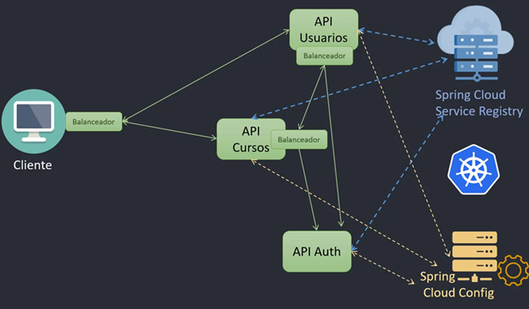

# Sección 17: Kubernetes: Spring Cloud Kubernetes

---

## ¿Por qué usar Spring Cloud Kubernetes si Kubernetes ya ofrece todo?

Una de las dudas más comunes al comenzar a trabajar con `Spring Boot` en `Kubernetes` es entender si realmente
necesitamos integrar herramientas como `Spring Cloud Kubernetes`, considerando que el propio `Kubernetes` ya
proporciona muchas funcionalidades esenciales de forma nativa, como:

- `Service discovery` mediante `DNS` interno (por ejemplo, `http://orders-service`).
- `Balanceo de carga` a `nivel de red` a través de los `Services` de tipo `ClusterIP`, `NodePort` o `LoadBalancer`.
- `Configuración externa` utilizando `ConfigMaps` y `Secrets`.

Entonces, ¿para qué agregar una dependencia adicional como `spring-cloud-starter-kubernetes`?

### ✅ Qué aporta Spring Cloud Kubernetes

`Spring Cloud Kubernetes` no reemplaza lo que ya hace `Kubernetes`, sino que integra esas capacidades de forma
idiomática dentro del ecosistema `Spring`, facilitando la vida del desarrollador cuando:

1. Queremos mapear `ConfigMaps` y `Secrets` directamente como propiedades de Spring Boot. Con `Spring Cloud Kubernetes`,
   los valores definidos en un `ConfigMap` pueden inyectarse directamente en nuestros componentes con `@Value` o
   `@ConfigurationProperties`, sin necesidad de leer archivos o definir variables de entorno. Por ejemplo.
    ````yml
    apiVersion: v1
    kind: ConfigMap
    metadata:
      name: app-config
    data:
      greeting.message: "Hola desde ConfigMap"
    ````
   ````java
   @Value("${greeting.message}")
   private String message;
   ````
   Sin tener que preocuparte por cómo llegar al `ConfigMap`, Spring lo inyecta.


2. Queremos seguir usando patrones de `Spring Cloud` como `DiscoveryClient`. `Kubernetes` ya ofrece `DNS` para descubrir
   servicios. Sin embargo, si venimos de una arquitectura basada en `Spring Cloud Eureka`, es probable que tengamos
   código que usa `DiscoveryClient`. `Spring Cloud Kubernetes` implementa esta interfaz usando la `API de Kubernetes`,
   lo que permite mantener ese código sin cambios.


3. Queremos usar `balanceo de carga` del `lado cliente` (`Client-Side Load Balancer`). `Kubernetes` balancea a nivel de
   red, pero `Spring Cloud Kubernetes` permite usar `@LoadBalanced` `RestTemplate` o `WebClient` junto con estrategias
   de balanceo definidas por el cliente (útil si queremos reglas más complejas o personalizadas).
   > Cuando hablamos de `load balancing` del `lado del cliente` (`client-side`) nos referimos a que la lógica de elegir
   > a cuál instancia de un servicio enviar la solicitud está `implementada en el propio cliente` (es decir, en el
   > microservicio que hace la llamada).
   >
   > Esto es diferente al `server-side load balancing`, que es lo que hace `Kubernetes` con sus `Service`, donde el
   > balanceo ocurre de forma transparente a `nivel de red`.


4. Queremos migrar una arquitectura `Spring Cloud` a `Kubernetes`. En proyectos donde ya se usan herramientas como
   `Config Server`, `Eureka` o `Ribbon`, `Spring Cloud Kubernetes` ofrece un puente para migrar sin tener que reescribir
   toda la lógica de integración de servicios y configuración.

### 🔎 Entonces, ¿lo necesito?

No, si...

- Tu aplicación es nueva y desarrollada específicamente para `Kubernetes`.
- No usas `DiscoveryClient`, `Spring Config Server`, ni necesitas hacer `balanceo de carga` desde el propio
  microservicio (`client-side load balancing`), ya que confías en que `Kubernetes` manejará esto automáticamente a
  nivel de red.
- Estás conforme con acceder a configuración vía variables de entorno o archivos montados.

Sí puede ayudarte, si...

- Estás `migrando` desde un stack `Spring Cloud tradicional`.
- Quieres aprovechar las facilidades que ofrece `Spring` para inyectar configuración.
- Deseas mantener una `arquitectura desacoplada` de `Kubernetes` en ciertos aspectos.

### 📌 En resumen

> Aunque `Spring Cloud Kubernetes no es obligatorio`, sí puede `simplificar la integración` entre el mundo de
> `Kubernetes` y el ecosistema `Spring`, especialmente cuando ya estás aprovechando otras herramientas de
`Spring Cloud`.

## Introducción a Spring Cloud Kubernetes

### ¿Qué es Spring Cloud Kubernetes?

`Spring Cloud Kubernetes` proporciona una integración entre el ecosistema de `Spring Cloud` y el entorno de
`Kubernetes`, permitiendo a los desarrolladores ejecutar aplicaciones `Spring Cloud` de forma nativa sobre una
infraestructura orquestada por `Kubernetes`.

Esta integración facilita tareas comunes como `descubrimiento de servicios`, `balanceo de carga`,
`configuración externa` y `enrutamiento`, utilizando componentes que ya existen en `Kubernetes`, pero alineados al
estilo de desarrollo de Spring.

### Principales características

- `DiscoveryClient`. Permite registrar automáticamente todos los servicios definidos en
  `Kubernetes (hostname y puerto)`, obteniendo una lista completa de los pods asociados a cada uno. A partir de este
  registro, los microservicios pueden comunicarse entre sí usando solo el `nombre del servicio` (como
  `course-service`), desacoplándose de detalles como `IPs` o `puertos`. Este nombre suele configurarse en el archivo
  `application.yml` con la propiedad `spring.application.name`.


- `Spring Cloud Config`. Permite cargar configuraciones externas directamente desde `ConfigMaps` y `Secrets` de
  `Kubernetes`, integrándolos al entorno de propiedades de `Spring Boot`.


- `Spring Cloud LoadBalancer`. Proporciona una implementación de balanceo de carga del lado del cliente (`client-side`),
  utilizando como base los servicios y pods registrados en Kubernetes. Esto permite aplicar estrategias de balanceo más
  flexibles que las ofrecidas por defecto por `Kubernetes`.


- `Spring Cloud Gateway`. Funciona como una puerta de enlace única para acceder a los distintos microservicios. Cada
  ruta configurada en el `gateway` puede dirigir el tráfico al servicio correspondiente, simplificando el acceso desde
  el exterior.

### Arquitectura general



- `Cliente`: Se comunica con los distintos microservicios, los cuales a su vez están respaldados por varios pods que
  representan las distintas instancias en ejecución.


- `Spring Cloud Service Registry`: Es el componente que actúa como `DiscoveryClient`. Registra cada servicio de
  Kubernetes junto con la `lista completa de sus pods` (`IP y puerto`). Esta información se asocia a un `nombre lógico`,
  que luego es usado por los microservicios para comunicarse entre sí sin necesidad de conocer detalles de red.


- `Balanceador`: Cada microservicio puede usar `Spring Cloud LoadBalancer` para seleccionar de forma inteligente a cuál
  `pod` llamar, basándose en la lista registrada por el `DiscoveryClient`.


- `Spring Cloud Config`: Administra la configuración de cada microservicio aprovechando los recursos nativos de
  `Kubernetes (ConfigMaps y Secrets)`, integrándolos al sistema de propiedades de `Spring Boot`.

> Esta arquitectura permite desacoplar aún más la lógica del negocio de la infraestructura, aprovechando lo mejor de
> ambos mundos: `el poder de orquestación de Kubernetes` y la `flexibilidad del ecosistema Spring`.

## 🚀 Configuración de Microservicios con Spring Cloud Kubernetes

Para habilitar la integración de nuestros microservicios con `Kubernetes` usando `Spring Cloud`, es necesario incluir
un conjunto de dependencias que permiten:

- `Descubrimiento de servicios` mediante el `cliente de Kubernetes`.
- `Carga de configuración externa` desde `ConfigMaps` o `Secrets`.
- `Balanceo de carga` entre pods de un mismo servicio.

Estas dependencias deben agregarse en el archivo `pom.xml` de cada microservicio involucrado, como es el caso de:
`courser-service` y `user-service`.

````xml

<dependencies>
    <!-- Cliente de Kubernetes para descubrimiento de servicios -->
    <dependency>
        <groupId>org.springframework.cloud</groupId>
        <artifactId>spring-cloud-starter-kubernetes-client</artifactId>
    </dependency>
    <!-- Integración con ConfigMaps y Secrets para configuración externa -->
    <dependency>
        <groupId>org.springframework.cloud</groupId>
        <artifactId>spring-cloud-starter-kubernetes-client-config</artifactId>
    </dependency>
    <!-- Balanceador de carga basado en el cliente de Kubernetes -->
    <dependency>
        <groupId>org.springframework.cloud</groupId>
        <artifactId>spring-cloud-starter-kubernetes-client-loadbalancer</artifactId>
    </dependency>
</dependencies>
````

#### [¿Qué hace cada dependencia?](https://docs.spring.io/spring-cloud-kubernetes/reference/index.html)

- `spring-cloud-starter-kubernetes-client`. Implementación del `Discovery Client` que resuelve nombres de servicios en
  `Kubernetes Services`. Esta dependencia permite que tu aplicación Spring Boot se comunique
  directamente con el `API de Kubernetes`. Gracias a ella, los microservicios pueden descubrir otros servicios dentro
  del clúster utilizando el `nombre del recurso` `Service` `definido en Kubernetes`, en lugar de una IP fija o un puerto
  específico.


- `spring-cloud-starter-kubernetes-client-config`. Carga propiedades de la aplicación desde `ConfigMaps` y `Secrets` de
  `Kubernetes`. Recarga propiedades de la aplicación cuando un `ConfigMap` o `Secret` cambia. Habilita la carga
  automática de configuración desde recursos de `Kubernetes` como `ConfigMaps` y `Secrets`. Esto permite desacoplar la
  configuración del código fuente, facilitando ajustes dinámicos sin necesidad de recompilar ni redeployar la
  aplicación.


- `spring-cloud-starter-kubernetes-client-loadbalancer`. Proporciona un mecanismo de balanceo de carga entre los pods
  de un mismo servicio. `Utiliza el Service de Kubernetes como punto de entrada`, distribuyendo las peticiones entre
  las instancias disponibles de forma transparente para el consumidor. Hay dos "modos" en los que funciona el
  balanceador de carga: `POD` y `SERVICE` (el valor predeterminado es `POD`).

#### Notas importantes

- Estas dependencias están diseñadas para trabajar con el cliente oficial de Kubernetes, no con el antiguo fabric8.
- `Spring Cloud` abstrae el descubrimiento de servicios, permitiendo que los microservicios se comuniquen
  `usando el nombre lógico del servicio definido en Kubernetes (Service)`, sin necesidad de conocer la IP o el puerto.
- El `balanceador de carga` se integra con el `Service de Kubernetes` para distribuir las peticiones entre los pods
  disponibles.

### 🔍 Habilitando el Descubrimiento de Servicios

Para que nuestros microservicios puedan participar en el mecanismo de descubrimiento de servicios proporcionado por
`Spring Cloud Kubernetes`, es necesario agregar la anotación `@EnableDiscoveryClient` en la clase principal de cada
uno. Esta anotación le indica a `Spring Boot` que debe registrar el microservicio como `cliente de descubrimiento`,
permitiéndole resolver otros servicios dentro del clúster mediante el nombre del `Service` de `Kubernetes`.

A continuación, para habilitar la carga de `DiscoveryClient`, agregue `@EnableDiscoveryClient` a la configuración
o clase de aplicación correspondiente, como se muestra en el siguiente ejemplo para el `user-service`:

````java

@EnableDiscoveryClient
@SpringBootApplication
public class UserServiceApplication {
    public static void main(String[] args) {
        SpringApplication.run(UserServiceApplication.class, args);
    }
}
````

De forma equivalente, se debe aplicar la misma anotación en el microservicio `course-service`.

> Tener la anotación `@EnableDiscoveryClient` es opcional porque el `spring-cloud-starter-kubernetes-client` ya activa
> automáticamente el `DiscoveryClient`.

Entonces, ¿cuándo se recomienda usarla?

- Si quieres hacer explícito en el código que esa aplicación participa en Service Discovery.
- En proyectos grandes, donde trabajas con múltiples tipos de descubrimiento (Eureka, Consul, Kubernetes, etc.), usarla
  deja claro cuál es la intención.
- Puede servir en casos donde se deshabilita el auto-config (por ejemplo, si en el `application.yml` se tiene
  `spring.cloud.discovery.enabled=false`), y deseas forzar el registro.

¿Qué pasa si la dejas o la quitas en tu caso con `Kubernetes`?

- `Si la dejas` → No pasa nada malo. Funciona igual, solo haces explícito el uso del descubrimiento.
- `Si la quitas` → Todo seguirá funcionando igual, porque el `DiscoveryClient` de `Kubernetes` ya se activa con la
  dependencia.

✅ Conclusión:
> En `Kubernetes` con `Spring Cloud Kubernetes`, no es estrictamente necesario usar `@EnableDiscoveryClient`.
> Con solo la dependencia `spring-cloud-starter-kubernetes-client`, ya tienes descubrimiento de servicios habilitado.
> La anotación queda como algo opcional/declarativo, más que técnico.

### 🔧 Configuración del `RestClient` en el microservicio `user-service`

Para permitir la comunicación entre microservicios dentro del clúster de Kubernetes, configuramos un cliente HTTP
usando `RestClient`, introducido en `Spring Framework 6`.

Este cliente será capaz de resolver el nombre del `servicio` destino (`s-course-service`) y aplicar balanceo de carga
entre sus réplicas.

#### 🛠️ Clase de configuración: `RestClientConfig`

````java

@Configuration
public class RestClientConfig {

    @Value("${custom.course-service.base-url}")
    private String courseServiceBaseUrl;

    /**
     * Builder anotado con @LoadBalanced para que Spring Cloud Kubernetes
     * pueda interceptar el nombre lógico del servicio y aplicar balanceo.
     */
    @Bean
    @LoadBalanced
    public RestClient.Builder restClientBuilder(List<RestClientCustomizer> customizers) {
        RestClient.Builder builder = RestClient.builder();
        customizers.forEach(customizer -> customizer.customize(builder));
        return builder;
    }

    @Bean(name = "courseRestClient")
    public RestClient courseServiceRestClient(@Qualifier("restClientBuilder") RestClient.Builder builder) {
        return builder
                .baseUrl(this.courseServiceBaseUrl)
                .build();
    }
}
````

📌 Puntos importantes

1. `baseUrl` solo debe contener la base del servicio. Debe apuntar únicamente al `nombre del Service de Kubernetes`,
   por ejemplo: `http://s-course-service`.
    - `No` incluyas el puerto si `estás trabajando` con `Spring Cloud Kubernetes`, ya que el `@LoadBalanced` necesita
      resolver solo el nombre lógico del servicio. `Si no usas Spring Cloud Kubernetes`, entonces
      `sí puedes incluir el puerto`.
    - `No` incluyas rutas como `/api/v1/...` en el `baseUrl`. El `baseUrl` debe contener solo el `nombre del servicio`,
      por ejemplo: `http://s-course-service`.
    - Esto es fundamental, ya que el `@LoadBalanced` necesita que el host sea el nombre lógico del servicio para
      resolverlo correctamente.


2. El bean `RestClient.Builder` está anotado con `@LoadBalanced`, lo que permite que `Spring Cloud Kubernetes`:
    - Intercepte el nombre del servicio.
    - Consulte el clúster para encontrar sus réplicas.
    - Distribuya las peticiones automáticamente.

#### 🛠 Clase cliente: `CourseServiceClient`

Encapsulamos las llamadas al microservicio `course-service` en una clase dedicada, manteniendo la configuración y la
lógica desacopladas.

````java

@Slf4j
@Component
public class CourseServiceClient {

    private static final String COURSE_URI = "/api/v1/courses";
    private final RestClient restClient;

    public CourseServiceClient(@Qualifier("courseRestClient") RestClient restClient) {
        this.restClient = restClient;
    }

    /**
     * Realiza una llamada DELETE al microservicio de cursos para desasociar
     * un usuario de cualquier curso en el que esté registrado.
     */
    public void unassignUserFromAssociatedCourse(Long userId) {
        log.info("Llamando al servicio course-service para des-asignar de algún curso al usuario con id {}", userId);
        this.restClient
                .delete()
                .uri(COURSE_URI.concat("/users/{userId}"), userId)
                .retrieve()
                .toBodilessEntity();
        log.info("Fin de la llamada al servicio course-service para des-asignar de algún curso al usuario con id {}", userId);
    }
}
````

✅ Buenas prácticas aplicadas

- Uso de `@Qualifier` para evitar conflictos en la inyección cuando hay múltiples `RestClient` registrados.
- Separación de responsabilidades:
    - `RestClientConfig`: configuración e inyección del cliente HTTP.
    - `CourseServiceClient`: encapsulación de la lógica de llamadas al servicio externo.
- `Logging informativo` antes y después de la llamada para facilitar la trazabilidad.
- `Constantes para URIs`, lo que reduce errores y facilita cambios futuros.

### 🛠 Configuración de Spring Cloud Kubernetes en `user-service`

En el archivo `application.yml` del microservicio `user-service`, agregamos las configuraciones necesarias para
habilitar la integración con `Spring Cloud Kubernetes`.

````yml
spring:
  application:
    name: user-service
  cloud:
    kubernetes:
      secrets:
        enable-api: true
      discovery:
        all-namespaces: true

custom:
  course-service:
    base-url: http://${K8S_COURSE_SERVICE_NAME}
````

**Dónde**

- `spring.cloud.kubernetes.secrets.enable-api`, permite leer `Secrets` usando la `API de Kubernetes`, además de
  volúmenes montados.
- `spring.cloud.kubernetes.discovery.all-namespaces`, permite descubrir servicios en todos los namespaces del cluster.
- `spring.cloud.kubernetes.secrets.enabled`, aunque no lo mencionaste explícitamente, es importante saber que esta
  propiedad (por defecto en true) permite que `Spring Cloud Kubernetes` cargue secretos como una fuente de propiedades
  (`PropertySource`). Esto complementa `enable-api`, permitiendo leer secretos tanto desde `volúmenes` montados como
  desde la API si lo configuras.

Observemos que, además, hemos modificado el valor de `base-url` que tenía como valor
`http://${COURSE_SERVICE_HOST}:${COURSE_SERVICE_PORT}/api/v1/courses` y lo reemplazamos por
`http://${K8S_COURSE_SERVICE_NAME}`.

Este cambio se debe a que, al incorporar la dependencia de `Spring Cloud Kubernetes`, ya no es necesario especificar
manualmente el `puerto` ni la `IP` del servicio. Spring se encarga de resolver automáticamente la dirección del
servicio a partir de su nombre, utilizando el `DNS` interno de `Kubernetes`.

**📌 Nota técnica**
> Cuando trabajamos con `Kubernetes puro (sin Spring Cloud Kubernetes)`, es obligatorio definir tanto el nombre del
> servicio como su puerto, por ejemplo: `${COURSE_SERVICE_HOST}:${COURSE_SERVICE_PORT}`.
>
> En cambio, con `Spring Cloud Kubernetes`, basta con el nombre del servicio (`K8S_COURSE_SERVICE_NAME`), ya que el
> framework realiza el descubrimiento dinámico y transparente.

⚠️ Advertencia
> Si defines accidentalmente `base-url` con host y puerto cuando usas `Spring Cloud Kubernetes`, el balanceo de carga
> no se aplicará correctamente y perderás la capacidad de resolución automática de endpoints que ofrece el
> DNS de Kubernetes.

### 🔧 Configuración del `RestClient` en el microservicio `course-service`

Realizamos los mismos cambios que vimos en el apartado anterior.

````java

@Configuration
public class RestClientConfig {

    @Value("${custom.user-service.base-url}")
    private String userServiceBaseUrl;

    @Bean
    @LoadBalanced
    public RestClient.Builder restClientBuilder(List<RestClientCustomizer> customizers) {
        RestClient.Builder builder = RestClient.builder();
        customizers.forEach(customizer -> customizer.customize(builder));
        return builder;
    }

    @Bean(name = "userRestClient")
    public RestClient userServiceRestClient(@Qualifier("restClientBuilder") RestClient.Builder builder) {
        return builder
                .baseUrl(this.userServiceBaseUrl)
                .build();
    }
}
````

````java

@Slf4j
@Component
public class UserServiceClient {

    private static final String USER_URI = "/api/v1/users";
    private final RestClient restClient;

    public UserServiceClient(@Qualifier("userRestClient") RestClient userRestClient) {
        this.restClient = userRestClient;
    }

    public UserResponse getUserFromUserService(Long userId) {
        log.info("Consultando al servicio user-service por el usuario con id {}", userId);
        UserResponse userResponse = this.restClient
                .get()
                .uri(USER_URI.concat("/{userId}"), userId)
                .exchange((clientRequest, clientResponse) -> {
                    HttpStatusCode statusCode = clientResponse.getStatusCode();
                    if (statusCode == HttpStatus.OK) {
                        return clientResponse.bodyTo(UserResponse.class);
                    }

                    if (statusCode == HttpStatus.NOT_FOUND) {
                        throw new RemoteUserNotFoundException(userId);
                    }

                    ErrorResponse errorResponse = clientResponse.bodyTo(ErrorResponse.class);
                    String message = Optional.ofNullable(errorResponse)
                            .map(ErrorResponse::error)
                            .orElseGet(() -> "Error desconocido al consultar el user-service");

                    log.info("Mensaje de error desde el user-service: {}", message);
                    throw new CommunicationException(message);
                });
        log.info("El servicio user-service encontró al usuario buscado: {}", userResponse);
        return userResponse;
    }

    public UserResponse createUserInUserService(UserRequest userRequest) {
        log.info("Registrando usuario en el user-service: {}", userRequest);
        UserResponse userResponse = this.restClient
                .post()
                .uri(USER_URI)
                .body(userRequest)
                .retrieve()
                .body(UserResponse.class);
        log.info("Usuario registrado con éxito en el user-service: {}", userResponse);
        return userResponse;
    }

    public List<UserResponse> getUsersByIdsFromUserService(List<Long> userIds) {
        log.info("Consultando al servicio user-service por los usuarios con id: {}", userIds);
        List<UserResponse> userResponseList = this.restClient
                .get()
                .uri(uriBuilder -> uriBuilder
                        .path(USER_URI.concat("/by-ids"))
                        .queryParam("userIds", userIds)
                        .build())
                .retrieve()
                .body(new ParameterizedTypeReference<>() {
                });
        log.info("El servicio user-service encontró a los usuarios: {}", userResponseList);
        return userResponseList;
    }
}
````

````yml
spring:
  application:
    name: course-service
  cloud:
    kubernetes:
      secrets:
        enable-api: true
      discovery:
        all-namespaces: true

custom:
  user-service:
    base-url: http://${K8S_USER_SERVICE_NAME}
````

### 🔍 FeignClient vs RestClient - Diferencias clave

En el curso, el tutor utiliza `FeignClient` como cliente HTTP, mientras que en mi implementación opté por `RestClient`.

Ambos permiten la comunicación entre microservicios, pero presentan diferencias importantes en cuanto a configuración y
comportamiento.

1. Uso con `FeignClient (tutor)`

````bash
@FeignClient(name = "dk-ms-courses", path = "/api/v1/courses")
````

- ✅ `@LoadBalanced` `implícito`: No es necesario declararlo, `Feign` lo configura internamente para hacer balanceo de
  carga usando el `service discovery`.
- ✅ `name`: Equivale al `.baseUrl()` de `RestClient`; corresponde al nombre del servicio registrado en `Kubernetes` o
  `Eureka`.
- ✅ `path`: Ruta base común para todos los endpoints (opcional).

2. Mi caso con `RestClient`

````bash
@LoadBalanced  //<-- Debe ser explícito
@Bean
public RestClient.Builder restClientBuilder() { ... }

.baseUrl("http://s-course-service")  // <-- Equivale al "name" de FeignClient
.uri("/api/v1/courses/specific-endpoint")  // <-- Path se construye donde se usa
````

- ⚠ `@LoadBalanced`, debe declararse explícitamente en un `RestClient.Builder`.
- `.baseUrl()`, define el servicio de destino (equivalente a `name` en `Feign`).
- `.uri()`, se indica en cada invocación, construyendo la ruta final.

🎯 La equivalencia exacta:

| FeignClient                | RestClient                         |
|----------------------------|------------------------------------|
| `name = "dk-ms-courses"`   | `.baseUrl("http://dk-ms-courses")` |
| `path = "/api/v1/courses"` | `.uri("/api/v1/courses/...")`      |
| Load balancing automático  | `@LoadBalanced` explícito          |

💡 Conclusión técnica:
> `FeignClient` abstrae muchas configuraciones (balanceo, resolución de nombre de servicio, composición de URL base)
> que con `RestClient` deben configurarse manualmente. Esto hace que `Feign` sea más declarativo y simple de mantener,
> aunque `RestClient` ofrece mayor flexibilidad para personalizar llamadas en tiempo de ejecución.

### 📦 Construcción y publicación de imágenes Docker

Ahora que hemos realizado los cambios necesarios en nuestros microservicios, procederemos a construir y publicar las
nuevas imágenes en `Docker Hub` para que puedan ser desplegadas en `Kubernetes`.

1. Construir imagen de `course-service`
    ````bash
    $ docker image build -t magadiflo/course-service .\business-domain\course-service
    ````
    - `-t magadiflo/course-service`, asigna el nombre de la imagen en el formato `usuario/nombre-imagen`. Es importante
      que el nombre de usuario coincida con el de tu cuenta en `Docker Hub`, ya que así el repositorio lo aceptará al
      momento del push.
    - Ruta `.\business-domain\course-service`, indica el directorio donde se encuentra el `Dockerfile`.
   > 💡 Nota: si no se especifica una etiqueta `(:tag)`, `Docker` asignará automáticamente la etiqueta `latest`.

2. Construir imagen de `user-service`
    ````bash
    $ docker image build -t magadiflo/user-service .\business-domain\user-service
    ````
   La lógica es la misma que en el paso anterior, solo que aquí construimos la imagen correspondiente al microservicio
   `user-service`.


3. Publicar las imágenes en Docker Hub
    ````bash
    $ docker push magadiflo/course-service
    ````
    ````bash
    $ docker push magadiflo/user-service
    ````

## Aplicando Cambios en Kubernetes y Probando

En el apartado anterior finalizamos enviando las imágenes actualizadas de los microservicios `course-service` y
`user-service` a `Docker Hub`. Ahora, vamos a actualizar los deployments de cada microservicio para que usen estas
nuevas imágenes.

### 🔄 Cambios en el Deployment y ConfigMap de `user-service`

Antes de aplicar los cambios, recordemos que en la sección `env` de los deployments se definían variables de entorno
específicas para cada microservicio.

Por ejemplo, en el archivo `deployment-user.yml` teníamos estas variables de entorno para configurar la comunicación
con el microservicio de cursos:

````yml
- name: COURSE_SERVICE_HOST
  valueFrom:
    configMapKeyRef:
      name: cm-user-service
      key: course_service_host
- name: COURSE_SERVICE_PORT
  valueFrom:
    configMapKeyRef:
      name: cm-user-service
      key: course_service_port
````

Ahora, como hemos incorporado la integración con `Spring Cloud Kubernetes` y resolvemos la dirección del servicio
vía su nombre en `Kubernetes`, estas variables se reemplazan por una única variable que representa el
`nombre del servicio en Kubernetes`:

````yml
- name: K8S_COURSE_SERVICE_NAME
  valueFrom:
    configMapKeyRef:
      name: cm-user-service
      key: k8s_course_service_name
````

Esto implica que también debemos modificar el `ConfigMap` asociado al `user-service` para reflejar este cambio:

````yml
apiVersion: v1
kind: ConfigMap
metadata:
  name: cm-user-service
data:
  container_port: '8001'
  db_host: s-mysql
  db_port: '3306'
  db_name: db_user_service
  k8s_course_service_name: s-course-service
````

Observa que el valor de `k8s_course_service_name` es `s-course-service`, que corresponde exactamente al
`nombre del servicio definido en Kubernetes`, y será usado por `Spring Cloud Kubernetes` para descubrir y balancear las
peticiones hacia el microservicio de cursos.

### 🔄 Cambios en el Deployment y ConfigMap de `course-service`

De forma análoga al caso de `user-service`, debemos actualizar el `deployment` y el `ConfigMap` del microservicio
`course-service` para usar la nueva variable de entorno que apunta al `nombre del servicio Kubernetes` del
microservicio `user-service`.

Actualizamos el contenido del deployment `deployment-course.yml` agregando la variable de entorno
`K8S_USER_SERVICE_NAME`, que obtiene su valor desde el `ConfigMap` correspondiente:

````yml
- name: K8S_USER_SERVICE_NAME
  valueFrom:
    configMapKeyRef:
      name: cm-course-service
      key: k8s_user_service_name
````

El `ConfigMap` queda configurado con el `nombre del servicio Kubernetes` del `user-service`, es decir con:
`s-user-service`.

````yml
apiVersion: v1
kind: ConfigMap
metadata:
  name: cm-course-service
data:
  container_port: '8002'
  db_host: s-postgres
  db_port: '5432'
  db_name: db_course_service
  k8s_user_service_name: s-user-service
````

### Aplicando los cambios en Kubernetes

Primero aplicamos los `ConfigMap` modificados.

````bash
$ kubectl apply -f .\kubernetes\configmaps\configmap-course.yml -f .\kubernetes\configmaps\configmap-user.yml
configmap/cm-course-service configured
configmap/cm-user-service configured
````

Luego eliminamos los deployments actuales para recrearlos con las nuevas imágenes.

````bash
$ kubectl delete -f .\kubernetes\deployments\deployment-course.yml -f .\kubernetes\deployments\deployment-user.yml
deployment.apps "d-course-service" deleted
deployment.apps "d-user-service" deleted
````

Finalmente volvemos a aplicar los deployments.

````bash
$ kubectl apply -f .\kubernetes\deployments\deployment-user.yml -f .\kubernetes\deployments\deployment-course.yml
deployment.apps/d-user-service created
deployment.apps/d-course-service created
````

### Verificación de despliegue

Listamos los deployments para confirmar que se han creado: `d-course-service` y `d-user-service`.

````bash
$ kubectl get deployments
NAME               READY   UP-TO-DATE   AVAILABLE   AGE
d-course-service   1/1     1            1           17s
d-mysql            1/1     1            1           17d
d-postgres         1/1     1            1           16d
d-user-service     1/1     1            1           17s
````

Listamos los pods y vemos que todos se están ejecutando correctamente. Los pods correspondientes al de los
microservicios también se están ejecutando `aparentemente` de manera correcta.

````bash
$ kubectl get pods
NAME                               READY   STATUS    RESTARTS      AGE
d-course-service-986cc5555-fj5xm   1/1     Running   0             35s
d-mysql-5ffd47dd8-ctmt8            1/1     Running   8 (30m ago)   7d22h
d-postgres-67b99b466d-c27wb        1/1     Running   9 (30m ago)   7d22h
d-user-service-8dd5c844d-cmcq8     1/1     Running   0             35s
````

Pero, qué pasa si vemos algún log de algún pod que acabamos de crear, por ejemplo el de usuarios:

````bash
$ kubectl logs d-user-service-8dd5c844d-cmcq8
...
2025-08-10T05:17:10.417Z  INFO 1 --- [user-service] [s.V1Endpoints-1] i.k.c.informer.cache.ReflectorRunnable   : class io.kubernetes.client.openapi.models.V1Endpoints#Start listing and watching...
2025-08-10T05:17:10.419Z ERROR 1 --- [user-service] [s.V1Endpoints-1] i.k.c.informer.cache.ReflectorRunnable   : class io.kubernetes.client.openapi.models.V1Endpoints#Reflector loop failed unexpectedly

io.kubernetes.client.openapi.ApiException: class V1Status {
    apiVersion: v1
    code: 403
    details: class V1StatusDetails {
        causes: null
        group: null
        kind: endpoints
        name: null
        retryAfterSeconds: null
        uid: null
    }
    kind: Status
    message: endpoints is forbidden: User "system:serviceaccount:default:default" cannot list resource "endpoints" in API group "" at the cluster scope
    metadata: class V1ListMeta {
        _continue: null
        remainingItemCount: null
        resourceVersion: null
        selfLink: null
    }
    reason: Forbidden
    status: Failure
}
...
````

Este log nos está diciendo que nuestra aplicación está intentando listar los recursos `endpoints` del cluster de
Kubernetes, pero no tenemos los permisos necesarios para hacerlo. El error clave es este:

````bash
$ 403 Forbidden User "system:serviceaccount:default:default" cannot list resource "endpoints" in API group "" at the cluster scope
````

Nuestra aplicación está usando el cliente de Kubernetes (`io.kubernetes.client.openapi`) para interactuar con la API del
cluster. Esto es común en aplicaciones que usan `Spring Cloud Kubernetes`, por ejemplo, para descubrir servicios, leer
configuraciones, o reaccionar a cambios en el cluster.

Pero por defecto, cuando un Pod se crea en el namespace `default`, se le asigna el `ServiceAccount` llamado `default`,
que `no tiene permisos para acceder a recursos` como `endpoints`, `configmaps`, `secrets`, etc.

### ¿Cómo solucionarlo?

> Ejecutaremos un comando para otorgar permisos. Lo veremos en un momento.

Como ya sabemos cuál es la solución, volveremos a eliminar los deployments luego a ejecutar el comando de permismos
y finalmente volvemos a crear los deployments.

````bash
$ kubectl delete -f .\kubernetes\deployments\deployment-course.yml -f .\kubernetes\deployments\deployment-user.yml
deployment.apps "d-course-service" deleted
deployment.apps "d-user-service" deleted
````

Ahora creamos el recurso de autorización:

````bash
$ kubectl create clusterrolebinding admin --clusterrole=cluster-admin --serviceaccount=default:default
clusterrolebinding.rbac.authorization.k8s.io/admin created
````

- `clusterrolebinding`: Asocia un `ClusterRole` (permisos a nivel de cluster) con un `ServiceAccount`.
- `admin`: Es el nombre que le asignamos al recurso `ClusterRoleBinding`. Este nombre es arbitrario y sirve como
  identificador único dentro del cluster. Podríamos haberle colocado cualquier otro nombre, como `dev-access-binding` o
  `full-permissions-sa`, según el propósito o el contexto.
- `cluster-admin`: Es el rol más poderoso en `Kubernetes`. Tiene acceso total a todos los recursos en todos los
  namespaces.
- `default:default`: Se refiere al `ServiceAccount` llamado `default` en el namespace `default`, que es el que usan los
  `Pods` si no se les asigna uno explícito.

Ahora sí, volvemos a aplicar los deployments de cursos y usuarios:

````bash
$ kubectl apply -f .\kubernetes\deployments\deployment-user.yml -f .\kubernetes\deployments\deployment-course.yml
deployment.apps/d-user-service created
deployment.apps/d-course-service created
````

Listamos los deployments

````bash
$ kubectl get deployments
NAME               READY   UP-TO-DATE   AVAILABLE   AGE
d-course-service   1/1     1            1           11s
d-mysql            1/1     1            1           17d
d-postgres         1/1     1            1           16d
d-user-service     1/1     1            1           11s
````

Listamos los pods.

````bash
$ kubectl get pods
NAME                               READY   STATUS    RESTARTS      AGE
d-course-service-986cc5555-2wxvh   1/1     Running   0             24s
d-mysql-5ffd47dd8-ctmt8            1/1     Running   8 (42m ago)   7d22h
d-postgres-67b99b466d-c27wb        1/1     Running   9 (42m ago)   7d22h
d-user-service-8dd5c844d-28j9w     1/1     Running   0             24s
````

Ahora volvemos a ejecutar el comando para ver el log de los pods. Veremos que esta vez se están ejecutando sin
problemas.

````bash
$ kubectl logs d-course-service-986cc5555-2wxvh

  .   ____          _            __ _ _
 /\\ / ___'_ __ _ _(_)_ __  __ _ \ \ \ \
( ( )\___ | '_ | '_| | '_ \/ _` | \ \ \ \
 \\/  ___)| |_)| | | | | || (_| |  ) ) ) )
  '  |____| .__|_| |_|_| |_\__, | / / / /
 =========|_|==============|___/=/_/_/_/

 :: Spring Boot ::                (v3.4.5)

2025-08-12T04:33:48.769Z  INFO 1 --- [course-service] [           main] d.m.course.app.CourseServiceApplication  : Starting CourseServiceApplication v0.0.1-SNAPSHOT using Java 21.0.8 with PID 1 (/app/BOOT-INF/classes started by root in /app)
2025-08-12T04:33:48.776Z DEBUG 1 --- [course-service] [           main] d.m.course.app.CourseServiceApplication  : Running with Spring Boot v3.4.5, Spring v6.2.6
2025-08-12T04:33:48.777Z  INFO 1 --- [course-service] [           main] d.m.course.app.CourseServiceApplication  : The following 1 profile is active: "kubernetes"
2025-08-12T04:33:54.690Z  INFO 1 --- [course-service] [           main] .s.d.r.c.RepositoryConfigurationDelegate : Bootstrapping Spring Data JPA repositories in DEFAULT mode.
2025-08-12T04:33:56.500Z  INFO 1 --- [course-service] [           main] .s.d.r.c.RepositoryConfigurationDelegate : Finished Spring Data repository scanning in 1706 ms. Found 2 JPA repository interfaces.
2025-08-12T04:33:59.501Z  INFO 1 --- [course-service] [           main] o.s.cloud.context.scope.GenericScope     : BeanFactory id=b119fb80-e7ca-32c5-ae1d-4b8eec726650
2025-08-12T04:34:05.108Z  INFO 1 --- [course-service] [           main] o.s.b.w.embedded.tomcat.TomcatWebServer  : Tomcat initialized with port 8002 (http)
2025-08-12T04:34:05.203Z  INFO 1 --- [course-service] [           main] o.apache.catalina.core.StandardService   : Starting service [Tomcat]
2025-08-12T04:34:05.282Z  INFO 1 --- [course-service] [           main] o.apache.catalina.core.StandardEngine    : Starting Servlet engine: [Apache Tomcat/10.1.40]
...
2025-08-12T04:34:39.326Z  INFO 1 --- [course-service] [           main] o.s.b.w.embedded.tomcat.TomcatWebServer  : Tomcat started on port 8002 (http) with context path '/'
2025-08-12T04:34:39.502Z  INFO 1 --- [course-service] [           main] d.m.course.app.CourseServiceApplication  : Started CourseServiceApplication in 57.03 seconds (process running for 60.813)
````

También verificamos el logs del pod de usuario.

````bash
$ kubectl logs d-user-service-8dd5c844d-28j9w

  .   ____          _            __ _ _
 /\\ / ___'_ __ _ _(_)_ __  __ _ \ \ \ \
( ( )\___ | '_ | '_| | '_ \/ _` | \ \ \ \
 \\/  ___)| |_)| | | | | || (_| |  ) ) ) )
  '  |____| .__|_| |_|_| |_\__, | / / / /
 =========|_|==============|___/=/_/_/_/

 :: Spring Boot ::                (v3.4.5)

2025-08-12T04:33:42.988Z  INFO 1 --- [user-service] [           main] d.m.user.app.UserServiceApplication      : Starting UserServiceApplication v0.0.1-SNAPSHOT using Java 21.0.8 with PID 1 (/app/BOOT-INF/classes started by root in /app) 2025-08-12T04:33:42.991Z DEBUG 1 --- [user-service] [           main] d.m.user.app.UserServiceApplication      : Running with Spring Boot v3.4.5, Spring v6.2.6
2025-08-12T04:33:42.993Z  INFO 1 --- [user-service] [           main] d.m.user.app.UserServiceApplication      : The following 2 profiles are active: "kubernetes", "default"
2025-08-12T04:33:50.586Z  INFO 1 --- [user-service] [           main] .s.d.r.c.RepositoryConfigurationDelegate : Bootstrapping Spring Data JPA repositories in DEFAULT mode.
2025-08-12T04:33:51.296Z  INFO 1 --- [user-service] [           main] .s.d.r.c.RepositoryConfigurationDelegate : Finished Spring Data repository scanning in 682 ms. Found 1 JPA repository interface.
2025-08-12T04:33:52.683Z  INFO 1 --- [user-service] [           main] o.s.cloud.context.scope.GenericScope     : BeanFactory id=298bd89a-e536-345a-a2ad-f3bc3a32e59f
2025-08-12T04:33:59.509Z  INFO 1 --- [user-service] [           main] o.s.b.w.embedded.tomcat.TomcatWebServer  : Tomcat initialized with port 8001 (http)
2025-08-12T04:33:59.797Z  INFO 1 --- [user-service] [           main] o.apache.catalina.core.StandardService   : Starting service [Tomcat]
2025-08-12T04:33:59.798Z  INFO 1 --- [user-service] [           main] o.apache.catalina.core.StandardEngine    : Starting Servlet engine: [Apache Tomcat/10.1.40]
...
2025-08-12T04:34:35.596Z  INFO 1 --- [user-service] [           main] o.s.b.w.embedded.tomcat.TomcatWebServer  : Tomcat started on port 8001 (http) with context path '/'
2025-08-12T04:34:35.695Z  INFO 1 --- [user-service] [           main] d.m.user.app.UserServiceApplication      : Started UserServiceApplication in 55.36 seconds (process running for 58.162)
````

Listo, como observamos, los errores han desaparecido y vemos que los microservicios se están ejecutando correctamente.

### Prueba de comunicación entre microservicios

Para comprobar que los cambios realizados en la configuración y despliegue están funcionando correctamente, haremos una
petición HTTP desde fuera del clúster hacia el microservicio de Course Service.

1. `Obtener la URL pública del servicio`. Usamos el comando minikube service para obtener la URL en la que el servicio
   `s-course-service` está disponible en nuestro entorno local:

````bash
$ minikube service s-course-service --url
http://127.0.0.1:54041
! Because you are using a Docker driver on windows, the terminal needs to be open to run it.
````

2. `Realizar la petición al endpoint de cursos`. Ejecutamos una petición `GET` al endpoint `/api/v1/courses/{id}`,
   indicando el parámetro `loadRelations=true` para que el servicio incluya también la información de usuarios
   relacionada con el curso:

````bash
$ curl -v -G --data "loadRelations=true" http://127.0.0.1:54041/api/v1/courses/2 | jq
>
< HTTP/1.1 200
< Content-Type: application/json
< Transfer-Encoding: chunked
< Date: Tue, 12 Aug 2025 04:39:42 GMT
<
{
  "id": 2,
  "name": "Spring WebFlux",
  "users": [
    {
      "id": 1,
      "name": "Martin",
      "email": "martin@gmail.com",
      "password": "12345"
    }
  ]
}
````

La respuesta HTTP 200 OK confirma que:

- Course Service está funcionando correctamente.
- La comunicación con User Service también es exitosa, ya que los datos del usuario fueron cargados correctamente
  gracias al parámetro `loadRelations=true`.
- Los cambios en `ConfigMap` y `Deployment` han surtido efecto en el clúster.

Además de probar la API de Course Service, también verificamos el funcionamiento del User Service, que en este caso
tiene lógica adicional. Cuando se elimina un usuario, el servicio también se comunica internamente con Course Service
para desasignar a dicho usuario de cualquier curso en el que esté inscrito.

````bash
$ minikube service s-user-service --url
http://127.0.0.1:54049
! Because you are using a Docker driver on windows, the terminal needs to be open to run it.
````

````bash
$ curl -v -X DELETE http://127.0.0.1:54049/api/v1/users/4 | jq
>
< HTTP/1.1 204
< Date: Tue, 12 Aug 2025 04:42:08 GMT
<
````

Interpretación de la respuesta:

- El código `204 No Content` confirma que la operación se realizó con éxito.
- Internamente:
    - User Service elimina el usuario de su propia base de datos.
    - Luego, realiza una llamada HTTP a Course Service para desasignar al usuario de cualquier curso al que esté
      asociado.
- Este flujo valida que la comunicación entre microservicios en Kubernetes funciona correctamente.

### Verificación de comunicación entre microservicios vía logs

Después de realizar las peticiones anteriores, inspeccionamos los logs de cada microservicio para confirmar que la
comunicación se está estableciendo correctamente.

- `Logs del microservicio course-service`. Se observa que, al consultar un curso con `loadRelations=true`, el servicio
  de cursos realiza una llamada al `user-service` para obtener la información de los usuarios registrados:

````bash
$ kubectl logs d-course-service-986cc5555-2wxvh

  .   ____          _            __ _ _
 /\\ / ___'_ __ _ _(_)_ __  __ _ \ \ \ \
( ( )\___ | '_ | '_| | '_ \/ _` | \ \ \ \
 \\/  ___)| |_)| | | | | || (_| |  ) ) ) )
  '  |____| .__|_| |_|_| |_\__, | / / / /
 =========|_|==============|___/=/_/_/_/

 :: Spring Boot ::                (v3.4.5)

2025-08-12T04:33:48.769Z  INFO 1 --- [course-service] [           main] d.m.course.app.CourseServiceApplication  : Starting CourseServiceApplication v0.0.1-SNAPSHOT using Java 21.0.8 with PID 1 (/app/BOOT-INF/classes started by root in /app)
2025-08-12T04:33:48.776Z DEBUG 1 --- [course-service] [           main] d.m.course.app.CourseServiceApplication  : Running with Spring Boot v3.4.5, Spring v6.2.6
2025-08-12T04:33:48.777Z  INFO 1 --- [course-service] [           main] d.m.course.app.CourseServiceApplication  : The following 1 profile is active: "kubernetes"
...
2025-08-12T04:34:05.108Z  INFO 1 --- [course-service] [           main] o.s.b.w.embedded.tomcat.TomcatWebServer  : Tomcat initialized with port 8002 (http)
...
2025-08-12T04:39:41.267Z  INFO 1 --- [course-service] [nio-8002-exec-1] d.m.course.app.client.UserServiceClient  : Consultando al servicio user-service por los usuarios con id: [1]
2025-08-12T04:39:42.021Z  INFO 1 --- [course-service] [nio-8002-exec-1] d.m.course.app.client.UserServiceClient  : El servicio user-service encontró a los usuarios: [UserResponse[id=1, name=Martin, email=martin@gmail.com, password=12345]]
...
````

- `Logs del microservicio user-service`. Cuando eliminamos un usuario con `DELETE` `/api/v1/users/{id}`, este servicio
  realiza una llamada al `course-service` para desasignar al usuario de cualquier curso en el que esté inscrito:

````bash
$ kubectl logs d-user-service-8dd5c844d-28j9w

  .   ____          _            __ _ _
 /\\ / ___'_ __ _ _(_)_ __  __ _ \ \ \ \
( ( )\___ | '_ | '_| | '_ \/ _` | \ \ \ \
 \\/  ___)| |_)| | | | | || (_| |  ) ) ) )
  '  |____| .__|_| |_|_| |_\__, | / / / /
 =========|_|==============|___/=/_/_/_/

 :: Spring Boot ::                (v3.4.5)

2025-08-12T04:33:42.988Z  INFO 1 --- [user-service] [           main] d.m.user.app.UserServiceApplication      : Starting UserServiceApplication v0.0.1-SNAPSHOT using Java 21.0.8 with PID 1 (/app/BOOT-INF/classes started by root in /app) 2025-08-12T04:33:42.991Z DEBUG 1 --- [user-service] [           main] d.m.user.app.UserServiceApplication      : Running with Spring Boot v3.4.5, Spring v6.2.6
2025-08-12T04:33:42.993Z  INFO 1 --- [user-service] [           main] d.m.user.app.UserServiceApplication      : The following 2 profiles are active: "kubernetes", "default"
...
2025-08-12T04:33:59.509Z  INFO 1 --- [user-service] [           main] o.s.b.w.embedded.tomcat.TomcatWebServer  : Tomcat initialized with port 8001 (http)
...
2025-08-12T04:42:08.294Z  INFO 1 --- [user-service] [io-8001-exec-10] d.m.user.app.client.CourseServiceClient  : Llamando al servicio course-service para des-asignar de algún curso al usuario con id 4
2025-08-12T04:42:08.523Z  INFO 1 --- [user-service] [io-8001-exec-10] d.m.user.app.client.CourseServiceClient  : Fin de la llamada al servicio course-service para des-asignar de algún curso al usuario con id 4
...
````

Esta trazabilidad en los logs confirma que la comunicación entre microservicios se está llevando a cabo de forma
correcta en ambas direcciones.

## Visualizando el LoadBalancer con metadata de Pods

En esta lección veremos cómo identificar visualmente el balanceo de carga que `Kubernetes` realiza entre distintas
réplicas de un servicio.

La idea es comprobar que, a medida que se reciben peticiones, las instancias que responden van cambiando, distribuyendo
así la carga de forma equitativa.

Para lograrlo, vamos a exponer información del `Pod` en tiempo de ejecución (como su nombre o dirección IP) mediante
variables de entorno. De esta forma, podremos saber exactamente qué `Pod` está respondiendo a cada request y confirmar
que el balanceo funciona correctamente.

### 📌 ¿Cómo exponer la metadata de un Pod a un contenedor?

Kubernetes permite inyectar información del propio Pod en los contenedores que aloja, utilizando la `Downward API`.
Esto nos da acceso a campos como:

- Datos de la metadata del Pod (`metadata.name`, `metadata.namespace`, etc.).
- Información del estado del Pod (`status.podIP`, `status.hostIP`, etc.).
- Recursos asignados (CPU, memoria).

La documentación oficial explica este mecanismo aquí:
[exponer información de pods a contenedores a través de variables de entorno](https://kubernetes.io/docs/tasks/inject-data-application/environment-variable-expose-pod-information/)

### Configuración en el Deployment

Tomando como referencia la guía oficial, vamos a modificar el archivo `deployment-user.yml` para añadir variables de
entorno que tomen su valor de campos del Pod.

Ejemplo de fragmento de configuración (se han omitido otras variables para simplificar):

````yml
apiVersion: apps/v1
kind: Deployment
metadata:
  name: d-user-service
spec:
  replicas: 3
  selector:
    matchLabels:
      app: d-user-service
  template:
    metadata:
      labels:
        app: d-user-service
    spec:
      containers:
        - image: magadiflo/user-service:latest
          name: c-user-service
          ports:
            - containerPort: 8001
          env:
            - name: MY_POD_NAME
              valueFrom:
                fieldRef:
                  fieldPath: metadata.name
            - name: MY_POD_IP
              valueFrom:
                fieldRef:
                  fieldPath: status.podIP
            # Other environments ...
````

**Dónde**

- `replicas: 3` → Creamos tres réplicas para poder observar el balanceo de carga entre instancias distintas.
- `MY_POD_NAME` y `MY_POD_IP` → Son nombres arbitrarios para nuestras variables de entorno. En el código, usaremos
  estas variables para obtener el nombre y la IP del Pod que responde.
- `metadata.name` y `status.podIP` → Son los campos internos de Kubernetes a los que accedemos mediante la
  `Downward API` para obtener la información real del Pod.

💡 Nota técnica:
> Si tu servicio está expuesto como `LoadBalancer` (o NodePort con un balanceador externo), Kubernetes no hace balanceo
> de carga internamente de forma aleatoria, sino que suele hacerlo de manera `round-robin` a través del `kube-proxy`
> (o iptables/IPVS), distribuyendo las peticiones entre Pods que estén en estado Ready.

### Usando las variables de entorno en la aplicación

Ahora que hemos configurado nuestras variables de entorno en el `Deployment`, vamos a utilizarlas dentro de la
aplicación de usuarios para mostrar la información del `Pod` que está respondiendo.

El único cambio necesario será en la clase `UserController`:

````java

@Slf4j
@RequiredArgsConstructor
@RestController
@RequestMapping(path = "/api/v1/users")
public class UserController {

    private final UserService userService;
    private final ApplicationContext context;
    private final Environment env; // Proporciona acceso a propiedades y variables de entorno

    @GetMapping(path = "/info")
    public ResponseEntity<Map<String, Object>> getInfo() {
        Map<String, Object> body = Map.of(
                "users", this.userService.findAllUsers(),
                "POD_NAME", Objects.requireNonNull(this.env.getProperty("MY_POD_NAME")),
                "POD_IP", Objects.requireNonNull(this.env.getProperty("MY_POD_IP"))
        );
        return ResponseEntity.ok(body);
    }
    /* other codes */
}
````

Explicación de los cambios

- `Environment` → Es una interfaz de Spring que nos permite acceder a:
    - Variables de entorno del sistema.
    - Propiedades definidas en archivo `application.yml`.
    - Parámetros pasados por línea de comandos.
- `getProperty(String key)` → Método para obtener el valor de una propiedad o variable de entorno según la clave
  indicada.
- `Objects.requireNonNull(...)` → Evita que el valor sea `null` y provoca una excepción en caso de que la variable no
  exista (útil para detectar configuraciones faltantes en tiempo de ejecución).

### Reconstrucción y publicación de la imagen del microservicio

Como realizamos cambios en el código fuente del microservicio de usuarios, es necesario reconstruir su imagen Docker
para que esos cambios se vean reflejados en el entorno de Kubernetes.

Una vez generada, debemos `publicarla en Docker Hub` para que Kubernetes pueda descargarla y desplegarla en los Pods.

1. Construcción de la nueva imagen

````bash
$ docker image build -t magadiflo/user-service .\business-domain\user-service
````

2. Publicación a Docker Hub

````bash
$ docker push magadiflo/user-service
````

### Actualizando el Deployment en Kubernetes

Después de reconstruir y publicar la imagen del microservicio en Docker Hub, debemos actualizar el Deployment para que
use la nueva configuración, incluyendo las variables de entorno que añadimos en pasos anteriores.

1. `Aplicar el archivo de Deployment`. Ejecutamos el siguiente comando para aplicar los cambios del archivo
   `deployment-user.yml`.

````bash
$ kubectl apply -f .\kubernetes\deployments\deployment-user.yml
deployment.apps/d-user-service configured
````

En el `Deployment` hemos definido la imagen como: `image: magadiflo/user-service:latest`, esto implica:

- El tag `latest` es una convención para referirse a la versión más reciente de la imagen.
- `Kubernetes`, por defecto, asigna `imagePullPolicy: Always` cuando se usa `latest`.
- Esto garantiza que en cada despliegue se descargue la última versión disponible en `Docker Hub`, evitando usar una
  imagen obsoleta en caché.

> 💡 `Nota`: Aunque `latest` es práctico en entornos de desarrollo, en producción se recomienda usar `tags` versionados
> para evitar actualizaciones no controladas.

2. `Verificar que los Pods se actualizan`. Al listar los Pods, podemos confirmar que Kubernetes ha creado nuevos Pods
   con la nueva imagen y configuración.

````bash
$ kubectl get pods
NAME                               READY   STATUS    RESTARTS       AGE
d-course-service-986cc5555-2wxvh   1/1     Running   1 (16m ago)    24h
d-mysql-5ffd47dd8-ctmt8            1/1     Running   9 (16m ago)    8d
d-postgres-67b99b466d-c27wb        1/1     Running   10 (16m ago)   8d
d-user-service-866584cd7b-rwj8z    1/1     Running   0              17s
d-user-service-866584cd7b-tprww    1/1     Running   0              17s
d-user-service-866584cd7b-vw47p    1/1     Running   0              17s
````

En este caso:

- `replicas: 3` → Tenemos tres Pods en ejecución para el microservicio `user-service`.
- Los nombres de Pods son únicos porque Kubernetes genera un sufijo aleatorio para cada réplica.
- La columna `AGE` muestra que fueron creados hace pocos segundos, confirmando la actualización.

### Verificando variables de entorno en el Pod

Para confirmar que las variables de entorno (`MY_POD_NAME` y `MY_POD_IP`) se han configurado correctamente en el
contenedor, podemos inspeccionar uno de los Pods del microservicio mediante el comando:

````bash
$ kubectl describe pod d-user-service-866584cd7b-rwj8z
Name:             d-user-service-866584cd7b-rwj8z
Namespace:        default
Priority:         0
Service Account:  default
Node:             minikube/192.168.49.2
Start Time:       Wed, 13 Aug 2025 00:25:02 -0500
Labels:           app=d-user-service
                  pod-template-hash=866584cd7b
Annotations:      <none>
Status:           Running
IP:               10.244.0.182
IPs:
  IP:           10.244.0.182
Controlled By:  ReplicaSet/d-user-service-866584cd7b
Containers:
  c-user-service:
    Container ID:   docker://fd6d008d86fb8944735a2caec41102aede98fe7638787222e1f3db5e255c1c99
    Image:          magadiflo/user-service:latest
    Image ID:       docker-pullable://magadiflo/user-service@sha256:3e53bb17a0f3f70312224f6ffe3e55a3a9c27295d35c0db773e44ba7b9fb0c13
    Port:           8001/TCP
    Host Port:      0/TCP
    State:          Running
      Started:      Wed, 13 Aug 2025 00:25:11 -0500
    Ready:          True
    Restart Count:  0
    Environment:
      MY_POD_NAME:              d-user-service-866584cd7b-rwj8z (v1:metadata.name)
      MY_POD_IP:                 (v1:status.podIP)
      CONTAINER_PORT:           <set to the key 'container_port' of config map 'cm-user-service'>           Optional: false
      DB_HOST:                  <set to the key 'db_host' of config map 'cm-user-service'>                  Optional: false
      DB_PORT:                  <set to the key 'db_port' of config map 'cm-user-service'>                  Optional: false
      DB_NAME:                  <set to the key 'db_name' of config map 'cm-user-service'>                  Optional: false
      DB_USERNAME:              <set to the key 'db_username' in secret 'sec-user-service'>                 Optional: false
      DB_PASSWORD:              <set to the key 'db_password' in secret 'sec-user-service'>                 Optional: false
      K8S_COURSE_SERVICE_NAME:  <set to the key 'k8s_course_service_name' of config map 'cm-user-service'>  Optional: false
    Mounts:
      /var/run/secrets/kubernetes.io/serviceaccount from kube-api-access-vxxv8 (ro)
Conditions:
  Type                        Status
  PodReadyToStartContainers   True
  Initialized                 True
  Ready                       True
  ContainersReady             True
  PodScheduled                True
Volumes:
  kube-api-access-vxxv8:
    Type:                    Projected (a volume that contains injected data from multiple sources)
    TokenExpirationSeconds:  3607
    ConfigMapName:           kube-root-ca.crt
    Optional:                false
    DownwardAPI:             true
QoS Class:                   BestEffort
Node-Selectors:              <none>
Tolerations:                 node.kubernetes.io/not-ready:NoExecute op=Exists for 300s
                             node.kubernetes.io/unreachable:NoExecute op=Exists for 300s
Events:
  Type    Reason     Age   From               Message
  ----    ------     ----  ----               -------
  Normal  Scheduled  50s   default-scheduler  Successfully assigned default/d-user-service-866584cd7b-rwj8z to minikube
  Normal  Pulling    50s   kubelet            Pulling image "magadiflo/user-service:latest"
  Normal  Pulled     43s   kubelet            Successfully pulled image "magadiflo/user-service:latest" in 1.014s (6.356s including waiting). Image size: 306065648 bytes.
  Normal  Created    42s   kubelet            Created container: c-user-service
  Normal  Started    42s   kubelet            Started container c-user-service
````

### Probando el balanceo de carga

Con el endpoint `/api/v1/users/info` ya implementado y desplegado, podemos probar si el `Service` de tipo `LoadBalancer`
está distribuyendo las peticiones entre los `Pods` disponibles.

1. **Obtener la URL del servicio.** Usamos `minikube service` para exponer y obtener la URL del servicio
   `s-user-service`:

````bash
$ minikube service s-user-service --url
http://127.0.0.1:63366
! Because you are using a Docker driver on windows, the terminal needs to be open to run it.
````

2. **Realizar peticiones de prueba.** Ejecutamos varias peticiones usando curl y procesamos la salida con jq para
   formatear el JSON:

````bash
$ curl -v http://127.0.0.1:63366/api/v1/users/info | jq
>
< HTTP/1.1 200
< Content-Type: application/json
< Transfer-Encoding: chunked
< Date: Wed, 13 Aug 2025 05:26:56 GMT
<
{
  "POD_NAME": "d-user-service-866584cd7b-vw47p",
  "POD_IP": "10.244.0.180",
  "users": [
    {...}
  ]
}
````

````bash
$ curl -v http://127.0.0.1:63366/api/v1/users/info | jq
>
< HTTP/1.1 200
< Content-Type: application/json
< Transfer-Encoding: chunked
< Date: Wed, 13 Aug 2025 05:27:22 GMT
<
{
  "POD_NAME": "d-user-service-866584cd7b-tprww",
  "POD_IP": "10.244.0.181",
  "users": [
    {...}
  ]
}
````

````bash
$ curl -v http://127.0.0.1:63366/api/v1/users/info | jq
>
< HTTP/1.1 200
< Content-Type: application/json
< Transfer-Encoding: chunked
< Date: Wed, 13 Aug 2025 05:32:13 GMT
<
{
  "POD_NAME": "d-user-service-866584cd7b-rwj8z",
  "POD_IP": "10.244.0.182",
  "users": [
    {...}
  ]
}
````

3. **Análisis de resultados.** En cada petición:

- El valor de `POD_NAME` cambia → indica que la solicitud fue atendida por un Pod distinto.
- El valor de `POD_IP` también cambia → cada Pod tiene su IP interna diferente dentro del clúster.

Esto confirma que el Service está aplicando un balanceo de carga `round-robin`, distribuyendo las peticiones entre
las 3 réplicas configuradas.

### ✅ Conclusión

> `Sí` se está aplicando `LoadBalancer`.
>
> La evidencia está en que cada petición obtiene valores diferentes de `POD_NAME` y `POD_IP`, lo que demuestra que el
> tráfico se reparte de manera equitativa entre las tres instancias del microservicio.

## Configuraciones de Spring Boot en ConfigMap

En `Kubernetes` podemos usar un `ConfigMap` para almacenar configuraciones externas de nuestras aplicaciones de
`Spring Boot`. Esto nos permite:

- `Externalizar la configuración` → los valores no están dentro de la imagen Docker, sino en Kubernetes.
- `Actualizar la configuración sin recompilar ni redeployar` la aplicación.
- `Centralizar configuraciones` comunes entre múltiples microservicios.

📌 Esto es muy similar a lo que ocurre cuando usamos `Spring Cloud Config Server`, donde tenemos archivos de
configuración externos que se combinan con el `application.yml` de cada microservicio.

En este caso, usaremos un `ConfigMap` para inyectar configuraciones en el microservicio `user-service`.

### Documentación de referencia

- [Implementaciones de PropertySource de Kubernetes](https://docs.spring.io/spring-cloud-kubernetes/reference/property-source-config.html)
- [Uso de una fuente de propiedades de ConfigMap](https://docs.spring.io/spring-cloud-kubernetes/reference/property-source-config/configmap-propertysource.html)

### Ejemplo: ConfigMap para user-service

Modificamos el archivo `configmap-user.yml` con la siguiente configuración:

````yml
apiVersion: v1
kind: ConfigMap
metadata:
  name: cm-user-service
data:
  container_port: '8001'
  db_host: s-mysql
  db_port: '3306'
  db_name: db_user_service
  k8s_course_service_name: s-course-service
  user-service.yml: |-
    config:
      text: Configuración desde el ConfigMap. Entorno por defecto.
````

Explicación

- `Claves simples` (container_port, db_host, etc.)
    - Se inyectan como propiedades individuales que la aplicación podrá leer.
    - Ejemplo: `@Value("${db_host}")` en el código de Spring.

- `Bloque` `user-service.yml`
    - Aquí definimos un archivo de configuración completo (en formato `YAML`).
        - La clave `user-service.yml` debe llamarse igual que el `spring.application.name` de la aplicación.
        - `Kubernetes` y `Spring Cloud Kubernetes` lo interpretarán como un archivo de configuración adicional.
        - Las propiedades definidas aquí se unen a las que ya están en el `application.yml` interno de la aplicación.

⚠️ Importante:
> El nombre de la clave (`user-service.yml`) es obligatorio que coincida con `spring.application.name` + `.yml`.
> De lo contrario, `Spring` no reconocerá este bloque como parte de la configuración de la aplicación.

💡 Consejo de buenas prácticas
> En un entorno real, es común tener múltiples configuraciones según el perfil de Spring:
> - `user-service.yml` → configuración por defecto.
> - `user-service-dev.yml`, `user-service-prod.yml` → configuraciones específicas para cada entorno.
>
> Así se pueden manejar diferentes parámetros sin tener que modificar el código fuente.

**Importante**
> En el ejemplo anterior estamos definiendo la propiedad `user-service.yml` que hace referencia al nombre de
> la aplicación a quien le vamos a pasar las propiedades definidas. En nuestro caso la aplicación de Spring Boot con
> el que estamos trabajando para este ejemplo es `user-service`, eso lo podemos ver en su `spring.application.name`.
>
> Es importante que tenga ese nombre para que funcione (`user-service.yml`). Esta clave será tratado como un archivo de
> configuración, por eso es muy importante que tenga el nombre de la aplicación y la extensión `yml`.

### Integración de ConfigMap con Spring Boot 3

En `Spring Boot 3`, para que la aplicación pueda leer configuraciones externas desde `Kubernetes` `ConfigMap`,
es obligatorio habilitar explícitamente la importación con la propiedad: `spring.config.import: 'kubernetes:'`.
Si omitimos esta línea, la aplicación no integrará los `ConfigMap` de `Kubernetes`.

### Configuración del application.yml

En nuestro caso, la aplicación se llama `user-service`. Por defecto, al usar `spring.config.import: 'kubernetes:'`,
`Spring Cloud Kubernetes` intentará buscar un `ConfigMap` con el mismo nombre que la aplicación (`user-service`).

Sin embargo, nuestro `ConfigMap` tiene otro nombre: `cm-user-service`. Por eso, debemos indicárselo explícitamente
con la propiedad `spring.cloud.kubernetes.config.sources`.

````yml
spring:
  application:
    name: user-service
  cloud:
    kubernetes:
      secrets:
        enable-api: true
      discovery:
        all-namespaces: true
      config:
        sources:
          - name: cm-user-service
  config:
    import: 'kubernetes:'
````

Explicación

- `spring.config.import: 'kubernetes:'`
    - Habilita la integración con Kubernetes como fuente de configuración externa.
    - 🔑 En `Spring Boot 2.x` no era necesario, pero en `Spring Boot 3` sí.


- `spring.cloud.kubernetes.config.sources`
    - Indica explícitamente qué `ConfigMaps` usar como fuente de propiedades. En este caso, `cm-user-service`.
        - Si lo omitimos, `Spring` buscará un `ConfigMap` con el nombre `user-service` (que no existe).
        - Esto permitiría incluso combinar múltiples `ConfigMaps` como fuentes de configuración.


- `secrets.enable-api: true`
    - Permite que la aplicación también pueda leer secretos de Kubernetes si fueran necesarios (útil para credenciales).


- `discovery.all-namespaces: true`
    - Habilita que el cliente de descubrimiento pueda listar servicios en todos los namespaces (en entornos reales
      suele restringirse).

💡 Nota de buenas prácticas:
> En entornos de producción, lo ideal es que el nombre del `ConfigMap` coincida con el `spring.application.name`. Así
> evitamos tener que configurar `spring.cloud.kubernetes.config.sources`. Pero para efectos de aprendizaje, es
> excelente que lo tengamos distinto porque obliga a entender bien cómo funciona el mecanismo.

### Accediendo a configuraciones desde el ConfigMap

Una vez que nuestra aplicación de `Spring Boot` está conectada con el `ConfigMap` de `Kubernetes`, podemos leer sus
propiedades directamente utilizando la interfaz `Environment` de `Spring`.

En el siguiente ejemplo, dentro del controlador `UserController`, accedemos a diferentes propiedades:

- Variables de entorno inyectadas por `Kubernetes` (`MY_POD_NAME`, `MY_POD_IP`).
- Propiedades externas definidas en el `ConfigMap` (`config.text`).
- Información del propio microservicio (`users` obtenidos desde el servicio).

````java

@Slf4j
@RequiredArgsConstructor
@RestController
@RequestMapping(path = "/api/v1/users")
public class UserController {

    private final UserService userService;
    private final ApplicationContext context;
    private final Environment env;

    @GetMapping(path = "/info")
    public ResponseEntity<Map<String, Object>> getInfo() {
        Map<String, Object> body = Map.of(
                "users", this.userService.findAllUsers(),
                "POD_NAME", Objects.requireNonNull(this.env.getProperty("MY_POD_NAME")),
                "POD_IP", Objects.requireNonNull(this.env.getProperty("MY_POD_IP")),
                "config_text", Objects.requireNonNull(this.env.getProperty("config.text"))
        );
        return ResponseEntity.ok(body);
    }
    /* other code */
}
````

📌 Nota
> La clave `config.text` corresponde a la propiedad definida dentro del bloque `user-service.yml` en el `ConfigMap`.
> Esto demuestra cómo las propiedades externas quedan fusionadas con las configuraciones internas del `application.yml`
> de `Spring Boot`.

### Despliegue del user-service con integración de ConfigMap

Como hicimos cambios al código fuente del `user-service`, necesitamos volver a construir la imagen.

````bash
$ docker image build -t magadiflo/user-service .\business-domain\user-service
````

La subimos nuevamente a `Docker Hub`.

````bash
$ docker push magadiflo/user-service
````

Se aplica el `configmap-user.yml`, lo que asegura que la configuración externa esté disponible para el microservicio.

````bash
$ kubectl apply -f .\kubernetes\configmaps\configmap-user.yml
configmap/cm-user-service configured
````

Se elimina el deployment anterior de `user-service` para que al volver a crearlo los pods arranquen con las nuevas
configuraciones del `ConfigMap`.

````bash
$ kubectl delete -f .\kubernetes\deployments\deployment-user.yml
deployment.apps "d-user-service" deleted
````

Aplicamos el deployment.

````bash
$ kubectl apply -f .\kubernetes\deployments\deployment-user.yml
deployment.apps/d-user-service created
````

Se listan los deployments y pods para confirmar que el nuevo `d-user-service` se creó correctamente y que los tres pods
están en estado Running.

````bash
$ kubectl get deployments
NAME               READY   UP-TO-DATE   AVAILABLE   AGE
d-course-service   1/1     1            1           4d1h
d-mysql            1/1     1            1           22d
d-postgres         1/1     1            1           21d
d-user-service     3/3     3            3           71s
````

Listamos los pods.

````bash
$ kubectl get pods
NAME                               READY   STATUS    RESTARTS        AGE
d-course-service-986cc5555-2wxvh   1/1     Running   4 (137m ago)    4d1h
d-mysql-5ffd47dd8-ctmt8            1/1     Running   12 (137m ago)   12d
d-postgres-67b99b466d-c27wb        1/1     Running   13 (137m ago)   12d
d-user-service-866584cd7b-2vm9v    1/1     Running   0               86s
d-user-service-866584cd7b-8l2sr    1/1     Running   0               86s
d-user-service-866584cd7b-tv2p9    1/1     Running   0               86s
````

### Validando la Configuración desde el ConfigMap en el Servicio de Usuario

Obtenemos la URL expuesta por el `Service` de `Kubernetes` para el microservicio `user-service` y realizamos una
petición HTTP.

````bash
$ minikube service s-user-service --url
http://127.0.0.1:49601
! Because you are using a Docker driver on windows, the terminal needs to be open to run it.
````

Con la URL disponible, se puede realizar una petición al endpoint del `user-service`. En la respuesta se observa el
valor de la propiedad `config.text`, la cual proviene directamente del `ConfigMap`:

````bash
$ curl -v http://127.0.0.1:49601/api/v1/users/info | jq
>
< HTTP/1.1 200
< Content-Type: application/json
< Transfer-Encoding: chunked
< Date: Sat, 16 Aug 2025 06:34:00 GMT
<
{
  "POD_NAME": "d-user-service-866584cd7b-8l2sr",
  "config_text": "Configuración desde el ConfigMap. Entorno por defecto.",
  "POD_IP": "10.244.1.1",
  "users": [
    {
      "id": 1,
      "name": "Martin",
      "email": "martin@gmail.com",
      "password": "12345"
    },
    {
      "id": 2,
      "name": "Milagros",
      "email": "milagros@gmail.com",
      "password": "123456"
    }
  ]
}
````

De esta forma se confirma que la aplicación está leyendo y aplicando correctamente las configuraciones proporcionadas
desde el `ConfigMap`, lo que permite centralizar y gestionar los parámetros sin necesidad de modificar o reiniciar el
microservicio.

## Configuración de entornos (dev y prod)

En Spring Boot es común trabajar con perfiles (`profiles`) para separar configuraciones de distintos entornos,
como desarrollo (`dev`) y producción (`prod`).

En nuestro microservicio `user-service` ya teníamos en su `application.yml` la propiedad `spring.profiles.active`,
la cual definimos usando la variable de entorno `SPRING_PROFILES_ACTIVE`.

De esta manera, podemos activar el perfil deseado al momento del despliegue:

````yml
spring:
  profiles:
    active: ${SPRING_PROFILES_ACTIVE:default}
  application:
    name: user-service
````

👉 Aquí ocurre lo siguiente:

- Si existe la variable de entorno `SPRING_PROFILES_ACTIVE`, Spring Boot tomará su valor como perfil activo.
- Si no existe, por defecto se usará el perfil `default`, que corresponde a las configuraciones base definidas en
  `application.yml` dentro del `classpath` de la aplicación `Spring Boot`. En el caso de `Kubernetes`, esto se
  complementa con el `user-service.yml` cargado desde el `ConfigMap`, que también forma parte de la configuración base.

Con esto aseguramos que el código fuente no tenga configuraciones `hardcodeadas` de entornos y que Kubernetes sea
el encargado de inyectarlas.

### Definiendo el perfil en Kubernetes

Para pasar el valor de `SPRING_PROFILES_ACTIVE` desde Kubernetes, lo hacemos en el `Deployment` de `user-service`.

En la sección `env` del contenedor `c-user-service` agregamos la referencia al `ConfigMap` donde definimos el valor:

````yml
apiVersion: apps/v1
kind: Deployment
metadata:
  name: d-user-service
spec:
  replicas: 3
  selector:
    matchLabels:
      app: d-user-service
  template:
    metadata:
      labels:
        app: d-user-service
    spec:
      containers:
        - image: magadiflo/user-service:latest
          name: c-user-service
          ports:
            - containerPort: 8001
          env:
            - name: SPRING_PROFILES_ACTIVE
              valueFrom:
                configMapKeyRef:
                  name: cm-user-service
                  key: spring_profiles_active
# Other configurations...
````

En este punto:

- El `Deployment` define que la variable `SPRING_PROFILES_ACTIVE` se obtendrá del `ConfigMap` llamado `cm-user-service`.
- El valor se tomará de la `key` llamada `spring_profiles_active` que debe estar definida dentro de dicho `ConfigMap`.

### Definición del perfil activo en el ConfigMap

En el `Deployment` de nuestro microservicio user-service (`d-user-service`), configuramos la variable de entorno
`SPRING_PROFILES_ACTIVE` para que tome su valor desde un `ConfigMap`. De esta manera desacoplamos la definición
del perfil del propio despliegue y la mantenemos en un objeto de configuración centralizado.

Ahora, en el archivo `configmap-user.yml` agregamos la `key` `spring_profiles_active`, que será utilizada por el
`Deployment` para inyectar el perfil activo en la aplicación:

````yml
apiVersion: v1
kind: ConfigMap
metadata:
  name: cm-user-service
data:
  spring_profiles_active: dev
# Other configurations...
````

👉 Con esto logramos lo siguiente:

- El valor del perfil activo (`dev`, en este caso) no está embebido en la definición del `Deployment`, sino en el
  `ConfigMap`.
- Si más adelante necesitamos cambiar el perfil (por ejemplo, a `prod`), bastará con actualizar el `ConfigMap` y
  reiniciar el `Deployment`, sin necesidad de reconstruir imágenes ni modificar la definición del contenedor.
- Esto es una buena práctica en `Kubernetes`, ya que mantiene el principio `configuración fuera del código`, lo cual
  facilita despliegues en distintos entornos.

### Definición de perfiles de configuración en el ConfigMap

En la sección anterior definimos el perfil por defecto (`default`), el cual corresponde al archivo `user-service.yml`.
Ahora vamos a definir perfiles adicionales para desarrollo (`dev`) y producción (`prod`), de manera que la aplicación
pueda tomar automáticamente la configuración adecuada según el entorno en el que se despliegue.

Para ello, actualizamos el archivo `configmap-user.yml` de la siguiente forma:

````yml
apiVersion: v1
kind: ConfigMap
metadata:
  name: cm-user-service
data:
  container_port: '8001'
  db_host: s-mysql
  db_port: '3306'
  db_name: db_user_service
  k8s_course_service_name: s-course-service
  spring_profiles_active: dev
  user-service.yml: |-
    config:
      text: Configuraciones del perfil activo [default] desde [configmap-user.yml]
  user-service-dev.yml: |-
    config:
      text: Configuraciones del perfil activo [dev] desde [configmap-user.yml]
  user-service-prod.yml: |-
    config:
      text: Configuraciones del perfil activo [prod] desde [configmap-user.yml]
````

👉 Con esta definición conseguimos:

- `Separación de entornos`: cada perfil (`default`, `dev`, `prod`) tiene su propio bloque de configuración dentro del
  `ConfigMap`.
- `Flexibilidad`: cambiando el valor de `spring_profiles_active` en el mismo `ConfigMap`, podemos decidir qué perfil
  usar en el despliegue, sin modificar el `Deployment` ni reconstruir la imagen.
- `Consistencia con Spring Boot`: al usar nombres como `user-service-dev.yml`, mantenemos el mismo patrón que maneja
  `Spring Boot` para la resolución automática de perfiles (`application-dev.yml`, `application-prod.yml`, etc.).

⚠️ Importante:

- El perfil `default` (aquí representado con `user-service.yml`) es tomado cuando no se define explícitamente ningún
  perfil activo.
- Los perfiles `dev` y `prod` sobrescribirán las configuraciones base de `user-service.yml` únicamente cuando se
  activen mediante la variable `SPRING_PROFILES_ACTIVE`.

### Aplicando cambios de configuración en Kubernetes

Como únicamente hemos modificado los archivos `configmap-user.yml` y `deployment-user.yml`, serán esos los que
aplicaremos en `Kubernetes`.

Primero, aplicamos el cambio realizado en el archivo `configmap-user.yml`:

````bash
$ kubectl apply -f .\kubernetes\configmaps\configmap-user.yml
configmap/cm-user-service configured
````

Una forma común de asegurarnos de que el `Deployment` tome los nuevos valores del `ConfigMap` es eliminar el
`Deployment` y volverlo a aplicar.

````bash
$ kubectl delete -f .\kubernetes\deployments\deployment-user.yml
deployment.apps "d-user-service" deleted
````

Ahora volvemos a aplicar el `Deployment` de `user-service`. En este punto, se leerán las configuraciones actuales del
`ConfigMap` `cm-user-service`:

````bash
$ kubectl apply -f .\kubernetes\deployments\deployment-user.yml
deployment.apps/d-user-service created
````

Podemos validar que el `Deployment` está correctamente creado y actualizado:

````bash
$ kubectl get deployments
NAME               READY   UP-TO-DATE   AVAILABLE   AGE
d-course-service   1/1     1            1           4d20h
d-mysql            1/1     1            1           22d
d-postgres         1/1     1            1           21d
d-user-service     3/3     3            3           99s
````

Finalmente, listamos los `Pods` para verificar que se levantaron correctamente las 3 réplicas del `user-service`:

````bash
kubectl get pods
NAME                               READY   STATUS    RESTARTS       AGE
d-course-service-986cc5555-2wxvh   1/1     Running   5 (24m ago)    4d20h
d-mysql-5ffd47dd8-ctmt8            1/1     Running   13 (24m ago)   12d
d-postgres-67b99b466d-c27wb        1/1     Running   14 (24m ago)   12d
d-user-service-7f97954958-5tw2p    1/1     Running   0              2m11s
d-user-service-7f97954958-6gh6c    1/1     Running   0              2m11s
d-user-service-7f97954958-zgr2x    1/1     Running   0              2m11s
````

✅ Con esto confirmamos que el `user-service` se desplegó correctamente con las configuraciones provenientes del
`ConfigMap`.

### Validación de la configuración aplicada

Levantamos el servicio `s-user-service` para poder acceder desde fuera de `Minikube` y realizar una petición a
nuestra aplicación:

````bash
$ minikube service s-user-service --url
http://127.0.0.1:53386
! Because you are using a Docker driver on windows, the terminal needs to be open to run it.
````

Al realizar la petición comprobamos que el valor de la configuración `config.text` corresponde al perfil `dev`,
tal como lo definimos en el `ConfigMap`:

````bash
$ curl -v http://127.0.0.1:53386/api/v1/users/info | jq
>
< HTTP/1.1 200
< Content-Type: application/json
< Transfer-Encoding: chunked
< Date: Sun, 17 Aug 2025 01:14:19 GMT
<
{
  "POD_NAME": "d-user-service-7f97954958-5tw2p",
  "users": [
    {
      "id": 1,
      "name": "Martin",
      "email": "martin@gmail.com",
      "password": "12345"
    },
    {
      "id": 2,
      "name": "Milagros",
      "email": "milagros@gmail.com",
      "password": "123456"
    }
  ],
  "POD_IP": "10.244.1.11",
  "config_text": "Configuraciones del perfil activo [dev] desde [configmap-user.yml]"
}
````

✅ Con esto confirmamos que el `user-service` está utilizando correctamente el perfil activo (`dev`) definido en el
`ConfigMap` y que la aplicación aplica las configuraciones esperadas.

### Cambio de perfil a producción

Modificamos el `ConfigMap` para que la `key` `spring_profiles_active` apunte al perfil `prod`:

````yml
apiVersion: v1
kind: ConfigMap
metadata:
  name: cm-user-service
data:
  container_port: '8001'
  db_host: s-mysql
  db_port: '3306'
  db_name: db_user_service
  k8s_course_service_name: s-course-service
  spring_profiles_active: prod
  user-service.yml: |-
    config:
      text: Configuraciones del perfil activo [default] desde [configmap-user.yml]
  user-service-dev.yml: |-
    config:
      text: Configuraciones del perfil activo [dev] desde [configmap-user.yml]
  user-service-prod.yml: |-
    config:
      text: Configuraciones del perfil activo [prod] desde [configmap-user.yml]
````

Aplicamos los cambios al `ConfigMap`:

````bash
$ kubectl apply -f .\kubernetes\configmaps\configmap-user.yml
configmap/cm-user-service configured
````

### 🔄 Actualización del Deployment con la nueva versión del ConfigMap

Anteriormente, para que el `Deployment` detecte los cambios del `ConfigMap`, lo que hacíamos era eliminar el Deployment
y volver a aplicarlo.

Ahora lo haremos de una forma más eficiente y recomendada: `forzando una reconciliación controlada del Deployment`, es
decir, `reiniciando sus Pods`.

````bash
$ kubectl rollout restart deployment/d-user-service
deployment.apps/d-user-service restarted
````

**Dónde**

- `kubectl`: Es la herramienta de línea de comandos principal para interactuar con tu clúster de Kubernetes. Es tu
  "control remoto" para gestionar los recursos.
- `rollout`: Es el subcomando que gestiona el despliegue de las aplicaciones. Se utiliza para monitorear, pausar,
  resumir o, en este caso, reiniciar un Deployment.
- `restart`: Es una acción específica del comando `rollout` que le dice a Kubernetes que inicie un nuevo "despliegue"
  (`rollout`). Esto fuerza a los Pods existentes a ser terminados y reemplazados por unos nuevos con la configuración
  más reciente.
- `deployment/d-user-service`: Esta es la especificación del recurso.
    - `deployment`: Es el tipo de recurso que quieres afectar.
    - `d-user-service`: Es el nombre del Deployment en particular que quieres reiniciar.

Al ejecutar el comando anterior, `Kubernetes` `termina los Pods` existentes y `crea nuevos Pods` con la última versión
del `ConfigMap` montada. El proceso es controlado, asegurando que nuestra aplicación siga funcionando con el mínimo
tiempo de inactividad.

> `kubectl rollout restart` (Método Recomendado): Este comando es más seguro y eficiente. Realiza un reinicio
> controlado. Kubernetes termina los Pods antiguos de forma gradual y crea los nuevos, asegurando que tu aplicación
> mantenga la disponibilidad y no haya un tiempo de inactividad abrupto. Es el método estándar en entornos de
> producción.
>
> `kubectl delete` y `kubectl apply`: Este método es más `"violento"`. Elimina todos los Pods a la vez antes de crear
> los nuevos. Esto podría causar un breve tiempo de inactividad o interrupciones en el servicio, ya que la aplicación
> podría estar completamente caída mientras se crean los nuevos Pods.

Si listamos los pods para el `user-service`, vemos que se han creado unos nuevos.

````bash
$ kubectl get pods
NAME                               READY   STATUS    RESTARTS       AGE
d-course-service-986cc5555-2wxvh   1/1     Running   5 (72m ago)    4d21h
d-mysql-5ffd47dd8-ctmt8            1/1     Running   13 (72m ago)   12d
d-postgres-67b99b466d-c27wb        1/1     Running   14 (72m ago)   12d
d-user-service-5dddcdd5b-2zv97     1/1     Running   0              76s
d-user-service-5dddcdd5b-7ch4s     1/1     Running   0              82s
d-user-service-5dddcdd5b-dgc7m     1/1     Running   0              79s
````

Realizamos la petición y observamos que el valor de la configuración `config.text` está siendo tomado del perfil
`prod` tal como lo esperábamos.

````bash
$ curl -v http://127.0.0.1:53386/api/v1/users/info | jq
>
< HTTP/1.1 200
< Content-Type: application/json
< Transfer-Encoding: chunked
< Date: Sun, 17 Aug 2025 02:01:58 GMT
<
{
  "POD_NAME": "d-user-service-5dddcdd5b-dgc7m",
  "users": [
    {
      "id": 1,
      "name": "Martin",
      "email": "martin@gmail.com",
      "password": "12345"
    },
    {
      "id": 2,
      "name": "Milagros",
      "email": "milagros@gmail.com",
      "password": "123456"
    }
  ],
  "POD_IP": "10.244.1.13",
  "config_text": "Configuraciones del perfil activo [prod] desde [configmap-user.yml]"
}
````

✅ Conclusión:

Con este procedimiento comprobamos que:

- Podemos gestionar múltiples perfiles (`default`, `dev`, `prod`) desde un mismo `ConfigMap`.
- El valor de la clave `spring_profiles_active` determina el perfil cargado por la aplicación.
- Al actualizar un `ConfigMap`, el método recomendado para que el `Deployment` adopte los cambios es ejecutar:
    ````bash
    $ kubectl rollout restart deployment/d-user-service 
    ````

De esta manera, `Kubernetes` reinicia los `Pods` de forma controlada, asegurando que la aplicación se mantenga
disponible mientras aplica la nueva configuración.

### Configuración final del perfil dev

Antes de finalizar esta lección, dejaremos configurado nuestra aplicación con el perfil `dev`.

````yml
apiVersion: v1
kind: ConfigMap
metadata:
  name: cm-user-service
data:
  container_port: '8001'
  db_host: s-mysql
  db_port: '3306'
  db_name: db_user_service
  k8s_course_service_name: s-course-service
  spring_profiles_active: dev
# Other configurations...
````

Actualizamos la configuración en el clúster aplicando los cambios en el `ConfigMap`.

````bash
$  kubectl apply -f .\kubernetes\configmaps\configmap-user.yml
configmap/cm-user-service configured
````

Los `Pods` existentes no adoptan los cambios del `ConfigMap` de forma automática. Para forzar la propagación de estas
actualizaciones, debemos ejecutar un `reinicio controlado del Deployment`. Esto detendrá los Pods antiguos y creará
nuevos Pods que leerán la `versión más reciente del ConfigMap`.

````bash
$ kubectl rollout restart deployment/d-user-service
deployment.apps/d-user-service restarted
````

Si realizamos una petición a nuestra aplicación, veremos que ya estamos con el perfil `dev` nuevamente.

````bash
$ curl -v http://127.0.0.1:53386/api/v1/users/info | jq
>
< HTTP/1.1 200
< Content-Type: application/json
< Transfer-Encoding: chunked
< Date: Sun, 17 Aug 2025 02:28:08 GMT
<
{
  "config_text": "Configuraciones del perfil activo [dev] desde [configmap-user.yml]",
  "POD_IP": "10.244.1.16",
  "users": [
    {
      "id": 1,
      "name": "Martin",
      "email": "martin@gmail.com",
      "password": "12345"
    },
    {
      "id": 2,
      "name": "Milagros",
      "email": "milagros@gmail.com",
      "password": "123456"
    }
  ],
  "POD_NAME": "d-user-service-7c58cc768b-lm6hp"
}
````

## 📘 Configurando Liveness y Readiness en microservicios con Spring Boot Actuator

En esta lección aprenderemos cómo `Kubernetes` verifica la salud de los `Pods` y `contenedores` mediante los
llamados `probes` (`sondeos`).

Estos chequeos los realiza el proceso `Kubelet`, que se encarga de monitorear la salud de los contenedores y notificar
al `API Server` del `Control Plane` cuando algo no funciona correctamente. En base a esto, `Kubernetes` puede reiniciar
el contenedor o reemplazar el `Pod` defectuoso.

### Tipos de probes

Existen dos tipos principales de verificaciones:

- 🔵 `LivenessProbe`
    - Determina si el contenedor está funcionando correctamente (`healthy`) o si ha entrado en estado `broken`
      (falló la aplicación).
    - Si falla, `Kubernetes` `reinicia el contenedor`.


- 🟢 `ReadinessProbe`
    - Indica si la aplicación está lista para aceptar tráfico entrante.
    - Puede no estar lista porque todavía está arrancando o porque el `Pod` está sobrecargado y no puede recibir más
      solicitudes temporalmente.
    - Si falla, `Kubernetes` deja de enviar tráfico al `Pod`, pero `no lo reinicia`.

👉 Resumiendo:

- `liveness` = ¿La aplicación sigue viva?
- `readiness` = ¿La aplicación puede recibir solicitudes?

### ⚡ Activando endpoints con Spring Boot Actuator

Para implementar los probes (`liveness` y `readiness`) en una aplicación `Spring Boot`, aprovecharemos el
`Spring Boot Actuator`, el cual ya está incluido en el `pom.xml` de nuestro microservicio `user-service`.

Por lo tanto, todas las configuraciones que veremos a continuación estarán enfocadas únicamente en este microservicio.

````xml

<dependency>
    <groupId>org.springframework.boot</groupId>
    <artifactId>spring-boot-starter-actuator</artifactId>
</dependency>
````

### ⚙️ Configuraciones de Spring Boot Actuator

En el archivo `application.yml` del microservicio `user-service` configuramos el `Spring Boot Actuator` para exponer
todos sus endpoints y habilitamos explícitamente los probes de salud: `liveness` y `readiness`.

````yml
management:
  endpoints:
    web:
      exposure:
        include: '*'
  endpoint:
    health:
      show-details: always
      probes:
        enabled: true
  health:
    livenessstate:
      enabled: true
    readinessstate:
      enabled: true
````

Explicación de cada configuración:

- `management.endpoints.web.exposure.include='*'`. Expone todos los endpoints de Actuator a través de HTTP.
  > ⚠️ En producción se recomienda restringirlos solo a los necesarios, por ejemplo: `health,info`.

- `management.endpoint.health.show-details=always`. Hace que la respuesta del endpoint `/actuator/health` muestre
  información detallada del estado de la aplicación, no solo `"status": "UP"`. Puede mostrar detalles de base de datos,
  disco, etc.


- `management.endpoint.health.probes.enabled=true`. Activa explícitamente los probes (`liveness` y `readiness`) dentro
  del endpoint `/actuator/health`.


- `management.health.livenessstate.enabled=true`. Habilita el `liveness probe`, que indica si la aplicación está viva o
  si debe reiniciarse.


- `management.health.readinessstate.enabled=true`. Habilita el `readiness probe`, que indica si la aplicación está
  lista para recibir tráfico.

Con esta configuración, `Kubernetes` podrá consultar directamente los endpoints que expone `Spring Boot Actuator`:

- `http://<host>:<port>/actuator/health/liveness`
- `http://<host>:<port>/actuator/health/readiness`

### 🛠️ Reconstruyendo la imagen de Docker

Como hemos realizado modificaciones en el archivo `application.yml` del `user-service` (para habilitar los endpoints de
`liveness` y `readiness`), necesitamos reconstruir la imagen de Docker para que los cambios se reflejen dentro del
contenedor.

Construimos la nueva imagen:

````bash
$ docker image build -t magadiflo/user-service .\business-domain\user-service
````

### 📤 Publicando la imagen en Docker Hub

Una vez construida la imagen localmente, la subimos a nuestro repositorio en `Docker Hub` para que luego `Kubernetes`
pueda descargarla y desplegarla:

````bash
$ docker push magadiflo/user-service
````

## Configurando Pod con Liveness y Readiness Probe

En el archivo `deployment-user.yml` agregamos la configuración de los probes (`readinessProbe` y `livenessProbe`) al
contenedor del microservicio `user-service`.

````yml
apiVersion: apps/v1
kind: Deployment
metadata:
  name: d-user-service
spec:
  replicas: 3
  selector:
    matchLabels:
      app: d-user-service
  template:
    metadata:
      labels:
        app: d-user-service
    spec:
      containers:
        - image: magadiflo/user-service:latest
          name: c-user-service
          ports:
            - containerPort: 8001
          readinessProbe:
            httpGet:
              path: /actuator/health/readiness
              port: 8001
              scheme: HTTP
            initialDelaySeconds: 15
            periodSeconds: 10
            timeoutSeconds: 5
          livenessProbe:
            httpGet:
              path: /actuator/health/liveness
              port: 8001
              scheme: HTTP
            initialDelaySeconds: 15
            periodSeconds: 10
            timeoutSeconds: 5
#.......... Environment variables are defined here
````

Explicación de la configuración

- `readinessProbe`. Verifica si el contenedor está listo para aceptar tráfico. Mientras este probe falle, Kubernetes no
  enviará tráfico al Pod.
    - `httpGet.path: /actuator/health/readiness` → Endpoint expuesto por `Actuator` para indicar si la app está lista.
    - `initialDelaySeconds: 15` → Tiempo que espera `Kubernetes` antes de iniciar la primera comprobación (da margen a
      que la app arranque).
    - `periodSeconds: 10` → Cada cuántos segundos se realizará el chequeo.
    - `timeoutSeconds: 5` → Tiempo máximo que `Kubernetes` espera por una respuesta antes de marcar el probe como
      fallido.


- `livenessProbe`. Verifica si el `contenedor está vivo y funcionando correctamente`. Si este probe falla, Kubernetes
  reinicia el contenedor automáticamente.
    - `httpGet.path: /actuator/health/liveness` → Endpoint expuesto por `Actuator` para monitorear la salud del
      contenedor.
    - Los demás parámetros (`initialDelaySeconds`, `periodSeconds`, `timeoutSeconds`) cumplen la misma función que en
      el `readinessProbe`.

👉 En resumen:

- `Readiness` asegura que el contenedor no reciba tráfico hasta estar preparado.
- `Liveness` asegura que, si el contenedor se rompe o entra en un estado no saludable, Kubernetes lo reinicie.

### Aplicando configuraciones

Como realizamos cambios en el archivo `deployment-user.yml`, es necesario volver a aplicar la configuración para que
`Kubernetes` actualice el `Deployment` del `user-service`:

````bash
$ kubectl apply -f .\kubernetes\deployments\deployment-user.yml
deployment.apps/d-user-service configured
````

Ahora verificamos que el `Deployment` se haya actualizado correctamente:

````bash
$ kubectl get deployments
NAME               READY   UP-TO-DATE   AVAILABLE   AGE
d-course-service   1/1     1            1           7d
d-mysql            1/1     1            1           24d
d-postgres         1/1     1            1           23d
d-user-service     3/3     1            3           2d3h
````

Finalmente, revisamos que los nuevos `pods` del `user-service` estén en ejecución y reporten un estado saludable:

````bash
$ kubectl get pods
NAME                               READY   STATUS    RESTARTS        AGE
d-course-service-986cc5555-2wxvh   1/1     Running   8 (5m4s ago)    7d
d-mysql-5ffd47dd8-ctmt8            1/1     Running   16 (5m4s ago)   14d
d-postgres-67b99b466d-c27wb        1/1     Running   17 (5m4s ago)   14d
d-user-service-75f9b59bc9-6pvfg    1/1     Running   2 (109s ago)    3m46s
d-user-service-75f9b59bc9-hkf9g    1/1     Running   0               75s
d-user-service-75f9b59bc9-jsfdg    1/1     Running   0               52s
````

### Probando los Probes con Actuator

Luego de desplegar los cambios, obtenemos la URL del servicio de usuarios:

````bash
$ minikube service s-user-service --url
http://127.0.0.1:55738
! Because you are using a Docker driver on windows, the terminal needs to be open to run it.
````

Probamos el endpoint base `/actuator`. Este nos devuelve un JSON con enlaces a los diferentes endpoints que expone
`Spring Boot Actuator`:

````bash
$ curl -v http://127.0.0.1:55738/actuator | jq
>
< HTTP/1.1 200
< Content-Type: application/vnd.spring-boot.actuator.v3+json
< Transfer-Encoding: chunked
< Date: Tue, 19 Aug 2025 04:48:53 GMT
<
{
  "_links": {
    "self": {
      "href": "http://127.0.0.1:55738/actuator",
      "templated": false
    },
    "beans": {
      "href": "http://127.0.0.1:55738/actuator/beans",
      "templated": false
    },
    "caches": {
      "href": "http://127.0.0.1:55738/actuator/caches",
      "templated": false
    },
    "caches-cache": {
      "href": "http://127.0.0.1:55738/actuator/caches/{cache}",
      "templated": true
    },
    "health-path": {
      "href": "http://127.0.0.1:55738/actuator/health/{*path}",
      "templated": true
    },
    "health": {
      "href": "http://127.0.0.1:55738/actuator/health",
      "templated": false
    },
    "info": {
      "href": "http://127.0.0.1:55738/actuator/info",
      "templated": false
    },
    "conditions": {
      "href": "http://127.0.0.1:55738/actuator/conditions",
      "templated": false
    },
    "configprops-prefix": {
      "href": "http://127.0.0.1:55738/actuator/configprops/{prefix}",
      "templated": true
    },
    "configprops": {
      "href": "http://127.0.0.1:55738/actuator/configprops",
      "templated": false
    },
    "env-toMatch": {
      "href": "http://127.0.0.1:55738/actuator/env/{toMatch}",
      "templated": true
    },
    "env": {
      "href": "http://127.0.0.1:55738/actuator/env",
      "templated": false
    },
    "logfile": {
      "href": "http://127.0.0.1:55738/actuator/logfile",
      "templated": false
    },
    "loggers-name": {
      "href": "http://127.0.0.1:55738/actuator/loggers/{name}",
      "templated": true
    },
    "loggers": {
      "href": "http://127.0.0.1:55738/actuator/loggers",
      "templated": false
    },
    "heapdump": {
      "href": "http://127.0.0.1:55738/actuator/heapdump",
      "templated": false
    },
    "threaddump": {
      "href": "http://127.0.0.1:55738/actuator/threaddump",
      "templated": false
    },
    "metrics-requiredMetricName": {
      "href": "http://127.0.0.1:55738/actuator/metrics/{requiredMetricName}",
      "templated": true
    },
    "metrics": {
      "href": "http://127.0.0.1:55738/actuator/metrics",
      "templated": false
    },
    "sbom-id": {
      "href": "http://127.0.0.1:55738/actuator/sbom/{id}",
      "templated": true
    },
    "sbom": {
      "href": "http://127.0.0.1:55738/actuator/sbom",
      "templated": false
    },
    "scheduledtasks": {
      "href": "http://127.0.0.1:55738/actuator/scheduledtasks",
      "templated": false
    },
    "mappings": {
      "href": "http://127.0.0.1:55738/actuator/mappings",
      "templated": false
    },
    "refresh": {
      "href": "http://127.0.0.1:55738/actuator/refresh",
      "templated": false
    },
    "features": {
      "href": "http://127.0.0.1:55738/actuator/features",
      "templated": false
    }
  }
}
````

### Verificando el Readiness Probe

Ahora consultamos el endpoint de `readiness`, que indica si el contenedor está listo para recibir tráfico:

````bash
$ curl -v http://127.0.0.1:55738/actuator/health/readiness | jq
>
< HTTP/1.1 200
< Content-Type: application/vnd.spring-boot.actuator.v3+json
< Transfer-Encoding: chunked
< Date: Tue, 19 Aug 2025 04:55:10 GMT
<
{
  "status": "UP"
}
````

### Verificando el Liveness Probe

Finalmente, probamos el `liveness`, que permite saber si el contenedor está vivo y funcionando:

````bash
$ curl -v http://127.0.0.1:55738/actuator/health/liveness | jq
>
< HTTP/1.1 200
< Content-Type: application/vnd.spring-boot.actuator.v3+json
< Transfer-Encoding: chunked
< Date: Tue, 19 Aug 2025 04:56:01 GMT
<
{
  "status": "UP"
}
````

Conclusión

- `readinessProbe`: si falla, Kubernetes deja de enviar tráfico al pod afectado y lo redirige hacia otras instancias
  disponibles.
- `livenessProbe`: si falla, Kubernetes reinicia el contenedor automáticamente para recuperar el servicio.

## Configurando Pod Container Resources

En Kubernetes es posible asignar recursos a los contenedores (CPU, memoria, etc.) para garantizar un uso controlado y
predecible de la infraestructura. Esta configuración es fundamental para asegurar la estabilidad, justicia en el
reparto de recursos y para evitar que un contenedor consuma más de lo debido afectando a otros.

En los `Pods`, se definen dos tipos de configuraciones de recursos:

- `requests`: Es la cantidad mínima de recursos que se le garantiza a un contenedor. Kubernetes usará estos valores
  para decidir en qué nodo agendar el pod. Por ejemplo:
    - Si un contenedor pide `400m de CPU` y `512Mi de memoria`, Kubernetes buscará un nodo que tenga al menos esos
      recursos disponibles.
    - Estos valores siempre estarán reservados para el contenedor.

- `limits`: Es la cantidad máxima de recursos que un contenedor puede consumir.
    - Si el contenedor intenta usar más CPU que el limit, Kubernetes lo restringirá (`throttling`).
    - Si intenta usar más memoria que el límite, Kubernetes lo matará y reiniciará el contenedor.

Agregamos la configuración de los `resources` en el archivo `deployment-user.yml` del microservicio `user-service`:

````yml
apiVersion: apps/v1
kind: Deployment
metadata:
  name: d-user-service
spec:
  replicas: 3
  selector:
    matchLabels:
      app: d-user-service
  template:
    metadata:
      labels:
        app: d-user-service
    spec:
      containers:
        - image: magadiflo/user-service:latest
          name: c-user-service
          ports:
            - containerPort: 8001
          resources:
            requests:
              memory: '512Mi'
              cpu: '400m'
            limits:
              memory: '1024Mi'
              cpu: '1000m'
# Other configurations...
````

Explicación de la configuración

- `resources.requests.memory: '512Mi'`
    - Se garantiza que el contenedor tendrá al menos 512 MiB de memoria.
    - Kubernetes reserva esta cantidad en el nodo donde programe el pod.

- `resources.requests.cpu: '400m'`
    - Indica que el contenedor necesita 400 milicores (0.4 CPU) como mínimo.
    - Kubernetes agendará este pod solo en nodos con esa capacidad disponible.

- `resources.limits.memory: '1024Mi'`
    - El contenedor no podrá usar más de 1024 MiB (1 GiB) de memoria.
    - Si excede este valor, el proceso será terminado (`OOMKilled`).

- `resources.limits.cpu: '1000m'`
    - El contenedor podrá usar como máximo 1 CPU.
    - Si intenta usar más, Kubernetes lo limitará (no lo mata, solo lo restringe en uso de CPU).

### Unidades de memoria en Kubernetes: MB vs MiB

- MB → Megabyte = 1,000,000 bytes (decimal, base 10).
- MiB → Mebibyte = 1,048,576 bytes (binario, base 2).

🔎 Etimología de MiB (Mebibyte):

- “Mega” = 2²⁰ (≈ un millón).
- “bi” = binary (binario).
- “byte” = unidad básica de almacenamiento.

De ahí → Mebi + byte = Mebibyte.

Lo mismo pasa con las otras:

- KiB = Kibibyte (2¹⁰ bytes = 1,024 bytes).
- GiB = Gibibyte (2³⁰ bytes = 1,073,741,824 bytes).
- TiB = Tebibyte, etc.

📌 Kubernetes prefiere Mi, Gi, Ti porque son exactos (binarios), mientras que MB, GB, TB son decimales y pueden generar
confusión.

> 👉 Una buena práctica es no dejar los recursos sin definir. Si no se establecen, un contenedor puede consumir
> recursos sin restricciones, afectando la estabilidad del clúster.

### Aplicando y verificando los cambios en los recursos del Pod

Para probar la nueva configuración de recursos del contenedor (`requests` y `limits`), primero eliminamos el deployment
actual y luego lo volvemos a aplicar con la configuración actualizada.

1. Eliminar el deployment existente

````bash
$ kubectl delete -f .\kubernetes\deployments\deployment-user.yml
deployment.apps "d-user-service" deleted
````

2. Aplicar nuevamente el deployment con la nueva configuración

````bash
$ kubectl apply -f .\kubernetes\deployments\deployment-user.yml
deployment.apps/d-user-service created
````

3. Verificar la creación de los Pods. Después de unos segundos (mientras Kubernetes crea los Pods), verificamos el
   estado:

````bash
$ kubectl get pods
NAME                               READY   STATUS    RESTARTS       AGE
d-course-service-986cc5555-2wxvh   1/1     Running   9 (51m ago)    8d
d-mysql-5ffd47dd8-ctmt8            1/1     Running   17 (51m ago)   15d
d-postgres-67b99b466d-c27wb        1/1     Running   18 (51m ago)   15d
d-user-service-55b46b578c-rddqd    1/1     Running   0              2m25s
d-user-service-55b46b578c-sbk8z    1/1     Running   1 (102s ago)   2m25s
d-user-service-55b46b578c-w4fjj    1/1     Running   0              2m25s
````

✅ En este punto confirmamos que los Pods del `d-user-service` se están ejecutando correctamente con las nuevas
políticas de recursos.

### Probando la aplicación con los nuevos recursos asignados

Una vez aplicados los cambios en el `deployment-user.yml`, verificamos que la aplicación siga funcionando correctamente.
Primero obtenemos la URL del servicio de usuarios:

````bash
$ minikube service s-user-service --url
http://127.0.0.1:65534
! Because you are using a Docker driver on windows, the terminal needs to be open to run it.
````

Luego, realizamos una petición al endpoint `/api/v1/users/info`:

````bash
$ curl -v http://127.0.0.1:65534/api/v1/users/info | jq
>
< HTTP/1.1 200
< Content-Type: application/json
< Transfer-Encoding: chunked
< Date: Wed, 20 Aug 2025 05:20:26 GMT
<
{
  "POD_NAME": "d-user-service-55b46b578c-rddqd",
  "users": [
    {
      "id": 1,
      "name": "Martin",
      "email": "martin@gmail.com",
      "password": "12345"
    },
    {
      "id": 2,
      "name": "Milagros",
      "email": "milagros@gmail.com",
      "password": "123456"
    }
  ],
  "POD_IP": "10.244.1.59",
  "config_text": "Configuraciones del perfil activo [dev] desde [configmap-user.yml]"
}
````

Observaciones importantes

- En la respuesta podemos ver el nombre del pod (POD_NAME) y su IP (POD_IP), lo que confirma que uno de los pods del
  Deployment respondió a la petición.
- Los datos de usuarios son devueltos correctamente, demostrando que la aplicación sigue funcionando tras aplicar los
  resources (`requests` y `limits`) en la configuración del contenedor.
- El campo `config_text` confirma que la aplicación está tomando configuraciones desde el `ConfigMap`.

✅ Con esto comprobamos que la aplicación no solo sigue en ejecución, sino que ahora tiene asignados recursos
controlados por `Kubernetes`, mejorando la confiabilidad en escenarios de alta carga.

## Deployment simplificado para continuar con el curso

Para avanzar sin inconvenientes en las siguientes lecciones, eliminaremos temporalmente las configuraciones avanzadas
de nuestro `Deployment` (`resources`, `livenessProbe` y `readinessProbe`).

De esta forma, trabajaremos con una versión más simple que garantiza que los pods se ejecuten correctamente sin
restricciones adicionales.

Más adelante, cuando lleguemos a entornos más cercanos a producción, volveremos a incorporar estas configuraciones ya
que representan buenas prácticas para la estabilidad y resiliencia de la aplicación.

Eliminamos probes (`livenessProbe`, `readinessProbe`) y resources (`requests`, `limits`) solo de forma temporal, con el
fin de no entorpecer la continuidad del curso.

````yml
  resources:
    requests:
      memory: '512Mi'
      cpu: '400m'
    limits:
      memory: '1024Mi'
      cpu: '1000m'
  readinessProbe:
    httpGet:
      path: /actuator/health/readiness
      port: 8001
      scheme: HTTP
    initialDelaySeconds: 15
    periodSeconds: 10
    timeoutSeconds: 5
  livenessProbe:
    httpGet:
      path: /actuator/health/liveness
      port: 8001
      scheme: HTTP
    initialDelaySeconds: 15
    periodSeconds: 10
    timeoutSeconds: 5
````

Eliminamos el `deployment-user.yml`

````bash
$ kubectl delete -f .\kubernetes\deployments\deployment-user.yml
deployment.apps "d-user-service" deleted
````

Volvemos a aplicarlos

````bash
$ kubectl apply -f .\kubernetes\deployments\deployment-user.yml
deployment.apps/d-user-service created
````

Si listamos los pods, vemos que se han creado nuevamente.

````bash
$ kubectl get pods
NAME                               READY   STATUS    RESTARTS       AGE
d-course-service-986cc5555-2wxvh   1/1     Running   9 (61m ago)    8d
d-mysql-5ffd47dd8-ctmt8            1/1     Running   17 (61m ago)   15d
d-postgres-67b99b466d-c27wb        1/1     Running   18 (61m ago)   15d
d-user-service-7f97954958-kxr66    1/1     Running   0              10s
d-user-service-7f97954958-wqq8q    1/1     Running   0              10s
d-user-service-7f97954958-zp9t6    1/1     Running   0              10s
````
