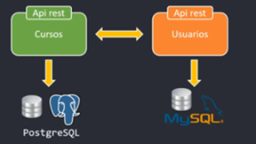
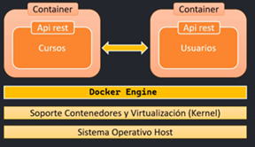
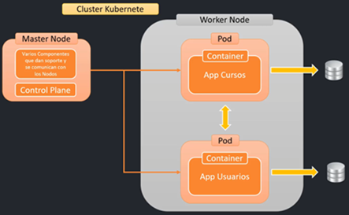
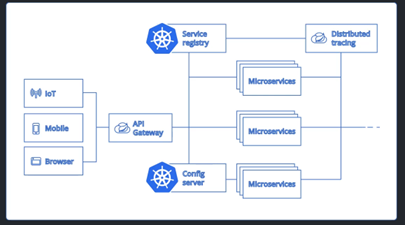

# Microservicios | Guía completa de Docker & Kubernetes

Curso tomado el año `2025` de `udemy` del autor `Andrés Guzmán`.

---

A continuación se muestra un panorama general de lo que veremos en este curso.

1. Iniciaremos con la creación y comunicación de dos microservicios `course-service` y `user-service`.

   

2. Los microservicios los agregaremos en contenedores de `Docker`.

   

3. Orquestaremos los microservicios a través del uso de `Kubernetes`.

   

4. Integraremos `Kubernetes` con `Spring Cloud`.

   
