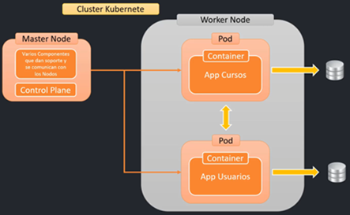

# [Guía Completa de Docker & Kubernetes con Spring Boot](https://www.udemy.com/course/guia-completa-de-docker-kubernetes-con-spring-boot)

---

A continuación se mostrará un panorama general de lo que veremos en este curso.

1. Iniciaremos con la creación y comunicación de dos microservicios `course-service` y `user-service`.

   

2. Los microservicios anteriormente creados los contenerizaremos utilizando `Docker`.

   

3. Orquestaremos los microservicios a través del uso de `Kubernetes`.

   

4. Integraremos `Kubernetes` con `Spring Cloud`.

   
