# [Guía Completa de Docker & Kubernetes con Spring Boot 2023](https://www.udemy.com/course/guia-completa-de-docker-kubernetes-con-spring-boot/)

---

## Panorama general

A continuación se muestra lo que en términos generales se hará en el curso:

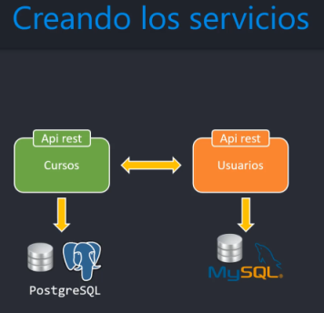

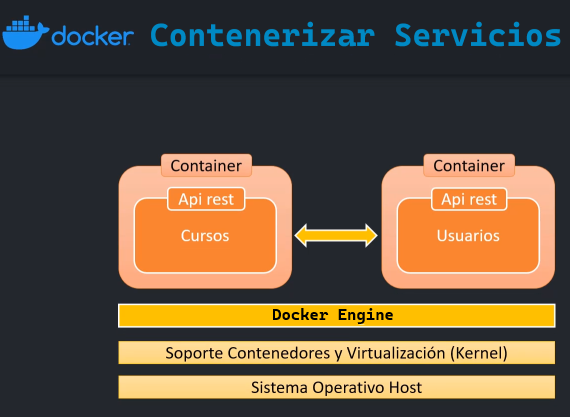

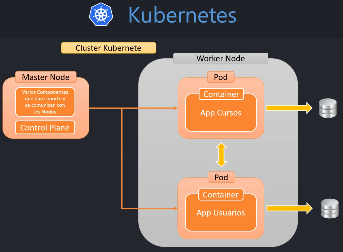

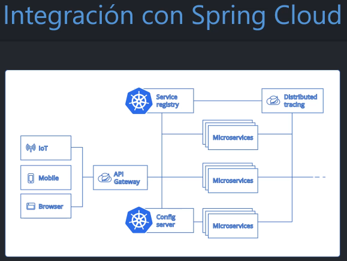

---
Este proyecto contendrá todos los microservicios desarrollados en Spring Boot 3. Para eso trabajaremos
usando `Multiple Maven Modules` en `IntelliJ IDEA`.

## Creación del proyecto raíz multi-module

1. Creamos `Nuevo Proyecto Maven` desde `IntelliJ IDEA`.
2. Eliminamos el directorio `/src` creado por defecto.
3. Agregamos en el `.gitignore` el `.idea`.

### Referencias

Se usaron las siguientes referencias para crear el proyecto **multi-module con maven**:

- [Multiple Maven Modules](https://github.com/magadiflo/springboot-multiple-maven-modules.git)
- [Multi-Module Maven](https://github.com/magadiflo/my-company-project_multi-module-maven)
- [Microservices Project](https://github.com/magadiflo/microservices-project.git)

## Creación del módulo business-domain

Crearemos el módulo `business-domain` que contendrá los microservicios de usuarios y cursos, para eso debemos hacer:

1. Click derecho en el proyecto raíz (docker-kubernetes) **/ New / Module...**
2. Agregamos las siguientes configuraciones:

````
Name: business-domain
Parent: docker-kubernetes
````

Luego de crear nuestro módulo `business-domain`, en el `pom.xml` del proyecto raíz se agrega automáticamente los
siguientes tags:

````xml

<project>
    <!--Other tags-->
    <packaging>pom</packaging>

    <modules>
        <module>business-domain</module>
    </modules>

    <!--Other tags-->
</project>
````

En el código anterior podemos observar que, como nuestro proyecto raíz, es un proyecto padre que albergará módulos,
automáticamente al crear un nuevo módulo se cambia el `<packaging>` que por defecto es implícitamente un `jar` a
un `<packaging>pom</packaging>`. Además, vemos que se agrega el módulo creado entre las etiquetas `<module>`.

Ahora, si abrimos el `pom.xml` de nuestro módulo `business-domain` creado recientemente, veríamos lo siguiente:

````xml

<project>
    <!--Other configurations-->

    <parent>
        <groupId>com.magadiflo.dk</groupId>
        <artifactId>docker-kubernetes</artifactId>
        <version>1.0-SNAPSHOT</version>
    </parent>

    <artifactId>business-domain</artifactId>

</project>
````

Observamos que entre las etiquetas `<parent>` estamos referenciando a nuestro módulo padre y además solo se definió un
`<artifactId>` mientras que el `<groupId>` y `<version>` las hereda de su padre.

## Creación del módulo dk-ms-users (microservicio)

Creamos el proyecto de Spring Boot en la página de [spring initializr](https://start.spring.io/) que corresponderá al
microservicio de users. Una vez descargado el proyecto, lo colocaremos dentro del módulo `business-domain` y
realizaremos configuraciones en el `pom.xml` de todos los módulos:

A continuación se muestra cómo quedaría el `pom.xml` **raíz de todo el proyecto**:

````xml

<project>
    <!--omitted properties from the project tag and modelVersion tag-->
    <parent>
        <groupId>org.springframework.boot</groupId>
        <artifactId>spring-boot-starter-parent</artifactId>
        <version>3.1.4</version>
        <relativePath/> <!-- lookup parent from repository -->
    </parent>

    <groupId>com.magadiflo.dk</groupId>
    <artifactId>docker-kubernetes</artifactId>
    <version>1.0-SNAPSHOT</version>

    <packaging>pom</packaging>

    <modules>
        <module>business-domain</module>
    </modules>

    <properties>
        <java.version>17</java.version>
        <spring-cloud.version>2022.0.4</spring-cloud.version>
    </properties>

    <dependencies>
        <dependency>
            <groupId>org.springframework.boot</groupId>
            <artifactId>spring-boot-starter-test</artifactId>
            <scope>test</scope>
        </dependency>
    </dependencies>

    <dependencyManagement>
        <dependencies>
            <dependency>
                <groupId>org.springframework.cloud</groupId>
                <artifactId>spring-cloud-dependencies</artifactId>
                <version>${spring-cloud.version}</version>
                <type>pom</type>
                <scope>import</scope>
            </dependency>
        </dependencies>
    </dependencyManagement>
</project>
````

Ahora, el `pom.xml` del módulo `business-domain` se convertirá en padre de otros módulos que agregaremos como
el `dk-ms-users` y el `dk-ms-courses` (microservicios), por lo tanto, necesitamos cambiar su `<packaging>` que
implícitamente es `jar` a un `<packaging>pom</packaging>`. Finalmente, el `pom.xml` del módulo `business-domain`
quedaría de la siguiente manera:

````xml

<project>
    <!--omitted properties from the project tag and modelVersion tag-->
    <parent>
        <groupId>com.magadiflo.dk</groupId>
        <artifactId>docker-kubernetes</artifactId>
        <version>1.0-SNAPSHOT</version>
    </parent>

    <artifactId>business-domain</artifactId>

    <packaging>pom</packaging>

    <modules>
        <module>dk-ms-users</module>
    </modules>

    <dependencies>
        <dependency>
            <groupId>org.springframework.boot</groupId>
            <artifactId>spring-boot-starter-data-jpa</artifactId>
        </dependency>
        <dependency>
            <groupId>org.springframework.boot</groupId>
            <artifactId>spring-boot-starter-validation</artifactId>
        </dependency>
        <dependency>
            <groupId>org.springframework.boot</groupId>
            <artifactId>spring-boot-starter-web</artifactId>
        </dependency>
        <dependency>
            <groupId>org.springframework.cloud</groupId>
            <artifactId>spring-cloud-starter-openfeign</artifactId>
        </dependency>
    </dependencies>
</project>
````

Por último, luego de agregar el microservicio `dk-ms-users` dentro del módulo `business-domain` necesitamos configurar
su `pom.xml`:

````xml

<project>
    <!--omitted properties from the project tag and modelVersion tag-->
    <parent>
        <groupId>com.magadiflo.dk</groupId>
        <artifactId>business-domain</artifactId>
        <version>1.0-SNAPSHOT</version>
    </parent>

    <groupId>com.magadiflo.dk.business.domain</groupId>
    <artifactId>dk-ms-users</artifactId>
    <version>0.0.1-SNAPSHOT</version>
    <name>dk-ms-users</name>
    <description>Demo project for Spring Boot</description>

    <dependencies>
        <dependency>
            <groupId>com.mysql</groupId>
            <artifactId>mysql-connector-j</artifactId>
            <scope>runtime</scope>
        </dependency>
    </dependencies>

    <build>
        <plugins>
            <plugin>
                <groupId>org.springframework.boot</groupId>
                <artifactId>spring-boot-maven-plugin</artifactId>
            </plugin>
        </plugins>
    </build>

</project>
````

**NOTA**

> Al estar trabajando con módulo de maven podemos organizar mejor las dependencias del proyecto, esto incluye el
> **poder heredar dependencias**. Por ejemplo, nuestro módulo `dk-ms-users` además de tener su propia dependencia
> definida en su `pom.xml`, tendrá todas las dependencias desde el proyecto raíz, pues tiene como
> padre `business-domain` y este a su vez tiene como padre al proyecto raíz `docker-kubernetes`.

---

# Sección 5: Cliente HTTP Feign: Comunicación entre microservicios

---

## Introducción conectando microservicios

Luego de que hayamos construido nuestros dos microservicios `dk-ms-users` y `dk-ms-courses`, ahora debemos lograr que
estos se comuniquen. Para eso utilizaremos el cliente `HTTP Feign Client`.

La imagen siguiente muestra el panorama general de lo que haremos en esta sección:

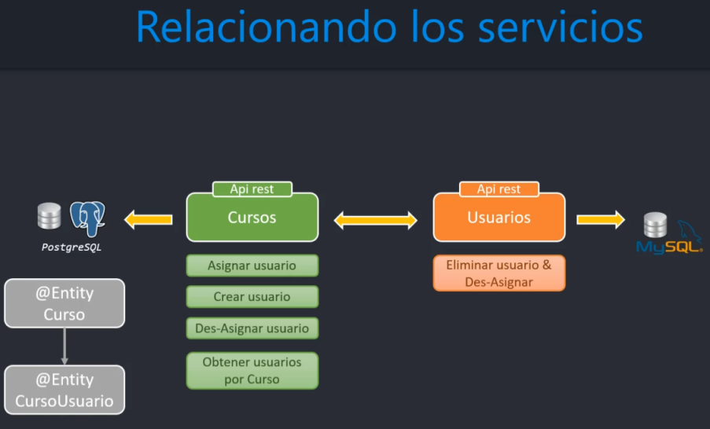

---

# Sección 6: Docker: Introducción

---

## Arquitectura de Docker: Imágenes y Contenedores

A continuación se muestra información gráfica del curso:

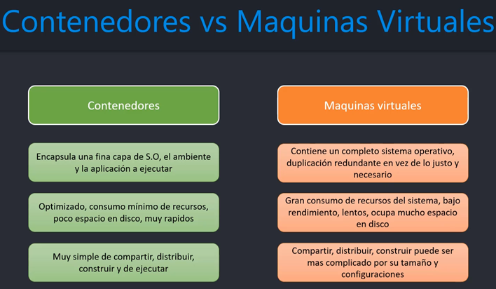

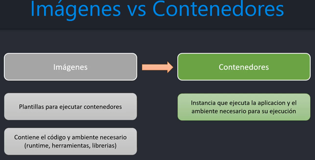

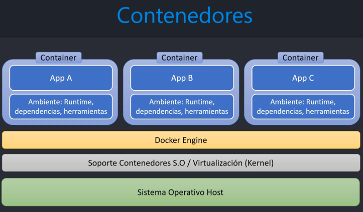

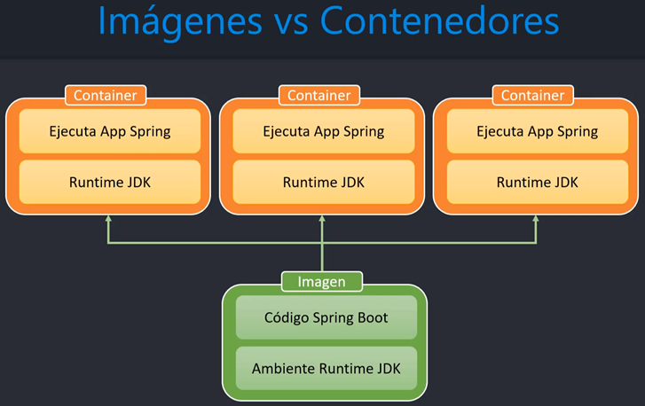

## Generando archivo .jar para dockerizar

Veremos de manera general cómo generar el `jar` de nuestra aplicación de spring boot y cómo ejecutarlo sin el IDE.

Tomaremos como ejemplo el microservicio `dk-ms-users` para generar el `jar` de ejemplo. Nos posicionaremos en la
terminal, en la raíz de ese microservicio y ejecutaremos el siguiente comando.

**¡Importante!** debemos tener levantado la base de datos que está usando ese microservicio, ya que cuando se construya
el jar requerirá realizar los test. Si queremos saltarnos los test podemos agregar `-DskipTests`, en mi caso sí
tengo levantado la base de datos:

````bash
$ mvnw clean package
````

**DONDE**

- `clean`, elimina todo el empaquetado que tengamos en el directorio `/target` que se haya generado en una compilación
  anterior.
- `package`, genera el `jar` dentro del directorio `/target`.

Una vez finalizado el comando anterior, veremos que en el microservicio se creó el directorio `/target` y dentro el
archivo `jar` compilado: `dk-ms-users-0.0.1-SNAPSHOT.jar`.

### Ejecutando jar desde línea de comandos

Supongamos que el `jar` generado anteriormente lo hemos llevado a una máquina remota y lo queremos levantar. Para eso
nos posicionaremos mediante el cmd en el directorio donde hayamos puesto el `jar` y ejecutaremos el comando:

````bash
$ java -jar dk-ms-users-0.0.1-SNAPSHOT.jar
````

A continuación veremos que nuestra aplicación se empieza a levantar. La idea ahora es realizar todos estos pasos pero
usando Docker, es decir `dockerizar` la aplicación, configurar un contenedor, una imagen, etc.

---

# Sección 9: Docker Networks: Comunicación entre contenedores

---

En esta sección veremos **cómo trabajar con redes dentro de docker**, veremos cómo es que los contenedores se pueden
comunicar unos con otros, cómo comunicar un contenedor con el exterior, etc.

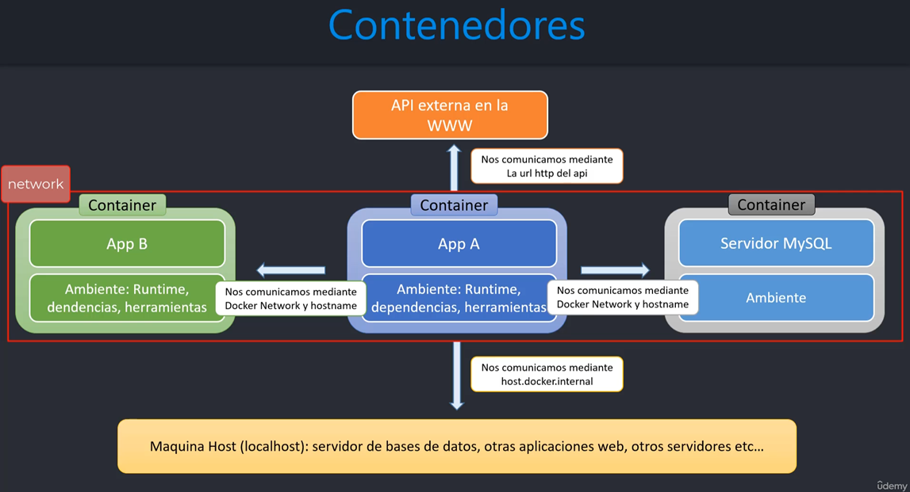

## Dockerizando microservicio cursos y configurando la red o network

Crearemos una red al que le llamaremos `spring-net`, con la finalidad de que los contenedores se conecten a esa red
para que puedan comunicarse:

````bash
$ docker network create spring-net
b56a0e223484cd5905e3890566b0e6767dd6bb28627ea446cedf02f03980c323

$ docker network ls
NETWORK ID     NAME         DRIVER    SCOPE
1cef9871b914   bridge       bridge    local
6dac92048c81   host         host      local
4eea7e69fe4f   none         null      local
b56a0e223484   spring-net   bridge    local
````

## Comunicación entre contenedores

Hasta este punto los dos microservicios de este proyecto `dk-ms-users` y el `dk-ms-courses` cuentan con sus
respectivos `Dockerfile`, así que ahora procederemos a generar una imagen a partir del código fuente.

A continuación se listan las imágenes ya creadas de los microservicios. He creado dos versiones para cada microservicio,
con la finalidad de trabajar siempre con versiones etiquetadas y en lo preferible evitar usar el `latest` como
buena práctica.

````bash
$ docker image ls
REPOSITORY      TAG       IMAGE ID       CREATED       SIZE
dk-ms-courses   latest    b579ec873861   5 hours ago   385MB
dk-ms-courses   v2        b579ec873861   5 hours ago   385MB
dk-ms-users     latest    583a7919c097   5 hours ago   387MB
dk-ms-users     v2        583a7919c097   5 hours ago   387MB
````

Ahora, a partir de las imágenes creadas, crearemos un contenedor para cada uno de ellas:

````bash
$ docker container run -d -p 8001:8001 --rm --name dk-ms-users --network spring-net dk-ms-users:v2
c12fa66e43f3c7dcde7e92e9bfd883c74c3d1298ae0e54d3a030f1980571fcda
````

**NOTA**

- `--name dk-ms-users`, notar que aquí le estamos dando un nombre al contenedor. Este nombre es muy importante, porque
  lo utiliza el microservicio `dk-ms-courses` para poder comunicarse con él. Si vamos a la interfaz `IUserFeignClient`
  del microservicio `dk-ms-courses` veremos que lo estamos usando en la `url` así como se muestra en el siguiente
  fragmento `@FeignClient(url = "dk-ms-users:8001"...)`.
- `--network spring-net`, especificamos la red que creamos para que sea usado por el contenedor.

````bash
$ docker container run -d -p 8002:8002 --rm --name dk-ms-courses --network spring-net dk-ms-courses:v2
040dd8b4457254e7395695602be4fdf8d760c4bd04aa6e1513e0718287a3b44
````

**NOTA**

- `--name dk-ms-courses`, notar que aquí le estamos dando un nombre al contenedor. Este nombre es muy importante, porque
  lo utiliza el microservicio `dk-ms-users` para poder comunicarse con él. Si vamos a la interfaz `ICourseFeignClient`
  del microservicio `dk-ms-users` veremos que lo estamos usando en la `url` así como se muestra en el siguiente
  fragmento `@FeignClient(url = "dk-ms-users:8002"...)`.
- `--network spring-net`, especificamos la red que creamos para que sea usado por el contenedor.

Listamos los dos contenedores creados:

````bash
$ docker container ls -a
CONTAINER ID   IMAGE              COMMAND               CREATED         STATUS         PORTS                    NAMES
040dd8b44572   dk-ms-courses:v2   "java -jar app.jar"   4 seconds ago   Up 2 seconds   0.0.0.0:8002->8002/tcp   dk-ms-courses
c12fa66e43f3   dk-ms-users:v2     "java -jar app.jar"   2 minutes ago   Up 2 minutes   0.0.0.0:8001->8001/tcp   dk-ms-users
````

Si inspeccionamos cada contenedor podemos ver que están usando la misma red que le asignamos:

````bash
$ docker container inspect dk-ms-courses
[
  {
    "Ports": {
        "8002/tcp": [
            {
                "HostIp": "0.0.0.0",
                "HostPort": "8002"
            }
        ]
    },
    "Networks": {
        "spring-net": {
            "IPAMConfig": null,
            ...
        }
    }
  }
]
````

Otra forma de saber qué contenedores tiene la red `spring-net` es ejecutando el siguiente comando de `network`:

````bash
$ docker network inspect spring-net
[
    {
        "Name": "spring-net",
        ...
        "IPAM": {
            ...
            "Config": [
                {
                    "Subnet": "172.18.0.0/16",
                    "Gateway": "172.18.0.1"
                }
            ]
        },
        ...
        "Containers": {
            "040dd8b4457254e7395695602be4fdf8d760c4bd04aa6e1513e0718287a3b445": {
                "Name": "dk-ms-courses",
                "EndpointID": "776a22e5dc5ee363a8b9ad54ea19121f573b6a4b89555bf3f90e906b333ab593",
                "MacAddress": "02:42:ac:12:00:03",
                "IPv4Address": "172.18.0.3/16",
                "IPv6Address": ""
            },
            "c12fa66e43f3c7dcde7e92e9bfd883c74c3d1298ae0e54d3a030f1980571fcda": {
                "Name": "dk-ms-users",
                "EndpointID": "4390745f4b15a05b1a8055dc95b39fb972a626327e411ce35144bf400a2d3693",
                "MacAddress": "02:42:ac:12:00:02",
                "IPv4Address": "172.18.0.2/16",
                "IPv6Address": ""
            }
        },
        ...
    }
]
````

### Funcionamiento de Contenedores

Realizamos una petición al contenedor de usuarios y vemos que nos responde exitosamente:

````bash
$ curl -v http://localhost:8001/api/v1/users | jq

>
< HTTP/1.1 200
< Content-Type: application/json
<
[
  {
    "id": 2,
    "name": "Martin",
    "email": "martin@gmail.com",
    "password": "12345"
  },
  {...}
]
````

Realizamos una petición al contenedor de cursos y vemos que nos responde exitosamente:

````bash
$ curl -v http://localhost:8002/api/v1/courses | jq

>
< HTTP/1.1 200
< Content-Type: application/json

<
[
  {
    "id": 1,
    "name": "Kubernetes",
    "courseUsers": [
      {
        "id": 1,
        "userId": 2
      }
    ],
    "users": []
  },
  {...}
]
````

### Comunicando contenedores

Ahora, verificamos si ambos contenedores se están comunicando. Si realizamos la petición al contenedor courses para ver
el detalle de un curso, éste internamente se tiene que comunicar con el microservicio de usuarios para obtener el
detalle completo de los usuarios que pertenecen al curso consultado.

````bash
$ curl -v http://localhost:8002/api/v1/courses/1 | jq

>
< HTTP/1.1 200
< Content-Type: application/json
<
{
  "id": 1,
  "name": "Kubernetes",
  "courseUsers": [
    {
      "id": 1,
      "userId": 2
    }
  ],
  "users": [
    {
      "id": 2,
      "name": "Martin",
      "email": "martin@gmail.com",
      "password": "12345"
    }
  ]
}
````

Para hacerlo más interesante aún, vamos a crear un usuario y a continuación asignarlo al curso con `id=1`. Todo esto se
realiza mediante la comunicación entre los contenedores:

````bash
$ curl -v -X POST -H "Content-Type: application/json" -d "{\"name\": \"Alicia\", \"email\": \"alicia@gmail.com\", \"password\": \"12345\"}" http://localhost:8002/api/v1/courses/create-user-and-assign-to-course/1 | jq

>
< HTTP/1.1 201
< Location: http://localhost:8002/api/v1/courses/create-user-and-assign-to-course/1/7
< Content-Type: application/json
<
{
  "id": 7,
  "name": "Alicia",
  "email": "alicia@gmail.com",
  "password": "12345"
}
````

## Problema con persistencia de datos en MySQL/Postgres al eliminar el contenedor

Recordemos que en la sección **"Revisando microservicios dockerizados"** hicimos pruebas con todos los contenedores y
todo estuvo funcionando correctamente. Pero, qué pasa si **¡eliminamos los contenedores de las bases de datos y los
volvemos a crear!**

Veamos que actualmente tenemos los contenedores ejecutándose:

````bash
$ docker container ls -a
CONTAINER ID   IMAGE                COMMAND                  CREATED             STATUS             PORTS                               NAMES
4e76998d2314   dk-ms-courses:v2     "java -jar app.jar"      About an hour ago   Up About an hour   0.0.0.0:8002->8002/tcp              dk-ms-courses
152fff6b17b7   dk-ms-users:v2       "java -jar app.jar"      About an hour ago   Up About an hour   0.0.0.0:8001->8001/tcp              dk-ms-users
b28f9c622dc4   postgres:14-alpine   "docker-entrypoint.s…"   2 hours ago         Up 2 hours         0.0.0.0:5433->5432/tcp              postgres-14
c8f8710d2c2b   mysql:8              "docker-entrypoint.s…"   2 hours ago         Up 2 hours         33060/tcp, 0.0.0.0:3307->3306/tcp   mysql-8
````

Ahora eliminaremos no solo los contenedores de las bases de datos, sino también las de los microservicios:

````bash
$ docker container rm -f dk-ms-courses dk-ms-users postgres-14 myslq-8
dk-ms-courses
dk-ms-users
postgres-14
mysql-8

$ docker container ls -a
CONTAINER ID   IMAGE     COMMAND   CREATED   STATUS    PORTS     NAMES
````

Creamos nuevamente todos los contenedores:

````bash
$ docker container run -d -p 3307:3306 --name mysql-8 --network spring-net -e MYSQL_ROOT_PASSWORD=magadiflo -e MYSQL_DATABASE=db_dk_ms_users mysql:8
$ docker container run -d -p 5433:5432 --name postgres-14 --network spring-net -e POSTGRES_PASSWORD=magadiflo -e POSTGRES_DB=db_dk_ms_courses postgres:14-alpine
$ docker container run -d -p 8001:8001 --rm --name dk-ms-users --network spring-net dk-ms-users:v2
$ docker container run -d -p 8002:8002 --rm --name dk-ms-courses --network spring-net dk-ms-courses:v2
````

Listando todos los contenedores, nuevamente los tenemos levantados:

````bash
$ docker container ls -a
CONTAINER ID   IMAGE                COMMAND                  CREATED         STATUS         PORTS                               NAMES
89f41eda9e1e   dk-ms-courses:v2     "java -jar app.jar"      3 minutes ago   Up 3 minutes   0.0.0.0:8002->8002/tcp              dk-ms-courses
fc4fe9c72779   postgres:14-alpine   "docker-entrypoint.s…"   4 minutes ago   Up 4 minutes   0.0.0.0:5433->5432/tcp              postgres-14
6ad6e543218c   dk-ms-users:v2       "java -jar app.jar"      4 minutes ago   Up 4 minutes   0.0.0.0:8001->8001/tcp              dk-ms-users
7071e97c1fe6   mysql:8              "docker-entrypoint.s…"   5 minutes ago   Up 5 minutes   33060/tcp, 0.0.0.0:3307->3306/tcp   mysql-8
````

Hacemos peticiones a los microservicios alojados en los contenedores:

````bash
$ curl -v http://localhost:8001/api/v1/users | jq

>
< HTTP/1.1 200
< Content-Type: application/json
<
[]
````

````bash
$ curl -v http://localhost:8002/api/v1/courses | jq

>
< HTTP/1.1 200
< Content-Type: application/json
<
[]
````

**¡No están los datos registrados en la sección "Revisando microservicios dockerizados"!**

**PROBLEMA**
> Al eliminar los contenedores de las bases de datos, se eliminan también los datos que están almacenados dentro de
> ellos.

## Docker Volumes: La solución al problema de persistencia de datos

En esta sección trabajaremos con **volúmenes**, ya explicaré en qué consisten, pero antes eliminaremos todos los
contenedores para empezar de cero y poder trabajar:

````bash
$ docker container rm -f dk-ms-courses dk-ms-users mysql-8 postgres-14
dk-ms-courses
dk-ms-users
mysql-8
postgres-14

$ docker container ls -a
CONTAINER ID   IMAGE     COMMAND   CREATED   STATUS    PORTS     NAMES
````

**Trabajar con volúmenes nos permitirá configurar que los datos de las bases de datos se guarden fuera del contenedor**,
por ejemplo, en nuestra máquina local, de esa forma si eliminamos el contenedor de las bases de datos, la información
aún persistirá cuando volvamos a crear nuevos contenedores de las mismas bases de datos.

### [Volúmenes (-v o --volume)](https://docs.docker.com/storage/volumes/)

**Los volúmenes son el mecanismo preferido para la persistencia de los datos generados y utilizados por los contenedores
Docker.** Mientras que los **bind mounts** dependen de la estructura de directorios y del sistema operativo de la
máquina anfitriona, **los volúmenes son completamente gestionados por Docker**.

Además, **los volúmenes son a menudo una mejor opción que la persistencia de datos en la capa de escritura de un
contenedor**, porque **un volumen no aumenta el tamaño de los contenedores que lo utilizan**, y el contenido del volumen
existe fuera del ciclo de vida de un contenedor determinado.

`-v o --volume`: **Consta de tres campos**, separados por dos puntos `(:)`. Los campos deben estar en el orden correcto,
y el significado de cada campo no es inmediatamente obvio.

- En el caso de `volúmenes con nombre`, **el primer campo es el nombre del volumen**, y es único en una determinada
  máquina. Para `volúmenes anónimos`, **el primer campo se omite.**
- **El segundo campo** es la **ruta donde el archivo o directorio están montados en el contenedor.**
- **El tercer campo es opcional**, y es una lista de opciones separadas por comas, como `ro`.

### Creando contenedores de bases de datos con volumen

Empezaremos creando el contenedor de MySQL:

````bash
$ docker container run -d -p 3307:3306 --name mysql-8 --network spring-net -e MYSQL_ROOT_PASSWORD=magadiflo -e MYSQL_DATABASE=db_dk_ms_users -v data-mysql:/var/lib/mysql --restart=always mysql:8
795dac7fcc8de72fcb367207af09b1be337605145dfc87763b0b5d497f08beea
````

**DONDE**

- `-v`, la bandera `-v` o `--volume` indica que se configurará un volumen.
- `data-mysql` es el nombre que le daremos al volumen que estamos creando.
- `/var/lib/mysql`, este es el directorio dentro del contenedor de MySQL donde se almacenan los datos de la base de
  datos. Al usar esta opción de montaje de volumen, estás diciendo que deseas que los datos de MySQL se almacenen fuera
  del contenedor en un volumen llamado `data-mysql`.
- `--restart=always` lo colocamos de manera opcional. Lo que hace esta configuración es reiniciar el contenedor cada vez
  que docker se detenga u ocurra algún problema o error, si eso sucede, este contenedor se reiniciará automáticamente.
  Por ejemplo, cuando reiniciemos nuestra pc local se van a detener nuestros contenedores, pero cuando se inicie Docker
  se van a volver a levantar de manera automática. Como dije, es opcional, porque fácilmente lo podemos levantar
  manualmente con `docker start <container_name>`.

La razón por la que se hace esto es para que los datos de MySQL sean persistentes, lo que significa que incluso si el
contenedor se detiene o se elimina, los datos de la base de datos no se perderán. En lugar de almacenar los datos dentro
del contenedor, se almacenan en un volumen externo que puede ser respaldado, copiado y restaurado fácilmente. Esto es
útil en entornos de producción donde la pérdida de datos de la base de datos sería un problema importante.

La configuración de montaje de volumen simplemente redirige la ubicación donde MySQL almacena sus datos, no duplica los
datos.

Aquí está el flujo básico:

1. Cuando utilizas el contenedor de MySQL, los datos se almacenan inicialmente en el directorio `/var/lib/mysql` dentro
   del contenedor.
2. Sin embargo, debido al montaje de volumen `-v data-mysql:/var/lib/mysql`, esos datos no se almacenan en el sistema de
   archivos del contenedor en sí, sino que se almacenan en el volumen `data-mysql`.
3. La información se guarda una sola vez en el volumen. No hay duplicación de datos entre el contenedor y el volumen.
4. El volumen `data-mysql` es persistente, lo que significa que los datos en él se mantendrán incluso si el contenedor
   se detiene o se elimina.

El volumen `data-mysql` se crea en el sistema de archivos del host en el que se ejecuta Docker, no dentro del contenedor
en sí. Docker administra estos volúmenes en una ubicación específica en el sistema de archivos del host, que puede
variar según tu sistema operativo y configuración. En sistemas `Linux`, por ejemplo, los volúmenes suelen estar en el
directorio `/var/lib/docker/volumes`. En otros sistemas operativos,
como `Windows o macOS`, `Docker Desktop gestiona la ubicación de los volúmenes` de manera diferente.

Ahora, crearemos el contenedor de PostgreSQL:

````bash
$ docker container run -d -p 5433:5432 --name postgres-14 --network spring-net -e POSTGRES_PASSWORD=magadiflo -e POSTGRES_DB=db_dk_ms_courses -v data-postgres:/var/lib/postgresql/data --restart=always postgres:14-alpine
67db7f2464abf0439ddc96b3d35c538ccb13a3f482867e7f62dd5f567a40c183
````

Listamos los dos contenedores de bases de datos creados:

````bash
$ docker container ls -a
CONTAINER ID   IMAGE                COMMAND                  CREATED          STATUS          PORTS                               NAMES
795dac7fcc8d   mysql:8              "docker-entrypoint.s…"   7 seconds ago    Up 5 seconds    33060/tcp, 0.0.0.0:3307->3306/tcp   mysql-8
67db7f2464ab   postgres:14-alpine   "docker-entrypoint.s…"   45 seconds ago   Up 43 seconds   0.0.0.0:5433->5432/tcp              postgres-14
````

Podemos ver los volúmenes creados si listamos todos los volúmenes:

````bash
$ docker volume ls
DRIVER    VOLUME NAME
local     42a0a66edf9b44ace0b4afd15093693775ae65224b4a6f1ad9bbd526caac1ca8
local     835dff164f596335497eac94a448fbd3760fb204131f13b06afb02c8a6e7274b
local     4548e93f639bc54e07342cfd783dab2fa9a8a120ba58cd8f3ca187e438551302
local     5875c2ae3923ef62ee137e612a1912a4fcf8d78d0cb69541f586bc8129bd042c
local     849742d75f37588c2bb8f48917a13e0dedeaa0277c78bb13709ce78a0eae4e76
local     b422c2733064096c62568cd7d2bc70ed39a6290d02c3f1ba481542f3a73a199b
local     data-mysql
local     data-postgres
````

### Creando contenedores de los microservicios

Ahora que tenemos los dos contenedores de bases de datos ejecutándose, vamos a crear los dos microservicios:

````bash
$ docker container run -d -p 8001:8001 --rm --name dk-ms-users --network spring-net dk-ms-users:v2
3ac7e8cd0fe7fb5e7bcfd6b809ae7a5f77edce4db191d42c134fafb76719220d

$ docker container run -d -p 8002:8002 --rm --name dk-ms-courses --network spring-net dk-ms-courses:v2
c3f7082715bad1ea476b8725bfbf2303a07537937222f22e75aa0ae4c4ba7b09
````

Verificamos que estén los 4 contenedores creados:

````bash
$ docker container ls -a
CONTAINER ID   IMAGE                COMMAND                  CREATED          STATUS          PORTS                               NAMES
c3f7082715ba   dk-ms-courses:v2     "java -jar app.jar"      5 seconds ago    Up 2 seconds    0.0.0.0:8002->8002/tcp              dk-ms-courses
3ac7e8cd0fe7   dk-ms-users:v2       "java -jar app.jar"      15 seconds ago   Up 13 seconds   0.0.0.0:8001->8001/tcp              dk-ms-users
795dac7fcc8d   mysql:8              "docker-entrypoint.s…"   4 minutes ago    Up 4 minutes    33060/tcp, 0.0.0.0:3307->3306/tcp   mysql-8
67db7f2464ab   postgres:14-alpine   "docker-entrypoint.s…"   4 minutes ago    Up 4 minutes    0.0.0.0:5433->5432/tcp              postgres-14
````

### Registrando datos

A continuación se muestra parte de los registros realizados:

````bash
$ curl -v -X POST -H "Content-Type: application/json" -d "{\"name\": \"Alison\", \"email\":\"alicon@gmail.com\", \"password\": \"12345\"}" http://localhost:8001/api/v1/users | jq

>
< HTTP/1.1 201
< Location: http://localhost:8001/api/v1/users/2
< Content-Type: application/json
{
  "id": 2,
  "name": "Alison",
  "email": "alicon@gmail.com",
  "password": "12345"
}
````

````bash
$ curl -v -X POST -H "Content-Type: application/json" -d "{\"name\": \"Docker\"}" http://localhost:8002/api/v1/courses | jq

>
< HTTP/1.1 201
< Location: http://localhost:8002/api/v1/courses/1
< Content-Type: application/json
{
  "id": 1,
  "name": "Docker",
  "courseUsers": [],
  "users": []
}
````

### Comprobando persistencia de los datos luego de eliminar los contenedores de BD

Ahora, eliminaremos los contenedores de bases de datos:

````bash
$ docker container rm -f mysql-8 postgres-14
mysql-8
postgres-14
````

Listamos los contenedores y vemos que solamente tenemos los de los microservicios:

````bash
$ docker container ls -a
CONTAINER ID   IMAGE              COMMAND               CREATED          STATUS          PORTS                    NAMES
c3f7082715ba   dk-ms-courses:v2   "java -jar app.jar"   13 minutes ago   Up 13 minutes   0.0.0.0:8002->8002/tcp   dk-ms-courses
3ac7e8cd0fe7   dk-ms-users:v2     "java -jar app.jar"   13 minutes ago   Up 13 minutes   0.0.0.0:8001->8001/tcp   dk-ms-users
````

Volvemos a crear los contendores de las bases de datos:

````bash
$ docker container run -d -p 3307:3306 --name mysql-8 --network spring-net -e MYSQL_ROOT_PASSWORD=magadiflo -e MYSQL_DATABASE=db_dk_ms_users -v data-mysql:/var/lib/mysql --restart=always mysql:8
dd97a1adcb0669495113771644c6eeab240f14f1080817bcdfa8442a83ac354

$ docker container run -d -p 5433:5432 --name postgres-14 --network spring-net -e POSTGRES_PASSWORD=magadiflo -e POSTGRES_DB=db_dk_ms_courses -v data-postgres:/var/lib/postgresql/data --restart=always postgres:14-alpine
8bdd9a35f2cb2c9e87ea5edf8308a780adccb41c067882f6c17107ac1807d3ac
````

Verificamos que tenemos todos los contenedores corriendo:

````bash
$ docker container ls -a
CONTAINER ID   IMAGE                COMMAND                  CREATED          STATUS          PORTS                               NAMES
8bdd9a35f2cb   postgres:14-alpine   "docker-entrypoint.s…"   9 seconds ago    Up 7 seconds    0.0.0.0:5433->5432/tcp              postgres-14
dd97a1adcb06   mysql:8              "docker-entrypoint.s…"   32 seconds ago   Up 30 seconds   33060/tcp, 0.0.0.0:3307->3306/tcp   mysql-8
c3f7082715ba   dk-ms-courses:v2     "java -jar app.jar"      14 minutes ago   Up 14 minutes   0.0.0.0:8002->8002/tcp              dk-ms-courses
3ac7e8cd0fe7   dk-ms-users:v2       "java -jar app.jar"      14 minutes ago   Up 14 minutes   0.0.0.0:8001->8001/tcp              dk-ms-users
````

**Finalmente, verificamos si aún siguen los datos que registramos al inicio:**

````bash
$ curl -v http://localhost:8002/api/v1/courses/1 | jq

>
< HTTP/1.1 200
< Content-Type: application/json
{
  "id": 1,
  "name": "Docker",
  "courseUsers": [
    {
      "id": 1,
      "userId": 4
    },
    {
      "id": 2,
      "userId": 1
    }
  ],
  "users": [
    {
      "id": 1,
      "name": "martin",
      "email": "martin@gmail.com",
      "password": "12345"
    },
    {
      "id": 4,
      "name": "Nophy",
      "email": "nophy@gmail.com",
      "password": "12345"
    }
  ]
}
````

Listo, ahora ya podemos estar seguros de que los datos permanecerán almacenados así eliminemos los contenedores de bases
de datos, esto gracias a la ayuda de los `volúmenes`.

## Conectarse desde contenedor cliente de línea de comandos a MySQL/Postgres

### Contenedor Utilitario MySQL

Crearemos un contenedor utilitario que nos permitirá conectarnos mediante la línea de comandos a la base de datos de
MySQL:

````bash
$ docker container run -it --rm --network spring-net mysql:8 bash
bash-4.4# mysql -hmysql-8 -uroot -p
Enter password:
Welcome to the MySQL monitor.  Commands end with ; or \g.
Your MySQL connection id is 48
Server version: 8.2.0 MySQL Community Server - GPL

Copyright (c) 2000, 2023, Oracle and/or its affiliates.

Oracle is a registered trademark of Oracle Corporation and/or its
affiliates. Other names may be trademarks of their respective
owners.

Type 'help;' or '\h' for help. Type '\c' to clear the current input statement.

mysql> show databases
    -> ;
+--------------------+
| Database           |
+--------------------+
| db_dk_ms_users     |
| information_schema |
| mysql              |
| performance_schema |
| sys                |
+--------------------+
5 rows in set (0.06 sec)

mysql> 
````

**DONDE**

- `-it`, habilitar el terminal interactivo.
- `--rm`, cuando se detenga este contenedor, se eliminará automáticamente.
- `--network spring-net`, es importante definir la red, ya que el contenedor de MySQL está en esa red.
- `mysql:8`, imagen a partir de la cual crearemos un contenedor al vuelo, un utilitario.
- `bash` o `/bin/bash`, línea de comando que usaremos dentro del contenedor.

Al ingresar a la línea de comando vemos que escribí lo siguiente:

`mysql -hmysql-8 -uroot -p`, `mysql` corresponde con el cliente mysql. `mysql-8` contenedor al que nos queremos
conectar. `-u` usuario y `-p` password.

### Contenedor Utilitario PostgreSQL

Crearemos un contenedor utilitario que nos permitirá conectarnos mediante la línea de comandos a la base de datos de
PostgreSQL:

````bash
$ docker container run -it --rm --network spring-net postgres:14-alpine psql -h postgres-14 -U postgres
Password for user postgres:
psql (14.9)
Type "help" for help.

postgres=# \l
                                    List of databases
       Name       |  Owner   | Encoding |  Collate   |   Ctype    |   Access privileges
------------------+----------+----------+------------+------------+-----------------------
 db_dk_ms_courses | postgres | UTF8     | en_US.utf8 | en_US.utf8 |
 postgres         | postgres | UTF8     | en_US.utf8 | en_US.utf8 |
 template0        | postgres | UTF8     | en_US.utf8 | en_US.utf8 | =c/postgres          +
                  |          |          |            |            | postgres=CTc/postgres
 template1        | postgres | UTF8     | en_US.utf8 | en_US.utf8 | =c/postgres          +
                  |          |          |            |            | postgres=CTc/postgres
(4 rows)

postgres=# \c db_dk_ms_courses
You are now connected to database "db_dk_ms_courses" as user "postgres".
db_dk_ms_courses=# \dt;
            List of relations
 Schema |     Name     | Type  |  Owner
--------+--------------+-------+----------
 public | course_users | table | postgres
 public | courses      | table | postgres
(2 rows)

db_dk_ms_courses=# \d+ courses
                                                               Table "public.courses"
 Column |          Type          | Collation | Nullable |               Default               | Storage  | Compression | Stats target | Description
--------+------------------------+-----------+----------+-------------------------------------+----------+-------------+--------------+-------------
 id     | bigint                 |           | not null | nextval('courses_id_seq'::regclass) | plain    |             |              |
 name   | character varying(255) |           |          |                                     | extended |             |              |
Indexes:
    "courses_pkey" PRIMARY KEY, btree (id)
Referenced by:
    TABLE "course_users" CONSTRAINT "fkcax8xujvganv6xl9ra0sgouem" FOREIGN KEY (course_id) REFERENCES courses(id)
Access method: heap

db_dk_ms_courses=# SELECT * FROM courses;
 id |    name
----+------------
  1 | Docker
  2 | Kubernetes
  3 | Angular
(3 rows)

db_dk_ms_courses=#
````

**NOTA**
> Como ambos contenedores los creamos con la bandera `--rm` se eliminarán apenas se detengan. Así que como conclusión,
> estos contenedores solo nos sirven para hacer pruebas rápidas, como cuando necesitamos algún cliente para poder
> conectarnos a la base de datos MySQL/PostgreSQL y ver su contenido.

---

# Sección 10: Docker: Arguments y Environment Variables

---

## [Introducción](https://vsupalov.com/docker-arg-env-variable-guide/)

Al utilizar Docker, distinguimos entre dos tipos diferentes de variables: `ARG y ENV`. Se diferencian en el momento del
ciclo de vida de un contenedor-imagen en el que los valores están disponibles.

He aquí un resumen simplificado de las disponibilidades de ARG y ENV. Comenzando con la construcción de una imagen
Docker desde un Dockerfile, hasta que un contenedor se ejecuta. **Los valores** `ARG` **no son utilizables desde dentro
de los contenedores en ejecución.**

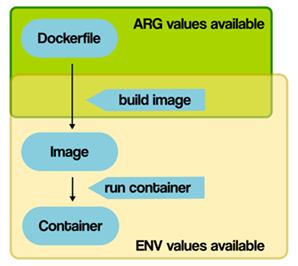

### ARG (build time)

Las variables definidas a través de `ARG` también se conocen como variables en tiempo de compilación. **Solo están
disponibles desde el momento en que son 'anunciadas' en el Dockerfile con una instrucción ARG en el Dockerfile.**

**Los contenedores** en ejecución **no pueden acceder a los valores de las variables ARG.**  Así que cualquier cosa que
ejecute a través de instrucciones `CMD y ENTRYPOINT` no verá esos valores por defecto.

**El beneficio de ARG es, que Docker esperará obtener valores para esas variables.** Al menos, si usted no especifica un
valor por defecto. **Si esos valores no se proporcionan al ejecutar el comando de compilación, habrá un mensaje de
error.** Aquí hay un ejemplo donde Docker se queja durante la construcción:

````bash
# no default value is specified!
ARG some_value
````

### ENV (build time and run time)

Las variables ENV están disponibles tanto durante la construcción como para el futuro contenedor en ejecución. **En el
Dockerfile, son utilizables tan pronto como se introducen con una instrucción ENV.**

A diferencia de ARG, **los valores ENV son accesibles por los contenedores iniciados desde la imagen final.** Los
valores ENV pueden ser anulados al iniciar un contenedor.

A continuación se muestra el resumen entre ARG vs ENV:

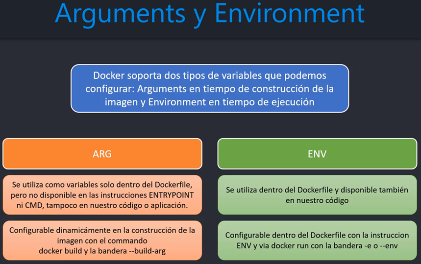

---

# Sección 11: Docker Compose: Orquestador para definir y ejecutar multi-contenedores

---

## [Docker Compose overview](https://docs.docker.com/compose/)

Compose es una herramienta para definir y ejecutar aplicaciones Docker multicontenedor. Con Compose, utilizas un archivo
YAML para configurar los servicios de tu aplicación. Luego, con un solo comando, creas e inicias todos los servicios a
partir de tu configuración.

Compose funciona en todos los entornos; producción, staging, desarrollo, pruebas, así como flujos de trabajo CI. También
dispone de comandos para gestionar todo el ciclo de vida de tu aplicación:

- Iniciar, detener y reconstruir servicios
- Ver el estado de los servicios en ejecución
- Transmitir la salida de registro de los servicios en ejecución
- Ejecutar un comando puntual en un servicio

Las características clave de Compose que lo hacen eficaz son:

- Disponer de múltiples entornos aislados en un único host
- Conservar los datos de volumen cuando se crean contenedores
- Recrear sólo los contenedores que han cambiado
- Soportar variables y mover una composición entre entornos

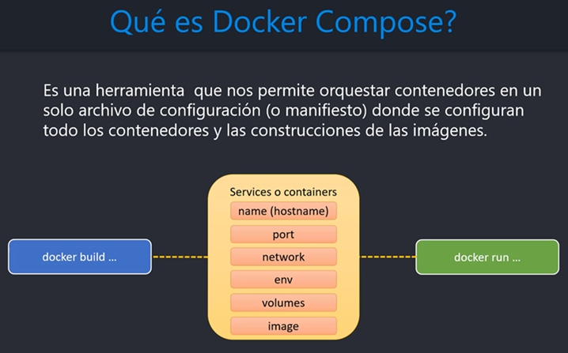

- En `Docker Compose` un contenedor es llamado servicio: `Service == Container`.
- Docker Compose `NO` es adecuado para administrar Múltiples Contenedores en `diferentes máquinas` (diferentes hosts).
- El uso ideal de Docker Compose es para una sola máquina.
- `Kubernetes`, tiene el concepto de Docker Compose, pero es más poderoso porque ya es un cluster con múltiples
  máquinas,
  este `sí es adecuado` para ejecutar múltiples contenedores en `múltiples máquinas` o hosts.