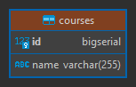
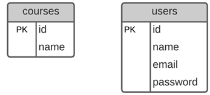
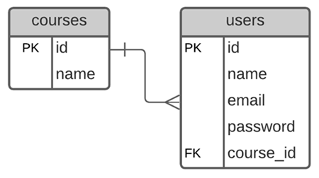
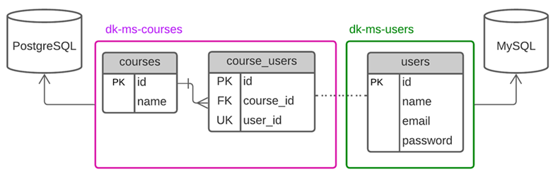
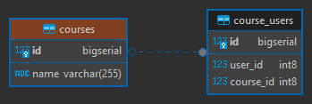

# Microservicio dk-ms-courses

---

## Dependencias iniciales

Inicialmente, nuestro microservicio `dk-ms-courses` tendrá las siguientes dependencias:

````xml
<!--Spring Boot 3.1.4-->
<!--Spring Cloud 2022.0.4-->
<!--Java 17-->
<dependencies>
    <dependency>
        <groupId>org.springframework.boot</groupId>
        <artifactId>spring-boot-starter-data-jpa</artifactId>
    </dependency>
    <dependency>
        <groupId>org.springframework.boot</groupId>
        <artifactId>spring-boot-starter-validation</artifactId>
    </dependency>
    <dependency>
        <groupId>org.springframework.boot</groupId>
        <artifactId>spring-boot-starter-web</artifactId>
    </dependency>
    <dependency>
        <groupId>org.springframework.cloud</groupId>
        <artifactId>spring-cloud-starter-openfeign</artifactId>
    </dependency>

    <dependency>
        <groupId>org.postgresql</groupId>
        <artifactId>postgresql</artifactId>
        <scope>runtime</scope>
    </dependency>
    <dependency>
        <groupId>org.springframework.boot</groupId>
        <artifactId>spring-boot-starter-test</artifactId>
        <scope>test</scope>
    </dependency>
</dependencies>
````

**NOTA**
> Si abrimos el `pom.xml` del microservicio `dk-ms-courses` con un editor, no veremos todas las dependencias como se
> muestra en la parte superior, sino más bien las dependencias que solo manejará ese microservicio, es decir
> solo serán propios de ese microservicio `(conector de postgresql)`; las otras dependencias son comunes
> a los otros proyectos, y para evitar estar agregando una y otra vez, lo que hacemos es organizarlos en los módulos
> padres. Es decir, al final nuestro microservicio `dk-ms-courses` sí las usa, ya que lo está heredando y no solo él lo
> usará sino otros microservicios que lo requiereran.

Como hemos agregado el microservicio `dk-ms-courses` dentro del módulo `business-domain`, tenemos que hacer lo mismo
dentro del `pom.xml` del `business-domain`, por lo que ahora ya no tendríamos solo al `dk-ms-users` sino también al
`dk-ms-courses`:

````xml

<modules>
    <module>dk-ms-users</module>
    <module>dk-ms-courses</module>
</modules>
````

## Configurando el contexto de persistencia JPA/Hibernate

Configuramos el `application.yml` dándole un nombre a este microservicio y estableciéndole un puerto:

````yaml
server:
  port: 8002

spring:
  application:
    name: dk-ms-courses
````

## Añadiendo la clase Entity y el CrudRepository

Creamos la entidad `Course`:

````java

@Entity
@Table(name = "courses")
public class Course {
    @Id
    @GeneratedValue(strategy = GenerationType.IDENTITY)
    private Long id;
    private String name;

    /* Getters, Setters and toString() methods */
}
````

Creamos el repositorio de la entidad course:

````java
public interface ICourseRepository extends CrudRepository<Course, Long> {
}
````

## Agregando el componente Service

Empezamos creando la interfaz que usará nuestro servicio de courses:

````java
public interface ICourseService {
    List<Course> findAllCourses();

    Optional<Course> findCourseById(Long id);

    Course saveCourse(Course course);

    Optional<Course> updateCourse(Long id, Course courseWithChangeData);

    Optional<Boolean> deleteCourseById(Long id);

}
````

Ahora toca implementar el servicio del course:

````java

@Service
public class CourseServiceImpl implements ICourseService {
    private final ICourseRepository courseRepository;

    public CourseServiceImpl(ICourseRepository courseRepository) {
        this.courseRepository = courseRepository;
    }

    @Override
    @Transactional(readOnly = true)
    public List<Course> findAllCourses() {
        return (List<Course>) this.courseRepository.findAll();
    }

    @Override
    @Transactional(readOnly = true)
    public Optional<Course> findCourseById(Long id) {
        return this.courseRepository.findById(id);
    }

    @Override
    @Transactional
    public Course saveCourse(Course course) {
        return this.courseRepository.save(course);
    }

    @Override
    @Transactional
    public Optional<Course> updateCourse(Long id, Course courseWithChangeData) {
        return this.courseRepository.findById(id)
                .map(courseDB -> {
                    courseDB.setName(courseWithChangeData.getName());
                    return courseDB;
                })
                .map(this.courseRepository::save);
    }

    @Override
    @Transactional
    public Optional<Boolean> deleteCourseById(Long id) {
        return this.courseRepository.findById(id)
                .map(courseDB -> {
                    this.courseRepository.deleteById(courseDB.getId());
                    return true;
                });
    }
}
````

## Escribiendo el controlador RestController para cursos

Implementamos los endpoints de nuestro microservicio courses:

````java

@RestController
@RequestMapping(path = "/api/v1/courses")
public class CourseController {
    private final ICourseService courseService;

    public CourseController(ICourseService courseService) {
        this.courseService = courseService;
    }

    @GetMapping
    public ResponseEntity<List<Course>> getAllCourses() {
        return ResponseEntity.ok(this.courseService.findAllCourses());
    }

    @GetMapping(path = "/{id}")
    public ResponseEntity<Course> getCourse(@PathVariable Long id) {
        return this.courseService.findCourseById(id)
                .map(ResponseEntity::ok)
                .orElseGet(() -> ResponseEntity.notFound().build());
    }

    @PostMapping
    public ResponseEntity<Course> saveCourse(@RequestBody Course course) {
        Course courseDB = this.courseService.saveCourse(course);
        URI location = ServletUriComponentsBuilder
                .fromCurrentRequest()
                .path("/{id}")
                .buildAndExpand(courseDB.getId())
                .toUri();
        return ResponseEntity.created(location).body(courseDB);
    }

    @PutMapping(path = "/{id}")
    public ResponseEntity<Course> updateCourse(@PathVariable Long id, @RequestBody Course course) {
        return this.courseService.updateCourse(id, course)
                .map(ResponseEntity::ok)
                .orElseGet(() -> ResponseEntity.notFound().build());
    }

    @DeleteMapping(path = "/{id}")
    public ResponseEntity<Void> deleteCourse(@PathVariable Long id) {
        return this.courseService.deleteCourseById(id)
                .map(wasDeleted -> new ResponseEntity<Void>(HttpStatus.NO_CONTENT))
                .orElseGet(() -> ResponseEntity.notFound().build());
    }

}
````

## Configurando el datasource y conexión con PostgreSQL

En esta sección configuraremos la conexión a la base de datos de PostgreSQL similar a cómo configuramos el DataSource
del microservicio `dk-ms-users`:

````yaml
# Other property

spring:
  # Other property

  datasource:
    url: jdbc:postgresql://localhost:5432/db_dk_ms_courses
    username: postgres
    password: magadiflo
    driver-class-name: org.postgresql.Driver

  jpa:
    database-platform: org.hibernate.dialect.PostgreSQLDialect
    generate-ddl: true
    properties:
      hibernate:
        format_sql: true

logging:
  level:
    org.hibernate.SQL: debug
````

Como tenemos la configuración `spring.jpa.generate-ddl=true`, al ejecutar la aplicación por primera vez, hibernate
creará la tabla `courses` en la BD a partir de la entidad `Course`:



## Probando API Restful de dk-ms-courses

Llegó el momento de probar los endpoints desarrollados en nuestro microservicio `dk-ms-courses`:

- Guardar un course:

````bash
$ curl -v -X POST -H "Content-Type: application/json" -d "{\"name\": \"Docker\"}" http://localhost:8002/api/v1/courses | jq

>
< HTTP/1.1 201
< Location: http://localhost:8002/api/v1/courses/1
< Content-Type: application/json
<
{
  "id": 1,
  "name": "Docker"
}
````

- Listar courses:

````bash
$ curl -v http://localhost:8002/api/v1/courses | jq

>
< HTTP/1.1 200
< Content-Type: application/json
<
[
  {
    "id": 1,
    "name": "Docker"
  }
]
````

- Ver un course:

````bash
$ curl -v http://localhost:8002/api/v1/courses/1 | jq

>
< HTTP/1.1 200
< Content-Type: application/json
<
{
  "id": 1,
  "name": "Docker"
}
````

- Actualizar un course:

````bash
$ curl -v -X PUT -H "Content-Type: application/json" -d "{\"name\": \"Master en Docker\"}" http://localhost:8002/api/v1/courses/1 | jq

>
< HTTP/1.1 200
< Content-Type: application/json
<
{
  "id": 1,
  "name": "Master en Docker"
}

````

- Eliminar un course:

````bash
$ curl -v -X DELETE http://localhost:8002/api/v1/courses/1 | jq

>
< HTTP/1.1 204
< Date: Fri, 20 Oct 2023 04:23:42 GMT
````

## Validando los datos del JSON

Validaremos los campos de nuestra entidad `Course` utilizando las anotaciones proporcionadas por la dependencia
`spring-boot-starter-validation`. Nuestra entidad `Course` quedaría de esta manera:

````java

@Entity
@Table(name = "courses")
public class Course {
    /* other property */
    @NotBlank
    private String name;
    /* other cod */
}
````

Ahora, en nuestro controlador `CourseController` agregaremos la anotación `@Valid` antes del parámetro `course`, que es
el parámetro que queremos validar:

````java

@RestController
@RequestMapping(path = "/api/v1/courses")
public class CourseController {
    /* other code*/
    @PostMapping
    public ResponseEntity<Course> saveCourse(@Valid @RequestBody Course course) {
        /* code */
    }

    @PutMapping(path = "/{id}")
    public ResponseEntity<Course> updateCourse(@PathVariable Long id, @Valid @RequestBody Course course) {
        /* code */
    }
    /* other code*/
}
````

En el controlador anterior vemos la parte de la validación mediante la anotación `@Valid` dentro de los parámetros del
método. **Esta anotación se encargará de validar el objeto que llega, validando los argumentos**. La validación es del
estándar [JSR380](https://beanvalidation.org/2.0-jsr380/). Cuando la validación falla se lanzará
un `MethodArgumentNotValidException` de Spring.
[Fuente: Refactorizando](https://refactorizando.com/validadores-spring-boot/)

Ahora, necesitamos capturar de alguna manera los errores cuando se produzca la excepción
`MethodArgumentNotValidException`, para eso nos apoyaremos del `@RestControllerAdvice` de Spring que no solo se
encargará de manejar la excepción anterior, sino todas aquellas que le definamos.

**NOTA**
> El tutor del curso no usa la anotación `@RestControllerAdvice` sino más bien maneja la excepción dentro del mismo
> método del controlador usando no solo el `@Valid`, sino también la interfaz `BindingResult`, algo así:
>
> `...saveCourse(@Valid @RequestBody Course course, BindingResult result){ if(result.hasErrors()){}}`
>
> En mi caso uso la anotación `@RestControllerAdvice` para tener una clase dedicada al manejo de errores.

Antes de construir la clase con la anotación `@RestControllerAdvice` necesitamos crear un record que tendrá los datos
que siempre mandaremos al cliente cuando ocurra una excepción, de esta manera uniformizamos los mensajes de error.

````java

@JsonInclude(JsonInclude.Include.NON_NULL)
public record ExceptionHttpResponse(LocalDateTime timestamp, int statusCode, HttpStatus httpStatus, String message,
                                    Map<String, String> errors) {
}
````

Observar que en el código anterior estamos usando la anotación `@JsonInclude(JsonInclude.Include.NON_NULL)`, esta
anotación nos permite **ignorar los campos nulos al serializar** la clase java. Esto significa que si un atributo
de nuestro record `ExceptionHttpResponse` tiene un valor nulo, no se incluirá en la respuesta JSON.

Para nuestro caso, veremos en el código siguiente que el campo `errors` para otro tipo de excepciones que no sea el de
validar los campos, será nulo, por lo que con esta anotación estaremos ignorando dicho campo.

Ahora sí, creamos nuestra clase global encargada de manejar las excepciones producidas en nuestra aplicación:

````java

@RestControllerAdvice
public class GlobalExceptionHandler {

    private static final Logger LOG = LoggerFactory.getLogger(GlobalExceptionHandler.class);

    @ExceptionHandler(MethodArgumentNotValidException.class)
    public ResponseEntity<ExceptionHttpResponse> handleValidationErrors(MethodArgumentNotValidException exception) {
        LOG.error("MethodArgumentNotValidException: Error al validar los campos [{}]", exception.getStatusCode());

        Map<String, String> fieldErrors = exception.getFieldErrors().stream()
                .collect(Collectors.toMap(FieldError::getField, this::messageFieldError));

        return this.httpResponse(HttpStatus.BAD_REQUEST, "Error al validar los campos", fieldErrors);
    }

    private ResponseEntity<ExceptionHttpResponse> exceptionHttpResponse(HttpStatus httpStatus, String message) {
        return this.httpResponse(httpStatus, message, null);
    }

    private ResponseEntity<ExceptionHttpResponse> httpResponse(HttpStatus httpStatus, String message, Map<String, String> errors) {
        ExceptionHttpResponse exceptionBody = new ExceptionHttpResponse(LocalDateTime.now(),
                httpStatus.value(), httpStatus, message, errors);
        return ResponseEntity.status(httpStatus).body(exceptionBody);
    }

    private String messageFieldError(FieldError fieldError) {
        return String.format("Ocurrió un error, el campo %s %s", fieldError.getField(), fieldError.getDefaultMessage());
    }
}
````

## Probando validaciones

Registramos un curso con dato inválido:

````bash
$ curl -v -X POST -H "Content-Type: application/json" -d "{\"name\": \"  \"}" http://localhost:8002/api/v1/courses | jq

< HTTP/1.1 400
< Content-Type: application/json
<
{
  "timestamp": "2023-10-20T17:03:28.4812147",
  "statusCode": 400,
  "httpStatus": "BAD_REQUEST",
  "message": "Error al validar los campos",
  "errors": {
    "name": "Ocurrió un error, el campo name must not be blank"
  }
}
````

---

# Sección 5: Cliente HTTP Feign: Comunicación entre microservicios

---

## Creando JPA Entity CourseUser

Hasta este punto tenemos creados nuestros dos microservicios `dk-ms-courses` y `dk-ms-users`, cada uno manejando su
propia base de datos, aunque solo tenemos una tabla en cada microservicio.



Ahora, dejemos a un lado solo por este momento el tema de microservicios y enfoquémonos en la regla de negocio que
trabajaremos en este proyecto:

> Un **usuario** o alumno podrá estar en un único **curso** y en un **curso** podrán estar muchos **usuarios** o
> alumnos. Imaginemos que **cursos** son por ejemplo cursos de deporte donde tú como alumno **puedes elegir
> estar solo en uno de ellos.**
>
> Lo que se quiere lograr es una relación de **One-To-Many**, podríamos haber tomado cualquier otro ejemplo como
> Categoría y Productos y haber realizado todo el proyecto en base a esas entidades, pero bueno, el tutor eligió
> cursos y usuarios para trabajar en todo este proyecto.

Por lo tanto, teniendo nuestra regla de negocio definida, nuestro diagrama ER de Base de Datos quedaría de esta manera:



Ahora, la pregunta es **¿cómo llevamos esa relación a los microservicios, si cada microservicio tiene su propia tabla y
su propia base de datos independiente?**

Lo que podemos hacer es crear una tabla, en una de las bases de datos, que tenga la función de ser un "espejo" de la
tabla de la otra base de datos y donde solo almacene los identificadores, ya que la información completa la tiene la
otra base de datos.

Y ahora, la pregunta es **¿en qué base de datos creamos la nueva tabla que hará de "espejo" de la otra tabla?**.

Analizando la pregunta anterior, llegamos a la conclusión de que la nueva tabla, a la que llamaremos por cierto
`course_users`, debería estar en el microservicio de `dk-ms-courses` ya que de por sí, un curso necesariamente requiere
usuarios que estén registrados en él para que tenga sentido su razón de existencia, por lo tanto, llevaremos ese
control en dicho microservicio.



Para finalizar la idea anterior, la tabla `course_users` sería como si colocáramos la tabla `users` dentro del
microservicio `dk-ms-courses` en su reemplazo, pero aquí únicamente contendrá la `id` de la tabla `users` a través del
atributo `user_id`, es decir, el `user_id` sería como la `id` de la tabla `users`. Ahora, con respecto al atributo
`course_id`, como estamos en el microservicio `dk-ms-courses` aquí sí se convierte en un `FK` explícito que apunta a
la tabla `courses`. Finalmente, con respecto al `id` de la tabla `course_users`, solo nos sirve como clave primaria de
la tabla, para nada más. Aquí los dos atributos importantes son `course_id` y el `user_id`.

Listo, una vez habiendo explicado el funcionamiento de la tabla `course_users`, llega el momento de crear la entidad
correspondiente y establecer la relación.

A continuación creamos la entidad `CourseUser` correspondiente a la tabla `course_users` donde debemos observar varios
aspectos importantes:

1. Definimos la propiedad `userId` correspondiente al campo `user_id` que representa conceptualmente la `Primary Key`
   de la tabla `users` en la tabla `course_users`, es decir, es como si `course_users` fuera la tabla `users`. ¡Ojo!
   estoy diciendo que **representa conceptualmente**, es decir, estamos diciendo a qué hace referencia ese atributo.
   Además, estamos diciendo que dicha propiedad es única para evitar que un usuario pueda estar en varios cursos.
2. Sobreescribimos el método `equals()` para decirle a hibernate que cuando se compare una entidad del tipo
   `CourseUser` lo haga a través de la propiedad `userId`.

````java

@Entity
@Table(name = "course_users")
public class CourseUser {
    @Id
    @GeneratedValue(strategy = GenerationType.IDENTITY)
    private Long id;
    @Column(name = "user_id", unique = true)
    private Long userId;

    /* Getter and setter */

    @Override
    public boolean equals(Object o) {
        if (this == o) return true;
        if (o == null || getClass() != o.getClass()) return false;
        CourseUser that = (CourseUser) o;
        return Objects.equals(userId, that.userId);
    }

    /* toString() method */
}
````

Ahora, en la entidad `Course` establecemos la `relación unidireccional @OneToMany` con la entidad `CourseUser`.
Observemos que además hemos creado dos métodos adicionales `addCourseUser()` y `removeCourseUser()`, precisamente para
eso fue que sobreescribiemos el método `equals()` de la entidad `CourseUser`, para que cuando usemos el
método `removeCourseUser()` elimine la entidad estableciendo la comparación por la propiedad `userId` de la
entidad `CourseUser`:

````java

@Entity
@Table(name = "courses")
public class Course {
    /* id and name properties */

    @JoinColumn(name = "course_id")
    @OneToMany(cascade = CascadeType.ALL, orphanRemoval = true)
    private List<CourseUser> courseUsers = new ArrayList<>();

    /* Getters and Setters from id and name */

    public List<CourseUser> getCourseUsers() {
        return courseUsers;
    }

    public void setCourseUsers(List<CourseUser> courseUsers) {
        this.courseUsers = courseUsers;
    }

    public void addCourseUser(CourseUser courseUser) {
        this.courseUsers.add(courseUser);
    }

    public void removeCourseUser(CourseUser courseUser) {
        this.courseUsers.remove(courseUser);
    }

    /* toString() method */
}
````

## Creando la clase POJO User

Recordemos que en la base de datos del microservicio `dk-ms-courses` únicamente tenemos dos tablas relacionadas:
`courses` y `course_users`. Ahora, cuando recuperemos información de la tabla `course_users` podremos recuperar la
información de la entidad `Course` ya que está en el mismo microservicio, mientras que por el lado de los usuarios,
únicamente nos retornará sus `identificadores`. Entonces, es en ese momento donde requerimos hacer una llamada con
nuestro `Http Feign Client` para solicitarle al microservicio `dk-ms-users` nos retorne la información de todos los
usuarios a partir de su `identificador`, por lo que ahora necesitamos tener en el microservicio `dk-ms-courses` un
objeto que tenga la estructura de la entidad `User`.

Es por eso que crearemos un POJO o un DTO `User`, en mi caso será utilizando un `record` de java. Digamos que esta
clase será una clase de modelo, no un Entity, sino una clase de modelo que representa la estructura de la entidad
`User` del microservicio `dk-ms-users`. Por ejemplo, cuando se solicite todos los usuarios que están registrados en
un curso, esta clase de pojo `User` nos va a servir para representar dicha información en el objeto JSON.

````java
public record User(Long id, String name, String email, String password) {
}
````

Ahora, cuando mostremos información de un curso, necesitamos mostrar información de los usuarios que están registrados
en dicho curso, en ese sentido, necesitamos agregar un atributo de lista de usuarios en la entidad `Course`, pero
debemos anotarlo con `@Transient` para decirle a hibernate que ese atributo no deberá ser mapeado a ningún campo de la
base de datos, sino más bien, es solo un campo que no es parte del contexto de persistencia de JPA/Hibernate. Solo lo
usaremos para poblar los datos de los usuarios.

````java

@Entity
@Table(name = "courses")
public class Course {
    /* other properties */

    @Transient
    private List<User> users = new ArrayList<>();

    /* other methods */

    public List<User> getUsers() {
        return users;
    }

    public void setUsers(List<User> users) {
        this.users = users;
    }

    /* other method */
}
````

Para dejar más claro el código anterior, recordemos que la entidad `Course` tiene una relación de `@OneToMany` con
la entidad `CourseUser`, entonces cuando recuperemos un curso, se recuperarán también los registros asociados al curso
que están registrados en la tabla `course_users`, para ser más exactos, se recuperarán los `identificadores` de los
usuarios que están registrados en la tabla `course_users` y que pertenecen al curso recuperado. Pero **¿de qué
nos sirve tener los ids de los usuarios?**, pues bien, a partir de esos `ids` recuperados, se hará una llamada al
microservicio `dk-ms-users` para recuperar la información completa de los usuarios, una vez recuperados, necesitamos
de alguna manera asociarlo al curso, eh ahí la razón del porqué creamos el atributo
`@Transient private List<User> users`. De esta forma, cuando enviemos información de un curso al cliente, no solo
enviemos los identificadores de los usuarios asignados a ese curso, sino más bien la información completa.

## Revisando tablas de la Base de Datos y agregando métodos de comunicación HTTP

Si ejecutamos nuestra aplicación veremos la creación de la tabla `course_users` y su relación con la tabla `courses`:



Ahora, necesitamos agregar métodos para interactuar con el microservicio `dk-ms-users`, eso lo haremos en
la capa de servicio:

````java
public interface ICourseService {
    /* other methods*/

    Optional<User> assignExistingUserToACourse(User user, Long courseId);

    Optional<User> createUserAndAssignToCourse(User user, Long courseId);

    Optional<User> unassigningAnExistingUserFromACourse(User user, Long courseId);
}
````

Por el momento solo dejaremos definido los métodos, más adelante lo implementaremos, ya que requerimos previamente
configurar el `HTTP Feign Client` con algunos métodos para comunicarnos con el microservicio `dk-ms-users`:

````java

@Service
public class CourseServiceImpl implements ICourseService {
    /* other methods */

    @Override
    public Optional<User> assignExistingUserToACourse(User user, Long courseId) {
        return Optional.empty();
    }

    @Override
    public Optional<User> createUserAndAssignToCourse(User user, Long courseId) {
        return Optional.empty();
    }

    @Override
    public Optional<User> unassigningAnExistingUserFromACourse(User user, Long courseId) {
        return Optional.empty();
    }
}
````

## Escribiendo el Cliente HTTP con Spring Cloud Feign

Como ya tenemos la dependencia de `spring-cloud-starter-openfeign` en nuestro proyecto, podemos usarlo para crear
nuestro cliente rest del tipo Feign. Esto es una alternativa al uso de `RestTemplate` que nos permite realizar llamadas
http para consumir servicios rest.

Lo primero que haremos será agregar la anotación `@EnableFeignClients` en la clase principal del proyecto. Esta
anotación **busca interfaces que declaren ser clientes feign (mediante la anotación @FeignClient).** Además, con
esta anotación **habilitamos en la aplicación el contexto de feign para poder implementar nuestras api rest de forma
declarativa**.

````java

@EnableFeignClients
@SpringBootApplication
public class DkMsCoursesApplication {

    public static void main(String[] args) {
        SpringApplication.run(DkMsCoursesApplication.class, args);
    }

}
````

Ahora, necesitamos crear una interface que hará las peticiones al microservicio de usuarios, esta interfaz estará
anotada con `@FeignClient`. Esta anotación es para interfaces que declara que debe crearse un cliente REST con esa
interfaz (Por ejemplo, **para hacer una inyección en otro componente**). Si SC LoadBalancer está disponible, se
utilizará para equilibrar la carga de las solicitudes del backend, y el equilibrador de carga puede configurarse
utilizando el mismo nombre (es decir, valor) que el cliente feign.

Como se mencionó anteriormente, de forma automática la interfaz anotada con `@FeignClient` se convierte en un componente
de Spring para poder ser inyectado en otro componente. Es como cuando usamos el `CrudRepository<>`, es decir, por debajo
se implementa la funcionalidad.

A continuación se muestra nuestra interfaz `IUserFeignClient`:

````java

@FeignClient(name = "dk-ms-users", url = "localhost:8001", path = "/api/v1/users")
public interface IUserFeignClient {
    @GetMapping(path = "/{id}")
    User getUser(@PathVariable Long id);

    @PostMapping
    User saveUser(@RequestBody User user);
}
````

**DONDE**

- `name`, corresponde al nombre del microservicio que vamos a consumir. En este caso, el nombre lo definimos en
  la propiedad  `spring.application.name` del `application.yml` del microservicio `dk-ms-users`.
- `url`, una URL absoluta o un nombre de host resoluble (el protocolo es opcional).
- `path`, prefijo de ruta que deben utilizar todas las asignaciones a nivel de método.

En el `IUserFeignClient` hemos definido dos métodos que corresponden a los endpoints que consumiremos del microservicio
de usuarios. Si vamos a ese microservicio y vemos esos dos endpoints veremos lo siguiente:

````java
/**
 * En el microservicio dk-ms-users
 */
@RestController
@RequestMapping(path = "/api/v1/users")
public class UserController {

    @GetMapping(path = "/{id}")
    public ResponseEntity<User> getUser(@PathVariable Long id) {
        /* code */
    }

    @PostMapping
    public ResponseEntity<User> saveUser(@Valid @RequestBody User user) {
        /* code */
    }
}
````

**¿Qué podemos concluir?** el método definido en la interfaz `IUserFeignClient` es similar al que está definido en
el controlador que consumiremos. En realidad lo que nos interesa es la firma del endpoint, lo que recibe y lo que
retorna, el nombre del método que definamos en la interfaz da lo mismo. Ahora, otro punto a observar es que en el
endpoint del microservicio de usuarios está retornando un `ResponseEntity<User>` y nosotros hemos colocado en la
interfaz solo `User`, eso está bien, por debajo cuando se construya la implementación, spring lo resolverá y nos
retornará el `User`. Por último en el método `saveUser(@Valid...)` del microservicio de usuarios está la anotación
`@Valid` que permite validar los campos cuando se envíe a ese endpoint un objeto de usuario, pero en nuestra interfaz
`IUserFeignClient` no lo definimos, eso es porque en esta interfaz lo que hacemos es **consumir** el endpoint, mas no
validar los datos.

Ahora que tenemos definido nuestro cliente feign, lo inyectamos en la clase de servicio para su posterior uso:

````java

@Service
public class CourseServiceImpl implements ICourseService {

    private final ICourseRepository courseRepository;
    private final IUserFeignClient userFeignClient;

    public CourseServiceImpl(ICourseRepository courseRepository, IUserFeignClient userFeignClient) {
        this.courseRepository = courseRepository;
        this.userFeignClient = userFeignClient;
    }
    /* other code */
}
````

## Añadiendo e implementando métodos de comunicación HTTP en el Service

Implementamos los métodos que quedaron pendientes en el servicio `CourseServiceImpl`. Recordar que los dejamos
pendientes porque previamente requerimos definir el cliente feign, ya que estos métodos requieren hacer llamadas al
microservicio de usuarios para su funcionamiento.

````java

@Service
public class CourseServiceImpl implements ICourseService {

    /* other properties and methods */

    @Override
    @Transactional
    public Optional<User> assignExistingUserToACourse(User user, Long courseId) {
        return this.courseRepository.findById(courseId)
                .map(courseDB -> {
                    User userMsDB = this.userFeignClient.getUser(user.id()); //<-- Puede ocurrir un FeignException
                    this.assignUserToCourse(userMsDB, courseDB);
                    return userMsDB;
                });
    }

    @Override
    @Transactional
    public Optional<User> createUserAndAssignToCourse(User user, Long courseId) {
        return this.courseRepository.findById(courseId)
                .map(courseDB -> {
                    User userMsDB = this.userFeignClient.saveUser(user); //<-- Puede ocurrir un FeignException
                    this.assignUserToCourse(userMsDB, courseDB);
                    return userMsDB;
                });
    }

    @Override
    @Transactional
    public Optional<User> unassigningAnExistingUserFromACourse(User user, Long courseId) {
        return this.courseRepository.findById(courseId)
                .map(courseDB -> {
                    User userMsDB = this.userFeignClient.getUser(user.id()); //<-- Puede ocurrir un FeignException
                    CourseUser courseUser = new CourseUser();
                    courseUser.setUserId(userMsDB.id());
                    courseDB.removeCourseUser(courseUser);// Aquí comparará por el userId que definimos en el método equals
                    this.courseRepository.save(courseDB);
                    return userMsDB;
                });
    }

    private void assignUserToCourse(User userMsDB, Course courseDB) {
        CourseUser courseUser = new CourseUser();
        courseUser.setUserId(userMsDB.id());
        courseDB.addCourseUser(courseUser);
        this.courseRepository.save(courseDB);
    }
}
````

Notar que en la comunicación que realizamos con `FeignClient` podemos obtener errores, ya que nos comunicamos con otro
microservicio y por ejemplo, se puede ir la red, el servidor del otro microservicio puede caerse, existe latencia,
el usuario que se busca no existe, etc. por lo que de alguna manera debemos manejar el error que se produzca para
enviarle al cliente. En la siguiente sección manejaremos esa posible excepción que pueda ocurrir.

## Añadiendo métodos de comunicación en el controlador rest

Como se comentó en la sección anterior, **necesitamos manejar las excepciones producidas por nuestro cliente Feign**,
eso lo haremos en nuestro `@RestControllerAdvice`:

````java

@RestControllerAdvice
public class GlobalExceptionHandler {
    /* other code */
    @ExceptionHandler(FeignException.class)
    public ResponseEntity<ExceptionHttpResponse> feignException(FeignException exception) {
        String message = "Error en la comunicación entre microservicios: " + exception.getMessage();
        return this.exceptionHttpResponse(HttpStatus.INTERNAL_SERVER_ERROR, message);
    }
    /* other code */
}
````

Ahora sí, con total tranquilidad nos vamos a implementar nuestro controlador:

````java

@RestController
@RequestMapping(path = "/api/v1/courses")
public class CourseController {
    /* other code */
    @PutMapping(path = "/assign-user-to-course/{courseId}")
    public ResponseEntity<User> assignExistingUserToACourse(@RequestBody User user, @PathVariable Long courseId) {
        return this.courseService.assignExistingUserToACourse(user, courseId)
                .map(ResponseEntity::ok)
                .orElseGet(() -> ResponseEntity.notFound().build());
    }

    @PostMapping(path = "/create-user-and-assign-to-course/{courseId}")
    public ResponseEntity<User> createUserAndAssignToCourse(@RequestBody User user, @PathVariable Long courseId) {
        return this.courseService.createUserAndAssignToCourse(user, courseId)
                .map(userDB -> {
                    URI location = ServletUriComponentsBuilder
                            .fromCurrentRequest()
                            .path("/{id}")
                            .buildAndExpand(userDB.id())
                            .toUri();
                    return ResponseEntity.created(location).body(userDB);
                })
                .orElseGet(() -> ResponseEntity.notFound().build());
    }

    @DeleteMapping(path = "/unassigning-user-from-a-course/{courseId}")
    public ResponseEntity<User> unassigningAnExistingUserFromACourse(@RequestBody User user, @PathVariable Long courseId) {
        return this.courseService.unassigningAnExistingUserFromACourse(user, courseId)
                .map(ResponseEntity::ok)
                .orElseGet(() -> ResponseEntity.notFound().build());
    }
    /* other code */
}
````
