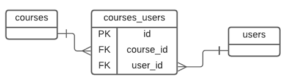
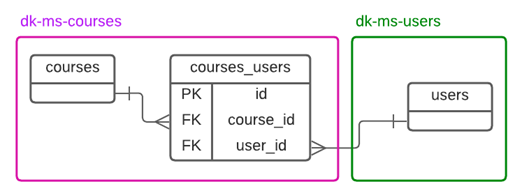
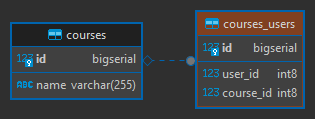

# Microservicio dk-ms-courses

---

## Dependencias iniciales

Inicialmente, nuestro microservicio `dk-ms-courses` tendrá las siguientes dependencias:

````xml
<!--Spring Boot 3.1.4-->
<!--Spring Cloud 2022.0.4-->
<!--Java 17-->
<dependencies>
    <dependency>
        <groupId>org.springframework.boot</groupId>
        <artifactId>spring-boot-starter-data-jpa</artifactId>
    </dependency>
    <dependency>
        <groupId>org.springframework.boot</groupId>
        <artifactId>spring-boot-starter-validation</artifactId>
    </dependency>
    <dependency>
        <groupId>org.springframework.boot</groupId>
        <artifactId>spring-boot-starter-web</artifactId>
    </dependency>
    <dependency>
        <groupId>org.springframework.cloud</groupId>
        <artifactId>spring-cloud-starter-openfeign</artifactId>
    </dependency>

    <dependency>
        <groupId>org.postgresql</groupId>
        <artifactId>postgresql</artifactId>
        <scope>runtime</scope>
    </dependency>
    <dependency>
        <groupId>org.springframework.boot</groupId>
        <artifactId>spring-boot-starter-test</artifactId>
        <scope>test</scope>
    </dependency>
</dependencies>
````

**NOTA**
> Si abrimos el `pom.xml` del microservicio `dk-ms-courses` con un editor, no veremos todas las dependencias como se
> muestra en la parte superior, sino más bien las dependencias que solo manejará ese microservicio, es decir
> solo serán propios de ese microservicio `(conector de postgresql)`; las otras dependencias son comunes
> a los otros proyectos, y para evitar estar agregando una y otra vez, lo que hacemos es organizarlos en los módulos
> padres. Es decir, al final nuestro microservicio `dk-ms-courses` sí las usa, ya que lo está heredando y no solo él lo
> usará sino otros microservicios que lo requiereran.

Como hemos agregado el microservicio `dk-ms-courses` dentro del módulo `business-domain`, tenemos que hacer lo mismo
dentro del `pom.xml` del `business-domain`, por lo que ahora ya no tendríamos solo al `dk-ms-users` sino también al
`dk-ms-courses`:

````xml

<modules>
    <module>dk-ms-users</module>
    <module>dk-ms-courses</module>
</modules>
````

## Configurando el contexto de persistencia JPA/Hibernate

Configuramos el `application.yml` dándole un nombre a este microservicio y estableciéndole un puerto:

````yaml
server:
  port: 8002

spring:
  application:
    name: dk-ms-courses
````

## Añadiendo la clase Entity y el CrudRepository

Creamos la entidad `Course`:

````java

@Entity
@Table(name = "courses")
public class Course {
    @Id
    @GeneratedValue(strategy = GenerationType.IDENTITY)
    private Long id;
    private String name;

    /* Getters, Setters and toString() methods */
}
````

Creamos el repositorio de la entidad course:

````java
public interface ICourseRepository extends CrudRepository<Course, Long> {
}
````

## Agregando el componente Service

Empezamos creando la interfaz que usará nuestro servicio de courses:

````java
public interface ICourseService {
    List<Course> findAllCourses();

    Optional<Course> findCourseById(Long id);

    Course saveCourse(Course course);

    Optional<Course> updateCourse(Long id, Course courseWithChangeData);

    Optional<Boolean> deleteCourseById(Long id);

}
````

Ahora toca implementar el servicio del course:

````java

@Service
public class CourseServiceImpl implements ICourseService {
    private final ICourseRepository courseRepository;

    public CourseServiceImpl(ICourseRepository courseRepository) {
        this.courseRepository = courseRepository;
    }

    @Override
    @Transactional(readOnly = true)
    public List<Course> findAllCourses() {
        return (List<Course>) this.courseRepository.findAll();
    }

    @Override
    @Transactional(readOnly = true)
    public Optional<Course> findCourseById(Long id) {
        return this.courseRepository.findById(id);
    }

    @Override
    @Transactional
    public Course saveCourse(Course course) {
        return this.courseRepository.save(course);
    }

    @Override
    @Transactional
    public Optional<Course> updateCourse(Long id, Course courseWithChangeData) {
        return this.courseRepository.findById(id)
                .map(courseDB -> {
                    courseDB.setName(courseWithChangeData.getName());
                    return courseDB;
                })
                .map(this.courseRepository::save);
    }

    @Override
    @Transactional
    public Optional<Boolean> deleteCourseById(Long id) {
        return this.courseRepository.findById(id)
                .map(courseDB -> {
                    this.courseRepository.deleteById(courseDB.getId());
                    return true;
                });
    }
}
````

## Escribiendo el controlador RestController para cursos

Implementamos los endpoints de nuestro microservicio courses:

````java

@RestController
@RequestMapping(path = "/api/v1/courses")
public class CourseController {
    private final ICourseService courseService;

    public CourseController(ICourseService courseService) {
        this.courseService = courseService;
    }

    @GetMapping
    public ResponseEntity<List<Course>> getAllCourses() {
        return ResponseEntity.ok(this.courseService.findAllCourses());
    }

    @GetMapping(path = "/{id}")
    public ResponseEntity<Course> getCourse(@PathVariable Long id) {
        return this.courseService.findCourseById(id)
                .map(ResponseEntity::ok)
                .orElseGet(() -> ResponseEntity.notFound().build());
    }

    @PostMapping
    public ResponseEntity<Course> saveCourse(@RequestBody Course course) {
        Course courseDB = this.courseService.saveCourse(course);
        URI location = ServletUriComponentsBuilder
                .fromCurrentRequest()
                .path("/{id}")
                .buildAndExpand(courseDB.getId())
                .toUri();
        return ResponseEntity.created(location).body(courseDB);
    }

    @PutMapping(path = "/{id}")
    public ResponseEntity<Course> updateCourse(@PathVariable Long id, @RequestBody Course course) {
        return this.courseService.updateCourse(id, course)
                .map(ResponseEntity::ok)
                .orElseGet(() -> ResponseEntity.notFound().build());
    }

    @DeleteMapping(path = "/{id}")
    public ResponseEntity<Void> deleteCourse(@PathVariable Long id) {
        return this.courseService.deleteCourseById(id)
                .map(wasDeleted -> new ResponseEntity<Void>(HttpStatus.NO_CONTENT))
                .orElseGet(() -> ResponseEntity.notFound().build());
    }

}
````

## Configurando el datasource y conexión con PostgreSQL

En esta sección configuraremos la conexión a la base de datos de PostgreSQL similar a cómo configuramos el DataSource
del microservicio `dk-ms-users`:

````yaml
# Other property

spring:
  # Other property

  datasource:
    url: jdbc:postgresql://localhost:5432/db_dk_ms_courses
    username: postgres
    password: magadiflo
    driver-class-name: org.postgresql.Driver

  jpa:
    database-platform: org.hibernate.dialect.PostgreSQLDialect
    generate-ddl: true
    properties:
      hibernate:
        format_sql: true

logging:
  level:
    org.hibernate.SQL: debug
````

Como tenemos la configuración `spring.jpa.generate-ddl=true`, al ejecutar la aplicación por primera vez, hibernate
creará la tabla `courses` en la BD a partir de la entidad `Course`:


## Probando API Restful de dk-ms-courses

Llegó el momento de probar los endpoints desarrollados en nuestro microservicio `dk-ms-courses`:

- Guardar un course:

````bash
$ curl -v -X POST -H "Content-Type: application/json" -d "{\"name\": \"Docker\"}" http://localhost:8002/api/v1/courses | jq

>
< HTTP/1.1 201
< Location: http://localhost:8002/api/v1/courses/1
< Content-Type: application/json
<
{
  "id": 1,
  "name": "Docker"
}
````

- Listar courses:

````bash
$ curl -v http://localhost:8002/api/v1/courses | jq

>
< HTTP/1.1 200
< Content-Type: application/json
<
[
  {
    "id": 1,
    "name": "Docker"
  }
]
````

- Ver un course:

````bash
$ curl -v http://localhost:8002/api/v1/courses/1 | jq

>
< HTTP/1.1 200
< Content-Type: application/json
<
{
  "id": 1,
  "name": "Docker"
}
````

- Actualizar un course:

````bash
$ curl -v -X PUT -H "Content-Type: application/json" -d "{\"name\": \"Master en Docker\"}" http://localhost:8002/api/v1/courses/1 | jq

>
< HTTP/1.1 200
< Content-Type: application/json
<
{
  "id": 1,
  "name": "Master en Docker"
}

````

- Eliminar un course:

````bash
$ curl -v -X DELETE http://localhost:8002/api/v1/courses/1 | jq

>
< HTTP/1.1 204
< Date: Fri, 20 Oct 2023 04:23:42 GMT
````

## Validando los datos del JSON

Validaremos los campos de nuestra entidad `Course` utilizando las anotaciones proporcionadas por la dependencia
`spring-boot-starter-validation`. Nuestra entidad `Course` quedaría de esta manera:

````java

@Entity
@Table(name = "courses")
public class Course {
    /* other property */
    @NotBlank
    private String name;
    /* other cod */
}
````

Ahora, en nuestro controlador `CourseController` agregaremos la anotación `@Valid` antes del parámetro `course`, que es
el parámetro que queremos validar:

````java

@RestController
@RequestMapping(path = "/api/v1/courses")
public class CourseController {
    /* other code*/
    @PostMapping
    public ResponseEntity<Course> saveCourse(@Valid @RequestBody Course course) {
        /* code */
    }

    @PutMapping(path = "/{id}")
    public ResponseEntity<Course> updateCourse(@PathVariable Long id, @Valid @RequestBody Course course) {
        /* code */
    }
    /* other code*/
}
````

En el controlador anterior vemos la parte de la validación mediante la anotación `@Valid` dentro de los parámetros del
método. **Esta anotación se encargará de validar el objeto que llega, validando los argumentos**. La validación es del
estándar [JSR380](https://beanvalidation.org/2.0-jsr380/). Cuando la validación falla se lanzará
un `MethodArgumentNotValidException` de Spring.
[Fuente: Refactorizando](https://refactorizando.com/validadores-spring-boot/)

Ahora, necesitamos capturar de alguna manera los errores cuando se produzca la excepción
`MethodArgumentNotValidException`, para eso nos apoyaremos del `@RestControllerAdvice` de Spring que no solo se
encargará de manejar la excepción anterior, sino todas aquellas que le definamos.

**NOTA**
> El tutor del curso no usa la anotación `@RestControllerAdvice` sino más bien maneja la excepción dentro del mismo
> método del controlador usando no solo el `@Valid`, sino también la interfaz `BindingResult`, algo así:
>
> `...saveCourse(@Valid @RequestBody Course course, BindingResult result){ if(result.hasErrors()){}}`
>
> En mi caso uso la anotación `@RestControllerAdvice` para tener una clase dedicada al manejo de errores.

Antes de construir la clase con la anotación `@RestControllerAdvice` necesitamos crear un record que tendrá los datos
que siempre mandaremos al cliente cuando ocurra una excepción, de esta manera uniformizamos los mensajes de error.

````java

@JsonInclude(JsonInclude.Include.NON_NULL)
public record ExceptionHttpResponse(LocalDateTime timestamp, int statusCode, HttpStatus httpStatus, String message,
                                    Map<String, String> errors) {
}
````

Observar que en el código anterior estamos usando la anotación `@JsonInclude(JsonInclude.Include.NON_NULL)`, esta
anotación nos permite **ignorar los campos nulos al serializar** la clase java. Esto significa que si un atributo
de nuestro record `ExceptionHttpResponse` tiene un valor nulo, no se incluirá en la respuesta JSON.

Para nuestro caso, veremos en el código siguiente que el campo `errors` para otro tipo de excepciones que no sea el de
validar los campos, será nulo, por lo que con esta anotación estaremos ignorando dicho campo.

Ahora sí, creamos nuestra clase global encargada de manejar las excepciones producidas en nuestra aplicación:

````java

@RestControllerAdvice
public class GlobalExceptionHandler {

    private static final Logger LOG = LoggerFactory.getLogger(GlobalExceptionHandler.class);

    @ExceptionHandler(MethodArgumentNotValidException.class)
    public ResponseEntity<ExceptionHttpResponse> handleValidationErrors(MethodArgumentNotValidException exception) {
        LOG.error("MethodArgumentNotValidException: Error al validar los campos [{}]", exception.getStatusCode());

        Map<String, String> fieldErrors = exception.getFieldErrors().stream()
                .collect(Collectors.toMap(FieldError::getField, this::messageFieldError));

        return this.httpResponse(HttpStatus.BAD_REQUEST, "Error al validar los campos", fieldErrors);
    }

    private ResponseEntity<ExceptionHttpResponse> exceptionHttpResponse(HttpStatus httpStatus, String message) {
        return this.httpResponse(httpStatus, message, null);
    }

    private ResponseEntity<ExceptionHttpResponse> httpResponse(HttpStatus httpStatus, String message, Map<String, String> errors) {
        ExceptionHttpResponse exceptionBody = new ExceptionHttpResponse(LocalDateTime.now(),
                httpStatus.value(), httpStatus, message, errors);
        return ResponseEntity.status(httpStatus).body(exceptionBody);
    }

    private String messageFieldError(FieldError fieldError) {
        return String.format("Ocurrió un error, el campo %s %s", fieldError.getField(), fieldError.getDefaultMessage());
    }
}
````

## Probando validaciones

Registramos un curso con dato inválido:

````bash
$ curl -v -X POST -H "Content-Type: application/json" -d "{\"name\": \"  \"}" http://localhost:8002/api/v1/courses | jq

< HTTP/1.1 400
< Content-Type: application/json
<
{
  "timestamp": "2023-10-20T17:03:28.4812147",
  "statusCode": 400,
  "httpStatus": "BAD_REQUEST",
  "message": "Error al validar los campos",
  "errors": {
    "name": "Ocurrió un error, el campo name must not be blank"
  }
}
````

---

# Sección 5: Cliente HTTP Feign: Comunicación entre microservicios

---

## Creando JPA Entity intermedio CourseUser

Hasta este punto tenemos creados nuestros dos microservicios `dk-ms-users` y `dk-ms-courses`, cada uno manejando su
propia base de datos, aunque solo teemos una tabla en cada microservicio.

Llega el momento de establecer la comunicación entre estos dos microservicios, pero para eso necesitamos entender cómo
es que a nivel de base de datos se relacionan sus tablas.

Si imaginamos un diagrama único de nuestra base de datos veríamos lo siguiente:



Tenemos una relación de `Many-To-Many` entre las tablas `courses` y `users` (serían los alumnos, así lo definió el
tutor) y a partir de la relación de `Many-To-Many` creamos una tabla intermedia llamada `courses_users` quien contendrá
las referencias a las tablas a través de los `Foreign Key`. En esta relación, podemos ver que un usuario puede estar en
muchos cursos, así como un curso puede tener muchos usuarios.

> **Importante**: El conjunto `(course_id, user_id)` deben ser únicos, de esa forma evitamos la duplicidad de datos.

Recordemos que la tabla `users` le pertenece al microservicio `dk-ms-users` y está en `MySQL`, mientras que la tabla
`courses` le pertenece al microservicio `dk-ms-courses` y está en `PostgreSQL`, la pregunta es
**¿dónde va la tabla intermedia?**

Analizando la pregunta anterior, llegamos a la conclusión de que la tabla intermedia `courses_users` debería estar en
el microservicio de `dk-ms-courses` ya que de por sí, un curso necesariamente requiere usuarios que estén registrados
en él para que tenga sentido su razón de existencia, por lo tanto, llevaremos ese control en dicho microservicio.



Listo, una vez habiendo definido la ubicación de la tabla intermedia, llega el momento de crear la entidad
correspondiente y establecer la relación.

A continuación creamos la entidad `CourseUser` correspondiente a la tabla `courses_users` donde debemos observar varios
aspectos importantes:

1. Definimos como únicos al conjunto de columnas `course_id, user_id`.
2. Definimos la propiedad `userId` correspondiente al campo `user_id` que será la `Fokeing Key` que apunta a la `PK`
   de la tabla `users` que está en el microservicio `dk-ms-users`.
3. Sobreescribimos el método `equals()` para decirle a hibernate que cuando se compare una entidad del tipo
   `CourseUser` lo haga a través de la propiedad `userId`.

````java

@Entity
@Table(name = "courses_users", uniqueConstraints = {@UniqueConstraint(columnNames = {"course_id", "user_id"})})
public class CourseUser {
    @Id
    @GeneratedValue(strategy = GenerationType.IDENTITY)
    private Long id;
    @Column(name = "user_id")
    private Long userId;

    /* Getter and setter */

    @Override
    public boolean equals(Object o) {
        if (this == o) return true;
        if (o == null || getClass() != o.getClass()) return false;
        CourseUser that = (CourseUser) o;
        return Objects.equals(userId, that.userId);
    }

    /* toString() method */
}
````

Ahora, en la entidad `Course` establecemos la relación con la entidad `CourseUser`. Observemos que además hemos creado
dos métodos adicionales `addCourseUser()` y `removeCourseUser()`, precisamente para eso fue que sobreescribiemos el
método `equals()` de la entidad `CourseUser`, para que cuando usemos el método `removeCourseUser()` elimine la entidad
estableciendo la comparación por la propiedad `userId` de la entidad `CourseUser`:

````java

@Entity
@Table(name = "courses")
public class Course {
    /* id and name properties */

    @JoinColumn(name = "course_id")
    @OneToMany(cascade = CascadeType.ALL, orphanRemoval = true)
    private List<CourseUser> courseUsers = new ArrayList<>();

    /* Getters and Setters from id and name */

    public List<CourseUser> getCourseUsers() {
        return courseUsers;
    }

    public void setCourseUsers(List<CourseUser> courseUsers) {
        this.courseUsers = courseUsers;
    }

    public void addCourseUser(CourseUser courseUser) {
        this.courseUsers.add(courseUser);
    }

    public void removeCourseUser(CourseUser courseUser) {
        this.courseUsers.remove(courseUser);
    }

    /* toString() method */
}
````

## Creando la clase POJO User

Recordemos que en la base de datos del microservicio `dk-ms-courses` únicamente tenemos dos tablas relacionadas:
`courses` y `courses_users`. Ahora, cuando recuperemos información de la tabla intermedia podremos recuperar la
información de la entidad `Course` ya que está en el mismo microservicio, mientras que por el lado de los usuarios,
únicamente nos retornará sus `identificadores`. Entonces, es en ese momento donde requerimos hacer una llamada con
nuestro `Http Feign Client` para solicitarle al microservicio `dk-ms-users` nos retorne la información de todos los
usuarios a partir de su `identificador`, por lo que ahora necesitamos tener en el microservicio `dk-ms-courses` un
objeto que tenga la estructura de la entidad `User`.

Es por eso que crearemos un POJO o un DTO `User`, en mi caso será utilizando un `record` de java. Digamos que esta
clase será una clase de modelo, no un Entity, sino una clase de modelo que representa la estructura de la entidad
`User` del microservicio `dk-ms-users`. Por ejemplo, cuando se solicite todos los usuarios que están registrados en
un curso, esta clase de pojo `User` nos va a servir para representar dicha información en el objeto JSON.

````java
public record User(Long id, String name, String email, String password) {
}
````

Ahora, cuando mostremos información de un curso, necesitamos mostrar información de los usuarios que están registrados
en dicho curso, en ese sentido, necesitamos agregar un atributo de lista de usuarios en la entidad `Course`, pero
debemos anotarlo con `@Transient` para decirle a hibernate que ese atributo no deberá ser mapeado a ningún campo de la
base de datos, sino más bien, es solo un campo que no es parte del contexto de persistencia de JPA/Hibernate. Solo lo
usaremos para poblar los datos de los usuarios.

````java

@Entity
@Table(name = "courses")
public class Course {
    /* other properties */

    @Transient
    private List<User> users = new ArrayList<>();

    /* other methods */

    public List<User> getUsers() {
        return users;
    }

    public void setUsers(List<User> users) {
        this.users = users;
    }

    /* other method */
}
````

## Revisando tablas de la Base de Datos y agregando métodos de comunicación HTTP

Si ejecutamos nuestra aplicación veremos la creación de la tabla `courses_users` y su relación con la tabla `courses`:



Ahora, necesitamos agregar métodos para interactuar con el microservicio `dk-ms-users`, eso lo haremos en
la capa de servicio:

````java
public interface ICourseService {
    /* other methods*/

    Optional<User> assignExistingUserToACourse(User user, Long courseId);

    Optional<User> createUserAndAssignToCourse(User user, Long courseId);

    Optional<User> unassigningAnExistingUserFromACourse(User user, Long courseId);
}
````

Por el momento solo dejaremos definido los métodos, más adelante lo implementaremos, ya que requerimos previamente
configurar el `HTTP Feign Client` con algunos métodos para comunicarnos con el microservicio `dk-ms-users`:

````java

@Service
public class CourseServiceImpl implements ICourseService {
    /* other methods */

    @Override
    public Optional<User> assignExistingUserToACourse(User user, Long courseId) {
        return Optional.empty();
    }

    @Override
    public Optional<User> createUserAndAssignToCourse(User user, Long courseId) {
        return Optional.empty();
    }

    @Override
    public Optional<User> unassigningAnExistingUserFromACourse(User user, Long courseId) {
        return Optional.empty();
    }
}
````
