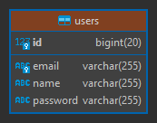

# Microservicio dk-ms-users

---

## Dependencias iniciales

Inicialmente, nuestro microservicio `dk-ms-users` tendrá las siguientes dependencias:

````xml
<!--Spring Boot 3.1.4-->
<!--Spring Cloud 2022.0.4-->
<!--Java 17-->
<dependencies>
    <dependency>
        <groupId>org.springframework.boot</groupId>
        <artifactId>spring-boot-starter-data-jpa</artifactId>
    </dependency>
    <dependency>
        <groupId>org.springframework.boot</groupId>
        <artifactId>spring-boot-starter-validation</artifactId>
    </dependency>
    <dependency>
        <groupId>org.springframework.boot</groupId>
        <artifactId>spring-boot-starter-web</artifactId>
    </dependency>
    <dependency>
        <groupId>org.springframework.cloud</groupId>
        <artifactId>spring-cloud-starter-openfeign</artifactId>
    </dependency>

    <dependency>
        <groupId>com.mysql</groupId>
        <artifactId>mysql-connector-j</artifactId>
        <scope>runtime</scope>
    </dependency>
    <dependency>
        <groupId>org.springframework.boot</groupId>
        <artifactId>spring-boot-starter-test</artifactId>
        <scope>test</scope>
    </dependency>
</dependencies>
````

**NOTA**
> Si abrimos el `pom.xml` del microservicio `dk-ms-users` con un editor, no veremos todas las dependencias como se
> muestra en la parte superior, sino más bien las dependencias que solo manejará ese microservicio, es decir que
> solo serán propios de ese microservicio `(connector de mysql)`; las otras dependencias son comunes
> a los otros proyectos, y para evitar estar agregando una y otra vez, lo que hacemos es organizarlos en los módulos
> padres. Es decir, al final nuestro microservicio `dk-ms-users` sí las usa, ya que lo está heredando y no solo él lo
> usará sino otros microservicios que lo requiereran.

## Configurando el contexto de persistencia JPA/Hibernate

Configuramos el `application.yml` dándole un nombre a este microservicio y estableciéndo un puerto:

````yaml
server:
  port: 8001

spring:
  application:
    name: dk-ms-users
````

Creamos el modelo de entidad `User`:

````java

@Entity
@Table(name = "users")
public class User {
    @Id
    @GeneratedValue(strategy = GenerationType.IDENTITY)
    private Long id;
    private String name;
    @Column(unique = true)
    private String email;
    private String password;

    /* Getters, Setters an toString() methods */
}
````

## Implementando el componente Repository de acceso a datos

Creamos la interfaz de repositorio para nuestra entidad `User`:

````java
public interface IUserRepository extends CrudRepository<User, Long> {

}
````

## Implementando el componente Service

Crearemos primero la interfaz `IUserService` y luego su implementación:

````java
public interface IUserService {
    List<User> findAllUsers();

    Optional<User> findUserById(Long id);

    User saveUser(User user);

    Optional<User> updateUser(Long id, User userWithChangeData);

    Optional<Boolean> deleteUserById(Long id);
}
````

Ahora, crearemos la clase que implementará la interfaz `IUserService`:

````java

@Service
public class UserServiceImpl implements IUserService {
    private final IUserRepository userRepository;

    public UserServiceImpl(IUserRepository userRepository) {
        this.userRepository = userRepository;
    }

    @Override
    @Transactional(readOnly = true)
    public List<User> findAllUsers() {
        return (List<User>) this.userRepository.findAll();
    }

    @Override
    @Transactional(readOnly = true)
    public Optional<User> findUserById(Long id) {
        return this.userRepository.findById(id);
    }

    @Override
    @Transactional
    public User saveUser(User user) {
        return this.userRepository.save(user);
    }

    @Override
    @Transactional
    public Optional<User> updateUser(Long id, User userWithChangeData) {
        return this.userRepository.findById(id)
                .map(userDB -> {
                    userDB.setName(userWithChangeData.getName());
                    userDB.setEmail(userWithChangeData.getEmail());
                    userDB.setPassword(userWithChangeData.getPassword());
                    return userDB;
                })
                .map(this.userRepository::save);
    }

    @Override
    @Transactional
    public Optional<Boolean> deleteUserById(Long id) {
        return this.userRepository.findById(id)
                .map(userDB -> {
                    this.userRepository.deleteById(userDB.getId());
                    return true;
                });
    }
}
````

## Implementando el controlador RestController y métodos handler GET

En esta sección crearemos el RestController para `User` donde implementaremos los dos métodos handler del tipo `GET`:

````java

@RestController
@RequestMapping(path = "/api/v1/users")
public class UserController {
    private final IUserService userService;

    public UserController(IUserService userService) {
        this.userService = userService;
    }

    @GetMapping
    public ResponseEntity<List<User>> getAllUsers() {
        return ResponseEntity.ok(this.userService.findAllUsers());
    }

    @GetMapping(path = "/{id}")
    public ResponseEntity<User> getUser(@PathVariable Long id) {
        return this.userService.findUserById(id)
                .map(ResponseEntity::ok)
                .orElseGet(() -> ResponseEntity.notFound().build());
    }

}
````

## RestController y métodos handler POST y PUT

Creamos los métodos handler `POST` y `PUT` para crear y actualizar un user respectivamente:

````java

@RestController
@RequestMapping(path = "/api/v1/users")
public class UserController {
    /* other code */

    @PostMapping
    public ResponseEntity<User> saveUser(@RequestBody User user) {
        User userDB = this.userService.saveUser(user);
        URI location = ServletUriComponentsBuilder //Extrae información del HttpServletRequest
                .fromCurrentRequest() // Obtiene la URI actual del servlet
                .path("/{id}") // Añadimos el segmento de la URI correspondiente al Id del User
                .buildAndExpand(userDB.getId()) // Reemplazamos el {id} con el Id del usuario recién creado
                .toUri(); // Convertimos lo realizado en una URI
        // Ejm. uriLocation => http://localhost:8001/api/v1/users/5, donde 5 es el id que generó la BD.
        return ResponseEntity.created(location).body(userDB);
    }

    @PutMapping(path = "/{id}")
    public ResponseEntity<User> updateUser(@PathVariable Long id, @RequestBody User user) {
        return this.userService.updateUser(id, user)
                .map(ResponseEntity::ok)
                .orElseGet(() -> ResponseEntity.notFound().build());
    }

}
````

En el código anterior observemos el `ServletUriComponentsBuilder` **(extrae información del** `HttpServletRequest`)
al que le concatenamos varios métodos para finalmente construir una uri dinámica cuyo resultado tendrá esta forma:

````
http://localhost:8001/api/v1/users/5 <-- donde el 5, es un valor representativo, aquí irá el id generado en la bd
````

## RestController y métodos handler DELETE

Implementamos nuestro método handler `DELETE` para eliminar un user:

````java

@RestController
@RequestMapping(path = "/api/v1/users")
public class UserController {
    /* other code*/

    @DeleteMapping(path = "/{id}")
    public ResponseEntity<Void> deleteUser(@PathVariable Long id) {
        return this.userService.deleteUserById(id)
                .map(wasDeleted -> new ResponseEntity<Void>(HttpStatus.NO_CONTENT))
                .orElseGet(() -> ResponseEntity.notFound().build());
    }

}
````

## Configurando application.yml conexión MySQL

A las configuraciones iniciales que teníamos en el `application.yml` le agregamos ahora las configuraciones de la
conexión a nuestra base de datos:

````yaml
# Other configuration

spring:
  # Other configuration

  ## DataSource MySQL
  datasource:
    url: jdbc:mysql://localhost:3306/db_dk_ms_users
    username: root
    password: magadiflo
    driver-class-name: com.mysql.cj.jdbc.Driver

  jpa:
    database-platform: org.hibernate.dialect.MySQLDialect
    generate-ddl: true
    properties:
      hibernate:
        format_sql: true

logging:
  level:
    org.hibernate.SQL: debug
````

**DONDE**

- `spring.jpa.database-platform`, permite configurar el dialecto de la BD a usar en JPA. Cada motor de BD tiene su
  propio dialecto, es decir palabras reservadas que son propias de la BD a usar.
- `spring.jpa.generate-ddl`, esta configuración es específica de Spring Boot y controla si se debe generar
  automáticamente el **DDL (Data Definition Language)** para la base de datos a partir de las entidades JPA de tu
  aplicación. Cuando se establece en true, Spring Boot intentará generar el DDL necesario para crear o actualizar la
  base de datos de acuerdo con tus entidades.
- `logging.level.org.hibernate.SQL`, nos permite **ver las consultas SQL** generadas por Hibernate en la consola de
  registro.

## Probando la conexión a MySQL

Luego de ejecutar la aplicación veremos en el log de IntelliJ IDEA las instrucciones ejecutadas para la creación de
nuestra tabla `users`. Ahora, si abrimos la base de datos veremos dicha tabla:



## Probando API Restful de Users

Luego de haber construido el microservicio dk-ms-users llega el momento de probar todos sus endpoints.

- Crear un user

````bash
$ curl -v -X POST -H "Content-Type: application/json" -d "{\"name\": \"martin\", \"email\":\"martin@gmail.com\", \"password\": \"12345\"}" http://localhost:8001/api/v1/users | jq

>
< HTTP/1.1 201
< Location: http://localhost:8001/api/v1/users/1
< Content-Type: application/json
<
{
  "id": 1,
  "name": "martin",
  "email": "martin@gmail.com",
  "password": "12345"
}
````

- Listar users

````bash
$ curl -v http://localhost:8001/api/v1/users | jq

>
< HTTP/1.1 200
< Content-Type: application/json
<
[
  {
    "id": 1,
    "name": "martin",
    "email": "martin@gmail.com",
    "password": "12345"
  }
]
````

- Obtener un user

````bash
$ curl -v http://localhost:8001/api/v1/users/1 | jq

>
< HTTP/1.1 200
< Content-Type: application/json
<
{
  "id": 1,
  "name": "martin",
  "email": "martin@gmail.com",
  "password": "12345"
}
````

- Actualizar un user

````bash
$ curl -v -X PUT -H "Content-Type: application/json" -d "{\"name\": \"Martin\", \"email\":\"martin.system@gmail.com\", \"password\": \"abcde\"}" http://localhost:8001/api/v1/users/1 | jq

>
< HTTP/1.1 200
< Content-Type: application/json
<
{
  "id": 1,
  "name": "Martin",
  "email": "martin.system@gmail.com",
  "password": "abcde"
}
````

- Eliminar un user

````bash
$  curl -v -X DELETE http://localhost:8001/api/v1/users/1 | jq

>
< HTTP/1.1 204
````

## Validando los datos del JSON

Validaremos los campos de nuestra entidad `User` utilizando las anotaciones proporcionadas por la dependencia
`spring-boot-starter-validation`. Nuestra entidad `User` quedaría de esta manera:

````java

@Entity
@Table(name = "users")
public class User {
    /* other property */
    @NotBlank
    private String name;
    @NotBlank
    @Email
    @Column(unique = true)
    private String email;
    @NotBlank
    private String password;
    /* other cod */
}
````

Ahora, en nuestro controlador `UserController` agregaremos la anotación `@Valid` antes del parámetro `user`, que es el
parámetro que queremos validar:

````java

@RestController
@RequestMapping(path = "/api/v1/users")
public class UserController {
    /* other code*/
    @PostMapping
    public ResponseEntity<User> saveUser(@Valid @RequestBody User user) {
        /* code */
    }

    @PutMapping(path = "/{id}")
    public ResponseEntity<User> updateUser(@PathVariable Long id, @Valid @RequestBody User user) {
        /* code */
    }
    /* other code*/
}
````

En el controlador anterior vemos la parte de la validación mediante la anotación `@Valid` dentro de los parámetros del
método. **Esta anotación se encargará de validar el objeto que llega, validando los argumentos**. La validación es del
estándar [JSR380](https://beanvalidation.org/2.0-jsr380/). Cuando la validación falla se lanzará
un `MethodArgumentNotValidException` de Spring.
[Fuente: Refactorizando](https://refactorizando.com/validadores-spring-boot/)

Ahora, necesitamos capturar de alguna manera los errores cuando se produzca la excepción
`MethodArgumentNotValidException`, para eso nos apoyaremos del `@RestControllerAdvice` de Spring que no solo se
encargará de manejar la excepción anterior, sino todas aquellas que le definamos.

**NOTA**
> El tutor del curso no usa la anotación `@RestControllerAdvice` sino más bien maneja la excepción dentro del mismo
> método del controlador usando no solo el `@Valid`, sino también la interfaz `BindingResult`, algo así:
>
> `...saveUser(@Valid @RequestBody User user, BindingResult result){ if(result.hasErrors()){}}`
>
> En mi caso uso la anotación `@RestControllerAdvice` para tener una clase dedicada al manejo de errores.

Antes de construir la clase con la anotación `@RestControllerAdvice` necesitamos crear un record que tendrá los datos
que siempre mandaremos al cliente cuando ocurra una excepción, de esta manera uniformizamos los mensajes de error.

````java

@JsonInclude(JsonInclude.Include.NON_NULL)
public record ExceptionHttpResponse(LocalDateTime timestamp, int statusCode, HttpStatus httpStatus, String message,
                                    Map<String, String> errors) {
}
````

Observar que en el código anterior estamos usando la anotación `@JsonInclude(JsonInclude.Include.NON_NULL)`, esta
anotación nos permite **ignorar los campos nulos al serializar** la clase java. Esto significa que si un atributo
de nuestro record `ExceptionHttpResponse` tiene un valor nulo, no se incluirá en la respuesta JSON.

Para nuestro caso, veremos en el código siguiente que el campo `errors` para otro tipo de excepciones que no sea el de
validar los campos, será nulo, por lo que con esta anotación estaremos ignorando dicho campo.

Ahora sí, creamos nuestra clase global encargada de manejar las excepciones producidas en nuestra aplicación:

````java

@RestControllerAdvice
public class GlobalExceptionHandler {

    private static final Logger LOG = LoggerFactory.getLogger(GlobalExceptionHandler.class);

    @ExceptionHandler(MethodArgumentNotValidException.class)
    public ResponseEntity<ExceptionHttpResponse> handleValidationErrors(MethodArgumentNotValidException exception) {
        LOG.error("MethodArgumentNotValidException: Error al validar los campos [{}]", exception.getStatusCode());

        Map<String, String> fieldErrors = exception.getFieldErrors().stream()
                .collect(Collectors.toMap(FieldError::getField, this::messageFieldError));

        return this.httpResponse(HttpStatus.BAD_REQUEST, "Error al validar los campos", fieldErrors);
    }

    private ResponseEntity<ExceptionHttpResponse> exceptionHttpResponse(HttpStatus httpStatus, String message) {
        return this.httpResponse(httpStatus, message, null);
    }

    private ResponseEntity<ExceptionHttpResponse> httpResponse(HttpStatus httpStatus, String message, Map<String, String> errors) {
        ExceptionHttpResponse exceptionBody = new ExceptionHttpResponse(LocalDateTime.now(),
                httpStatus.value(), httpStatus, message, errors);
        return ResponseEntity.status(httpStatus).body(exceptionBody);
    }

    private String messageFieldError(FieldError fieldError) {
        return String.format("Ocurrió un error, el campo %s %s", fieldError.getField(), fieldError.getDefaultMessage());
    }
}
````

## Probando validaciones

Registramos un usuario con datos no válidos:

````bash
$ curl -v -X POST -H "Content-Type: application/json" -d "{\"name\": \" \", \"email\":\"test\", \"password\": \"12345\"}" http://localhost:8001/api/v1/users | jq

>
< HTTP/1.1 400
< Content-Type: application/json
<
{
  "timestamp": "2023-10-20T16:59:35.659272",
  "statusCode": 400,
  "httpStatus": "BAD_REQUEST",
  "message": "Error al validar los campos",
  "errors": {
    "name": "Ocurrió un error, el campo name must not be blank",
    "email": "Ocurrió un error, el campo email must be a well-formed email address"
  }
}
````

## Validando si existe el email del usuario en la Base de Datos

Para validar si ya existe un email de un usuario registrado en la base de datos necesitamos crear una **excepción
personalizada** que lanzaremos cuando verifiquemos que se intenta registrar un email ya existente:

````java
public class EmailExistException extends RuntimeException {
    public EmailExistException(String message) {
        super(message);
    }
}
````

Ahora, como ya hemos creado nuestro manejador de excepciones globales, crearemos el método que capturará la
excepción `EmailExistException`:

````java

@RestControllerAdvice
public class GlobalExceptionHandler {
    /* other code*/
    @ExceptionHandler(EmailExistException.class)
    public ResponseEntity<ExceptionHttpResponse> emailExistException(EmailExistException exception) {
        return this.exceptionHttpResponse(HttpStatus.BAD_REQUEST, exception.getMessage());
    }
    /* other code*/
}
````

Necesitamos un método en el `IUserRepository` que nos verifique si el email que le pasamos por parámetro existe en la
base de datos:

````java
public interface IUserRepository extends CrudRepository<User, Long> {
    boolean existsByEmail(String email);
}
````

Finalmente, en nuestra implementación del servicio `UserServiceImpl` validamos la existencia del email en los métodos
`saveUser()` y `updateUser()`:

````java

@Service
public class UserServiceImpl implements IUserService {
    /* other code */

    @Override
    @Transactional
    public User saveUser(User user) {
        if (this.userRepository.existsByEmail(user.getEmail())) {
            throw new EmailExistException("Ya existe un usuario con ese email");
        }
        return this.userRepository.save(user);
    }

    @Override
    @Transactional
    public Optional<User> updateUser(Long id, User userWithChangeData) {
        return this.userRepository.findById(id)
                .map(userDB -> {

                    if (!userWithChangeData.getEmail().equalsIgnoreCase(userDB.getEmail()) &&
                        this.userRepository.existsByEmail(userWithChangeData.getEmail())) {

                        throw new EmailExistException("Ya existe un usuario con ese email");
                    }

                    userDB.setName(userWithChangeData.getName());
                    userDB.setEmail(userWithChangeData.getEmail());
                    userDB.setPassword(userWithChangeData.getPassword());
                    return userDB;
                })
                .map(this.userRepository::save);
    }

    /* other code */
}
````

## Probando validación de email

Ejecutamos la aplicación y registramos un email existente a un nuevo usuario:

````bash
$ curl -v -X PUT -H "Content-Type: application/json" -d "{\"name\": \"Martin\", \"email\":\"nophy@gmail.com\", \"password\": \"abcde\"}" http://localhost:8001/api/v1/users/2 | jq

>
< HTTP/1.1 400
< Content-Type: application/json
<
{
  "timestamp": "2023-10-20T19:36:34.3487394",
  "statusCode": 400,
  "httpStatus": "BAD_REQUEST",
  "message": "Ya existe un usuario con ese email"
}
````

Lo mismo ocurre si tratamos de actualizar un email por otro ya existente en la base de datos:

````bash
$ curl -v -X PUT -H "Content-Type: application/json" -d "{\"name\": \"Martin\", \"email\":\"nophy@gmail.com\", \"password\": \"abcde\"}" http://localhost:8001/api/v1/users/2 | jq

>
< HTTP/1.1 400
< Content-Type: application/json
<
{
  "timestamp": "2023-10-20T19:38:08.4345786",
  "statusCode": 400,
  "httpStatus": "BAD_REQUEST",
  "message": "Ya existe un usuario con ese email"
}
````

## dk-ms-users obtener alumnos por ids

Crearemos un endpoint en nuestro microservicio `dk-ms-users` que nos retornará un grupo de usuarios a partir de los ids
proporcionados.

````java
public interface IUserService {
    /* other methods */
    List<User> findAllById(Iterable<Long> ids);
    /* other methods */
}
````

Implementamos el método anterior en la clase de servicio:

````java

@Service
public class UserServiceImpl implements IUserService {
    /* other methods */
    @Override
    @Transactional(readOnly = true)
    public List<User> findAllById(Iterable<Long> ids) {
        return (List<User>) this.userRepository.findAllById(ids);
    }
    /* other methods */
}
````

Finalmente, en nuestro controlador definimos el endpoint. Notar que el endpoint es del tipo `GET` y está esperando
recibir un `RequestParam` con atributo `userIds`:

````java

@RestController
@RequestMapping(path = "/api/v1/users")
public class UserController {
    /* other methods */
    @GetMapping(path = "/group")
    public ResponseEntity<List<User>> findAllById(@RequestParam List<Long> userIds) {
        return ResponseEntity.ok(this.userService.findAllById(userIds));
    }
    /* other methods */
}
````

Ejecutamos la aplicación y probamos el endpoint. Supongamos que queremos obtener los usuarios que tienen el id 2 y 3:

````bash
$ curl -v http://localhost:8001/api/v1/users/group?userIds=2,3 | jq

>
< HTTP/1.1 200
< Content-Type: application/json
<
[
  {
    "id": 2,
    "name": "Martin",
    "email": "martin@gmail.com",
    "password": "12345"
  },
  {
    "id": 3,
    "name": "nophy",
    "email": "nophy@gmail.com",
    "password": "12345"
  }
]
````
